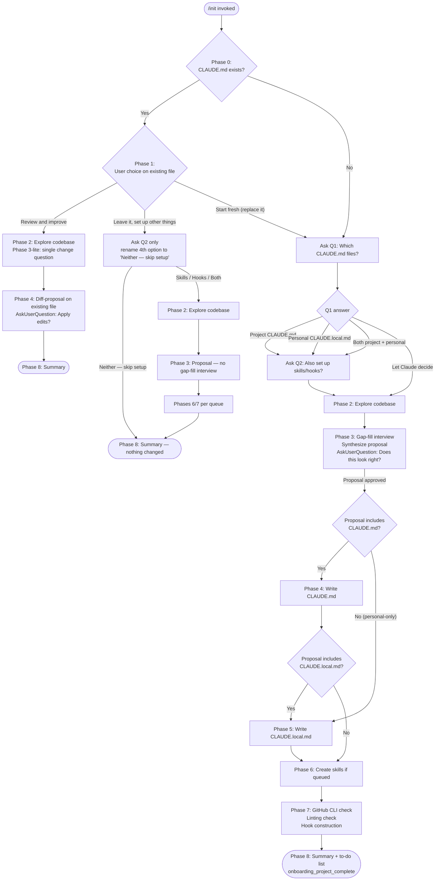

# `/init`

> Analysis basis: CC v2.1.162 bundle.js (AST extraction + Claude interpretation)
> Minimum version: v2.1.162

---

## Overview

The `/init` command bootstraps a project's Claude Code configuration by creating a `CLAUDE.md` file (and optionally skills and hooks) tailored to the repository's detected language, tooling, and workflow conventions. It operates as a multi-phase interactive agent: it first checks for an existing `CLAUDE.md`, asks the user what to set up, explores the codebase with a subagent, fills gaps through a targeted interview, and then writes the approved artifacts. The command fires a `tengu_slate_harbor_experiment` telemetry event and emits the `onboarding_project_complete` event upon completion.

---

## Registration

| Field | Value |
|---|---|
| type | `prompt` |
| name | `init` |
| description | `Initialize new CLAUDE.md file(s) and optional skills/hooks with codebase documentation \| Initialize a new CLAUDE.md file with codebase documentation` |
| loc_byte | `11519423` |
| loc_byte_end | `11519816` |
| loc_line | `7630` |
| handler_method | `getPromptForCommand` |
| handler_method_start | `11519739` |
| handler_method_end | `11519815` |
| prompt_body.length | `22519` characters |
| prompt_body.trace | `conditional; identifier→YJf (var template, 20920 chars); identifier→DJf (var template, 1592 chars)` |
| arbor_handler.name | `getPromptForCommand` |
| arbor_handler.fqn | `claude-2.1.162::getPromptForCommand` |
| arbor_handler.kind | `Method` |
| arbor_handler.resolution_path | `direct` |
| arbor_handler.n_hits | `2` |

Analysis basis: CC v2.1.162 bundle.js:+11519423

---

## Input Branching

The command has more than three distinct execution paths depending on the pre-existing state of `CLAUDE.md` and user-driven phase routing, so a Mermaid flowchart is used.



Analysis basis: CC v2.1.162 bundle.js:+11519739 (handler method), +4008203 (`CLAUDE.md` literal), +4008715 (`onboarding_project_complete`)

---

## Behavioral Spec

The handler is `getPromptForCommand` (arbor resolution: `direct`, FQN `claude-2.1.162::getPromptForCommand`). The method constructs a prompt from two template variables (the main body ~20,920 chars identified as `YJf`, and a supplementary body ~1,592 chars identified as `DJf`) under a conditional, then wraps the result as a `text`-type return value.

Analysis basis: CC v2.1.162 bundle.js:+11519745, +11519787

### Phase 0 — Existing File Detection

```
function checkExistingClaudeMd():
    run shell command: cat ./CLAUDE.md
    if file exists at project root:
        return FOUND
    else:
        return NOT_FOUND
    # Only the project-root file is checked; no tree exploration at this stage
```

Analysis basis: CC v2.1.162 bundle.js:+11519739

### Phase 1 — User Intent Collection

```
function collectUserIntent(existingFileStatus):
    print primer text explaining CLAUDE.md, Skills, and Hooks to first-time users

    if existingFileStatus == FOUND:
        call AskUserQuestion("I found an existing CLAUDE.md. What would you like to do?")
            options: ["Review and improve it", "Leave it, set up other things", "Start fresh (replace it)"]
        match answer:
            "Review and improve it" => route = REVIEW_IMPROVE
            "Leave it, set up other things" =>
                call AskUserQuestion(Q2 with renamed fourth option "Neither — skip setup")
                if answer == "Neither — skip setup":
                    route = SKIP_ALL
                else:
                    route = LEAVE_IT_WITH_EXTRAS
            "Start fresh (replace it)" => route = FRESH_START; proceed to Q1 below
    else (NOT_FOUND or FRESH_START):
        call AskUserQuestion(Q1: "Which CLAUDE.md files should /init set up?")
            options: ["Project CLAUDE.md", "Personal CLAUDE.local.md",
                      "Both project + personal", "Let Claude decide"]
        if answer != "Let Claude decide":
            call AskUserQuestion(Q2: "Also set up skills and hooks?")
                options: ["Skills + hooks", "Skills only", "Hooks only", "Neither, just CLAUDE.md"]
                # Q2 is a hint, not a filter
        else:
            skip Q2; treat as project CLAUDE.md
    return route
```

Analysis basis: CC v2.1.162 bundle.js:+11519739

### Phase 2 — Codebase Exploration

```
function exploreCdoebase():
    launch subagent to read:
        manifest files: package.json, Cargo.toml, pyproject.toml, go.mod, pom.xml, ...
        README, Makefile / build configs, CI config
        existing CLAUDE.md, .claude/rules/, AGENTS.md
        .cursor/rules, .cursorrules, .github/copilot-instructions.md
        .devin/rules/, .windsurf/rules/, .windsurfrules, .clinerules, .mcp.json

    detect:
        build / test / lint commands (especially non-standard)
        languages, frameworks, package manager
        project structure (monorepo vs single module)
        code style rules differing from language defaults
        non-obvious gotchas, required env vars, workflow quirks
        existing .claude/skills/ and .claude/rules/ directories
        formatter config (prettier, biome, ruff, black, gofmt, rustfmt, unified format script)
        git worktrees: run `git worktree list`

    record gaps that cannot be determined from code alone
    return explorationFindings, unansweredGaps
```

Analysis basis: CC v2.1.162 bundle.js:+11519739

### Phase 3 — Gap-Fill Interview and Proposal Synthesis

```
function gapFillAndPropose(route, q1Answer, explorationFindings, unansweredGaps):
    if route == REVIEW_IMPROVE:
        call AskUserQuestion("Has anything changed about how the team works since this CLAUDE.md was written?")
            options: ["No, nothing's changed", "Yes — let me describe"]
        if "Yes — let me describe":
            call AskUserQuestion(free-text follow-up)
        skip to Phase 4 diff-proposal path
        return

    if q1Answer in [PROJECT, BOTH, LET_CLAUDE_DECIDE]:
        ask about codebase practices using unansweredGaps
        # Do NOT mark options as "recommended"

    if q1Answer in [PERSONAL, BOTH]:
        ask about user's role, familiarity, sandbox URLs, worktree topology,
        communication preferences
        # Do NOT mark options as "recommended"

    synthesize preferenceQueue from answers:
        for each finding:
            if deterministic fast shell command => type = HOOK
            if on-demand multi-step workflow  => type = SKILL
            if behavioral guidance            => type = NOTE

    print proposal as assistant text (one bullet per item)
    call AskUserQuestion("Does this look right?")
        options: ["Looks good — proceed", "Drop the hook", "Drop the skill", ...]
        # "Other" option is auto-added by the tool

    return approvedProposal, preferenceQueue
```

Analysis basis: CC v2.1.162 bundle.js:+11519739

### Phase 4 — Write CLAUDE.md

```
function writeClaudeMd(route, approvedProposal, preferenceQueue, explorationFindings):
    if CLAUDE.md not in approvedProposal AND route != REVIEW_IMPROVE:
        return  # skip

    if route == REVIEW_IMPROVE:
        read existing CLAUDE.md
        compare against explorationFindings and Phase 3-lite answer
        produce diff: additions and removals each with one-line reason
        call AskUserQuestion("Apply these edits?")
            options: ["Apply all", "Let me pick which", "Skip — leave it as is"]
        apply approved diffs; return

    # Fresh write path
    content = prefix header:
        "# CLAUDE.md\n\nThis file provides guidance to Claude Code (claude.ai/code) when working with code in this repository."

    include ONLY lines that pass: "Would removing this cause Claude to make mistakes?"
        - Non-standard build/test/lint commands
        - Code style rules differing from language defaults
        - Testing quirks and single-test invocation patterns
        - Repo etiquette (branch naming, PR conventions, commit style)
        - Required env vars or setup steps
        - Non-obvious gotchas or architectural decisions
        - Important content from other AI tool configs (AGENTS.md, .cursorrules, etc.)

    exclude:
        - File-by-file structure (discoverable by reading code)
        - Standard language conventions
        - Generic advice
        - Detailed API docs (use @path/to/import references instead)
        - Frequently changing info (reference source with @path/to/import)
        - Long tutorials (move to separate file + @import, or to a skill)
        - Commands obvious from manifest files

    consume NOTE entries from preferenceQueue where target == CLAUDE.md
        append each as concise line in most relevant section

    if multiple concerns detected:
        suggest organizing into .claude/rules/ sub-files (code-style.md, testing.md, security.md)
    if monorepo or multi-module:
        mention subdirectory CLAUDE.md files; offer to create them

    write file to ./CLAUDE.md
```

Analysis basis: CC v2.1.162 bundle.js:+4008203 (`CLAUDE.md` literal at +4008203), +11519739

### Phase 5 — Write CLAUDE.local.md

```
function writeClaudeLocalMd(approvedProposal, preferenceQueue, explorationFindings, worktreeTopology):
    if CLAUDE.local.md not in approvedProposal:
        return

    if CLAUDE.local.md already exists:
        read existing file
        propose specific additions only; do not silently overwrite

    if worktreeTopology == SIBLING_EXTERNAL:
        write personal content to ~/.claude/<project-name>-instructions.md
        content of CLAUDE.local.md = one-line stub: "@~/.claude/<project-name>-instructions.md"
        # Never put this import in project CLAUDE.md
    else:
        write personal content directly to ./CLAUDE.local.md
        include: role, familiarity, sandbox URLs, test accounts, communication preferences

    consume NOTE entries from preferenceQueue where target == CLAUDE.local.md

    add "CLAUDE.local.md" to project .gitignore
```

Analysis basis: CC v2.1.162 bundle.js:+11519739

### Phase 6 — Create Skills

```
function createSkills(approvedProposal, preferenceQueue, explorationFindings):
    if no skill entries in approvedProposal:
        return

    if .claude/skills/ exists:
        review existing skills; do not overwrite

    # First: consume queued skill preferences
    for each SKILL entry in preferenceQueue:
        name = derive from preference description
        body = user's own words + Phase 2 findings (test commands, deploy targets, etc.)
        if preference maps to existing bundled skill:
            write additive project skill; tell user bundled one still exists
        if preference is underspecified:
            call AskUserQuestion follow-up for missing detail
        write .claude/skills/<skill-name>/SKILL.md with YAML frontmatter

    # Then: suggest additional skills from codebase evidence
    for each repeatable workflow or reference-knowledge area found:
        propose: name, one-line purpose, reason it fits this repo
```

Skill file format:

```
---
name: <skill-name>
description: <what the skill does and when to use it>
---

<Instructions for Claude>
```

For side-effect workflows, add `disable-model-invocation: true` and use `$ARGUMENTS` for input.

Analysis basis: CC v2.1.162 bundle.js:+11519739

### Phase 7 — Additional Optimizations

```
function suggestOptimizations(approvedProposal, preferenceQueue, explorationFindings, q1Answer):
    # GitHub CLI check
    run: which gh  (or where gh on Windows)
    if gh missing AND git remote -v contains github.com:
        call AskUserQuestion("Install GitHub CLI?")
            explain: enables Claude to help with commits, PRs, issues, code review

    # Linting check
    if Phase 2 found no lint config for project's language:
        call AskUserQuestion("Set up linting?")
            explain: catches issues early; gives Claude fast feedback on its own edits

    # Hook construction
    if any HOOK entries in approvedProposal:
        determine target file:
            if q1Answer == PROJECT => .claude/settings.json
            if q1Answer == PERSONAL => .claude/settings.local.json
            if q1Answer == BOTH or ambiguous => ask once for all hooks

        for each hook entry (or formatter fallback if formatter found but no format hook queued):
            map preference to event/matcher:
                "after every edit"              => PostToolUse, matcher: Write|Edit
                "when Claude finishes"          => Stop event
                "before running bash"           => PreToolUse, matcher: Bash
                "before committing" (literal)   => NOT a hooks.json hook;
                                                   route to git pre-commit hook; offer to write one
                                                   if user means "before I review" => Stop; probe

            # Load hook reference ONCE per /init run
            invoke Skill tool: skill='update-config', args='[hooks-only] <summary>'
            follow "Constructing a Hook" flow:
                dedup check → construct → pipe-test raw → wrap →
                write JSON → jq -e validate → live-proof → cleanup → handoff

    act on each "yes" before proceeding
```

Analysis basis: CC v2.1.162 bundle.js:+11519739, +4008715 (`onboarding_project_complete`)

### Phase 8 — Summary and Next Steps

```
function summarizeAndSuggest(writtenArtifacts, explorationFindings, phase7Gaps):
    recap each written file and key points it contains
    remind user: files are a starting point; run /init again anytime to re-scan

    build to-do list (most impactful first), include only items relevant to THIS repo:
        if frontend detected (React/Vue/Svelte):
            suggest: /plugin install frontend-design@claude-plugins-official
            suggest: /plugin install playwright@claude-plugins-official
        if phase7Gaps not resolved (user said no to GitHub CLI / linting):
            list each with one-line reason why it helps
        if tests missing or sparse:
            suggest setting up a test framework
        always include:
            "/plugin install skill-creator@claude-plugins-official" (skill creation/eval)
            "Browse official plugins with /plugin"

    emit telemetry: onboarding_project_complete
```

Analysis basis: CC v2.1.162 bundle.js:+4008715

---

## State & Side Effects

| Item | Detail |
|---|---|
| Telemetry — `tengu_config_parse_error` | Fired when the configuration file cannot be parsed (bundle.js:+3257134) |
| Telemetry — `tengu_config_lock_contention` | Fired when config lock acquisition exceeds the expected threshold (bundle.js:+3254559) |
| Telemetry — `tengu_config_stale_write` | Fired when a stale config write is detected (bundle.js:+3254695) |
| Telemetry — `tengu_config_auth_loss_prevented` | Fired when a write that would erase cached auth credentials is blocked; see literal `"saveConfigWithLock: re-read config is missing auth..."` (bundle.js:+3255038, +3254886) |
| Telemetry — `tengu_feature_sad` | Fired on feature-flag evaluation failure (bundle.js:+1008376) |
| Telemetry — `tengu_feature_ok` | Fired on successful feature-flag evaluation (bundle.js:+1008233) |
| Telemetry — `tengu_slate_harbor_experiment` | Fired during command invocation; A/B experiment tracking (bundle.js:+11496314) |
| Onboarding event — `onboarding_project_complete` | String literal emitted (via `hH`/`Z6` path) at end of successful init flow (bundle.js:+4008715) |
| File writes | `./CLAUDE.md`, `./CLAUDE.local.md` (if personal chosen), `.claude/skills/<name>/SKILL.md` (per skill), `.claude/settings.json` or `.claude/settings.local.json` (per hook), `.gitignore` update |
| Config lock | `jj_` acquires a file lock before writing config; lock contention warning fires after 100 ms (literal `100` at bundle.js:+3254464; warning text at +3254470) |
| Config backup rotation | `DYH`/`Xj_` path maintains a `backups` directory (literal `"backups"` at +3256071); up to 5 rotated backups (literal `5` at +3255489); backup filename contains `.backup.` segment (literal `".backup."` at +3255356) |
| Auth-loss guard | `jj_` refuses to overwrite config if re-read copy is missing auth present in cache; see literal at bundle.js:+3254886 and `"saveCurrentProjectConfig fallback..."` at +3258504 |
| File watcher registration | `bWL` registers a file watcher (`o18.watchFile`) and unregisters (`o18.unwatchFile`) for config file monitoring during the session |
| Git worktree detection | Phase 2 runs `git worktree list`; result influences CLAUDE.local.md placement strategy |
| Experiment routing | `rJ_` emits `GrowthbookExperimentEvent` (literal at +3226813) and fires `growthbook_experiment` telemetry (literal at +3227264) for A/B assignment |

---

## Version History

| Version | Change |
|---|---|
| v2.1.162 | Initial analysis |

---

## Common Mistakes

1. **Invoking `/init` expecting a non-interactive run** — the command is deliberately interactive; it always calls `AskUserQuestion` at least once (Phase 1). Scripts or CI pipelines that pipe no input will stall.
2. **Assuming Q1 and Q2 are asked together** — the prompt explicitly instructs the agent to call `AskUserQuestion` with only Q1 first, and to issue Q2 only after receiving the Q1 answer. Merging them into one call violates the spec.
3. **Expecting `/init` to overwrite an existing CLAUDE.local.md silently** — Phase 5 reads the existing file and proposes additions; it will never silently overwrite.
4. **Putting the `@~/.claude/<project-name>-instructions.md` import line in project CLAUDE.md** — the prompt explicitly prohibits this; the stub must only go in CLAUDE.local.md for sibling/external worktree layouts.
5. **Assuming the "Let Claude decide" option causes Q2 to be asked** — that option skips Q2 entirely and routes directly to Phase 2.
6. **Treating Q2 as a hard filter** — Q2 is described as "a hint, not a filter." The Phase 3 proposal may deviate from the Q2 answer if the codebase evidence points to better-fitting artifact types; the deviation is noted at the top of the proposal.
7. **Running `/init` inside a worktree subdirectory and expecting correct CLAUDE.md placement** — Phase 0 checks only `./CLAUDE.md` at the project root; running from a subdirectory may produce incorrect detection.

---

Note: index built via Arbor fallback; some signals (telemetry, literals) may be missing — see arbor-fallback.js.

---

## Appendix — Identifier Mapping

> For bundle debugging only. Identifiers change across versions.

| Identifier | Role |
|---|---|
| `__handler_init` | Synthetic BFS entry point for the `/init` command handler; not a real bundle symbol |
| `knH` | Top-level init orchestration function called from the handler |
| `nO` | Config or context initialization helper called by `knH` |
| `C6` | File-watcher and config reader setup function |
| `i6` | Logger / debug-emit utility used throughout |
| `zj_` | Config schema validator or accessor |
| `DYH` | Config file read/write function (reads UTF-8, handles ENOENT/EEXIST, manages backups) |
| `bWL` | File-watcher registration and lifecycle manager (`o18.watchFile` / `o18.unwatchFile`) |
| `E99` | CLAUDE.md presence check or workspace bootstrap helper |
| `B0_` | Workspace or project-root resolution function |
| `x6` | Path resolution utility |
| `aQ6` | Async helper or promise wrapper |
| `qD` | Project config save function (guards against auth-loss; emits `saveCurrentProjectConfig` warning) |
| `jj_` | Config save-with-lock function (acquires lock, backs up, writes, validates) |
| `_` | General utility / string helper |
| `L` | Filesystem abstraction layer (statSync, mkdirSync, readdirStringSync, copyFileSync, unlinkSync) |
| `Pj1` | Config merge / Object.assign wrapper |
| `v` | Log-level or verbosity router (routes to debug, info, warn levels) |
| `c` | Telemetry event emitter |
| `V8` | Error constructor or error-type discriminator |
| `Xw6` | Auth-presence check utility (guards stale-write and auth-loss paths) |
| `A` | String normalization helper (toLowerCase) |
| `SH` | JSON serialization wrapper (JSON.stringify) |
| `Xj_` | Backup path builder (joins `backups` directory, inserts `.backup.` segment) |
| `V` | Config version or validator object |
| `P` | Interactive prompt / TUI component (handles INSERT/NORMAL modes, scroll offset, onChange) |
| `Z` | Config array or slice helper |
| `u56` | Atomic file write utility (uses temp file + rename, applies original permissions, fsync) |
| `f` | File handle / stream manager |
| `H` | Bootstrap fetch function (`[Bootstrap] Fetching`, Content-Type, User-Agent, 5000 ms timeout) |
| `_3` | Cache-key or request deduplication helper |
| `AY_` | URL/path parser (split, trim, indexOf, slice) |
| `LHH` | Feature-flag set lookup (`Y94.has`) |
| `bJ` | String replacement utility |
| `a1` | HTTP request builder (uses `oHH`, `qq`, `rX`) |
| `t6` | Feature-flag evaluation function (emits `tengu_feature_ok` / `tengu_feature_sad`) |
| `bcH` | Project config accessor or validator |
| `s18` | Timestamp utility (`Date.now`) |
| `Jj_` | Project-config write function (fallback path; guards auth-loss; emits `saveCurrentProjectConfig fallback` warning) |
| `hH` | Onboarding-complete event emitter (emits `onboarding_project_complete`) |
| `Z6` | Event emission dispatcher |
| `Zx6` | Base event class or event bus initializer |
| `zJf` | Prompt assembly function (combines template variables and routes to `j6` for experiment check) |
| `tH` | String coercion utility |
| `j6` | Experiment routing function (checks feature flags, assigns experiment via `rJ_`) |
| `zw6` | Experiment config reader |
| `Dw6` | Experiment variant selector |
| `Hu` | Experiment eligibility checker |
| `ex` | Experiment context builder |
| `U18` | Experiment assignment cache and dispatch (checks `oJ_` set, fetches from `fYH` map, calls `rJ_`) |
| `rJ_` | Experiment event emitter (emits `GrowthbookExperimentEvent`, `growthbook_experiment`, `tengu_slate_harbor_experiment`) |
| `eJ_` | Experiment result processor |