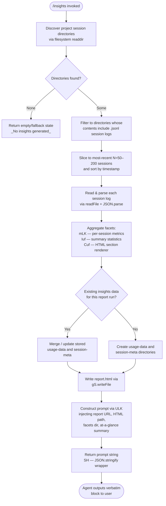

# `/insights`

> Analysis basis: CC v2.1.162 bundle.js (AST extraction + Claude interpretation)
> Minimum version: v2.1.162

---

## Overview

The `/insights` command collects usage telemetry from Claude Code session data stored on disk, processes that data into a faceted report, writes a self-contained HTML file, and then instructs the agent to deliver a fixed confirmation message to the user. The core mechanism is a multi-phase pipeline: session-log discovery, facet aggregation, HTML report generation, and a prompt-driven response whose text is specified verbatim in the injected prompt body.

---

## Registration

| Field | Value |
|---|---|
| type | `prompt` |
| name | `insights` |
| description | `Generate a report analyzing your Claude Code sessions` |
| loc_byte | `13084943` |
| loc_byte_end | `13086247` |
| loc_line | `10453` |
| handler_method | `getPromptForCommand` |
| handler_method_start | `13085117` |
| handler_method_end | `13086246` |
| prompt_body.length | `513` characters |
| prompt_body.trace | `call→ULK(...) (1 literals)` |
| arbor_handler.name | `getPromptForCommand` |
| arbor_handler.fqn | `claude-2.1.162::getPromptForCommand` |
| arbor_handler.kind | `Method` |
| arbor_handler.resolution_path | `direct` |
| arbor_handler.n_hits | `1` |

Analysis basis: CC v2.1.162 bundle.js:+13084943

---

## Input Branching

The handler executes a linear data-collection pipeline before composing the prompt. Internally, session discovery branches on whether each candidate directory contains valid `.jsonl` session logs, and the report-writing step branches on whether prior insights data already exists. Given these 3+ distinct paths the flow is represented as a Mermaid flowchart.



---

## Behavioral Spec

### Phase 1 — Session Discovery (`sessionDirectoryScanner`)

```
function sessionDirectoryScanner(baseDir):
    entries = filesystem.readdir(baseDir)          // gS.readdir :+13071507
    dirs = entries.filter(e => e.isDirectory())    // K.isDirectory :+13071575
    projectDirs = []
    for each dir in dirs:
        path = pathLib.join(baseDir, "projects", dir)  // literal "projects" :+6709241
        projectDirs.push(path)
    projectDirs.sort()                             // q.sort :+13071811
    return projectDirs
```

Analysis basis: CC v2.1.162 bundle.js:+13071488

The scanner reads the top-level data directory, filters for subdirectories, appends the `"projects"` path segment (literal at bundle.js:+6709241), and returns a sorted list. A `setImmediate` yield (bundle.js:+13071787) prevents blocking the event loop during large directory traversals.

Batch limits observed in literals: minimum batch size `10`, maximum `200` (bundle.js:+13071757, +13071904). A default upper slice of `50` sessions is applied before parallel processing (bundle.js:+13071899).

---

### Phase 2 — Session Log Enumeration (`sessionLogEnumerator`)

```
function sessionLogEnumerator(projectDir):
    files = filesystem.readdir(projectDir)         // fL.readdir :+13156673
    jsonlFiles = files.filter(f =>
        f.isFile() &&                              // K.isFile :+13156750
        f.name.endsWith(".jsonl")                  // literal ".jsonl" :+13156779
    )
    results = []
    for each file in jsonlFiles:
        stat = await filesystem.stat(file.path)    // fL.stat :+13156982
        results.push({ name: basename(file), stat })
    return await Promise.all(results)              // Promise.all :+13156914
```

Analysis basis: CC v2.1.162 bundle.js:+13156673

Files not matching `.jsonl` are excluded. Each accepted file's `stat` is collected to provide modification-time ordering used in the sort step of Phase 1.

---

### Phase 3 — Session Log Parsing (`sessionLogParser`)

```
function sessionLogParser(sessionPath):
    encoding = "utf-8"                             // literal :+13016963
    raw = await filesystem.readFile(sessionPath, encoding)
    parsed = JSON.parse(raw)                       // p6 via JSON.parse :+185715
    return parsed
```

Analysis basis: CC v2.1.162 bundle.js:+13016939

Parsing is wrapped so that failures are caught and the session is skipped. Up to 5 sessions are processed in a single `Promise.all` batch (literal `5` at bundle.js:+13072188) with the result accumulator trimmed to the most recent slice.

---

### Phase 4 — Facet Aggregation (`sessionMetricsAggregator`)

```
function sessionMetricsAggregator(sessions):
    perSessionMetrics = []
    for each session in sessions:
        metrics = computePerSessionMetrics(session)   // mLK :+13073800
        perSessionMetrics.push(metrics)
    summary = computeSummaryStatistics(perSessionMetrics)  // Iuf :+13073848
    return { perSessionMetrics, summary }
```

`computePerSessionMetrics` (bundle identifier `mLK`, analysis basis: bundle.js:+13020668) extracts:
- Turn counts and response-time buckets (`2-10s`, `10-30s`, `30s-1m`, `1-2m`, `2-5m`, `5-15m`, `>15m` — literals at bundle.js:+13028050–13028110)
- Time-of-day groupings: Morning (6–12), Afternoon (12–18), Evening (18–24), Night (0–6) — literals at bundle.js:+13028898–13029051
- Tool-use outcomes: categorises tool calls including `WebSearch`, `WebFetch`, `Edit`, `Write` (literals at bundle.js:+13011525–13011668) and MCP-prefixed calls (`mcp__`, literal at bundle.js:+13011504)
- Error classifications: `Command Failed`, `User Rejected`, `Edit Failed`, `File Changed`, `File Too Large`, `File Not Found` — literals at bundle.js:+13012543–13012939

`computeSummaryStatistics` (bundle identifier `Iuf`, analysis basis: bundle.js:+13023531) computes an `at_a_glance` object (literal key at bundle.js:+13025077) and serialises it via `JSON.stringify` (`SH`, bundle.js:+13023878). A fallback string `"None captured"` is used when no sessions yield data (literal at bundle.js:+13024411).

Session retention window: 1 800 000 ms (30 minutes, literal at bundle.js:+13019305).

---

### Phase 5 — HTML Report Generation (`htmlReportRenderer`)

```
function htmlReportRenderer(facets, outputPath):
    html = renderSections(facets)    // Cuf :+13073859
    filesystem.mkdir(outputDir, { recursive: true })   // gS.mkdir :+13073878
    filesystem.writeFile(outputPath, html)             // gS.writeFile :+13074165
    return outputPath
```

Analysis basis: CC v2.1.162 bundle.js:+13073859

The renderer (`Cuf`) produces self-contained HTML with inline CSS colour values: `#2563eb`, `#0891b2`, `#10b981`, `#8b5cf6` (chart colours, literals at bundle.js:+13065715–13066168), `#dc2626`, `#16a34a`, `#eab308` (status colours, literals at bundle.js:+13069431, +13069680, +13070173). Empty-state placeholders include `<p class="empty">No data</p>` and `<p class="empty">No response time data</p>` (literals at bundle.js:+13027541, +13027998). The output filename is `report.html` (literal at bundle.js:+13074137).

Chart sections use `Math.max` and `Math.round` for bar-chart scaling (bundle.js:+13027578, +13023996) and `Object.entries` / `Object.keys` enumeration (bundle.js:+13027467, +13069357). Maximum rendered text width is capped at `8192` characters (literal at bundle.js:+13027219).

HTML is escaped with standard entity replacements: `&amp;`, `&lt;`, `&gt;`, `&quot;`, `&apos;` (literals at bundle.js:+4772415–4772538).

Data is written to two subdirectories:
- `usage-data` — aggregated metrics (literal at bundle.js:+13010832)
- `session-meta` — per-session metadata (literal at bundle.js:+13010928)
- `facets` — serialised facet objects (literal at bundle.js:+13010882)

The report is identified internally with the string `"insights"` (literal at bundle.js:+13018672). The maximum token budget for this phase is `4096` (literal at bundle.js:+13018781).

---

### Phase 6 — Prompt Construction and Delivery (`getPromptForCommand`)

```
function getPromptForCommand(context):
    insightsData   = collectInsightsData(context)   // pLK :+13085216
    reportUrl      = buildReportUrl(insightsData)
    htmlFilePath   = insightsData.htmlPath
    facetsDir      = insightsData.facetsDir
    atAGlance      = Math.round(insightsData.summary)  // :+13085504
    separator      = " · "                          // literal :+13085575
    promptText     = ULK(                           // :+13086149
        insightsData,
        reportUrl,
        htmlFilePath,
        facetsDir,
        atAGlance
    )
    serialised     = SH(promptText)                 // JSON.stringify :+13086167
    outputDir      = yC8(context)                   // :+13086213
    return serialised
```

Analysis basis: CC v2.1.162 bundle.js:+13085117

The prompt body (513 characters, bundle.js:+13084943) instructs the agent to:

1. Acknowledge that the user ran `/insights`.
2. Receive a structured block containing the full insights data, report URL, HTML file path, and facets directory.
3. Receive an at-a-glance summary marked as context only (the user has not yet seen output).
4. **Output verbatim** the text enclosed in `<message>` tags — specifically a confirmation that the shareable insights report is ready, the report location, and a follow-up offer to explore sections or act on suggestions. The prompt explicitly states: "Do not omit any line."

The fallback string `"_No insights generated_"` (literal at bundle.js:+13086014) is substituted when the pipeline produces no data.

---

### Phase 7 — Storage Helpers

**`directoryWriter` (`Vuf`)** — creates the output directory structure and writes serialised facet JSON at `384`-character indent width (literal at bundle.js:+13017612):

```
function directoryWriter(outputDir, facets):
    filesystem.mkdir(outputDir, { recursive: true })    // gS.mkdir :+13017480
    path = pathLib.join(outputDir, filename)            // Eg.join :+13017517
    payload = JSON.stringify(facets)                    // SH :+13017576
    filesystem.writeFile(path, payload, "utf-8")        // gS.writeFile :+13017561
```

Analysis basis: CC v2.1.162 bundle.js:+13017480

**`sessionMetaWriter` (`Tuf`)** — writes per-session metadata using the `session-meta` directory resolved via `yC8` → `MR6`:

```
function sessionMetaWriter(sessionId, meta, baseDir):
    outDir = resolveSessionMetaDir(baseDir)    // yC8 :+13016732
    path   = pathLib.join(outDir, sessionId)   // Eg.join :+13016767
    filesystem.mkdir(outDir, { recursive: true })
    payload = JSON.stringify(meta)             // SH :+13016826
    filesystem.writeFile(path, payload)        // gS.writeFile :+13016811
```

Analysis basis: CC v2.1.162 bundle.js:+13016723

**`priorInsightsCleaner` (`Euf`)** — reads any stale prior report file and removes it before generating a fresh one:

```
function priorInsightsCleaner(baseDir):
    reportPath = resolveReportPath(baseDir)    // yC8 :+13016532, Eg.join :+13016524
    raw = filesystem.readFile(reportPath)      // gS.readFile :+13016567
    parsed = JSON.parse(raw)                   // p6 :+13016603
    if parsed is stale (BLK check):
        filesystem.unlink(reportPath)          // gS.unlink :+13016631
```

Analysis basis: CC v2.1.162 bundle.js:+13016524

---

## State & Side Effects

| Item | Detail |
|---|---|
| Telemetry | No `tengu_*` events are fired directly from the `/insights` command handler or its primary call chain (pLK / getPromptForCommand). Telemetry events in the broader call graph (e.g. `tengu_mcp_skills`, `tengu_transcript_phantom_parent`, `tengu_relink_walk_broken`, `tengu_chain_parent_cycle`, `tengu_chain_timestamp_fallback`) originate in shared infrastructure utilities reached at depth 2 and are not specific to `/insights`. |
| Filesystem writes | Creates or overwrites `report.html` under the resolved output directory; writes JSON files to `usage-data/`, `session-meta/`, and `facets/` subdirectories. |
| Filesystem reads | Reads all `.jsonl` session log files under the project directories found via `readdir`. Reads and optionally deletes stale prior report files. |
| Directory creation | `gS.mkdir` with `{ recursive: true }` is called for the output root and each subdirectory. |
| Hook registration | None observed in depth-2 traversal. |
| appState changes | None observed in depth-2 traversal. |
| Sound | None observed in depth-2 traversal. |
| Prompt injection | Injects a 513-character prompt via `getPromptForCommand`; the agent is constrained to output only the fixed `<message>` block verbatim. |
| Separator literal | `" · "` (bundle.js:+13085575) used in report summary line formatting. |
| Fallback output | `"_No insights generated_"` emitted when pipeline produces no data (bundle.js:+13086014). |

---

## Version History

| Version | Change |
|---|---|
| v2.1.162 | Initial analysis |

---

## Common Mistakes

1. **Running `/insights` in a project with no session logs** — if no `.jsonl` files are found under the `projects` directory, the command returns the fallback string `"_No insights generated_"` rather than a report URL. Ensure at least one Claude Code session has been completed in the current environment.
2. **Expecting interactive customisation** — the agent response is fixed by the verbatim `<message>` block in the prompt. The agent cannot alter the report content at delivery time; customisation must happen before invoking the command.
3. **Modifying `report.html` manually between runs** — `priorInsightsCleaner` (`Euf`) checks for and removes stale prior report files before writing a fresh one, so manual edits to the HTML will be lost on the next invocation.
4. **Assuming the report is uploaded** — the prompt body references a local HTML file path and a report URL; the report is written to the local filesystem only. The "shareable" framing refers to the file being self-contained, not to any network upload.
5. **Expecting all sessions to be analysed** — the pipeline slices to at most 200 sessions (literal at bundle.js:+13071904) and processes them in batches; very large session histories will be truncated to the most recent entries.

---

## Appendix — Identifier Mapping

> For bundle debugging only. Identifiers change across versions.

| Identifier | Role |
|---|---|
| `__handler_insights` | Synthetic BFS entry point for the `/insights` command handler (not a real bundle symbol) |
| `pLK` | Primary insights data collection orchestrator (calls session discovery, parsing, aggregation, and report writing) |
| `xuf` | Session directory scanner — reads `projects` subdirectories via `readdir` |
| `Ol` | Path join helper used to construct `projects` sub-paths |
| `E96` | Session log enumerator — filters `.jsonl` files and collects stat info |
| `Ks` | File-extension test helper (regex `.test`) |
| `Zuf` | Session log file reader / parser dispatcher |
| `xLA` | Resolves the `session-meta` directory path |
| `MR6` | Base directory path resolver |
| `xLK` | Session log content validator |
| `p6` | JSON.parse wrapper |
| `mLA` | Per-session metric extractor |
| `bLK` | Session log line processor — extracts tool calls, error codes, timestamps |
| `uLA` | Utility helper in the aggregation pipeline |
| `Juf` | `Number.isNaN` guard for metric values |
| `V$` | Value formatter in the metric pipeline |
| `fR6` | Tool-name extraction helper |
| `wuf` | File extension resolver (`Eg.extname`) |
| `TjH` | Diff utility wrapper (`LE9.diff`) |
| `Q4` | Array index-of helper |
| `mLK` | Per-session metrics aggregator (turn counts, response times, tool outcomes) |
| `G96` | `Object.entries` wrapper for metric objects |
| `$9` | String slice helper |
| `uLK` | Statistical accumulator (sort, deduplicate, bucket) |
| `Iuf` | Summary statistics generator — produces `at_a_glance` object |
| `RLK` | Report data builder — combines per-session and summary data |
| `Ouf` | Report output path resolver |
| `Cuf` | HTML report renderer — produces self-contained `report.html` |
| `kC8` | HTML section renderer helper |
| `Ruf` | JSON.stringify wrapper used during HTML generation |
| `QMH` | Table/chart HTML section builder |
| `huf` | Bar-chart max-value calculator |
| `Suf` | Time-of-day section renderer |
| `ef` | HTML entity escaper |
| `x7` | String `replaceAll` helper for entity escaping |
| `ULK` | Prompt text constructor — injects report URL, HTML path, facets dir, at-a-glance summary into the prompt template |
| `SH` | `JSON.stringify` wrapper |
| `yC8` | Output directory resolver |
| `Vuf` | Directory writer — `mkdir` + `writeFile` for facets |
| `Euf` | Prior insights report cleaner — reads and optionally deletes stale file |
| `BLK` | Stale-report staleness checker |
| `Nuf` | Report generation coordinator (calls `Guf`, `P86`, `CLK`, `iK`) |
| `Guf` | Session batch processor — `Promise.all` over session slices |
| `Xuf` | Session data normaliser within batch processor |
| `P86` | Facet page builder |
| `A4` | Facet data formatter |
| `VN8` | Content-hash and file-write utility used for report assets |
| `b8` | UUID generator wrapper (`Sk.randomUUID`) |
| `fxH` | Assistant message extractor |
| `CE` | Report finaliser |
| `CLK` | Path constant resolver |
| `PE` | URL/path construction helper (`UM`, `G5`, `wA` — first-party path utils) |
| `iK` | Filter helper for report data |
| `Tuf` | Session-meta writer |
| `uuf` | `Object.keys` enumeration helper |
| `hC8` | Snapshot/state reader — retrieves current session maps |
| `f1H` | Session state initialiser — populates all session-keyed Maps |
| `tuf` | Session transcript loader |
| `zb` | Session state validator |
| `Kj` | Timestamp parser |
| `z7K` | Session chain walker — resolves parent links |
| `k7K` | Session history builder |
| `M5H` | Chain head resolver |
| `wmf` | NaN-guarded chain metric helper |
| `Jmf` | Session chain sorter and deduplicator |
| `Dmf` | Session chain accumulator |
| `j66` | Message map builder |
| `q7A` | Message content extractor |
| `Uh6` | Individual message processor |
| `L7A` | Attachment/image filter |
| `jmf` | Content trim and array validator |
| `Xmf` | Array element predicate |
| `gC8` | Session cache getter |
| `QC8` | Session cache lister (`Array.from` + `values`) |
| `vmf` | Binary transcript reader (Buffer-based JSONL parser) |
| `Imf` | Sync file reader helper (openSync / readSync / closeSync) |
| `Nmf` | JSONL line parser (Buffer-based) |
| `TTH` | Format utility bundle (`u24`, `m24`, `U24`, `p24`) |
| `om6` | Recursive object walker |
| `kH` | Error logger (`Dr.logError`, `zBH.push`) |
| `t_` | Error/string coercion utility |
| `tH` | String coercion helper |
| `RCH` | MCP connection manager (reached at depth 2 via `M`; not specific to `/insights`) |
| `ROA` | MCP server reconnection orchestrator |
| `xp8` | MCP connection result applier |
| `hk` | MCP cleanup helper |
| `n8` | Retry/timeout utility |
| `G7` | MCP error logger |
| `Y8` | MCP debug logger |