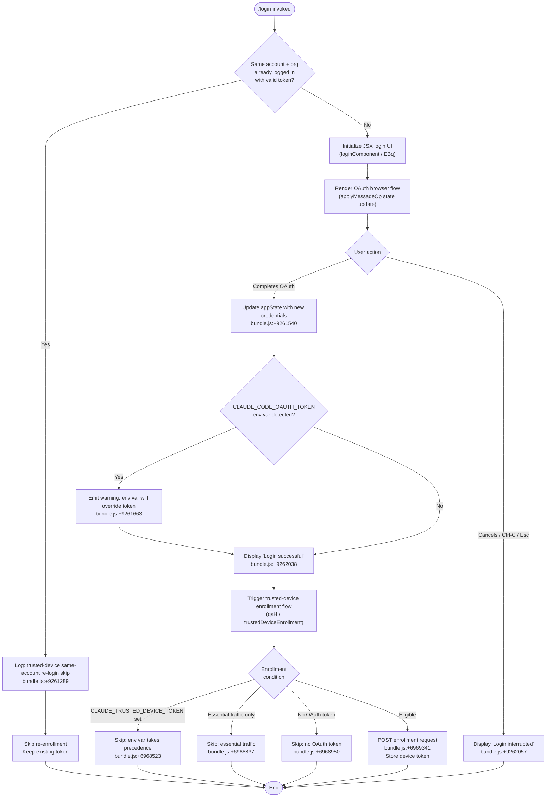

# `/login`

> Analysis basis: CC v2.1.162 bundle.js (AST extraction + Claude interpretation)
> Minimum version: v2.1.162

---

## Overview

The `/login` command allows the user to switch Anthropic accounts or sign in with a new Anthropic account from within a running Claude Code session. It renders a JSX-based interactive UI component that drives an OAuth authentication flow, updates application state on success or cancellation, and can optionally trigger trusted-device enrollment after credentials are obtained.

---

## Registration

| Field | Value |
|---|---|
| type | `local-jsx` |
| name | `login` |
| description | `Switch Anthropic accounts \| Sign in with your Anthropic account` |
| loc_byte | 11531342 |
| loc_byte_end | 11531562 |
| loc_line | 7872 |
| module_id | `fDq` |
| load_inline | `true` |
| arbor_handler.name | `EBq` |
| arbor_handler.fqn | `claude-2.1.162::EBq` |
| arbor_handler.kind | `Function` |
| arbor_handler.resolution_path | `direct` |
| arbor_handler.n_hits | 2 |

Analysis basis: CC v2.1.162 bundle.js:+11531342

---

## Input Branching

The command involves more than three distinct execution paths (normal OAuth success, user cancellation/interrupt, same-account re-login with existing token, environment variable override warning, and trusted-device enrollment conditional). A flowchart best represents the structure.



---

## Behavioral Spec

### Top-level Handler: `loginComponent` (arbor: `EBq`)

The handler is the `local-jsx` component resolved at byte range `(11531342, 11531562)`. The Arbor symbol graph resolves it directly as function `EBq` (n_hits = 2).

```
function loginComponent(props):
    state = useState(initial)
    appState = getAppState()                    // H.getAppState  +9261444

    if isSameAccountReloginWithExistingToken(appState):
        log("[trusted-device] Same account+org re-login with existing token, skipping re-enrollment")
        // +9261289
        return earlyExit()

    element = createElement(loginForm, props)   // Ht.createElement +9261941
    dispatch = useReducer(...)                  // HDq / ZRH.useReducer +9259365

    onDone = function(result):                  // H.onDone +9262281
        if result == "cancelled":
            display("Login interrupted")        // +9262057
        else:
            setAppState(newCredentials)         // H.setAppState +9261540
            if env.CLAUDE_CODE_OAUTH_TOKEN set:
                emitWarning(OAUTH_ENV_VAR_WARNING) // +9261663
            display("Login successful")         // +9262038
            runTrustedDeviceEnrollment(appState)

    return render(element, { onDone })
```

Analysis basis: CC v2.1.162 bundle.js:+9261036, +9261860, +9262005

---

### Sub-feature: API Bootstrap / Credential Fetch (`bootstrapFetch` / `H`)

When the login flow initializes, it fetches the bootstrap configuration from the Anthropic API before rendering the form.

```
function bootstrapFetch(url):
    log("[Bootstrap] Fetching", url)            // +15590993
    headers = {
        "Content-Type": "application/json",    // +15591078, +15591093
        "User-Agent": <version_string>         // +15591112
    }
    response = e_.get(url, headers, timeout=5000) // +15591029, +15591194

    on success:
        log("[Bootstrap] Fetch ok")            // +15591367
        record telemetry("api_bootstrap_fetch") // +15591315
    on parse failure:
        record telemetry("api_bootstrap_fetch", status="parse_failed") // +15591337
```

Analysis basis: CC v2.1.162 bundle.js:+15590991, +15591315

---

### Sub-feature: API Key Validation (`apiKeyValidator` / `v`)

Validates the credential string supplied during login before it is persisted.

```
function apiKeyValidator(rawKey):
    normalized = rawKey.trim()                  // +205942
    upper = rawKey.toUpperCase()               // +205919
    
    if not rawKey.includes(requiredPrefix):     // +205857
        return INVALID

    masked = maskApiKey(rawKey)                 // V4  +205939
    // maskApiKey: replace middle chars with [REDACTED] +197925
    //   keeps first 2 chars, last char(s) at index 2 +197954
    //   uses A.lastIndexOf +198009, A.slice +198035

    writeCredential(rawKey)                     // WpH -> pXA -> H.write +192975
    notifyUpdate("update")                      // +9261078

    return { valid: true, masked }
```

Analysis basis: CC v2.1.162 bundle.js:+205817, +205857, +205939

---

### Sub-feature: Model / Provider Tier Routing (`modelRouter` / `qq`, `PE`, `UM`)

During login, the resolved account is mapped to a provider tier and model alias. This determines which backend endpoint the session will use.

```
function resolveProviderTier(accountInfo):
    key = accountInfo.trim().toLowerCase()      // +2240374, +2240385

    if key matches "opusplan":                  // +2240470
        tier = OPUS_PLAN
        alias = "[1m]"                          // +2240496
    elif key matches "sonnet":                  // +2240511
        tier = SONNET
    elif key matches "haiku":                   // +2240550
        tier = HAIKU
    elif key matches "opus":                    // +2240589
        tier = OPUS
    elif key matches "best":                    // +2240626
        tier = BEST

    provider = mapTierToProvider(tier)
    // Possible providers: "firstParty" +2236678, "anthropicAws" +2094587,
    //   "gateway" +2094607, "bedrock" +2093914, "foundry" +2093964,
    //   "vertex" +2094122, "mantle" +2237319

    return { tier, provider }
```

Analysis basis: CC v2.1.162 bundle.js:+2240403, +2240658

---

### Sub-feature: Trusted-Device Enrollment (`trustedDeviceEnrollment` / `qsH`)

After a successful OAuth login, the system evaluates whether to enroll the current device.

```
function trustedDeviceEnrollment(appState):
    if env.CLAUDE_TRUSTED_DEVICE_TOKEN is set:
        log("[trusted-device] CLAUDE_TRUSTED_DEVICE_TOKEN env var is set, skipping enrollment")
        // +6968523
        return

    if isPolicyEnforced(K.isPolicyEnforced):    // +6968723
        // essential traffic mode active
        log("[trusted-device] Essential traffic only, skipping enrollment")
        // +6968837
        return

    oauthToken = getOAuthToken(appState)
    if not oauthToken:
        log("[trusted-device] No OAuth token, skipping enrollment")
        // +6968950
        return

    // Eligible: proceed with enrollment
    // Only supported on darwin currently (+6969146)
    payload = buildEnrollmentPayload(appState, p1)
    response = e_.post(enrollmentEndpoint, payload, timeout=10000) // +6969051, +6969239

    if response.status == 201:                  // +6969427
        deviceToken = response.deviceToken
        if not deviceToken:
            recordTelemetry("bridge_trusted_device_enroll", result="missing_token") // +6969725
            return
        storeDeviceToken(deviceToken, W4)       // secure storage write
        recordTelemetry("bridge_trusted_device_enroll") // +6969341
    elif response.status in [4xx]:
        if status == 401 or similar:
            recordTelemetry("bridge_trusted_device_enroll", result="http_error") // +6969546
    on storage failure:
        recordTelemetry("bridge_trusted_device_enroll", result="storage_failed") // +6969933
```

Analysis basis: CC v2.1.162 bundle.js:+6968002, +6969051, +6969341

---

### Sub-feature: Remote Managed Settings Refresh (`remoteManagedSettingsRefresh` / `Lb_`)

Upon login completion, the system refreshes remote managed settings using the new auth context.

```
function remoteManagedSettingsRefresh(authContext):
    hash = computeSettingsHash(rm9)             // SHA-256 +6974662 / hex +6974689
    
    response = fetchWithRetry(settingsEndpoint, {
        headers: { "If-None-Match": currentETag } // +7003292
    })

    if response.status == 304:
        log("Remote settings: Cache still valid (304 Not Modified)") // +7005677
        recordTelemetry("remote_managed_settings_pull")
        return cachedSettings

    if response.status == 200:                  // +7003386
        newSettings = parseSettings(response)
        if invalid format:
            raise Error("Invalid remote settings format") // +7003804
        applySettings(newSettings)
        log("Remote settings: Applied new settings successfully") // +7006045
        IC.notifyChange()
        return newSettings

    if response.status == 401:                  // +7004326
        recordTelemetry("tengu_remote_settings_401_force_refresh_retry")
        // force refresh with new auth
        return retry()

    if response.status == 404:                  // +7003413
        deleteLocalCache()
        log("Remote settings: Deleted cached file (404 response)") // +7006210
        return empty

    on network error:
        log("Remote settings: Using stale cache after fetch failure") // +7005508
        recordTelemetry("remote_managed_settings_fetch_failed")
        return staleCache

    on unexpected error:
        recordTelemetry("remote_managed_settings_unexpected") // +7006511
        log("Remote settings: Using stale cache after error") // +7006560
        return staleCache
```

Analysis basis: CC v2.1.162 bundle.js:+7005396, +7005426

---

### Sub-feature: Policy Limits Refresh (`policyLimitsRefresh` / `o06`)

Fetches the current policy limits from the server after auth changes.

```
function policyLimitsRefresh():
    clearTimeout(pendingTimer)                  // +6961622

    response = fetchPolicyLimits(JC)            // +6965696
    recordTelemetry("tengu_policy_limits_fetch") // +6964449

    if response.status == 304:
        log("Policy limits: Cache still valid (304 Not Modified)") // +6964862
        return

    if response ok:
        apply(newLimits)                         // Fm9
        log("Policy limits: Applied new restrictions successfully") // +6965020
        IC.notifyChange()
        return

    on fetch failure:
        log("Policy limits: Using stale cache after fetch failure") // +6964691
        recordTelemetry(result="stale_cache_used") // +6964759
        return staleCache

    on unexpected:
        recordTelemetry(result="unexpected_error") // +6965246
```

Analysis basis: CC v2.1.162 bundle.js:+6965683, +6965689, +6964449

---

### Sub-feature: Credential Storage (`credentialWriter` / `EgK`, `GgK`)

Persists the obtained credentials atomically to disk.

```
function writeCredentials(key, value):
    dir = Qe.dirname(credentialPath)            // +205339
    byteLen = Buffer.byteLength(value)          // +205513

    if dir does not exist:
        jy.mkdir(dir, recursive=true)           // +205060

    tmpPath = buildTmpPath(credentialPath)      // _PA +205475
    jy.appendFile(tmpPath, value)               // +205119

    rotate(tmpPath, credentialPath)             // HPA +205507
    // rotation: stat, rename if not .txt +204765, unlink old

    updateWriteLog(J9)                          // +205668 -> jJA.register +60123
```

Analysis basis: CC v2.1.162 bundle.js:+205306, +205458, +205546

---

### Sub-feature: Interactive JSX UI Shell (`loginUIShell` / `D2H`, `Ml7`)

Renders the interactive terminal login form using Ink/React.

```
function loginUIShell(props):
    [loginState, setLoginState] = useState(null) // LDq.useState +9262133
    symbolKey = Symbol.for("react.memo_cache_sentinel") // +9262162

    // Keyboard interrupt handlers
    useKeyHandler(P_):                          // +9262437
        on Ctrl-C:                              // +4118383
            emit("app:interrupt")              // +4118157
        on Ctrl-D:                              // +4118428
            emit("app:exit")                   // +4118175
        on Esc:
            // show "Press Esc again to exit"  // +9262574
            promptConfirmCancel()

    settingsScope = "Global"                    // +4075167

    return (
        <LoginForm
            onDone={handleDone}
            confirmBinding="confirm:no"         // +9262440
            settingsLabel="Settings"            // +9262406
            permissionLabel="permission"        // +9263170
            title="Login"                       // +9263145
        />
    )
    // Ht.createElement +9262531
```

Analysis basis: CC v2.1.162 bundle.js:+9262103, +9262133, +9262437

---

## State & Side Effects

| Item | Detail |
|---|---|
| Telemetry: `tengu_feature_ok` | Emitted on successful credential write (bundle.js:+1008233) |
| Telemetry: `tengu_feature_bad` | Emitted on credential write failure (bundle.js:+1008295) |
| Telemetry: `tengu_feature_sad` | Emitted on transient storage error (bundle.js:+1008376) |
| Telemetry: `tengu_remote_settings_401_force_refresh_retry` | Emitted when remote settings returns 401 after auth change (bundle.js:+7004395) |
| Telemetry: `tengu_managed_settings_security_dialog_shown` | Emitted when managed settings security dialog appears (bundle.js:+7000403) |
| Telemetry: `tengu_managed_settings_security_dialog_accepted` | Emitted when user accepts managed settings (bundle.js:+7000087) |
| Telemetry: `tengu_managed_settings_security_dialog_rejected` | Emitted when user rejects managed settings (bundle.js:+7000137) |
| Telemetry: `tengu_policy_limits_fetch` | Emitted each time policy limits are fetched post-login (bundle.js:+6964449) |
| Telemetry: `tengu_disable_bypass_permissions_mode` | Emitted if bypass permissions mode is disabled during login state transition (bundle.js:+10624899) |
| Telemetry: `tengu_auto_mode_config` | Emitted when auto mode configuration is evaluated post-login (bundle.js:+10622789) |
| Telemetry: `tengu_daemon_config_reload` | Emitted when daemon config is reloaded after successful login (bundle.js:+16011003) |
| `appState` changes | `setAppState` called with new credentials on success (bundle.js:+9261540) |
| `applyMessageOp` | Called during login UI rendering to update message stream (bundle.js:+9261055) |
| `IC.notifyChange` | Called after remote settings and policy limits are applied (bundle.js:+7007446, +7007446) |
| Secure storage write | Device token written via `W4` / `Nj1` credential storage layer (bundle.js:+2277740) |
| Credential file write | API key or OAuth token written atomically via `EgK` / `GgK` (bundle.js:+205119) |
| Remote settings refresh | `Lb_` triggered on auth change; background poll via `Ez7` / `ZD8` (bundle.js:+7007338, +7007395) |
| Policy limits refresh | `o06` triggered; optional background poll via `gm9` / `ZD8` (bundle.js:+6965944) |
| Trusted-device enrollment | POST to enrollment endpoint on eligible re-login; Darwin-only observed (bundle.js:+6969341) |
| Hook registration | `P_.registerHandler` registers keyboard interrupt handler (bundle.js:+4075271) |
| Sound | <!-- TODO: not found in depth-2 traversal; needs --depth 4 --> |
| Environment variable check | `CLAUDE_CODE_OAUTH_TOKEN` checked post-login; warning displayed if set (bundle.js:+9261663) |
| `CLAUDE_TRUSTED_DEVICE_TOKEN` check | Env var suppresses trusted-device enrollment (bundle.js:+6968523) |

---

## Version History

| Version | Change |
|---|---|
| v2.1.162 | Initial analysis |

---

## Common Mistakes

1. **Not unsetting `CLAUDE_CODE_OAUTH_TOKEN` after login**: The warning at bundle.js:+9261663 makes clear that if this environment variable is set in the shell, it will override any token obtained via `/login` at runtime. Users must unset it for the new credentials to take effect.

2. **Running `/login` on a non-Darwin host and expecting trusted-device enrollment**: The trusted-device enrollment POST flow has a Darwin-only guard observed at bundle.js:+6969146. On other platforms the enrollment step is silently skipped.

3. **Assuming `/login` is instant**: The command triggers multiple async side effects — remote managed settings fetch, policy limits fetch, and optionally trusted-device enrollment — all of which involve network calls with their own retry/backoff logic. The UI may remain active until all settle.

4. **Expecting the same account re-login to re-enroll the device**: When the existing token is detected to belong to the same account and organization, enrollment is skipped entirely (bundle.js:+9261289). Use a full session restart to force re-enrollment.

5. **Using the `ANTHROPIC_API_KEY` environment variable together with `/login`**: The environment variable `ANTHROPIC_API_KEY` (bundle.js:+2995841) takes priority in the credential resolution order; a successful `/login` may still be overridden by that env var.

---

## Appendix — Identifier Mapping

> For bundle debugging only. Identifiers change across versions.

| Identifier | Role |
|---|---|
| `EBq` | Main login handler (arbor-resolved, direct) |
| `MT8` | Login state machine / message op dispatcher |
| `Ml7` | JSX login UI outer wrapper component |
| `D2H` | JSX login form shell (useState, keyboard handlers, layout) |
| `_J` | Login form inner component (useMemo, model routing) |
| `HDq` | Login reducer hook (useReducer + useEffect) |
| `H` | Bootstrap fetch / credential validation context |
| `v` | API key validator / credential normalizer |
| `V4` | API key masker / redactor |
| `rXA` | Key mapping / prefix mapper |
| `WpH` | Credential writer dispatcher |
| `pXA` | Low-level credential file writer (H.write) |
| `EgK` | Atomic credential persistence orchestrator |
| `GgK` | Credential append + rotate (mkdir, appendFile, rename) |
| `HPA` | File rotation helper (stat, rename, unlink) |
| `_PA` | Temporary path builder (Qe.join) |
| `zL6` | Directory validator (V8) |
| `J9` | Write log registrar (jJA.register) |
| `qsH` | Trusted-device enrollment orchestrator |
| `rO7` | Trusted-device init helper |
| `CC_` | Trusted-device config loader |
| `p1` | OAuth endpoint resolver / URL validator |
| `YsH` | Post-login side-effect runner (settings + policy + enrollment) |
| `Lb_` | Remote managed settings refresh handler |
| `Pz7` | Remote settings fetch + parse pipeline |
| `bp9` | Remote settings HTTP fetch with ETag |
| `s_H` | Exponential backoff / jitter calculator |
| `n8` | Generic timeout/abort wrapper |
| `rm9` | Settings hash computer (SHA-256) |
| `UC_` | Deep structure normalizer for settings comparison |
| `Ez7` | Remote settings background change notifier |
| `ZD8` | Background poll interval manager (setInterval / clearInterval) |
| `up9` | Post-login settings + poll initializer |
| `o06` | Policy limits refresh orchestrator |
| `Fm9` | Policy limits fetch + parse pipeline |
| `ID8` | Policy limits fetch + background poll coordinator |
| `gm9` | Policy limits background poll runner |
| `iO7` | Policy limits poll iteration handler |
| `dO7` | Policy limits apply handler |
| `cO7` | Policy limits retry scheduler |
| `nO7` | Policy limits file writer |
| `QO7` | Policy limits hash computer |
| `yC_` | Policy limits load timeout guard |
| `ND8` | Policy limits timeout scheduler |
| `JC` | Policy limits fetch caller (wA, OO, pJ, Q1) |
| `vj6` | Policy limits file reader (readFileSync) |
| `Nj6` | Policy limits parser |
| `ULH` | Policy limits array checker |
| `gnH` | Policy limits path builder |
| `g6H` | Session cleanup / event emitter on login exit |
| `IcH` | Cleanup handler (clear intervals, maps, listeners) |
| `_j_` | Process listener remover |
| `Hu` | External command executor |
| `ex` | Shell execution helper |
| `HC` | Command construction helper |
| `uC_` | Trusted-device session initializer |
| `qsH` | Trusted-device enrollment (duplicate reference — same as above) |
| `zfH` | Session context builder for trusted-device |
| `j6` | Session context lookup / feature flag reader |
| `U18` | Session cache reader/writer |
| `W4` | Secure credential storage writer |
| `Nj1` | Secure storage read/write/update dispatcher |
| `SZH` | Secure storage async updater |
| `fh` | Feature-flag-aware session handler |
| `ol1` | Feature value resolver |
| `k_` | Module initializer / exports setter |
| `TN6` | Permission mode state machine initializer |
| `fT8` | Bypass-permissions mode gate |
| `Hj_` | Permission mode transition helper |
| `UyH` | Permission state subscriber |
| `J$` | Permission state map updater |
| `xM` | Permission state reader |
| `b_` | App state finder (findLast) |
| `VI8` | Working directory resolver (K1) |
| `NI8` | Allowed/disallowed tools resolver (K1) |
| `ZN6` | Login session render orchestrator |
| `VN6` | Login session main renderer |
| `Q6H` | Auto-mode config loader (B18) |
| `B18` | Feature flag resolver |
| `ut_` | Auto-mode availability checker |
| `xt_` | Auto-mode settings validator |
| `ddH` | Model compat checker |
| `K9` | Model prefix/alias tester |
| `LY6` | Display label formatter |
| `B_6` | Plan-tier gate (QQ) |
| `D` | Terminal output renderer / supervisor |
| `Y0H` | Output line builder |
| `OKK` | Column/padding layout calculator |
| `f` | File handle manager (close, get) |
| `E` | Remote control / supervisor event handler |
| `Z` | Daemon config watcher (start/stop/updateConfig) |
| `xCK` | Heartbeat sender |
| `V` | Background process starter |
| `Zt` | Timer/debounce helper |
| `DR` | State diff reporter |
| `j7H` | Workspace host-path event emitter |
| `HL` | Event schema normalizer (name, timestamp, sequence, prompt.id) |
| `c5H` | Permission entry mapper |
| `pY` | Context consumer (BvH.useContext) |
| `P_` | Keyboard handler registrar |
| `cJ` | Context reader (OwH.useContext) |
| `gM` | Input component wrapper |
| `qK9` | Input field renderer |
| `hG_` | Input state hook (useState, useMemo, useCallback) |
| `DC` | Debounced input handler |
| `M` | Suggestion/completion provider |
| `qq` | Model alias normalizer |
| `PE` | Provider-tier resolver (firstParty) |
| `UM` | Provider-type mapper |
| `Xt6` | Provider list checker |
| `fQH` | Provider fallback selector |
| `qI` | Model group resolver |
| `LQH` | Model group label builder |
| `RJ1` | Model resolution chain |
| `Q0` | Model name normalizer |
| `pKH` | Model prefix checker |
| `a1` | Credential parser orchestrator |
| `oHH` | Auth header parser |
| `Dd` | Token field extractor |
| `rX` | Token type router |
| `g0` | Auth context assembler |
| `AY_` | Auth string splitter/trimmer |
| `LHH` | Credential cache checker |
| `bJ` | Credential string replacer |
| `OO` | Auth context builder (API key / OAuth / WIF) |
| `xV` | Auth source discriminator |
| `pJ` | Auth profile builder |
| `C6` | Auth event recorder |
| `QR` | Token truncator |
| `T36` | File descriptor API key reader |
| `qb_` | Policy settings notifier |
| `kH` | Policy settings applier |
| `t_` | Policy error wrapper |
| `wq` | Policy settings queue processor |
| `Gj4` | Policy queue shift/push |
| `TL` | Login event recorder (C6) |
| `AD` | Auth event builder |
| `W5` | Auth event dispatcher |
| `YY6` | Auth event ID builder |
| `idH` | Auth event ID formatter |
| `SmH` | Login timestamp recorder (Date.now) |
| `_Dq` | Login diff / state transition marker |
| `TH` | String coercion helper |
| `t6` | Timer/cleanup helper |
| `Z6` | Cleanup executor |
| `Zx6` | Root cleanup registrar |
| `dmH` | Batched write scheduler (clearTimeout, setTimeout, setImmediate) |
| `E3H` | Write path resolver (_p6, s8, S6) |
| `i6` | Path existence checker |
| `SH` | JSON serializer |
| `ROH` | Auth cache invalidator |
| `q04` | Cache key builder |
| `cz` | Cache clearer (Lu6, VB8) |
| `Rp9` | Session state cloner (structuredClone) |
| `uj` | Deep clone helper |
| `vx` | Session state merger (UW4, FW4, QW4) |
| `kp9` | MCP/tool session configurator |
| `RD8` | Tool registry key lister |
| `MsH` | Tool header/flag normalizer |
| `Ap9` | Tool config applier |
| `Ip9` | Tool session initializer |
| `Oz7` | Tool filter/queue manager |
| `KB` | Permission write handler |
| `El` | Tool session event emitter |
| `yp9` | Other-session handler |
| `oK` | Other-session type resolver |
| `Wz7` | Atomic file writer (open, writeFile, datasync, close) |
| `TM6` | File path resolver (qKH, yxA.join, s8) |
| `V8` | Volume/device resolver |
| `HYH` | Login header/badge renderer |
| `GXH` | Login form layout helper |
| `Nl_` | Login network limiter |
| `SA5` | Login screen animation helper |