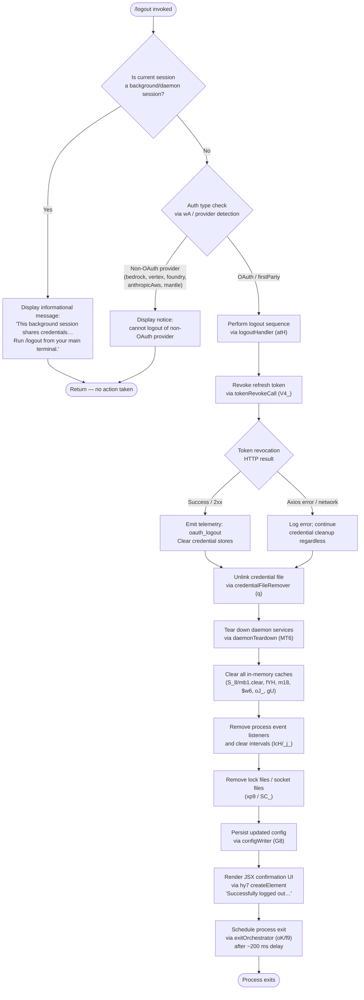

# `/logout`

> Analysis basis: CC v2.1.162 bundle.js (AST extraction + Claude interpretation)
> Minimum version: v2.1.162

---

## Overview

The `/logout` command signs the user out of their Anthropic account by revoking the active OAuth token, clearing all credential stores, tearing down daemon and background services, and then rendering a terminal confirmation UI. In background/daemon sessions the command detects it cannot independently own the credentials and instead displays an informational message directing the user to run `/logout` from their main terminal.

---

## Registration

| Field | Value |
|---|---|
| type | `local-jsx` |
| name | `logout` |
| description | Sign out from your Anthropic account |
| loc_byte | `11531623` |
| loc_byte_end | `11531907` |
| loc_line | `7872` |
| module_id | `MU_` |
| load_inline | `true` |
| arbor_handler.name | `hy7` |
| arbor_handler.fqn | `claude-2.1.162::hy7` |
| arbor_handler.kind | `AsyncFunction` |
| arbor_handler.resolution_path | `module_id` |
| arbor_handler.n_hits | `0` |

Registration block span: `(11531623, 11531907)`

Analysis basis: CC v2.1.162 bundle.js:+11531623

---

## Input Branching

Four distinct branches exist: background-session guard, OAuth auth-type check, token-revocation success/failure, and post-logout UI rendering. A Mermaid flowchart is used.



Analysis basis: CC v2.1.162 bundle.js:+7904860 – +7906646

---

## Behavioral Spec

### 1. Top-level Handler — `logoutTopLevel` (`hy7`)

`hy7` is the Arbor-resolved async handler for `/logout`. It orchestrates all sub-steps.

```
async function logoutTopLevel(commandContext):
    sessionType = detectSessionType(T9)       // checks 'bg', 'daemon', 'daemon-worker'

    if sessionType is background or daemon:
        render informationalMessage(
            "This background session shares credentials …"  // bundle.js:+7906105
        )
        return

    authProvider = resolveAuthProvider(wA)    // checks bedrock/vertex/foundry/anthropicAws/mantle/firstParty

    if authProvider is not OAuth/firstParty:
        render cannotLogoutMessage()
        return

    await logoutHandler(atH, commandContext)

    render JSX element via fU_.createElement(
        text = "Successfully logged out from your Anthropic account."  // bundle.js:+7906304
    )

    schedule exitOrchestrator(oK) after 200 ms  // bundle.js:+7906367 / +7906399
```

Analysis basis: CC v2.1.162 bundle.js:+7905995

---

### 2. Background Session Guard — `sessionTypeChecker` (`T9` → `szH`)

```
function detectSessionType():
    // Checks process environment / internal state for strings:
    // "bg", "daemon", "daemon-worker"   (bundle.js:+2249658, +2249668, +2249682)
    if sessionType in ["bg", "daemon", "daemon-worker"]:
        return BACKGROUND
    return INTERACTIVE
```

Analysis basis: CC v2.1.162 bundle.js:+2249658

---

### 3. Auth Provider Resolver — `authProviderReader` (`wA` → `tH`)

```
function resolveAuthProvider():
    // Reads stored auth config and maps to provider strings:
    // "bedrock", "foundry", "anthropicAws", "mantle", "vertex"  (bundle.js:+2093914–2094122)
    // "firstParty"  (bundle.js:+2094131)
    return providerString
```

Non-OAuth providers cause an early return without logout. Only `firstParty` (and implicitly `oauth`) proceed to the full logout sequence.

Analysis basis: CC v2.1.162 bundle.js:+7904947

---

### 4. Core Logout Handler — `logoutHandler` (`atH`)

```
async function logoutHandler(context):
    // Step 1: Remove credential file
    credentialFileRemover(q)              // OCK.unlinkSync  bundle.js:+15973408

    // Step 2: Revoke OAuth refresh token via HTTP POST
    tokenRevokeResult = await tokenRevokeCall(V4_)
    // V4_ posts to OAuth endpoint with grant_type="refresh_token"  (bundle.js:+2105547)
    // Telemetry event "oauth_token_revoke" emitted on success  (bundle.js:+2105655)
    // On Axios error, classifies as "network" / "auth" and logs but continues (bundle.js:+2105779)

    // Step 3: Clear config auth fields
    configClearer(W4, Nj1)               // reads then updates credential store

    // Step 4: Read and clear async storage
    await storageReader(L.readAsync)

    // Step 5: Invalidate configuration credentials (V4_ cleanup path)
    // Ensures no residual tokens remain in config  (bundle.js:+7905069)

    // Step 6: Tear down daemon and services
    daemonTeardown(MT6)

    // Step 7: Backup and persist config
    configWriter(G8)                     // saveGlobalConfig with lock

    // Step 8: Emit final logout telemetry
    telemetryEmitter(kH)                 // event "oauth_logout"  (bundle.js:+7905776)

    // Step 9: Delete session key from store
    sessionKeyDeleter(K.delete)          // bundle.js:+7905366

    // Step 10: Subscription-switch guard
    subscriptionSwitchGuard(UGH)         // literal "subscription-switch"  (bundle.js:+7905621)
```

Analysis basis: CC v2.1.162 bundle.js:+7904860

---

### 5. Token Revocation — `tokenRevokeCall` (`V4_`)

```
async function tokenRevokeCall():
    response = await httpClient.post(oAuthEndpoint, {
        grant_type: "refresh_token"       // bundle.js:+2105547
    })
    if isAxiosError(response):            // bundle.js:+2105692
        errorClass = classifyHttpError(v) // "network" | "auth" | "timeout" | "http"
        log error
    emit telemetry("oauth_token_revoke")  // bundle.js:+2105655
    return response
```

Analysis basis: CC v2.1.162 bundle.js:+7905069

---

### 6. Daemon Teardown — `daemonTeardown` (`MT6`)

```
function daemonTeardown():
    clearReactiveState(HG6)
    configClearer(cdH)
    cacheStoreClears(S_8)                // mb1.clear()  bundle.js:+2988796
    additionalStateClear(HYH)

    sessionCleanup(g6H):
        // calls Hu → ex → HC  (internal reactive teardown)
        processListenerCleanup(IcH):
            intervalClearer(_j_)         // clearInterval  bundle.js:+3234916
            process.removeListener()     // bundle.js:+3234951
            process.off()                // bundle.js:+3234163
            clear fYH, m18, $w6, oJ_, gU caches  // bundle.js:+3234282–3234330
        emitShutdownEvent(NcH.emit)
        logSessionEnd(kH, t_)

    lockFileCleaner(xp9):
        // Removes lock file via FyH.unlink  bundle.js:+7005093
        // Resolves paths via TM6 / yxA.join  bundle.js:+1262634

    socketFileCleaner(SC_):
        // yC_ → RC_ + ULH (checks includes/some)  bundle.js:+6961569
        // clearTimeout  bundle.js:+6961622
        // r06.unlink  bundle.js:+6965840
        // gnH → BK9.join path construction  bundle.js:+4161025

    performAdditionalCleanup(xp9 second pass)
```

Analysis basis: CC v2.1.162 bundle.js:+7904927

---

### 7. Config Persistence — `configWriter` (`G8` → `jj_`)

```
function saveGlobalConfig():
    acquireLock(lT)
    currentConfig = readConfig(H)
    checkAuthLossPrevention():
        // Guard: if re-read config is missing auth that cache has,
        // refuse to write (GH #3117)  bundle.js:+3251580
        emit telemetry("tengu_config_auth_loss_prevented")  // bundle.js:+3255038
        return

    backup = createBackup(DYH)           // copies to backups/ dir
    write = atomicWrite(jj_):
        // Acquires file lock  bundle.js:+3254470
        // Uses temp file + rename pattern via u56
        // Applies permissions 0o600 (384 decimal)  bundle.js:+3255771
        // Max 5 backup files kept  bundle.js:+3255489
        // Lock timeout: 60000 ms  bundle.js:+3255240
    releaseLock()
```

Telemetry emitted during config write: `tengu_config_lock_contention` (bundle.js:+3254559), `tengu_config_stale_write` (bundle.js:+3254695), `tengu_config_parse_error` (bundle.js:+3257134).

Analysis basis: CC v2.1.162 bundle.js:+7905399

---

### 8. Credential Store Operations — `credentialStoreManager` (`Nj1`)

```
async function credentialStoreManager():
    // Reads from primary secure store H.read  bundle.js:+2277190
    // Reads from secondary store _.read      bundle.js:+2277239
    // Async variants: H.readAsync, _.readAsync
    // On write: emits telemetry "secure_storage_credentials_write"  bundle.js:+2277740
    // Fallback chain:
    //   primary_transient_skip_fallback      bundle.js:+2277838
    //   plaintext_fallback_used              bundle.js:+2277987
    //   primary_and_fallback_failed          bundle.js:+2278090
    // Delete from both: _.delete, H.delete
    await Promise.all([primaryDelete, secondaryDelete])  // bundle.js:+2278195
```

Analysis basis: CC v2.1.162 bundle.js:+2283680

---

### 9. Exit Orchestrator — `exitOrchestrator` (`oK` → `f9`)

```
async function exitOrchestrator():
    render finalOutput(Ry_)              // writes "Signing out…"  bundle.js:+7906458
    unmountUI(ckH):
        m7H.writeSync()                  // flush terminal output
        H.unmount()                      // Ink component unmount
        uK8()                            // restore terminal state (ESC-7/ESC-8 sequences)

    await drainOutputBuffer(cmH)         // jJA.drain  bundle.js:+60166
    race([
        completionSignal,
        timeoutAfter(3500 ms)            // bundle.js:+5426400
    ])

    clearTimeout()
    await shutdownAllComponents(uE9)     // Promise.allSettled  bundle.js:+13190761

    emit telemetry("session_end")        // bundle.js:+5426790
    process.exit()                       // via Cy_  bundle.js:+5424533
```

Analysis basis: CC v2.1.162 bundle.js:+7906383

---

### 10. Keychain Entry Removal — `keychainEntryRemover` (`n51` → `HI`)

```
async function keychainEntryRemover():
    normalizedKey = normalize(key, "NFC")         // bundle.js:+2116947
    hash = crypto.createHash("sha256")            // bundle.js:+2116985
        .update(key).digest("hex")                // bundle.js:+2117012
    // Lookup prefix: first 8 chars of hex digest  bundle.js:+2117031
    // Service name: "claude-code-user"            bundle.js:+2117165
    userInfo = os.userInfo()                      // bundle.js:+2117133
    if delete fails:
        log("Failed to delete keychain entry")    // bundle.js:+2117924
```

Analysis basis: CC v2.1.162 bundle.js:+3006228

---

## State & Side Effects

| Item | Detail |
|---|---|
| Telemetry — `oauth_token_revoke` | Emitted when the HTTP token revocation POST completes (bundle.js:+2105655) |
| Telemetry — `oauth_logout` | Emitted after full logout sequence finishes (bundle.js:+7905776) |
| Telemetry — `tengu_config_lock_contention` | Emitted when config file lock is contested (bundle.js:+3254559) |
| Telemetry — `tengu_config_stale_write` | Emitted when a stale write is detected (bundle.js:+3254695) |
| Telemetry — `tengu_config_parse_error` | Emitted when config JSON parse fails (bundle.js:+3257134) |
| Telemetry — `tengu_config_auth_loss_prevented` | Emitted when a write that would wipe auth is refused (bundle.js:+3255038) |
| Telemetry — `tengu_feature_ok` / `tengu_feature_bad` / `tengu_feature_sad` | General feature outcome events reachable from `kH` (bundle.js:+1008233, +1008295, +1008376) |
| Telemetry — `session_end` | Emitted just before `process.exit()` (bundle.js:+5426790) |
| Telemetry — `tengu_scroll_summary` | Emitted via exit path (bundle.js:+5425682) |
| Telemetry — `tengu_daemon_config_reload` | Emitted by daemon config reload path (bundle.js:+16011003) |
| Credential file | Unlinked via `OCK.unlinkSync` (bundle.js:+15973408) |
| Secure keychain entry | Deleted via `n51`/`HI` using sha256-keyed service name `"claude-code-user"` (bundle.js:+2117165) |
| Config file (`~/.claude.json`) | Auth fields cleared; new version written with atomic rename + backup (bundle.js:+3254886) |
| In-memory caches | `mb1`, `fYH`, `m18`, `$w6`, `oJ_`, `gU` all cleared (bundle.js:+2988796, +3234282–3234330) |
| Lock files | Removed via `FyH.unlink` (bundle.js:+7005093) |
| Socket files | Removed via `r06.unlink` (bundle.js:+6965840) |
| Process event listeners | `process.removeListener` and `process.off` called; intervals cleared (bundle.js:+3234951, +3234163) |
| Terminal UI | Ink component unmounted; stdout flushed with ESC-7/ESC-8 save/restore sequences (bundle.js:+3767048, +3767059) |
| Config backups | Up to 5 rolling backups kept in `backups/` directory (bundle.js:+3255489) |
| Process | Exits via `process.exit()` after ≤3500 ms drain timeout (bundle.js:+5424533, +5426400) |
| Background session | Command is a no-op with informational message; no state change occurs (bundle.js:+7906105) |
| Hook registration | <!-- TODO: not found in depth-2 traversal; needs --depth 4 --> |
| Sound | <!-- TODO: not found in depth-2 traversal; needs --depth 4 --> |

---

## Version History

| Version | Change |
|---|---|
| v2.1.162 | Initial analysis |

---

## Common Mistakes

1. **Running `/logout` inside a background or daemon session** — The command detects the session type and shows an informational message rather than performing logout. Users must run `/logout` from their primary interactive terminal session. (bundle.js:+7906105)

2. **Expecting `/logout` to work with non-OAuth providers** — Authentication providers such as `bedrock`, `vertex`, `foundry`, `anthropicAws`, and `mantle` are not OAuth-based; the command performs no action for these providers. (bundle.js:+2093914–2094131)

3. **Assuming logout is instantaneous** — The command initiates an asynchronous sequence including an HTTP token revocation call, file system operations, and a configurable drain timeout of up to 3500 ms before the process exits. (bundle.js:+5426400)

4. **Expecting the session to continue after logout** — The command always terminates the Claude Code process via `process.exit()` on success; it is not possible to remain in the session after `/logout`. (bundle.js:+5424533)

5. **Ignoring the config-auth-loss-prevention guard** — If `~/.claude.json` is externally modified between the read and the write during logout, the command refuses to overwrite auth data that would be silently lost (GH #3117 guard). This may leave the config in a partially cleared state. (bundle.js:+3254886)

6. **Mistaking token revocation failure for a full logout failure** — Network errors during the HTTP token revocation call are logged and classified but do not abort the logout sequence; credential files and config entries are still cleared regardless. (bundle.js:+2105779)

---

## Appendix — Identifier Mapping

> For bundle debugging only. Identifiers change across versions.

| Identifier | Role |
|---|---|
| `hy7` | Top-level logout async handler (Arbor-resolved entry point) |
| `atH` | Core logout logic orchestrator |
| `Sy7` | Logout JSX render wrapper / outer component |
| `q` | Credential file remover (`OCK.unlinkSync` caller) |
| `T9` | Session type checker (bg / daemon detection) |
| `szH` | Session type string resolver |
| `MT6` | Daemon and service teardown coordinator |
| `HG6` | Reactive state clearer (step 1 of teardown) |
| `cdH` | Config field clearer |
| `S_8` | Cache store clearer (`mb1.clear` caller) |
| `HYH` | Additional state clearer |
| `g6H` | Session cleanup coordinator |
| `Hu` | Internal reactive teardown caller |
| `ex` | Reactive system exit helper |
| `IcH` | Process listener / interval cleanup |
| `_j_` | Interval and `process.removeListener` caller |
| `kH` | Telemetry and log emitter |
| `t_` | Error formatter |
| `tH` | String formatter |
| `wq` | Essential-traffic classifier |
| `Gj4` | Log queue manager (shift/push) |
| `xp9` | Lock file cleaner |
| `mp9` | Lock file path resolver (step 1) |
| `Ab_` | Lock file helper (`hxA` caller) |
| `hxA` | Lock file path builder |
| `qKH` | Path join helper |
| `TM6` | Path array joiner (`yxA.join`) |
| `SC_` | Socket file cleaner |
| `yC_` | Socket file existence checker |
| `RC_` | Socket cleanup sub-step |
| `ULH` | Socket includes/some checker |
| `gnH` | Socket path builder (`BK9.join`) |
| `wA` | Auth provider reader |
| `W4` | Config credential reader/writer wrapper |
| `Nj1` | Credential store manager (read/write/delete) |
| `H` | Primary config/credential store accessor |
| `v` | HTTP fetch / request builder |
| `_3` | Config key helper |
| `AY_` | String split/trim/indexOf/slice utility |
| `LHH` | Set membership checker (`Y94.has`) |
| `bJ` | String replacer |
| `a1` | Config option resolver |
| `t6` | Config key/value lookup |
| `SZH` | Async storage writer |
| `s8L` | Storage write lock manager |
| `hH` | Config read helper |
| `c` | Generic config accessor |
| `Z6` | Config store accessor (`Zx6` caller) |
| `RH` | Config read sub-helper |
| `L` | Async file/storage reader |
| `f` | File / connection handler |
| `A` | HTTP/connection helper |
| `V4_` | Token revocation HTTP caller |
| `p1` | OAuth endpoint URL builder |
| `$VA` | OAuth client ID provider |
| `jK4` | OAuth URL builder helper |
| `be` | Post-revocation state clearer |
| `UY_` | Keychain / secure storage manager |
| `rb1` | Keychain read helper |
| `n51` | Keychain entry deleter |
| `HI` | Keychain hash key builder |
| `cP` | Keychain write helper |
| `hV` | OS user info fetcher |
| `TH` | String coercion utility |
| `G8` | Global config writer (saveGlobalConfig with lock) |
| `jj_` | Atomic config file writer (lock + backup + rename) |
| `i6` | File existence checker |
| `Pj1` | Config object initializer |
| `V8` | Config validation helper |
| `DYH` | Config backup copier |
| `Xw6` | Config merge helper |
| `SH` | JSON stringifier wrapper |
| `Xj_` | Backup path builder |
| `V` | Config version accessor |
| `P` | Editor/input component |
| `Z` | Daemon/supervisor reference |
| `u56` | Atomic file write with temp + rename |
| `bcH` | Config cache buster |
| `Mn1` | Config entries iterator |
| `s18` | Timestamp helper (`Date.now` caller) |
| `Jj_` | Config write sub-routine |
| `rt6` | Retry / back-off helper |
| `K` | Session/key store accessor |
| `UGH` | Subscription-switch guard |
| `_kH` | JSX/terminal render setup |
| `TJ` | Terminal formatter helper |
| `HL` | OTEL metrics attribute builder |
| `HkH` | OTEL resource attribute assembler |
| `pU` | Random-bytes session ID generator |
| `S6` | ANSI/terminal style helper |
| `TM8` | OTEL metric record builder |
| `aP6` | Attribute string formatter |
| `TL` | OTEL context / trace helper |
| `zY9` | OTEL batch exporter helper |
| `w46` | OTEL event sequence tracker |
| `JF8` | OTEL event emitter |
| `M` | MCP / daemon event emitter |
| `RCH` | MCP connection result handler |
| `xp8` | MCP connection applicator |
| `$` | MCP client factory |
| `ROA` | MCP remote server reconnection orchestrator |
| `jF8` | OTEL downstream event flush |
| `oK` | Exit orchestrator wrapper |
| `f9` | Exit sequence main runner |
| `ckH` | Terminal unmounter |
| `LC` | Terminal cleanup helper |
| `uK8` | Terminal state restorer (ESC-7/ESC-8) |
| `Ry_` | Final output renderer ("Signing out…") |
| `rG` | Output stream reference |
| `Hx` | Terminal cursor helper |
| `NW6` | Path stat helper |
| `g$` | Style/dim helper |
| `IE9` | Output escape helper |
| `Cy_` | Process exit caller |
| `cmH` | Output drain (`jJA.drain`) |
| `D` | Ink render manager |
| `Y0H` | Ink render state |
| `OKK` | Ink layout calculator |
| `E` | Ink event handler |
| `xCK` | Daemon heartbeat helper |
| `uE9` | Shutdown all-settled awaiter |
| `yL6` | Startup profiler |
| `Zd8` | Profiler formatter |
| `XPA` | Profiler report writer |
| `S38` | Scroll summary collector |
| `vE9` | Scroll event recorder |
| `NE9` | Scroll metrics calculator |
| `M1` | Local-agent renderer |
| `pK6` | Cache eviction hint emitter |
| `E6` | Error code accessor (`Zx6` caller) |
| `Zx6` | Base error registry |
| `R38` | Promise race/all utility |
| `n8` | Timeout/abort helper |

---

Note: index built via Arbor fallback; some signals (telemetry, literals) may be missing — see arbor-fallback.js.