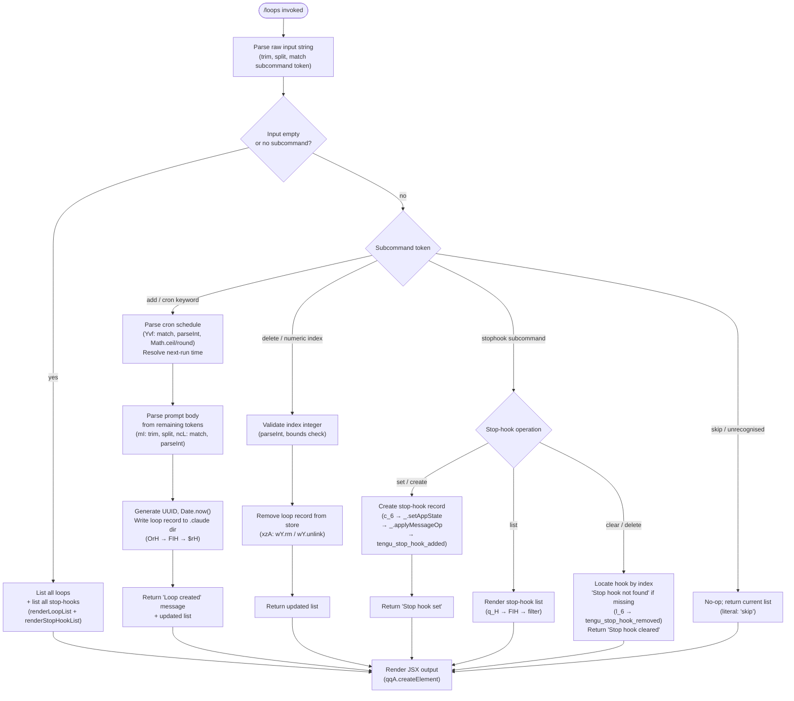

# `/loops`

> Analysis basis: CC v2.1.162 bundle.js (AST extraction + Claude interpretation)
> Minimum version: v2.1.162

---

## Overview

The `/loops` command provides a unified management interface for two related scheduling primitives: recurring loops (cron-style background task loops) and stop-hooks (one-shot or persistent hooks that fire when a session stops). It enables the user to list existing loops and stop-hooks, create new ones by specifying a schedule or prompt, and delete entries by index. The command is rendered as an interactive JSX component and operates against persisted configuration in the `.claude` project directory.

---

## Registration

| Field | Value |
|---|---|
| type | `local-jsx` |
| name | `loops` |
| description | `List, create, and delete recurring loops and stop-hooks` |
| loc_byte | `12415895` |
| loc_byte_end | `12416077` |
| loc_line | `8785` |
| immediate | `true` |
| module_id | `AHK` |
| load_inline | `true` |
| arbor_handler.name | `wvf` |
| arbor_handler.fqn | `claude-2.1.162::wvf` |
| arbor_handler.kind | `AsyncFunction` |
| arbor_handler.resolution_path | `module_id` |
| arbor_handler.n_hits | `0` |

Analysis basis: CC v2.1.162 bundle.js:+12415895

---

## Input Branching

The command parses user input into one of five distinct operation branches: list (default/no subcommand), add a loop, delete a loop, manage stop-hooks, and a skip/no-op path. A Mermaid flowchart is used because there are more than three distinct branches.



Analysis basis: CC v2.1.162 bundle.js:+12414850, +12414890, +12415034, +12415137, +12415276, +12415402, +12415500, +12415588, +12415655

---

## Behavioral Spec

### Top-level handler (`wvf`)

The Arbor-resolved handler is `wvf` (AsyncFunction, resolution via `module_id` → `AHK`).

```
async function loopsCommandHandler(context):
    emit telemetry("tengu_loops_command")          // loc +12414852

    loopStore   = loadLoopStore(context)           // K_H → FIH
    daemonInfo  = loadDaemonSessionInfo(context)   // d_6 → rPH/FMq
    appState    = context.getAppState()            // _.getAppState

    rawInput    = context.inputString
    subcommand  = parseSubcommand(rawInput)        // S6 + A.map

    switch subcommand.kind:
        case "cron" / "add":
            schedule = parseCronSchedule(rawInput) // Yvf
            loop     = createLoopRecord(schedule)  // OrH
            persistLoop(loop)                      // $rH → I58.writeFile
            return renderResult("loop created", updatedList)

        case "stophook set":
            setStopHook(context, rawInput)         // c_6
            return renderResult("Stop hook set")   // literal +12415612

        case "stophook clear":
            clearStopHook(context, rawInput)       // l_6
            // "Stop hook not found" (+12415294) or
            // "Stop hook cleared"  (+12415316)
            return renderResult(message)

        case "skip":
            // literal "skip" +12415761 — no-op path
            return renderCurrentList(loopStore)

        default (list):
            return renderCurrentList(loopStore)

    // Final JSX render
    return qqA.createElement(...)                  // +12415655
```

Analysis basis: CC v2.1.162 bundle.js:+12414850

---

### Cron schedule parser (`Yvf`)

Parses a human-supplied schedule string (e.g., `"* * * * *"` or named shortcuts) into a numeric next-run timestamp.

```
function parseCronSchedule(inputString):
    parts = inputString.match(cronPattern)       // H.match +12414438
    if parts is null:
        return null

    minute  = parseInt(parts[MINUTE], 10)        // +12414475
    // clamp: max(0, minute), ceil, round logic
    minute  = Math.max(0, minute)                // +12414560
    minute  = Math.ceil(minute)                  // +12414571
    minute  = Math.round(minute)                 // +12414644

    // Named shortcut resolution (via mI):
    //   "Every minute" (+4849729) → schedule every 60s (+12414583)
    //   "Every hour"   (+4849946) → schedule every 3600s

    // Field limits applied:
    //   seconds field max: 59   (+12414617)
    //   hours   field max: 23   (+12414688)
    //   days    field max: 31   (+12414741)

    parsedSchedule = buildScheduleFromFields(minute, hour, day, ...)
    return parsedSchedule
```

Analysis basis: CC v2.1.162 bundle.js:+12414438, +12414475, +12414560, +12414583, +12414617, +12414644, +12414688, +12414741

---

### Loop file persistence layer (`FIH`, `$rH`)

Loops are stored as JSON files inside the `.claude` directory (literal: `".claude"` at +4853006). The persistence layer reads, validates, and writes loop records.

```
async function readLoopFile(loopDir):
    encoding = "utf-8"                           // +4851865
    raw      = await fs.readFile(path, encoding) // _.readFile +4851837
    joined   = path.join(loopDir, ...)           // L7H → k58.join +4851768
    parsed   = JSON.parse(raw)                   // via p6

    if not Array.isArray(parsed):                // +4851981
        return []

    filtered = parsed.filter(isValidLoopEntry)
    return filtered

async function writeLoopFile(loopDir, loops):
    dirPath  = path.join(".claude", ...)         // $rH → k58.join +4852995
    await fs.mkdir(dirPath, recursive=true)      // I58.mkdir +4852985
    entries  = loops.map(serializeLoop)          // H.map +4853046
    await fs.writeFile(path, JSON.stringify(...))// I58.writeFile +4853082
```

Analysis basis: CC v2.1.162 bundle.js:+4851818, +4851837, +4851865, +4851981, +4852985, +4853006, +4853082

---

### Loop record creation (`OrH`)

```
async function createLoopRecord(schedule, promptText):
    id        = crypto.randomUUID()              // YO9.randomUUID +4853165
    createdAt = Date.now()                       // +4853227
    record    = buildLoopFields(id, createdAt,   // FGH +4853273
                                schedule,
                                promptText)
    await readLoopFile(...)                      // FIH +4853317
    loopList.push(record)                        // M.push +4853330
    await writeLoopFile(loopList)                // $rH +4853424
    emit telemetry via Ur                        // Ur +4853411
    notify via S6                                // S6 +4853362
    return record
```

Analysis basis: CC v2.1.162 bundle.js:+4853165, +4853227, +4853273, +4853317, +4853330

---

### Stop-hook set (`c_6`)

```
async function setStopHook(context, hookDefinition):
    Je_()                                        // gate check: hooks_gate +10747347
    trustGateCheck()                             // trust_gate +10747401
    goalSetCheck()                               // goal_set +10747479
    t6()                                         // feature flag check

    S6()                                         // notify
    d_6()                                        // load daemon info
    appState = context.getAppState()             // _.getAppState +10747536

    // Update state with new stop-hook
    context.setAppState(newState)                // _.setAppState +10747738
    context.applyMessageOp({                     // _.applyMessageOp +10747780
        type: "append",                          // +10748175
        role: "system",                          // +12415183
        content: hookDefinition
    })

    // Generate UUID for hook record
    hookId = thq.randomUUID()                    // _Sq +10748303
    E6()                                         // Zx6 +3599

    emit telemetry("tengu_stop_hook_added")      // +10747837
    return "Stop hook set"                       // +12415612
```

Analysis basis: CC v2.1.162 bundle.js:+10747347, +10747401, +10747479, +10747536, +10747738, +10747780, +10747837, +12415612

---

### Stop-hook clear (`l_6`)

```
async function clearStopHook(context, indexOrId):
    S6()                                         // notify +10747943
    d_6()                                        // load daemon info +10747950
    appState = context.getAppState()             // H.getAppState +10747954

    hook = findHookByIndex(appState, indexOrId)
    if hook is null:
        return "Stop hook not found"             // +12415294

    newState = removeHookFromState(appState, hook)
    context.setAppState(newState)                // H.setAppState +10748083
    context.applyMessageOp({                     // H.applyMessageOp +10748152
        type: "append",
        content: removedHookMarker
    })
    emit telemetry("tengu_stop_hook_removed")    // +10748209
    return "Stop hook cleared"                   // +12415316
```

Analysis basis: CC v2.1.162 bundle.js:+10747943, +10748083, +10748152, +10748209, +12415294, +12415316

---

### Stop-hook list query (`q_H`)

```
function queryStopHooks(loopStore, appState):
    if not ue.has(appState):                     // ue → _.has +53036
        return []

    rawList = FIH(loopStore)                     // readLoopFile +4853544
    filtered = rawList.filter(isStopHook)        // q.filter +4853553
    result   = filtered.filter(entry =>          // A.has +4853568
                   knownHookIds.has(entry.id))
    await writeLoopFile(result)                  // $rH +4853617
    return result
```

Analysis basis: CC v2.1.162 bundle.js:+4853495, +4853544, +4853553, +4853568, +4853617

---

### Schedule descriptor (`zN`)

Converts a stored cron schedule record back into a human-readable next-run description.

```
function describeNextRun(scheduleRecord):
    trimmed = scheduleRecord.trim()              // H.trim +4849609
    match   = trimmed.match(cronFieldPattern)    // K.match +4849750
    if not match:
        return "Every minute"                    // +4849729 (fallback)

    minuteField = parseInt(match.minute, 10)     // +4849785

    // Walk UTC time fields for next firing:
    //   setUTCDate   +4850505
    //   getUTCDate   +4850518
    //   setUTCHours  +4850536
    //   getUTCDay    +4850486
    //   getDay       +4850565

    if minuteField covers full hour:
        return "Every hour"                      // +4849946
    else:
        nextTs = computeNextTimestamp(match)     // w.toString +4849983
        return formatTimestamp(nextTs)

    // Range notation "1-5" is recognized         // +4850653
```

Analysis basis: CC v2.1.162 bundle.js:+4849609, +4849729, +4849785, +4849946, +4850486, +4850505, +4850518, +4850536, +4850565, +4850653

---

## State & Side Effects

| Item | Detail |
|---|---|
| Telemetry — primary | `tengu_loops_command` (fired on every invocation; +12414852) |
| Telemetry — stop-hook added | `tengu_stop_hook_added` (+10747837) |
| Telemetry — stop-hook removed | `tengu_stop_hook_removed` (+10748209) |
| Telemetry — background dispatch | `tengu_bg_dispatch_sigkill_escalate` (+15996373), `tengu_bg_dispatch_low_mem` (+15996974) |
| Telemetry — daemon | `tengu_daemon_config_reload` (+16011003), `tengu_daemon_yield` (+16015226), `tengu_daemon_control` (+16032559), `tengu_daemon_stop` (+16032484), `tengu_daemon_stop_failed` (+16032521) |
| Telemetry — spare/claim | `tengu_bg_spare_enable` (+15997678), `tengu_bg_spare_claim` (+15997806), `tengu_bg_spare_claim_fail` (+15998072), `tengu_bg_sendclaim_failed` (+15976082) |
| Telemetry — background session | `tengu_bg_low_mem_mb` (+12950873), `daemon_bg_session_create` (+15996689) |
| Telemetry — feature flags | `tengu_feature_ok` (+1008233), `tengu_feature_bad` (+1008295), `tengu_feature_sad` (+1008376) |
| Telemetry — misc | `tengu_bg_state_read_transient` (+4143655), `tengu_skill_file_changed` (+14080086), `tengu_mcp_skills` (+6926634), `tengu_stop_hook_removed` (+10748209) |
| Filesystem writes | Loop JSON files written to `.claude/` directory via `I58.writeFile`; stop-hooks persisted via `applyMessageOp` |
| Filesystem reads | Loop list read via `_.readFile` (utf-8); daemon status from `daemon.status.json` (+12680289) |
| appState changes | Stop-hook set/clear operations mutate `appState` via `setAppState` and `applyMessageOp` with role `"system"` |
| Hook registration | Stop-hooks registered with types `"prompt"` (+10747266) and `"stophook"` (+12415034); `goal_status` attachment (+10748372) used for goal tracking |
| JSX render | Output rendered via `qqA.createElement` (+12415655) — the `local-jsx` type means the return value is a React element, not plain text |
| Daemon interaction | `d_6` reads daemon session info including loop run state; `S6` notifies the daemon of changes |
| File cleanup | Loop deletion uses `wY.rm` / `wY.unlink` to remove backing files |
| UUID generation | New loop records use `YO9.randomUUID` (+4853165); stop-hook records use `thq.randomUUID` (+10748303) |

---

## Version History

| Version | Change |
|---|---|
| v2.1.162 | Initial analysis |

---

## Common Mistakes

1. **Omitting the subcommand entirely when intending to add a loop** — without an explicit `add`/cron-expression token, the command defaults to the list path and creates nothing.
2. **Providing an out-of-range deletion index** — the parser applies `parseInt` with bounds checking; a non-numeric or out-of-range index will silently fall through to the "skip" path rather than raising a visible error.
3. **Confusing loop schedules with stop-hooks** — loops fire on a cron schedule while stop-hooks fire at session termination; they share the same `/loops` UI but are stored and applied differently.
4. **Expecting synchronous confirmation of loop execution** — `/loops` writes the schedule record and returns; actual loop execution is handled by the daemon subprocess, which may not be running at the time of creation.
5. **Editing the `.claude` directory manually** — the loop store is read as JSON via `readFile`; a malformed file causes `Array.isArray` to fail and returns an empty list, silently losing all prior entries.
6. **Using the `stophook clear` subcommand with a text name instead of a numeric index** — the lookup is index-based (`parseInt`), so passing a string description yields "Stop hook not found".

---

## Appendix — Identifier Mapping

> For bundle debugging only. Identifiers change across versions.

| Identifier | Role |
|---|---|
| `wvf` | Top-level loops command handler (AsyncFunction; Arbor-resolved entry point) |
| `c` | Generic utility / constant (reused across many call sites) |
| `K_H` | Loop store loader — orchestrates `FIH` and `oG` |
| `FIH` | Core loop file read/parse pipeline |
| `i6` | File path helper used inside loop file reader |
| `L7H` | Path join helper for `.claude` loop directory |
| `M4` | Module-level path resolver (calls `Nv`) |
| `o1` | File-error classifier (ENOENT/EACCES/EPERM/etc.) |
| `V8` | Generic value wrapper / result box |
| `kH` | Loop record validator / queue writer |
| `t_` | Error string builder |
| `tH` | String coercion helper |
| `wq` | Essential-traffic network queue |
| `Gj4` | Queue shift/push manager (sliding window) |
| `v` | HTTP fetch helper (debug, content-type, user-agent) |
| `PgK` | Fetch pipeline orchestrator |
| `H` | Bootstrap/fetch state container (also reused as generic identifier) |
| `SH` | JSON serializer wrapper (`JSON.stringify`) |
| `V4` | URL/string redaction utility (`[REDACTED]`) |
| `WpH` | Fetch policy helper |
| `EgK` | Buffered HTTP sender (byteLength, chunked) |
| `mI` | Cron text pre-processor (trim, split, push) |
| `ncL` | Cron field tokenizer (split, match, parseInt, Set.add) |
| `A` | Generic array accumulator (reused) |
| `L` | Generic list / stream (reused) |
| `q` | Generic set/queue (reused) |
| `f` | Generic file/stream handle (reused) |
| `oG` | Secondary loop store helper (calls `Nv`) |
| `Nv` | Low-level path/config resolver |
| `d_6` | Daemon session info loader (K.set, FMq) |
| `rPH` | Daemon status setter |
| `K` | Generic map / key store (reused) |
| `FMq` | Daemon info mapper (`H.map`) |
| `S6` | Daemon notify / status signal (calls `Nv`) |
| `zN` | Schedule descriptor — converts cron record to human-readable next-run string |
| `w` | Background session manager (claims, kills, state transitions) |
| `S` | Session writer (transient yield) |
| `D` | Session state machine (stop/start/updateConfig/kill) |
| `n8` | Abort-with-timeout helper |
| `O` | Stopped session reporter (`x8`) |
| `RH` | Feature flag OK reporter |
| `Z6` | Feature flag base helper (`Zx6`) |
| `hH` | Feature flag sad reporter |
| `zC8` | Low-memory check dispatcher (macOS, 1024 MB threshold) |
| `j6` | Background dispatch core (fYH, gU, C6) |
| `Gj6` | Pins file reader (`pins.json`) |
| `UG_` | Pins path builder (`G2.join`, `mE`) |
| `p6` | JSON parser wrapper (`JSON.parse`) |
| `R8` | File read result normalizer |
| `WuL` | Pinned-session directory scanner |
| `F` | Session retire-if-settled helper |
| `yzA` | Spare-session claim orchestrator |
| `OfA` | Claim frame writer (mkdir, writeFile, JSON.stringify) |
| `vK5` | Claim sender with timeout and ECONNREFUSED retry |
| `NK5` | Claim frame builder (`Zg.buildClaimFrame`) |
| `rf` | Result-ok wrapper |
| `TH` | String coercion (String constructor) |
| `lF` | Binary frame encoder (Buffer, writeUInt32BE, writeUInt8, copy) |
| `xzA` | Background session lifecycle manager (done/killed/failed/crashed/blocked/working states) |
| `CK` | Session config path builder |
| `Hq` | Session state reader/writer (order, stateOrder, mLH, jwH maps) |
| `iD` | Session active-state checker |
| `ff` | Session log serializer (ez, iJ) |
| `NA6` | Session timing recorder (Date.now, BYf) |
| `LMH` | Session log path resolver |
| `jT` | Session log path split helper |
| `sF` | Session log path writer (K8A, ZA6) |
| `Vy6` | Session directory initializer (mkdir, M8A) |
| `Y` | Forced-shutdown handler (process.exit, z.abort) |
| `Nj` | Shutdown message emitter |
| `z` | Daemon control abort/stop orchestrator (hH, RH, Kh, jp) |
| `C` | Rate-limit event queue (enqueue, randomUUID, S6) |
| `qsq` | Queue initializer |
| `k` | Chokidar file-watcher wrapper |
| `J` | Kill-all-sessions helper (A.values, k.kill) |
| `$` | Process record store (`p1K`) |
| `p1K` | Process launcher (Ur, Date.now, V9, GS6) |
| `Ur` | Process UUID generator (`gKH`) |
| `V9` | Async-local-storage store reader (`d0L.getStore`) |
| `GS6` | Daemon status JSON path builder |
| `j` | Date wrapper with UTC helpers |
| `q_H` | Stop-hook list query (ue, FIH, filter, $rH) |
| `ue` | AppState has-hook guard (`_.has`) |
| `$rH` | Loop file writer (mkdir, map, writeFile, L7H, SH) |
| `l_6` | Stop-hook clear handler (setAppState, applyMessageOp, telemetry) |
| `_Sq` | UUID generator for stop-hook records (`thq.randomUUID`) |
| `E6` | Zx6 wrapper (event emitter base) |
| `Zx6` | Event emitter primitive |
| `Yvf` | Cron schedule parser (match, parseInt, Math.max/ceil/round, mI) |
| `OrH` | Loop record creation (randomUUID, Date.now, FGH, FIH, $rH) |
| `FGH` | Loop field builder |
| `M` | MCP server manager (RCH, xp8, ROA, L.get/values) |
| `RCH` | MCP connection handler (jl, sI, Pvq, ja_, Xa_, kvq, etc.) |
| `jl` | MCP tool schema builder |
| `sI` | MCP server initializer (nO, CR_) |
| `q_` | Config resolver (`_`) |
| `sI6` | MCP server state index |
| `Pvq` | MCP connection attempt (Ps_, AXH, kz8, Date.now) |
| `yz8` | MCP connection backoff (kz8, wP) |
| `vz8` | MCP connection state machine (W4) |
| `Y8` | MCP debug logger (zBH.push, Dr.logMCPDebug) |
| `ja_` | MCP OAuth start flow (SAf, BQ, kAf, etc.) |
| `Xa_` | MCP OAuth callback handler (BQ, yAf, O_6, D_6) |
| `kvq` | MCP connection result handler (Yv8, Ps_, V9, jv8) |
| `Ja_` | MCP connection state updater (wP, W4, Y8, TH) |
| `IR_` | MCP include-filter checker (G8, A.includes) |
| `hN` | MCP skills telemetry emitter (`j6`, `tengu_mcp_skills`) |
| `G7` | MCP error logger (zBH.push, Dr.logMCPError) |
| `Tvq` | MCP tool builder (PB) |
| `I_6` | MCP tool index parser (parseInt) |
| `Xv8` | MCP tool version parser (parseInt) |
| `xp8` | MCP connection result applier (applyMcpUpdate, SCH, Y8, hk) |
| `SCH` | MCP connection state checker (AXH) |
| `hk` | MCP connection cleanup (N_6, K.cleanup, hN) |
| `ROA` | MCP server roster updater (Object.entries, RCH, xp8) |
| `Rz8` | MCP server filter (a$7.has, yR_.has) |
| `N_6` | MCP connection state normalizer (AXH) |
| `c_6` | Stop-hook set handler (Je_, t6, S6, d_6, getAppState, setAppState, applyMessageOp) |
| `Je_` | Gate check orchestrator (dU, xY, U_, Lf) |
| `dU` | Policy-settings gate (m8 → policySettings) |
| `m8` | Policy reader (Xc6, gQ) |
| `xY` | Policy state checker (m8, yA) |
| `U_` | Trust gate checker |
| `Lf` | Permission resolver (yWL) |
| `yWL` | Permission walk (tH, UmH, T9, C6, ucH, xQ, x6, bY.resolve) |
| `t6` | Feature flag goal-set check (c, Z6) |
| `GJ` | Output-token counter (NmH, Object.values, `outputTokens`) |

---

Note: index built via Arbor fallback; some signals (telemetry, literals) may be missing — see arbor-fallback.js.