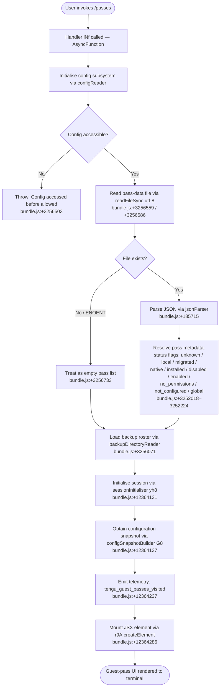

# `/passes`

> Analysis basis: CC v2.1.162 bundle.js (AST extraction + Claude interpretation)
> Minimum version: v2.1.162

---

## Overview

The `/passes` command allows users to share a free week of Claude Code with friends by presenting a guest-pass management UI. It is implemented as a `local-jsx` command, meaning it renders a JSX component directly in the terminal UI rather than sending a text prompt to the model. When invoked, the handler (`lNf`) initialises the configuration subsystem, loads existing pass data, and mounts an interactive React element to guide the user through viewing, sending, or managing guest passes.

---

## Registration

| Field | Value |
|---|---|
| type | `local-jsx` |
| name | `passes` |
| description | Share a free week of Claude Code with friends |
| loc_byte | `12364414` |
| loc_byte_end | `12364736` |
| loc_line | `8687` |
| isHidden | `null` (not hidden) |
| module_id | `Xeq` |
| load_inline | `true` |
| arbor_handler.name | `lNf` |
| arbor_handler.fqn | `claude-2.1.162::lNf` |
| arbor_handler.kind | `AsyncFunction` |
| arbor_handler.resolution_path | `module_id` |
| arbor_handler.n_hits | `2` |

Analysis basis: CC v2.1.162 bundle.js:+12364414

---

## Input Branching

The command has three or more meaningful branches depending on configuration state, pass-data availability, and UI rendering outcome, so a Mermaid flowchart is used.



---

## Behavioral Spec

### Handler Entry (`lNf`)

The Arbor-resolved handler `lNf` is an `AsyncFunction` that orchestrates the full lifecycle of the `/passes` command.

```
async function passesCommandHandler(commandContext):
    # Step 1 — ensure configuration is ready
    config = await configReader(commandContext)          # calls C6
    if config not ready:
        throw Error("Config accessed before allowed.")  # bundle.js:+3256503

    # Step 2 — load pass-data file
    try:
        rawBytes = readFileSync(passDataFilePath, "utf-8")  # bundle.js:+3256559/+3256586
        passData = jsonParser(rawBytes)                      # bundle.js:+185715
    except ENOENT:                                           # bundle.js:+3256733
        passData = emptyPassList()

    # Step 3 — resolve per-pass status metadata
    for each pass in passData:
        pass.status = resolvePassStatus(pass)   # see resolvePassStatus below

    # Step 4 — load backup roster
    backups = backupDirectoryReader(backupDir)  # "backups" dir  bundle.js:+3256071

    # Step 5 — initialise session
    sessionState = await sessionInitialiser(commandContext)   # yh8, bundle.js:+12364131

    # Step 6 — build config snapshot
    configSnapshot = configSnapshotBuilder(sessionState)      # G8,  bundle.js:+12364137

    # Step 7 — emit telemetry
    emit("tengu_guest_passes_visited")                        # bundle.js:+12364237

    # Step 8 — render UI
    element = jsxFactory.createElement(PassesUIComponent, {
        passes: passData,
        backups: backups,
        config: configSnapshot,
    })
    return renderToTerminal(element)                          # bundle.js:+12364286
```

Analysis basis: CC v2.1.162 bundle.js:+12364097

---

### Pass Status Resolution

```
function resolvePassStatus(pass):
    # Possible status string values (bundle.js:+3252018–3252224):
    #   "unknown", "local", "migrated", "native", "installed",
    #   "disabled", "enabled", "no_permissions", "not_configured", "global"
    match pass.rawState:
        case 0:        return "unknown"
        case 1:        return "enabled"
        case "local":  return "local"
        ...            # each literal maps to its string label
    return "unknown"
```

Analysis basis: CC v2.1.162 bundle.js:+3252018

---

### Configuration Reader (`C6` / `configReader`)

`configReader` is the shared config-access layer used across the CLI. When called from `/passes`, it:

1. Checks whether config access is permitted at this point in the lifecycle.
2. If not permitted, raises an `Error` with the literal `"Config accessed before allowed."` (bundle.js:+3256503).
3. If permitted, reads the config file with `readFileSync` in `utf-8` encoding (bundle.js:+3256559, +3256586), parses JSON (bundle.js:+185715), applies prefix-stripping via `prefixStripper` (`Zx`, bundle.js:+3256609), and returns the config object.
4. On any error whose `code` is `"ENOENT"` (bundle.js:+3256733), returns a safe default rather than propagating.

Analysis basis: CC v2.1.162 bundle.js:+3253251

---

### Config-File Write Guard (`configWriteGuard` / `jj_`)

Although `/passes` is a read-oriented command, `jj_` (the config-write path reached transitively via the config snapshot builder) enforces two important safety invariants:

1. **Lock-contention guard** — if acquiring the write lock takes longer than expected, emits `tengu_config_lock_contention` and logs a warning including the literal `"Lock acquisition took longer than expected - another Claude instance may be running"` (bundle.js:+3254470).
2. **Auth-loss prevention** — before committing a write, the re-read config is compared against the in-memory cache. If auth data present in cache is absent from the re-read, the write is aborted and `tengu_config_auth_loss_prevented` is emitted (bundle.js:+3255038), with the literal `"saveConfigWithLock: re-read config is missing auth that cache has; refusing to write to avoid wiping ~/.claude.json. See GH #3117."` (bundle.js:+3254886).
3. **Backup rotation** — keeps at most **5** backup copies of the config file (bundle.js:+3255489), using the naming pattern `".backup."` (bundle.js:+3255356), with file permissions set to octal **600** (decimal `384`, bundle.js:+3255771).

Analysis basis: CC v2.1.162 bundle.js:+3251373

---

### Session Initialiser (`yh8`)

`yh8` bootstraps the auth/session layer used to validate that the user is entitled to view or issue guest passes:

```
async function sessionInitialiser(ctx):
    authDriver = selectAuthDriver(ctx)   # TL / AD / pJ chain
    if no valid auth token:
        throw Error("ANTHROPIC_API_KEY, ANTHROPIC_AUTH_TOKEN, CLAUDE_CODE_OAUTH_TOKEN, "
                    "or WIF env vars (ANTHROPIC_FEDERATION_RULE_ID + ANTHROPIC_ORGANIZATION_ID) required")
        # bundle.js:+2996304
    session = await openSession(authDriver)
    return session
```

Analysis basis: CC v2.1.162 bundle.js:+12364131

---

### Config Snapshot Builder (`G8`)

`G8` assembles a point-in-time snapshot of the global and local configuration needed by the Passes UI:

```
function configSnapshotBuilder(sessionState):
    snapshot = {}
    snapshot.theme      = oneOf("dark", "auto", "normal")   # bundle.js:+3249567/+3249596/+3249625
    snapshot.liveReload = watchedConfigReader(lT, bWL)       # bundle.js:+3251377
    snapshot.passRoster = passRosterReader(Mn1)              # bundle.js:+3251448
    snapshot.timestamp  = stampedConfig(s18)                 # bundle.js:+3251473
    if globalConfigFallbackNeeded:
        logWarning("saveGlobalConfig fallback: re-read config is missing auth "
                   "that cache has; refusing to write. See GH #3117.")
        # bundle.js:+3251580
    return snapshot
```

Analysis basis: CC v2.1.162 bundle.js:+12364137

---

### Bootstrap API Fetch (`bootstrapFetcher` / `H` in call graph)

`H` implements the network leg that refreshes pass entitlement data from the Anthropic API:

- Logs `"[Bootstrap] Fetching"` before the request (bundle.js:+15590993).
- Sends `Content-Type: application/json` and `User-Agent: <agent>` headers (bundle.js:+15591078, +15591112).
- Timeout: **5 000 ms** (bundle.js:+15591194).
- On parse failure emits `tengu_feature_bad` with label `"parse_failed"` (bundle.js:+15591337).
- On success logs `"[Bootstrap] Fetch ok"` (bundle.js:+15591367) and emits the telemetry event `"api_bootstrap_fetch"` (bundle.js:+15591315).

Analysis basis: CC v2.1.162 bundle.js:+15590991

---

## State & Side Effects

| Item | Detail |
|---|---|
| Telemetry — `tengu_guest_passes_visited` | Fired once per `/passes` invocation (bundle.js:+12364237) |
| Telemetry — `tengu_config_parse_error` | Fired when the config JSON cannot be parsed (bundle.js:+3257134) |
| Telemetry — `tengu_config_lock_contention` | Fired when config write-lock wait exceeds threshold (bundle.js:+3254559) |
| Telemetry — `tengu_config_stale_write` | Fired when a stale config write is detected (bundle.js:+3254695) |
| Telemetry — `tengu_config_auth_loss_prevented` | Fired when a write that would erase auth is blocked (bundle.js:+3255038) |
| Telemetry — `tengu_feature_ok` | Fired by the feature-flag checker on success (bundle.js:+1008233) |
| Telemetry — `tengu_feature_bad` | Fired by the feature-flag checker on failure/parse error (bundle.js:+1008295) |
| Telemetry — `tengu_bg_spare_enable` | Fired when background spare worker is enabled during session init (bundle.js:+15997678) |
| Telemetry — `tengu_bg_spare_claim` | Fired when a spare background worker is claimed (bundle.js:+15997806) |
| Telemetry — `tengu_bg_spare_claim_fail` | Fired when spare claim fails (bundle.js:+15998072) |
| Telemetry — `tengu_bg_dispatch_sigkill_escalate` | Fired when a background worker is SIGKILL-escalated (bundle.js:+15996373) |
| Telemetry — `tengu_bg_dispatch_low_mem` | Fired when background dispatch is skipped due to low memory (bundle.js:+15996974) |
| Telemetry — `tengu_bg_low_mem_mb` | Reports free-memory level in MB (bundle.js:+12950873) |
| Telemetry — `tengu_bg_sendclaim_failed` | Fired when IPC claim message cannot be sent (bundle.js:+15976082) |
| Telemetry — `tengu_daemon_yield` | Fired when daemon yields to a foreground/service daemon (bundle.js:+16015226) |
| Telemetry — `tengu_daemon_control` | Fired on daemon control-plane events (bundle.js:+16032559) |
| Telemetry — `tengu_daemon_config_reload` | Fired when the daemon reloads its config (bundle.js:+16011003) |
| Telemetry — `api_bootstrap_fetch` | Fired by the entitlement bootstrap HTTP fetch (bundle.js:+15591315) |
| Telemetry — `daemon_bg_session_create` | Fired when a new background session is created (bundle.js:+15996689) |
| Telemetry — `rate_limit_event` | Fired when an API rate-limit is encountered (bundle.js:+15778029) |
| File I/O | Reads pass-data JSON file; reads and (if needed) writes `~/.claude.json`; maintains up to 5 backup copies |
| Config write guard | Prevents auth-erasure writes (GH #3117 safeguard) |
| JSX rendering | Mounts a guest-pass UI component via `r9A.createElement` (bundle.js:+12364286) |
| Hook registration | `J9` registers a hook via `jJA.register` (bundle.js:+60123) during config-watch setup |
| File watcher | `bWL` sets up / tears down a `watchFile` / `unwatchFile` listener on the config file (bundle.js:+3252754, +3253087) |
| Sound | None observed in depth-2 traversal |

---

## Version History

| Version | Change |
|---|---|
| v2.1.162 | Initial analysis |

---

## Common Mistakes

1. **Invoking `/passes` before authentication is complete** — the handler will throw `"Config accessed before allowed."` if the config subsystem has not yet been initialised; ensure the CLI has completed its startup sequence.
2. **Corrupted or non-JSON pass-data file** — if the file at the expected path is not valid JSON, a `tengu_config_parse_error` telemetry event is emitted and the command may exit with an error rather than showing the UI; delete or repair the file.
3. **Missing API credentials** — `/passes` calls the session initialiser which requires at least one of `ANTHROPIC_API_KEY`, `ANTHROPIC_AUTH_TOKEN`, `CLAUDE_CODE_OAUTH_TOKEN`, or the WIF pair (`ANTHROPIC_FEDERATION_RULE_ID` + `ANTHROPIC_ORGANIZATION_ID`) to be set (bundle.js:+2996304).
4. **Concurrent Claude Code instances** — if another instance holds the config write-lock, the command will log a contention warning and may be slower to display; avoid running multiple CC processes that write config simultaneously.
5. **Expecting text output from a model** — `/passes` is a `local-jsx` command; it renders an interactive terminal UI component, not a model-generated text response. Piping or scripting the output will not yield machine-parseable text.

---

## Appendix — Identifier Mapping

> For bundle debugging only. Identifiers change across versions.

| Identifier | Role |
|---|---|
| `lNf` | Main handler (`AsyncFunction`) for `/passes` command |
| `C6` | Configuration reader / config-access gatekeeper |
| `i6` | Logger / internal logging utility |
| `zj_` | Config path resolver |
| `DYH` | Low-level config file reader (readFileSync + JSON parse + backup logic) |
| `q` | Filesystem module wrapper (readFileSync, statSync, mkdirSync, copyFileSync, etc.) |
| `p6` | JSON parser wrapper |
| `Zx` | String prefix-stripper (startsWith + slice) |
| `H` | Bootstrap API fetcher (HTTP + entitlement refresh) |
| `_` | Filesystem utility (readdirStringSync, statSync, toUpperCase) |
| `V8` | Version/build-info constant provider |
| `$n1` | Backup directory enumerator |
| `Xj_` | Backup path builder (path.join + subdirectory resolver) |
| `M` | MCP server registry / server map accessor |
| `$` | Project-root / path anchor utility |
| `v` | Config serialiser / debug-mode helper |
| `PgK` | Config schema validator |
| `SH` | JSON stringifier wrapper |
| `V4` | Path-redaction utility (replaces home dir with `[REDACTED]`) |
| `WpH` | Platform-specific path expander |
| `EgK` | Config file writer (with byte-length check and chunked write) |
| `c` | React/UI context or app-state container |
| `w` | Background worker / daemon subprocess manager |
| `A` | Process / worker map (get, set, values) |
| `S` | Daemon write-channel / IPC transport |
| `n8` | Async timeout/abort utility |
| `RH` | Feature-flag failure reporter (`tengu_feature_bad`) |
| `hH` | Feature-flag success reporter (`tengu_feature_ok`) |
| `zC8` | macOS free-memory checker (emits `tengu_bg_low_mem_mb`) |
| `Gj6` | Background session roster reader (readFile + filter) |
| `kH` | Background session garbage-collector |
| `F` | Background session handle (retireIfSettled) |
| `j6` | Background session dispatcher / claim manager |
| `yzA` | IPC claim sender (socket connect + write + end) |
| `xzA` | Background session lifecycle manager (create, track, cleanup) |
| `L` | Secondary async-task tracker (add, delete, finally) |
| `Y` | Forced-shutdown handler (process.exit + abort) |
| `Z6` | Zero-padding / formatting utility |
| `C` | Rate-limit event queue (enqueue + randomUUID) |
| `bWL` | Config file watcher (watchFile / unwatchFile) |
| `jo` | Config change notifier |
| `J9` | Hook registrar (jJA.register) |
| `yh8` | Session initialiser (auth driver selection + session open) |
| `TL` | Auth driver loader (top-level) |
| `AD` | Auth driver orchestrator |
| `$4` | Token reader/validator |
| `pJ` | OAuth/profile-based auth driver |
| `W5` | First-party auth helper |
| `xX` | Auth-token cache |
| `OO` | API-key auth driver |
| `YY6` | Auth-type detector |
| `idH` | Auth identity helper |
| `G8` | Config snapshot builder |
| `jj_` | Config write-with-lock (saveConfigWithLock) |
| `Pj1` | Config object merger |
| `zf_` | Config field extractor |
| `Xw6` | Config watcher refresh |
| `V` | Scrollable terminal view component |
| `P` | Terminal input / vim-mode editor component |
| `j` | Daemon process reference |
| `J` | Worker kill-all helper |
| `z` | Scroll-offset controller |
| `D` | Config-reload daemon controller |
| `h` | Focus/blur timing tracker |
| `YMA` | Vim mode state machine |
| `Z` | Background agent controller (stop/start/updateConfig) |
| `u56` | Atomic file writer (temp-file + rename + fchmod + fsync) |
| `O` | Symlink / lstat inspector |
| `R8` | Safe-write retry wrapper |
| `f` | File descriptor / stream handle |
| `bcH` | Config header/comment builder |
| `Mn1` | Pass roster entry builder (Object.entries) |
| `s18` | Timestamped config reader |
| `Jj_` | Global config write helper (saveGlobalConfig) |

---

Note: index built via Arbor fallback; some signals (telemetry, literals) may be missing — see arbor-fallback.js.