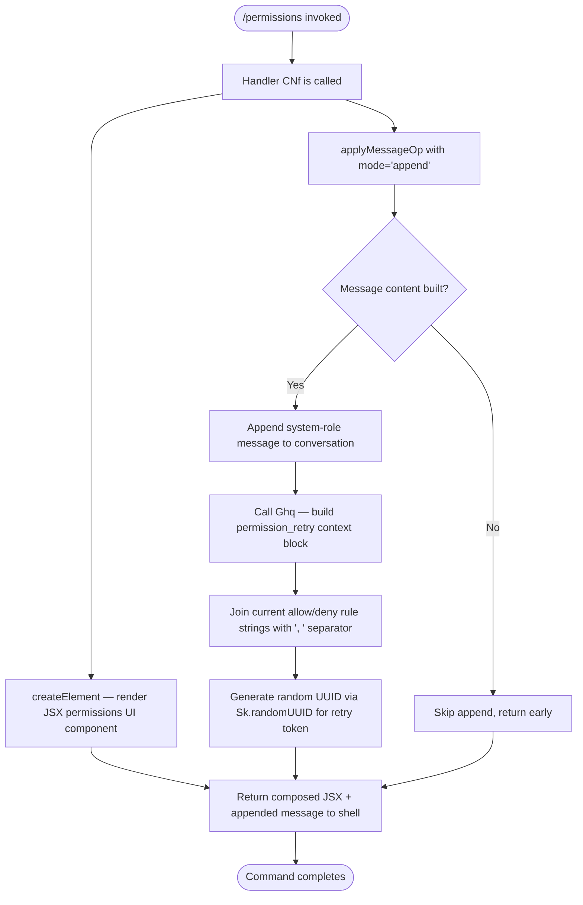

# `/permissions`

> Analysis basis: CC v2.1.162 bundle.js (AST extraction + Claude interpretation)
> Minimum version: v2.1.162

---

## Overview

The `/permissions` command (also accessible as `/allowed-tools`) provides an interactive JSX-based interface for managing the allow and deny lists that govern which tools the Claude Code agent may invoke. It renders a UI component, appends a structured system message describing the current permission state, and seeds a `permission_retry` context token so the agent can re-evaluate previously blocked tool calls.

---

## Registration

| Field | Value |
|---|---|
| type | `local-jsx` |
| name | `permissions` |
| description | Manage allow & deny tool permission rules |
| aliases | `["allowed-tools"]` |
| module_id | `atq` |
| load_inline | `true` |
| loc_byte | `12350575` |
| loc_byte_end | `12350745` |
| loc_line | `8687` |
| arbor_handler.name | `CNf` |
| arbor_handler.fqn | `claude-2.1.162::CNf` |
| arbor_handler.kind | `AsyncFunction` |
| arbor_handler.resolution_path | `module_id` |
| arbor_handler.n_hits | `0` |

Analysis basis: CC v2.1.162 bundle.js:+12350575

---

## Input Branching

The command exhibits three distinct runtime paths based on what the handler resolves when it runs: (1) rendering the JSX permissions UI, (2) appending the system/permission-state message, and (3) generating the `permission_retry` context via the `Ghq` helper. A Mermaid flowchart is therefore required.



Analysis basis: CC v2.1.162 bundle.js:+12350393, +12350446, +12350469, +12350488

---

## Behavioral Spec

### 1. Main Handler — Permissions UI Renderer

The handler `CNf` (Arbor-resolved, `resolution_path: module_id`) is an `AsyncFunction` registered inline via `load_inline: true`. It performs three coordinated actions when `/permissions` is invoked.

```
async function permissionsCommandHandler(context):

    # Step 1 — Render the JSX UI panel
    uiElement = createElement(PermissionsUIComponent, context.props)

    # Step 2 — Append a system-scoped message describing current permission state
    permissionStateText = buildPermissionRetryBlock(context)
    applyMessageOp(conversation, {
        mode: "append",          # literal "append" at bundle.js:+12350469
        role: "system",          # literal "system" at bundle.js:+10697557
        content: permissionStateText
    })

    # Step 3 — Return the composed UI element
    return uiElement
```

Analysis basis: CC v2.1.162 bundle.js:+12350393, +12350446, +12350469

---

### 2. Permission Retry Block Builder (`Ghq`)

The helper `Ghq` constructs the system message body that carries permission context to the model. It collects the current allow and deny rule strings, joins them, and stamps a fresh UUID.

```
function buildPermissionRetryBlock(context):

    # Collect current allow-list and deny-list rule descriptors
    ruleStrings = collectActivePermissionRules(context)

    # Join rules into a single human-readable summary
    summary = ruleStrings.join(", ")          # separator ", " at bundle.js:+10697619

    # Log at "info" level for diagnostic output
    log("info", summary)                       # literal "info" at bundle.js:+10697644

    # Generate a fresh correlation token for this retry opportunity
    retryToken = Sk.randomUUID()               # bundle.js:+10697701

    return {
        tag: "permission_retry",               # literal at bundle.js:+10697574
        rules: summary,
        token: retryToken
    }
```

Analysis basis: CC v2.1.162 bundle.js:+10697612, +10697574, +10697619, +10697644, +10697701

---

### 3. Permission Rule Normalisation Chain (`v` → `PgK`, `V4`, `EgK`, `WpH`)

Several utility functions reached at depth 2 normalise raw tool-name strings into canonical permission rule descriptors. The chain follows this pattern:

```
function normaliseToolPermissionRule(rawToolName):

    # Sanitise and upper-case the tool identifier fragment
    upperName = rawToolName.toUpperCase()      # bundle.js:+205919

    # Trim surrounding whitespace
    trimmed = upperName.trim()                 # bundle.js:+205942

    # Check membership in the known-tool set
    if knownToolSet.includes(trimmed):         # bundle.js:+205857
        canonical = lookupCanonicalName(trimmed)    # via PgK, bundle.js:+205835
    else:
        canonical = redactedFallback(trimmed)  # "[REDACTED]" literal, bundle.js:+197925

    # Apply path-segment normalisation
    normalised = applyPathNormalisation(canonical)   # V4, bundle.js:+205939

    # Resolve against project directory context
    resolved = resolveAgainstProjectDir(normalised)  # EgK, bundle.js:+205978

    return resolved
```

Notes on sub-steps:
- `PgK` performs an index-1 slice (`value: 1` at bundle.js:+204440) to strip a leading prefix character from raw tool names.
- `V4` replaces a substring starting at index 0 (`value: 0` at bundle.js:+197851), then performs a `lastIndexOf` + `slice` to extract the final path component (bundle.js:+198009, +198035). A secondary index `2` is used for a fallback slice position (bundle.js:+197954).
- `EgK` enforces a size cap using `Buffer.byteLength` (bundle.js:+205513), with an upper limit of `1000` bytes (bundle.js:+205624) and a secondary limit of `100` (bundle.js:+205643). Writes are batched via a `.then` continuation (bundle.js:+205563).
- `WpH` delegates to `pXA` for final path-level permission matching (bundle.js:+193039).

Analysis basis: CC v2.1.162 bundle.js:+205817, +205835, +205857, +205875, +205919, +205939, +205942, +205958, +205964, +205978

---

### 4. Bootstrap Fetch Path (`H` → `v`, `t6`)

Reachable via the call graph, `H` contains a network fetch path labelled `[Bootstrap] Fetching` (bundle.js:+15590993). This is used to hydrate initial permission state from a remote source when the local cache (via `e_.get`, bundle.js:+15591029) misses. The fetch sets `Content-Type: application/json` and a `User-Agent` header (bundle.js:+15591078, +15591112), with a timeout of `5000` ms (bundle.js:+15591194). On success it logs `[Bootstrap] Fetch ok` (bundle.js:+15591367); on parse failure it records `parse_failed` under the `api_bootstrap_fetch` event (bundle.js:+15591315, +15591337).

```
async function bootstrapPermissionState(cacheStore):
    cached = cacheStore.get(key)
    if cached exists:
        return cached

    log("[Bootstrap] Fetching ...")           # bundle.js:+15590993
    response = await fetch(endpoint, {
        headers: {
            "Content-Type": "application/json",
            "User-Agent": buildUserAgentString()
        },
        timeout: 5000                          # bundle.js:+15591194
    })

    if response.ok:
        log("[Bootstrap] Fetch ok")            # bundle.js:+15591367
        parsed = parseResponse(response)
        storeInCache(cacheStore, parsed)
        return parsed
    else:
        recordEvent("api_bootstrap_fetch", { status: "parse_failed" })
        return fallbackPermissions()
```

Analysis basis: CC v2.1.162 bundle.js:+15590991, +15591029, +15591078, +15591093, +15591112, +15591194, +15591315, +15591337, +15591367

---

### 5. Rule Text Canonicalisation (`a1` → `oHH`, `qq`, `rX`)

The `a1` function normalises human-readable rule text (e.g. user-typed tool names or glob patterns) into canonical internal form:

```
function canonicaliseRuleText(rawText):

    # Parse structured rule object from raw text
    ruleObj = parseRuleObject(rawText)        # oHH, bundle.js:+2236454

    # Normalise: trim, lower-case, apply model-tier aliases
    normalised = normaliseModelAlias(rawText) # qq, bundle.js:+2236491
    # Model alias map used inside qq:
    #   "opusplan"  → maps to extended planning tier  (bundle.js:+2240470)
    #   "[1m]"      → maps to 1-million-token context  (bundle.js:+2240496)
    #   "sonnet"    → maps to Sonnet tier              (bundle.js:+2240511)
    #   "haiku"     → maps to Haiku tier               (bundle.js:+2240550)
    #   "opus"      → maps to Opus tier                (bundle.js:+2240589)
    #   "best"      → maps to highest-available tier   (bundle.js:+2240626)

    # Apply glob/regex transformation for wildcard rules
    finalRule = applyGlobTransform(normalised) # rX, bundle.js:+2236504

    return finalRule
```

Analysis basis: CC v2.1.162 bundle.js:+2236454, +2236491, +2236504, +2240374, +2240385, +2240403, +2240470, +2240496, +2240511, +2240550, +2240589, +2240626

---

## State & Side Effects

| Item | Detail |
|---|---|
| Telemetry | `tengu_feature_sad` fired within the `t6 → c` path (bundle.js:+1008376) — likely records a sad-path / error event during rule evaluation or bootstrap |
| Message append | Appends a `system`-role message to the active conversation via `applyMessageOp` with mode `"append"` (bundle.js:+12350446, +12350469) |
| permission_retry token | Writes a `permission_retry`-tagged block carrying a fresh `randomUUID` into the conversation context (bundle.js:+10697574, +10697701) |
| Bootstrap cache | May perform a remote fetch to hydrate permission state; result stored in `e_` cache store (bundle.js:+15591029) |
| Buffer size enforcement | Rule text serialisation enforces a 1000-byte soft cap and 100-byte secondary cap via `Buffer.byteLength` (bundle.js:+205513, +205624, +205643) |
| JSX render | Produces a JSX element tree via `d9A.createElement` for display in the Claude Code shell (bundle.js:+12350393) |
| Sound | <!-- TODO: not found in depth-2 traversal; needs --depth 4 --> |
| appState changes | <!-- TODO: not found in depth-2 traversal; needs --depth 4 --> |

---

## Version History

| Version | Change |
|---|---|
| v2.1.162 | Initial analysis |

---

## Common Mistakes

1. **Expecting a plain text response**: `/permissions` renders a JSX UI panel (`local-jsx` type), not a plain markdown reply. Piping its output to text-only consumers will yield serialised JSX or nothing.
2. **Ignoring the `/allowed-tools` alias**: The command is equally reachable as `/allowed-tools`; scripting tools that hard-code `/permissions` will miss this alias.
3. **Assuming rules are applied synchronously**: The bootstrap fetch path (`H`) is async with a 5 000 ms timeout. Permission state may not be fully hydrated if the command is invoked immediately at session start.
4. **Treating `[REDACTED]` literals as errors**: When a tool name cannot be resolved to a known canonical form, the normalisation chain emits `[REDACTED]` as a placeholder (bundle.js:+197925) rather than throwing. Callers should handle this gracefully.
5. **Misinterpreting model-tier aliases in rule text**: Strings like `"best"`, `"sonnet"`, `"haiku"`, `"opus"`, `"opusplan"`, and `"[1m]"` carry special meaning inside rule canonicalisation (`qq`) and will be transformed before storage — they are not stored verbatim.
6. **Assuming the retry token is stable**: The `permission_retry` UUID is generated fresh on each invocation via `Sk.randomUUID()` and must not be cached or compared across sessions.

---

## Appendix — Identifier Mapping

> For bundle debugging only. Identifiers change across versions.

| Identifier | Role |
|---|---|
| `CNf` | Main async handler for `/permissions` command (Arbor-resolved; module `atq`) |
| `Ghq` | Builds the `permission_retry` context block; joins rule strings and stamps UUID |
| `H` | Top-level permission-state resolver; orchestrates bootstrap fetch and cache lookup |
| `v` | Tool-name normalisation entry point; dispatches to `PgK`, `V4`, `EgK`, `WpH` |
| `PgK` | Strips leading prefix character (index-1 slice) from raw tool name |
| `SH` | Serialises rule object via `JSON.stringify` for storage or transmission |
| `V4` | Path-component extractor; uses `lastIndexOf`/`slice` to isolate final segment |
| `WpH` | Delegates to `pXA` for final path-level permission matching |
| `EgK` | Enforces byte-length caps (1000 / 100) on rule text; async write via `.then` |
| `_3` | Helper reached from `H`; role unclear at depth 2 |
| `AY_` | Parses colon-separated rule strings: split, trim, indexOf, slice |
| `q` | Low-level filesystem/string utility; includes `OCK.unlinkSync` for temp-file cleanup |
| `LHH` | Membership test against `Y94` known-tool set (`Y94.has`) |
| `bJ` | String replacement utility operating on rule text |
| `a1` | Rule text canonicalisation entry point; calls `oHH`, `qq`, `rX` |
| `oHH` | Parses structured rule object from raw text; delegates to `k0`, `OqH`, `yA`, `Dd` |
| `qq` | Model-tier alias normaliser; maps `"sonnet"`, `"haiku"`, `"opus"`, `"best"`, etc. |
| `rX` | Glob/regex transformer for wildcard permission rules; calls `qq`, `g0` |
| `t6` | Triggers `tengu_feature_sad` telemetry event; calls `c` and `Z6` |
| `c` | Sad-path / error handler reached from `t6` |
| `Z6` | Sub-helper of `t6`; delegates to `Zx6` |

---

*Note: index built via Arbor fallback; some signals (telemetry, literals) may be missing — see arbor-fallback.js.*