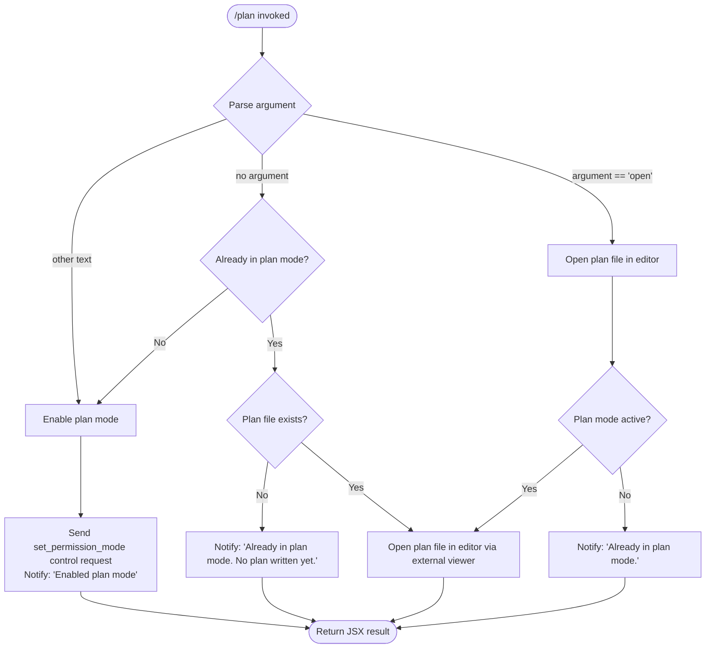

# `/plan`

> Analysis basis: CC v2.1.162 bundle.js (AST extraction + Claude interpretation)
> Minimum version: v2.1.162

---

## Overview

The `/plan` command enables **plan mode** for the current Claude Code session or opens the existing session plan for viewing or editing. When plan mode is not yet active, the command activates it and notifies the user; when already active, it either displays the current plan content or reports that no plan has been written yet, depending on whether a plan file exists.

---

## Registration

| Field | Value |
|---|---|
| type | `local-jsx` |
| name | `plan` |
| description | `Enable plan mode or view the current session plan` |
| argumentHint | `[open\|<description>]` |
| module_id | `_eq` |
| load_inline | `true` |
| loc_byte | `12352699` |
| loc_byte_end | `12352898` |
| loc_line | `8687` |
| arbor_handler.name | `uNf` |
| arbor_handler.fqn | `claude-2.1.162::uNf` |
| arbor_handler.kind | `AsyncFunction` |
| arbor_handler.resolution_path | `module_id` |
| arbor_handler.n_hits | `0` |

Analysis basis: CC v2.1.162 bundle.js:+12352699

---

## Input Branching

The command has five distinct branches driven by argument value and current session state, requiring a Mermaid flowchart.



Analysis basis: CC v2.1.162 bundle.js:+12351700, +12351839, +12351867, +12352088, +12352247

---

## Behavioral Spec

### Main Handler: `planCommandHandler` (`uNf`)

The primary async function resolving via `module_id` (`_eq`).

```
async function planCommandHandler(args, appState):
    currentMode   = readPermissionMode(appState)          // via permissionModeReader
    argument      = args.trim()                           // +12352069

    if argument == "open":                                // +12352088
        return openPlanFileFlow(appState)

    if currentMode != "plan":
        // Activate plan mode
        sendControlRequest("set_permission_mode", { mode: "plan" })  // +12351700, +12351730
        notify("Enabled plan mode")                       // +12351839
        return renderSuccess()

    else:
        // Already in plan mode
        if argument == "":
            planPath = resolvePlanFilePath(appState)
            if planFileExists(planPath):
                return openPlanFileFlow(appState)
            else:
                notify("Already in plan mode. No plan written yet.")  // +12352247
                return renderInfo()
        else:
            notify("Already in plan mode.")               // +12351867
            return renderInfo()
```

Analysis basis: CC v2.1.162 bundle.js:+12351577, +12351616, +12351700, +12351827, +12352069

---

### Permission Mode Control (`setPermissionModeControl`)

Sends a control request to the session to switch the active permission mode to `"plan"`.

```
function setPermissionModeControl(session, mode):
    session.sendControlRequest("set_permission_mode", { mode: mode })
    // mode value: "plan"                                // +12351730
```

Guard: if `bypassPermissions` mode is requested while `disableBypassPermissionsMode` is set or the session was not launched in bypass mode, the update is silently ignored with a debug log entry. Analysis basis: CC v2.1.162 bundle.js:+4733424

---

### Open Plan File in Editor (`openPlanFileInEditor`, `Hg`)

Suspends the Ink rendering loop, launches an external editor via `spawnSync`, then resumes rendering.

```
async function openPlanFileInEditor(planFilePath, appState):
    inkInstance = lookupInkInstance(appState)            // +11469623
    if not inkInstance:
        throw Error("Ink instance not found - cannot pause rendering")  // +11469664

    editorCommand = resolveEditorCommand()               // via lW
    inkInstance.enterAlternateScreen()                   // +11469817
    inkInstance.pause()                                  // +11469847
    inkInstance.suspendStdin()                           // +11469857

    argv = editorCommand.split(" ")                      // +11469896
    argv = argv.slice(relevant portion)                  // +11469921
    result = yUq.spawnSync(argv[0], [...argv.slice(1), planFilePath], {
        stdio: "inherit"                                 // +11469971
    })                                                   // +11469939

    content = fs.readFileSync(planFilePath, "utf-8")     // +11470241, +13165814

    inkInstance.exitAlternateScreen()                    // +11470319
    inkInstance.resumeStdin()                            // +11470348
    inkInstance.resume()                                 // +11470364

    return content
```

Analysis basis: CC v2.1.162 bundle.js:+11469616

---

### Resolve Plan File Path (`resolvePlanFilePath`, `gZ` → `FZ` → `N2H`)

Constructs or retrieves the path of the persisted plan file for the current session.

```
function resolvePlanFilePath(appState):
    sessionId  = getSessionId(appState)                  // via S6 / q3H
    basePath   = resolveStorageBase(sessionId)           // via FZ
    planPath   = path.join(basePath, ...)                // via Tg.join +13165680
    if not fileExists(planPath):                         // via R8 / V8
        return null
    return planPath
```

Analysis basis: CC v2.1.162 bundle.js:+12352198, +13165767, +13165680, +13165836

---

### Resolve Editor Command (`resolveEditorCommand`, `lW`)

Determines which editor binary to launch. Respects an `IDE` environment hint and falls back to standard editor discovery.

```
function resolveEditorCommand(env):
    editorHint = env["IDE"]                              // +5399885
    normalized = editorHint.toLowerCase()                // +5399940
    baseName   = path.basename(normalized)               // via TN.basename +5399998
    return mapEditorAlias(baseName)                      // via RkH +5400072
```

Analysis basis: CC v2.1.162 bundle.js:+12352441

---

### Permission Rules Management (`permissionRulesManager`, `J$`)

Handles setting mode alongside updating allow/deny/ask rule sets stored on the session.

```
function permissionRulesManager(controlRequest, sessionState):
    action = controlRequest.action   // "setMode" | "addRules" | "replaceRules" | "removeRules"
                                     //           | "addDirectories" | "removeDirectories"
    switch action:
        case "setMode":              // +4733336
            if mode == "bypassPermissions" and bypassNotAvailable:
                log("Ignoring permission update: ...")   // +4733424
                return
            sessionState.set("mode", mode)              // +4734618
        case "addRules":             // +4733700
            applyRuleAddition(sessionState, "alwaysAllowRules" | "alwaysDenyRules" | "alwaysAskRules")
        case "replaceRules":         // +4734048
            replaceExistingRules(sessionState, ...)
        case "removeRules":          // +4734705
            removeMatchingRules(sessionState, ...)
        case "addDirectories":       // +4734359
            addAllowedDirectories(sessionState, ...)
        case "removeDirectories":    // +4735089
            removeAllowedDirectories(sessionState, ...)
```

Analysis basis: CC v2.1.162 bundle.js:+4733422, +4733735, +4733857

---

### Session Control Request Dispatch (`sessionControlRequestDispatch`, `CSH`)

Receives a control request, reads current permission settings from multi-layer configuration, and delegates to the rules manager or mode setter.

```
function sessionControlRequestDispatch(request, sessionConfig):
    settings = mergeSettingsLayers(sessionConfig)
    // layers: policySettings, flagSettings, userSettings, localSettings
    //         +1278257, +1278307, +1278355, +1278403

    mode = settings.mode ?? "auto"                       // +10626218
    applyControlRequest(request, mode, settings)         // via rm / c5H
    log("info", request)                                 // +10626503
```

Analysis basis: CC v2.1.162 bundle.js:+12351616, +10626205, +10626296, +10626307, +10626401, +10626429

---

### Output Rendering (`renderPlanResult`, `Ne9` → `stH`)

Renders the result as a JSX component via Ink. Output is streamed line-by-line and ANSI codes are stripped before storage.

```
function renderPlanResult(message, kind):
    element = createElement(PlanResultComponent, { message, kind })
    stdinListener = setupStdinListener(element)           // via stH +7913306
    stripANSI = Bun.stripANSI                            // via u4 +3824834
    return element
```

Analysis basis: CC v2.1.162 bundle.js:+12352462, +12352466

---

## State & Side Effects

| Item | Detail |
|---|---|
| Telemetry | `tengu_feature_sad` (bundle.js:+1008376) |
| Session mode change | Sets permission mode to `"plan"` via `sendControlRequest("set_permission_mode", …)` (bundle.js:+12351700) |
| Plan file read | Reads plan file with `fs.readFileSync(path, "utf-8")` when opening (bundle.js:+11470241) |
| External process | Spawns editor via `spawnSync` with `stdio: "inherit"` (bundle.js:+11469939, +11469971) |
| Ink rendering suspension | Calls `enterAlternateScreen`, `pause`, `suspendStdin` before editor; `exitAlternateScreen`, `resumeStdin`, `resume` after (bundle.js:+11469817, +11469847, +11469857, +11470319, +11470348, +11470364) |
| Hook registration | `J9` calls `jJA.register` for cleanup/hook registration (bundle.js:+60123) |
| Permission rules appState | `alwaysAllowRules`, `alwaysDenyRules`, `alwaysAskRules`, allowed directories may be mutated by side-effect control requests (bundle.js:+4733885, +4733925, +4733950) |
| ANSI stripping | Output rendered through `Bun.stripANSI` before storage (bundle.js:+3824834) |
| File rotation | Plan file is rotated/renamed via `jy.rename` and pruned via `jy.unlink` when size thresholds are reached (bundle.js:+204817, +204857) |

---

## Version History

| Version | Change |
|---|---|
| v2.1.162 | Initial analysis |

---

## Common Mistakes

1. **Invoking `/plan` when already in plan mode with no plan file** — the command will respond with `"Already in plan mode. No plan written yet."` rather than performing any write action. The user must interact with the agent to produce a plan first.
2. **Expecting `/plan open` to work outside plan mode** — the `open` sub-command still requires plan mode to be active; without it the command falls through to the activation branch instead.
3. **Editor not launching** — if the `IDE` environment variable is unset or maps to an unknown alias, editor resolution may silently fail. Ensure the variable is set to a recognised IDE identifier before invoking `/plan open`.
4. **Bypass-permissions guard** — attempting to combine `/plan` activation with `bypassPermissions` mode in a session where `disableBypassPermissionsMode` is set will be silently rejected; the mode change is logged at debug level only (bundle.js:+4733424).
5. **Assuming synchronous completion** — the handler is an `AsyncFunction`; callers must await the result. Treating the return value synchronously will miss rendered output or file content.

---

## Appendix — Identifier Mapping

> For bundle debugging only. Identifiers change across versions.

| Identifier | Role |
|---|---|
| `uNf` | Main plan command handler (AsyncFunction) |
| `q` | File unlink / cleanup helper |
| `l4` | State reader / getter utility |
| `QGH` | State query sub-helper |
| `ME` | State accessor wrapper |
| `pe` | Argument pre-processor |
| `K` | Column/pad formatter |
| `L` | Set-based connection tracker |
| `f` | Connection/stream object |
| `A` | General string / buffer utility |
| `J$` | Permission rules manager (setMode, addRules, etc.) |
| `v` | HTTP fetch / bootstrap loader |
| `PgK` | HTTP response parser |
| `PJA` | JSON schema validator |
| `H` | Generic data container / map |
| `_3` | Header builder |
| `AY_` | Header line parser |
| `LHH` | Allowed-set checker |
| `bJ` | String replacement helper |
| `a1` | Token / rule normaliser |
| `t6` | Feature flag evaluator |
| `SH` | JSON serialiser wrapper |
| `_` | Miscellaneous string util |
| `V4` | Path segment extractor |
| `rXA` | Map-over-paths helper |
| `WpH` | File write dispatcher |
| `pXA` | Raw file writer |
| `EgK` | Transcript/log file writer |
| `dmH` | Debounced flush scheduler |
| `E3H` | Log segment formatter |
| `i6` | Session-id accessor |
| `zL6` | Log rotation trigger |
| `_PA` | Log path builder |
| `HPA` | Log file rotator |
| `GgK` | Log append worker |
| `J9` | Hook registrar |
| `xM` | Escape-sequence normaliser |
| `IW4` | Backslash/paren escaper |
| `CSH` | Session control request dispatcher |
| `Bt_` | Settings merger entry point |
| `QQ` | Policy layer reader |
| `zT` | Model capability checker |
| `xt_` | Model family resolver |
| `ddH` | Extended-thinking model gate |
| `bH_` | Settings layer stacker |
| `m8` | Multi-layer config reader |
| `DR` | Control request validator |
| `c5H` | Rule set applicator (entries loop) |
| `rm` | Permission rules applicator |
| `N3` | Rule normaliser |
| `yW4` | Rule deduplicator |
| `zE` | Own-property guard |
| `hW4` | Rule field extractor |
| `kW4` | Glob pattern escaper |
| `Rt_` | Rule list builder |
| `gCH` | Rule cache manager |
| `St_` | Path relativiser |
| `Ryq` | Session rule syncer |
| `yLf` | Rule inclusion checker |
| `M` | Session state map |
| `TH` | String coercer for mode value |
| `h16` | Plan state accessor |
| `q3H` | Session store getter |
| `S6` | Storage key builder |
| `Nv` | Key namespace constant |
| `gZ` | Plan file path resolver |
| `FZ` | Plan file path constructor |
| `N2H` | Persisted plan entry reader |
| `Aj_` | Plan text cleaner |
| `kcH` | Plan content formatter (variant A) |
| `g18` | Plan content formatter (variant B) |
| `R8` | File existence checker |
| `V8` | `ENOENT` error classifier |
| `kH` | External editor launcher |
| `t_` | Error wrapper |
| `tH` | String-to-display converter |
| `wq` | Network mode resolver |
| `UyA` | Network mode display mapper |
| `Gj4` | History ring-buffer manager |
| `Hg` | Editor spawn orchestrator (Ink pause/resume) |
| `Hp` | Ink instance locator |
| `bD` | Ink instance registry |
| `mwf` | Editor binary wrapper |
| `N8A` | Editor binary resolver |
| `$9` | String index/slice helper |
| `lW` | Editor command resolver (IDE env) |
| `Ne9` | Result renderer entry point |
| `stH` | Stdin event listener setup |
| `KB` | Ink component factory |
| `QW_` | React element creator |
| `oo` | Display string formatter |
| `u4` | ANSI strip wrapper (`Bun.stripANSI`) |