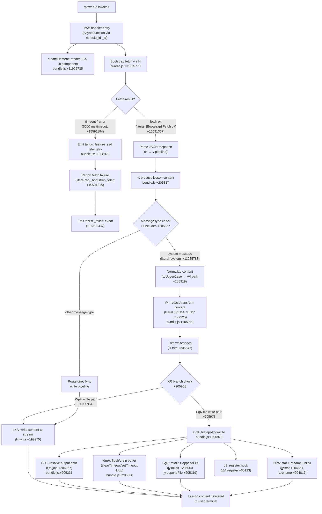

# `/powerup`

> Analysis basis: CC v2.1.162 bundle.js (AST extraction + Claude interpretation)
> Minimum version: v2.1.162

---

## Overview

`/powerup` is an interactive onboarding and feature-discovery command that presents users with quick, guided lessons about Claude Code capabilities. It renders a JSX-based interactive UI component and bootstraps feature content by fetching lesson data from a remote endpoint, then delivers that content through the standard agent messaging pipeline.

---

## Registration

| Field | Value |
|---|---|
| type | `local-jsx` |
| name | `powerup` |
| description | `Discover Claude Code features through quick interactive lessons` |
| module_id | `_lq` |
| load_inline | `true` |
| loc_byte | `11925861` |
| loc_byte_end | `11926041` |
| loc_line | `8159` |
| arbor_handler.name | `TWf` |
| arbor_handler.fqn | `claude-2.1.162::TWf` |
| arbor_handler.kind | `AsyncFunction` |
| arbor_handler.resolution_path | `module_id` |
| arbor_handler.n_hits | `0` |

Analysis basis: CC v2.1.162 bundle.js:+11925861

---

## Input Branching

The command involves more than three distinct execution branches: bootstrap fetch success/failure, content parse success/failure, lesson rendering, and write/append routing. A Mermaid flowchart is used.



Analysis basis: CC v2.1.162 bundle.js:+11925735, +11925770, +11925783, +205817, +205857

---

## Behavioral Spec

### 1. Handler Entry and JSX Rendering

The primary handler `TWf` (an `AsyncFunction` resolved via `module_id` path to module `_lq`) is invoked when the user types `/powerup`. Its first action is to call `createElement` to instantiate the interactive lesson UI component that will be displayed in the terminal.

```
async function powerupHandler(context):
    uiComponent = createElement(LessonUIComponent, context.props)
    bootstrapData = await bootstrapFetch(context)
    return processAndDeliverContent(bootstrapData, uiComponent)
```

Analysis basis: CC v2.1.162 bundle.js:+11925735, +11925770

---

### 2. Bootstrap Fetch (`H` → `v`)

The bootstrap function `H` fetches lesson content from a remote source. It logs a `[Bootstrap] Fetching` message at the start, sets request headers (`Content-Type: application/json`, `User-Agent`), and enforces a 5000 ms timeout. On success it logs `[Bootstrap] Fetch ok`. On any failure it emits the `tengu_feature_sad` telemetry event and records `api_bootstrap_fetch` / `parse_failed` error markers.

```
async function bootstrapFetch(context):
    log("[Bootstrap] Fetching")
    headers = {
        "Content-Type": "application/json",
        "User-Agent": userAgentString
    }
    response = await fetchWithTimeout(endpoint, headers, timeoutMs=5000)

    if fetchFailed(response):
        emitTelemetry("tengu_feature_sad")
        recordError("api_bootstrap_fetch", "parse_failed")
        return null

    log("[Bootstrap] Fetch ok")
    cachedValue = cache.get(cacheKey)   // e.getCache
    return parseJSON(response)
```

Analysis basis: CC v2.1.162 bundle.js:+15590991, +15591029, +15591078, +15591093, +15591112, +15591194, +15591315, +15591337, +15591367

---

### 3. Content Processing Pipeline (`v`)

Once fetch data is available, `v` processes the lesson payload through a series of normalisation steps: checking whether the message is a system-typed message, uppercasing the relevant token, applying redaction via the `V4` sub-routine (which replaces sensitive substrings with `[REDACTED]`), and trimming whitespace. The pipeline then decides whether to route to the streaming write path or the file-write path.

```
function processContent(fetchResult, messageQueue):
    if fetchResult is null:
        return

    for message in messageQueue:
        normalised = normaliseMessageType(message)  // EL6, PgK sub-calls

        if messageIncludes(message, systemTypes):
            token = message.toUpperCase()
            transformed = applyRedaction(token)     // V4: replaces with "[REDACTED]"
            trimmed = transformed.trim()
        else:
            trimmed = message.trim()

        if shouldUseStreamWrite(trimmed):            // XR check
            writeToStream(trimmed)                   // WpH → pXA → H.write
        else:
            writeToFile(trimmed)                     // EgK pipeline
```

Analysis basis: CC v2.1.162 bundle.js:+205817, +205835, +205857, +205875, +205919, +205939, +205942, +205958, +205964, +205978

---

### 4. Redaction and Token Transformation (`V4`)

`V4` processes a string by first mapping it through `rXA` (which iterates over a configured replacement table via `YgK.map`), then performing an additional `H.replace` substitution. It uses `q.at` to locate specific token positions and `A.lastIndexOf` / `A.slice` to extract a substring. The numeric constant `2` appears as a slice index at `+197954`, and string `[REDACTED]` at `+197925` is the substitution value.

```
function applyRedaction(inputToken):
    replacementTable = buildReplacementTable()     // rXA via YgK.map
    result = applyTableReplacements(inputToken, replacementTable)
    result = result.replace(sensitivePattern, "[REDACTED]")
    position = result.at(indexOffset)             // numeric index 2 at +197954
    lastIdx = result.lastIndexOf(delimiter)
    return result.slice(lastIdx)
```

Analysis basis: CC v2.1.162 bundle.js:+197846, +197873, +197925, +197954, +197983, +198009, +198035

---

### 5. Stream Write Path (`WpH` → `pXA`)

When the stream-write branch is chosen, `WpH` delegates immediately to `pXA`, which calls `H.write` to push content into the output stream.

```
function streamWrite(content):
    pXA(content)        // calls H.write internally

function pXA(content):
    outputStream.write(content)
```

Analysis basis: CC v2.1.162 bundle.js:+205964, +193039, +192975

---

### 6. File Write Path (`EgK`)

`EgK` is the more complex write path. It handles writing lesson content to a file on disk. The logic is:

1. Resolve the output directory using `Qe.dirname` and build the full file path via `_PA` (which uses `Qe.join` and `S6`).
2. Check for EISDIR errors via `zL6` → `V8` (guarding against directory-as-file mistakes; error code `"EISDIR"` at `+175445`).
3. Check current byte length using `Buffer.byteLength`.
4. If file exists, use `HPA` to stat the file, optionally rename `.txt`-suffixed files (`H.endsWith(".txt")`, slicing 4 bytes off the suffix at `+204787`), then rename or unlink as appropriate via `jy.rename` / `jy.unlink`.
5. Flush buffered output via `dmH` (which manages `clearTimeout` / `setTimeout` / `setImmediate` loops with a 1000 ms and 100 ms cadence).
6. Append final content via `GgK`, which calls `jy.mkdir` (recursive) then `jy.appendFile`.
7. Register a cleanup hook via `J9` → `jJA.register`.

```
async function fileWritePath(content, context):
    dir = path.dirname(context.outputPath)          // Qe.dirname
    filePath = buildFilePath(dir, context)           // _PA → Qe.join, S6

    eisDirGuard(filePath)                            // zL6 → V8, checks "EISDIR"
    byteLen = Buffer.byteLength(content)

    if fileExists(filePath):
        stats = await fs.stat(filePath)              // jy.stat
        if filePath.endsWith(".txt"):
            newPath = filePath.slice(0, -4)          // strip 4-char suffix
            await fs.rename(filePath, newPath)       // jy.rename
        else:
            await fs.unlink(filePath)                // jy.unlink

    flushBuffers(content)                            // dmH: setTimeout/clearTimeout
    await fs.mkdir(dir, { recursive: true })         // GgK → jy.mkdir
    await fs.appendFile(filePath, content)           // GgK → jy.appendFile

    registerCleanupHook(filePath)                    // J9 → jJA.register
```

Analysis basis: CC v2.1.162 bundle.js:+205306, +205331, +205339, +205368, +205383, +205458, +205475, +205507, +205513, +205546, +205563, +205572, +205668, +175445, +204661, +204754, +204765, +204776, +204787, +204817, +204845, +204857, +205060, +205119

---

### 7. Buffer Flush / Drain (`dmH`)

`dmH` implements a queued flush mechanism using both `setTimeout` (period: 1000 ms at `+59425`) and `setImmediate`. It maintains two queues (`$` and `L`) that are joined and drained. It also applies a secondary threshold of 100 (at `+59446`).

```
function flushBuffers(content):
    clearTimeout(pendingTimer)
    pendingQueue.push(content)                     // $.push

    if pendingQueue.length >= 100:
        flushImmediate()                           // setImmediate
    else:
        pendingTimer = setTimeout(flushDrain, 1000)

function flushDrain():
    batch = pendingQueue.join("")                  // $.join
    outputLines = lineQueue.join("")               // L.join
    writeBatch(batch, outputLines)                 // O, Y, w, D helpers
    lineQueue.push(...)                            // L.push
```

Analysis basis: CC v2.1.162 bundle.js:+59425, +59446, +59537, +59578, +59609, +59611, +59655, +59676, +59701, +59736, +59794, +59834, +59885, +59907, +59929, +59952

---

### 8. Path Resolution (`E3H`)

`E3H` resolves the final output path for lesson data files. It calls `_p6` for a base directory, joins path components with `Qe.join`, then passes through `s8` and `S6` for sanitisation and normalisation.

```
function resolveOutputPath(context):
    baseDir = getBaseDirectory()                   // _p6
    joined = path.join(baseDir, context.filename)  // Qe.join
    sanitised = sanitisePath(joined)               // s8
    return normalisePath(sanitised)                // S6
```

Analysis basis: CC v2.1.162 bundle.js:+206015, +206067, +206075, +206091

---

### 9. Message Type Normalisation (`PgK`, `PJA`)

Before content is routed, `PgK` normalises raw message-type tokens. It calls `Xy` (numeric constant `1` at `+204440`) to index into a type table, then dispatches through `XgK` and `PJA`. `PJA` resolves the final type enum using `GUK` and `EUK`, starting from a base of `0` at `+61248`.

```
function normaliseMessageType(rawToken):
    index = typeTable[1]                           // Xy with value 1
    expanded = expandType(index)                   // XgK
    resolved = resolveTypeEnum(expanded)           // PJA → GUK (base 0), EUK
    return resolved
```

Analysis basis: CC v2.1.162 bundle.js:+204428, +204440, +204542, +204555, +61248, +61256, +61270

---

### 10. Input Argument Parsing (`AY_`, `a1`, `qq`)

The command's argument string (if any is passed after `/powerup`) is parsed through a chain of normalisation helpers:

- `AY_` splits on whitespace, trims each token, and finds the first index of a keyword.
- `a1` routes the token through `oHH` (which resolves model tier via `k0`, `OqH`, `yA`, `Dd`) and then through `qq`.
- `qq` lowercases and trims, then performs model-string matching against known tier names: `opusplan`, `sonnet`, `haiku`, `opus`, `best`, and the extended token `[1m]`. It also checks for the `anthropic.` prefix.

```
function parseCommandArguments(rawInput):
    tokens = rawInput.split(" ").map(trim)
    keywordIndex = tokens.indexOf(knownKeyword)
    sliced = tokens.slice(keywordIndex)

    for token in sliced:
        normalised = token.trim().toLowerCase()
        tier = resolveModelTier(normalised)        // qq dispatch
        if tier in ["opusplan","sonnet","haiku","opus","best","[1m]"]:
            return { model: tier }
        if normalised.startsWith("anthropic."):
            return { model: "firstParty" }

    return defaultTier()
```

Analysis basis: CC v2.1.162 bundle.js:+2971282, +2971321, +2971345, +2971385, +2236454, +2240374, +2240385, +2240403, +2240413, +2234431, +2240470, +2240488, +2240496, +2240511, +2240550, +2240565, +2240589, +2240603, +2240626, +2240640, +2240658, +2240664, +2240672, +2240716

---

### 11. Model Tier Resolution (`PE`, `UM`, `qI`, `LQH`, `g0`)

Once a normalised model string is available, the tier resolver computes the actual model handle:

- `PE` merges `UM` (the base resolver, which calls `wA`) with `G5` (provider lookup) and tags the result as `firstParty` at `+2236678`.
- `UM` maps provider type to internal handle; it supports `anthropicAws` and `gateway` in addition to default Anthropic endpoints.
- `g0` is the composite resolver that aggregates results from `WA`, `H6H`, `ozH`, `MQH`, `PE`, `A2`, `UM`, `wA`, `G5`, `qI`.
- The special tier name `mantle` at `+2237319` is handled inside `g0`.

```
function resolveFullModelHandle(tierName):
    baseHandle = resolveBase(tierName)             // UM → wA
    provider = lookupProvider(tierName)            // G5
    if provider == "anthropicAws" or provider == "gateway":
        return buildProviderHandle(baseHandle, provider)
    result = composite(baseHandle, provider)       // g0 aggregation
    result.tag = "firstParty"
    return result
```

Analysis basis: CC v2.1.162 bundle.js:+2094552, +2094587, +2094607, +2236646, +2236658, +2236671, +2236678, +2237209, +2237218, +2237225, +2237232, +2237245, +2237251, +2237275, +2237312, +2237319, +2237335, +2237354

---

### 12. Telemetry Event — `tengu_feature_sad`

This single telemetry event fires specifically when the bootstrap fetch either times out, returns an un-parseable response, or encounters a network error. It is emitted inside `t6` → `c`, which calls `Z6` → `Zx6`.

```
function reportFetchFailure(errorContext):
    emitEvent("tengu_feature_sad", errorContext)   // t6 → c → Z6 → Zx6
    recordMetric("api_bootstrap_fetch", "parse_failed")
```

Analysis basis: CC v2.1.162 bundle.js:+1008374, +1008376, +1008410, +3628

---

## State & Side Effects

| Item | Detail |
|---|---|
| Telemetry | `tengu_feature_sad` — fires on bootstrap fetch failure or parse error (bundle.js:+1008376) |
| Hook registration | `jJA.register` called via `J9` to register a file-cleanup hook after lesson content is written (bundle.js:+60123) |
| appState changes | Cache read via `e_.get` (bundle.js:+15591029); internal state flag `_3` updated (bundle.js:+15591125) |
| File system | `jy.mkdir` (recursive), `jy.appendFile`, `jy.rename`, `jy.unlink`, `jy.stat` — all invoked during the file-write path (bundle.js:+205060, +205119, +204817, +204857, +204661) |
| Timers | `setTimeout` (1000 ms), `clearTimeout`, `setImmediate` active during buffer drain in `dmH` (bundle.js:+59701, +59537, +59794) |
| Sound | <!-- TODO: not found in depth-2 traversal; needs --depth 4 --> |
| Network | Bootstrap fetch to lesson-content endpoint with `Content-Type: application/json` and `User-Agent` headers; 5000 ms timeout (bundle.js:+15591078, +15591112, +15591194) |

---

## Version History

| Version | Change |
|---|---|
| v2.1.162 | Initial analysis |

---

## Common Mistakes

1. **Expecting immediate output**: `/powerup` must complete a remote bootstrap fetch (up to 5000 ms) before lesson content is rendered. If the network is unavailable, only an error state is shown and `tengu_feature_sad` is emitted — no lesson content will appear.
2. **Passing unsupported model tier arguments**: Only the tier names `opusplan`, `sonnet`, `haiku`, `opus`, `best`, `[1m]`, and any `anthropic.`-prefixed string are recognised by the argument parser. Unknown arguments fall through to the default tier silently.
3. **Treating the command as stateless**: `/powerup` registers a cleanup hook (`jJA.register`) and may write files to disk. Running it in environments with restricted filesystem access can cause the file-write path to fail, leaving the hook registered but no content written.
4. **Conflating stream-write and file-write output**: The two output paths (`WpH` → stream, `EgK` → file) behave differently under high load. The file path buffers output in a 100-item / 1000 ms queue, so terminal output may be delayed relative to stream output.
5. **Assuming EISDIR errors are fatal**: The `zL6` → `V8` guard catches `EISDIR` errors and reroutes the write; the command continues rather than aborting.

---

## Appendix — Identifier Mapping

> For bundle debugging only. Identifiers change across versions.

| Identifier | Role |
|---|---|
| `TWf` | Primary handler (`AsyncFunction`) for `/powerup`; entry point resolved via `module_id` path |
| `H` | Bootstrap fetch coordinator; also reused as generic string/stream variable in several call sites |
| `v` | Content processing pipeline; normalises and routes lesson messages |
| `PgK` | Message-type normalisation dispatcher |
| `PJA` | Type-enum resolver (dispatches to `GUK` and `EUK`) |
| `SH` | JSON serialisation helper (calls `JSON.stringify`) |
| `V4` | Redaction and token transformation function |
| `rXA` | Replacement-table builder (iterates `YgK.map`) |
| `q` | File-unlink helper / generic position accessor |
| `A` | Lowercase string transformer / slice helper |
| `WpH` | Stream-write path router |
| `pXA` | Low-level stream write wrapper (calls `H.write`) |
| `EgK` | File write orchestrator (mkdir, appendFile, stat, rename, unlink) |
| `dmH` | Buffer-flush and drain manager (setTimeout / setImmediate loop) |
| `E3H` | Output path resolver |
| `i6` | Internal helper called from `EgK` path |
| `zL6` | EISDIR guard / error-code checker |
| `_PA` | File-path builder (uses `Qe.join` and `S6`) |
| `HPA` | File stat, rename, and unlink orchestrator |
| `GgK` | Mkdir + appendFile executor |
| `J9` | Cleanup hook registration wrapper |
| `_3` | Internal state flag updated during bootstrap |
| `AY_` | Command argument splitter and keyword finder |
| `LHH` | Keyword set membership checker (`Y94.has`) |
| `bJ` | String replacement helper |
| `a1` | Top-level argument routing function |
| `oHH` | Model-tier resolution helper (calls `k0`, `OqH`, `yA`, `Dd`) |
| `k0` | Sub-resolver called during model-tier lookup |
| `OqH` | Sub-resolver called during model-tier lookup |
| `Dd` | Token classifier (checks `anthropic.` prefix, maps tier strings) |
| `qq` | Model string normaliser and tier matcher |
| `Q0` | Tier-name lookup helper (calls `BKH`) |
| `pKH` | Model-name inclusion checker (`mKH.includes`) |
| `qI` | Composite model resolver combining `UM` and `G5` |
| `LQH` | Provider-lookup helper (calls `G5`) |
| `PE` | First-party model handle builder |
| `RJ1` | Delegating resolver (calls `PE`) |
| `UM` | Base model handle resolver (calls `wA`) |
| `Xt6` | Model-include checker (`z8L.includes`) |
| `fQH` | Token handler helper (calls `tH`) |
| `rX` | Model-string routing function |
| `g0` | Composite model resolver (aggregates `WA`, `H6H`, `ozH`, `MQH`, `PE`, `A2`, `UM`, `wA`, `G5`, `qI`) |
| `t6` | Telemetry emitter entry point |
| `c` | Telemetry event dispatcher (emits `tengu_feature_sad`) |
| `Z6` | Telemetry sub-handler (calls `Zx6`) |
| `Zx6` | Core telemetry recording function |

---

Note: index built via Arbor fallback; some signals (telemetry, literals) may be missing — see arbor-fallback.js.