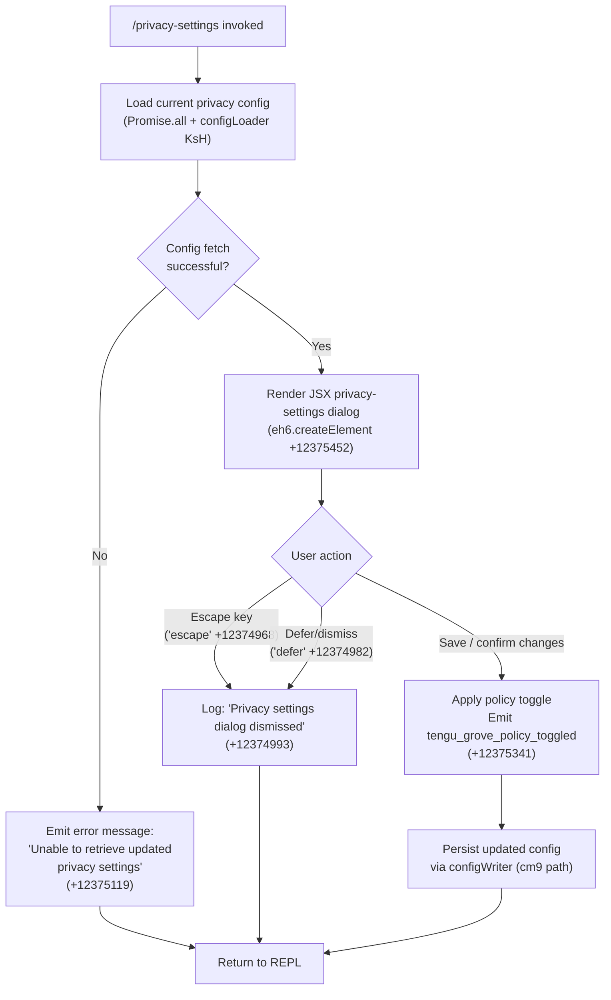

# `/privacy-settings`

> Analysis basis: CC v2.1.162 bundle.js (AST extraction + Claude interpretation)
> Minimum version: v2.1.162

---

## Overview

The `/privacy-settings` command opens an interactive JSX dialog that lets the user view and toggle privacy-related policy settings (Grove/telemetry policies). It is a `local-jsx` command: instead of sending a prompt to the language model, it renders a React component directly in the terminal UI. On completion or dismissal, it emits a telemetry event and returns control to the normal REPL loop.

---

## Registration

| Field | Value |
|---|---|
| type | `local-jsx` |
| name | `privacy-settings` |
| description | `View and update your privacy settings` |
| module_id | `Teq` |
| load_inline | `true` |
| loc_byte | `12375805` |
| loc_byte_end | `12375997` |
| loc_line | `8697` |
| arbor_handler.name | `aNf` |
| arbor_handler.fqn | `claude-2.1.162::aNf` |
| arbor_handler.kind | `AsyncFunction` |
| arbor_handler.resolution_path | `module_id` |
| arbor_handler.n_hits | `0` |

Analysis basis: CC v2.1.162 bundle.js:+12375805

---

## Input Branching

The handler has three distinct execution paths based on how the dialog is closed: (1) the user presses **Escape**, (2) the dialog is deferred/dismissed without changes, or (3) settings are saved successfully. A Mermaid flowchart is used.



---

## Behavioral Spec

### Top-level handler (`aNf`)

```
async function privacySettingsHandler(context):
    // Parallel-load current settings and MCP state
    [currentConfig, mcpState] = await Promise.all([
        loadConfigWithGroveCache(configLoader),   // KsH  (+12374805)
        loadMcpManagerState(mcpManager)            // TXH  (+12374863)
    ])

    if currentConfig is unavailable:
        display("Unable to retrieve updated privacy settings")   // +12375119
        return

    // Render interactive JSX dialog
    result = await renderJsxDialog(                 // eh6.createElement (+12375452)
        component  = PrivacySettingsComponent,
        props      = {
            config     : currentConfig,
            onEscape   : () => handleDismiss("escape"),   // +12374968
            onDefer    : () => handleDismiss("defer"),    // +12374982
            onSave     : (newSettings) => handleSave(newSettings)
        }
    )

    // Branch on dialog outcome
    match result.exitReason:
        "escape" | "defer":
            log("Privacy settings dialog dismissed")     // +12374993
            return

        "save":
            applyPolicyToggle(result.newSettings)        // +12375339
            emit(telemetry.tengu_grove_policy_toggled)   // +12375341
            persistConfig(result.newSettings, role="system")  // +12375038
```

Analysis basis: CC v2.1.162 bundle.js:+12374818

---

### Config loading sub-system (`KsH` → `y4H` / `TL` / `C6`)

```
function loadConfigWithGroveCache(opts):
    // Attempt to read from Grove (stale-while-revalidate) cache layer
    cached = groveCache.get()

    if cached is fresh:
        log("Grove: Using fresh cached config")         // +6971996
        return cached

    if cached is stale:
        log("Grove: Cache stale, returning cached data and refreshing in background")
                                                         // +6971890
        triggerBackgroundRefresh()
        return cached

    // No cache: kick off background fetch, skip dialog for this session
    log("Grove: No cache, fetching config in background (dialog skipped this session)")
                                                         // +6971770
    fetchConfigInBackground()

    // Also read persisted config from disk (C6 path)
    rawConfig = readConfigFile(configPath)               // C6 (+6971715)
    timestamp = Date.now()                               // +6971744

    return rawConfig
```

Analysis basis: CC v2.1.162 bundle.js:+6971655

---

### Config file I/O (`C6` → `DYH`, `bWL`)

```
function readConfigFile(path):
    // Guard: config must be in allowed state before access
    if not accessGuard.isAllowed():
        throw Error("Config accessed before allowed.")   // +3256503

    try:
        raw = fs.readFileSync(path, "utf-8")             // +3256559, +3256586
    catch err:
        if err.code == "ENOENT":                         // +3256733
            return defaultConfig()
        raise

    parsed = JSON.parse(raw)
    watch  = setupFileWatcher(path, bWL)                 // bWL (+3252749)
    return parsed

function setupFileWatcher(path, handler):
    watcher = fs.watchFile(path, handler)                // o18.watchFile +3252754
    // On change: re-read, debounce, call registered callbacks
    // On cleanup: fs.unwatchFile(path)                  // o18.unwatchFile +3253087
    return watcher
```

Analysis basis: CC v2.1.162 bundle.js:+3253251

---

### Config persistence (`cm9` path — write / lock)

```
function persistConfig(newSettings, role):
    // Acquire write lock; warn if contention detected
    lock = acquireLock()
    if lock.waitedLong:
        warn("Lock acquisition took longer than expected…")  // +3254470

    // Re-read from disk before writing to detect auth loss
    freshFromDisk = readConfigFile(configPath)

    if freshFromDisk is missing auth fields that cache has:
        // Safety guard — refuse to overwrite to avoid wiping credentials
        warn("saveConfigWithLock: re-read config is missing auth…")  // +3254886
        emit(telemetry.tengu_config_auth_loss_prevented)             // +3255038
        return

    // Rotate backups (keep up to 5)                                  // +3255489
    rotateBackups(configPath, maxBackups=5, suffix=".backup.")        // +3255356

    // Atomically write new config
    fs.copyFileSync(tempPath, configPath)                             // +3255463

    releaseLock()
```

Analysis basis: CC v2.1.162 bundle.js:+6971850

---

### Privacy policy toggle (`applyPolicyToggle`)

```
function applyPolicyToggle(newSettings):
    // newSettings carries updated Grove/telemetry flags
    // Merge into application state under role "system"  (+12375038)
    appState.merge(role="system", settings=newSettings)

    // Construct JSX settings view for confirmation display
    display = createElement("settings", newSettings)    // +12375405

    // Fire telemetry
    emit(tengu_grove_policy_toggled)                    // +12375341
```

Analysis basis: CC v2.1.162 bundle.js:+12375339

---

### MCP manager initialisation (called via `M` → `RCH` → `ROA`)

The handler calls `Promise.all` which also triggers MCP manager state loading. This is a background side-effect; it does not block the privacy dialog rendering. Key sub-operations observed in the call graph at depth ≤ 2:

```
function loadMcpManagerState():
    // Enumerate registered MCP servers across all scopes:
    // enterprise, user, project, mcp                    (+6805710 … +6805952)
    servers = collectMcpServers(scopes=["enterprise","user","project","mcp"])

    // For each server compute a config hash (sha256/hex) (+6790979, +6791006)
    for server in servers:
        hash = crypto.createHash("sha256")
                     .update(canonicalKey(server))
                     .digest("hex")
                     .slice(0, 16)                       // +6791021

    // Apply any pending connection results
    applyConnectionResults(servers)                      // xp8 (+15673676)

    return mcpState
```

Analysis basis: CC v2.1.162 bundle.js:+15672435

---

## State & Side Effects

| Item | Detail |
|---|---|
| Telemetry — `tengu_grove_policy_toggled` | Fired when the user saves a privacy setting change (bundle.js:+12375341) |
| Telemetry — `tengu_config_parse_error` | Fired when the on-disk config JSON cannot be parsed (bundle.js:+3257134) |
| Telemetry — `tengu_config_lock_contention` | Fired when the write lock is held longer than expected (bundle.js:+3254559) |
| Telemetry — `tengu_config_stale_write` | Fired when a stale write is detected and rejected (bundle.js:+3254695) |
| Telemetry — `tengu_config_auth_loss_prevented` | Fired when a write is refused to avoid wiping auth credentials (bundle.js:+3255038) |
| Telemetry — `tengu_feature_sad` | Fired on unexpected feature-level error (bundle.js:+1008376) |
| Telemetry — `tengu_mcp_oauth_flow_start` / `_success` / `_error` | MCP OAuth sub-flow events, triggered if MCP state load kicks off OAuth (bundle.js:+10210368, +10215157, +10216545) |
| Telemetry — `tengu_mcp_skills` | Fired during MCP skills enumeration triggered by background load (bundle.js:+6926634) |
| Telemetry — `tengu_daemon_config_reload` | Fired when the daemon reloads config after a privacy-settings write (bundle.js:+16011003) |
| File I/O | Reads `~/.claude.json` (or equivalent) via `fs.readFileSync`; watches with `fs.watchFile`; writes atomically via `fs.copyFileSync` with up to 5 rotating backups (max backup lock timeout: 60 000 ms, bundle.js:+3255240) |
| appState changes | Merges new privacy policy flags under role `"system"` into global app state (bundle.js:+12375038) |
| Lock | Acquires a file-system write lock before persisting; releases on completion or error |
| JSX render | Renders a terminal React component; no sound effect observed in call graph |
| Sound | <!-- TODO: not found in depth-2 traversal; needs --depth 4 --> |

---

## Version History

| Version | Change |
|---|---|
| v2.1.162 | Initial analysis |

---

## Common Mistakes

1. **Invoking `/privacy-settings` in non-interactive mode** — because the command renders a JSX dialog, it requires an interactive terminal. Running it in a pipe or headless context will result in the dialog being skipped and no settings being changed.
2. **Expecting immediate persistence** — when the Grove cache is stale the command returns cached data and refreshes in the background. A second invocation shortly after may still show the old values until the background refresh completes.
3. **Concurrent Claude instances** — two simultaneously running Claude Code sessions can cause write-lock contention. The lock timeout is 60 000 ms (bundle.js:+3255240); if exceeded, `tengu_config_lock_contention` is emitted and the write may be skipped.
4. **Auth credential loss guard** — if the on-disk config is missing auth fields that the in-memory cache holds, the command refuses to write the updated privacy settings to avoid wiping credentials (see GH #3117). This is logged as a warning and recorded by `tengu_config_auth_loss_prevented`.
5. **Pressing Escape or deferring** — neither action persists any change. The dialog dismissal is logged ("Privacy settings dialog dismissed", bundle.js:+12374993) but no telemetry policy event is emitted.

---

## Appendix — Identifier Mapping

> For bundle debugging only. Identifiers change across versions.

| Identifier | Role |
|---|---|
| `aNf` | Top-level async handler for `/privacy-settings` (Arbor-resolved entry point) |
| `KsH` | Grove-cache-aware config loader; orchestrates `y4H`, `TL`, `C6` |
| `y4H` | Config scope resolver (handles `"max"` / `"pro"` tiers) |
| `Aq` | Config field accessor; calls `E4_`, `G4_`, `AD` |
| `E4_` | Config sub-field extractor A |
| `G4_` | Config sub-field extractor B |
| `AD` | Auth/API-key resolver; references `ANTHROPIC_API_KEY`, `apiKeyHelper` |
| `WA` | Config merge / overlay helper |
| `gR` | Array-inclusion predicate helper |
| `sb1` | Supplemental config post-processor |
| `TL` | Config transformation layer (calls `AD`, `C6`) |
| `C6` | Low-level config file reader / file-watcher registrar |
| `i6` | Path utilities helper |
| `zj_` | Config schema validator |
| `DYH` | Filesystem read-with-fallback (handles `ENOENT`, `EEXIST`, backups) |
| `bWL` | File-watcher setup / teardown (`watchFile` / `unwatchFile`) |
| `v` | HTTP bootstrap / fetch utility |
| `PgK` | Fetch request builder |
| `PJA` | HTTP header composer (`Content-Type`, `User-Agent`) |
| `H` | Central app-state / config cache object |
| `_3` | State key extractor |
| `AY_` | String-split / trim / slice utility |
| `LHH` | Cache presence check (`Y94.has`) |
| `bJ` | String replacement utility |
| `a1` | Output formatter (`oHH`, `qq`, `rX`) |
| `t6` | Feature-sad telemetry emitter (`tengu_feature_sad`) |
| `SH` | JSON serializer wrapper |
| `V4` | Redaction / truncation utility (replaces sensitive values with `[REDACTED]`) |
| `rXA` | Array map / format helper |
| `WpH` | Write helper (`pXA`) |
| `pXA` | Low-level stream writer |
| `EgK` | Async file-write orchestrator (mkdir, appendFile, rename, unlink) |
| `dmH` | Debounce / batch write scheduler |
| `E3H` | Write finalization helper |
| `zL6` | File-size tracker (`V8`) |
| `_PA` | Path joiner with schema check |
| `HPA` | Atomic rename-with-backup helper (`.txt` extension, max 4 rename retries) |
| `GgK` | Buffered append-file writer |
| `J9` | Hook registrar (`jJA.register`) |
| `cm9` | Config persistence orchestrator (write-lock, backup rotation) |
| `G8` | Global config save with lock |
| `jj_` | Lock-protected config writer (backup rotation, `saveConfigWithLock`) |
| `bcH` | Config backup helper |
| `Mn1` | Object-entries iterator for config fields |
| `s18` | Timestamp recorder for write operations |
| `Xw6` | Config cache invalidator |
| `Jj_` | Fallback global config saver (`saveGlobalConfig fallback`) |
| `M` | MCP manager state coordinator |
| `RCH` | MCP connection registry / connection lifecycle manager |
| `jl` | MCP server list builder |
| `T06` | MCP tool registry entry |
| `g_H` | Per-scope MCP server enumerator (enterprise / user / project / mcp) |
| `Jl` | SDK-transport MCP server collector |
| `hz8` | MCP warning colorizer (red/yellow) |
| `E06` | SSE/HTTP MCP server collector |
| `sI` | MCP settings loader |
| `nO` | MCP config reader (via `C6`) |
| `CR_` | MCP config response transformer |
| `K` | Process/task map |
| `L` | Async task set manager |
| `f` | Connection lifecycle object |
| `q_` | Underscore utility |
| `sI6` | MCP settings item extractor |
| `Pvq` | MCP needs-auth cache manager |
| `Ps_` | Auth-cache path builder |
| `AXH` | Config hash computer (sha256) |
| `kz8` | Key-set hasher |
| `yz8` | Config-change hash comparator |
| `wP` | Hash serializer (sha256 / `Sb9.createHash`) |
| `vz8` | Config value differ (`W4`) |
| `W4` | Deep-diff utility (`Nj1`) |
| `Y8` | MCP debug logger (`Dr.logMCPDebug`) |
| `ja_` | MCP server connection initiator |
| `SAf` | OAuth start helper |
| `BQ` | Notification emitter (`Nx`, `NK`) |
| `y1H` | Claude.ai connector link builder |
| `h1H` | Connection retry helper |
| `S1H` | Full MCP OAuth flow runner (HTTP server, token exchange, PKCE) |
| `z_6` | In-flight connection tracker (`CN8`) |
| `Y` | Process exit / abort controller |
| `FN8` | Auth-cache lookup helper |
| `Dn` | MCP reconnect orchestrator |
| `Nx` | Notification dispatcher |
| `D` | MCP server supervisor (start/stop/updateConfig) |
| `G7` | MCP error logger (`Dr.logMCPError`) |
| `TH` | String coercion wrapper |
| `RAf` | Auth result handler |
| `hAf` | SSH/URL environment detector |
| `Xa_` | OAuth complete-authentication tool handler |
| `O_6` | Active OAuth request getter (`RN8.get`) |
| `D_6` | In-flight connection getter (`CN8.get`) |
| `kvq` | MCP connection attempt coordinator |
| `V9` | AsyncLocalStorage store getter |
| `jv8` | Needs-auth cache file path builder |
| `Ja_` | Config hash comparison and update |
| `IR_` | Reconnect inclusion filter |
| `J` | Running-process registry |
| `k` | Chokidar file-watcher process wrapper |
| `hN` | MCP skills loader |
| `j6` | Skills file reader/watcher |
| `Tvq` | MCP transport factory |
| `PB` | Promise-based iterator / stream mapper |
| `I_6` | Integer parser A |
| `Xv8` | Integer parser B |
| `xp8` | Connection result applicator (`applyConnectionResult`) |
| `SCH` | Connection config hasher |
| `hk` | Connection cleanup helper |
| `N_6` | Connection slot cleaner |
| `$` | Daemon status reporter |
| `p1K` | Daemon status file writer |
| `Ur` | Status format helper (`gKH`) |
| `GS6` | Daemon status file path builder |
| `ROA` | MCP manager full refresh orchestrator |
| `Rz8` | Client filter (approved / pending sets) |
| `n8` | Subprocess launcher with timeout |
| `O` | Background session manager |
| `E6` | Error base class / initializer (`Zx6`) |
| `Zx6` | Error subclass factory |