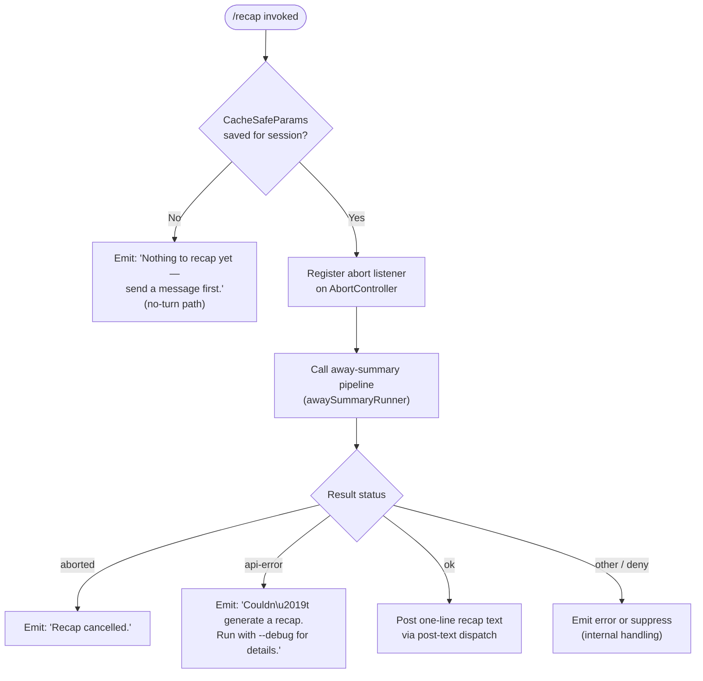

# `/recap`

> Analysis basis: CC v2.1.162 bundle.js (AST extraction + Claude interpretation)
> Minimum version: v2.1.162

---

## Overview

`/recap` triggers an on-demand, single-line summary of the current Claude Code session. It is implemented as a local slash command whose handler (`vbf`) invokes the same "away summary" pipeline normally used to generate background session recaps, producing a compact text result that is posted back to the user as a `post-text` dispatch. The command does not support non-interactive (CI/headless) mode and will silently skip execution if no conversation turns have occurred yet.

---

## Registration

| Field | Value |
|---|---|
| type | `local` |
| name | `recap` |
| description | `Generate a one-line session recap now` |
| loc_byte | `12907738` |
| loc_byte_end | `12907954` |
| loc_line | `9471` |
| supportsNonInteractive | `false` |
| thinClientDispatch | `post-text` |
| load_inline | `true` |
| load_ident | `vbf` |
| arbor_handler.name | `vbf` |
| arbor_handler.fqn | `claude-2.1.162::vbf` |
| arbor_handler.kind | `AsyncFunction` |
| arbor_handler.resolution_path | `load_ident` |
| arbor_handler.n_hits | `0` |

Analysis basis: CC v2.1.162 bundle.js:+12907738

---

## Input Branching

The command has four distinct outcome branches based on session state and the result of the summary generation pipeline, therefore a flowchart is used.



Analysis basis: CC v2.1.162 bundle.js:+12907488 (no-turn literal), +12907580 (cancel literal), +12907638 (error literal), +5457815 (log literal `[awaySummary] no CacheSafeParams saved, skipping`), +5457873 (`no-turn`), +5458333 (`aborted`), +5458422 (`api-error`), +5458483 (`ok`)

---

## Behavioral Spec

### Handler Entry — `recapCommandHandler` (bundle: `vbf`)

The handler is an `AsyncFunction` resolved via `load_ident` on the registration object. It is the sole entry point for `/recap`.

```
async function recapCommandHandler(context):
    // Step 1: Check whether any conversation turns exist
    if no CacheSafeParams are saved for the current session:
        log("[awaySummary] no CacheSafeParams saved, skipping")
        display "Nothing to recap yet — send a message first."
        return

    // Step 2: Wire abort signal
    register listener on AbortController signal for "abort" event
    on abort: trigger early cancellation of the summary pipeline

    // Step 3: Delegate to the away-summary runner
    result = await awaySummaryRunner(context)  // bundle: $G → AZ8 → k5f path

    // Step 4: Handle result
    switch result.status:
        case "aborted":
            display "Recap cancelled."
            return
        case "api-error":
            display "Couldn't generate a recap. Run with --debug for details."
            return
        case "deny":
            // tool-use denial guard ("Away summary cannot use tools")
            handle internally; suppress or surface error
            return
        case "ok":
            post result text via thinClientDispatch "post-text"
            return
```

Analysis basis: CC v2.1.162 bundle.js:+12907346 (`vbf` → `U38`), +12907488, +12907580, +12907638, +5457815, +5457873, +5457929, +5458121, +5458189, +5458333, +5458422, +5458483

---

### Away-Summary Runner — `awaySummaryOrchestrator` (bundle: `U38`)

`U38` is the bridge between the `/recap` handler and the core query engine. It is called synchronously after the abort listener is registered.

```
async function awaySummaryOrchestrator(context):
    // Validate pre-conditions (CacheSafeParams check, see above)
    params = getSavedCacheSafeParams(context)   // bundle: S_H
    if params is null:
        return { status: "no-turn" }

    // Construct minimal agent context for away-summary
    agentCtx = buildAgentContext(params)        // bundle: v → PgK, EL6

    // Run the main agent query pipeline with the summary prompt
    // The pipeline is the shared k5f / agentQueryLoop function
    outcome = await agentQueryLoop(agentCtx)   // bundle: $G → AZ8 → k5f

    // Attach cleanup: remove abort listener
    context.signal.removeEventListener("abort", ...)

    return outcome
```

Analysis basis: CC v2.1.162 bundle.js:+5457794 (`U38` → `S_H`), +5457813 (`U38` → `v`), +5457910 (`U38` → `H.addEventListener`), +5457941 (`U38` → `A.abort`), +5457988 (`U38` → `$G`)

---

### Tool-Use Guard — `toolDenyPolicy` (bundle: `AT9`)

The away-summary pipeline blocks tool use. If the model attempts to call a tool during recap generation, the deny policy intercepts it.

```
function toolDenyPolicy(toolCallRequest):
    // Flat-map all tool calls from the request
    deniedCalls = toolCallRequest.flatMap(entry => ...)
    for each call in deniedCalls:
        emit denial with reason "Away summary cannot use tools"
        record status "deny"
    return denial block
```

Analysis basis: CC v2.1.162 bundle.js:+5458350 (`U38` → `q.find`), +5458439 (`U38` → `AT9`), +5458649 (`AT9` → `H.flatMap`), +5458106 (`deny`), +5458121 (`Away summary cannot use tools`)

---

### Conversation-State Loader — `fetchCacheSafeParams` (bundle: `S_H`)

Called at the start of `U38` to determine whether the session has any turns worth summarising.

```
function fetchCacheSafeParams(session):
    params = session.getStoredCacheSafeParams()
    if params is absent:
        return null   // triggers "no-turn" early exit
    return params
```

Analysis basis: CC v2.1.162 bundle.js:+5457794

---

### Core Agent Query Loop — `agentQueryLoop` (bundle: `k5f`)

`k5f` is the shared agent loop used by all query types in Claude Code, including the recap summary. For `/recap`, it is called with a restricted context (no tools allowed, single-turn, `away_summary` label).

Key behaviours observed in the call graph relevant to `/recap`:

```
async function agentQueryLoop(ctx):
    // Setup phase
    emit marker "query_setup_start"
    configure model, tools (none for recap), system prompt
    emit marker "query_setup_end"

    // API streaming phase
    emit marker "query_api_loop_start"
    emit marker "query_api_streaming_start"
    stream = callModel(ctx)

    // Process streamed events
    for each event in stream:
        handle text / tool_use / message_delta / stream_event

    emit marker "query_api_streaming_end"

    // Post-processing
    if output token limit hit:
        // not expected for one-line recap, but guarded
        inject continuation prompt
    if malformed tool use:
        retry once, then surface error

    // Return result summary
    return { status: "ok" | "error" | "aborted", text: recapText }
```

Analysis basis: CC v2.1.162 bundle.js:+10813456 (`um` → `k5f`), +10817796 (`query_setup_start`), +10817985 (`query_setup_end`), +10818880 (`query_api_loop_start`), +10818974 (`query_api_streaming_start`), +10825529 (`query_api_streaming_end`), +10819023 (`Y.callModel`)

---

### Session-Transcript Formatter — `buildContextString` (bundle: `v`)

Constructs the prompt context fed to the model. In the recap path this converts prior conversation turns into a compact representation.

```
function buildContextString(messages, options):
    // Normalise message roles to uppercase
    role = message.role.toUpperCase()

    // Redact sensitive content (e.g. tool results marked [REDACTED])
    content = redactIfNeeded(message)

    // Serialise for model consumption
    result = JSON.stringify(content)   // bundle: SH

    // Trim and extract file path suffix for logging
    filePath = extractFilePathSuffix(result)   // bundle: V4

    write to debug channel if "debug" log level active
    return formatted string
```

Analysis basis: CC v2.1.162 bundle.js:+205793 (`debug`), +205817, +205835, +205857, +205875, +205919, +205939, +205942, +205958, +205964, +205978, +197925 (`[REDACTED]`)

---

### Transcript Persistence — `transcriptWriter` (bundle: `EgK`)

After the recap completes, conversation transcript entries (including the recap output) may be flushed to disk.

```
async function transcriptWriter(entry, path):
    // Determine output file path
    dir = path.dirname(transcriptDir)
    outPath = pathJoin(dir, filename)         // bundle: _PA

    // Check for existing file, handle rotation
    stat = await fs.stat(outPath)             // bundle: HPA → jy.stat
    if file ends with ".txt":
        rename with numeric suffix            // bundle: HPA → jy.rename

    // Compute byte length before write
    byteLen = Buffer.byteLength(serialised)

    // Append entry to file
    await fs.mkdir(dir, { recursive: true })  // bundle: GgK → jy.mkdir
    await fs.appendFile(outPath, entry)       // bundle: GgK → jy.appendFile

    // If oversized, unlink and rotate
    if byteLen > limit:
        await fs.unlink(oldPath)              // bundle: HPA → jy.unlink

    // Register cleanup hook
    registerCleanupHook(outPath)              // bundle: J9 → jJA.register
```

Analysis basis: CC v2.1.162 bundle.js:+205306, +205331, +205339, +205368, +205383, +205458, +205475, +205507, +205513, +205546, +205563, +205572, +205668, +60123

---

## State & Side Effects

| Item | Detail |
|---|---|
| Telemetry — feature outcome | `tengu_feature_ok` (success path, bundle.js:+1008233), `tengu_feature_bad` (error path, bundle.js:+1008295), `tengu_feature_sad` (unexpected failure, bundle.js:+1008376) |
| Telemetry — query lifecycle | `tengu_query_error` (bundle.js:+10827725), `tengu_query_before_attachments` (+10837415), `tengu_query_after_attachments` (+10839733) |
| Telemetry — auto-compact | `tengu_auto_compact_rapid_refill_breaker` (+10815874), `tengu_auto_compact_succeeded` (+10816337), `tengu_post_autocompact_turn` (+10837301) |
| Telemetry — model fallback | `tengu_model_fallback_triggered` (+10827021), `tengu_refusal_fallback_triggered` (+10822367), `tengu_refusal_fallback_prompt_shown` (+10821003), `tengu_refusal_fallback_prompt_choice` (+10821192) |
| Telemetry — tool/hook events | `tengu_stop_hook_block_count` (+10833761), `tengu_malformed_tool_use_response` (+10832807), `tengu_loop_dynamic_wakeup_ends_turn` (+10837134), `tengu_mcp_tools_refreshed_mid_turn` (+10840036) |
| Telemetry — fork/agent | `tengu_fork_agent_query` (+10862164), `tengu_forked_agent_default_turns_exceeded` (+10861721) |
| Telemetry — daemon/bg | `tengu_daemon_control` (+16032559), `tengu_daemon_config_reload` (+16011003), `tengu_bg_attach` (+15988396), `tengu_bg_dispatch_low_mem` (+15996974), `tengu_bg_spare_enable` (+15997678) |
| Hook registration | Cleanup hook registered via `jJA.register` (+60123) for transcript file paths; abort listener registered on `AbortController` (+5457910) |
| appState changes | `getAppState` / `setAppState` called within `AZ8` (+10857336, +10858500); session state read by `k5f` via `k.getAppState` (+10817862) and written via `k.setAppState` (+10821815) |
| Transcript I/O | Async `appendFile` + `mkdir` + optional `rename`/`unlink` via `GgK`/`HPA` (+205060–205245); byte-length checked before write (+205212) |
| Tool use | Explicitly blocked for away-summary path; any tool-call attempt results in `deny` status with message `"Away summary cannot use tools"` (+5458121) |
| Sound | `<!-- TODO: not found in depth-2 traversal; needs --depth 4 -->` |
| Non-interactive support | `false` — command is interactive-only (+12907738 registration field) |
| thinClientDispatch | `post-text` — result is posted as plain text back to the UI (+12907738) |

---

## Version History

| Version | Change |
|---|---|
| v2.1.162 | Initial analysis |

---

## Common Mistakes

1. **Running `/recap` before any conversation turn**: The handler short-circuits with `"Nothing to recap yet — send a message first."` if no `CacheSafeParams` exist. Users must have at least sent one message in the session before invoking `/recap`.
2. **Expecting tool execution during recap**: The away-summary pipeline hard-blocks all tool calls. Any model behaviour that would normally invoke a tool is denied with `"Away summary cannot use tools"`. The recap is text-only.
3. **Using `/recap` in non-interactive (CI/headless) mode**: `supportsNonInteractive: false` means the command is silently unavailable or errors in headless pipelines.
4. **Interrupting and expecting a partial result**: If the `AbortController` fires mid-generation, the output is discarded and `"Recap cancelled."` is displayed. There is no partial-recap fallback.
5. **Expecting detailed error messages without `--debug`**: API-level failures surface only as `"Couldn't generate a recap. Run with --debug for details."` The underlying cause is logged at the `debug` level only (+205793).

---

## Appendix — Identifier Mapping

> For bundle debugging only. Identifiers change across versions.

| Identifier | Role |
|---|---|
| `vbf` | Top-level recap command handler (`AsyncFunction`; Arbor-resolved entry point) |
| `U38` | Away-summary orchestrator; validates session state and delegates to query pipeline |
| `S_H` | Saved CacheSafeParams fetcher; returns null if no prior turns exist |
| `v` | Context/message string builder; formats conversation for model consumption |
| `PgK` | Agent context constructor called by `v` |
| `PJA` | Sub-helper within agent context construction |
| `H` | Generic session/state accessor (overloaded; appears in bootstrap fetch, message loop, and daemon paths) |
| `_3` | Internal helper within session accessor |
| `AY_` | String parser (split/trim/indexOf/slice operations) |
| `LHH` | Set membership checker (`Y94.has`) |
| `bJ` | String replacement utility |
| `a1` | Message normaliser (oHH/qq/rX sub-helpers) |
| `t6` | Low-level utility (calls `c` and `Z6`) |
| `SH` | JSON serialiser wrapper (`JSON.stringify`) |
| `V4` | File path suffix extractor (uses map, replace, at, lastIndexOf, slice) |
| `rXA` | Array mapper used by path extractor |
| `WpH` | Writer wrapper (`pXA` → `H.write`) |
| `pXA` | Raw stream write helper |
| `EgK` | Transcript persistence orchestrator (mkdir/appendFile/rename/unlink) |
| `dmH` | Debounced flush scheduler (clearTimeout/setTimeout/setImmediate) |
| `E3H` | Transcript entry formatter (`_p6`, `Qe.join`, `s8`, `S6`) |
| `i6` | Internal EgK sub-helper |
| `zL6` | Error-type classifier (`V8`; handles `EISDIR`) |
| `_PA` | Output path builder (`Qe.join`, `S6`) |
| `HPA` | File stat + rename/unlink rotation handler |
| `GgK` | Append-write handler (mkdir + appendFile + size check) |
| `J9` | Cleanup hook registrar (`jJA.register`) |
| `$G` | Main away-summary entry after pre-conditions pass; calls `AZ8`, `um`, `J1H`, etc. |
| `AZ8` | Session agent runner (getAppState/setAppState, random UUID, crypto) |
| `hC` | Helper within AZ8 (`lq`, `o$9`) |
| `D7H` | Conversation loader (load/dump) |
| `EwH` | AZ8 sub-helper |
| `kD9` | AZ8 sub-helper |
| `M` | Message-list aggregator (get/values/filter) |
| `pv8` | AZ8 sub-helper |
| `dh` | Random-bytes generator (`xx9.randomBytes`, 8 bytes, hex encoding) |
| `qZ8` | $G sub-helper |
| `J1H` | Turn-preparation helper (`U4`, `ZCH`) |
| `U4` | Hook registration wrapper |
| `ZCH` | Message filter/classifier (`BC8`, `aC8`, `Smf`; `ant` prefix filter) |
| `um` | Turn dispatch wrapper (`k5f`, `eO8`, `hH`, `RH`) |
| `k5f` | Core agent query loop (model call, tool execution, compaction, streaming) |
| `eO8` | Subagent exit / map cleanup handler |
| `hH` | Success-path telemetry emitter (`c`, `Z6`) |
| `RH` | Failure-path telemetry emitter (`c`, `Z6`) |
| `zk6` | Feature-flag checker (`BLf.has`) |
| `B1H` | $G sub-helper |
| `vI8` | $G sub-helper |
| `Qyq` | Feature-flag query wrapper |
| `Y` | Process exit / abort orchestrator (`Nj`, `process.exit`, `z.abort`) |
| `Nj` | Pre-exit cleanup helper |
| `z` | Daemon stop handler (`hH`, `RH`, `Kh`, `jp`) |
| `r7H` | Active-session resolver (`Kj`, `cM7`, `H.filter`, `L.has`, `H.push`) |
| `Kj` | r7H sub-helper |
| `cM7` | Session-find helper (`H.find`) |
| `L` | Promise-tracking set (`q.add`, `f.finally`, `q.delete`) |
| `c` | Core telemetry emit function |
| `B5f` | Fork-agent result handler (`c`, `Z6`) |
| `Z6` | Telemetry event dispatcher (calls `Zx6`) |
| `b8` | Background session creator (randomUUID, `X`, `P`) |
| `P` | PTY / terminal session manager |
| `j` | Generic write wrapper |
| `J` | Process kill orchestrator |
| `D` | Supervisor session config handler |
| `h` | Focus/blur idle timer manager |
| `w` | Background session lifecycle manager (spawn, kill, retire) |
| `YMA` | Vim-mode command table (operator/find/replace/indent keys) |
| `C` | Execution queue (`k.enqueue`, randomUUID, `S6`) |
| `X` | PTY stream multiplexer (Buffer concat, subarray, timeout) |
| `Y5` | Stream end/flush helper |
| `xK5` | Full PTY protocol handler (resize, repaint, snapshot, ring, etc.) |
| `TH` | String conversion wrapper |
| `AT9` | Tool-deny policy for away-summary (flatMap over tool calls, emits deny) |
| `_` | Generic array/string accumulator (context-dependent) |
| `A` | Lowercase filename normaliser |
| `q` | File-unlink / generic stream (context-dependent) |

---

Note: index built via Arbor fallback; some signals (telemetry, literals) may be missing — see arbor-fallback.js.