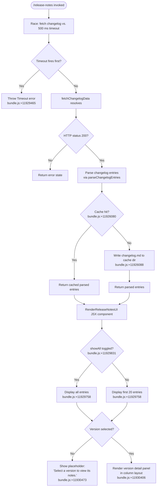

# `/release-notes`

> Analysis basis: CC v2.1.162 bundle.js (AST extraction + Claude interpretation)
> Minimum version: v2.1.162

---

## Overview

The `/release-notes` command opens an interactive JSX-rendered panel that displays the Claude Code changelog. It fetches (or loads from cache) the `changelog.md` file, parses it into a list of versioned entries, and lets the user browse version entries using a column-based selection UI with a configurable "Show all" toggle.

---

## Registration

| Field | Value |
|---|---|
| type | `local-jsx` |
| name | `release-notes` |
| description | `View release notes` |
| module_id | `wlq` |
| load_inline | `true` |
| loc_byte | `11931185` |
| loc_byte_end | `11931326` |
| loc_line | `8164` |
| arbor_handler.name | `vWf` |
| arbor_handler.fqn | `claude-2.1.162::vWf` |
| arbor_handler.kind | `AsyncFunction` |
| arbor_handler.resolution_path | `module_id` |
| arbor_handler.n_hits | `0` |

Analysis basis: CC v2.1.162 bundle.js:+11931185

---

## Input Branching

The command has 4+ distinct paths: timeout/error path, cache-hit path, live-fetch path, and the UI rendering sub-paths (show-all vs. paginated, version selected vs. unselected). A Mermaid flowchart is used.



---

## Behavioral Spec

### 1. Handler Entry — `vWf` (AsyncFunction)

The Arbor-resolved handler `vWf` (module `wlq`) is the async entry point for the command.

```
async function handleReleaseNotesCommand(args):
    timeoutPromise = new Promise((_, reject) =>
        setTimeout(() => reject(new Error("Timeout")), 500)   // bundle.js:+11929477
    )
    result = await Promise.race([                              // bundle.js:+11929491
        fetchAndParseChangelog(),                              // SAA
        timeoutPromise
    ])
    entries = processEntries(result)                           // Oh8
    return renderReleaseNotesPanel(entries)                    // Ylq (JSX)
```

Analysis basis: CC v2.1.162 bundle.js:+11929441

---

### 2. Fetch & Cache Changelog — `fetchAndParseChangelog` (`SAA`)

```
async function fetchAndParseChangelog():
    cacheDir   = resolveCacheDirectory()                   // hAA → Gh6.join, bundle.js:+11926066
    cachedFile = path.join(cacheDir, "changelog.md")       // bundle.js:+11926088
    contextStore = getAsyncLocalStore()                    // V9 → d0L.getStore

    if fileExists(cachedFile):
        return readCachedChangelog(cachedFile)             // bundle.js:+11926080

    timestamp = Date.now()                                 // bundle.js:+11926510
    response  = await httpFetch(changelogUrl)              // G8 → jj_
    if response.status != 200:                             // bundle.js:+11926395
        return errorState

    saveToConfigWithLock(cachedFile, responseBody)         // G8 → DYH path
    return parsedEntries
```

Analysis basis: CC v2.1.162 bundle.js:+11926326

---

### 3. Bootstrap / HTTP Fetch helper — `bootstrapFetch` (`H`)

A shared HTTP utility used during changelog retrieval:

```
function bootstrapFetch(url, options):
    log("[Bootstrap] Fetching", url)                       // bundle.js:+15590993
    headers = {
        "Content-Type": "application/json",                // bundle.js:+15591078, +15591093
        "User-Agent":   <userAgent>                        // bundle.js:+15591112
    }
    timeout = 5000                                         // bundle.js:+15591194
    attempt fetch with timeout
    on parse failure: record event "parse_failed"          // bundle.js:+15591337
    on success:       log "[Bootstrap] Fetch ok"           // bundle.js:+15591367
    telemetry event: "api_bootstrap_fetch"                 // bundle.js:+15591315
```

Analysis basis: CC v2.1.162 bundle.js:+15590991

---

### 4. Entry Parsing — `parseChangelogEntries` (`Th6`)

Parses the raw `changelog.md` text into structured version records:

```
function parseChangelogEntries(rawText):
    lines = rawText.split("\n")                            // bundle.js:+11926765
    entries = []
    for line in lines:
        line = line.trim()                                 // bundle.js:+11926814
        headerMatch = extractVersionHeader(line)           // $9 → H.indexOf, H.slice
        if headerMatch:
            version = headerMatch.version
            date    = headerMatch.date                     // separator " - " bundle.js:+11926896
            entries.append({ version, date, body: [] })
        else:
            if entries:
                entries[-1].body.append(
                    formatBulletLine(line)                 // prefix "- " bundle.js:+11926974
                )
    return entries
```

Analysis basis: CC v2.1.162 bundle.js:+11926765

---

### 5. Entry Post-Processing — `processEntries` (`Oh8`)

```
function processEntries(rawEntries):
    keys    = Object.keys(rawEntries)                      // bundle.js:+11927435
    visible = keys.filter(isRelevantEntry)                 // bundle.js:+11927535
    mapped  = visible.map(entry =>
        formatEntry(entry)                                 // kH / Th6 pipeline
    )
    return mapped
```

Analysis basis: CC v2.1.162 bundle.js:+11927404

---

### 6. Version-Entry Formatting — `formatEntry` (`kH`)

```
function formatEntry(entry):
    label = buildDisplayLabel(entry)                       // tH → String coercion
    body  = renderBody(entry)                              // wq → UyA
    log errors via Dr.logError if parse fails              // bundle.js:+11013997
    push to display queue                                  // zBH.push
    return { label, body }
```

Analysis basis: CC v2.1.162 bundle.js:+1013597

---

### 7. JSX Render Component — `RenderReleaseNotesUI` (`Ylq`)

```
function RenderReleaseNotesUI(entries):
    memoCache = initReactMemoCache(20)                     // "react.memo_cache_sentinel" bundle.js:+11930332
    // Slot layout constants used: 3, 7, 9, 10, 11–19     // bundle.js:+11929914 … +11930908

    [selectedVersion, setSelectedVersion] = useState(null)
    [showAll, setShowAll]                 = useState(false)

    displayList = showAll
        ? entries                                          // bundle.js:+11929758
        : entries.slice(0, 20)                             // numeric limit 20 bundle.js:+11929758

    leftPanel = Column(displayList,
        footer = showAll ? null : Button("Show all",       // bundle.js:+11929831
            onClick = () => setShowAll(true)
        )
    )

    rightPanel = selectedVersion == null
        ? Text("Select a version to view its notes.")      // bundle.js:+11930473
        : VersionDetail(selectedVersion)                   // column layout bundle.js:+11930406

    return TwoColumnLayout(
        title = "Release notes",                           // bundle.js:+11930857
        left  = leftPanel,
        right = rightPanel
    )
```

Analysis basis: CC v2.1.162 bundle.js:+11929752

---

### 8. Config Persistence & Lock (`saveConfigWithLock` / `jj_`)

The changelog cache write goes through the same config-persistence path as global config, including a file-lock guard:

```
function saveConfigWithLock(filePath, data):
    acquire file lock (timeout 60000 ms)                   // bundle.js:+3255240
    if lock acquisition slow:
        emit telemetry "tengu_config_lock_contention"      // bundle.js:+3254559
        log warning "Lock acquisition took longer…"        // bundle.js:+3254470

    existing = readCurrentConfig(filePath)                 // DYH
    if existingHasAuth AND newDataLacksAuth:
        emit telemetry "tengu_config_auth_loss_prevented"  // bundle.js:+3255038
        throw "saveConfigWithLock: re-read config is missing auth…" // bundle.js:+3254886

    keepBackups = entries.slice(-5)                        // keep last 5 backups bundle.js:+3255489
    writeAtomic(filePath, data, mode=0o600)                // permissions 384 decimal bundle.js:+3255771
    pruneOldBackups(".backup.", keepBackups)               // bundle.js:+3255356
```

Analysis basis: CC v2.1.162 bundle.js:+3254259

---

## State & Side Effects

| Item | Detail |
|---|---|
| Telemetry: `tengu_feature_sad` | Fired on feature error path (bundle.js:+1008376) |
| Telemetry: `tengu_config_lock_contention` | Fired when config file-lock is slow (bundle.js:+3254559) |
| Telemetry: `tengu_config_stale_write` | Fired when a stale config write is detected (bundle.js:+3254695) |
| Telemetry: `tengu_config_parse_error` | Fired when config JSON cannot be parsed (bundle.js:+3257134) |
| Telemetry: `tengu_config_auth_loss_prevented` | Fired when a write would erase auth fields (bundle.js:+3255038) |
| Cache write | Writes `changelog.md` into the local cache directory (bundle.js:+11926088) |
| Config lock | Acquires a filesystem write lock before cache write; 60 000 ms timeout (bundle.js:+3255240) |
| Backup rotation | Keeps the last 5 `.backup.*` files; excess backups are unlinked (bundle.js:+3255489) |
| Timeout guard | `Promise.race` against a 500 ms timeout prevents blocking the UI (bundle.js:+11929477) |
| React memo cache | Allocates a 20-slot React memo cache for the JSX component (bundle.js:+11929758) |
| Hook registration | `jJA.register` called by `J9` during write-stream setup (bundle.js:+60123) |
| Sound | None detected |

---

## Version History

| Version | Change |
|---|---|
| v2.1.162 | Initial analysis |

---

## Common Mistakes

1. **Hitting the 500 ms timeout**: If the network or disk is slow when the cache is cold, the command throws a `Timeout` error immediately. Retrying after a moment usually succeeds once the cache has been populated.
2. **Expecting live data on every invocation**: The command serves from a local `changelog.md` cache once it exists. To force a refresh, remove the cached file from the CC cache directory.
3. **Assuming unlimited entries are shown by default**: Only the first 20 version entries are visible until the user activates "Show all".
4. **Ignoring auth-loss prevention**: The cache write shares the config-lock path; if an external process modifies `~/.claude.json` simultaneously, CC will refuse to overwrite it and emit `tengu_config_auth_loss_prevented`.
5. **Confusing the 500 ms command timeout with the 5 000 ms HTTP timeout**: The command-level race uses 500 ms (bundle.js:+11929477); the underlying bootstrap fetch uses 5 000 ms (bundle.js:+15591194). The command can fail even though the network fetch would eventually succeed.

---

## Appendix — Identifier Mapping

> For bundle debugging only. Identifiers change across versions.

| Identifier | Role |
|---|---|
| `vWf` | Main async handler for `/release-notes` (Arbor-resolved, `module_id` path) |
| `SAA` | Fetch-and-cache changelog orchestrator |
| `Eh6` | Secondary changelog fetch helper (shares `hAA`/`V9` helpers with `SAA`) |
| `Oh8` | Entry post-processing / filtering pipeline |
| `Th6` | Changelog text parser; splits raw markdown into version records |
| `Ylq` | JSX render component for the release-notes UI panel |
| `Dlq` | Utility: slices and maps raw entry arrays |
| `RAA` | Maps parsed entries into display items |
| `hAA` | Resolves cache directory path via `Gh6.join` |
| `V9` | Reads async-local-storage context store (`d0L.getStore`) |
| `G8` | Session / config write coordinator (wraps `jj_`) |
| `jj_` | Core config-with-lock save implementation |
| `DYH` | Config read helper; reads file, parses JSON, enforces access guard |
| `Jj_` | Atomic write helper used by `jj_` |
| `u56` | Safe atomic file-write utility (temp file + rename pattern) |
| `Xj_` | Backup file path builder |
| `Xw6` | Config object merge / validation helper |
| `Mn1` | Iterates config entries via `Object.entries` |
| `s18` | Timestamps config writes via `Date.now` |
| `Pj1` | Config object factory (`zf_` + `Object.assign`) |
| `bcH` | Config structure validator |
| `H` | Bootstrap HTTP fetch utility |
| `v` | HTTP request builder / dispatcher |
| `PgK` | Request options assembler |
| `PJA` | Header construction helper |
| `V4` | URL or path normalization utility |
| `rXA` | Maps `YgK` array during URL construction |
| `WpH` | Wraps `pXA` write-stream helper |
| `pXA` | Low-level stream write (`H.write`) |
| `EgK` | File-stream / write-stream manager |
| `GgK` | Append-to-file helper (`jy.appendFile`) |
| `HPA` | File rename-with-fallback helper |
| `_PA` | Path join + stat helper |
| `zL6` | Calls `V8` for error/state check |
| `J9` | Registers hook via `jJA.register` |
| `dmH` | Batched I/O scheduler (uses `setTimeout`/`setImmediate`) |
| `E3H` | Path resolution using `_p6` and `s8` |
| `kH` | Per-entry formatter; builds display label and body |
| `t_` | Error constructor wrapper |
| `tH` | String coercion utility |
| `wq` | Wraps `UyA` for text rendering |
| `UyA` | Text rendering helper |
| `Gj4` | Shift/push queue manager for version display |
| `$9` | Extracts version header fields via `indexOf`/`slice` |
| `$h8` | Pre-processing step called before `Th6` |
| `pw` | Entry-level utility called in both `Oh8` and `Dlq` |
| `AY_` | String split/trim/index/slice utility |
| `LHH` | Checks membership via `Y94.has` |
| `bJ` | String replace utility |
| `a1` | Markdown-to-display-item converter |
| `oHH` | Orchestrates `k0`, `OqH`, `yA`, `Dd` |
| `Dd` | Line-level markdown parser |
| `qq` | Token normalization and model-name mapping |
| `Q0` | Calls `BKH` for token classification |
| `pKH` | Checks `mKH.includes` for token membership |
| `qI` | Combines `UM` + `G5` for token rendering |
| `LQH` | Wraps `G5` for list rendering |
| `PE` | Inline element renderer (`UM`, `G5`, `wA`) |
| `RJ1` | Delegates to `PE` for rich-text rendering |
| `UM` | Calls `wA` for base text rendering |
| `Xt6` | Checks `z8L.includes` for special token |
| `fQH` | Wraps `tH` for formatted text |
| `rX` | Combines `qq` and `g0` |
| `g0` | Multi-renderer: `WA`, `H6H`, `ozH`, `MQH`, `PE`, `A2`, `UM`, `wA`, `G5`, `qI` |
| `t6` | Calls `c` and `Z6` |
| `Z6` | Calls `Zx6` (deepest JSX primitive) |
| `SA5` | Called from bootstrap fetch path |
| `_3` | Called during fetch result processing |
| `p1K` | Tracks per-request timing (`Date.now`, `V9`, `GS6`, `SH`) |
| `K` | Formats column rows (`L.map`, `f.padEnd`) |
| `P` | Text-input / editor component |
| `V` | Filename filter (`V.startsWith`) |
| `s8` | File existence / stat helper |
| `i6` | Guard: checks access allowed before config read |
| `V8` | Error-code classifier |
| `R8` | Error re-throw helper |

---

Note: index built via Arbor fallback; some signals (telemetry, literals) may be missing — see arbor-fallback.js.