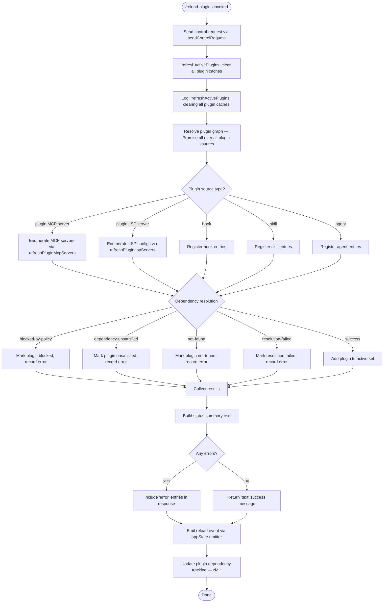

# `/reload-plugins`

> Analysis basis: CC v2.1.162 bundle.js (AST extraction + Claude interpretation)
> Minimum version: v2.1.162

---

## Overview

`/reload-plugins` activates pending plugin changes in the current interactive session without restarting Claude Code. It clears all plugin caches (installed-plugins, skill-index, MCP server state), re-evaluates the full plugin graph (dependency resolution, LSP-server registration, MCP connections), and then emits a reload event so the active UI reflects the updated plugin set. The command is dispatched via a `control-request` channel, making it a supervisor-side operation rather than a normal agent turn.

---

## Registration

| Field | Value |
|---|---|
| type | `local` |
| name | `reload-plugins` |
| description | `Activate pending plugin changes in the current session` |
| supportsNonInteractive | `false` |
| thinClientDispatch | `control-request` |
| module_id | `t6K` |
| load_inline | `true` |
| loc_byte | `12509458` |
| loc_byte_end | `12509677` |
| loc_line | `8900` |
| arbor_handler.name | `bIf` |
| arbor_handler.fqn | `claude-2.1.162::bIf` |
| arbor_handler.kind | `AsyncFunction` |
| arbor_handler.resolution_path | `module_id` |
| arbor_handler.n_hits | `0` |

Analysis basis: CC v2.1.162 bundle.js:+12509458

---

## Input Branching

The handler has five or more distinct branches based on per-plugin load outcomes, dependency-resolution states, and server-type categorisation (plugin MCP server vs. plugin LSP server, hook vs. skill vs. agent). A Mermaid flowchart is used.



Analysis basis: CC v2.1.162 bundle.js:+12508480 (handler entry `bIf`), +12506364 (cache-clear log), +12508517 (`sendControlRequest`), +12508592 (`mn`), +12508888 (`K0H`), +12508920 (`zMH`)

---

## Behavioral Spec

### 1. Handler Entry — `bIf` (AsyncFunction)

```
async function reloadPluginsHandler(context):
    // Step 1 — forward to supervisor
    sendControlRequest("ccr")                        // literal "ccr" at +12508498

    // Step 2 — log and clear all caches
    log("refreshActivePlugins: clearing all plugin caches")
    clearInstalledPluginsCache()                     // calls l4 → QGH

    // Step 3 — resolve the full plugin graph
    results = await refreshActivePlugins()           // K0H

    // Step 4 — update dependency tracking state
    updatePluginDependencyState(results)             // zMH

    // Step 5 — build display fragments
    fragments = buildStatusFragments(results)        // w_H

    return fragments
```

Analysis basis: CC v2.1.162 bundle.js:+12508480, +12508498, +12508517, +12508547, +12508592, +12508888, +12508920, +12508963

The telemetry literal `"reload_plugins"` (at +12508547) is the internal event name recorded when this command runs.

---

### 2. Cache Invalidation — `clearInstalledPluginsCache` (`l4`)

```
function clearInstalledPluginsCache():
    // Clears the installed-plugins registry
    // Delegates to QGH (inner cache-map clear)
    pluginsRegistryMap.clear()
    log("Cleared installed plugins cache")   // literal at +9960748
```

Analysis basis: CC v2.1.162 bundle.js:+12508480 (`bIf`→`l4`), +1095192 (`l4`→`QGH`), +9960748

---

### 3. Active Plugin Refresh — `refreshActivePlugins` (`K0H`)

This is the central async orchestrator. It performs all of the following in sequence:

```
async function refreshActivePlugins():
    log("refreshActivePlugins: clearing all plugin caches")

    // --- Sub-step A: clear skill-index cache ---
    clearSkillIndexCache()               // _m → H.clearSkillIndexCache (+13090006)

    // --- Sub-step B: enumerate plugin sources concurrently ---
    [mcpServers, lspServers] = await Promise.all([
        loadPluginMcpServers(),          // F$ → se7
        loadInstalledPluginsFromDisk(),  // Hs
        readLspConfigs(),               // ZSH
    ])

    // --- Sub-step C: resolve dependency graph ---
    resolvedPlugins = resolveDependencies(mcpServers, lspServers)
    // Produces per-plugin status: blocked-by-policy, dependency-unsatisfied,
    // not-found, resolution-failed, or success

    // --- Sub-step D: categorise by server type ---
    for plugin in resolvedPlugins:
        switch plugin.serverType:
            case "plugin":      addToPluginSet(plugin)
            case "skill":       addToSkillSet(plugin)
            case "agent":       addToAgentSet(plugin)

    // --- Sub-step E: build summary rows ---
    summaryRows = buildSummaryRows(resolvedPlugins)   // K.map (+12506585)

    // --- Sub-step F: emit reload event ---
    appStateEmitter.emit(reloadEvent)                  // $l.emit (+12507453)

    return {resolvedPlugins, summaryRows, errorList}
```

Analysis basis: CC v2.1.162 bundle.js:+12506364, +12506418, +12506424, +12506473, +12506486, +12506492, +12506495, +12506585, +12506625, +12506670, +12506831, +12507023, +12507056, +12507453

Literal `"plugin MCP server"` (+12508703) and `"plugin LSP server"` (+12509196) are the two primary server-type string values used to categorise entries in the summary.

---

### 4. Installed Plugin Discovery — `installedPluginsLoader` (`Hs`)

```
async function installedPluginsLoader(pluginRoot):
    // Reads .mcpb and .dxt package files from the plugin root directory
    entries = splitPluginRoot(pluginRoot)      // f.split (+6754013)

    for entry in entries:
        data = await readPluginManifest(entry)  // zR_ (+6754282)
        if data.status in ["http","download","network"]:
            recordError("mcpb-download-failed")
        elif data.status == "manifest":
            recordError("mcpb-invalid-manifest")
        else:
            pluginList.push(data)

    // Also loads npm-based plugin packages via gC9
    npmPlugins = await loadNpmPlugins()
    return pluginList.concat(npmPlugins)
```

Analysis basis: CC v2.1.162 bundle.js:+6753741, +6754013, +6754282, +6754438, +5243190 (`.mcpb`), +5243211 (`.dxt`)

---

### 5. LSP Configuration Refresh — `lspConfigReader` (`ZSH`)

```
async function lspConfigReader(pluginDir):
    configPath = path.join(pluginDir, ".lsp.json")   // +8299579
    raw        = await readFile(configPath)
    parsed     = jsonParse(raw)                       // p6

    // Validate — if schema check fails emit "lsp-config-invalid"  // +8299849
    if not validRecord(parsed):
        log("lsp-config-invalid")
        return []

    configs = []
    for entry in parsed:
        resolved = resolveRelativePath(pluginDir, entry)   // Bx7+Ux7
        if resolved.startsWith(".."):
            log("Invalid path: must be relative and within plugin directory")
            // +8300779
            continue
        configs.push(resolved)

    return configs
```

Analysis basis: CC v2.1.162 bundle.js:+8299563, +8299608, +8299642, +8299849, +8300779

---

### 6. Dependency State Update — `updatePluginDependencyState` (`zMH`)

```
function updatePluginDependencyState(resolvedPlugins):
    // Iterates resolved plugins and writes per-plugin dependency records
    for plugin in resolvedPlugins:
        existing = dependencyMap.get(plugin.id)     // _.get (+11653160)
        dependencyMap.set(plugin.id, newRecord)     // _.set (+11653196)
        pendingSet.add(plugin.id)                   // $.add (+11653218)

    // Loads known-marketplace data for cross-marketplace dependency checks
    marketplaceList = loadKnownMarketplaces()       // lI → I5 (+11653322)

    // Validates each dependency entry
    for dep in plugin.dependencies:
        status = checkDependencyStatus(dep)         // y2 (+11653462)
        if status == "dependency-unsatisfied":
            errorList.push(dep)
        elif status == "not-found":
            errorList.push(dep)

    // Loads plugin state files and parses for validation errors
    pluginStateRecord = loadPluginStateFile()       // Qa (+11653700)
    lspStateRecord    = loadLspStateFile()          // lE (+11653942)

    // Resolve full dependency tree
    resolvedTree = resolveFullTree(plugin)          // s26 (+11653997)
```

Analysis basis: CC v2.1.162 bundle.js:+11653160, +11653196, +11653218, +11653322, +11653345, +11653462, +11653700, +11653942, +11653997

Error-status strings used: `"dependency-unsatisfied"` (+11653096), `"not-found"` (+11653133), `"dependency-resolution"` (+11654107).

---

### 7. Status Fragment Builder — `buildStatusFragments` (`w_H`)

```
function buildStatusFragments(resolvedPlugins):
    // Builds up to 5 display lines (literal 5 at +5056459)
    lines = []
    for plugin in resolvedPlugins.slice(0, 5):
        label = formatPluginLabel(plugin)          // cA
        lines.push(label + " · " + statusText)    // literal " · " at +12508730

    if resolvedPlugins.length > 5:
        lines.push(extraSuffix)

    return {type: "text", lines}                  // literal "text" at +12508860
```

Analysis basis: CC v2.1.162 bundle.js:+12508963, +5056459, +12508730, +12508860

Error entries use the type literal `"error"` (+12508785).

---

## State & Side Effects

| Item | Detail |
|---|---|
| Telemetry — `reload_plugins` | Fired at the start of the handler (literal `"reload_plugins"` at +12508547) |
| Telemetry — `tengu_plugin_state_file_error` | Fired when a plugin state file cannot be parsed (+9960927) |
| Telemetry — `tengu_feature_ok` / `tengu_feature_bad` / `tengu_feature_sad` | Generic feature-outcome events emitted via the feature-flag path (+1008233, +1008295, +1008376) |
| Telemetry — `tengu_mcp_list_changed` | Fired when the MCP tool list changes as a result of the reload (+15781727) |
| Cache clear | `clearInstalledPluginsCache` (all installed plugin records) and `clearSkillIndexCache` (skill-index map) are both cleared unconditionally before discovery |
| appState event | `$l.emit` (+12507453) broadcasts a reload event to all active UI consumers |
| Control-request dispatch | `thinClientDispatch: "control-request"` means the command body is forwarded to the supervisor process, not passed to the LLM agent |
| Plugin dependency map | `dependencyMap` (state variable behind `zMH`) is written with fresh resolution results |
| Hook registration | Hooks found in newly-loaded plugins are re-registered via `J9` → `jJA.register` (+60123) |
| Non-interactive | `supportsNonInteractive: false` — the command cannot be run in `--print` / pipe mode |
| Sound | None found in depth-2 traversal |

---

## Version History

| Version | Change |
|---|---|
| v2.1.162 | Initial analysis |

---

## Common Mistakes

1. **Running in non-interactive mode** — `/reload-plugins` sets `supportsNonInteractive: false`. Invoking it via `--print` or in a scripted pipeline will be rejected before the handler is reached.
2. **Expecting an immediate MCP reconnect** — The command clears caches and re-evaluates the plugin graph, but new MCP server processes are started asynchronously. Tools from a newly-added server will not be available until the background connection handshake completes (see `bvq` / MCP SDK connect path at +10380105).
3. **Confusing with a full restart** — `/reload-plugins` does not restart the Claude Code process or the daemon. It only refreshes the in-memory plugin registry within the current session.
4. **Expecting plugin errors to block the command** — Per-plugin resolution failures (`blocked-by-policy`, `dependency-unsatisfied`, `not-found`) are collected and returned as `"error"`-typed fragments; the command still completes and successful plugins are activated.
5. **Assuming settings files are re-read** — The command targets plugin state (`plugin.json`, `.mcpb`, `.dxt`, `.lsp.json`, `.claude-plugin/marketplace.json`). General user/project settings (`.claude/settings.json`) are reloaded via a different code path and are not part of this command.

---

## Appendix — Identifier Mapping

> For bundle debugging only. Identifiers change across versions.

| Identifier | Role |
|---|---|
| `bIf` | Main handler for `/reload-plugins` (AsyncFunction, resolved via module_id `t6K`) |
| `l4` | `clearInstalledPluginsCache` — clears the installed-plugins registry map |
| `QGH` | Inner cache-map clear helper called by `l4` |
| `K0H` | `refreshActivePlugins` — central plugin-graph orchestrator |
| `mn` | Send-control-request wrapper (delegates to `x8`) |
| `x8` | Low-level control-request sender |
| `WEq` | Sub-helper inside `K0H`; delegates to `v` (bootstrap-fetch) |
| `F$` | Plugin MCP server loader entry-point |
| `se7` | MCP plugin server enumeration driver |
| `dW` | Inner MCP discovery helper |
| `aC` | Skill-index cache clear coordinator; calls `_m` |
| `_m` | Invokes `H.clearSkillIndexCache` |
| `aa` | Clears `VV8` (plugin-metadata cache via `.clear`) |
| `Hs` | Installed-plugins discovery (reads `.mcpb` / `.dxt` / npm packages) |
| `VrH` | Sub-helper inside `Hs` |
| `uB` | Extension-suffix checker (`.mcpb`, `.dxt`) inside `Hs` |
| `zR_` | Plugin manifest reader (reads `.mcp.json`, parses JSON, handles ENOENT) |
| `gC9` | npm-based plugin loader inside `Hs` |
| `d26` | `.dxt` / `.mcpb` archive extractor and manifest parser |
| `ZSH` | LSP configuration reader (`.lsp.json`) |
| `Bx7` | LSP path resolver and per-entry validator |
| `Ux7` | Path relative-to-plugin-root checker |
| `p1K` | Daemon status helper (reads `daemon.status.json`) |
| `RIf` | Plugin entry filter — produces "lsp-manager" subset |
| `CIf` | Plugin entry filter — produces "plugin:" subset |
| `L08` | Plugin entry categoriser |
| `x_H` | Plugin summary row formatter |
| `kH` | Error-logging helper (calls `Dr.logError`) |
| `TH` | String-coercion wrapper (calls `String`) |
| `$l` | appState event emitter (calls `.emit` to broadcast reload) |
| `zMH` | `updatePluginDependencyState` — writes fresh dependency records |
| `lI` | Known-marketplace loader coordinator |
| `I5` | Reads `known_marketplaces.json` from plugin directory |
| `uV8` | Constructs path for `known_marketplaces.json` (`D7.join`) |
| `KkH` | Dependency-entry validator (calls `m8`, checks `Array.isArray`) |
| `m8` | Plugin-type schema validator (calls `Xc6`, `gQ`) |
| `Xc6` | Inner type-dispatch for plugin schema validation |
| `gQ` | Plugin type registry (contains all known type handlers) |
| `IZ` | Error-constructor wrapper (throws `Error`) |
| `cA` | Plugin-scope checker (`H.includes`, `H.split`) |
| `y2` | Dependency tree walker (calls `XD9`, `UP6`, `D_H`, `ED9`) |
| `XD9` | URL/path type detector for dependency sources |
| `UP6` | Policy-check for dependency host/path patterns |
| `HM8` | Policy-settings accessor |
| `PD9` | Host-pattern policy matcher |
| `WD9` | Path-pattern policy matcher |
| `kiL` | GitHub-source dependency resolver |
| `D_H` | Dependency-type dispatcher |
| `ED9` | Extended dependency checker (policy + path + GitHub) |
| `jD9` | Dependency type classifier (`TY` inner) |
| `Qa` | Plugin marketplace state-file reader (`.claude-plugin/marketplace.json`) |
| `nv6` | Marketplace file path builder |
| `dr_` | Marketplace JSON schema parser (`_.safeParse`) |
| `lE` | LSP state-file loader (calls `Bk_`, `I5`, `PN`) |
| `Bk_` | Reads plugin LSP state file |
| `Mjf` | Dependency-set membership test (`q.has`) |
| `s26` | Full dependency-tree resolver (main resolution engine) |
| `FW` | Plugin-type guard inside dependency resolution |
| `n$8` | Scope/permission checker for dependencies |
| `JM6` | Local-path prefix validator (`./`) |
| `hZ` | Plugin disk state loader (reads plugin state from filesystem) |
| `lr_` | Reads plugin state file synchronously |
| `nr_` | Iterates plugin-state entries |
| `av6` | Plugin status record constructor |
| `j` | MCP server process manager |
| `w` | MCP server worker (manages spawn / kill / claim lifecycle) |
| `W` | MCP server connection handler (SDK/SSE/dynamic modes) |
| `r_` | Settings loader (loads project/local/user settings from disk) |
| `gO` | Settings factory |
| `vH_` | Settings file writer |
| `gP` | Settings persistence helper |
| `Te8` | Settings write-time tracker |
| `yTH` | Settings schema factory |
| `u56` | Atomic file writer (uses temp-file + rename) |
| `cz` | Cache-clear pair (`Lu6.clear`, `VB8.clear`) |
| `Zd6` | Settings-file append/write coordinator |
| `Ix` | `.claude/settings.json` path builder |
| `_U` | Settings update dispatcher |
| `o26` | Plugin-root path validator |
| `l` | Scheduled-task runner (manages recurring / one-shot tasks) |
| `X` | TCP/socket buffer reader |
| `$P6` | Token-budget calculator |
| `h58` | Token-budget overflow handler |
| `gvK` | Boolean-cast helper |
| `Q` | Output-queue writer (setTimeout-based flush) |
| `ue` | Feature-flag checker (`_.has`) |
| `q_H` | Tool-filter helper |
| `_H` | Session-resume / main-loop coordinator |
| `th8` | Session-type brancher (`V$`, `Zq`, `F1A`) |
| `wZ` | Terminal multiplexer detector (tmux/screen/base64) |
| `d` | Daemon process-table entry |
| `V$` | Session-type sentinel |
| `L5H` | Live-session lister |
| `g` | Background-session process manager |
| `L1H` | Full session-resume orchestrator |
| `E6` | Event-system initialiser (`Zx6`) |
| `k_` | Module bootstrap (sets `__esModule`, wires prototype chain) |
| `eH` | Message-write path with rate-limit handling |
| `gH` | Regex-exec helper for session-ID extraction |
| `u7` | UUID generator for sessions (`Sk.randomUUID`) |
| `BT` | Event-bus emit helper (`Yu6.emit`) |
| `pC6` | Project-file rename coordinator |
| `Nn` | Session-metadata accessor (`U4`) |
| `b38` | Plugin-state cleanup helper |
| `_bH` | Session-metadata writer (`U4`) |
| `K$H` | Session config builder |
| `gC6` | Session coordinator (maps config to internal handles) |
| `xH` | VSCode-extension feature-gate checker |
| `CH` | Channel multiplexer (`j6`) |
| `Jd` | Turn-timer / latency recorder |
| `Z9H` | Session-metadata reader (`U4`) |
| `QC6` | Working-directory manager (`process.chdir`) |
| `T9H` | Session-metadata updater (`fL.utimes`, `H.reAppendSessionMetadata`) |
| `Z6` | Low-level event helper (`Zx6`) |
| `JH` | MCP registry (maps server names to connection handles) |
| `KH` | Per-server connection record constructor |
| `S8` | MCP server-state manager |
| `u8` | MCP session authenticator |
| `$8` | Main agent turn executor (full pipeline including MCP pre-wait) |
| `bvq` | MCP SDK connect orchestrator (calls `$.connect`, `$.getServerCapabilities`) |
| `K1` | MCP registry helper |
| `e6` | MCP server event emitter helper |
| `Nx` | Notification-key resolver |
| `k$9` | VSCode-bridge message dispatcher |
| `USK` | CCD-session feature-gate checker |
| `YH` | Plugin-install record map |
| `H26` | Plugin-version range validator (`lc.validRange`, `lc.minVersion`) |
| `vv_` | Version-validity inner check |
| `g$8` | Plugin-package pre-check |
| `kk_` | Package-check inner helper (`pJH`) |
| `l26` | Plugin-package loader wrapper |
| `d$8` | npm/git/URL plugin downloader and version resolver |
| `YH7` | Download target resolver |
| `C8` | Child-process executor for plugin install |
| `Q$8` | Plugin-source normaliser |
| `a26` | Plugin install/update orchestrator |
| `ToH` | Plugin archive unpacker (handles `.dxt` / `.mcpb` / git) |
| `r$8` | Plugin LSP server starter |
| `oW9` | Plugin install post-processor |
| `E_H` | Plugin content-hash computer (SHA-256) |
| `cI` | Plugin cache-key builder |
| `RM8` | Plugin directory scanner (`RY9.readdir`) |
| `mB` | Plugin install error classifier |
| `zjH` | Plugin cache invalidator |
| `l$8` | Plugin cleanup helper (`cE.rm`) |
| `Ck_` | Plugin state updater (calls `hZ`, manages list positions) |
| `a` | UI ref / setTimeout scheduler |
| `G` | UI context provider |
| `i` | MCP update applier (`d.applyMcpUpdate`) |
| `UH` | Main interactive-mode render loop |
| `dH` | Input-dispatch handler |
| `HH` | UI-ref update scheduler |
| `s` | Full interactive session state machine |
| `$H` | Output-stream enqueue helper |
| `k` | File-watcher initialiser (chokidar) |
| `y` | Away-summary generator |
| `e` | Notification adder (`H.addNotification`) |
| `mH` | Tool-list renderer |
| `cH` | Message-slice writer |
| `XH` | MCP feature-flag gate |
| `nF` | MCP notification dispatcher |
| `S6` | Promise resolution helper (`Nv`) |
| `ZH` | MCP feature-flag composite gate |
| `g$` | MCP gate sub-check |
| `IH` | MCP tool concat helper |
| `LH` | MCP tool-list change handler (tools/list_changed) |
| `WH7` | Plugin dependency-error message formatter |
| `r` | MCP update-application loop |
| `PB` | Promise-based async iterator adapter |
| `I_6` | Integer parser for MCP message IDs |
| `Xv8` | Integer parser variant |
| `SCH` | MCP schema-change applier |
| `ROA` | MCP remote-server recovery monitor |
| `gI` | Plugin name lowercase normaliser |
| `u$` | String type-coercion helper |
| `tH` | String wrapper (calls `String`) |
| `HL` | OTEL metrics attribute builder |
| `HkH` | OTEL resource-attribute collector |
| `w46` | OTEL event-attribute builder |
| `JF8` | OTEL metric emitter |
| `jF8` | OTEL sequence helper |
| `fH` | Voice / interactive mode flag holder |
| `w_H` | Status-fragment builder for `/reload-plugins` response |
| `SH` | JSON serialiser wrapper (`JSON.stringify`) |
| `V4` | Path-component formatter |
| `rXA` | Path-array mapper |
| `WpH` | Write helper for plugin state |
| `pXA` | Low-level write wrapper |
| `EgK` | Plugin file-write orchestrator (mkdir + appendFile + rotate) |
| `dmH` | Buffered write scheduler (clearTimeout/setTimeout/setImmediate) |
| `E3H` | Write-flush finaliser |
| `zL6` | File-stat helper (`V8`) |
| `_PA` | Path-join helper for plugin files |
| `HPA` | File-rotate helper (stat / rename / unlink) |
| `GgK` | Plugin file-write executor (mkdir + appendFile loop) |
| `J9` | Hook registration dispatcher (`jJA.register`) |
| `p6` | JSON-parse wrapper |
| `R8` | Error-code classifier (ENOENT, EISDIR, ENOTDIR) |
| `V8` | File-stat error handler |
| `SV8` | MCP server-version checker |
| `A38` | Plugin-source type validator |
| `gO8` | Plugin-origin checker |
| `BS_` | Plugin-root aggregator (iterates `Object.entries`, filters by `pluginRoot`) |
| `U$8` | Plugin-state version validator |
| `Fr_` | Plugin-feature-flag resolver |
| `qEq` | Plugin-quota checker |
| `sGq` | Skill-index query helper |
| `WCH` | MCP capability broadcaster (`wI6`) |
| `qW6` | Plugin-source type mapper |
| `_y_` | Plugin-manifest normaliser |
| `Ju9` | Plugin-scope resolver |
| `Aj` | Plugin activation helper |
| `O9q` | Plugin-state machine initialiser |
| `$CH` | Plugin-config merger |
| `SZ` | Plugin-set diff calculator |
| `X_` | Promise-utility (`Nv`) |
| `Nv` | Core async-utility (no-op sentinel) |

---

Note: index built via Arbor fallback; some signals (telemetry, literals) may be missing — see arbor-fallback.js.