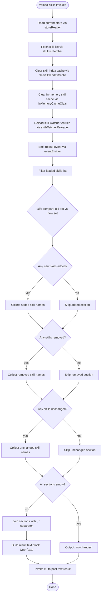

# `/reload-skills`

> Analysis basis: CC v2.1.162 bundle.js (AST extraction + Claude interpretation)
> Minimum version: v2.1.162

---

## Overview

`/reload-skills` rescans the disk for skill files that were added or modified during the current session, rebuilds the in-memory skill index, and reports a diff of what changed (added, removed, or unchanged). It is designed to be invoked interactively or in non-interactive pipelines, and dispatches its result as a plain-text post back to the conversation.

---

## Registration

| Field | Value |
|---|---|
| type | `local` |
| name | `reload-skills` |
| description | `Pick up skills added or changed on disk during this session` |
| supportsNonInteractive | `true` |
| thinClientDispatch | `post-text` |
| module_id | `_8K` |
| load_inline | `true` |
| loc_byte | `12510227` |
| loc_byte_end | `12510444` |
| loc_line | `8900` |
| arbor_handler.name | `uIf` |
| arbor_handler.fqn | `claude-2.1.162::uIf` |
| arbor_handler.kind | `AsyncFunction` |
| arbor_handler.resolution_path | `module_id` |
| arbor_handler.n_hits | `0` |

Analysis basis: CC v2.1.162 bundle.js:+12510227

---

## Input Branching

The command resolves through 4+ distinct paths depending on the state of the skill cache, the diff between old and new skill sets, and whether individual skill entries are new, removed, or unchanged. A Mermaid flowchart is used.



Analysis basis: CC v2.1.162 bundle.js:+12509749, +12509778, +12509856, +12509872, +12510028, +12510041

---

## Behavioral Spec

### Main Handler — `reloadSkillsHandler` (`uIf`)

```
async function reloadSkillsHandler(context):
    # Step 1: Obtain the current skill store state
    currentStore = readSkillStore(context)           # via storeReader (x6 → RQ6)

    # Step 2: Fetch the authoritative skill list from the skill provider
    skillList = await fetchSkillList(context)        # via skillListFetcher (YP)

    # Step 3: For each existing skill entry, remove any stale on-disk artefacts
    for each entry in skillList:
        performCleanup(entry)                        # via q.map → OCK.unlinkSync

    # Step 4: Rebuild the skill index by clearing the cache
    await rebuildSkillIndex(context)                 # via aC → _m → clearSkillIndexCache

    # Step 5: Clear the in-memory skill cache
    clearInMemoryCache()                             # via aa → VV8.clear

    # Step 6: Reload all skill watcher entries in parallel
    await Promise.all(
        skillWatcherEntries.map(entry => reloadWatcherEntry(entry))
    )                                                # via L.map, q.add/finally/delete

    # Step 7: Emit the reload event to notify subscribers
    emitReloadEvent(context)                         # via $l.emit

    # Step 8: Compute diff — added, removed, unchanged skills
    loaded   = filterLoadedSkills(skillList)         # via L.filter
    added    = loaded.filter(s => !currentStore.has(s))   # K.has, q.filter
    removed  = currentStore entries not in loaded          # f.has
    unchanged = intersection of currentStore and loaded

    # Step 9: Build result message parts
    parts = []
    if added is non-empty:
        parts.push(formatSkillNames(added, "skill"))   # x8 helper, "skill" literal
    if removed is non-empty:
        parts.push(formatSkillNames(removed, ...))
    if unchanged is non-empty:
        parts.push(formatSkillNames(unchanged, ...))

    # Step 10: Compose final output
    if parts is empty:
        resultText = "no changes"                    # literal: bundle.js:+12510041
    else:
        resultText = parts.join(", ")                # literal ", " bundle.js:+12510035

    # Step 11: Post the result as a text block
    return postTextResult({ type: "text", content: resultText })  # x8, bundle.js:+12510111
```

Analysis basis: CC v2.1.162 bundle.js:+12509749, +12509762, +12509778, +12509798, +12509803, +12509836, +12509856, +12509872, +12509887, +12509911, +12509926, +12509960, +12510028, +12510066, +12510111, +12510123

---

### Sub-feature: Skill Index Cache Rebuild (`rebuildSkillIndex` / `_m`)

```
async function rebuildSkillIndex(context):
    await Promise.resolve()                          # yield to event loop
    await bootstrapFetchHelper(context)              # g8A — fetches fresh skill metadata
    skillIndexStore.clearSkillIndexCache()           # H.clearSkillIndexCache
```

The bootstrap fetch helper (`g8A`) issues an HTTP request with the following characteristics:
- Logs `"[Bootstrap] Fetching"` at debug level (bundle.js:+15590993, +205793)
- Sets `Content-Type: application/json` (bundle.js:+15591078, +15591093)
- Sets `User-Agent` header (bundle.js:+15591112)
- Applies a **5000 ms timeout** (bundle.js:+15591194)
- On success logs `"[Bootstrap] Fetch ok"` (bundle.js:+15591367)
- On parse failure emits event labelled `"parse_failed"` (bundle.js:+15591337)
- Records telemetry event `"api_bootstrap_fetch"` (bundle.js:+15591315)

Analysis basis: CC v2.1.162 bundle.js:+13089954, +13089984, +13090006, +13090053

---

### Sub-feature: Skill Store Reader (`storeReader` / `x6`)

```
function readSkillStore(context):
    store = storeAccessor.getStore()                 # RQ6 → SQ6.getStore
    normalizedStore = normalizeStoreEntry(store)     # hi
    watchedPaths = resolveWatchedPaths(store)        # X_ → Nv
    return { store, watchedPaths }
```

Analysis basis: CC v2.1.162 bundle.js:+1018513, +1018462, +1018483, +1018532, +42011

---

### Sub-feature: Skill Watcher Reload (`skillWatcherReloader` / `L`)

```
async function reloadWatcherEntry(entry):
    watchSet.add(entry)                              # q.add
    try:
        handle = await openFileHandle(entry)         # f → A.close / q.close
        # process handle (read content, parse)
        result = processSkillFile(handle)            # f → L (recursive watcher step)
    finally:
        watchSet.delete(entry)                       # q.delete
```

Background sessions that are `"stopped"` are skipped (literal `"stopped"`, bundle.js:+16032393).
Background session label used in reporting: `"background session"` (bundle.js:+16032436).
Skill name column width is padded to **40 characters** for alignment (bundle.js:+16022362).
Padding fill character: `"  "` (two spaces, bundle.js:+16020391).

Analysis basis: CC v2.1.162 bundle.js:+16001568, +16001577, +16001591, +16007560, +16007570, +16022288, +16022362, +16020357, +16020370, +16020391

---

### Sub-feature: In-Memory Skill Cache Clear (`aa`)

```
function clearInMemoryCache():
    inMemoryCacheStore.clear()                       # VV8.clear
```

Analysis basis: CC v2.1.162 bundle.js:+9903405

---

### Sub-feature: MCP Watcher Context (`WCH` / `wI6`)

```
function getWatcherContext():
    handle = watcherMap.get(key)                     # KN8.get
    if handle is not found:
        return defaultWatcherContext()               # DI6
    return handle
```

Analysis basis: CC v2.1.162 bundle.js:+13090070, +10106401, +10106741, +10106749

---

### Sub-feature: Result Formatter (`x8`)

```
function formatSkillEntry(skillName, kind):
    # kind is always "skill" for this command (bundle.js:+12510123)
    label = kind + " " + skillName
    return { type: "text", content: label }          # "text" literal bundle.js:+12510066
```

Analysis basis: CC v2.1.162 bundle.js:+12510111, +12510123, +12510066, +16032431

---

## State & Side Effects

| Item | Detail |
|---|---|
| Telemetry | `tengu_feature_sad` (bundle.js:+1008376) — fired within the `storeReader` path (`t6 → c`) |
| Skill index cache | Fully cleared and rebuilt on every invocation via `H.clearSkillIndexCache` (bundle.js:+13090006) |
| In-memory skill cache | Cleared unconditionally via `VV8.clear` (bundle.js:+9903405) |
| Watcher set | Entries temporarily added and then removed via `q.add` / `q.delete` (bundle.js:+16001568, +16001591) |
| Event emission | Reload event broadcast via `$l.emit` (bundle.js:+12509856) |
| File system | Stale skill artefacts unlinked via `OCK.unlinkSync` during map step (bundle.js:+15973408) |
| HTTP request | Bootstrap fetch issued with 5000 ms timeout; sets `Content-Type` and `User-Agent` headers (bundle.js:+15591194) |
| Output dispatch | Result posted as `thinClientDispatch: post-text`; type field is `"text"` |
| Non-interactive | Fully supported (`supportsNonInteractive: true`) |

---

## Version History

| Version | Change |
|---|---|
| v2.1.162 | Initial analysis |

---

## Common Mistakes

1. **Running `/reload-skills` to pick up changes in already-loaded skills that have not been saved to disk.** The command only rescans disk; in-memory edits not yet persisted will not be reflected.
2. **Expecting instant index availability after the command returns.** The bootstrap fetch has a 5000 ms timeout (bundle.js:+15591194); in slow environments the new index may not be fully populated immediately.
3. **Assuming the command is purely local.** It issues an HTTP bootstrap fetch to refresh skill metadata, which requires network access and appropriate credentials.
4. **Ignoring the `"no changes"` output.** This is a legitimate success state, not an error — it means the on-disk skill set matches what was already loaded.
5. **Using the command in a thin-client context and expecting rich structured output.** The dispatch mode is `post-text`, so downstream consumers receive plain text, not structured data.

---

## Appendix — Identifier Mapping

> For bundle debugging only. Identifiers change across versions.

| Identifier | Role |
|---|---|
| `uIf` | Main handler for `/reload-skills` (async function, Arbor-resolved) |
| `x6` | Skill store reader — reads current store and resolves watched paths |
| `RQ6` | Store accessor — calls `getStore` and normalizes entries |
| `hi` | Store entry normalizer |
| `X_` | Watched-path resolver |
| `Nv` | Path resolution helper (depth-2 leaf of `X_`) |
| `aC` | Skill index rebuild orchestrator |
| `_m` | Async index rebuild core — clears cache and triggers bootstrap fetch |
| `H` | Skill index store object — exposes `clearSkillIndexCache`, bootstrap fetch, and related utilities |
| `v` | Bootstrap fetch helper — issues HTTP request with headers and timeout |
| `_3` | Skill index store sub-helper |
| `AY_` | String parsing utility (split, trim, indexOf, slice) used within index store |
| `LHH` | Set membership checker (`Y94.has`) used within index store |
| `bJ` | String replace utility used within index store |
| `a1` | Compound string utility (oHH, qq, rX) |
| `t6` | Store sub-operation that fires `tengu_feature_sad` telemetry |
| `SV8` | Reload orchestrator auxiliary (step after cache clear) |
| `sGq` | Reload orchestrator auxiliary |
| `WCH` | MCP watcher context provider |
| `wI6` | Watcher map lookup — retrieves handle from `KN8` or returns default |
| `DI6` | Default watcher context factory |
| `aa` | In-memory skill cache clearer (`VV8.clear`) |
| `L` | Skill watcher reload iterator (add/finally/delete pattern) |
| `f` | File handle manager within watcher reload (open, close, process) |
| `A` | File handle object (exposes `toLowerCase` for path normalization) |
| `K` | Skill name formatter / padder (`padEnd`) |
| `O` | Result parts accumulator (push + join) |
| `x8` | Text result poster — builds `{ type: "text" }` output block |

---

*Note: index built via Arbor fallback; some signals (telemetry, literals) may be missing — see arbor-fallback.js.*