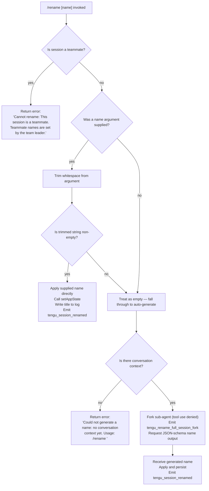

# `/rename`

> Analysis basis: CC v2.1.162 bundle.js (AST extraction + Claude interpretation)
> Minimum version: v2.1.162

---

## Overview

`/rename` (also accessible as `/name`) renames the current conversation session. When invoked with an explicit name argument the session is immediately renamed to that string; when invoked with no argument it forks a minimal sub-agent call to generate a name automatically from the conversation history, then applies the generated name.

---

## Registration

| Field | Value |
|---|---|
| type | `local-jsx` |
| name | `rename` |
| description | `Rename the current conversation` |
| argumentHint | `[name]` |
| immediate | `true` |
| aliases | `["name"]` |
| module_id | `Zlq` |
| load_inline | `true` |
| loc_byte | `11937070` |
| loc_byte_end | `11937269` |
| loc_line | `8184` |
| arbor_handler.name | `RWf` |
| arbor_handler.kind | `AsyncFunction` |
| arbor_handler.fqn | `claude-2.1.162::RWf` |
| arbor_handler.resolution_path | `module_id` |
| arbor_handler.n_hits | `0` |

Analysis basis: CC v2.1.162 bundle.js:+11937070

---

## Input Branching

Four distinct paths exist depending on session type and the presence/content of the supplied name argument.



Analysis basis: CC v2.1.162 bundle.js:+11936096 (teammate guard), +11936214 (context store check), +11936333 (trim), +11936445 (no-context error), +11936234 (teammate error literal), +11934922 (fork telemetry)

---

## Behavioral Spec

### Top-level handler — `mainRenameHandler` (`RWf`)

```
async function mainRenameHandler(context, argument):
    result = await executeRename(context, argument)
    renderUI(result)
    emitEventIfNecessary(context)
```

Analysis basis: CC v2.1.162 bundle.js:+11936766 (`RWf → wh8`), +11936782 (`RWf → H`), +11936824 (`RWf → Yh8`)

---

### Core rename execution — `executeRename` (`wh8`)

```
async function executeRename(context, rawArgument):
    sessionStore = getSessionStore()                  // KM → d0 → Q7_.getStore
    if sessionStore is teammate session:
        return errorResult("Cannot rename: This session is a teammate. Teammate names are set by the team leader.")

    trimmedName = rawArgument.trim()

    if trimmedName is non-empty:
        applyRenameDirectly(trimmedName, context)     // sCH path
        setAppState(...)                               // _.setAppState
        persistTitle(trimmedName)                      // PwH
        emitBasenameUpdate(trimmedName)               // rJ
        return successResult()

    // No name supplied — attempt auto-generation
    result = await autoGenerateName(context)          // A16
    if result is error:
        return result
    applyRenameDirectly(result.name, context)
    setAppState(...)
    persistTitle(result.name)
    emitBasenameUpdate(result.name)
    return successResult()
```

Analysis basis: CC v2.1.162 bundle.js:+11936214, +11936333, +11936559, +11936573, +11936615, +11936619

---

### Teammate guard — `checkTeammateSession` (`KM`)

```
function checkTeammateSession():
    store = getAsyncLocalStore()       // d0 → Q7_.getStore (byte +2247192)
    return store value at index 0      // literal 0 at byte +2248345
```

Analysis basis: CC v2.1.162 bundle.js:+11936214, +2248333, +2247192

---

### Auto-generation path — `autoGenerateName` (`A16`)

```
async function autoGenerateName(context):
    // Record telemetry for session fork
    emitTelemetry("tengu_rename_full_session_fork")   // ae_ at +11934960

    // Check conversation history exists
    conversationMessages = getConversationMessages(context)
    if conversationMessages is empty:
        return error("Could not generate a name: no conversation context yet. Usage: /rename <name>")

    // Build a forked agent request
    // Tools are explicitly denied: "Session name generation cannot use tools"
    // Tool policy literal: "deny" at byte +11934364
    agentRequest = buildForkRequest(
        messages   = prepareMessagesForNaming(conversationMessages),  // zh8
        toolPolicy = "deny",
        outputSchema = { type: "json_schema", property: "name" },     // literal at +11935294
        origin     = "rename" / "rename_generate_name"                // literals at +11934458, +11934482
    )

    // Execute forked agent call (SWf → $G)
    response = await runForkAgent(agentRequest)       // SWf

    // Extract name from response (Tlq → yR → trim)
    generatedName = extractTextFromResponse(response).trim()

    // Build display component (kh → VN8 / nE / n5K)
    renderNameResult(generatedName, context)

    return { name: generatedName }
```

Analysis basis: CC v2.1.162 bundle.js:+11934919 (`A16 → j6`), +11934960 (`A16 → ae_`), +11934979 (`A16 → SWf`), +11935031 (`A16 → zh8`), +11935072 (`A16 → kh`), +11936445 (no-context error literal), +11934364 ("deny" literal), +11934379 ("Session name generation cannot use tools" literal)

---

### Message preparation for naming — `prepareMessagesForNaming` (`zh8`)

```
function prepareMessagesForNaming(messages):
    filtered = []
    for message in messages:
        if message.isMeta:                 // literal "isMeta" at +11931598
            skip
        if message.origin == "human":      // literal "human" at +11931673
            filtered.push(summariseMessage(message))
    // Joins with array join and slices to a safe length
    return filtered.join(...).slice(...)
```

Analysis basis: CC v2.1.162 bundle.js:+11931737, +11931755, +11931853, +11931885

---

### Fork agent execution — `runForkAgent` (`SWf`)

```
async function runForkAgent(request):
    abortController = new AbortController()
    // Listen for "abort" event from parent
    parentSignal.addEventListener("abort", () => abortController.abort())  // +11934168, +11934199

    // Execute main agent loop ($G)
    agentResult = await executeAgentLoop(request, abortController)   // $G at +11934246

    // Render streaming output (b8)
    renderOutput(agentResult)                                         // b8 at +11934266

    // Flatten result messages (q.flatMap)
    flatMessages = agentResult.messages.flatMap(normalise)           // +11934604

    // Normalise using Tlq / yR
    return normaliseResponse(flatMessages)                            // Tlq at +11934769
```

Analysis basis: CC v2.1.162 bundle.js:+11934118, +11934168, +11934199, +11934246, +11934266, +11934604, +11934769, +11934799, +11934837

---

### Direct rename application — `applyRenameDirectly` (`sCH`)

```
function applyRenameDirectly(name, context):
    // Write to primary log (S6 / kS / sN / dMH)
    writeToLog(name, context)
    // Emit title update event (jR6.emit with "custom-title" tag)
    // literal "custom-title" at byte +13131030
    emitTitleEvent("custom-title", name)
    // Emit telemetry
    emitTelemetry("tengu_session_renamed")   // +13131122
    // Resolve as promise (Promise.resolve at +10778709)
    return Promise.resolve(name)
```

Analysis basis: CC v2.1.162 bundle.js:+11936559, +10778603, +10778641, +13131030, +13131109, +13131122

---

### Persist title to filesystem — `persistTitle` (`PwH`)

```
async function persistTitle(name, context):
    // Derive storage path (CK → mE → G2.join)
    titlePath = joinPaths(storageBase, name)
    // Atomic write via random-bytes temp file (ff → ez)
    atomicWrite(titlePath, name)
    // Update in-memory cache (Hq → mLH.set)
    cache.set(titlePath, { value: name, mtime: stat.mtime })
    // Error handler: log via kH / Dr.logError
```

Analysis basis: CC v2.1.162 bundle.js:+11936615, +4145433, +4145447, +4145491, +4145568, +4145658, +4145664

---

### Basename / sidebar update — `emitBasenameUpdate` (`rJ`)

```
function emitBasenameUpdate(name):
    base = path.basename(storagePath)    // G2.basename at +4142428
    writeStatusLine(base, name)          // S6 at +4142450
```

Analysis basis: CC v2.1.162 bundle.js:+11936619, +4142428, +4142450

---

## State & Side Effects

| Item | Detail |
|---|---|
| Telemetry — `tengu_rename_full_session_fork` | Fired when no explicit name is given and a sub-agent fork is initiated (bundle.js:+11934922) |
| Telemetry — `tengu_session_renamed` | Fired after any successful rename, both direct and AI-generated (bundle.js:+13131122) |
| Telemetry — `tengu_fork_agent_query` | Fired inside the forked agent query loop (bundle.js:+10862164) |
| Telemetry — `tengu_forked_agent_default_turns_exceeded` | Fired if the forked agent exceeds its default turn limit (bundle.js:+10861721) |
| Telemetry — `tengu_agent_name_set` | Fired when agent name is recorded during fork (bundle.js:+13134150) |
| `appState` changes | `setAppState` is called on the session context to reflect the new conversation title (bundle.js:+11936573) |
| Event bus | `jR6.emit` is called with `"custom-title"` or `"ai-title"` tag after rename succeeds (bundle.js:+13131030, +13131194) |
| Filesystem | Title is persisted atomically to the session storage directory via a temp-file rename pattern; cache entry is updated (bundle.js:+4145568, +4143616) |
| Hook registration | `J9 → jJA.register` is reached during the file-write path (bundle.js:+60123) — standard write-hook registration, no rename-specific hook |
| Tool policy during auto-generation | All tool access is explicitly denied during the sub-agent name-generation call; literal `"deny"` at bundle.js:+11934364 |
| Sound | None detected in depth-2 traversal |

---

## Version History

| Version | Change |
|---|---|
| v2.1.162 | Initial analysis |

---

## Common Mistakes

1. **Passing a blank or whitespace-only argument** — the command treats a whitespace-only argument as if no argument were given and falls through to the auto-generation path (or returns the no-context error if there are no messages yet).
2. **Running `/rename` in a teammate session** — the command immediately returns an error: *"Cannot rename: This session is a teammate. Teammate names are set by the team leader."* No rename is applied.
3. **Expecting instant auto-generation with an empty conversation** — if the conversation has no messages yet, auto-generation fails with *"Could not generate a name: no conversation context yet. Usage: /rename \<name\>"*. Supply an explicit name instead.
4. **Expecting tool use during auto-generation** — the forked sub-agent that generates a name runs with `toolPolicy = "deny"`. Any tool calls attempted in that context are blocked.
5. **Using `/rename` expecting `/name` to behave differently** — `/name` is a registered alias and is functionally identical.

---

## Appendix — Identifier Mapping

> For bundle debugging only. Identifiers change across versions.

| Identifier | Role |
|---|---|
| `RWf` | Top-level async handler for `/rename` (Arbor-resolved entry point) |
| `wh8` | Core rename execution function (teammate guard, trim, direct/auto branch) |
| `Yh8` | UI render helper called from main handler |
| `KM` | Teammate-session check dispatcher |
| `d0` | Async-local store retrieval wrapper |
| `A16` | Auto-generation orchestrator (forks sub-agent) |
| `ae_` | Telemetry emitter for `tengu_rename_full_session_fork` |
| `SWf` | Forked agent runner (abort listener, agent loop, output render) |
| `S_H` | Sub-agent state initialiser |
| `$G` | Agent loop executor within fork |
| `AZ8` | App-state reader/writer within agent loop |
| `zh8` | Message preparation / filtering for name generation |
| `Tlq` | Response normaliser for forked agent output |
| `yR` | Text-trimming helper for extracted name |
| `kh` | Result rendering component builder |
| `VN8` | Conversation serialisation / file read-write for context |
| `nE` | Message normalisation pipeline |
| `n5K` | Main query execution engine (used by fork) |
| `sCH` | Direct rename application (log write + event emit) |
| `kS` | Log-write coordinator |
| `sN` | Log format helper |
| `dMH` | Low-level log file writer (appendFileSync, mkdirSync) |
| `U4` | Log-write sequencer |
| `Nt` | Alternative log-write path |
| `PwH` | Filesystem title persistence (atomic write + cache update) |
| `CK` | Storage path builder |
| `mE` | Path join helper |
| `Hq` | File cache read/write/invalidate manager |
| `ff` | Atomic write orchestrator |
| `ez` | Atomic write via temp file (randomBytes → writeFile → rename) |
| `iJ` | Cache entry invalidator |
| `rJ` | Basename emitter for sidebar update |
| `R8` | Error code helper |
| `rf` | Filesystem error wrapper |
| `kH` | Error logger (Dr.logError) |
| `tH` | String coercion utility |
| `wq` | Log queue flusher |
| `UyA` | Log queue entry builder |
| `Gj4` | Ring-buffer log queue manager |
| `j6` | Context-file loader (reads/watches context files) |
| `C6` | Context file watcher entry |
| `DYH` | Context file reader (readFileSync, statSync, mkdirSync) |
| `bWL` | File watcher registration (o18.watchFile) |
| `Hu` | Context-file change notifier |
| `ex` | Change event emitter |
| `U18` | Context file de-duplication tracker |
| `rJ_` | Growthbook experiment event emitter |
| `eJ_` | Context-file registration helper |
| `b8` | Streaming output renderer |
| `P` | Text-field editor component |
| `X` | Byte-stream reader |
| `TH` | String coercion wrapper |
| `M` | MCP manager orchestrator |
| `RCH` | MCP connection manager |
| `xp8` | MCP connection result applier |
| `ROA` | MCP server reconnection handler |
| `N_6` | MCP auth-header helper |
| `hk` | MCP cleanup helper |
| `SCH` | MCP auth-exchange helper |
| `jl` | MCP server entry builder |
| `sI` | MCP server status mapper |
| `Pvq` | MCP connection executor |
| `kvq` | MCP connection validator |
| `ja_` | MCP OAuth initiator |
| `Xa_` | MCP OAuth callback handler |
| `Ja_` | MCP reconnect scheduler |
| `IR_` | MCP connection type filter |
| `yz8` | MCP timeout helper |
| `vz8` | MCP retry-window helper |
| `Y8` | MCP debug logger |
| `G7` | MCP error logger |
| `Tvq` | MCP pending-connection tracker |
| `I_6` | MCP connect-timeout parser |
| `Xv8` | MCP retry-interval parser |
| `p1K` | MCP state-change recorder |
| `Rz8` | MCP server-state classifier |
| `n8` | Timer/retry utility |
| `j1H` | Session agent-name persistence helper |
| `r5H` | Agent-name log writer |
| `Jd` | Session-file reader/writer |
| `KO6` | Session JSON read/write helper |
| `l4` | UI layout component |
| `QGH` | Layout sub-component |
| `UI8` | App-state key enumerator |
| `iK` | Tool-list filter |
| `CE` | Render completion handler |
| `q2` | Argument parser / token classifier |
| `a1` | Token expansion helper |
| `oHH` | Token classification pipeline |
| `Dd` | Token normaliser |
| `qq` | Model-alias resolver |
| `Q0` | Model-name validator |
| `pKH` | Prefix-check helper |
| `qI` | Model tier selector |
| `LQH` | Model tier fallback |
| `PE` | Provider resolver |
| `RJ1` | Provider chain resolver |
| `UM` | Upstream provider wrapper |
| `Xt6` | Extended-context flag checker |
| `fQH` | Feature-flag accessor |
| `rX` | Argument routing dispatcher |
| `g0` | Full argument handler |
| `t6` | Bootstrap fetch initiator |
| `Z6` | Fetch response handler |
| `Zx6` | Low-level fetch wrapper |
| `wA` | Error formatter |
| `Hf` | Argument presence checker |
| `u7_` | Key-type detector |
| `V4` | Path normaliser |
| `rXA` | Path segment mapper |
| `WpH` | File write dispatcher |
| `pXA` | Buffered file writer |
| `EgK` | Conversation file writer / compactor |
| `dmH` | Debounced write scheduler |
| `E3H` | Conversation file flusher |
| `zL6` | Conversation file path resolver |
| `_PA` | Conversation path helper |
| `HPA` | Conversation file renamer/unlinker |
| `GgK` | Conversation append-file handler |
| `J9` | Write-complete hook registrar |
| `_3` | HTTP header builder |
| `AY_` | URL parameter parser |
| `LHH` | Known-hosts checker |
| `bJ` | URL sanitiser |
| `SA5` | Timeout wrapper |
| `H` | Bootstrap fetch function |
| `v` | Conversation title generator utility |
| `PgK` | Title formatter |
| `PJA` | Title component builder |
| `SH` | JSON serialiser |
| `_` | Generic utility reference |
| `S6` | Stdout/log line writer |
| `Nv` | ANSI / terminal formatter |
| `Rk` | Log-level router |
| `wM` | Structured log emitter |
| `$R` | Plain log emitter |
| `X_` | Colour-coded log emitter |
| `B1H` | Message-type router |
| `vI8` | Message validator |
| `Qyq` | Message-type classifier |
| `Y` | Process exit / abort manager |
| `r7H` | Tool-result filter |
| `B5f` | Fork-agent result renderer |
| `um` | Sub-agent lifecycle handler |
| `zk6` | Message-type inclusion checker |
| `q_` | Wildcard matcher |
| `K` | Table renderer |
| `fxH` | Tool-call result assembler |
| `_a_` | Context serialiser |
| `p6` | JSON parse wrapper |
| `pZq` | Context file loader |
| `V8` | Error-code normaliser |
| `L` | Promise/task queue manager |
| `x6` | Path resolution helper |
| `ZN8` | Session-id generator |
| `u_f` | Message block flattener |

---

Note: index built via Arbor fallback; some signals (telemetry, literals) may be missing — see arbor-fallback.js.