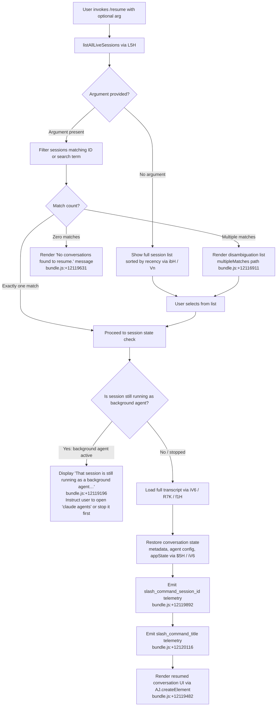

# `/resume`

> Analysis basis: CC v2.1.162 bundle.js (AST extraction + Claude interpretation)
> Minimum version: v2.1.162

---

## Overview

The `/resume` command (also accessible as `/continue`) allows a user to re-attach to or reload a previously saved conversation session. It queries all live and stored sessions, presents matching results to the user, and then restores the chosen conversation's full state — including transcript, metadata, and agent configuration — into the current interactive session.

---

## Registration

| Field | Value |
|---|---|
| type | `local-jsx` |
| name | `resume` |
| description | `Resume a previous conversation` |
| aliases | `["continue"]` |
| argumentHint | `[conversation id or search term]` |
| module_id | `Joq` |
| load_inline | `true` |
| loc_byte | `12120594` |
| loc_byte_end | `12120791` |
| loc_line | `8373` |
| arbor_handler.name | `gTf` |
| arbor_handler.fqn | `claude-2.1.162::gTf` |
| arbor_handler.kind | `AsyncFunction` |
| arbor_handler.resolution_path | `module_id` |
| arbor_handler.n_hits | `0` |

Analysis basis: CC v2.1.162 bundle.js:+12120594

---

## Input Branching

The handler has 5+ distinct branches depending on session lookup results and the running state of the target session; a Mermaid flowchart is used below.



---

## Behavioral Spec

### 1. Handler Entry — `gTf` (AsyncFunction)

The primary handler is the async function `gTf` resolved via module `Joq`.

```
async function resumeHandler(commandArgs, appContext):
    sessionList = await listAllLiveSessions()          // L5H → Promise.resolve + A.listAllLiveSessions
    filteredSessions = filterByArgument(sessionList, commandArgs)  // H, f.filter

    if filteredSessions is empty:
        return renderMessage("No conversations found to resume.")

    if filteredSessions has multiple entries:
        return renderDisambiguationList(filteredSessions)   // sessionNotFound / multipleMatches paths

    targetSession = filteredSessions[0]

    if targetSession.isBackgroundAgentRunning:
        return renderMessage(BACKGROUND_AGENT_RUNNING_WARNING)  // literal at +12119196

    transcript = await loadTranscript(targetSession)       // iV6 / R7K / f1H
    state = await restoreSessionState(transcript)          // $5H / iV6 getters

    emit("slash_command_session_id", targetSession.id)     // telemetry
    emit("slash_command_title", targetSession.title)       // telemetry

    return renderResumedConversation(state)                 // AJ.createElement
```

Analysis basis: CC v2.1.162 bundle.js:+12119186

---

### 2. Session Listing — `listAllLiveSessions` (via `L5H`)

`L5H` resolves a Promise containing all live sessions using `A.listAllLiveSessions`. It also fetches a `w66` reference (likely a session cache or daemon status source).

```
function fetchAllSessions():
    base = Promise.resolve()
    liveList = A.listAllLiveSessions()
    return merge(base, liveList)
```

Analysis basis: CC v2.1.162 bundle.js:+12119186

---

### 3. Session Filtering and Sorting — `ibH` and `Vn`

`ibH` uses `Date.now` to compute session age, runs a git worktree list (`git worktree list --porcelain`) to detect multi-worktree environments, splits on the `"worktree "` prefix (literal at +12116423), normalizes paths via `mO`, and sorts sessions with `$.localeCompare`. Sessions matching the search term are returned as a filtered, sorted array.

```
function filterAndSortSessions(sessions, searchTerm):
    now = Date.now()
    worktrees = runGit(["worktree", "list", "--porcelain"])   // literals at +12116215, +12116222
    parsedWorktrees = parseWorktreeOutput(worktrees)          // split on "worktree " prefix

    filtered = sessions
        .filter(s => matchesSearchTerm(s, searchTerm))
        .filter(s => s.startsWith check)                      // H.startsWith, $.startsWith
    
    filtered.sort((a, b) => a.localeCompare(b))               // $.localeCompare at +12116628
    return filtered
```

Telemetry: `tengu_worktree_detection` is fired during worktree enumeration (bundle.js:+12116304).

Analysis basis: CC v2.1.162 bundle.js:+12116160

---

### 4. Background Agent Guard

When a matched session is found to still be running as a background agent (`"background session"` literal at +16032436, `"interactive"` mode check at +8967202), the handler short-circuits with a user-facing warning rather than attempting resumption.

```
function checkBackgroundAgentConflict(session):
    if session.mode == "interactive" and session.isRunning:
        return {
            blocked: true,
            message: BACKGROUND_AGENT_WARNING   // literal at +12119196
        }
    return { blocked: false }
```

The warning text instructs users to open `claude agents` or stop the session there first.

Analysis basis: CC v2.1.162 bundle.js:+12119196

---

### 5. Transcript Loading — `iV6` / `R7K` / `f1H`

`iV6` is the conversation-state accessor that reads transcript entries via multiple Map `.get` calls across named stores (summary, last-prompt, custom-title, ai-title, tag, agent-name, agent-color, agent-setting, mode, permission-mode, isolation-latch, worktree-state, etc.). `R7K` initializes the state container via `f1H` and then merges with `Object.assign`.

```
function loadTranscriptAndState(sessionId):
    stateContainer = initStateContainer()        // R7K → f1H
    Object.assign(stateContainer, defaults)

    entries = iV6.resolveKeys(sessionId)         // iV6 → M5H, FC8, Jmf, Dmf, k7K
    for key in entries:
        stateContainer.set(key, entries[key])

    return stateContainer
```

The following metadata keys are explicitly stored and restored (from literals):
`"summary"`, `"last-prompt"`, `"custom-title"`, `"ai-title"`, `"tag"`, `"agent-name"`, `"agent-color"`, `"agent-setting"`, `"mode"`, `"permission-mode"`, `"isolation-latch"`, `"worktree-state"`, `"pr-link"`, `"bridge-session"`, `"file-history-snapshot"`, `"attribution-snapshot"`, `"content-replacement"`, `"fork-context-ref"`.

Analysis basis: CC v2.1.162 bundle.js:+13148245, +13147493, +13145475

---

### 6. Conversation File Read — `vmf` / `f1H` → `fL.readFile`

The on-disk transcript is read synchronously via `QS.openSync` / `QS.readSync` / `QS.closeSync` (in `vmf` and `Imf`), with a maximum single-read buffer of 1,048,576 bytes (bundle.js:+13140064). JSON entries are parsed via `p6 → JSON.parse`.

```
function readTranscriptFromDisk(filePath):
    fd = QS.openSync(filePath, flags)
    buf = Buffer.allocUnsafe(1048576)           // +13140064
    bytesRead = QS.readSync(fd, buf, ...)
    QS.closeSync(fd)
    data = JSON.parse(buf.toString(...))
    return data
```

Analysis basis: CC v2.1.162 bundle.js:+13140075

---

### 7. Session Render — `$5H`, `Vn`, `Doq`

After loading, `$5H` retrieves final state from all sub-stores. `Vn` composes the display list (using `ibH`, `C7K`, `kxH`). `Doq` renders bold text via `J6.bold` for the session title (bundle.js:+12116875). The JSX element is constructed via `AJ.createElement` (bundle.js:+12119482) with the current `Date.now()` timestamp (bundle.js:+12119508).

```
function renderResumedConversation(state):
    title = J6.bold(state.title)                     // Doq
    displayList = buildDisplayList(state.sessions)   // Vn → ibH, C7K
    return AJ.createElement(ConversationView, {
        title,
        sessions: displayList,
        timestamp: Date.now()
    })
```

Analysis basis: CC v2.1.162 bundle.js:+12120166, +12119482, +12119508

---

### 8. Conversation Chain — `kH` / `wq` / `Gj4`

`kH` manages the in-flight turn queue for the restored conversation. It uses a circular-buffer ring via `Gj4` (`vQ6.shift` / `vQ6.push` at +1013277, +1013289) and logs errors through `Dr.logError` (bundle.js:+1013997). Request telemetry passes through `wq → UyA → tH`.

```
function manageTurnQueue(turnData):
    if ringBuffer.length >= MAX:
        ringBuffer.shift()
    ringBuffer.push(turnData)                        // Gj4
    errorLog.push(turnData)                          // zBH.push
    Dr.logError(turnData.error)                      // if error present
```

Analysis basis: CC v2.1.162 bundle.js:+12119417

---

### 9. Daemon / Subprocess Integration — `C_` / `wTH`

`C_` bootstraps the subprocess (or daemon connection) required to resume the AI turn stream. It calls `wTH` which spawns the process via `Zg.spawn`, sets up stdout/stderr piping (`NRA`, `vRA`), registers abort handlers (`eSA`, `aSA`), and enforces a timeout via `sSA → Promise.race`. This is only invoked when the resumed session requires live AI interaction (not just history display).

```
async function startSubprocess(sessionConfig):
    process = Zg.spawn(command, args)
    attachPipes(process, stdout, stderr)             // NRA, vRA
    registerAbortHandlers(process)                   // eSA, aSA
    result = await Promise.race([
        processCompletion(process),
        timeout(config.timeoutMs)                    // sSA
    ])
    return result
```

Analysis basis: CC v2.1.162 bundle.js:+1093285, +1088458

---

## State & Side Effects

| Item | Detail |
|---|---|
| Telemetry — `tengu_worktree_detection` | Fired during git worktree enumeration at bundle.js:+12116304 |
| Telemetry — `slash_command_session_id` | Fires on successful session selection (literal at +12119892) |
| Telemetry — `slash_command_title` | Fires on successful session selection (literal at +12120116) |
| Telemetry — `tengu_feature_ok` / `tengu_feature_bad` / `tengu_feature_sad` | Feature outcome tracking via `RH`/`hH`/`t6` at bundle.js:+1008233, +1008295, +1008376 |
| appState changes | Full session state restored: transcript entries, metadata keys, agent config, permission mode, isolation latch, worktree state |
| Session conflict guard | Blocked if target session is an active background agent (literal at +12119196); no state changes occur in that case |
| Disk I/O | Transcript read synchronously using `QS.openSync` / `QS.readSync`; max buffer 1,048,576 bytes (+13140064) |
| Hook registration | `J9 → jJA.register` at bundle.js:+60123 — a cleanup/hook is registered upon session load |
| File compaction | `HPA` may rename `.txt` files (literal at +204765) or call `jy.unlink` as part of transcript management during restore |
| Sound | None detected in depth-2 traversal |

---

## Version History

| Version | Change |
|---|---|
| v2.1.162 | Initial analysis |

---

## Common Mistakes

1. **Invoking `/resume` while the target session is a running background agent** — The command will block with an error message and will not load the session. Navigate to `claude agents` first to stop or attach to the background session.
2. **Providing an ambiguous search term** — If the term matches multiple sessions, the command shows a disambiguation list but does not auto-select. Provide a more specific ID or term to avoid the extra selection step.
3. **Expecting `/continue` to behave differently** — `/continue` is a registered alias and is fully identical to `/resume` in behavior.
4. **Assuming immediate AI interaction** — `/resume` first restores history and state; the subprocess/daemon connection (`C_` / `wTH`) is only established when the session requires live AI response generation.
5. **Worktree path mismatch** — If the working directory differs from the one stored in the session's `"worktree-state"` metadata, filtering may exclude valid sessions or produce unexpected matches.

---

## Appendix — Identifier Mapping

> For bundle debugging only. Identifiers change across versions.

| Identifier | Role |
|---|---|
| `gTf` | Primary async handler for `/resume` (arbor_handler) |
| `woq` | Registration wrapper / command loader |
| `L5H` | Live session list fetcher (`listAllLiveSessions` wrapper) |
| `ibH` | Session filter, sort, and worktree detection function |
| `Vn` | Session display list builder (composes `ibH`, `C7K`, `kxH`) |
| `C7K` | Conversation file scanner / project session enumerator |
| `kxH` | Buffer-based session file reader (low-level) |
| `iV6` | Conversation state accessor (multi-store Map getter) |
| `R7K` | State container initializer |
| `f1H` | Session state store (holds all metadata Maps) |
| `$5H` | Final state aggregator across all sub-stores |
| `vmf` | Low-level transcript binary/JSON parser |
| `Imf` | Synchronous file read helper (open/read/close) |
| `M5H` | Transcript chain builder / session chain manager |
| `Jmf` | Chain entry sorter and parallel-transcript resolver |
| `Dmf` | Chain dequeue / priority sorter |
| `k7K` | Chain key-value accumulator |
| `zmf` | Chain walk / relink helper |
| `z7K` | Transcript relink walker |
| `FC8` | Date-parse helper for session timestamps |
| `kH` | Turn queue manager for resumed conversation |
| `Gj4` | Circular ring-buffer turn queue (`vQ6` shift/push) |
| `wq` | Request telemetry dispatcher |
| `UyA` | Telemetry string formatter |
| `tH` | String coercion utility |
| `t_` | Error wrapper utility |
| `TH` | String converter (for session display) |
| `C_` | Subprocess / daemon bootstrap coordinator |
| `wTH` | Subprocess spawner and pipe manager |
| `sSA` | Promise-race timeout wrapper |
| `eSA` | Process kill / abort handler |
| `aSA` | SIGKILL escalation handler |
| `NRA` | Stdout pipe attacher |
| `vRA` | Stderr / stream event subscriber |
| `IRA` | Promise.all stream aggregator |
| `J9` | Hook/cleanup registrar (`jJA.register`) |
| `HPA` | Transcript file rename / unlink manager |
| `GgK` | Transcript append-file writer |
| `EgK` | Transcript write coordinator (orchestrates `GgK`, `HPA`, `_PA`) |
| `_PA` | Path joiner for transcript output |
| `zL6` | Transcript version helper |
| `V4` | Session ID path formatter |
| `rXA` | Session map helper |
| `WpH` | Transcript write flusher |
| `pXA` | Low-level file write wrapper |
| `dmH` | Debounced write scheduler (uses `setTimeout`/`setImmediate`) |
| `E3H` | Transcript segment serializer |
| `ibH` | (see above) Session listing with worktree context |
| `mO` | Path normalizer (NFC normalization at +177435) |
| `HS8` | Session history renderer entry point |
| `PR6` | History render coordinator |
| `Ol` | Project path builder |
| `E0H` | Session entry renderer |
| `rLA` | Directory-recursive session scanner |
| `zR6` | Session metadata get/set helper |
| `iz` | Path segment trimmer |
| `kmf` | File-based session entry reader |
| `fE` | Directory readdir walker |
| `nLA` | Session-item normalizer |
| `q7A` | Text content sanitizer |
| `Uh6` | Message content parser |
| `j66` | Message array mapper |
| `L7A` | Content-type filter |
| `jmf` | Array/trim content checker |
| `Xmf` | Array content-some checker |
| `gC8` | Session cache getter/setter |
| `QC8` | Session cache array builder |
| `DK` | Regex-based text parser |
| `Doq` | Bold-text renderer (`J6.bold`) |
| `EMH` | Session metadata extractor |
| `V$` | Session ID validator |
| `Ks` | UUID/ID format tester (`j37.test`) |
| `is` | Session-state checker |
| `AY_` | Argument parser (split, trim, indexOf, slice) |
| `LHH` | Feature-flag set checker (`Y94.has`) |
| `bJ` | String replacement helper |
| `a1` | Session argument processor |
| `oHH` | Conversation header parser |
| `Dd` | Message metadata extractor |
| `qq` | Model/config string resolver |
| `Q0` | Model alias resolver (`BKH`) |
| `pKH` | Model inclusion checker (`mKH.includes`) |
| `qI` | Model UI component |
| `LQH` | Model label component |
| `PE` | First-party model component |
| `RJ1` | Model redirect handler |
| `UM` | Model base component |
| `Xt6` | Model capability checker (`z8L.includes`) |
| `fQH` | Model feature renderer (`tH`) |
| `rX` | Conversation renderer with model |
| `g0` | Full conversation item renderer |
| `SA5` | Bootstrap status checker |
| `t6` | Feature telemetry reporter |
| `c` | Core telemetry emitter |
| `Z6` | Telemetry event dispatcher |
| `Zx6` | Telemetry sink |
| `p1K` | Daemon status file reader (`daemon.status.json`) |
| `Ur` | Session URI builder |
| `V9` | Async-context store accessor |
| `GS6` | Status file path builder |
| `SH` | JSON.stringify wrapper |
| `Y` | Process exit / abort coordinator |
| `Nj` | Pre-exit cleanup |
| `z` | Daemon stop/control dispatcher |
| `oP4` | String coercion (length 10 cap at +1093104) |
| `q$` | Session query helper |
| `V8` | Validation utility |
| `hH` | Feature-bad telemetry path |
| `RH` | Feature-ok telemetry path |

---

Note: index built via Arbor fallback; some signals (telemetry, literals) may be missing — see arbor-fallback.js.