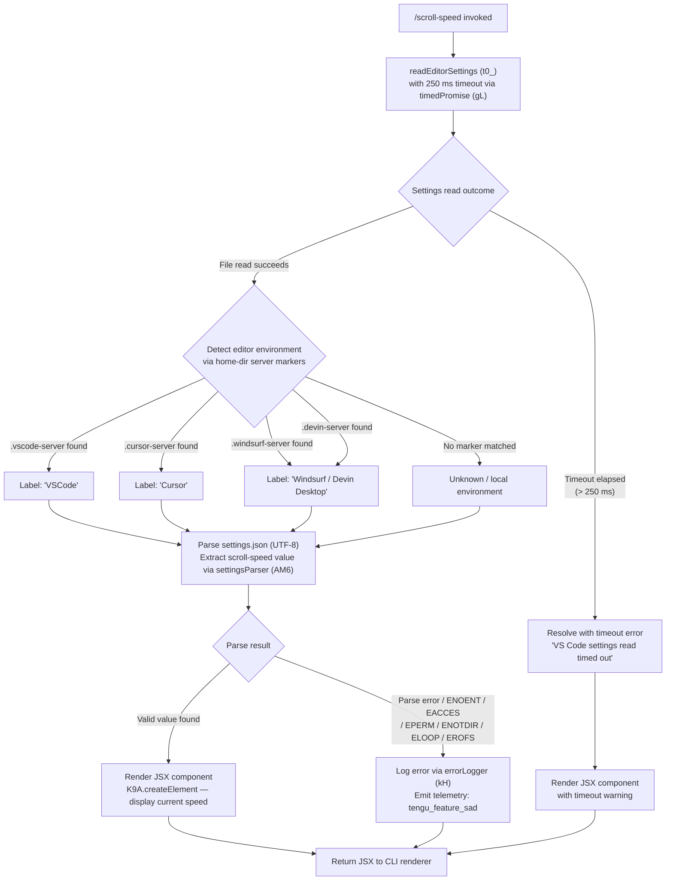

# `/scroll-speed`

> Analysis basis: CC v2.1.162 bundle.js (AST extraction + Claude interpretation)
> Minimum version: v2.1.162

---

## Overview

`/scroll-speed` is a local JSX command that adjusts the mouse wheel scroll speed within the Claude Code terminal UI. It detects the active editor environment (VS Code, Cursor, Windsurf, or Devin Desktop) by inspecting server-directory markers, then reads the host editor's `settings.json` to derive a suitable scroll-speed value, and finally renders a JSX component presenting the result or an adjustment control to the user.

---

## Registration

| Field | Value |
|---|---|
| type | `local-jsx` |
| name | `scroll-speed` |
| description | `Adjust mouse wheel scroll speed` |
| module_id | `waq` |
| load_inline | `true` |
| loc_byte | `12172572` |
| loc_byte_end | `12172820` |
| arbor_handler.name | `dZf` |
| arbor_handler.fqn | `claude-2.1.162::dZf` |
| arbor_handler.kind | `AsyncFunction` |
| arbor_handler.resolution_path | `module_id` |
| arbor_handler.n_hits | `0` |

Analysis basis: CC v2.1.162 bundle.js:+12172572

---

## Input Branching

The command has 4+ distinct execution paths depending on the detected editor environment and the outcome of the settings file read; a Mermaid flowchart is used.



---

## Behavioral Spec

### Main Handler — `dZf` (scrollSpeedHandler)

The handler is an `AsyncFunction` resolved via `module_id → waq` (Arbor resolution path: `module_id`).

```
async function scrollSpeedHandler(context):
    // Race settings read against a 250 ms deadline
    settingsResult = await timedPromise(
        readEditorSettings(context),
        timeoutMs = 250,
        timeoutMessage = "VS Code settings read timed out"
    )

    // Render JSX output regardless of success/failure
    return K9A.createElement(ScrollSpeedComponent, { result: settingsResult })
```

Analysis basis: CC v2.1.162 bundle.js:+12172335, +12172344, +12172348, +12172406

---

### Timed Promise Wrapper — `gL` (timedPromise)

Wraps any promise with a configurable deadline using `Promise.race`.

```
function timedPromise(promise, timeoutMs, timeoutMessage):
    timer = setTimeout(() => rejectWith(timeoutMessage), timeoutMs)
    result = await Promise.race([promise, timeoutPromise])
    clearTimeout(timer)
    return result
```

The timeout value is `0` (zero) as a sentinel for the clearTimeout call site; the actual scroll-speed deadline is `250` ms.

Analysis basis: CC v2.1.162 bundle.js:+2290885, +2290916, +2290963, +2290961, +12172344

---

### Editor Environment Detection — `r48` (detectEditorEnvironment)

Inspects the user's home directory for well-known server subdirectories to determine which editor is hosting the terminal.

```
function detectEditorEnvironment(homePath):
    serverMarkers = [
        { marker: ".vscode-server",   label: "VSCode"  },
        { marker: ".cursor-server",   label: "Cursor"  },
        { marker: ".windsurf-server", label: "Windsurf / Devin Desktop" },
        { marker: ".devin-server",    label: "Devin Desktop" }
    ]

    for each entry in serverMarkers:
        if homePath.includes(entry.marker):
            return entry.label

    return null   // local / unrecognised environment
```

The labels `"VSCode"`, `"Cursor"`, `"Devin Desktop"` and their lowercase counterparts (`"vscode"`, `"cursor"`, `"windsurf"`) are canonical string constants used for display and comparison.

Analysis basis: CC v2.1.162 bundle.js:+4011981, +4012022, +4012052, +4012084, +4016459, +4016444, +4016487, +4016472, +4016517, +4016500

---

### Settings File Reader — `t0_` (readEditorSettings)

Locates and reads the editor's `settings.json` file.

```
async function readEditorSettings(context):
    editorKind = detectEditorEnvironment(homePath)
    settingsPath = pathJoin(configRoot, "settings.json")

    rawText = await fs.readFile(settingsPath, encoding = "utf-8")

    parsed = parseSettingsValue(rawText)   // via settingsParser (AM6)
    normalised = normaliseArray(parsed)    // via arrayNormaliser (s0_)

    return buildResult(editorKind, normalised)  // via resultBuilder (o1)
```

Error codes handled by the error logger: `ENOENT`, `EACCES`, `EPERM`, `ENOTDIR`, `ELOOP`, `EROFS`.

Analysis basis: CC v2.1.162 bundle.js:+4016108, +4016121, +4016155, +4016167, +4016181, +4016188, +4016215, +4016227, +4016236, +4016342, +4016348

---

### Settings Value Parser — `AM6` (settingsParser)

Normalises a raw settings string into a typed value.

```
function settingsParser(rawValue):
    stripped = stripPrefix(rawValue)   // via prefixStripper (Zx)
    typed    = inferType(stripped)     // via typeInferrer (v)
    if typeof typed === "error":
        return { kind: "error", detail: String(typed) }
    return typed
```

`prefixStripper (Zx)` checks `startsWith` and applies `slice` to remove any leading qualifier.

Analysis basis: CC v2.1.162 bundle.js:+1141894, +1141898, +1141921, +1141627, +1141650, +1141978, +1141997

---

### Error Logger — `kH` (errorLogger)

Persists errors to an internal ring buffer and emits them to the log stream.

```
function errorLogger(err, context):
    message  = errorToString(err)       // via stringifyError (t_)
    formatted = formatLogEntry(message) // via logFormatter (tH)

    if ringBuffer (vQ6) is full:
        ringBuffer.shift()   // evict oldest entry
    ringBuffer.push(formatted)

    pushToLogStream(formatted)  // via logPusher (wq / UyA)
    Dr.logError(err)
    emit telemetry "tengu_feature_sad"
```

Analysis basis: CC v2.1.162 bundle.js:+1013597, +1013610, +1013856, +1013939, +1013957, +1013997

---

### Bootstrap Fetch (transitive dependency — `H`)

The call graph includes a bootstrap-fetch utility reached transitively. Its behaviour is:

- Emits `[Bootstrap] Fetching` at start and `[Bootstrap] Fetch ok` on success.
- Sets `Content-Type: application/json` and `User-Agent` headers.
- Uses a `5000` ms network timeout.
- Fires telemetry events `api_bootstrap_fetch` and `parse_failed` on the relevant outcomes.

This utility is **not directly exercised** by `/scroll-speed`; it is present because `readEditorSettings` shares lower-level infrastructure with the bootstrap path.

Analysis basis: CC v2.1.162 bundle.js:+15590991, +15590993, +15591078, +15591093, +15591112, +15591194, +15591315, +15591337, +15591367

---

## State & Side Effects

| Item | Detail |
|---|---|
| Telemetry | `tengu_feature_sad` — fired when settings read or parse fails (bundle.js:+1008376) |
| JSX render | Returns a `K9A.createElement`-based component to the CLI renderer (bundle.js:+12172406) |
| File I/O | Reads `settings.json` (UTF-8) from the detected editor's config directory (bundle.js:+4016155, +4016188) |
| Ring-buffer side effect | On error, the error logger pushes to an internal fixed-size log ring buffer (`vQ6`) and may evict the oldest entry (bundle.js:+1013939, +1013957) |
| External log | `Dr.logError` is called on error paths (bundle.js:+1013997) |
| Timeout | 250 ms hard deadline on the settings read; resolves with message `"VS Code settings read timed out"` on expiry (bundle.js:+12172344, +12172348) |
| appState changes | <!-- TODO: not found in depth-2 traversal; needs --depth 4 --> |
| Sound | <!-- TODO: not found in depth-2 traversal; needs --depth 4 --> |

---

## Version History

| Version | Change |
|---|---|
| v2.1.162 | Initial analysis |

---

## Common Mistakes

1. **Assuming the command modifies system scroll settings directly** — it only reads the editor's `settings.json` and renders a JSX display component; it does not write any configuration.
2. **Expecting the command to work outside a supported editor environment** — if none of the known server-directory markers (`.vscode-server`, `.cursor-server`, `.windsurf-server`, `.devin-server`) are present, the editor label will be `null` and the displayed context may be generic.
3. **Ignoring the 250 ms timeout** — on slow filesystems or heavily loaded environments the settings read may time out, resulting in the `"VS Code settings read timed out"` message instead of an actual speed value.
4. **Treating `tengu_feature_sad` as a fatal crash signal** — it is emitted on any handled error (e.g., missing file, permission denied) and the command will still render a JSX result rather than crashing.
5. **Confusing the bootstrap-fetch path with the command's core logic** — `H` and its children appear in the call graph as shared infrastructure, not as direct contributors to the scroll-speed feature.

---

## Appendix — Identifier Mapping

> For bundle debugging only. Identifiers change across versions.

| Identifier | Role |
|---|---|
| `dZf` | scrollSpeedHandler — main async handler for `/scroll-speed` (Arbor-confirmed, FQN `claude-2.1.162::dZf`) |
| `gL` | timedPromise — wraps a promise with `setTimeout` / `Promise.race` / `clearTimeout` |
| `t0_` | readEditorSettings — locates and reads the editor's `settings.json` |
| `CbL` | settingsPathResolver — resolves the config directory path |
| `r48` | detectEditorEnvironment — checks home-dir markers to identify host editor |
| `H` | bootstrapFetchCore — shared fetch/bootstrap utility (transitive) |
| `v` | typeInferrer — infers a typed value from a raw string |
| `_3` | auxiliaryHelper — role not fully resolved at depth 2 |
| `AY_` | argumentParser — splits/trims/indexes argument strings |
| `LHH` | setMembershipChecker — checks membership via `Y94.has` |
| `bJ` | stringReplacer — applies `replace` to a string |
| `a1` | stringNormaliser — orchestrates `oHH`, `qq`, `rX` helpers |
| `t6` | logSinkWriter — writes to log sink via `c` and `Z6` |
| `AM6` | settingsParser — strips prefix and infers type from raw settings value |
| `Zx` | prefixStripper — removes leading qualifier via `startsWith` / `slice` |
| `s0_` | arrayNormaliser — coerces value to array via `Array.isArray` check |
| `o1` | resultBuilder — constructs the final result object (uses `V8`) |
| `kH` | errorLogger — formats, buffers, and logs errors; emits telemetry |
| `t_` | stringifyError — converts an Error to string |
| `tH` | logFormatter — formats a log entry using `String()` |
| `wq` | logPusher — pushes formatted entry to log stream via `UyA` |
| `UyA` | logStreamWriter — low-level writer using `tH` |
| `Gj4` | ringBufferManager — manages `vQ6` FIFO ring buffer (shift/push) |

---

Note: index built via Arbor fallback; some signals (telemetry, literals) may be missing — see arbor-fallback.js.