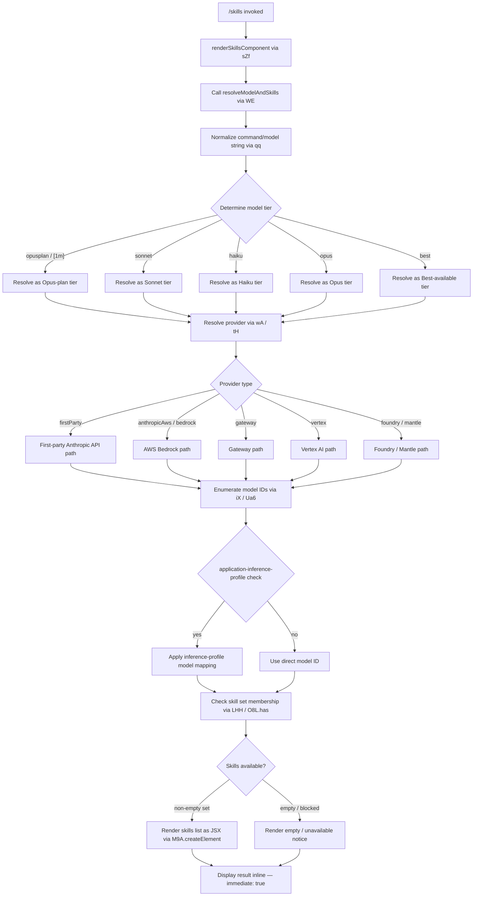

# `/skills`

> Analysis basis: CC v2.1.162 bundle.js (AST extraction + Claude interpretation)
> Minimum version: v2.1.162

---

## Overview

The `/skills` command lists the available skills (capabilities) that Claude Code can use in the current session. It is rendered as a JSX component and executes immediately upon invocation, without requiring additional user input. The command queries internal skill/model routing state and presents the results inline in the conversation UI.

---

## Registration

| Field | Value |
|---|---|
| type | `local-jsx` |
| name | `skills` |
| description | `List available skills` |
| loc_byte | `12182305` |
| loc_byte_end | `12182437` |
| loc_line | `8490` |
| immediate | `true` |
| module_id | `yaq` |
| load_inline | `true` |
| arbor_handler.name | `sZf` |
| arbor_handler.fqn | `claude-2.1.162::sZf` |
| arbor_handler.kind | `AsyncFunction` |
| arbor_handler.resolution_path | `module_id` |
| arbor_handler.n_hits | `0` |

Analysis basis: CC v2.1.162 bundle.js:+12182305

---

## Input Branching

The handler involves multiple distinct branches driven by model routing, provider type, and skill availability checks. A Mermaid flowchart is used.



Analysis basis: CC v2.1.162 bundle.js:+12182120 (JSX render), +12182194 (model/skill resolution entry), +2238643 (skill-set membership check)

---

## Behavioral Spec

### 1. Command Entry — `skillsHandler` (`sZf`)

The handler is an `AsyncFunction` resolved via the `yaq` module export.

```
async function skillsHandler(context):
    // Render output as a JSX element
    element = createElement(SkillsView, { context })

    // Delegate model + skill resolution
    skillData = await resolveModelAndSkills(context)

    return element populated with skillData
```

Analysis basis: CC v2.1.162 bundle.js:+12182120, +12182194

---

### 2. Model/Skill Resolution — `resolveModelAndSkills` (`WE`)

Entry point that chains two sub-steps: command normalization (`qq`) and model-ID resolution (`K9`), then checks the skill membership set.

```
async function resolveModelAndSkills(context):
    normalizedCmd = normalizeCommandString(context.rawInput)   // qq
    modelEntry    = resolveModelEntry(normalizedCmd)           // K9

    hasSkill = skillSetContains(modelEntry)                    // O8L.has
    return { modelEntry, hasSkill }
```

Analysis basis: CC v2.1.162 bundle.js:+2238579, +2238587, +2238643

---

### 3. Command-String Normalization — `normalizeCommandString` (`qq`)

Trims, lower-cases, and maps user-facing aliases to canonical tier identifiers.

```
function normalizeCommandString(raw):
    s = raw.trim().toLowerCase()

    // Alias / tier detection (order matters)
    if s contains "opusplan" or "[1m]":   return TIER_OPUS_PLAN
    if s contains "sonnet":               return TIER_SONNET
    if s contains "haiku":                return TIER_HAIKU
    if s contains "opus":                 return TIER_OPUS
    if s contains "best":                 return TIER_BEST

    // Boolean-flag normalization (yes / on → true)
    s = applyBooleanNormalization(s)      // tH / fQH
    s = applyReplacementRules(s)          // _.replace

    return s
```

Analysis basis: CC v2.1.162 bundle.js:+2240374, +2240385, +2240403, +2240449, +2240488, +2240511, +2240550, +2240565, +2240603, +2240626, +2240640, +2240658, +2240664, +2240716

Boolean normalizer recognizes the literals `"yes"` (bundle.js:+27104) and `"on"` (bundle.js:+27110).

---

### 4. Model-Entry Resolution — `resolveModelEntry` (`K9`)

Looks up the canonical model ID from the normalized tier string, checks for an inference-profile prefix, and applies any necessary string replacement.

```
function resolveModelEntry(tier):
    // Build full model-ID table via Ua6 (Object.entries over model registry)
    modelTable = buildModelTable()         // Ua6 / i_ / Object.entries

    // Candidate lookup via iX
    candidate = findModelByTier(tier, modelTable)   // iX
    //   - toLowerCase + includes check on model ID string
    //   - replace pass for normalization

    // Check for "application-inference-profile" prefix (literal at +2238461)
    if candidate.id includes "application-inference-profile":
        candidate = applyInferenceProfileMapping(candidate)  // kg8

    // Boolean / string cleanup
    candidate = applyStringCleanup(candidate)   // bJ / H.replace

    // Depth limit: maximum 4 resolution hops (literal 4 at +2238571)
    if hopCount > 4: break

    return candidate
```

Analysis basis: CC v2.1.162 bundle.js:+2238418, +2238441, +2238450, +2238461, +2238501, +2238505, +2238571

---

### 5. Provider-Type Routing — `resolveProvider` (`wA` / `tH`)

Determines which back-end provider serves the resolved model. The provider string is mapped to one of the known literals.

```
function resolveProvider(modelEntry):
    raw = fetchProviderString(modelEntry)   // tH → String coercion

    switch raw:
        case "firstParty":     return PROVIDER_FIRST_PARTY   // +2094569
        case "anthropicAws":   return PROVIDER_AWS           // +2094587
        case "gateway":        return PROVIDER_GATEWAY       // +2094607
        case "bedrock":        return PROVIDER_BEDROCK       // +2093914
        case "foundry":        return PROVIDER_FOUNDRY       // +2093964
        case "mantle":         return PROVIDER_MANTLE        // +2094074
        case "vertex":         return PROVIDER_VERTEX        // +2094122
        default:               return PROVIDER_UNKNOWN
```

Analysis basis: CC v2.1.162 bundle.js:+2094552, +2093874, +2093914, +2093964, +2094074, +2094122

---

### 6. Model-ID Table Construction — `buildModelTable` (`Ua6`)

Iterates over the internal model registry and returns a flat map of tier → model-ID entries. Model IDs present in the bundle include:

| Canonical ID (literal) | loc_byte |
|---|---|
| `claude-opus-4-8` | +2237436 |
| `claude-opus-4-7` | +2237493 |
| `claude-opus-4-6` | +2237550 |
| `claude-opus-4-5` | +2237607 |
| `claude-opus-4-1` | +2237664 |
| `claude-opus-4-0` | +2237753 |
| `claude-sonnet-4-6` | +2237785 |
| `claude-sonnet-4-5` | +2237846 |
| `claude-sonnet-4-0` | +2237941 |
| `claude-haiku-4-5` | +2237975 |
| `claude-3-7-sonnet` | +2238034 |
| `claude-3-5-sonnet` | +2238095 |
| `claude-3-5-haiku` | +2238156 |
| `claude-3-opus` | +2238215 |
| `claude-3-sonnet` | +2238268 |
| `claude-3-haiku` | +2238325 |

Analysis basis: CC v2.1.162 bundle.js:+2095840, +2095905

---

### 7. Bootstrap Fetch (background, `H` / `_3` / `AY_`)

Certain skill metadata may be resolved from a bootstrap API fetch. This is an async side-path, not blocking the JSX render.

```
async function bootstrapFetch(url):
    log("[Bootstrap] Fetching", url)          // literal at +15590993

    headers = {
        "Content-Type": "application/json",   // +15591078, +15591093
        "User-Agent":    USER_AGENT_STRING     // +15591112
    }

    response = await fetch(url, { headers, timeout: 5000 })   // timeout: +15591194

    if parse fails:
        emitTelemetry("api_bootstrap_fetch", { status: "parse_failed" })
        // literals at +15591315, +15591337
        return null

    log("[Bootstrap] Fetch ok")               // +15591367
    return parsed
```

Analysis basis: CC v2.1.162 bundle.js:+15590991, +15591029, +15591125, +15591133, +15591164, +15591176, +15591194, +15591312

---

### 8. Skill-Set Membership Check (`LHH` / `O8L.has`)

```
function isSkillAvailable(skillKey, context):
    // LHH: checks a known-skills Set (Y94)
    if knownSkillsSet.has(skillKey):         // Y94.has at +842246
        return true

    // O8L: checks a secondary availability Set
    return availabilitySet.has(skillKey)     // O8L.has at +2238643
```

Analysis basis: CC v2.1.162 bundle.js:+842246, +2238643

---

### 9. Telemetry Event — `tengu_feature_sad`

Fired when a skill or feature dependency reports a degraded / sad state. Triggered inside `t6` (depth-2 from `WE`).

```
function reportFeatureState(featureId, state):
    if state == DEGRADED:
        emit("tengu_feature_sad", { featureId })   // +1008376
```

Analysis basis: CC v2.1.162 bundle.js:+1008376

---

## State & Side Effects

| Item | Detail |
|---|---|
| Telemetry | `tengu_feature_sad` (bundle.js:+1008376) — emitted when a skill dependency is in a degraded state |
| Bootstrap fetch | Optional background HTTP fetch with 5 000 ms timeout (bundle.js:+15591194); sends `Content-Type: application/json` and `User-Agent` headers |
| Skill-set membership | Reads two internal `Set` objects (`Y94`, `O8L`) — no writes observed at depth ≤ 2 |
| appState changes | <!-- TODO: not found in depth-2 traversal; needs --depth 4 --> |
| Sound | None observed in traversal |
| Hook registration | None observed in traversal |
| `immediate` flag | Set to `true`; command executes without waiting for further user input (bundle.js:+12182305) |

---

## Version History

| Version | Change |
|---|---|
| v2.1.162 | Initial analysis |

---

## Common Mistakes

1. **Expecting text output instead of JSX** — `/skills` is registered as `local-jsx`, so its output is a rendered React component, not a plain text message. Piping or capturing the raw output will yield a component tree, not a string list.
2. **Assuming a static model list** — The skill/model table is constructed dynamically at runtime from the internal registry (`Ua6` / `Object.entries`). The 16 model IDs observed are those present in v2.1.162; future versions may add or remove entries.
3. **Confusing provider with tier** — The command distinguishes _model tier_ (opus, sonnet, haiku, best) from _provider_ (firstParty, bedrock, vertex, gateway, foundry, mantle). A skill may be available for a tier on one provider but not another.
4. **Ignoring the inference-profile prefix** — Model IDs prefixed with `application-inference-profile` undergo an extra mapping step (`kg8`). Hardcoding model IDs that skip this step will produce incorrect results on AWS deployments.
5. **Treating `tengu_feature_sad` as an error** — This telemetry event signals a degraded dependency, not a fatal failure. The command may still render partial skill data after emitting this event.

---

## Appendix — Identifier Mapping

> For bundle debugging only. Identifiers change across versions.

| Identifier | Role |
|---|---|
| `sZf` | Main handler (`skillsHandler`) — AsyncFunction, resolved via module `yaq` |
| `WE` | Model and skill resolution coordinator (`resolveModelAndSkills`) |
| `qq` | Command-string normalizer — trims, lower-cases, maps tier aliases |
| `H` | Bootstrap / HTTP fetch utility (wraps fetch with headers + timeout) |
| `v` | Debug-mode logger / string formatter (emits `"debug"` level messages) |
| `_3` | Bootstrap fetch sub-helper (called from `H`) |
| `AY_` | String splitter/trimmer for bootstrap response parsing |
| `LHH` | Known-skills set membership checker (uses `Y94` Set) |
| `bJ` | String replacement utility for model-ID cleanup |
| `a1` | Composite normalization helper (chains `oHH`, `qq`, `rX`) |
| `t6` | Feature-state reporter; fires `tengu_feature_sad` telemetry |
| `Q0` | Boolean-normalization dispatcher (delegates to `BKH` / `tH`) |
| `BKH` | Low-level boolean-string converter (used by `Q0`) |
| `A` | String-lowercasing wrapper (delegates to `f.toLowerCase`) |
| `f` | Connection/channel close helper (unrelated to skills display) |
| `pKH` | Inclusion-list checker (uses `mKH` array) |
| `qI` | Skill/model aggregator (chains `UM` + `G5`) |
| `UM` | Provider-type first-pass resolver (delegates to `wA`) |
| `G5` | Detailed model-resolution worker (`RmH`, `yt4`, `v51`, `pa6`, `wA`) |
| `LQH` | Alternative skill-list resolver (delegates to `G5`) |
| `PE` | Composite resolver combining `UM`, `G5`, and `wA` |
| `wA` | Provider-string mapper — maps raw provider to known constants via `tH` |
| `RJ1` | Best-model resolver (delegates to `PE`) |
| `Xt6` | Availability-set checker (uses `z8L` array includes) |
| `fQH` | Boolean-literal normalizer (`yes`/`on` → true, via `tH`) |
| `tH` | Core string coercion / boolean converter (`String(...)`) |
| `K9` | Model-entry resolver — lookup, inference-profile check, cleanup |
| `Ua6` | Model-registry iterator (`Object.entries` over registry map) |
| `i_` | Registry accessor helper (uses `_U`) |
| `iX` | Model-ID matcher — toLowerCase + includes + replace on candidate IDs |
| `kg8` | Inference-profile model-ID mapper (handles `application-inference-profile` prefix) |

---

Note: index built via Arbor fallback; some signals (telemetry, literals) may be missing — see arbor-fallback.js.