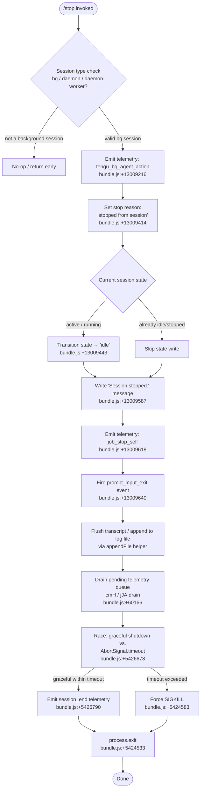

# `/stop`

> Analysis basis: CC v2.1.162 bundle.js (AST extraction + Claude interpretation)
> Minimum version: v2.1.162

---

## Overview

The `/stop` command terminates the current background session (a `bg`, `daemon`, or `daemon-worker` session type) while deliberately preserving both the session transcript and any associated worktree on disk. It is an immediate, locally-handled command — it does not send a prompt to the AI model. Upon invocation it transitions the session to an idle/stopped state, flushes pending output, drains any queued telemetry, and then exits the process.

---

## Registration

| Field | Value |
|---|---|
| type | `local-jsx` |
| name | `stop` |
| description | `Stop this background session; transcript and worktree are kept` |
| loc_byte | `13010086` |
| loc_byte_end | `13010270` |
| loc_line | `9555` |
| immediate | `true` |
| module_id | `vLK` |
| load_inline | `true` |
| arbor_handler.name | `Kuf` |
| arbor_handler.fqn | `claude-2.1.162::Kuf` |
| arbor_handler.kind | `AsyncFunction` |
| arbor_handler.resolution_path | `module_id` |
| arbor_handler.n_hits | `0` |

Analysis basis: CC v2.1.162 bundle.js:+13010086

---

## Input Branching

The `/stop` flow has more than three distinct branching paths (session-type guard → action dispatch → state write → output flush → process exit), so a Mermaid flowchart is used.



---

## Behavioral Spec

### 1. Handler Entry — `stopCommandHandler` (Kuf)

Analysis basis: CC v2.1.162 bundle.js:+13009805 / +13009815

```
async function stopCommandHandler(context):
    emit telemetry(tengu_bg_agent_action)          // +13009216
    sessionType = lookupSessionType(context)       // T9 / szH: checks "bg","daemon","daemon-worker"
    if sessionType not in ["bg","daemon","daemon-worker"]:
        return                                     // guard: not a background session

    sessionHandle = getSessionHandle(context)      // Hq path via IC8
    updateSessionStatus(sessionHandle, reason="stopped from session", newState="idle")
    writeStatusMessage("Session stopped.")         // d1H +13009583/+13009587
    emit telemetry(job_stop_self)                  // hH +13009615/+13009618
    triggerEvent("prompt_input_exit")              // f9 +13009635/+13009640
    emit telemetry(stop_command)                   // +13009819
    beginShutdownSequence(context)
```

### 2. Session-State Update — `sessionStateWriter` (IC8)

Analysis basis: CC v2.1.162 bundle.js:+13009368 / +13009380

```
function sessionStateWriter(sessionHandle, reason, newState):
    currentState = readSessionState(sessionHandle)   // iD/eV/WwH: reads state field
    if currentState in ["done","success","failed","failure","stopped"]:
        return                                        // terminal state; no overwrite
    writeStateAtomic(sessionHandle, {
        state: newState,          // "idle" +13009443
        stopReason: reason,       // "stopped from session" +13009414
    })                            // ff/ez: randomBytes → writeFile → rename (atomic swap)
    invalidateCachedEntry(sessionHandle)             // iJ/mLH.delete
```

### 3. Transcript / Log Flush — `transcriptFlusher` (EgK)

Analysis basis: CC v2.1.162 bundle.js:+205306 / +205339 / +205513

```
function transcriptFlusher(sessionDir, messages):
    logDir = path.dirname(sessionDir)               // Qe.dirname +205339
    ensureLogDir(logDir)                            // GgK/jy.mkdir +205060
    byteLen = Buffer.byteLength(serializedMessages) // +205513

    if existingFile and existingFile.endsWith(".txt"):
        if fileExceedsRotationThreshold:
            renameFile(existing → rotated)          // HPA/jy.rename +204817
            unlinkOld()                             // jy.unlink +204857
    appendToLog(logDir, serializedMessages)         // GgK/jy.appendFile +205119
    updateFileSizeMetadata(byteLen)                 // qPA +205546
    registerShutdownHook()                          // J9/jJA.register +60123
```

The rotation threshold uses the `.txt` extension check (bundle.js:+204765) and a slice offset of `4` characters (bundle.js:+204787).

### 4. Graceful Shutdown Sequence — `gracefulShutdown` (f9)

Analysis basis: CC v2.1.162 bundle.js:+5426296 / +5426513 / +5426678

```
async function gracefulShutdown(context):
    renderFinalOutput()                      // ckH: unmount Ink UI, writeSync final frame
    displaySessionSummary()                  // Ry_: replaceAll path chars, dim formatting
    emitScrollSummary()                      // S38 / tengu_scroll_summary +5425682
    emitStartupPerfIfNeeded()                // yL6 / tengu_startup_perf

    shutdownTimer = setTimeout(forceKill, 3500)   // +5426400 — 3500 ms hard deadline
    shutdownTimer.unref()                          // NjH.unref +5426409

    // Wait for all settled async tasks
    await allSettledWithTimeout(
        pendingTasks,
        AbortSignal.timeout(2000)            // +5426678 / +5426578
    )

    clearTimeout(shutdownTimer)              // +5426590
    drainTelemetryQueue()                    // cmH/jJA.drain +60166
    emit session_end telemetry               // +5426790
    processExit()                            // Cy_/process.exit +5424533
```

Hard shutdown deadline: **3500 ms** (bundle.js:+5426400).  
Abort-signal timeout: **2000 ms** (bundle.js:+5426578).

### 5. Force-Kill Path — `forceKillProcess` (Cy_)

Analysis basis: CC v2.1.162 bundle.js:+5424452 / +5424533 / +5424558 / +5424583

```
function forceKillProcess():
    clearTimeout(pendingTimer)
    renderMap = i4.get(renderKey)           // retrieve active render handles
    if renderMap exists:
        process.exit(code)                  // +5424533
    else:
        process.kill(pid, "SIGKILL")        // +5424558 / +5424583
    throw Error("unreachable")              // +5424606 — defensive guard
```

### 6. Session Handle Resolution — `resolveSessionHandle` (Hq)

Analysis basis: CC v2.1.162 bundle.js:+4143207 / +4143292 / +4143459

```
async function resolveSessionHandle(sessionId, baseDir):
    filePath = path.join(baseDir, sessionId)    // G2.join +4143207
    [statResult] = await Promise.all([
        fs.stat(filePath),                      // W2.stat +4143305
    ])
    if error.code == "ENOENT":                  // +175405
        cache.delete(sessionId)                 // mLH.delete +4143459
        return null
    if error.code == "EISDIR":                  // +175445
        logWarning("warn")
        return null
    raw = await fs.readFile(filePath, "utf-8")  // +4143855 / +4143869
    parsed = safeJsonParse(raw)                 // p6/JSON.parse +185715
    cache.set(sessionId, parsed)                // mLH.set +4144121
    return parsed
```

Fields `order` (bundle.js:+4143234) and `stateOrder` (bundle.js:+4143255) are used when sorting/comparing session entries from the cache.

### 7. Bootstrap / Config Fetch — `bootstrapFetch` (H)

Analysis basis: CC v2.1.162 bundle.js:+15590991 / +15591078 / +15591194

```
async function bootstrapFetch(url):
    log("[Bootstrap] Fetching", url)          // +15590993
    response = await fetch(url, {
        headers: {
            "Content-Type": "application/json",   // +15591078 / +15591093
            "User-Agent": userAgentString,         // +15591112
        },
        timeout: 5000,                             // +15591194 (5 000 ms)
    })
    if not ok:
        emit telemetry(api_bootstrap_fetch, status="parse_failed")  // +15591315 / +15591337
        return null
    log("[Bootstrap] Fetch ok")                // +15591367
    return parseResponse(response)
```

---

## State & Side Effects

| Item | Detail |
|---|---|
| Telemetry | `tengu_bg_agent_action` (+13009216), `tengu_bg_state_read_transient` (+4143655), `tengu_scroll_summary` (+5425682), `tengu_cache_eviction_hint` (+5426752), `tengu_startup_perf` (+216816), `tengu_feature_ok` (+1008233), `tengu_feature_sad` (+1008376), `tengu_daemon_config_reload` (+16011003), `tengu_pewter_brook` (+3425310) |
| Session state write | Transitions session from `active` → `idle`; stop reason set to `"stopped from session"` (bundle.js:+13009414 / +13009443) |
| Transcript retention | Transcript and worktree are **kept** on disk; only the live session handle is closed (per description and `jy.appendFile` path) |
| Atomic state file | State written via `randomBytes` temp file → `writeFile` → `rename` to avoid torn writes (bundle.js:+2280785 / +2280832 / +2280886) |
| Process exit | `process.exit` is called after drain; SIGKILL fallback after 3500 ms hard deadline (bundle.js:+5426400 / +5424583) |
| Ink UI unmount | `H.unmount` called to tear down the terminal UI before final frame write (bundle.js:+5423946) |
| Shutdown hook | `jJA.register` hook registered during transcript flush (bundle.js:+60123); `jJA.drain` called at shutdown (bundle.js:+60166) |
| Cache invalidation | Session entry removed from in-memory LRU map (`mLH.delete`) after state write (bundle.js:+4143459 / +4143166) |
| Sound | <!-- TODO: not found in depth-2 traversal; needs --depth 4 --> |

---

## Version History

| Version | Change |
|---|---|
| v2.1.162 | Initial analysis |

---

## Common Mistakes

1. **Running `/stop` in a non-background session** — The command is guarded by a session-type check (`"bg"`, `"daemon"`, `"daemon-worker"`). Invoking it in a foreground interactive session is a no-op; no confirmation is shown.
2. **Expecting data deletion** — The description explicitly states "transcript and worktree are kept." Users who expect `/stop` to clean up disk resources must use a separate cleanup mechanism.
3. **Assuming instant exit** — The shutdown sequence races graceful cleanup against a **3500 ms** hard timeout. Scripts that depend on the process being gone immediately after the command returns may see a brief delay.
4. **Confusing `/stop` with process kill** — `/stop` transitions session state and then exits; it is not equivalent to sending SIGTERM externally. The SIGKILL path (`process.kill(pid, "SIGKILL")`) is only the last-resort fallback.
5. **Invoking while state is already terminal** — If the session is already in `done`, `success`, `failed`, `failure`, or `stopped` state, the state-write step is skipped silently; the command will still proceed to the shutdown sequence.

---

## Appendix — Identifier Mapping

> For bundle debugging only. Identifiers change across versions.

| Identifier | Role |
|---|---|
| `Kuf` | Main `/stop` command handler (AsyncFunction; arbor_handler) |
| `IC8` | Session-stop inner implementation; orchestrates state write, message, telemetry |
| `H` | Bootstrap fetch helper; also referenced as generic session/stream handle context |
| `v` | HTTP response / stream processing utility |
| `PgK` | Request parameter builder |
| `PJA` | Parameter assembly helper (calls `GUK`, `EUK`) |
| `SH` | JSON serialization wrapper (`JSON.stringify`) |
| `V4` | Path/string manipulation utility (extension extraction, slicing) |
| `rXA` | Array map helper for path segments (`YgK.map`) |
| `q` | File unlink / set / statSync utility |
| `A` | Lowercase / lastIndexOf / slice string utility |
| `WpH` | Write helper dispatcher |
| `pXA` | Low-level stream write wrapper (`H.write`) |
| `EgK` | Transcript flush and log rotation orchestrator |
| `dmH` | Debounced/batched flush helper (uses `clearTimeout` / `setTimeout` / `setImmediate`) |
| `E3H` | Log entry formatter/writer (`_p6`, `s8`, `S6`) |
| `i6` | Directory existence / creation check |
| `zL6` | Error-code classifier (calls `V8`) |
| `_PA` | Path join + write helper (`Qe.join`, `S6`) |
| `HPA` | File rotation handler (`jy.stat`, `jy.rename`, `jy.unlink`) |
| `GgK` | Append-file writer with size tracking (`jy.mkdir`, `jy.appendFile`) |
| `J9` | Shutdown hook registrar (`jJA.register`) |
| `_3` | Session context extractor |
| `AY_` | Argument string splitter/trimmer |
| `LHH` | Feature-flag / capability lookup (`Y94.has`) |
| `bJ` | String sanitizer / replacer |
| `a1` | Model alias resolver (calls `oHH`, `qq`, `rX`) |
| `oHH` | Model metadata lookup (`k0`, `OqH`, `yA`, `Dd`) |
| `Dd` | Model descriptor parser (trims, checks prefixes, includes, etc.) |
| `qq` | Model identifier normaliser (toLowerCase, replace, classify) |
| `Q0` | Model tier mapper (`BKH`) |
| `pKH` | Inclusion check against known model list (`mKH.includes`) |
| `qI` | Model capability tester (`UM`, `G5`) |
| `LQH` | Alternative model capability tester (`G5`) |
| `PE` | Provider resolver (`UM`, `G5`, `wA`) |
| `RJ1` | Re-export / wrapper around `PE` |
| `UM` | Provider utility (`wA`) |
| `Xt6` | Model-list inclusion check (`z8L.includes`) |
| `fQH` | Feature-flag string builder (`tH`) |
| `rX` | Model alias chain resolver (calls `qq`, `g0`) |
| `g0` | Full model resolution pipeline (`WA`, `H6H`, `ozH`, `MQH`, `PE`, `A2`, `UM`, `wA`, `G5`, `qI`) |
| `t6` | Telemetry feature event emitter (`c`, `Z6`) |
| `c` | Base telemetry emitter |
| `Z6` | Telemetry event dispatcher (`Zx6`) |
| `Zx6` | Low-level telemetry sink |
| `E6` | Error-event telemetry helper (`Zx6`) |
| `S6` | File-write helper (`Nv`) |
| `Nv` | Underlying write implementation |
| `quf` | Session stop-reason constant holder |
| `T9` | Session-type classifier (`szH`) |
| `szH` | Session type constants (`"bg"`, `"daemon"`, `"daemon-worker"`) |
| `Hq` | Session handle resolver (stat → readFile → JSON parse → cache) |
| `R8` | Error-code extractor wrapper (`V8`) |
| `V8` | Error property accessor |
| `rf` | Secondary error-code extractor (`V8`) |
| `p6` | Safe JSON parse wrapper (`JSON.parse`) |
| `iD` | Session state reader (`eV`) |
| `eV` | State field accessor (`WwH`) |
| `WwH` | Raw state object reader |
| `ff` | Atomic state file writer (calls `ez`, `G2.join`, `SH`, `iJ`) |
| `ez` | Atomic write via temp-file rename (`wf_.randomBytes`, `q6H.writeFile`, `q6H.rename`) |
| `iJ` | Cache-entry invalidator (`mLH.delete`) |
| `yt6` | Post-stop cleanup step |
| `d1H` | Status message writer (`"Session stopped."`) |
| `hH` | `job_stop_self` telemetry emitter |
| `f9` | Graceful shutdown sequence orchestrator |
| `K` | Active-connection map iterator / padEnd formatter |
| `L` | Connection lifecycle manager (add/delete/finally) |
| `f` | Individual connection handle (close channels) |
| `ckH` | Terminal UI teardown (unmount Ink, writeSync final frame) |
| `LC` | Final-frame renderer |
| `uK8` | Terminal output writer (`io.writeSync`, ANSI save/restore) |
| `Ry_` | Session summary display (path replacement, dim formatting) |
| `rG` | Session summary data accessor |
| `Hx` | Summary renderer helper |
| `NW6` | Worktree path resolver (`DY.join`, `q.statSync`) |
| `g$` | Worktree status helper (`S6`, `U4`) |
| `IE9` | Summary string formatter |
| `Cy_` | Force-kill executor (`process.exit`, `process.kill`, SIGKILL) |
| `cmH` | Telemetry queue drainer (`jJA.drain`) |
| `D` | Supervisor/worker lifecycle manager (stop/updateConfig/start) |
| `Y0H` | Worker registry updater (`V9`, `V8`, `k4A`, `TH`, `b9`, `I4A`) |
| `OKK` | Worker slot calculator (`Object.keys`, `Math.max`, `TY`) |
| `E` | Remote-control event handler (`preventDefault`, `c0`, `D`, `H`) |
| `Z` | Supervisor controller (stop/updateConfig/start methods) |
| `xCK` | Heartbeat emitter (`d6H`) |
| `V` | Worker process handle (`V.start`) |
| `uE9` | All-settled async task collector (`Promise.allSettled`, `Array.from`) |
| `yL6` | Startup profiling reporter (`Zd8`, `XPA`) |
| `Zd8` | Profiling data serialiser (`TPA`, `c`) |
| `XPA` | Profiling report writer (`GPA`, `vL6.dirname`, `i6`, `JSON.stringify`, `TPA`, `K.map`, `v`) |
| `S38` | Scroll/session summary emitter (`rG`, `vE9`, `c`, `NE9`, `M1`) |
| `NE9` | Session metrics calculator (`Date.now`, `Math.max`, `Math.round`, `Object.assign`, `ZE9`) |
| `M1` | Local-agent UI renderer (`LHH`, `pX_`, `ko`, `v`, `mX_`, `i_`, `XEL`, `j6`) |
| `pK6` | Post-shutdown cleanup hook |
| `R38` | Async task race helper (`Promise.all`, `Promise.resolve`, `Promise.race`, `mV`, `cd`, `n8`) |
| `n8` | Timeout-based abort wrapper (`Error`, `setTimeout`, `clearTimeout`, `L.unref`) |

---

Note: index built via Arbor fallback; some signals (telemetry, literals) may be missing — see arbor-fallback.js.