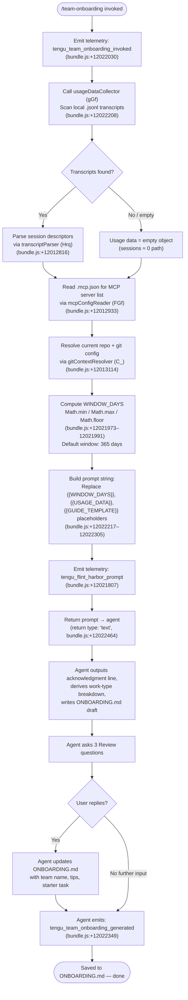

# `/team-onboarding`

> Analysis basis: CC v2.1.162 bundle.js (AST extraction + Claude interpretation)
> Minimum version: v2.1.162

---

## Overview

`/team-onboarding` is a `prompt`-type slash command that analyzes the invoking user's local Claude Code session transcripts (up to the last 365 days) and co-authors a structured `ONBOARDING.md` guide for teammates who are new to Claude Code. The command gathers usage data — session descriptors, MCP server configuration, and repository context — injects it into a prompt sent to the agent, and then collaboratively refines the resulting guide with the user across multiple turns.

---

## Registration

| Field | Value |
|---|---|
| type | `prompt` |
| name | `team-onboarding` |
| description | `Help teammates ramp on Claude Code with a guide from your usage` |
| isHidden | `false` |
| handler_method | `getPromptForCommand` |
| handler_method_start (loc_byte) | `12021770` |
| handler_method_end (loc_byte) | `12022480` |
| loc_byte | `12021432` |
| loc_byte_end | `12022481` |
| loc_line | `8342` |
| prompt_body.length | `4539` characters |
| prompt_body.trace | `identifier→$ (local→1 ext vars)` |
| arbor_handler.name | `getPromptForCommand` |
| arbor_handler.fqn | `claude-2.1.162::getPromptForCommand` |
| arbor_handler.kind | `Method` |
| arbor_handler.resolution_path | `direct` |
| arbor_handler.n_hits | `2` |
| `handler_method_start` | `12021770` |
| `handler_method_end` | `12022480` |

Analysis basis: CC v2.1.162 bundle.js:+12021432

---

## Input Branching

The handler applies 4+ distinct transformations and branches before producing the final prompt string, warranting a Mermaid flowchart.



---

## Behavioral Spec

### 1. Handler Entry — `getPromptForCommand`

The Arbor-resolved handler is `getPromptForCommand`, a Method on the registration object, confirmed at resolution_path `direct` with `n_hits: 2`.

Analysis basis: CC v2.1.162 bundle.js:+12021770

```
function getPromptForCommand(context):
    emit telemetry("tengu_team_onboarding_invoked")

    windowDays = computeWindowDays(rawDays=365)   // Math.min/max/floor applied
    usageData  = collectUsageData(context)
    prompt     = buildPromptString(windowDays, usageData)

    emit telemetry("tengu_flint_harbor_prompt")
    return { type: "text", content: prompt }
```

Analysis basis: CC v2.1.162 bundle.js:+12021770–12022480

---

### 2. Window Calculation

Three math operations clamp and floor the look-back window before it is substituted into the prompt template.

```
function computeWindowDays(rawDays):
    clamped = Math.min(rawDays, upperBound)
    clamped = Math.max(clamped, lowerBound)
    return Math.floor(clamped)
```

- The literal `365` appears at bundle.js:+12022019 and is the default raw value passed in.
- `Math.min` at +12021973, `Math.max` at +12021982, `Math.floor` at +12021991.

The computed integer is injected via `String(windowDays)` (bundle.js:+12022248) and then substituted for every `{{WINDOW_DAYS}}` placeholder in the prompt body using `replaceAll` (bundle.js:+12022217).

---

### 3. Usage Data Collection — `usageDataCollector` (`gGf`)

This function is the primary data-gathering pipeline. It resolves the user's project transcript directory, enumerates `.jsonl` files written in the last `windowDays` days, and extracts structured session information.

Analysis basis: CC v2.1.162 bundle.js:+12022208

```
async function usageDataCollector(windowDays):
    projectsPath = resolveProjectsPath()            // Ex + mv utilities
    transcriptDir = resolveTranscriptDir(projectsPath)

    cutoffMs = Date.now() - (windowDays * 24 * 60 * 1000)
    // constants: 24, 60, 1000 at +12010268/+12010271/+12010277

    files = await readdir(transcriptDir)
    jsonlFiles = files.filter(f => extname(f) == ".jsonl")  // +12010383
    // Filter to files modified after cutoffMs via stat()

    sessions = await Promise.all(
        jsonlFiles.map(async file =>
            parseTranscript(join(transcriptDir, file))
        )
    )
    return aggregateSessionData(sessions)
```

---

### 4. Transcript Parsing — `transcriptParser` (`Hrq`)

Each `.jsonl` file is read and parsed line-by-line to extract session metadata.

Analysis basis: CC v2.1.162 bundle.js:+12012816

```
async function parseTranscript(filePath):
    raw = await readFile(filePath, "utf8")    // +12010639
    lines = raw.split("\n")                   // +12010753; limit 10 lines scanned +12010779

    sessionData = {
        title: null,
        prNumbers: [],
        firstUserMessage: null,
        toolCounts: {},
        mcpCounts: {}
    }

    for line in lines:
        if line.includes('"name":"mcp__'):    // +12010962
            // extract MCP tool call counts

        match = uGfRegex.exec(line)           // session title extractor +12011103
        if match: sessionData.title = match[1]

        match = mGfRegex.exec(line)           // PR number extractor +12011159
        if match: sessionData.prNumbers.push(Number(match[1]))

        // "\"content\":[" sentinel for first user message +12011312
        if line startswith sentinelPrefix (3 chars guard +12011415):
            if line.startsWith(userRoleMarker):  // +12011419
                sessionData.firstUserMessage = line.slice(offset)  // +12011452

    return sessionData
```

---

### 5. MCP Config Reader — `mcpConfigReader` (`FGf`)

Reads the project-local `.mcp.json` file to enumerate configured MCP servers.

Analysis basis: CC v2.1.162 bundle.js:+12012470

```
async function mcpConfigReader(projectRoot):
    configPath = join(projectRoot, ".mcp.json")   // literal +12012494
    try:
        raw = await readFile(configPath, "utf8")   // encoding +12012507
        parsed = JSON.parse(raw)                   // via p6 +12012517
        servers = parsed["mcpServers"] ?? {}       // key literal +12012550
        return sanitizeMcpEntries(servers)         // R8 / v +12012646/+12012652
    except ENOENT:
        return {}
    except parseError:
        return String(fallbackValue)               // +12012729
```

---

### 6. Git Context Resolver — `gitContextResolver` (`C_`)

Runs `git config user.name` and `git remote get-url origin` to populate the `generatedBy` name and the repository URL for the guide.

Analysis basis: CC v2.1.162 bundle.js:+12013114

```
async function gitContextResolver(cwd):
    userName = await runCommand("git", ["config", "user.name"], cwd)
    // literals: "git" +12013117, "config" +12013124, "user.name" +12013133

    remoteUrl = await runCommand("git", ["remote", "get-url", "origin"], cwd)
    // literals: "remote" +12013189, "get-url" +12013198, "origin" +12013208

    repoName = basename(remoteUrl ?? cwd)   // ph8.basename +12013305
    return { generatedBy: userName, currentRepo: repoName, remoteUrl }
```

The subprocess runner used here is `processSpawner` (`C_` → `wTH`) which handles platform differences (win32 `.exe`/`cmd` path, literals at +1091108/+1091140/+1091150).

---

### 7. Prompt Assembly and Placeholder Substitution

After all context is gathered, the handler assembles the final prompt string by substituting three template placeholders.

Analysis basis: CC v2.1.162 bundle.js:+12022217

```
function buildPromptString(windowDays, usageData, gitContext, mcpServers):
    template = PROMPT_TEMPLATE   // 4539-char body, trace: identifier→$

    s = template.replaceAll("{{WINDOW_DAYS}}", String(windowDays))
    // replaceAll at +12022217, String() at +12022248

    s = s.replaceAll("{{USAGE_DATA}}", JSON.stringify(usageData))
    // literal "{{USAGE_DATA}}" at +12022305

    s = s.replaceAll("{{GUIDE_TEMPLATE}}", GUIDE_TEMPLATE_BODY)
    // literal "{{GUIDE_TEMPLATE}}" at +12022270

    return s
```

---

### 8. Agent-Side Multi-Turn Behavior (Prompt-Driven)

The 4539-character prompt instructs the agent through five numbered steps. The following is a behavioral summary — not a verbatim reproduction.

Analysis basis: CC v2.1.162 bundle.js:+12021432 (prompt_body)

```
agent_behavior():

    // Step 1 — Immediate acknowledgment (mandatory first output)
    print("> Looking at how you've used Claude over the last {N} days...")
    // No tool calls, no classification before this line.

    // Step 2 — Work-type classification
    for session in usageData.sessionDescriptors:
        category = classify(session) into one of:
            [build_feature, debug_fix, improve_quality, analyze_data,
             plan_design, prototype, write_docs]
    topCategories = top3to5ByFrequency(categories)  // with % estimates

    // Step 3 — Context gathering
    repos = [currentRepo] + siblingRepoDirs
    mcpSummary = summarizeMcpServers(mcpServers)
    // Team Tips and Get Started = TODO placeholders (filled after Review)

    // Step 4 — Write ONBOARDING.md
    guide = renderGuide(
        template = GUIDE_TEMPLATE,
        workBreakdown = topCategories,       // ASCII bar charts: █/░, 20 chars wide
        repos = repos,
        mcpSummary = mcpSummary,
        generatedBy = gitContext.generatedBy ?? omit
    )
    writeFile("ONBOARDING.md", guide)

    // Step 5 — Render + Review turn
    printCodeBlock(guide)
    print("---")
    print("**Review**")
    ask(1, teamName confirmation or request)
    ask(2, starter task for new teammate — optional)
    ask(3, team tips not already in CLAUDE.md)

    // After user replies:
    updateFile("ONBOARDING.md", teamName, tips, starterTask)
    emit telemetry("tengu_team_onboarding_generated")
    print("Saved to `ONBOARDING.md`. Drop it in your team docs...")

    // Continue applying any further edits the user requests.
```

---

### 9. Flint Harbor Integration — `flintHarborDispatcher` (`C86`)

The handler also touches the Flint Harbor share subsystem before or after prompt delivery.

Analysis basis: CC v2.1.162 bundle.js:+12022326

```
function flintHarborDispatcher(context):
    authCheck = networkRequestHelper(wq)      // essential-traffic check +12022326
    sessionStore = sessionStateStore(zZ)      // Q1 session state +12022326
    sessionManager = sessionManagerCore(j6)   // background session dispatch +9750945

    emit telemetry("tengu_flint_harbor_share")  // +9750948
```

This path is reached from `__handler_team-onboarding` → `C86` at bundle.js:+12022326 and runs the Flint Harbor share pipeline, which internally calls `sessionManagerCore` (`j6`) — the same daemon session manager used across background commands.

---

## State & Side Effects

| Item | Detail |
|---|---|
| Telemetry: invocation | `tengu_team_onboarding_invoked` (bundle.js:+12022030) |
| Telemetry: prompt sent | `tengu_flint_harbor_prompt` (bundle.js:+12021807) |
| Telemetry: guide generated | `tengu_team_onboarding_generated` (bundle.js:+12022349) |
| Telemetry: share pipeline | `tengu_flint_harbor_share` (bundle.js:+9750948) |
| Telemetry: config parse error | `tengu_config_parse_error` (bundle.js:+3257134) — emitted by config subsystem if `.mcp.json` or main config fails to parse |
| Telemetry: config lock contention | `tengu_config_lock_contention` (bundle.js:+3254559) |
| Telemetry: config stale write | `tengu_config_stale_write` (bundle.js:+3254695) |
| Telemetry: auth loss prevented | `tengu_config_auth_loss_prevented` (bundle.js:+3255038) |
| Telemetry: bg dispatch SIGKILL | `tengu_bg_dispatch_sigkill_escalate` (bundle.js:+15996373) — background session cleanup |
| Telemetry: bg low mem | `tengu_bg_dispatch_low_mem` (bundle.js:+15996974) |
| Telemetry: bg spare enable | `tengu_bg_spare_enable` (bundle.js:+15997678) |
| Telemetry: bg spare claim | `tengu_bg_spare_claim` (bundle.js:+15997806) |
| Telemetry: bg spare claim fail | `tengu_bg_spare_claim_fail` (bundle.js:+15998072) |
| File write | `ONBOARDING.md` in the current working directory (created or overwritten by the agent) |
| File read | Local project `.jsonl` transcript files under the Claude projects directory |
| File read | `.mcp.json` in the project root (bundle.js:+12012494) |
| Git subprocess | `git config user.name` and `git remote get-url origin` (bundle.js:+12013117–12013208) |
| Hook registration | `J9` → `jJA.register` (bundle.js:+60123) — file-watch cleanup hook registered by config watcher (`bWL`) |
| appState changes | Background session state updated via `sessionManagerCore` (`j6`) through the Flint Harbor path |
| Sound | <!-- TODO: not found in depth-2 traversal; needs --depth 4 --> |
| Config backup limit | 5 backup files retained (literal `5` at bundle.js:+3255489); backup files identified by `.backup.` infix (bundle.js:+3255356) |
| Config backup dir | `backups` subdirectory (literal at bundle.js:+3256071) |

---

## Version History

| Version | Change |
|---|---|
| v2.1.162 | Initial analysis — command registered at bundle.js:+12021432; prompt body 4539 chars; Flint Harbor integration (`C86`) and `tengu_flint_harbor_share` telemetry present |

---

## Common Mistakes

1. **Running the command outside a repository with Claude Code history.** If no `.jsonl` transcript files exist or fall within the look-back window, the usage data will be empty and the agent will generate a largely placeholder guide. Run it in a directory where Claude Code has been used actively.

2. **Skipping the Review turn.** The agent deliberately leaves the Team Tips and Get Started sections as `TODO` in the first draft. Users who close the session before replying to the three Review questions will have an incomplete `ONBOARDING.md`.

3. **Expecting an interactive question-and-answer flow before the draft.** The prompt explicitly instructs the agent to generate the guide first and ask questions second. This is intentional — do not interpret the immediate draft as a mistake.

4. **Assuming `.mcp.json` is optional.** If the file is absent, MCP server entries in the guide will be empty. Teams using MCP integrations should ensure `.mcp.json` exists at the project root before running `/team-onboarding`.

5. **Misunderstanding the 365-day window.** The default look-back is 365 days (literal at bundle.js:+12022019), but this value is passed through `Math.min` / `Math.max` / `Math.floor` before use. The effective window may differ if the runtime applies additional bounds.

6. **Editing `ONBOARDING.md` before the final confirmation line.** The agent writes the file at the end of the Review turn. Manual edits made before that confirmation may be overwritten when the agent calls `writeFile` with the revised content.

---

## Appendix — Identifier Mapping

> For bundle debugging only. Identifiers change across versions.

| Identifier | Role |
|---|---|
| `__handler_team-onboarding` | Synthetic BFS entry point for the command handler (callGraph bookkeeping) |
| `j6` | `sessionManagerCore` — background session creation / daemon dispatch |
| `zw6` | Session manager sub-routine A (depth-2 from sessionManagerCore) |
| `Dw6` | Session manager sub-routine B |
| `Hu` | Session manager sub-routine C |
| `ex` | Session config accessor |
| `HC` | Session config reader (calls `f2L`, `qO`, `k56`) |
| `U18` | Session dedup / cache lookup |
| `rJ_` | Session record writer (emits `GrowthbookExperimentEvent`) |
| `ZNH` | Session queue helper (calls `qh`) |
| `pU` | Random-bytes token generator (32-byte hex, bundle.js:+3260040/+3260053) |
| `SH` | JSON serialiser wrapper (`JSON.stringify`) |
| `AWL` | Session event emitter helper |
| `eJ_` | Session post-creation hook runner |
| `Lx1` | Config persist helper (calls `sdH`) |
| `i_` | Internal utility (`_U`) |
| `rl1` | Session record field setter |
| `LHH` | Feature-flag gate checker (`Y94.has`) |
| `C6` | Config read-with-lock |
| `i6` | Path existence / mkdirp helper |
| `zj_` | Config object validator |
| `DYH` | Config file reader (reads, parses, handles `ENOENT`/`EEXIST`) |
| `q` | File-system module alias (sync fs ops) |
| `p6` | `JSON.parse` wrapper |
| `Zx` | String prefix stripper (`startsWith` + `slice`) |
| `_` | Utility / stdlib alias (context-dependent) |
| `V8` | Generic value validator / coercer |
| `$n1` | Sibling-repo directory scanner |
| `v` | Log / debug emitter (level `debug`) |
| `c` | Subprocess executor / shell runner |
| `Xj_` | Backup path builder (`join` + `s8`) |
| `w` | Background session daemon process manager |
| `bWL` | Config file watcher (registers `watchFile` / `unwatchFile`) |
| `jo` | Watcher event debouncer |
| `J9` | File-watch hook registrar (`jJA.register`) |
| `G8` | Global config saver (calls `jj_`, `Jj_`) |
| `jj_` | Config file write-with-lock (backup rotation, `Date.now`-stamped) |
| `L` | Locked file-system wrapper (mkdirSync, statSync, readdirStringSync, etc.) |
| `f` | Async resource finaliser (close / cleanup) |
| `Pj1` | Config merge helper (`Object.assign`) |
| `zf_` | Config schema builder (`Xj1`) |
| `Xw6` | Config cache invalidator |
| `A` | Process / app-level map (values, set, get) |
| `V` | Stream / display component |
| `P` | Vim-mode / editor-state machine |
| `j` | Editor subprocess helper |
| `J` | Process kill dispatcher |
| `H` | Bootstrap fetch / HTTP request helper |
| `z` | Daemon stop controller |
| `D` | Supervisor / MCP server lifecycle manager |
| `h` | Focus/blur timeout tracker |
| `YMA` | Vim motion-mode registry |
| `C` | Rate-limit event queue executor |
| `Z` | MCP server instance |
| `u56` | Atomic file writer (open → write → fsync → rename) |
| `O` | File stat / symlink checker |
| `R8` | Value sanitiser / validator |
| `bcH` | Config backup checker |
| `Mn1` | Config entries enumerator (`Object.entries`) |
| `s18` | Config timestamp recorder (`Date.now`) |
| `Jj_` | Project config saver (calls `u56`, `SH`) |
| `gGf` | Usage data collector (main data-gathering pipeline for `/team-onboarding`) |
| `X_` | App home-directory resolver (`Nv`) |
| `Nv` | Home directory constant |
| `Ex` | Projects path resolver (`Jr.join` + `mv`) |
| `mv` | Projects subdirectory joiner |
| `iz` | Path string normaliser (`replace`, `slice`, `qX4`) |
| `qX4` | Path length calculator (`Math.abs`, `$OH`) |
| `Hrq` | Transcript parser — reads `.jsonl`, extracts session descriptors |
| `o1` | Value coercer (`V8`) |
| `K` | Padding / display formatter (`padEnd`) |
| `$` | Session state / telemetry emitter (calls `p1K`) |
| `p1K` | Telemetry event builder (`Ur`, `V9`, `GS6`, `SH`) |
| `Y` | Forced-shutdown / abort controller (`process.exit`, `z.abort`) |
| `Nj` | Shutdown reason logger |
| `FGf` | MCP config reader (reads `.mcp.json`) |
| `BGf` | Guide template provider |
| `C_` | Git context resolver (spawns `git config`, `git remote get-url`) |
| `wTH` | Process spawner / cross-platform exec wrapper |
| `cRA` | Spawn argument builder (win32 path handling) |
| `ht8` | Spawn option validator |
| `St8` | Spawn option applier (`gP4`) |
| `Ct8` | Spawn cleanup handler (`cP4`) |
| `tSA` | Spawn timeout validator (`Number.isFinite`) |
| `p56` | Spawn error builder (handles `[object Error]`, `bufferedData`) |
| `yt8` | Spawn Reflect proxy builder |
| `yRA` | Spawn event forwarder (`exit` listener) |
| `sSA` | Spawn timeout racing helper (`Promise.race`, `clearTimeout`) |
| `eSA` | Spawn kill-on-error helper (`H.kill`) |
| `oSA` | Spawn stdout handler |
| `aSA` | Spawn kill callback |
| `IRA` | Spawn all-streams aggregator (`Promise.all`) |
| `g56` | Spawn buffered-output collector |
| `NRA` | Spawn pipe builder (`A.pipe`) |
| `vRA` | Spawn tracker registry (`TRA.default`, `A.add`) |
| `qRA` | Spawn stdio binder (`Wt8.bind`) |
| `oP4` | Spawn string coercer (`String`) |
| `q$` | Spawn option object |
| `kH` | Shell command executor (queue-based, `Dr.logError`) |
| `t_` | Error message formatter (`Error`, `String`) |
| `tH` | Command string coercer (`String`) |
| `wq` | Network traffic gatekeeper (`UyA`, `essential-traffic` check) |
| `Gj4` | Command queue manager (`vQ6.shift`, `vQ6.push`) |
| `PTH` | Git URL origin parser (`trim`, `match`, `N24`) |
| `N24` | `$9` URL string slicer |
| `$9` | URL substring extractor (`indexOf`, `slice`) |
| `C86` | Flint Harbor dispatcher (calls `wq`, `zZ`, `j6`; emits `tengu_flint_harbor_share`) |
| `zZ` | Session state store (calls `Q1`) |

---

*Note: index built via Arbor fallback; some signals (telemetry, literals) may be missing — see arbor-fallback.js.*