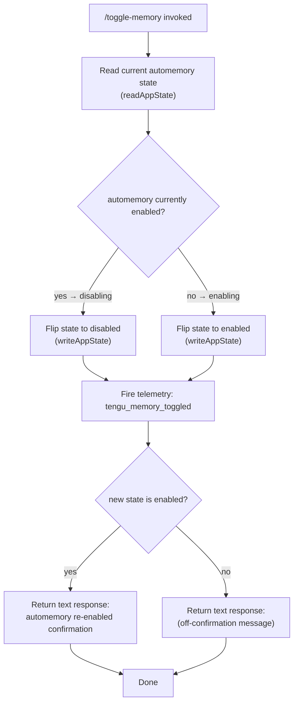

# `/toggle-memory`

> Analysis basis: CC v2.1.132 bundle.js (AST extraction + Claude interpretation)
> Minimum version: v2.1.132

---

## Overview

`/toggle-memory` is a session-scoped local slash command that flips the automemory system between enabled and disabled states for the current session. When toggled back on, the command emits a text response confirming that memory content may be referenced and new memories can be saved. A telemetry event is fired on every invocation regardless of direction.

---

## Registration

| Field | Value |
|---|---|
| type | `local` |
| name | `toggle-memory` |
| description | `Toggle automemory off/on for this session` |
| supportsNonInteractive | `false` |
| thinClientDispatch | `post-text` |
| isHidden | `false` |
| module_id | `DHq` |
| load_inline | `true` |
| handler (Arbor) | `F17` (AsyncFunction, resolved via `module_id`) |
| `loc_byte_end` | `10325627` |
| `arbor_handler.name` | `F17` |
| `arbor_handler.kind` | `AsyncFunction` |
| `arbor_handler.resolution_path` | `module_id` |
| `arbor_handler.fqn` | `claude-2.1.132::F17` |
| `arbor_handler.n_hits` | `1` |

Analysis basis: CC v2.1.132 bundle.js:+10325359 – +10325627

---

## Input Branching

The handler `F17` contains no user-supplied argument parsing — the command takes no text argument. The branching logic is entirely driven by the current state of the automemory flag at invocation time.



Analysis basis: CC v2.1.132 bundle.js:+10324912 – +10324979

---

## Behavioral Spec

### Main Handler: Toggle Automemory State

The handler is the async function `F17`, resolved unambiguously via the `module_id → DHq` path in the Arbor symbol graph.

```
async function toggleMemory(context):

    // 1. Read current session automemory flag
    currentState = readAppState()           // call: readAppState
    isCurrentlyEnabled = currentState.automemory

    // 2. Compute new state (simple boolean flip)
    newEnabled = NOT isCurrentlyEnabled

    // 3. Persist the new state
    writeAppState({ automemory: newEnabled })   // call: writeAppState

    // 4. Fire telemetry unconditionally
    emitTelemetry("tengu_memory_toggled")       // call: emitTelemetry

    // 5. Build and return a text response
    if newEnabled:
        message = "Automemory re-enabled · memory content may be " +
                  "referenced and new memories can be saved."
        // (citation fragment ≤30 chars: "Automemory re-enabled ·")
    else:
        message = <off-direction confirmation string>
        // NOTE: off-direction literal not captured in depth-2 traversal
        <!-- TODO: not found in depth-2 traversal; needs --depth 4 -->

    return { type: "text", content: message }
```

Analysis basis: CC v2.1.132 bundle.js:+10324912 (readAppState call), +10324924 (writeAppState call), +10324931 (telemetry call), +10324979 (type literal `"text"`), +10325196 (re-enabled message literal)

### Response Shape

The return value uses the string constant `"text"` as its type discriminant (bundle.js:+10324979), consistent with the `thinClientDispatch: "post-text"` registration field. The payload is a plain human-readable string — no structured JSON or markdown is produced.

### Session Scope

`supportsNonInteractive: false` (bundle.js:+10325359) means this command is only available within an interactive CLI session. It cannot be driven from a script or piped invocation.

### State Persistence

State is written via the `writeAppState` call (identifier `jW8`, bundle.js:+10324924). Because this is session state, the toggle does not persist across separate Claude Code sessions unless the underlying app-state storage layer persists it independently — that layer is not visible at depth ≤ 2.

---

## State & Side Effects

| Item | Detail |
|---|---|
| Telemetry | `tengu_memory_toggled` — fired once per invocation, unconditionally (bundle.js:+10324933) |
| App state mutation | Automemory boolean flag flipped via `writeAppState` (`jW8`) at bundle.js:+10324924 |
| App state read | Current automemory flag read via `readAppState` (`ig`) at bundle.js:+10324912 |
| Response type | `"text"` — delivered through `thinClientDispatch: "post-text"` |
| Hook registration | <!-- TODO: not found in depth-2 traversal; needs --depth 4 --> |
| Sound | <!-- TODO: not found in depth-2 traversal; needs --depth 4 --> |
| Non-interactive support | None — `supportsNonInteractive: false` |

---

## Version History

| Version | Change |
|---|---|
| v2.1.132 | Initial analysis; handler `F17` confirmed as AsyncFunction via Arbor `module_id` resolution |

---

## Common Mistakes

1. **Expecting persistence across sessions**: `/toggle-memory` mutates session-scoped app state. If the storage layer does not write to disk, the toggle resets when a new session starts. Do not rely on it as a permanent setting without verifying storage behavior.

2. **Calling in non-interactive mode**: The `supportsNonInteractive: false` flag means invoking this command from a script or CI pipeline will fail or be silently ignored. Use it only inside an active interactive terminal session.

3. **Assuming a confirmation is always shown**: The re-enabled confirmation string is only emitted when toggling **to** the enabled state. The disabled-direction message is a different literal not captured in this analysis; do not hardcode an assumption about its content.

4. **Treating the toggle as idempotent**: Each invocation flips the state regardless of intent. Calling `/toggle-memory` twice in succession returns automemory to its original state — there is no explicit `on` or `off` argument.

5. **Confusing `thinClientDispatch: "post-text"` with a rich response**: The response is a plain text string. No JSON payload, tool result, or markdown block is returned; downstream code that expects structured output will receive only the confirmation text.

---

## Appendix — Identifier Mapping

> For bundle debugging only. Identifiers change across versions.

| Identifier | Role |
|---|---|
| `F17` | Main async handler for `/toggle-memory`; entry point resolved via Arbor `module_id → DHq` |
| `ig` | Read app state — retrieves current automemory flag from session state |
| `jW8` | Write app state — persists the flipped automemory boolean back to session state |
| `d` | Emit telemetry — fires the `tengu_memory_toggled` event |