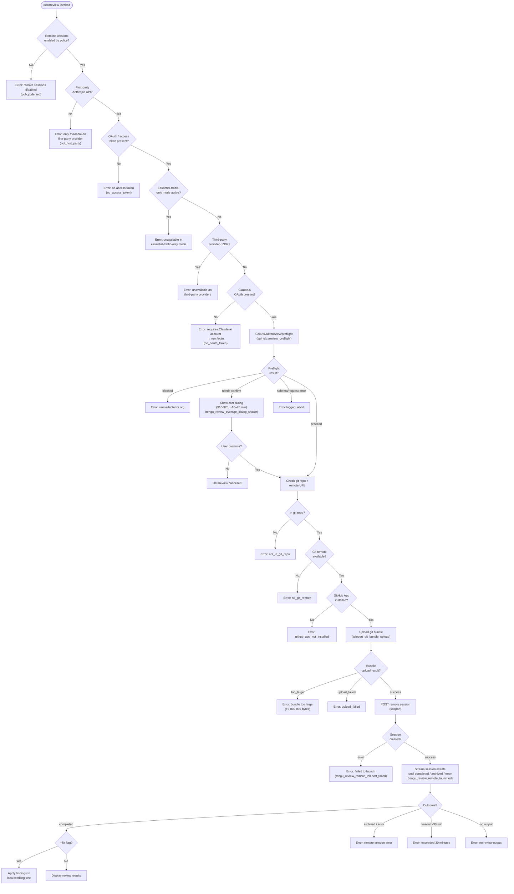

# `/ultrareview`

> Analysis basis: CC v2.1.162 bundle.js (AST extraction + Claude interpretation)
> Minimum version: v2.1.162

---

## Overview

`/ultrareview` is an alias of `/code-review ultra` that launches a deep, automated bug-finding review of the current branch by dispatching a remote Claude Code session running on the web (claude.ai). The command performs a multi-step preflight sequence — checking organization policy, authentication, network mode, git state, and GitHub connectivity — before uploading a git bundle and spawning the remote agent, then streaming results back to the local CLI. It accepts an optional `--fix` flag that, when present, instructs the remote agent to apply discovered findings directly to the local working tree on completion.

---

## Registration

| Field | Value |
|---|---|
| type | `local-jsx` |
| name | `ultrareview` |
| description | `Alias of /code-review ultra · ... · Est. cost ... USD · Finds and verifies bugs in your branch. Runs in Claude Code on the web. See ...` |
| loc_byte | `12164781` |
| loc_byte_end | `12165072` |
| loc_line | `8489` |
| module_id | `soq` |
| load_inline | `true` |
| arbor_handler.name | `IZf` |
| arbor_handler.fqn | `claude-2.1.162::IZf` |
| arbor_handler.kind | `AsyncFunction` |
| arbor_handler.resolution_path | `module_id` |
| arbor_handler.n_hits | `1` |

Analysis basis: CC v2.1.162 bundle.js:+12164781

---

## Input Branching

The command has many distinct branches across preflight, git analysis, and launch phases (well over 3 paths). The primary decision tree is shown below.



---

## Behavioral Spec

### 1. Handler Entry Point — `handlerMain` (bundle identifier: `IZf`)

The handler is an `AsyncFunction` resolved via `module_id = "soq"`.

```
async function handlerMain(commandArgs, appState):
    # Step 1: Check allow_remote_sessions flag
    if not appState.config["allow_remote_sessions"]:
        display error "Remote sessions are disabled by your organization's policy."
        return

    # Step 2: Validate first-party API provider
    apiProviderStatus = checkApiProvider(appState)
    if apiProviderStatus != "firstParty":
        display error "Remote sessions are only available on the first-party Anthropic API provider."
        return

    # Step 3: Check OAuth access token
    token = getAccessToken(appState)
    if not token:
        display error "No access token found for remote session creation"
        return

    # Step 4: Run bughunter pre-checks (boq)
    preCheckResult = runBughunterPreChecks(commandArgs, appState)
    if preCheckResult.failed:
        return

    # Step 5: Run preflight + git analysis (i1A)
    preflightResult = await runPreflightAndGitAnalysis(commandArgs, appState)
    if preflightResult.failed:
        return

    # Step 6: Evaluate preflight gate (r1A → Soq)
    gateResult = await evaluatePreflightGate(preflightResult, appState)
    if gateResult == "blocked":
        display "Ultrareview is unavailable for your organization."
        return
    if gateResult == "needs-confirm":
        emit telemetry "tengu_review_overage_dialog_shown"
        confirmed = await showCostDialog(costRange="$10-$20", duration="~10–20 min")
        if not confirmed:
            display "Ultrareview cancelled."
            return

    # Step 7: Dispatch remote session (vZf → o1A → el)
    sessionResult = await dispatchRemoteSession(commandArgs, preflightResult, appState)
    if sessionResult.failed:
        emit telemetry "tengu_review_remote_teleport_failed"
        display "Ultrareview failed to launch the remote session. Check that this is a GitHub repo and try again."
        return

    emit telemetry "tengu_review_remote_launched"

    # Step 8: Stream and present results
    await streamRemoteSessionResults(sessionResult.sessionId, commandArgs, appState)
```

Analysis basis: CC v2.1.162 bundle.js:+12162436

---

### 2. Bughunter Pre-Check — `bughunterPreCheck` (bundle identifier: `boq → _S8`)

Parses the command argument string and resolves whether the invocation is for a `fix` or `comment` sub-mode. The canonical alias `/code-review ultra` is resolved here.

```
function bughunterPreCheck(rawArgs, appState):
    trimmed = rawArgs.trim()
    parts   = trimmed.split(whitespace)

    # Recognize mode tokens
    if parts contains "fix":
        mode = "fix"
    elif parts contains "comment":
        mode = "comment"
    else:
        mode = default

    # Confirm resolved alias
    canonicalName = "/code-review ultra"   # literal: bundle.js:+12125144
    logResolvedAlias(canonicalName)

    # Check product-feedback telemetry permission
    if not appState.config["allow_product_feedback"]:
        # suppress certain telemetry paths
        pass

    return { mode, trimmed }
```

Analysis basis: CC v2.1.162 bundle.js:+12125052

---

### 3. Preflight and Git Analysis — `preflightAndGitAnalysis` (bundle identifier: `i1A`)

```
async function preflightAndGitAnalysis(args, appState):
    # 3a. Verify git repo (rG8)
    inRepo = await checkInsideGitWorkTree()   # git rev-parse --is-inside-work-tree
    if not inRepo:
        emit telemetry "tengu_review_remote_precondition_failed" reason="not_in_git_repo"
        return failure

    # 3b. Resolve git remote URL (kR)
    remoteUrl = await getGitRemoteUrl()       # git config --get remote.origin.url
    if not remoteUrl:
        emit telemetry "tengu_review_remote_precondition_failed" reason="no_git_remote"
        return failure

    # 3c. Redact credentials from URL  (yBH: replaces "://***@" pattern)
    sanitizedUrl = redactCredentials(remoteUrl)  # bundle.js:+1110176

    # 3d. Detect default branch (Uv: git symbolic-ref --short refs/remotes/origin/HEAD)
    #     Fallbacks: "main", "master"           bundle.js:+1118555, +1118562
    defaultBranch = await resolveDefaultBranch()

    # 3e. Detect current branch (Xw: git branch --abbrev-ref HEAD)
    currentBranch = await resolveCurrentBranch()  # bundle.js:+1118245

    # 3f. Compute merge-base diff stat (git diff --shortstat)
    diffStat = await getDiffStat(currentBranch, defaultBranch)  # bundle.js:+12127407

    # 3g. Detect GitHub org ownership (github.com, anthropics / anthropic)
    ownerInfo = parseGitHubOwner(sanitizedUrl)  # bundle.js:+12125894, +12125932

    # 3h. Check if PR context is present
    isPr = detectPrContext(args)  # literal "pr": bundle.js:+12126262

    # 3i. Validate git bundle size (b$q → R$q)
    bundleBytes = await countGitObjects()     # git count-objects -v
    maxBundleBytes = 5_000_000               # bundle.js:+8976388
    if bundleBytes > maxBundleBytes:
        emit telemetry "tengu_ccr_bundle_max_bytes"
        return failure(reason="too_large")

    # 3j. Call /v1/ultrareview/preflight (Soq)
    preflightResponse = await httpGet("/v1/ultrareview/preflight",
        headers={"teleport-org": orgUuid})   # bundle.js:+12123528, +12123562
    emit telemetry "api_ultrareview_preflight"   # bundle.js:+12124149

    # 3k. Handle essential-traffic-only
    if networkMode == "essential-traffic-only":   # bundle.js:+12123622
        display "Ultrareview runs in Claude Code on the web and is unavailable when essential-traffic-only mode is active."
        return failure

    # 3l. Handle data-residency / ZDR (zdr)
    if providerTag in ["data-residency", "zdr"]:  # bundle.js:+12123766, +12123777
        display "Ultrareview runs in Claude Code on the web and is unavailable on third-party providers."
        return failure

    # 3m. Handle no-auth
    if authState == "no-auth":                    # bundle.js:+12123917
        display "Ultrareview requires a Claude.ai account. Run /login to authenticate."
        emit telemetry code="no_oauth_token"
        return failure

    return success(preflightResponse, diffStat, ownerInfo)
```

Analysis basis: CC v2.1.162 bundle.js:+12162653

---

### 4. Preflight Gate Evaluation — `evaluatePreflightGate` (bundle identifier: `r1A → Soq`)

```
async function evaluatePreflightGate(preflightData, appState):
    status = preflightData.status   # one of: "proceed", "blocked", "needs-confirm", "server"

    if status == "blocked":
        # bundle.js:+12123304
        return "blocked"

    if status == "needs-confirm":
        # bundle.js:+12128203
        emit telemetry "tengu_review_overage_dialog_shown"
        # Dialog shows estimated cost $10-$20 and duration ~10–20 min
        # bundle.js:+12122993, +12123085
        userChoice = await presentConfirmationDialog(
            cost  = "$10-$20",
            time  = "~10–20 min",
            token = "confirm"     # bundle.js:+12128136
        )
        return userChoice ? "confirm" : "cancel"

    if status == "server":
        # bundle.js:+12128004
        display "Ultrareview is unavailable for your organization."
        return "blocked"

    if status == "proceed":
        return "proceed"

    # schema mismatch or unexpected value
    emit telemetry code="schema_mismatch"   # bundle.js:+12124177
    return "error"
```

Analysis basis: CC v2.1.162 bundle.js:+12127799

---

### 5. Remote Session Dispatch — `dispatchRemoteSession` (bundle identifier: `vZf → o1A → el`)

```
async function dispatchRemoteSession(args, preflightData, appState):
    # 5a. Eligibility re-check (J3q)
    eligibility = await checkRemoteEligibility(appState)
    # Reasons: policy_blocked, not_logged_in, byoc, not_in_git_repo,
    #           no_git_remote, github_app_not_installed
    # bundle.js:+9064683..+9065361
    if not eligibility.ok:
        emit telemetry "bg_remote_eligibility_check" result=eligibility.reason
        return failure

    # 5b. Build session context
    sessionContext = buildSessionContext(preflightData)
    sessionContext.taskType = "ultrareview"     # bundle.js:+12129927
    sessionContext.commandPath = "/ultrareview" # bundle.js:+12130859

    # 5c. Determine --fix mode
    if args.contains("--fix"):
        sessionContext.fixInstructions =
            " The user passed --fix: when the findings arrive, apply them to the local working tree."
            # bundle.js:+12162174
        sessionContext.mode = "fix"

    # 5d. Upload git bundle (od_)
    bundleUploadResult = await uploadGitBundle(sessionContext)
    # teleport_git_bundle_upload telemetry emitted
    emit telemetry "tengu_teleport_bundle_mode" mode=bundleUploadResult.mode
    # Possible modes: "head", "fallback_head", "squashed", "fallback_squashed",
    #                 "bundle", "explicit_env_bundle", "git_repository"
    # bundle.js:+8980919..+8995456

    # 5e. POST session creation (el → e_.post)
    sessionResponse = await postRemoteSession(sessionContext, bundleUploadResult)
    # HTTP error handling:
    #   500, 401, 403, 429 → create_request_failed  bundle.js:+8996518
    #   200/201 with no session id → malformed_response  bundle.js:+8996734
    #   github_repo_access_denied  bundle.js:+8996340
    if sessionResponse.error:
        return failure(sessionResponse.errorCode)

    emit telemetry "tengu_ccr_session_link"

    sessionId = sessionResponse.sessionId
    return success(sessionId)
```

Analysis basis: CC v2.1.162 bundle.js:+12163327

---

### 6. Session Result Streaming — `streamResults` (bundle identifier: `$RH → W3q`)

```
async function streamResults(sessionId, fixMode, appState):
    startTime = Date.now()
    maxDuration = 1_800_000   # 30 minutes in ms  bundle.js:+9073161
    pollingPhase = "starting"

    while true:
        if Date.now() - startTime > maxDuration:
            display "remote session exceeded 30 minutes"
            return

        event = await pollSessionEvent(sessionId)

        if event.type == "SessionStart":
            pollingPhase = "running"

        if event.type == "hook_progress":
            displayProgress(event.data)

        if event.type == "hook_response":
            displayIntermediateResult(event.data)

        if event.type == "result":
            finalResult = event.data
            if fixMode:
                applyFindingsToWorkingTree(finalResult)
            else:
                displayReviewResults(finalResult)
            break

        if event.type in ["archived", "completed"]:
            if not finalResult:
                display "no review output — orchestrator may have exited early"
                # bundle.js:+9075840
            break

        if event.type == "error":
            display "remote session returned an error"
            # bundle.js:+9075762
            break

        if pollingPhase == "idle":
            # session stalled
            break
```

Analysis basis: CC v2.1.162 bundle.js:+9071473

---

### 7. Remote Session Eligibility Check — `checkRemoteEligibility` (bundle identifier: `J3q`)

```
async function checkRemoteEligibility(appState):
    emit telemetry "bg_remote_eligibility_check"

    # Policy gate
    if policyDenied(appState):
        return failure("policy_blocked")   # bundle.js:+9064683

    # Login gate
    if not isLoggedIn(appState):
        return failure("not_logged_in")    # bundle.js:+9064822
        # message: "Please run /login and sign in with your Claude.ai account (not Console)."
        # bundle.js:+9066585

    # BYOC gate
    if isByoc(appState):
        return ineligible("byoc")          # bundle.js:+9065016

    # Git repo gate
    if not inGitRepo():
        return failure("not_in_git_repo")  # bundle.js:+9065172

    # Git remote gate
    if not hasGitRemote():
        # "Background tasks require a GitHub remote. Add one with `git remote add origin REPO_URL`."
        # bundle.js:+9066824
        return failure("no_git_remote")    # bundle.js:+9065265

    # GitHub App installation gate (aSH)
    appInstalled = await checkGithubAppInstalled(appState)
    if not appInstalled:
        return failure("github_app_not_installed")  # bundle.js:+9065361

    emit telemetry "tengu_ccr_bundle_seed_enabled"
    return success
```

Analysis basis: CC v2.1.162 bundle.js:+9064635

---

### 8. Overage / Policy Guard at Launch — `overageGuard` (inline in `IZf`)

```
function overageGuard(appState):
    # Check overage block flag (tengu_review_overage_blocked)
    if appState.overageBlocked:
        emit telemetry "tengu_review_overage_blocked"
        # Link to admin settings page
        settingsUrl = buildUrl("/admin-settings/")   # bundle.js:+12162893
        displayBlockMessage(settingsUrl)
        return blocked
    return ok
```

Analysis basis: CC v2.1.162 bundle.js:+12162769

---

## State & Side Effects

| Item | Detail |
|---|---|
| Telemetry — `tengu_review_remote_precondition_failed` | Emitted when git or auth preconditions fail (bundle.js:+12125191) |
| Telemetry — `tengu_review_bughunter_config` | Emitted on bughunter configuration read (bundle.js:+12122876) |
| Telemetry — `tengu_review_overage_blocked` | Emitted when org overage policy blocks launch (bundle.js:+12162771) |
| Telemetry — `tengu_review_overage_dialog_shown` | Emitted when cost-confirmation dialog is displayed (bundle.js:+12163108) |
| Telemetry — `tengu_review_remote_teleport_failed` | Emitted on failed remote session dispatch (bundle.js:+12130687) |
| Telemetry — `tengu_review_remote_launched` | Emitted on successful remote session creation (bundle.js:+12131210) |
| Telemetry — `tengu_ccr_bundle_upload` | Emitted during git bundle upload phase (bundle.js:+8979239) |
| Telemetry — `tengu_ccr_bundle_max_bytes` | Emitted when bundle exceeds 5 000 000 byte limit (bundle.js:+8975862) |
| Telemetry — `tengu_ccr_bundle_seed_enabled` | Emitted when seed-bundle code path is active (bundle.js:+9065108) |
| Telemetry — `tengu_ccr_session_link` | Emitted after session URL/ID is returned (bundle.js:+8989136) |
| Telemetry — `tengu_teleport_bundle_mode` | Records the git-bundle transport strategy chosen (bundle.js:+8995299) |
| Telemetry — `tengu_teleport_source_decision` | Records repository source decision (bundle.js:+9000721) |
| Telemetry — `tengu_teleport_generate_title` | Used when auto-generating a session title (bundle.js:+8982562) |
| Telemetry — `teleport_git_bundle_upload` | Emitted during the git bundle upload sub-step (bundle.js:+8978946) |
| Telemetry — `teleport_environments_list` | Emitted when listing available remote environments (bundle.js:+8944085) |
| Telemetry — `teleport_default_environment_create` | Emitted when auto-creating default cloud env (bundle.js:+8945005) |
| Telemetry — `api_ultrareview_preflight` | Emitted on `/v1/ultrareview/preflight` HTTP call result (bundle.js:+12124149) |
| Telemetry — `tengu_feature_ok` / `tengu_feature_sad` | General feature health events (bundle.js:+1008233, +1008376) |
| Telemetry — `tengu_daemon_config_reload` | Daemon config reloaded as side effect (bundle.js:+16011003) |
| Network — preflight API call | `GET /v1/ultrareview/preflight` with `teleport-org` header (bundle.js:+12123528) |
| Network — session creation | `POST` to remote session endpoint with git bundle reference (bundle.js:+8996125) |
| Network — bundle upload | HTTP upload of git bundle ≤ 5 000 000 bytes (bundle.js:+8976388) |
| Git side effects | Stash create/drop, temporary refs `refs/seed/stash` and `refs/seed/root` created and deleted (bundle.js:+8979435, +8979047, +8979065) |
| Local file side effects | Temporary `.bundle` file written and unlinked after upload (bundle.js:+8980253, +8981194) |
| AppState changes | Session record stored; MCP state may be updated via `applyMcpUpdate` (bundle.js:+15672723) |
| `--fix` mode | Applies remote review findings to local working tree on completion (bundle.js:+12162174) |
| Session timeout | Hard cap of 1 800 000 ms (30 min); session aborted if exceeded (bundle.js:+9073161) |
| Admin settings link | Overage-blocked users are directed to `/admin-settings/` (bundle.js:+12162893) |

---

## Version History

| Version | Change |
|---|---|
| v2.1.162 | Initial analysis |

---

## Common Mistakes

1. **Running outside a git repository**: `/ultrareview` requires an active git repository with at least one commit. Running it in a plain directory or an empty repo will produce `not_in_git_repo` / `empty_repo` failures.

2. **Missing GitHub remote**: The command must be able to resolve `remote.origin.url` pointing to a GitHub repository. A local-only repo or a non-GitHub remote (GitLab, Bitbucket, etc.) will fail at the `no_git_remote` / `no_github_remote` eligibility gate.

3. **Authenticating with an API key instead of Claude.ai OAuth**: `/ultrareview` dispatches sessions through the claude.ai web backend and requires OAuth authentication. An `ANTHROPIC_API_KEY`-only setup is insufficient; users must run `/login` to authenticate with their Claude.ai account.

4. **Using on third-party API providers or in ZDR / data-residency mode**: The remote execution infrastructure is hosted by Anthropic. Environments configured with data-residency (`zdr`), third-party providers, or `essential-traffic-only` network mode will be blocked at preflight.

5. **Large repositories exceeding the 5 000 000 byte bundle limit**: Very large repositories will be rejected during git bundle upload (`tengu_ccr_bundle_max_bytes`). Consider using the command on a branch with a smaller diff surface.

6. **Expecting instant results**: The description states an estimated duration of `~10–20 min` and the session timeout is 30 minutes. The command streams progress events; it should not be aborted prematurely.

7. **Confusing `/ultrareview` with `/code-review`**: `/ultrareview` is a fixed alias of `/code-review ultra`. It always runs in the remote, cloud-based execution mode and does not share the local, synchronous behavior of the base `/code-review` command.

---

## Appendix — Identifier Mapping

> For bundle debugging only. Identifiers change across versions.

| Identifier | Role |
|---|---|
| `IZf` | Main async handler for `/ultrareview` (arbor_handler) |
| `W9` | Remote session eligibility + API provider check helper |
| `FK9` | API provider classification sub-routine |
| `rvH` | Provider config reader |
| `JC` | Provider type classifier (firstParty, enterprise, team, etc.) |
| `vj6` | Provider config file reader (readFileSync, utf-8) |
| `ULH` | Provider inclusion/exclusion checker |
| `wq` | Telemetry traffic mode resolver |
| `UyA` | Traffic-mode string mapper |
| `tH` | String coercion utility |
| `u4H` | Alternate string helper |
| `H` | Bootstrap fetch / HTTP utility |
| `v` | HTTP request builder / log helper |
| `PgK` | HTTP client factory |
| `PJA` | URL builder helper |
| `SH` | JSON.stringify wrapper |
| `V4` | URL path manipulation utility |
| `rXA` | Path segment mapper |
| `WpH` | Stream write helper |
| `pXA` | Raw write wrapper |
| `EgK` | Log/transcript appender |
| `dmH` | Debounced flush scheduler |
| `E3H` | Log entry formatter |
| `i6` | Path join helper |
| `zL6` | File existence checker |
| `_PA` | Path constructor |
| `HPA` | File rotation helper (stat, rename, unlink) |
| `GgK` | Append-file writer with rotation |
| `J9` | Hook registrar |
| `AY_` | Command argument parser (split, trim, indexOf, slice) |
| `LHH` | Cache set membership checker |
| `bJ` | String replace wrapper |
| `a1` | Model / provider string resolver |
| `oHH` | Provider object constructor |
| `k0` | Provider key extractor |
| `OqH` | Provider flag checker |
| `Dd` | Provider detail parser |
| `qq` | Model name normalizer |
| `Q0` | Model key mapper |
| `pKH` | Model inclusion checker |
| `qI` | Model capability resolver |
| `LQH` | Capability lookup helper |
| `PE` | Capability flag resolver |
| `RJ1` | Capability chain resolver |
| `UM` | wA wrapper (capability flag getter) |
| `Xt6` | Model list inclusion checker |
| `fQH` | String formatter for model names |
| `rX` | Model config builder |
| `g0` | Model option assembler |
| `t6` | Context/store accessor |
| `c` | Base async context runner |
| `Z6` | Async context initializer |
| `Zx6` | Context store creator |
| `boq` | Bughunter pre-check dispatcher |
| `_S8` | Command argument parser for fix/comment mode |
| `L` | Set add/delete wrapper (connection tracking) |
| `f` | Connection close helper |
| `hv` | Regex-escape helper (replaces `$&`) |
| `K` | Column padding helper (padEnd) |
| `M` | MCP state manager |
| `RCH` | MCP server connection orchestrator |
| `xp8` | MCP connection result applier |
| `$` | MCP server state store accessor |
| `ROA` | MCP server connection updater |
| `i1A` | Preflight and git analysis orchestrator |
| `rG8` | Git work-tree verifier (`rev-parse --is-inside-work-tree`) |
| `x6` | Async context store accessor |
| `RQ6` | Store getter with fallback |
| `X_` | Async value resolver |
| `C_` | Git command runner (wTH-based) |
| `wTH` | Low-level git process spawner |
| `Y` | Forced shutdown helper (process.exit + abort) |
| `oP4` | Error string coercer |
| `q$` | Git output cleaner |
| `V8` | Error classifier (EISDIR, ENOENT, etc.) |
| `kH` | Git command executor with error logging |
| `kR` | Git remote URL resolver (config --get remote.origin.url) |
| `Tx` | Remote URL cache reader |
| `lt8` | Remote URL cache getter (`iqH.get`) |
| `yBH` | Credential redactor (`://***@` pattern) |
| `jHH` | Git URL parser (match, split) |
| `YCA` | Git URL host/path splitter |
| `$9` | String slice helper (indexOf + slice) |
| `b$q` | Git object count checker (`count-objects -v`) |
| `C$q` | Object count result parser |
| `R$q` | Repo size verifier (limit: 5 000 000) |
| `j6` | Background session scheduler |
| `C8` | Git command runner variant |
| `D` | Session state updater (supervisor, start/stop/updateConfig) |
| `Y0H` | Session config writer |
| `V9` | Session store reader (`d0L.getStore`) |
| `k4A` | Session config key extractor |
| `TH` | String coercion (String()) |
| `OKK` | Config display renderer |
| `E` | Keyboard input handler (preventDefault + stop) |
| `b` | Input event handler |
| `c0` | User settings accessor |
| `Z` | Session lifecycle controller (start/stop/updateConfig) |
| `xCK` | Heartbeat emitter |
| `d6H` | Heartbeat interval manager |
| `V` | Session runner (start) |
| `Uv` | Default-branch resolver (`symbolic-ref --short refs/remotes/origin/HEAD`) |
| `nt8` | Default-branch cache getter |
| `Xw` | Current-branch resolver (`branch --abbrev-ref HEAD`) |
| `dt8` | Current-branch cache getter |
| `O` | Background session status accessor |
| `x8` | Session stopped state reader |
| `r1A` | Preflight gate evaluator |
| `Soq` | Preflight HTTP caller + gate result parser |
| `p6` | JSON.parse wrapper |
| `c1A` | Preflight response validator |
| `hH` | Context runner variant |
| `rbH` | Git branch commit-count helper |
| `G16` | Git log/ref helper |
| `c66` | Subscription/plan type checker |
| `tT` | Plan type accessor |
| `eDH` | Plan gate evaluator |
| `TL` | Subscription type resolver |
| `AD` | Auth/subscription detail reader |
| `C6` | Conversation context builder |
| `WA` | Subscription-aware prompt builder |
| `gR` | Array type checker |
| `Fy` | Role/subscription capability gate |
| `Aq` | Role capability assembler |
| `E4_` | Role capability extractor |
| `G4_` | Role capability filter |
| `dt` | Git commit list helper |
| `vZf` | Remote session dispatch orchestrator |
| `o1A` | Full remote session pipeline runner |
| `_2H` | Remote task initializer |
| `J3q` | Remote eligibility checker |
| `D5H` | Diff-stat formatter |
| `yoq` | Git log range helper |
| `el` | Teleport-to-remote session creator |
| `W5` | Permission mode flag accessor |
| `I3` | Variant Y path helper |
| `Hc_` | Variant result assembler |
| `bx` | Session context builder |
| `p1` | OAuth URL builder / environment resolver |
| `BJ` | Anthropic API version header builder |
| `od_` | Git bundle upload handler |
| `S6` | Nv/async resolver |
| `E6` | Context store creator variant |
| `u$q` | Session UUID generator (`randomUUID`) |
| `BV6` | Session metadata builder |
| `x$q` | Session link formatter |
| `nG8` | GitHub app installation status helper |
| `ns` | Remote environments lister |
| `Y66` | Default cloud environment creator |
| `zQ7` | Task title generator (LLM call) |
| `fh` | Scheduled background task launcher |
| `aSH` | GitHub App installation checker |
| `r` | MCP remote server retry/recovery manager |
| `t_` | Error string extractor |
| `Yz` | Cancel/abort detector |
| `uO` | Session abort handler |
| `$RH` | Session lifecycle manager (polling loop) |
| `Ok` | Random bytes / session token generator |
| `L66` | Temp file opener for bundle |
| `d2` | Bundle timestamp tracker |
| `dQ7` | Session event formatter |
| `W3q` | Session event stream processor (main poll loop) |
| `A2H` | Session result handler |
| `Qw` | CLI session finalizer |
| `NZf` | Result map builder |
| `n1A` | Cancellation / cleanup handler |