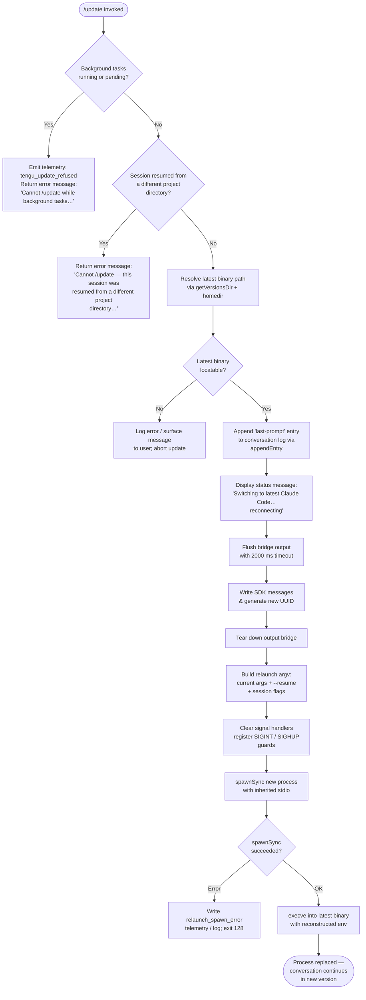

# `/update`

> Analysis basis: CC v2.1.162 bundle.js (AST extraction + Claude interpretation)
> Minimum version: v2.1.162

---

## Overview

The `/update` command performs an in-place upgrade of the running Claude Code CLI to the latest installed version without terminating the active conversation. It resolves the target binary, validates preconditions (no running background tasks, consistent working directory), flushes all in-flight state, then replaces the current process via `execve`-style relaunch while forwarding the current session's `--resume` flag and other relevant CLI arguments.

---

## Registration

| Field | Value |
|---|---|
| type | `local` |
| name | `update` |
| description | `Switch to the latest version (conversation continues)` |
| loc_byte | `12593399` |
| loc_byte_end | `12593640` |
| loc_line | `8927` |
| supportsNonInteractive | `false` |
| isHidden | `true` |
| module_id | `d_K` |
| load_inline | `true` |
| arbor_handler.name | `Oyf` |
| arbor_handler.fqn | `claude-2.1.162::Oyf` |
| arbor_handler.kind | `AsyncFunction` |
| arbor_handler.resolution_path | `module_id` |
| arbor_handler.n_hits | `0` |

Analysis basis: CC v2.1.162 bundle.js:+12593399

---

## Input Branching

The handler has 4+ distinct branches depending on background-task state, working-directory consistency, and relaunch viability. A Mermaid flowchart is used.



---

## Behavioral Spec

### 1. Precondition: Background-Task Guard

Before performing any update work, the handler queries the current task registry (`Object.values` over the task state map). If any task has status `"running"` or `"pending"`, the update is refused immediately.

```
async function updateCommandHandler(context):
    tasks = getTaskRegistryValues()         # Object.values call @ +12591528
    hasBusy = tasks.some(t => t.status == "running" || t.status == "pending")
    if hasBusy:
        emitTelemetry("tengu_update_refused")   # +12591305
        return errorMessage(
            "Cannot /update while background tasks are running — wait for them "
            "to finish, then try again."        # literal @ +12591669
        )
```

Analysis basis: CC v2.1.162 bundle.js:+12591528, +12591566, +12591588, +12591669

### 2. Precondition: Working-Directory Consistency Check

The handler verifies that the session's recorded working directory matches the process's current directory. A mismatch indicates the session was resumed from a different project tree, making a transparent in-place relaunch unsafe.

```
    sessionDir = getSessionWorkingDirectory(context)   # b_ call @ +12592727
    if sessionDir != process.cwd():
        return errorMessage(
            "Cannot /update — this session was resumed from a different "
            "project directory. Restart manually with --resume to continue "
            "on the latest version."            # literal @ +12591910
        )
```

Analysis basis: CC v2.1.162 bundle.js:+12592727, +12591910

### 3. Locate Target Binary

The handler resolves the path to the latest available Claude Code binary by constructing the versions directory path (`~/.local/share/versions/`) and then resolving the `bin` subdirectory.

```
    binaryDir   = resolveVersionsDir()      # GS call @ +12591258
                                            # uses homedir() @ +7947786
                                            # joins .local / share / versions
    latestBin   = resolveCurrentBinary()    # $R8 -> CM -> DVA -> Bun.which("claude")
                                            # literal "claude" @ +12591208
    if not latestBin:
        logError("update: cannot locate latest binary")
        return
```

Analysis basis: CC v2.1.162 bundle.js:+12591258, +12591205, +7947786, +7948059, +7948068, +7948139

### 4. Append Last-Prompt Entry

Before any teardown, the handler records the last-prompt marker in the conversation log so the resumed session can reconstruct context.

```
    appendConversationEntry("last-prompt", ...)    # HKA -> _.appendEntry @ +13117374
                                                    # literal "last-prompt" @ +13117394
```

Analysis basis: CC v2.1.162 bundle.js:+12592129, +13117374, +13117394

### 5. Display Status Message & Flush Bridge

The status string `"Switching to latest Claude Code… reconnecting"` is written through the SDK message writer. The bridge is then flushed with a 2000 ms timeout before teardown begins.

```
    writeSdkMessage("Switching to latest Claude Code… reconnecting")
                                            # O.writeSdkMessages @ +12592397
                                            # literal @ +12592421
    generateSessionUuid()                   # g_K -> MR8.randomUUID @ +12590278

    await flushWithTimeout(bridge, 2000)    # gL @ +12592488
                                            # literal 2000 @ +12592501
                                            # label "bridge flush" @ +12592506

    bridge.flush()                          # O.flush @ +12592491
    bridge.teardown()                       # O.teardown @ +12592542
```

Analysis basis: CC v2.1.162 bundle.js:+12592397, +12592421, +12592488, +12592491, +12592501, +12592542

### 6. Build Relaunch Argument Vector

The handler reconstructs the CLI argument list from the current process's argv, then appends `--resume` plus any session-level flags (effort, permission-mode, allowed/disallowed tools, etc.). It uses `hS8` to assemble the final argv array.

```
    baseArgv = Array.from(process.argv)             # hS8 -> Array.from @ +12318789
    argv = filterAndRebuildArgs(baseArgv)
    argv.push("--resume")                           # literal @ +12317440
    if session.addedDirs:
        argv.push("--add-dir", ...session.addedDirs)    # literal @ +12318964
    if session.allowDangerouslySkipPermissions:
        argv.push("--allow-dangerously-skip-permissions") # literal @ +12319133
    if session.effort:
        argv.push("--effort", session.effort)           # literal @ +12319275
    if session.permissionMode:
        argv.push("--permission-mode", session.permissionMode) # literal @ +12319292
```

Analysis basis: CC v2.1.162 bundle.js:+12592684, +12592723, +12318789, +12317440, +12318964, +12319133, +12319275, +12319292

### 7. Pre-Exec Cleanup (iWH / relaunchAndReplace)

The relaunch helper (`iWH`) performs the following steps in order before handing off to `execve`:

```
async function relaunchAndReplace(targetBinary, argv, env):
    # Verify binary exists via stat
    stat(targetBinary)                      # iWH -> Gtq.stat @ +12317388

    # Stop the render/UI loop
    stopRenderLoop()                        # iWH -> VW6 @ +12317462, ckH @ +12317468

    # Flush analytics with 500 ms guard; drain pending queue
    await Promise.all([
        flushAnalytics(timeout=30000),      # literal @ +12317507
        drainQueue(timeout=500)             # literal @ +5425971
    ])                                      # iWH -> Promise.all @ +12317486

    # Flush SDK bridge with timeout
    await flushWithTimeout(bridge, 30000)   # gL @ +12317499, literal @ +12317507
                                            # label "flush timeout (relaunch)" @ +12317513

    # Finalise remaining cleanup tasks with "cleanup timeout" label
    await cleanupWithTimeout(timeout=?)     # label "cleanup timeout" @ +12317569

    # Flush analytics drain
    drainAnalytics()                        # cmH -> jJA.drain @ +60166

    # Remove all signal handlers; install minimal guards
    process.removeAllListeners()            # +12318009
    process.on("SIGINT",  noopHandler)      # +12318039
    process.on("SIGHUP",  noopHandler)

    # Spawn new process (fallback path if execve unavailable)
    result = spawnSync(targetBinary, argv,  # Wtq.spawnSync @ +12318066
                       { stdio: "inherit" }) # literal @ +12318101

    if result.error:
        writeErrorLog("relaunch_spawn_error")   # literal @ +12318291
        process.exit(128)                       # literal @ +12318428

    # execve: replace current process image
    execve(targetBinary, argv, buildEnv())  # Xtq -> M.execve @ +12316943
```

Analysis basis: CC v2.1.162 bundle.js:+12317388, +12317440, +12317462, +12317468, +12317486, +12317499, +12317507, +12317513, +12317558, +12317569, +12317614, +12318009, +12318039, +12318066, +12318101, +12318291, +12318315, +12318380, +12318428

### 8. Session State Reconstruction (b_, Q$)

After the new process starts and loads the `--resume` session, two helpers reconstruct the previous session's context from the conversation log:

```
function reconstructSessionContext(appState, sessionId):
    lastEntry = appState.messages.findLast(m => m.role == "assistant-...")
                                            # b_ -> H.getAppState @ +10862847
                                            # literal "assistant-" @ +12592211
    workingDir  = extractField(lastEntry, "working_directory")   # +10862952
    allowedTools   = extractField(lastEntry, "allowed_tools")    # +10863007
    disallowedTools= extractField(lastEntry, "disallowed_tools") # +10863062
    avoidPrompts   = extractField(lastEntry, "avoid_prompts")    # +10863123
    effort         = extractField(lastEntry, "effort")           # +10863447
    model          = extractField(lastEntry, "model")            # +10863460
    maxThinkingTokens = extractField(lastEntry, "max_thinking_tokens") # +10863472
    flagSettings   = extractField(lastEntry, "flag_settings")   # +10863498

    currentSummary = Q$(appState)           # Q$ -> H.getAppState @ +10863550
    return reconstructedContext
```

Analysis basis: CC v2.1.162 bundle.js:+12592727, +12592733, +10862847, +10863025, +10863083

---

## State & Side Effects

| Item | Detail |
|---|---|
| Telemetry | `tengu_update_refused` (emitted when background tasks block the update, +12591305) |
| Telemetry (indirect) | `tengu_feature_ok`, `tengu_feature_bad`, `tengu_feature_sad` (from render-loop paths reached during cleanup); `tengu_scroll_summary`, `tengu_amber_creek`, `tengu_pewter_brook` (fullscreen/display helpers); `tengu_bg_dispatch_sigkill_escalate`, `tengu_daemon_yield`, `tengu_bg_low_mem_mb`, `tengu_bg_dispatch_low_mem`, `tengu_bg_spare_enable`, `tengu_bg_sendclaim_failed`, `tengu_bg_spare_claim`, `tengu_bg_spare_claim_fail`, `tengu_daemon_control` (daemon lifecycle); `tengu_config_parse_error` (config helpers) |
| appState changes | Reads app state to verify working directory and reconstruct session context; calls `_.setAppState` (+12592311) to update state before relaunch; appends `"last-prompt"` entry to conversation log (+13117374) |
| Bridge / SDK output | Writes SDK messages via `O.writeSdkMessages` (+12592397); flushes with 2000 ms timeout; calls `O.flush` and `O.teardown` (+12592491, +12592542) |
| UUID generation | Generates a new random UUID via `g_K` → `MR8.randomUUID` (+12590278) for the resumed session |
| Process replacement | Calls `Wtq.spawnSync` as a fallback (+12318066); primary path uses `M.execve` (+12316943) to fully replace the process image |
| Signal handlers | Removes all existing signal listeners (`process.removeAllListeners`, +12318009); installs SIGINT/SIGHUP no-op guards during the handoff window (+12318039) |
| Analytics flush | Calls `cmH` → `jJA.drain` (+60166) and `jJA.register` (+60123) to drain and settle the analytics queue before exec |
| Render loop | Unmounts the Ink UI (`H.unmount`, +5423946) and clears intervals (`Fy_` → `clearInterval`, +5425560) |
| Error exit code | Exits with code `128` (+12318428) if the spawn fallback fails |
| isHidden | `true` — command does not appear in `/help` listings |
| supportsNonInteractive | `false` — cannot be used in non-interactive / pipe mode |

---

## Version History

| Version | Change |
|---|---|
| v2.1.162 | Initial analysis |

---

## Common Mistakes

1. **Running `/update` while background tasks are active.** The command will refuse with the message "Cannot /update while background tasks are running — wait for them to finish, then try again." (+12591669). Complete or cancel all background tasks first.
2. **Using `/update` in a session resumed from a different project directory.** The working-directory consistency check will block the update (+12591910). Restart manually with `claude --resume` instead.
3. **Expecting `/update` to appear in the `/help` menu.** The command is registered with `isHidden: true` and does not surface in the command list.
4. **Attempting `/update` in non-interactive mode.** `supportsNonInteractive: false` means the command is only valid in an interactive terminal session.
5. **Assuming an immediate switch.** The command performs a multi-step teardown sequence (bridge flush with 2000 ms timeout, analytics drain, UI unmount, execve) before the new binary takes over; a short but observable pause is expected.

---

## Appendix — Identifier Mapping

> For bundle debugging only. Identifiers change across versions.

| Identifier | Role |
|---|---|
| `Oyf` | Main async update command handler (arbor_handler; resolves via module_id `d_K`) |
| `$R8` | Binary resolver — wraps `Bun.which("claude")` to locate current binary |
| `CM` | Helper called by binary resolver; delegates to `DVA` |
| `DVA` | Invokes `Bun.which` to resolve the `claude` executable |
| `GS` | Versions-directory resolver — builds path to `~/.local/share/versions/` |
| `KT8` | Path-join helper within versions resolver; uses `xfH` and `TRH.join` |
| `L3` | Array-check helper (`Array.isArray` wrapper) |
| `xfH` | Constructs `~/.local/share` path segment via `BP8` (homedir) and `XT6.join` |
| `BP8` | Homedir resolver (`ne9.homedir()`) |
| `mAH` | Constructs `bin` path segment; calls `BP8` and `XT6.join` |
| `T9` | Process-mode check (distinguishes `bg`, `daemon`, `daemon-worker` roles) |
| `szH` | Process-type classifier used by `T9` |
| `c` | General context/config accessor |
| `rJ` | Basename extractor for binary paths (`G2.basename`, depth-8 slice check) |
| `S6` | Utility: spawns or resolves a sub-process/value; calls `Nv` |
| `Nv` | Low-level system call wrapper |
| `Rk` | File system stat / path utility |
| `p9A` | Argv reconstruction helper; uses `Rk`, `X_`, `Ttq.dirname`, `TO`, `M4` |
| `X_` | Path component builder using `Nv` |
| `M4` | Path component builder using `Nv` |
| `J9H` | Conversation log accessor |
| `ot` | Attachment / hook-state checker (`BC8`, `hmf.has`) |
| `BC8` | Attachment type resolver |
| `HKA` | Appends `"last-prompt"` entry to conversation log; calls `U4`, `_.appendEntry`, `S6` |
| `U4` | Queue/log entry constructor; calls `J9` |
| `J9` | Registers an entry with `jJA.register` |
| `kH` | Output/render stream manager; handles error logging, rolling buffer (`Gj4`), `wq` |
| `t_` | Error-to-string coercion helper |
| `tH` | String normalisation helper |
| `wq` | Network/stream traffic-level controller (`UyA`); honours `essential-traffic`, `no-telemetry`, `default` modes |
| `UyA` | Traffic-mode resolver used by `wq` |
| `Gj4` | Rolling output buffer (shift/push on `vQ6`) |
| `LT` | Transition / animation helper for status display |
| `O` | Output bridge: `writeSdkMessages`, `flush`, `teardown` |
| `x8` | Internal bridge implementation |
| `g_K` | UUID generator (`MR8.randomUUID`) for new session |
| `gL` | Promise-race timeout wrapper (`setTimeout` / `clearTimeout`) |
| `XwH` | String coercion for environment variable construction |
| `iWH` | Relaunch-and-replace orchestrator: stat, UI teardown, flush, spawnSync, execve |
| `VW6` | Render-loop stopper; calls `Fy_` (interval clearer) |
| `Fy_` | Clears the render interval (`clearInterval`) |
| `ckH` | UI unmount helper: `m7H.writeSync`, `H.unmount`, `uK8` |
| `H` | Ink render instance / UI component manager |
| `v` | Terminal capability / theme helper |
| `_3` | Component utility |
| `AY_` | Text parsing helper (split, trim, indexOf, slice) |
| `LHH` | Known-host / allow-set checker (`Y94.has`) |
| `bJ` | String replacement helper |
| `a1` | Output formatter (`oHH`, `qq`, `rX`) |
| `t6` | Render-cycle helper |
| `LC` | Line-clear terminal escape writer |
| `uK8` | Low-level terminal write helper (`io.writeSync`); handles tmux/iTerm escape sequences |
| `$vH` | Terminal emulator version checker (Ghostty ≥1.2.0, iTerm ≥3.6.6) |
| `eNH` | Terminal environment probe |
| `yW` | tmux / screen escape sequence adaptor (`H.replaceAll`, `SX_`) |
| `q$` | Render state tracker |
| `S38` | Scroll-summary renderer; calls `NE9`, `M1` |
| `rG` | Scroll-region reset helper |
| `vE9` | Viewport calculation utility |
| `NE9` | Timing / frame-rate calculator (`Date.now`, `Math.max`, `Math.round`, `Object.assign`, `ZE9`) |
| `ZE9` | Frame-rate constant/helper |
| `M1` | Full render-frame compositor (`LHH`, `pX_`, `ko`, `v`, `mX_`, `i_`, `XEL`, `j6`) |
| `pX_` | Padding/width helper |
| `ko` | Render key handler |
| `mX_` | OS/platform check helper (`windows` path) |
| `i_` | Component state accessor (`_U`) |
| `XEL` | Extended element renderer |
| `j6` | Render-queue dispatcher (`zw6`, `Dw6`, `Hu`, `fYH.has`, `U18`, `$w6.add`, `gU`) |
| `YT` | Cleanup timeout orchestrator; calls `U4` |
| `cmH` | Analytics queue drainer (`jJA.drain`) |
| `R38` | Analytics flush with race timeout; calls `mV`, `cd`, `n8` |
| `n8` | Process-level cleanup runner; unlinks lock file, sets timeout, calls `O`, clears timeout, unrefs handles |
| `K` | Process list / worker-set manager |
| `q` | Lock-file / temp-file manager (`OCK.unlinkSync`) |
| `L` | Promise tracker (add/delete on completion) |
| `Xtq` | execve wrapper: loads FFI (`bun:ffi`), builds env object, calls `M.execve`; handles macOS (`libSystem.B.dylib`) and Linux (`libc.so.6`) |
| `f` | Shared library handle (FFI dlopen result) |
| `A` | Worker/client map |
| `$` | Pending operation set / registry |
| `p1K` | Telemetry payload builder |
| `w` | Background-worker / daemon session manager |
| `S` | Supervisor write channel |
| `RH` | Render-hook `bad` path |
| `hH` | Render-hook `ok` path |
| `zC8` | Low-memory guard (1024 MB threshold) |
| `Gj6` | Conversation file reader (reads JSON, filters entries) |
| `F` | Worker lifecycle tracker (`retireIfSettled`) |
| `yzA` | Background-session claim and connect helper (`Zg.claim`, `ap8.connect`) |
| `xzA` | Background-session lifecycle manager (state machine: done/killed/failed/crashed/blocked/working/active/idle) |
| `Y` | Forced-shutdown helper (`process.exit`, `z.abort`) |
| `V8` | Version-string parser |
| `Z6` | Global error / exception handler setup |
| `C` | Rate-limit event queue (`k.enqueue`, `YJ.randomUUID`) |
| `M` | MCP connection manager (`RCH`, `xp8`, `ROA`) |
| `RCH` | MCP server connector (stdio/sse/http/sse-ide/ws-ide transport dispatcher) |
| `xp8` | MCP connection result applicator (`H.applyMcpUpdate`) |
| `ROA` | MCP client roster reconciler |
| `z` | Daemon stop helper (`hH`, `RH`, `Kh`, `jp`) |
| `Kh` | Daemon control signal sender |
| `jp` | Daemon shutdown sequencer (`Promise.race`, `process.exit`) |
| `TH` | String coercion for environment entries |
| `mj` | Relaunch-error log writer (`XpH.writeFileSync`, `qd8.join`) |
| `hS8` | Argv assembler for resumed session; handles `--allow-dangerously-skip-permissions`, `--add-dir`, `--effort`, `--permission-mode` |
| `gK6` | Session-arg enumeration helper |
| `C6` | Config-file watcher/loader (`DYH`, `bWL`, `Date.now`) |
| `i6` | Config directory resolver |
| `zj_` | Config key normaliser |
| `DYH` | Config file reader/parser (`q.readFileSync`, `JSON.parse`, backup copy via `q.copyFileSync`) |
| `p6` | JSON parse wrapper |
| `Zx` | Config value prefix stripper |
| `$n1` | Config directory scanner (`_.readdirStringSync`, `bY.join`) |
| `Xj_` | Backup path builder (`bY.join`, `s8`) |
| `bWL` | Config file watcher (`o18.watchFile` / `o18.unwatchFile`) |
| `jo` | Config change debouncer |
| `b_` | Session-state reconstructor (reads app state, `findLast`, `VI8`, `NI8`) |
| `VI8` | Session field extractor (`K1`) |
| `K1` | State field accessor |
| `NI8` | Secondary session field extractor (`K1`) |
| `Q$` | Summary/context extractor from app state (`H.getAppState`) |