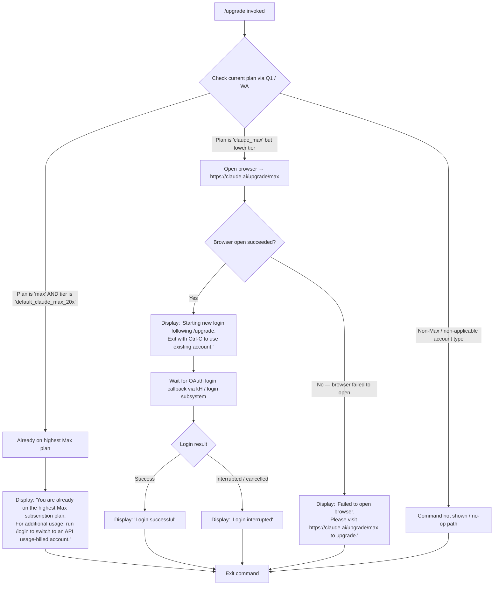

# `/upgrade`

> Analysis basis: CC v2.1.162 bundle.js (AST extraction + Claude interpretation)
> Minimum version: v2.1.162

---

## Overview

The `/upgrade` command guides users who are authenticated via the Claude Max subscription path toward upgrading to a higher Max plan tier that offers higher rate limits and additional access to Opus models. It checks the current subscription level, opens the upgrade URL (`https://claude.ai/upgrade/max`) in the system browser when appropriate, and optionally initiates a new login flow so the refreshed subscription is immediately reflected in the session.

---

## Registration

| Field | Value |
|---|---|
| type | `local-jsx` |
| name | `upgrade` |
| description | `Upgrade to Max for higher rate limits and more Opus` |
| loc_byte | `12638164` |
| loc_byte_end | `12638411` |
| loc_line | `8938` |
| module_id | `XKA` |
| load_inline | `true` |
| arbor_handler.name | `JS6` |
| arbor_handler.fqn | `claude-2.1.162::JS6` |
| arbor_handler.kind | `AsyncFunction` |
| arbor_handler.resolution_path | `module_id` |
| arbor_handler.n_hits | `0` |

Analysis basis: CC v2.1.162 bundle.js:+12638164

---

## Input Branching

Four distinct paths exist depending on the current auth/subscription state, requiring a Mermaid flowchart.



Analysis basis: CC v2.1.162 bundle.js:+12637295 (plan literal `"max"`), +12637320 (tier literal `"default_claude_max_20x"`), +12637439 (`"claude_max"`), +12637693 (upgrade URL), +12637525 (`setTimeout` / wait logic), +12637690 (browser-open call via `bK`), +12637765 (post-browser message), +12637884 / +12637903 (login outcomes), +12637957 (browser-fail message)

---

## Behavioral Spec

### 1. Plan-State Inspection

```
async function upgradeCommandHandler(appState):
    currentPlan  = getPlanInfo(appState)          // calls planResolver (WA) + authStateReader (Q1)
    planType     = currentPlan.type               // e.g. "max", "claude_max"
    planTier     = currentPlan.tier               // e.g. "default_claude_max_20x"

    if planType == "max" and planTier == "default_claude_max_20x":
        displayMessage(ALREADY_ON_MAX_MESSAGE)    // literal at +12637540
        return
```

Analysis basis: CC v2.1.162 bundle.js:+12637209 (handler entry `JS6→WA`), +12637221 (`JS6→Q1`)

### 2. Auth-Method Guard

The plan resolver (`WA` → `AD`) inspects the authentication context to determine whether the upgrade path is applicable. Platform-level auth providers (Bedrock, Vertex, Foundry, Anthropic AWS, Mantle, firstParty) bypass the upgrade flow entirely. The OAuth profile type `"user_oauth"` is the targeted path; `"profile-implicit"` and `"claude-desktop-3p"` are distinguished as separate cases.

```
function resolveAuthContext(authState):
    provider = authState.provider        // "bedrock" | "foundry" | "anthropicAws" |
                                         // "mantle" | "vertex" | "firstParty"
    if provider in ENTERPRISE_PROVIDERS:
        return NOT_APPLICABLE

    authType = authState.type            // "user_oauth" | "profile-implicit" | ...
    if authType == "user_oauth":
        return OAUTH_USER_PATH
    // other types fall through to default handling
```

Analysis basis: CC v2.1.162 bundle.js:+2093914 (`"bedrock"`), +2093964 (`"foundry"`), +2094020 (`"anthropicAws"`), +2094074 (`"mantle"`), +2094122 (`"vertex"`), +2094131 (`"firstParty"`), +2992886 (`"user_oauth"`), +2992813 (`"profile-implicit"`)

### 3. Browser Launch

When the plan is upgradeable, the handler delegates to the browser-open utility (`bK`) with the fixed URL `https://claude.ai/upgrade/max`.

```
async function openUpgradeBrowser():
    url = "https://claude.ai/upgrade/max"        // literal at +12637693
    try:
        success = await browserOpen(url)         // bK → p$7 / bD / C8
        if not success:
            displayMessage(BROWSER_FAIL_MESSAGE) // literal at +12637957
            return false
    catch err:
        displayMessage(BROWSER_FAIL_MESSAGE)
        return false
    return true
```

The browser-open subsystem (`bK`) handles platform differences:
- **macOS** (`"darwin"`): uses `open` binary (literal at +6778741)
- **Windows** (`"win32"`): uses `rundll32 url,OpenURL` (literals at +6778667, +6778679)
- **Linux / other**: uses `xdg-open` (literal at +6778748)
- Validates that the URL scheme is `http:` or `https:` before launching (literals at +6778258, +6778280)

Analysis basis: CC v2.1.162 bundle.js:+12637690, +6778495, +6778567, +6778583

### 4. Post-Browser Login Flow

After successfully opening the browser, the handler displays a holding message and then initiates a new OAuth login sequence (reusing the same login subsystem as `/login`).

```
async function awaitUpgradeLogin(appState):
    displayMessage("Starting new login following /upgrade. " +
                   "Exit with Ctrl-C to use existing account.")   // literal at +12637765

    // setTimeout used for brief delay before login poll begins
    await delay()                                                  // +12637525

    result = await runLoginFlow(appState)                          // kH subsystem at +12637936

    if result.success:
        displayMessage("Login successful")                         // literal at +12637884
        triggerAPIKeyChangeCallback(appState)                      // _.onChangeAPIKey at +12637861
    else:
        displayMessage("Login interrupted")                        // literal at +12637903
```

Analysis basis: CC v2.1.162 bundle.js:+12637765, +12637525, +12637936, +12637861, +12637880, +12637884, +12637903

### 5. OAuth Profile Fetch (Login Subsystem)

The login subsystem (`UzH`) fetches the user's OAuth profile to confirm the upgraded subscription:

```
async function fetchOAuthProfile(token, env):
    url      = resolveOAuthEndpoint(env)    // p1 resolves prod/staging/local endpoints
    headers  = { "Content-Type": "application/json" }
    timeout  = 10000                        // ms, literal at +2100754

    try:
        response = await httpGet(url, headers, timeout)
        emitTelemetryLabel("oauth_profile_fetch")   // literal at +2100770
        return parseProfile(response)
    catch err:
        emitTelemetryLabel("oauth_profile_token_failed")  // literal at +2100837
        logError(err)
        return null
```

Endpoint resolution (`p1`) supports environments:
- `"prod"` — production Anthropic endpoint
- `"staging"` — `http://localhost:8000` (literal at +850937) / `http://localhost:4000` (+851024) / `http://localhost:3000` (+851114)
- `"local"` — `http://localhost:8205` (literal at +851697)
- Custom OAuth URL validated against approved endpoint list; rejects with `"CLAUDE_CODE_CUSTOM_OAUTH_URL is not an approved endpoint."` (literal at +852002)

Analysis basis: CC v2.1.162 bundle.js:+2100610, +2100664, +2100711, +2100726, +2100754, +2100770, +2100837

### 6. JSX Render Component

The command is registered as `local-jsx`, meaning the handler (`JS6`) returns a JSX element via `jKA.createElement` (at +12637726). The UI component renders inline within the Claude Code terminal interface rather than producing plain-text output, giving it a styled upgrade prompt appearance.

Analysis basis: CC v2.1.162 bundle.js:+12637726

---

## State & Side Effects

| Item | Detail |
|---|---|
| Telemetry | `tengu_feature_ok` (bundle.js:+1008233); `tengu_feature_sad` (bundle.js:+1008376) |
| OAuth telemetry labels | `oauth_profile_fetch` (+2100770); `oauth_profile_token_failed` (+2100837); `api_bootstrap_fetch` (+15591315) |
| Browser launch | Opens `https://claude.ai/upgrade/max` in system browser via platform-specific command |
| API key / auth state change | Calls `_.onChangeAPIKey` callback on successful login (+12637861), refreshing session credentials |
| Login subsystem | Reuses full OAuth login flow (same path as `/login`); may write new credentials to storage via `kH` |
| Logging | Errors logged via `Dr.logError` (+1013997) |
| Hook registration | `jJA.register` called within logging subsystem (+60123) |
| setTimeout | Brief delay introduced before login poll begins (+12637525) |
| Sound | <!-- TODO: not found in depth-2 traversal; needs --depth 4 --> |
| appState changes | Auth token and subscription plan updated in appState upon successful login |

---

## Version History

| Version | Change |
|---|---|
| v2.1.162 | Initial analysis |

---

## Common Mistakes

1. **Running `/upgrade` on an API-key–billed account**: The upgrade flow targets Claude Max subscription users (`"claude_max"` plan type). Users on API-key billing should use the Anthropic Console to manage usage, not this command.
2. **Running `/upgrade` on enterprise/cloud providers**: Users authenticated via Bedrock, Vertex, Foundry, Anthropic AWS, or Mantle will not see the upgrade option; the command resolves to a no-op for those provider types.
3. **Already on the highest tier**: If the user is already on `"default_claude_max_20x"`, the command immediately exits with an informational message suggesting `/login` to switch to API-billed usage instead. No browser is opened.
4. **Browser not opening**: In headless or restricted environments the browser launch may silently fail. The fallback message instructs manual navigation to `https://claude.ai/upgrade/max`.
5. **Pressing Ctrl-C during login**: Interrupting the post-browser login flow produces `"Login interrupted"` — the subscription upgrade in the browser may still have succeeded, but the local session will not be refreshed until `/login` is run again.
6. **Custom OAuth URL rejection**: If `CLAUDE_CODE_CUSTOM_OAUTH_URL` is set to an unapproved endpoint, the OAuth profile fetch will throw before any upgrade can complete.

---

## Appendix — Identifier Mapping

> For bundle debugging only. Identifiers change across versions.

| Identifier | Role |
|---|---|
| `JS6` | Main upgrade command handler (AsyncFunction; Arbor arbor_handler) |
| `WA` | Plan/auth state resolver called by handler |
| `AD` | Auth context dispatcher (routes by provider type) |
| `$4` | Generic utility / config accessor |
| `tH` | Low-level string/value helper |
| `pJ` | OAuth authentication detail reader |
| `la6` | OAuth sub-utility (calls network writer `wU`) |
| `idH` | Identity/profile helper (calls `tH`, `t3H`) |
| `xr` | Credential reader (calls `Ft4`, `Q51`) |
| `xV` | API key resolver (calls `$4`, `m8`, `yA`) |
| `gR` | Array inclusion checker (`Array.isArray`, `H.includes`) |
| `W5` | Platform auth type checker (calls `wA`) |
| `wA` | Auth type string comparator (calls `tH`) |
| `xX` | Auxiliary auth state field accessor |
| `OO` | OAuth state machine / token validation orchestrator |
| `zY6` | OAuth sub-step utility |
| `umH` | VSCode client-type guard (`"claude-vscode"` check) |
| `T36` | Token slice/trim helper (calls `Q51`) |
| `C6` | Telemetry event emitter (uses `Date.now`, `bWL`) |
| `QR` | History slice utility (`H.slice`, limit 20) |
| `YY6` | Profile identity resolver (calls `idH`) |
| `UzH` | OAuth profile fetch orchestrator |
| `p1` | OAuth endpoint URL resolver (prod/staging/local) |
| `$VA` | Environment detection helper |
| `jK4` | URL builder for OAuth endpoints |
| `hH` | HTTP client wrapper (calls `c`, `Z6`) |
| `c` | Core HTTP request primitive |
| `Z6` | HTTP response handler (calls `Zx6`) |
| `Zx6` | Low-level response parser |
| `t6` | Alternate HTTP client path (calls `c`, `Z6`) |
| `uO` | Request option builder |
| `v` | HTTP request dispatcher (method/header assembler) |
| `PgK` | Request pipeline (calls `Xy`, `XgK`, `PJA`) |
| `PJA` | Request finalizer (calls `GUK`, `EUK`) |
| `H` | Bootstrap fetch orchestrator |
| `_3` | Bootstrap config reader |
| `AY_` | String parser (split/trim/indexOf/slice) |
| `LHH` | Cache lookup (`Y94.has`) |
| `bJ` | String replacer (`H.replace`) |
| `a1` | Response normalizer (calls `oHH`, `qq`, `rX`) |
| `SH` | JSON serializer (`JSON.stringify`) |
| `V4` | Path/filename extractor (lastIndexOf, slice) |
| `rXA` | Array mapper (`YgK.map`) |
| `q` | File system accessor (uses `OCK.unlinkSync`) |
| `A` | String lowercaser (`f.toLowerCase`) |
| `WpH` | Write helper (calls `pXA`) |
| `pXA` | Raw write primitive (`H.write`) |
| `EgK` | Structured log / file append orchestrator |
| `dmH` | Debounced write scheduler (setTimeout/clearTimeout/setImmediate) |
| `E3H` | Log entry formatter (calls `_p6`, `s8`, `S6`) |
| `i6` | Directory path resolver |
| `zL6` | File size checker (calls `V8`) |
| `_PA` | File path joiner (`Qe.join`, `S6`) |
| `HPA` | File rotation handler (stat/rename/unlink) |
| `GgK` | File append with rotation (mkdir/appendFile/zL6/_PA/HPA) |
| `J9` | Signal/hook registrar (`jJA.register`) |
| `kH` | Login flow orchestrator (calls `t_`, `tH`, `wq`, `Gj4`) |
| `t_` | Error wrapper (Error, String) |
| `wq` | Login queue processor (calls `UyA`) |
| `UyA` | Auth update applier (calls `tH`) |
| `Gj4` | Login queue manager (shift/push on `vQ6`) |
| `bK` | Browser open utility (platform dispatch) |
| `p$7` | URL scheme validator (throws on non-http/https) |
| `bD` | Browser command builder |
| `C8` | Browser launch executor (calls `C_`, `x6`) |
| `C_` | Process spawn coordinator (calls `wTH`, `Y`, `oP4`, `q$`, `v`, `V8`, `kH`) |
| `wTH` | Child process manager (spawn, promise, rejection) |
| `Y` | Forced shutdown handler (process.exit, z.abort) |
| `oP4` | Exit code stringifier |
| `q$` | Process cleanup helper |
| `V8` | File stat/size utility |
| `x6` | Async-local-storage context reader (calls `RQ6`, `X_`) |
| `RQ6` | Store retrieval (`SQ6.getStore`, `hi`) |
| `X_` | Context fallback accessor (calls `Nv`) |

---

Note: index built via Arbor fallback; some signals (telemetry, literals) may be missing — see arbor-fallback.js.