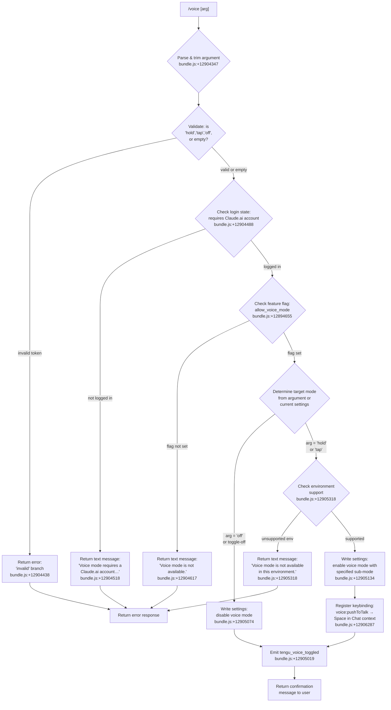

# `/voice`

> Analysis basis: CC v2.1.162 bundle.js (AST extraction + Claude interpretation)
> Minimum version: v2.1.162

---

## Overview

The `/voice` command toggles voice mode in Claude Code, with three sub-modes: `hold` (push-to-talk), `tap` (tap-to-toggle), and `off` (disabled). It performs an entitlement check against the `allow_voice_mode` feature flag and, when enabling, registers a keybinding (`voice:pushToTalk` on the Space key in the Chat context). The command is implemented as an async handler (`Zbf`) that reads, validates, and writes user settings.

---

## Registration

| Field | Value |
|---|---|
| type | `local` |
| name | `voice` |
| description | `Toggle voice mode` |
| argumentHint | `[hold\|tap\|off]` |
| supportsNonInteractive | `false` |
| isHidden | `null` |
| module_id | `QKK` |
| load_inline | `true` |
| loc_byte | `12907023` |
| loc_byte_end | `12907265` |
| loc_line | `9471` |
| arbor_handler.name | `Zbf` |
| arbor_handler.fqn | `claude-2.1.162::Zbf` |
| arbor_handler.kind | `AsyncFunction` |
| arbor_handler.resolution_path | `module_id` |
| arbor_handler.n_hits | `1` |

Analysis basis: CC v2.1.162 bundle.js:+12907023

---

## Input Branching

The handler has 5+ distinct branches based on the argument value and runtime state checks, requiring a Mermaid flowchart.



---

## Behavioral Spec

### Argument Parsing and Validation

The handler starts by trimming the raw argument string and normalizing it.

```
function parseVoiceArgument(rawArg):
    trimmed = rawArg.trim()
    if trimmed is empty:
        return {mode: null, valid: true}  // toggle behavior
    normalized = trimmed.toLowerCase()
    if normalized in {"hold", "tap", "off"}:
        return {mode: normalized, valid: true}
    else:
        return {mode: null, valid: false}
```

Valid argument literals: `"hold"` (bundle.js:+12904394), `"tap"` (bundle.js:+12904406), `"off"` (bundle.js:+12904417). An unrecognized token maps to the `"invalid"` branch (bundle.js:+12904438).

Analysis basis: CC v2.1.162 bundle.js:+12904347

### Login and Entitlement Check

Before any mode change, the handler verifies two preconditions:

1. **Claude.ai account check** — if the user is not logged in, returns a static text message: `"Voice mode requires a Claude.ai account. Please run /login to sign in."` (bundle.js:+12904518).
2. **Feature flag check** — reads the `"allow_voice_mode"` entitlement flag (bundle.js:+12894655) via the settings/entitlement subsystem (`i_` → `_U` chain, bundle.js:+12904655). If the flag is absent or false, returns: `"Voice mode is not available."` (bundle.js:+12904617).

```
async function checkVoicePreconditions(appState, settings):
    if not appState.isLoggedIn():
        return {ok: false, message: "Voice mode requires a Claude.ai account…"}
    entitlements = await loadEntitlements(settings)
    if not entitlements.has("allow_voice_mode"):
        return {ok: false, message: "Voice mode is not available."}
    return {ok: true}
```

Analysis basis: CC v2.1.162 bundle.js:+12904488, +12894655

### Environment Support Check

When enabling voice (mode is `"hold"` or `"tap"`), the handler checks whether the runtime environment supports audio capture. On unsupported platforms it returns: `"Voice mode is not available in this environment."` (bundle.js:+12905318).

```
function checkEnvironmentSupport():
    if not environmentSupportsVoice():
        return {supported: false, message: "Voice mode is not available in this environment."}
    // Also surfaces microphone permission hint:
    // "System Settings → Privacy & Security → Microphone"
    return {supported: true}
```

The microphone permission hint string `"System Settings → Privacy & Security → Microphone"` appears at bundle.js:+12905825.

Analysis basis: CC v2.1.162 bundle.js:+12905318

### Settings Write and Voice Mode Toggle

The handler calls into the settings persistence layer (`r_` function chain, bundle.js:+12904838) to write the new voice mode value.

```
async function applyVoiceModeChange(targetMode, currentSettings):
    if targetMode == "off" or (targetMode is null and voiceCurrentlyEnabled):
        newSettings = currentSettings.with({voiceMode: false})
        result = await writeSettings(newSettings)
        if result.error:
            return {ok: false, message: "Failed to update settings…"}
        return {ok: true, message: "Voice mode disabled."}
    else:
        newSettings = currentSettings.with({voiceMode: targetMode})
        result = await writeSettings(newSettings)
        if result.error:
            return {ok: false, message: "Failed to update settings…"}
        return {ok: true}
```

Error message on write failure: `"Failed to update settings. Check your settings file for syntax errors."` (bundle.js:+12904936).

Disabled confirmation: `"Voice mode disabled."` (bundle.js:+12905074).

Analysis basis: CC v2.1.162 bundle.js:+12904838, +12904936, +12905074

### Keybinding Registration

When voice mode is successfully enabled (not `"off"`), the handler registers a push-to-talk keybinding via the `qP` subsystem (bundle.js:+12906284):

- **Action**: `"voice:pushToTalk"` (bundle.js:+12906287)
- **Context**: `"Chat"` (bundle.js:+12906306)
- **Key**: `"Space"` (bundle.js:+12906313)

This uses the keybinding loader (`kvH`) that reads `keybindings.json` (bundle.js:+3853104) and validates the `"bindings"` array structure.

```
function registerVoiceKeybinding():
    binding = {
        context: "Chat",
        key: "Space",
        action: "voice:pushToTalk"
    }
    keybindingSystem.register(binding)
```

Analysis basis: CC v2.1.162 bundle.js:+12906284, +12906287

### MCP Server Refresh (Side Effect)

The handler calls into the MCP server management layer (`M` → `RCH` → `ROA` chain, bundle.js:+12905593) after state changes. This refreshes the active MCP connections to ensure any voice-related MCP tools are reflected in the current session state.

Analysis basis: CC v2.1.162 bundle.js:+12905593

---

## State & Side Effects

| Item | Detail |
|---|---|
| Telemetry | `tengu_voice_toggled` (bundle.js:+12905019) — fired on every successful mode change |
| Telemetry (indirect) | `tengu_feature_ok` (bundle.js:+1008233), `tengu_feature_bad` (bundle.js:+1008295), `tengu_feature_sad` (bundle.js:+1008376) — feature flag check results |
| Telemetry (indirect) | `tengu_keybinding_customization_release` (bundle.js:+3852590), `tengu_custom_keybindings_loaded` (bundle.js:+3853010), `tengu_keybinding_fallback_used` (bundle.js:+3862048) — keybinding subsystem events |
| Settings write | Writes `voiceMode` field to user settings via the settings persistence layer (`r_`); uses atomic file write with `writeFileSync` / `fsyncSync` (bundle.js:+1055825, +1055949) |
| Keybinding registration | Registers `voice:pushToTalk → Space` in the `Chat` context when enabling; uses `jJA.register` (bundle.js:+60123) |
| appState changes | Reads and updates the voice mode state; the MCP server manager (`M`) is invoked to sync connected tool state |
| Sound | No direct audio playback in the command handler itself; audio capture is managed separately by the voice mode runtime once enabled |
| Hook registration | `bWL` sets up a file watcher (`o18.watchFile`) for settings file changes (bundle.js:+3252754) |
| Event emit | `oBH.emit` is called at bundle.js:+12905263 (via `r_`) to notify listeners of the settings change |

---

## Version History

| Version | Change |
|---|---|
| v2.1.162 | Initial analysis |

---

## Common Mistakes

1. **Running without a Claude.ai login**: The command always checks for an authenticated Claude.ai account first. Using `/voice` without running `/login` will produce an error, regardless of argument.
2. **Using `/voice` in unsupported environments**: Even with a valid account and the `allow_voice_mode` entitlement, certain runtime environments (e.g., remote-only terminals without audio device access) will block enabling voice. Check `System Settings → Privacy & Security → Microphone` on macOS.
3. **Expecting `/voice` to work without the `allow_voice_mode` entitlement**: This flag is controlled server-side per account. Users without the entitlement see `"Voice mode is not available."` — this is not a configuration issue.
4. **Passing an unrecognized argument**: Only `hold`, `tap`, and `off` are valid. Any other token triggers the invalid-argument branch and returns an error without changing state.
5. **Settings file syntax errors**: If the user settings file contains JSON errors, the write will fail. The command will report `"Failed to update settings. Check your settings file for syntax errors."` and voice mode will remain unchanged.

---

## Appendix — Identifier Mapping

> For bundle debugging only. Identifiers change across versions.

| Identifier | Role |
|---|---|
| `Zbf` | Main async handler for `/voice` command (arbor_handler) |
| `f96` | Voice mode prerequisite checker (login + flag) |
| `u4A` | Entitlement flag reader, calls into settings loader |
| `AD` | Authentication state resolver |
| `$4` | Auth token/profile getter |
| `pJ` | OAuth profile state reader |
| `W5` | First-party auth check |
| `OO` | API key / auth environment validator |
| `YY6` | Identity helper (wraps `idH`) |
| `idH` | Identity data accessor |
| `zZ` | Entitlement flag checker (wraps `Q1`) |
| `BS6` | Secondary prerequisite check result |
| `m4A` | Voice availability pre-check dispatcher |
| `W9` | Voice availability / plan tier checker |
| `FK9` | Plan tier feature resolver |
| `JC` | Plan-level voice capability checker |
| `wq` | Network traffic classification utility |
| `u4H` | Utility string helper |
| `rvH` | Reconnect / availability check helper |
| `i_` | Settings loader entry point |
| `_U` | Settings load orchestrator |
| `pT` | Settings pre-load hook |
| `C9` | Memory usage sampler during settings load |
| `Kx` | Dynamic `require` loader for perf_hooks |
| `IH_` | Core settings loading function |
| `X8` | Log file appender |
| `Mu6` | Settings load metric recorder |
| `VM6` | Flag settings merger |
| `xxA` | Settings object builder |
| `COH` | Settings path resolver |
| `FQ` | SDK inline settings handler |
| `RxA` | Settings validator |
| `gQ` | Settings object factory / registry |
| `X_` | Settings key normalizer |
| `NM6` | WSL / platform settings loader |
| `fu6` | Settings load finalizer |
| `Tbf` | Argument parser for `/voice` (trim + validate `hold`/`tap`/`off`) |
| `H` | HTTP bootstrap / config fetch utility |
| `v` | Config file reader/parser |
| `PgK` | Config file path resolver |
| `SH` | JSON serializer utility |
| `V4` | Config value extractor |
| `WpH` | Config path helper |
| `EgK` | Config file writer |
| `AY_` | Argument string splitter/trimmer |
| `LHH` | Feature flag set checker |
| `bJ` | String replacement utility |
| `a1` | Model alias resolver |
| `oHH` | Model shortname expander |
| `qq` | Model name normalizer |
| `rX` | Model name canonicalizer |
| `t6` | Telemetry event emitter (feature ok/bad/sad) |
| `c` | Core async scheduler / promise utility |
| `Z6` | Telemetry event dispatcher |
| `r_` | Settings write orchestrator |
| `gO` | Settings persistence entry point |
| `i6` | File I/O helper |
| `vH_` | Settings file writer |
| `gP` | Config file loader |
| `wr` | Raw file reader with encoding detection |
| `R$` | Real path resolver |
| `CQ6` | File read helper |
| `bQ6` | File slice helper |
| `R8` | Error code checker (ENOENT etc.) |
| `V8` | Error constructor helper |
| `Te8` | Timestamp recorder |
| `yTH` | Settings path helper (wraps `jc6`) |
| `jc6` | Settings directory path builder |
| `u56` | Atomic file write utility |
| `O` | OS stat/symlink utility |
| `x8` | Background session state |
| `cz` | Cache clearer (Lu6, VB8) |
| `Zd6` | Settings file read/write manager |
| `x6` | Async store context getter |
| `RQ6` | Async local store getter |
| `Ke8` | Config key normalizer |
| `A` | String lowercaser / utility |
| `Td6` | Git-ignore aware file filter |
| `C_` | Git check-ignore runner |
| `I24` | Path normalizer (tilde expansion, absolute check) |
| `ZCA` | Git ls-files tracker |
| `VCA` | Settings write validator |
| `Ix` | `.claude` directory path builder |
| `hH` | Telemetry feature-bad emitter wrapper |
| `RH` | Telemetry feature-sad emitter wrapper |
| `kH` | Settings write error handler / logger |
| `t_` | Error code stringifier |
| `tH` | String coercer |
| `Gj4` | Write queue manager |
| `M` | MCP server state manager / refresh dispatcher |
| `RCH` | MCP connection orchestrator |
| `jl` | MCP server list builder |
| `T06` | MCP server entry formatter |
| `g_H` | MCP server configuration processor |
| `Jl` | MCP SDK server collector |
| `hz8` | MCP error color formatter |
| `E06` | SSE/HTTP MCP server handler |
| `sI` | MCP server status aggregator |
| `nO` | MCP server status helper |
| `CR_` | MCP connection result handler |
| `q_` | Settings key extractor |
| `sI6` | MCP server slot filter |
| `Pvq` | MCP connection needs-auth cache |
| `Ps_` | MCP auth cache path builder |
| `AXH` | MCP config hasher |
| `kz8` | MCP config key extractor |
| `yz8` | MCP config hash calculator |
| `wP` | MCP config SHA256 hasher |
| `vz8` | MCP config value normalizer |
| `W4` | Nj1 wrapper |
| `Y8` | MCP debug logger |
| `ja_` | MCP server connector |
| `SAf` | MCP server connect initiator |
| `BQ` | Notification sender |
| `y1H` | MCP claudeai-proxy handler |
| `h1H` | MCP server connect helper |
| `S1H` | MCP OAuth flow manager |
| `z_6` | MCP connection state map manager |
| `Y` | Process exit / abort handler |
| `FN8` | MCP connection cache reader |
| `Dn` | MCP reconnect manager |
| `Nx` | Notification utility |
| `D` | Daemon supervisor writer |
| `G7` | MCP error logger |
| `TH` | String coercer (error messages) |
| `RAf` | MCP reconnect result handler |
| `hAf` | SSH environment MCP checker |
| `Xa_` | MCP complete-authentication handler |
| `O_6` | MCP RN8 state getter |
| `D_6` | MCP CN8 state getter |
| `kvq` | MCP connection slot runner |
| `V9` | Async store context reader |
| `jv8` | MCP cache path builder |
| `Ja_` | MCP tool list fetcher |
| `IR_` | MCP server include checker |
| `G8` | Global config writer |
| `J` | Background worker process killer |
| `k` | Chokidar file watcher |
| `hN` | MCP skills loader |
| `j6` | MCP skills cache reader |
| `Tvq` | MCP protocol validator |
| `PB` | Promise-based stream reader |
| `I_6` | MCP timeout int parser |
| `Xv8` | MCP retry count int parser |
| `xp8` | MCP connection result applier |
| `SCH` | MCP config hasher (secondary) |
| `hk` | MCP slot cleanup handler |
| `N_6` | MCP slot config hasher |
| `$` | MCP daemon status reporter |
| `p1K` | Daemon status file writer |
| `Ur` | gKH wrapper |
| `GS6` | Daemon status path builder |
| `ROA` | MCP server refresh orchestrator |
| `Rz8` | MCP server filter (active check) |
| `n8` | Timeout/abort utility |
| `qP` | Keybinding loader and registrar |
| `O48` | Keybinding system initializer |
| `kvH` | Keybinding file parser |
| `A0_` | Keybinding entry builder |
| `fB` | Keybinding skill lookup |
| `ZLH` | Keybinding path builder |
| `p6` | JSON.parse wrapper |
| `f48` | Keybinding block validator |
| `q48` | Keybinding action extractor |
| `J_9` | Keybinding parse helper |
| `H0_` | Duplicate key detector |
| `_0_` | Keybinding normalizer |
| `z48` | Keybinding default builder |
| `M0_` | Keybinding default entry factory |
| `f0_` | Keybinding znH wrapper |
| `f_9` | Keybinding list mapper |
| `kyL` | Platform-specific keybinding formatter |
| `E6` | Zx6 wrapper |
| `Zx6` | Error base class initializer |
| `vmH` | Language/locale checker |
| `C6` | Config file watcher setup |
| `zj_` | Config watch helper |
| `DYH` | Config file reader with git-ignore check |
| `Zx` | String prefix stripper |
| `$n1` | Config directory scanner |
| `Xj_` | Config backup path builder |
| `w` | Background session manager |
| `S` | Background session writer |
| `zC8` | Memory low-water checker |
| `Gj6` | Background session config reader |
| `F` | Background session state tracker |
| `yzA` | Background session Unix socket connector |
| `xzA` | Background session lifecycle manager |
| `C` | Rate limit event queue |
| `bWL` | Settings file watcher registrar |
| `jo` | File watch debouncer |
| `J9` | Hook registrar (`jJA.register`) |

---

Note: index built via Arbor fallback; some signals (telemetry, literals) may be missing — see arbor-fallback.js.