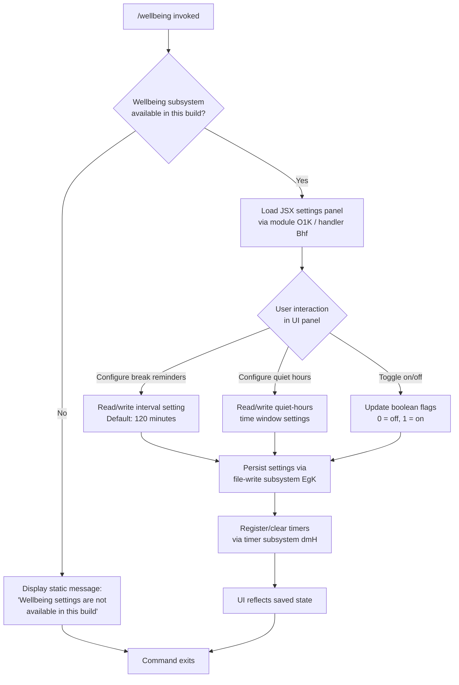

# `/wellbeing`

> Analysis basis: CC v2.1.162 bundle.js (AST extraction + Claude interpretation)
> Minimum version: v2.1.162

---

## Overview

`/wellbeing` opens a configuration interface for optional developer wellbeing features, specifically break reminders and quiet-hours nudges. The command is registered as a `local-jsx` type, meaning it renders a React/JSX component directly in the CLI rather than dispatching to the AI agent. In builds where the wellbeing subsystem is unavailable, the handler immediately surfaces a static unavailability notice.

---

## Registration

| Field | Value |
|---|---|
| type | `local-jsx` |
| name | `wellbeing` |
| description | Configure optional break reminders and quiet-hours nudges |
| aliases | `breaks`, `break-reminder`, `downtime` |
| immediate | `true` |
| module_id | `O1K` |
| load_inline | `true` |
| loc_byte | 12664562 |
| loc_byte_end | 12664815 |
| loc_line | 8947 |
| arbor_handler.name | `Bhf` |
| arbor_handler.fqn | `claude-2.1.162::Bhf` |
| arbor_handler.kind | `AsyncFunction` |
| arbor_handler.resolution_path | `module_id` |
| arbor_handler.n_hits | 0 |

Analysis basis: CC v2.1.162 bundle.js:+12664562

---

## Input Branching

The command has two distinct top-level branches (build supports wellbeing vs. does not), plus several internal sub-branches within the settings UI. The top-level split is binary; a flowchart best captures the overall shape.



---

## Behavioral Spec

### Availability Guard

When the handler `Bhf` is entered, the first operation is an availability check. If the wellbeing feature subsystem is absent from the current build, the handler resolves immediately with the static string "Wellbeing settings are not available in this build" and performs no further work.

```
async function wellbeingHandler(context):
    if not wellbeingSubsystemAvailable():
        return displayStaticMessage(
            "Wellbeing settings are not available in this build"
        )
    return renderWellbeingPanel(context)
```

Analysis basis: CC v2.1.162 bundle.js:+12663913

### Default Interval and Numeric Bounds

The break-reminder interval has a default value of **120 minutes** (bundle.js:+12663596). Internal range validation uses the literals `0` (bundle.js:+12663760) and `1` (bundle.js:+12663772) as boundary sentinels, indicating that the toggle state is represented as an integer flag (0 = disabled, 1 = enabled) distinct from the interval value itself.

```
function validateBreakInterval(rawInput):
    interval = parseInteger(rawInput)
    if interval < 1:
        interval = DEFAULT_BREAK_INTERVAL   // 120 minutes
    return interval

function resolveToggleState(rawValue):
    // 0 = off, 1 = on
    return clamp(rawValue, 0, 1)
```

Analysis basis: CC v2.1.162 bundle.js:+12663596, +12663760, +12663772

### Settings Persistence (File-Write Subsystem)

Settings are persisted through the file-write subsystem (`EgK` → `GgK`), which performs the following sequence:

```
async function persistSettings(settingsObject, configPath):
    dirPath = path.dirname(configPath)
    ensureDirectoryExists(dirPath)          // jy.mkdir
    serializedData = serializeSettings(settingsObject)
    byteCount = Buffer.byteLength(serializedData)
    if existingFile exists at configPath:
        rotateOrReplaceFile(configPath)     // HPA: rename, unlink
    appendToFile(configPath, serializedData) // jy.appendFile
    if byteCount exceeds rotation threshold:
        triggerLogRotation(configPath)      // zL6 → V8
    registerWriteCallback(GgK.bind(...))
```

Analysis basis: CC v2.1.162 bundle.js:+205306, +205339, +205458, +205507, +205513

#### File Rotation Sub-routine

The rotation helper (`HPA`) inspects the existing file with `jy.stat`, checks whether the path ends with `.txt` (bundle.js:+204765), slices the last 4 characters (bundle.js:+204787) to strip the extension for backup naming, performs a `jy.rename` to archive the current file, then calls `jy.unlink` to remove superseded copies.

Analysis basis: CC v2.1.162 bundle.js:+204661, +204754, +204776, +204817, +204857

### Timer Subsystem (Break Reminder Scheduling)

The timer management function (`dmH`) is the core scheduling engine for break reminders:

```
function manageBreakTimer(settings):
    clearTimeout(existingTimer)
    if settings.breakRemindersEnabled:
        intervalMs = settings.breakIntervalMinutes * 60 * 1000
        // Internal debounce: max batch size 1000, flush threshold 100
        // (bundle.js:+59425, +59446)
        messages = buildReminderMessageList()   // $.join, L.join, j.join
        timerId = setTimeout(fireReminder, intervalMs)
        $.push(timerId)
        setImmediate(scheduleNextCheck)
        L.push(currentReminderEntry)
    else:
        cancelAllPendingReminders()
```

The subsystem maintains multiple internal queues (`$`, `L`, `j`) for pending reminder messages and timers. Batch limits of 1000 and 100 are present in the implementation (bundle.js:+59425, +59446).

Analysis basis: CC v2.1.162 bundle.js:+59537, +59578, +59701, +59736, +59794

### Bootstrap / Remote Configuration Fetch

The handler `H` called from `Bhf` (bundle.js:+12663911) performs an optional remote configuration bootstrap:

```
async function bootstrapWellbeingConfig():
    log("[Bootstrap] Fetching")          // bundle.js:+15590993
    response = await fetch(remoteConfigEndpoint, {
        headers: {
            "Content-Type": "application/json",
            "User-Agent": <agent string>
        },
        timeout: 5000                    // bundle.js:+15591194
    })
    configCache = e_.get(cacheKey)
    if response.ok:
        log("[Bootstrap] Fetch ok")      // bundle.js:+15591367
        parseAndMergeRemoteConfig(response)
    else:
        recordTelemetry("api_bootstrap_fetch", { result: "parse_failed" })
        // bundle.js:+15591315, +15591337
```

Analysis basis: CC v2.1.162 bundle.js:+15590993, +15591029, +15591078, +15591093, +15591112, +15591194, +15591315, +15591337, +15591367

### Argument Parsing and Subcommand Routing

The argument parsing chain (`a1` → `oHH` → `qq`) handles any inline arguments passed to `/wellbeing`:

```
function parseWellbeingArgs(rawArgString):
    normalized = rawArgString.trim().toLowerCase()
    tokens = splitArgString(normalized)     // AY_: split, trim, indexOf, slice
    for token in tokens:
        if token.startsWith("anthropic."):  // bundle.js:+2234431
            routeToFirstPartyHandler(token)
        elif isModelToken(token):           // pKH checks mKH list
            // model-tier tokens: opusplan, sonnet, haiku, opus, best
            // (bundle.js:+2240470, +2240511, +2240550, +2240589, +2240626)
            applyModelOverride(token)
        else:
            passToDefaultHandler(token)
```

Model-tier strings (`opusplan`, `sonnet`, `haiku`, `opus`, `best`) found in the call graph likely relate to a shared argument parser used across multiple commands; their relevance to `/wellbeing` specifically is limited.

Analysis basis: CC v2.1.162 bundle.js:+2236454, +2236491, +2234431, +2240470

### Hook Registration

The subsystem calls `jJA.register` (via `J9`, bundle.js:+60123) to register lifecycle hooks, ensuring that break reminder timers are properly torn down when the CLI session ends.

```
function registerWellbeingHooks():
    jJA.register("session_teardown", cancelAllPendingReminders)
```

Analysis basis: CC v2.1.162 bundle.js:+205668, +60123

---

## State & Side Effects

| Item | Detail |
|---|---|
| Telemetry | `tengu_feature_sad` (bundle.js:+1008376) — fired on feature-related error/sad path via `t6` → `c` |
| Timer state | `dmH` creates and tracks `setTimeout` / `setImmediate` handles; `clearTimeout` called on reconfiguration |
| Hook registration | `jJA.register` called via `J9` to bind session teardown cleanup (bundle.js:+60123) |
| File system | Config persisted via `jy.mkdir`, `jy.appendFile`, `jy.rename`, `jy.unlink`; log rotation triggered by `zL6` when byte threshold exceeded |
| Cache | Remote bootstrap config stored via `e_.get` cache map (bundle.js:+15591029) |
| appState changes | Settings object updated in-memory; reflected in JSX panel after write confirmation |
| Sound | <!-- TODO: not found in depth-2 traversal; needs --depth 4 --> |
| Network | Optional remote config fetch on panel open; 5000 ms timeout (bundle.js:+15591194) |

---

## Version History

| Version | Change |
|---|---|
| v2.1.162 | Initial analysis |

---

## Common Mistakes

1. **Using the command name instead of aliases**: `/wellbeing` accepts `breaks`, `break-reminder`, and `downtime` as equivalent entry points; all resolve to the same handler `Bhf`.
2. **Expecting AI-generated responses**: This is a `local-jsx` command — it renders a configuration panel, not an LLM response. No prompt is sent to the model.
3. **Assuming universal availability**: The handler performs an explicit availability guard at entry. Certain build configurations (e.g., enterprise-locked builds) will immediately return the unavailability message without rendering the UI.
4. **Ignoring the 120-minute default**: If break reminder interval is never explicitly configured, the system uses 120 minutes as the default. Passing `0` or a negative value will cause the default to be reinstated rather than disabling reminders — use the toggle flag (`0`/`1`) to disable.
5. **Assuming settings are in-memory only**: Settings are written to disk via the file-write subsystem; changes persist across CLI restarts. Deleting the config file manually may leave timers in an inconsistent state until the next `/wellbeing` invocation.

---

## Appendix — Identifier Mapping

> For bundle debugging only. Identifiers change across versions.

| Identifier | Role |
|---|---|
| `Uhf` | Module-level initializer / outer wrapper for wellbeing module |
| `phf` | Interval/absolute-value utility (calls `Math.abs`); validates numeric range |
| `Bhf` | Main async handler for `/wellbeing` (arbor_handler; resolved via module_id) |
| `H` | Bootstrap/fetch orchestrator; fetches remote config with Content-Type and User-Agent headers |
| `v` | Core settings read/write dispatcher; fans out to file, timer, and hook subsystems |
| `PgK` | Settings serialization helper |
| `PJA` | Sub-serializer calling `GUK` and `EUK` |
| `SH` | JSON stringify wrapper |
| `V4` | Path/string manipulation utility (replace, at, lastIndexOf, slice) |
| `rXA` | Map-based transformation over settings array (`YgK.map`) |
| `q` | File handle or path object; calls `OCK.unlinkSync` |
| `A` | Lowercase path/string object; calls `f.toLowerCase` |
| `WpH` | Write-stream wrapper calling `pXA` |
| `pXA` | Low-level write operation (`H.write`) |
| `EgK` | File-write subsystem entry point (mkdir, appendFile, rotation, hooks) |
| `dmH` | Timer management: clearTimeout, setTimeout, setImmediate, queue management |
| `E3H` | File-write completion handler (join, s8, S6 calls) |
| `i6` | Internal state accessor used during settings write |
| `zL6` | Log-rotation trigger; calls `V8`; handles `EISDIR` error code |
| `_PA` | Path join + `S6` call; constructs config file path |
| `HPA` | File-rotation sub-routine (stat, endsWith `.txt`, rename, unlink) |
| `GgK` | Append-and-rotate handler (mkdir, appendFile, zL6, _PA, HPA) |
| `J9` | Hook registrar; calls `jJA.register` for lifecycle cleanup |
| `_3` | Internal argument or state token used in bootstrap |
| `AY_` | Argument string tokenizer (split, trim, indexOf, slice) |
| `LHH` | Lookup/has-check against set `Y94` |
| `bJ` | String replacement utility (`H.replace`) |
| `a1` | Argument dispatch router (calls `oHH`, `qq`, `rX`) |
| `oHH` | Token classifier calling `k0`, `OqH`, `yA`, `Dd` |
| `k0` | Token type resolver (sub-classifier) |
| `OqH` | Option-query helper |
| `Dd` | Deep argument parser (trim, map, startsWith, includes, multiple sub-handlers) |
| `qq` | Normalized argument handler (trim, toLowerCase, replace, model-tier routing) |
| `Q0` | Calls `BKH`; likely a provider/config resolver |
| `pKH` | Model-list membership check (`mKH.includes`) |
| `qI` | Model-tier handler calling `UM` and `G5` |
| `LQH` | Alternate model-tier handler calling `G5` |
| `PE` | First-party model handler (`UM`, `G5`, `wA`; tag: `firstParty`) |
| `RJ1` | Delegates to `PE` |
| `UM` | Calls `wA`; model endpoint resolver; handles `anthropicAws`, `gateway` |
| `Xt6` | Checks `z8L.includes`; likely a zone/region inclusion check |
| `fQH` | Calls `tH`; formatting or header helper |
| `rX` | Retry/redirect handler calling `qq` and `g0` |
| `g0` | Model routing aggregator (WA, H6H, ozH, MQH, PE, A2, UM, wA, G5, qI; tag: `mantle`) |
| `t6` | Telemetry reporter; fires `tengu_feature_sad`, calls `c` and `Z6` |
| `c` | Telemetry emit primitive |
| `Z6` | Telemetry secondary path calling `Zx6` |
| `Zx6` | Telemetry sink / lowest-level event emitter |

---

Note: index built via Arbor fallback; some signals (telemetry, literals) may be missing — see arbor-fallback.js.