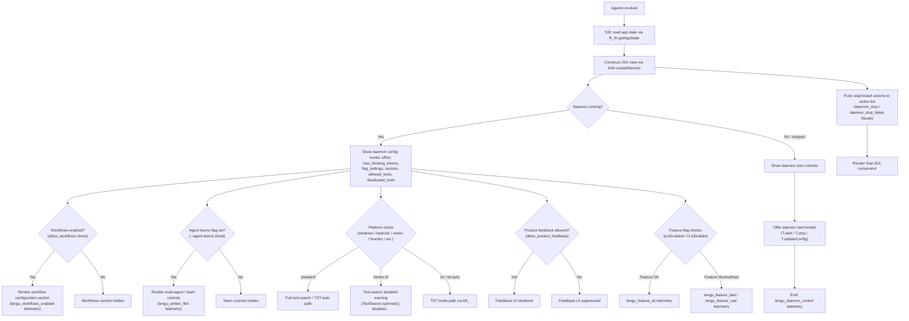

# `/agents`

> Analysis basis: CC v2.1.163 bundle.js (AST extraction + Claude interpretation)
> Minimum version: v2.1.163

---

## Overview

The `/agents` command provides a management interface for agent configurations within Claude Code. It renders a JSX-based UI component that allows users to inspect, configure, and control agent sessions — including daemon processes, tool permissions, model settings, and multi-agent orchestration parameters. The command is handled by an async function that reads current application state and constructs a rich interactive view over it.

---

## Registration

| Field | Value |
|---|---|
| type | `local-jsx` |
| name | `agents` |
| description | `Manage agent configurations` |
| module_id | `ZAK` |
| load_inline | `true` |
| loc_byte | `12563659` |
| loc_byte_end | `12563784` |
| loc_line | `9040` |
| arbor_handler.name | `SSf` |
| arbor_handler.fqn | `claude-2.1.163::SSf` |
| arbor_handler.kind | `AsyncFunction` |
| arbor_handler.resolution_path | `module_id` |
| arbor_handler.n_hits | `0` |

Analysis basis: CC v2.1.163 bundle.js:+12563659

---

## Input Branching

The command exhibits more than three distinct behavioral branches based on the agent and daemon state, tool permission state, workflows enablement, and model/effort configuration. A flowchart is used below.



---

## Behavioral Spec

### Top-Level Handler: `agentsCommandHandler` (`SSf`)

The command's async entry point resolves via `module_id: ZAK` → `load_inline: true`.

```
async function agentsCommandHandler(context):
    appState = getAppState()                    // via R_ → H.getAppState
    jsxRoot  = buildAgentsUI(appState, context) // via Av + K4A.createElement
    return jsxRoot
```

Analysis basis: CC v2.1.163 bundle.js:+12563510, +12563518, +12563531

---

### App-State Retrieval: `getAppState` (`R_`)

```
function getAppState():
    state = H.getAppState()
    lastEntry = state.findLast(predicate)         // A.findLast

    configSnapshot = buildConfigSnapshot(state)   // mk8 → L1
    sessionSnapshot = buildSessionSnapshot(state) // pk8 → L1

    // Parses working_directory, allowed_tools, disallowed_tools,
    // avoid_prompts, session, effort, model, max_thinking_tokens, flag_settings
    // from the state object
    return { lastEntry, configSnapshot, sessionSnapshot }
```

Key string constants observed in this path:

- `"working_directory"` (bundle.js:+10916025)
- `"allowed_tools"` (bundle.js:+10916080)
- `"disallowed_tools"` (bundle.js:+10916135)
- `"avoid_prompts"` (bundle.js:+10916196)
- `"session"` (bundle.js:+10916495)
- `"effort"` (bundle.js:+10916520)
- `"model"` (bundle.js:+10916533)
- `"max_thinking_tokens"` (bundle.js:+10916545)
- `"flag_settings"` (bundle.js:+10916571)

Analysis basis: CC v2.1.163 bundle.js:+10915920, +10916000, +10916098, +10916156

---

### Bootstrap Fetch Sub-path: `bootstrapFetcher` (`H`)

When the UI needs to refresh remote configuration, a bootstrap fetch is performed:

```
async function bootstrapFetcher(endpoint):
    log("[Bootstrap] Fetching", endpoint)        // literal at +15724218
    response = fetch(endpoint, {
        headers: {
            "Content-Type": "application/json",  // +15724303 / +15724318
            "User-Agent": <version string>        // +15724337
        },
        timeout: 5000                             // +15724419
    })
    if parse fails:
        emit telemetry("api_bootstrap_fetch", { result: "parse_failed" })
                                                  // +15724540, +15724562
    else:
        log("[Bootstrap] Fetch ok")               // +15724592
    return parsedConfig
```

Analysis basis: CC v2.1.163 bundle.js:+15724216

---

### Configuration Normalisation: `normaliseConfig` (`v`)

Processes raw configuration text before it is used for display or comparison:

```
function normaliseConfig(rawText, haystack):
    if rawText is "debug":                        // +206051
        useDebugPath(rawText)                     // ccK
    if haystack.includes(rawText):                // H.includes, +206115
        // found — use serialiser
        serialised = serialise(rawText)           // SH → JSON.stringify, +185153
    upper = rawText.toUpperCase()                 // +206177
    formatted = formatPath(upper)                 // J4
    trimmed = rawText.trim()                      // +206200
    validated = validateRange(trimmed)            // VR
    resolved = resolvePromptPath(trimmed)         // ppH → h2A
    fileContent = readConfigFile(trimmed)         // icK (file reader, see below)
    return { serialised, formatted, trimmed, fileContent }
```

Numeric constants within `ccK`:
- Sentinel value `1` (bundle.js:+204696)

Analysis basis: CC v2.1.163 bundle.js:+206051, +206093, +206115, +206133, +206177, +206197, +206200, +206216, +206222, +206236

---

### Config File Reader: `readConfigFile` (`icK`)

```
async function readConfigFile(filePath):
    basePath   = $pH(filePath)
    dirName    = KHH.dirname(filePath)             // +205596
    fullPath   = Vy(basePath, dirName)             // +205626
    ref        = Q6(fullPath)                      // +205641
    auxPath    = aL6(ref)                          // +205716
    rawBytes   = r2A(auxPath)                      // +205733
    decoded    = i2A(rawBytes)                     // +205765
    byteLen    = Buffer.byteLength(decoded)         // +205771
    if byteLen > 1000:                             // +205901 (limit: 100 chars/kB?)
        truncated = a2A(decoded)                   // +205804
    result = AU6.then(…).bind(ncK)(decoded)        // +205821, +205830
    if error:
        retry via j9                               // +205926
    // Internal limit constants:
    //   1000 ms  timeout (+205882)
    //   100      item/byte count limit (+205901)
    return result
```

Analysis basis: CC v2.1.163 bundle.js:+205563, +205771, +205882, +205901

---

### Path Formatter: `formatPath` (`J4`)

```
function formatPath(text):
    start    = g2A(text, 0)                      // start index = 0 (+198067)
    replaced = text.replace("[REDACTED]", "")    // +198141 — redacts sensitive tokens
    parts    = replaced.split(…)                 // q.at, +198199
    lastSep  = parts.lastIndexOf(separator)      // +198225
    segment  = parts.slice(lastSep + 2)          // +198251 (offset 2, +198170)
    return segment
```

Analysis basis: CC v2.1.163 bundle.js:+198062, +198089, +198141, +198170

---

### Model-Name Normalisation: `normaliseModelName` (`Aq`)

```
function normaliseModelName(raw):
    trimmed = raw.trim().toLowerCase()            // +2243153, +2243164
    switch trimmed:
        case "opusplan" → mapToOpusPlan           // +2243249
        case "[1m]"     → map1mTier               // +2243275
        case "sonnet"   → mapToSonnet             // +2243290
        case "haiku"    → mapToHaiku              // +2243329
        case "opus"     → mapToOpus               // +2243368
        case "best"     → mapToBest               // +2243405
        default         → applyReplacement(raw)   // A.replace, +2243192
    apply _4H, wI, NQH, NE, kX1, gM, Pe6, vQH transforms
    final = apply final replacement               // _.replace, +2243495
    return final
```

Analysis basis: CC v2.1.163 bundle.js:+2243153, +2243249, +2243290, +2243329, +2243368, +2243405

---

### Daemon Control: `daemonController` (`Y`)

The supervisor loop for daemon start/stop/reconfigure:

```
async function daemonController(daemonHandle, config):
    supervisor = "supervisor"                    // +16147911
    write initial status                         // q.write, +16147903
    displayTable = buildDisplayTable(config)     // iLK, +16148105
    // iLK uses Object.keys, Math.max, and column-width computation (vD)

    existing = f.get(daemonHandle)               // +16148159
    if existing:
        existing.stop()                          // E.stop, +16148179
        f.delete(daemonHandle)                   // +16148188
        T.stop()                                 // +16148299
        T.updateConfig(newConfig)                // +16148308

    heartbeatTimer = startHeartbeat()            // LmK → L8H; literal "heartbeat" +16147132
    T.start()                                    // +16148326
    f.set(daemonHandle, session)                 // +16148473
    V.start()                                    // +16148484
    emit tengu_daemon_config_reload              // +16148704
    return daemonHandle
```

Analysis basis: CC v2.1.163 bundle.js:+16147911, +16148105, +16148179, +16148308, +16148326, +16148704

---

### Daemon Stop Actions: `daemonStopHandler` (`z`, `hH`, `RH`)

```
async function daemonStopHandler(daemonRef):
    try:
        stop result = hH(daemonRef)              // "daemon_stop" +16170185
        emit tengu_daemon_control                // +16170260
    catch error:
        emit "daemon_stop_failed"                // +16170222
        log error

    // If already stopped: literal "stopped" +16170094
    // Background session handling: "background session" +16170137

    shutdown = Yh(daemonRef)                     // Yh → Au → LC (shutdown chain)
    // Uses firstParty flag (+3231954), randomUUID (+3231489), event emission
    race([
        Promise.all(shutdownTasks),              // Tp → Promise.race/all +16165261/+16165275
        timeoutAfter(500)                        // l8 with 500 ms timeout +16165303
    ])
    if timeout exceeded:
        process.exit()                           // +16165342
```

Analysis basis: CC v2.1.163 bundle.js:+16170182, +16170185, +16170205, +16170222, +16170257, +16170260, +16165261, +16165303, +16165342

---

### Agent-Teams / Multi-Agent Configuration: `agentTeamsConfig` (`n9`)

```
function agentTeamsConfig(state):
    // Activated only when --agent-teams flag is present (+5481138)
    eH(state)               // string coercion
    n97(state)              // teams-specific resolver
    D6(state)               // dependency graph builder
    emit tengu_amber_flint  // +5481250
```

Analysis basis: CC v2.1.163 bundle.js:+5481138, +5481173, +5481228, +5481247, +5481250

---

### Execution-Mode / Runtime-Type Resolver: `runtimeTypeResolver` (`kR_`)

```
function runtimeTypeResolver(runtimeDescriptor):
    switch runtimeDescriptor:
        case "standard"  → useStandardMode         // +6580060
        case "tst"       → useTSTMode              // +6580139
        case "tst-auto"  → useTSTAutoMode          // +6580189
        default          → fallback
    eH(descriptor)                                  // +6580203
    JK(descriptor)                                  // +6580224
    // Tool-search check via xN → v
    if provider is Vertex AI:
        warn "[ToolSearch:optimistic] disabled: Vertex AI …"
             // full warning literal at +6581073
```

Analysis basis: CC v2.1.163 bundle.js:+6580048, +6580060, +6580139, +6580189, +6580537, +6581073

---

### Provider-Type Check: `providerTypeCheck` (`XA`)

```
function providerTypeCheck(apiConfig):
    switch apiConfig.provider:
        case "bedrock"      → useBedrock    // +2096693
        case "foundry"      → useFoundry    // +2096743
        case "anthropicAws" → useAWS        // +2096799
        case "mantle"       → useMantle     // +2096853
        case "vertex"       → useVertex     // +2096901
        default             → "api.anthropic.com"  // +2097588
    return providerEndpoint
```

Analysis basis: CC v2.1.163 bundle.js:+2096653, +2096693, +2096901

---

### Daemon Status File: `daemonStatusFile` (`TKK` / `JR6`)

```
function daemonStatusFile(sessionDir):
    path = join(sessionDir, "daemon.status.json")  // +12743477
    timestamp = Date.now()                          // +12743589
    sessionId = N9.getStore()                       // FZL.getStore, +3369178
    record = JR6(path, sessionId, timestamp)        // +12743638
    serialised = SH(record)                         // JSON.stringify, +12743644
    return serialised
```

Analysis basis: CC v2.1.163 bundle.js:+12743477, +12743574, +12743589, +12743621, +12743638, +12743644

---

### Local-Agent Registration: `localAgentRegistration` (`PP`)

```
function localAgentRegistration(config):
    eH(config)                   // string normalisation
    ng8(config)                  // local-agent handler
    // Emits type "local-agent"  // +5351208
```

Analysis basis: CC v2.1.163 bundle.js:+5351126, +5351149, +5351208

---

### Workflow Enablement Check: `workflowEnabledCheck` (`WT_` / `yBL`)

```
function workflowEnabledCheck(userPlan, featureFlags):
    // Checks allow_workflows flag (+4179772)
    if featureFlags.allow_workflows:
        emit tengu_workflows_enabled             // +4179973
        if userPlan === "pro":                   // +4180218
            enableProWorkflows()
        eH(…); JK(…); D6(…); _q(…)
    else:
        skip workflows section
```

Analysis basis: CC v2.1.163 bundle.js:+4179772, +4179897, +4179925, +4179970, +4179973, +4180218

---

### Slate-Harbor Feature Gate: `slateHarborFeatureGate` (`MG` / `D6`)

```
function slateHarborFeatureGate(context):
    origin = context.origin  // "cli" (+4793579) or "remote" (+4793590)
    cQ(context)
    JK(context)
    eH(context)
    // Checks yDH.has(featureKey), B98 (feature-set lookup), tw6.add, eU.has/get
    // S6 → records timestamp, XTL notification
    emit tengu_slate_harbor                      // +4793609
```

Analysis basis: CC v2.1.163 bundle.js:+4793427, +4793444, +4793489, +4793579, +4793590, +4793606, +4793609

---

### Feature-Flag Telemetry Gate: `featureFlagTelemetryGate` (`s6` / `c` / `P6`)

```
function featureFlagTelemetryGate(featureRef):
    result = c(featureRef)
    if ok:
        P6(featureRef)                // Nu6 dependency (+3628)
        emit tengu_feature_ok         // +1010222
    elif bad:
        emit tengu_feature_bad        // +1010284
    elif sad (degraded):
        emit tengu_feature_sad        // +1010365
```

Analysis basis: CC v2.1.163 bundle.js:+1010222, +1010255, +1010282, +1010318, +1010363, +1010365, +1010399

---

### Tool-Narrowing / Permission Resolution: `toolNarrowingResolver` (`u1H` / `EI6` / `YMH` / `fHA`)

```
function toolNarrowingResolver(toolList, context):
    filtered = toolList.filter(…)                // H.filter, +9857386
    denyList = EI6(toolList, context)            // +9857401
    // EI6 path:
    //   YMH → tI8.flatMap, y3   (tool flattening, +10651376)
    //   fHA → K$6, L$6, RV      (tool categorisation, +10651713)
    //   cSq                      (conflict check, +10652143)
    // Key labels: "deny" (+10651453), "cliArg" (+10652039), "toolsNarrowing" (+10652060)
    if any tool "blocked":                       // +9857447
        markBlocked()
    return resolvedToolSet
```

Analysis basis: CC v2.1.163 bundle.js:+9857386, +9857401, +9857447, +10651376, +10651453, +10652039, +10652060, +10652102

---

### Cobalt-Ridge Agent Feature: `cobaltRidgeAgent` (`mC` / `V4`)

```
function cobaltRidgeAgent(agentConfig):
    // Platform exclusion: "windows" (+4910117) → skip on Windows
    a6(agentConfig)
    eH(agentConfig)
    JK(agentConfig)
    OKH(agentConfig)
    D6(agentConfig)
    emit tengu_cobalt_ridge                      // +4910211
```

Analysis basis: CC v2.1.163 bundle.js:+4910110, +4910117, +4910134, +4910143, +4910179, +4910208, +4910211

---

## State & Side Effects

| Item | Detail |
|---|---|
| Telemetry: `tengu_feature_ok` | Emitted when a feature gate passes successfully (bundle.js:+1010222) |
| Telemetry: `tengu_feature_bad` | Emitted when a feature gate check fails with a hard error (bundle.js:+1010284) |
| Telemetry: `tengu_feature_sad` | Emitted when a feature gate check yields a degraded/sad result (bundle.js:+1010365) |
| Telemetry: `tengu_slate_harbor` | Emitted during slate-harbor feature-gate evaluation (bundle.js:+4793609) |
| Telemetry: `tengu_daemon_config_reload` | Emitted after daemon config is applied/updated (bundle.js:+16148704) |
| Telemetry: `tengu_workflows_enabled` | Emitted when the `allow_workflows` flag is found active (bundle.js:+4179973) |
| Telemetry: `tengu_cobalt_ridge` | Emitted during cobalt-ridge agent feature initialisation (bundle.js:+4910211) |
| Telemetry: `tengu_daemon_control` | Emitted on daemon stop/start control actions (bundle.js:+16170260) |
| Telemetry: `tengu_amber_flint` | Emitted when the `--agent-teams` multi-agent path is activated (bundle.js:+5481250) |
| Telemetry: `api_bootstrap_fetch` | Emitted during remote config bootstrap; `parse_failed` variant on error (bundle.js:+15724540) |
| Daemon state | `T.stop()`, `T.updateConfig()`, `T.start()` mutate the running daemon; `f.set/get/delete` tracks session handles |
| Heartbeat timer | `LmK → L8H` registers a recurring heartbeat with literal label `"heartbeat"` |
| Daemon status file | Written to `daemon.status.json` in the session directory (bundle.js:+12743477) |
| Process exit | `process.exit()` is called if daemon shutdown does not complete within 500 ms (bundle.js:+16165342) |
| App state read | `H.getAppState()` is called at command entry; no direct write back observed at depth ≤ 2 |
| Sound | <!-- TODO: not found in depth-2 traversal; needs --depth 4 --> |

---

## Version History

| Version | Change |
|---|---|
| v2.1.163 | Initial analysis |

---

## Common Mistakes

1. **Expecting a text response**: `/agents` is a `local-jsx` command — it renders an interactive JSX UI component, not plain text output. Piping its output may yield nothing useful.
2. **Running on Windows with cobalt-ridge features**: The `cobaltRidgeAgent` path explicitly excludes the `"windows"` platform. Features that depend on it will be silently skipped on Windows hosts.
3. **Assuming tool lists are taken verbatim**: The `toolNarrowingResolver` applies `deny`, `cliArg`, and `toolsNarrowing` layers. A tool present in `allowed_tools` may still be blocked after narrowing.
4. **Expecting instant daemon shutdown**: If the daemon does not stop within 500 ms, `process.exit()` is called unconditionally — any pending state is lost.
5. **Using `/agents` on Vertex AI with tool-search**: The `runtimeTypeResolver` emits a warning and disables tool-search optimistic mode for Vertex AI providers unless `ENABLE_TOOL_SEARCH=true` is set in the environment.
6. **Expecting `--agent-teams` features without the flag**: The multi-agent team controls (including `tengu_amber_flint` telemetry) only activate when the `--agent-teams` CLI argument is present.

---

## Appendix — Identifier Mapping

> For bundle debugging only. Identifiers change across versions.

| Identifier | Role |
|---|---|
| `SSf` | Top-level `/agents` command handler (AsyncFunction) |
| `R_` | App-state retrieval helper |
| `H` | App-state/bootstrap fetch context object |
| `v` | Configuration normalisation function |
| `ccK` | Debug-path / sentinel configuration branch |
| `SH` | JSON serialiser wrapper (calls `JSON.stringify`) |
| `J4` | Path formatter / segment extractor |
| `ppH` | Prompt-path resolver (calls `h2A`) |
| `icK` | Config file reader (async, with timeout/truncation) |
| `e$` | App-state secondary accessor |
| `Pw_` | String-splitting / trimming utility |
| `q` | General-purpose collection / stream handle |
| `ZHH` | Feature-set membership checker (`g44.has`) |
| `uj` | String replacement utility |
| `t1` | Higher-level model-name transform entry point |
| `D6H` | Model-name transform step (calls `x0`, `IqH`, `SA`, `yd`) |
| `Aq` | Model-name normalisation (trim/lower/switch) |
| `eX` | Model-name transform wrapper (calls `Aq`, `r0`) |
| `s6` | Feature-flag telemetry gate entry |
| `c` | Feature-flag check primitive |
| `P6` | Feature-flag dependency resolver (`Nu6`) |
| `A` | Array/collection utility with `.findLast`, `.toLowerCase` |
| `f` | File/stream handle with `.close`, `.padEnd` methods |
| `L` | Async task tracker with `.add`, `.delete`, `.finally` |
| `mk8` | Config snapshot builder (calls `L1`) |
| `pk8` | Session snapshot builder (calls `L1`) |
| `L1` | Shared snapshot base constructor |
| `Av` | JSX UI component builder (assembles all sub-views) |
| `MG` | Slate-harbor gate outer wrapper |
| `cQ` | Slate-harbor sub-check |
| `JK` | String coercion wrapper (calls `String`) |
| `eH` | String coercion wrapper (calls `String`) |
| `D6` | Dependency/feature graph builder |
| `Hj6` | Dependency graph node helper |
| `_j6` | Dependency graph edge helper |
| `qu` | Dependency graph query (calls `Au`) |
| `B98` | Feature-set cache (checks `zX_`, `yDH`) |
| `S6` | Feature record with timestamp and notification (`XTL`) |
| `Y` | Daemon controller / supervisor manager |
| `C0H` | Display-table row builder |
| `N9` | Async-local-storage store accessor |
| `v8` | ENOENT error handler |
| `w7A` | Display column helper (calls `D7A`) |
| `EH` | String coercion helper |
| `K` | Column map utility (`.map`, `.padEnd`) |
| `iLK` | Table width calculator (`Object.keys`, `Math.max`, `vD`) |
| `E` | Event/keypress handler (preventDefault, remoteControl) |
| `b` | Event object |
| `t0` | User-settings state accessor |
| `T` | Daemon process handle (`.stop`, `.updateConfig`, `.start`) |
| `LmK` | Heartbeat scheduler (calls `L8H`) |
| `L8H` | Heartbeat timer implementation |
| `V` | Secondary process/session handle (`.start`) |
| `yo_` | Component initialiser (calls `DEq`, `k_`) |
| `k_` | Module bootstrap / ESModule flag setter |
| `Zu6` | Bound callback utility |
| `OP` | Feature/workflow orchestrator |
| `Q78` | Workflow pre-check (calls `eH`, `nT`) |
| `nT` | Notification / trigger helper |
| `iL9` | Workflow inner resolver (calls `W9`) |
| `W9` | Permission-flag checker (`vBL`, `IBL`, `EC`, `Dq`, `e4H`, `WIH`) |
| `WT_` | Workflow enablement resolver (calls `yBL`) |
| `yBL` | Pro-plan workflow gate |
| `kBL` | Workflow fallback notifier |
| `u1H` | Tool list filter entry point |
| `EI6` | Tool narrowing orchestrator |
| `YMH` | Tool flattener (`tI8.flatMap`) |
| `fHA` | Tool categoriser (`K$6`, `L$6`, `RV`) |
| `cSq` | Tool conflict checker |
| `ho_` | Agent component (calls `mC`, `M86`, `k_`) |
| `mC` | Cobalt-ridge agent feature (Windows-excluded) |
| `V4` | Agent variant (calls `a6`, `OKH`) |
| `z` | Daemon stop action list |
| `hH` | Daemon-stop success handler |
| `RH` | Daemon-stop failure handler |
| `Yh` | Daemon shutdown chain (calls `Au`, `QNH`, `$X_`) |
| `Au` | Shutdown base (calls `LC`) |
| `QNH` | Shutdown notifier (calls `zh`) |
| `$X_` | Shutdown finaliser (UUID, event emit) |
| `Tp` | Shutdown race/timeout orchestrator |
| `Ac` | KLH shutdown trigger |
| `fc` | Timeout cleanup (`clearTimeout`, `mX_`) |
| `l8` | Generic timeout promise (500 ms) |
| `Zt` | Agent configuration view builder |
| `PP` | Local-agent registration helper |
| `ng8` | Local-agent sub-handler |
| `ow` | Remote-origin handler (calls `JK`) |
| `Y_6` | Config view sub-section |
| `n9` | Agent-teams configuration handler |
| `n97` | Teams-specific resolver |
| `z8f` | Callback wrapper (calls `nGq`, `k_`) |
| `Y8f` | Callback wrapper (calls `tGq`, `k_`) |
| `xN` | Execution-mode entry (calls `kR_`, `v`, `XA`, `Hf`) |
| `kR_` | Runtime-type resolver (standard/tst/tst-auto) |
| `XA` | Provider-type check (bedrock/foundry/vertex/etc.) |
| `Hf` | Execution-mode finaliser |
| `C4` | Additional feature-flag check |
| `O` | Feature enablement checker (calls `b8`) |
| `b8` | Feature enablement primitive |
| `$` | Session/message collection |
| `TKK` | Daemon status file writer |
| `nr` | Status logger (calls `L4H`) |
| `JR6` | Status file path builder (`EKK.join`, `a8`) |

---

Note: index built via Arbor fallback; some signals (telemetry, literals) may be missing — see arbor-fallback.js.