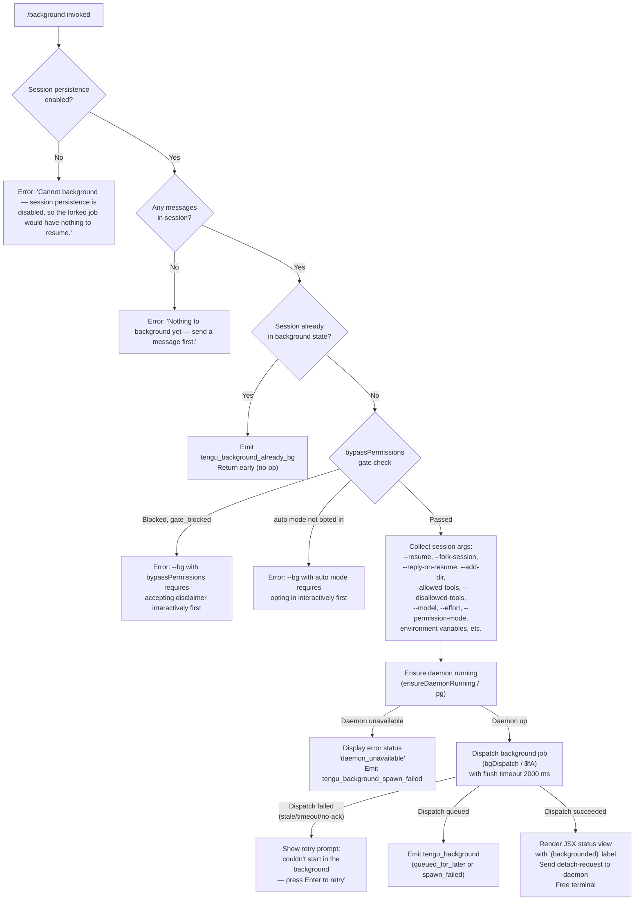

# `/background`

> Analysis basis: CC v2.1.163 bundle.js (AST extraction + Claude interpretation)
> Minimum version: v2.1.163

---

## Overview

`/background` (alias `/bg`) sends the current interactive Claude Code session to the background daemon, freeing the terminal while the session continues running. The command forks the active conversation into a background job managed by the daemon process and renders a JSX status view while the dispatch completes.

---

## Registration

| Field | Value |
|---|---|
| type | `local-jsx` |
| name | `background` |
| description | `Send this session to the background and free the terminal` |
| aliases | `["bg"]` |
| argumentHint | `[prompt]` |
| immediate | `null` |
| module_id | `f5K` |
| load_inline | `true` |
| loc_byte | `13073329` |
| loc_byte_end | `13073569` |
| loc_line | `9697` |
| arbor_handler.name | `qBf` |
| arbor_handler.fqn | `claude-2.1.163::qBf` |
| arbor_handler.kind | `AsyncFunction` |
| arbor_handler.resolution_path | `module_id` |
| arbor_handler.n_hits | `0` |

Analysis basis: CC v2.1.163 bundle.js:+13073329

---

## Input Branching

The command has five or more distinct exit paths based on session state, persistence settings, and daemon availability. A Mermaid flowchart is used.



Analysis basis: CC v2.1.163 bundle.js:+13072613 (handler `qBf`), +13068149 (arg literals), +13072694 (persistence error), +13072870 (no-message error), +13072627 (`tengu_background_already_bg`), +13069589 (`tengu_background`), +13068786 (`tengu_background_spawn_failed`)

---

## Behavioral Spec

### 1. Handler Entry — `qBf`

The Arbor-resolved handler (`qBf`, an `AsyncFunction`, resolved via `module_id` → `f5K`) is the top-level entry point.

```
async function backgroundCommandHandler(appState, prompt):
    // Guard: persistence required
    if not sessionPersistenceEnabled(appState):
        return renderError("Cannot background — session persistence is disabled...")
        // bundle.js:+13072694

    // Guard: must have at least one message
    if sessionMessages(appState).length == 0:
        return renderError("Nothing to background yet — send a message first.")
        // bundle.js:+13072870

    // Guard: already backgrounded
    if isAlreadyBackground(appState):
        emit("tengu_background_already_bg")   // bundle.js:+13072627
        return

    // Guard: bypassPermissions / auto-mode gate
    gateResult = checkBgGate(appState)        // calls Mi / HBf / c7A
    if gateResult == "gate_blocked":
        return renderError("--bg with bypassPermissions requires...")
    if gateResult == "auto_blocked":
        return renderError("--bg with auto mode requires...")

    // Build CLI args for forked session
    args = buildSessionArgs(appState)         // bundle.js:+13068149–13068430

    // Ensure the daemon is reachable
    daemonStatus = await ensureDaemonRunning()  // bundle.js:+13004709
    if daemonStatus != "up":
        emit("tengu_background_spawn_failed")
        return renderStatusView("daemon_unavailable")

    // Dispatch to background
    result = await dispatchBackground(args, prompt, flushTimeout=2000)
    // bundle.js:+13068093 (2000 ms flush timeout)

    handleDispatchResult(result)
```

Analysis basis: CC v2.1.163 bundle.js:+13072613

---

### 2. Session Argument Assembly — `Fb8`

`Fb8` (the primary argument-builder reached from `qBf`) assembles the full CLI argument vector that the background job will use when it is resumed.

```
function buildSessionArgs(appState):
    args = []
    
    // Session identity
    args += ["--resume", currentSessionId]          // bundle.js:+13068149
    args += ["--fork-session"]                       // bundle.js:+13068162
    if prompt:
        args += ["--reply-on-resume", prompt]        // bundle.js:+13068204

    // Tool and model overrides
    if allowedTools:   args += ["--allowed-tools",   ...allowedTools]   // +13068291
    if disallowedTools: args += ["--disallowed-tools", ...disallowedTools] // +13068332
    if model:          args += ["--model", model]    // +13068363
    if effort:         args += ["--effort", effort]  // +13068385
    if permMode:       args += ["--permission-mode", permMode] // +13068402

    // Additional directories
    for dir in extraDirs:
        args += ["--add-dir", dir]                   // +13068256

    // Passthrough env
    envKeys = [
        "CLAUDE_CONFIG_DIR", "CLAUDE_INTERNAL_FC_OVERRIDES",
        "ANTHROPIC_MODEL", "AWS_REGION", "AWS_DEFAULT_REGION",
        "AWS_PROFILE", "GOOGLE_APPLICATION_CREDENTIALS",
        "GOOGLE_CLOUD_PROJECT", "GCLOUD_PROJECT"
    ]                                                 // +13065991–13066164
    for key in envKeys:
        if process.env[key]: args += [key + "=" + process.env[key]]

    args += ["--"]                                    // +13068430
    return args
```

Analysis basis: CC v2.1.163 bundle.js:+13067798

---

### 3. Background Dispatch — `$fA`

`$fA` is the async dispatch routine. It attempts to write a dispatch file to the daemon's control socket, awaits an acknowledgement, and retries on transient failures.

```
async function dispatchBackground(args, prompt, flushTimeout):
    jobId = randomBytes(...)               // nfK.randomBytes +13043733
    dispatchDir = path.join(ifK, jobId)    // +13043674
    
    await mkdir(dispatchDir)
    
    // Write the dispatch file (serialized as JSON)
    writeFileSync(dispatchFile, serialiseArgs(args, prompt))
    emit("tengu_bg_dispatch")              // +13045491

    // Attempt socket connection with ack-timeout = 6000 ms
    // bundle.js:+13043878 (6000)
    result = await connectAndAwaitAck($z, dispatchDir, timeout=6000)

    switch result.kind:
        case "no ack":
            emit("tengu_bg_dispatch_fallback")   // +13046021
            return { status: "ack-timeout" }
        case "EALIVE":
            // Session collision — previous dispatch still cleaning up
            return { status: "stale-short" }
        case "ok":
            return { status: "queued_for_later" | "spawn_failed" | "ok" }
        default:
            emit("tengu_bg_dispatch_fallback")
            return { status: "daemon-unreachable" }
```

Analysis basis: CC v2.1.163 bundle.js:+13043387, +13043637 (`cli-bg-dispatch`)

---

### 4. Daemon Availability Check — `pg` (ensureDaemonRunning)

```
async function ensureDaemonRunning():
    emit("tengu_bg_daemon_ensure_running")    // +13004709

    if daemonExecPathStale():
        emit("tengu_bg_daemon_service_stale_exec") // +13004784
        // fall through to transient spawn

    status = pollDaemonSocket()
    if status == "up":
        return "up"

    // Ask user once if no service installed (unless suppressed)
    answer = promptInstallQuestion()           // +13012305
    if answer == "yes" or answer == "once":
        installResult = await installDaemonService()
        emit("tengu_bg_daemon_install")        // +13005167
    elif answer == "no":
        emit("tengu_bg_daemon_cold_start_ask_answer")

    spawnResult = await spawnTransientDaemon()
    if spawnResult.failed:
        emit("tengu_bg_daemon_spawn_failed")   // +13006251
        return "failed"
    
    // Wait up to 60 000 ms for daemon to become reachable
    // bundle.js:+13006504
    reachable = await waitForDaemon(timeout=60000)
    if not reachable:
        emit("tengu_bg_daemon_ensure_transient_unreachable") // +13007220
        return "failed"
    return "up"
```

Analysis basis: CC v2.1.163 bundle.js:+13004646

---

### 5. Dispatch Result Rendering — `gb8` (JSX result component)

After dispatch, `qBf` calls `gb8` which returns a JSX element containing the status label. The string `"(backgrounded)"` is emitted when the job is accepted. Retry UI is shown for failed dispatches.

```
function renderDispatchResult(dispatchStatus, onRetry):
    if dispatchStatus == "ok":
        label = "(backgrounded)"                   // bundle.js:+13070324
        // Sends "detach-request" to daemon       // +11010098
        return <StatusBadge label={label} />

    if dispatchStatus == "spawn_failed" or "ack-timeout":
        return <RetryPrompt
            message="couldn't start in the background — press Enter to retry"
            onEnter={onRetry}
        />                                         // bundle.js:+13069149

    return <ErrorView code={dispatchStatus} />
```

Analysis basis: CC v2.1.163 bundle.js:+13070044, +13072940 (`O$H.createElement`)

---

### 6. Detach Protocol — `GMH` (detach-request)

Once the dispatch is confirmed, the current interactive session sends a `"detach-request"` message through the daemon control socket so the terminal is freed.

```
function sendDetachRequest(socket):
    writeToSocket(socket, serialize({ type: "detach-request" }))
    // bundle.js:+11010098 ("detach-request")
    // Uses ut → xt.write + SH (JSON serialiser)
    // bundle.js:+10833367
```

Analysis basis: CC v2.1.163 bundle.js:+11010064 (`GMH`)

---

## State & Side Effects

| Item | Detail |
|---|---|
| Telemetry: `tengu_background_already_bg` | Fired when `/background` is invoked but the session is already in background state (bundle.js:+13072627) |
| Telemetry: `tengu_background` | Fired on successful dispatch; carries `queued_for_later` or `spawn_failed` outcome (bundle.js:+13069589) |
| Telemetry: `tengu_background_spawn_failed` | Fired when the background spawn cannot be initiated (bundle.js:+13068786) |
| Telemetry: `tengu_bg_dispatch` | Fired inside `$fA` when the dispatch file is written (bundle.js:+13045491) |
| Telemetry: `tengu_bg_dispatch_fallback` | Fired when ack times out or daemon is unreachable (bundle.js:+13046021) |
| Telemetry: `tengu_repl_background_fork` | Fired at REPL fork point, event string `repl_background_fork` (bundle.js:+13069441) |
| Telemetry: `tengu_bg_daemon_install` | Fired when user accepts daemon installation prompt (bundle.js:+13005167) |
| Telemetry: `tengu_bg_daemon_spawn_failed` | Fired on transient daemon spawn failure (bundle.js:+13006251) |
| Telemetry: `tengu_bg_daemon_ensure_transient_unreachable` | Fired if spawned daemon never becomes reachable (bundle.js:+13007220) |
| Telemetry: `tengu_feature_ok` / `tengu_feature_bad` / `tengu_feature_sad` | General feature-gate telemetry (bundle.js:+1010222, +1010284, +1010365) |
| Daemon socket write | `detach-request` written to daemon IPC socket after successful dispatch (bundle.js:+11010098) |
| Filesystem | Dispatch file created in daemon temp directory; cleaned up by `IDA`/`PD.rm` after ack or timeout (bundle.js:+16139495) |
| appState changes | Session transitions to `"bg"` state label (bundle.js:+16139914); worker lifecycle tracks `"bg"` / `"active"` / `"idle"` states (bundle.js:+16139776, +16140349) |
| Flush timeout | 2 000 ms timeout for output flush before handoff (bundle.js:+13068093, literal `"flush timeout"` at +13068098) |
| Ack timeout | 6 000 ms socket ack timeout (bundle.js:+13043878) |
| Daemon poll timeout | Up to 60 000 ms waiting for transient daemon to become reachable (bundle.js:+13006504) |
| Terminal | Terminal is freed (detached) only after a confirmed successful dispatch |

---

## Version History

| Version | Change |
|---|---|
| v2.1.163 | Initial analysis |

---

## Common Mistakes

1. **Invoking `/background` before sending any message.** The command requires at least one message in the session; otherwise it rejects with "Nothing to background yet — send a message first." (bundle.js:+13072870).
2. **Using `/background` with `--dangerously-skip-permissions` without prior interactive acceptance.** The `bypassPermissions` gate check blocks non-interactive invocations; run `claude --dangerously-skip-permissions` interactively first (bundle.js:+13065213).
3. **Using `/background` with `--permission-mode auto` without prior opt-in.** Similarly guarded; run `claude --permission-mode auto` interactively once first (bundle.js:+13065375).
4. **Expecting the command to work without a running or installable daemon.** If no daemon can be reached and the user declines installation, dispatch fails with `daemon_unavailable`. The daemon must be running or installable for the command to succeed.
5. **Assuming the terminal is freed immediately.** The terminal is only freed after the daemon acknowledges the dispatch and the `detach-request` message is processed; a 2 000 ms flush plus 6 000 ms ack window means up to ~8 seconds may elapse before the terminal is released.
6. **Invoking `/background` when session persistence is disabled.** In configurations where persistence is turned off the command errors immediately with "Cannot background — session persistence is disabled…" (bundle.js:+13072694).

---

## Appendix — Identifier Mapping

> For bundle debugging only. Identifiers change across versions.

| Identifier | Role |
|---|---|
| `qBf` | Main handler for `/background` command (`AsyncFunction`, Arbor-resolved) |
| `Fb8` | Session argument builder; assembles CLI args for the forked background job |
| `$fA` | Background dispatch routine; writes dispatch file and awaits daemon ack |
| `pg` | Daemon availability checker (`ensureDaemonRunning`) |
| `gb8` | JSX result component renderer for dispatch outcome |
| `GMH` | Detach-request sender to daemon control socket |
| `Mi` | Gate check and session setup orchestrator |
| `HBf` | bypassPermissions / auto-mode gate evaluator |
| `c7A` | Helper that checks arg prefixes for permission bypass markers |
| `lUf` | Core background session fork logic |
| `$z` | Unix socket connector used for daemon IPC |
| `oy8` | Alternate socket connection path for dispatch |
| `obH` | Dispatch socket path resolver |
| `cR6` | Daemon install / cold-start orchestrator |
| `ffA` | Dispatch file serialiser / fallback error mapper |
| `lfK` | Dispatch timeout / result handler |
| `IDA` | Background job lifecycle manager (state transitions, cleanup) |
| `EDA` | Daemon socket claim and connection manager |
| `G55` | Daemon supervisor / attach loop implementation |
| `W55` | Worker session spawn / attach helper |
| `w` | Individual background worker session manager |
| `D6` | Session roster / state store manager |
| `vb8` | Background state reader helper |
| `P55` | Attach stall detector |
| `BuK` | Attach ack-wait / timeout dispatcher |
| `yK` | Jobs directory path resolver |
| `cE` | Jobs base path builder |
| `e9` | Session file state reader / writer |
| `kH` | Error logger helper |
| `hH` | Feature telemetry emitter (ok path) |
| `RH` | Feature telemetry emitter (bad path) |
| `s6` | Feature telemetry emitter (sad path) |
| `P6` | Feature telemetry base emitter |
| `yL` | Flush-timeout promise race helper |
| `ET` | Session fork initiator |
| `XM` | Session list collector |
| `PfA` | Hook / register helper called during session setup |
| `d4` | Internal hook dispatcher |
| `j9` | Hook registration target (`MXA.register`) |
| `m16` | Session rename / metadata update helper |
| `UTf` | Background agent query dispatcher |
| `jG` | Agent query executor |
| `JV8` | App state getter/setter during agent dispatch |
| `xh` | Tool context builder for background agent |
| `h3K` | Main agent query pipeline orchestrator |
| `CxH` | Context assembler for agent queries |
| `pv8` | File content preparer for agent context |
| `HT` | Message array normaliser for API |
| `Y2` | API client builder |
| `XA` | Auth header builder |
| `t1` | API endpoint resolver |
| `Z9` | Daemon worker identity checker |
| `GYH` | Daemon worker identity constant resolver |
| `m0H` | Environment / mode detector (`production`/`test`) |
| `AMK` | Mode-specific config accessor |
| `Kx` | Build-time version constant accessor |
| `ut` | Socket write helper for detach-request |
| `ruq` | Daemon task dispatcher |
| `Vk8` | Task type resolver |
| `ke6` | Detach message type constant |
| `$9H` | UI state update after detach |
| `Nb8` | macOS memory / platform helper |
| `zX6` | Config file reader |
| `Tp` | Graceful shutdown orchestrator |
| `Ac` | MCP shutdown handler |
| `fc` | Shutdown timeout clearer |
| `l8` | Abort-aware timer helper |
| `Yh` | First-party event emitter setup |
| `Au` | Event bus connector |
| `QNH` | Event bus initialiser |
| `$X_` | UUID-based event emitter |
| `IJ` | Forced shutdown handler |
| `z` | Daemon stop sequence |
| `hB` | Async iterator / stream helper |
| `zA6` | Integer parser helper |
| `SI8` | Safe-integer parser helper |
| `_bH` | MCP update applicator |
| `EH` | String coercion utility |
| `SH` | JSON stringify wrapper |
| `B6` | JSON parse wrapper |
| `v8` | Internal version constant |
| `R8` | Version comparison helper |
| `tf` | Version check gate |
| `ff` | Atomic file writer |
| `MY` | Atomic rename-based file writer |
| `oj` | Temp file cleanup helper |
| `bd6` | AsyncLocalStorage context reader |
| `X_` | Context propagation helper |
| `uv` | AsyncLocalStorage instance |
| `Bd6` | Git Bash / shell path resolver |
| `OKH` | Shell path lookup helper |
| `n8H` | Path prettifier |
| `J4` | Home-dir path shrinker |
| `dfK` | Message type mapper |
| `eUf` | File filter helper |
| `iUf` | Session cleanup helper |
| `f8H` | Flush helper |
| `fLH` | Flush low-level writer |
| `ZQ` | Short-alive session rescue handler |
| `pb8` | Allowed-path prefix checker |
| `A5K` | Additional path allow-list checker |
| `ABf` | MCP tool allow-list gate |
| `$i` | Slash-command arg slicer |
| `q5K` | Fleet-mode arg helper |
| `HHH` | Session hash helper |
| `XR` | Session export helper |
| `DaH` | Daemon address helper |
| `gJH` | Job-ID generator |
| `vO` | Compact boundary marker |
| `Mk8` | Compact boundary type resolver |
| `fJ` | Compact boundary constant |
| `BwH` | Background write helper |
| `g$` | UI hook helper (foreground side) |
| `Yg` | UI hook helper (background side) |
| `h6` | UI state updater |
| `uv` | AsyncLocalStorage store |
| `th` | Tool hint builder |
| `vn` | Tool hint array builder |
| `lK` | Tool filter helper |
| `q9H` | MCP prefix checker |
| `O` | Output buffer manager |
| `b8` | Output buffer low-level |
| `$F` | Tool schema array checker |
| `Ak8` | Tool-name validator |
| `mZ8` | Away-summary state reader |
| `Uq5` | Away-summary system prompt builder |
| `tIK` | Rate-limit checker for away summary |
| `cO8` | Away-summary generator |
| `rRq` | UUID generator wrapper |
| `Q` | Output write throttler |
| `n` | Voice recording toggle handler |
| `G` | MCP global state accessor |
| `r` | MCP remote connection handler |
| `s` | MCP client set manager |
| `HH` | Secondary MCP toggle handler |
| `l` | MCP server instance |
| `d` | Scheduled task runner |
| `W` | MCP tool fetcher |
| `tP6` | Scheduled task period calculator |
| `uM8` | Scheduled task max-period calculator |
| `LhK` | Boolean coercion helper |
| `se` | Known-tool registry checker |
| `T_H` | Tool allow-list filter |
| `Rx6` | Socket snapshot writer |
| `SDH` | Background service name constant resolver |
| `Wz` | Session state broadcaster |
| `VDA` | Session state validator |
| `P` | Terminal repaint orchestrator |
| `A3A` | Vim-mode key binding installer |
| `C` | Command queue executor |
| `Y` | Terminal supervisor config updater |
| `h` | Terminal repaint sweep helper |
| `kHH` | CLAUDE.md / link-scan file loader |
| `AY` | Realpath resolver |
| `Nx` | Directory node resolver |
| `jE` | Directory recursive scanner |
| `pW4` | File line scanner |
| `cUf` | Dispatch context builder |
| `lfK` | Dispatch liveness timeout handler |