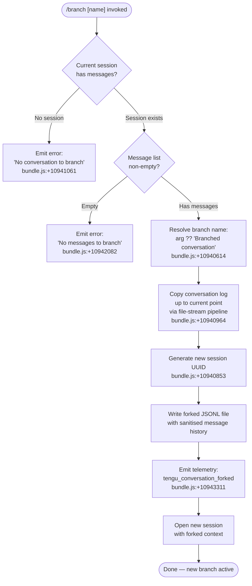

# `/branch`

> Analysis basis: CC v2.1.163 bundle.js (AST extraction + Claude interpretation)
> Minimum version: v2.1.163

---

## Overview

The `/branch` command creates a diverging copy of the current conversation at the point it is invoked, forking the message history up to the current position into a new independent session. The new session receives an optional user-supplied name (defaulting to `"Branched conversation"`) and then opens in a fresh context while leaving the original conversation intact.

---

## Registration

| Field | Value |
|---|---|
| type | `local-jsx` |
| name | `branch` |
| description | `Create a branch of the current conversation at this point` |
| argumentHint | `[name]` |
| module_id | `B6A` |
| load_inline | `true` |
| loc_byte | `12476941` |
| loc_byte_end | `12477118` |
| loc_line | `8927` |
| arbor_handler.name | `Lzf` |
| arbor_handler.fqn | `claude-2.1.163::Lzf` |
| arbor_handler.kind | `AsyncFunction` |
| arbor_handler.resolution_path | `module_id` |
| arbor_handler.n_hits | `0` |

Analysis basis: CC v2.1.163 bundle.js:+12476941

---

## Input Branching

There are four distinct paths depending on the state of the conversation at invocation time:



---

## Behavioral Spec

### Top-level handler (`Lzf`)

The Arbor-resolved handler is the async function `Lzf` (module `B6A`).

```
async function branchCommandHandler(context):
    result = await prepareBranchContext(context)
    if result is error:
        return result
    return result
```

Analysis basis: CC v2.1.163 bundle.js:+10944096

---

### Branch context preparation (`Cxq`)

```
async function prepareBranchContext(context):
    appState       = getAppState()           // h6
    currentSession = getCurrentSession(appState)

    if currentSession is null or undefined:
        return errorMessage("No conversation to branch")
        // bundle.js:+10941061

    messageList = currentSession.messages
    if messageList is empty:
        return errorMessage("No messages to branch")
        // bundle.js:+10942082

    branchName = context.args ?? "Branched conversation"
    // bundle.js:+10940614

    // Sanitise the branch name: strip or replace special chars
    sanitisedName = sanitiseBranchName(branchName)
    // calls Sxq → _.find + A.replace  bundle.js:+10940666, +10940744

    newSessionId = crypto.randomUUID()
    // bundle.js:+10940853

    await copyConversationLog(currentSession, newSessionId)

    emitTelemetry("tengu_conversation_forked")
    // bundle.js:+10943311

    openFork(newSessionId, sanitisedName)
    // bundle.js:+10943832 (literal "fork")
```

Analysis basis: CC v2.1.163 bundle.js:+10943115

---

### Branch name sanitisation (`Sxq`)

```
function sanitiseBranchName(rawName):
    // Locate any disallowed character sequence
    found = find(rawName, disallowedPattern)
    if found:
        rawName = rawName.replace(disallowedPattern, safeReplacement)
    return rawName
```

Analysis basis: CC v2.1.163 bundle.js:+10940666 (`_.find`), +10940744 (`A.replace`)

---

### Conversation log copy (`Rxq`)

```
async function copyConversationLog(session, newSessionId):
    srcPath  = buildSourcePath(session)    // Ov, PM
    destPath = buildDestPath(newSessionId) // Ov, X_

    fs.mkdirSync(destDir, { recursive: true })
    // bundle.js:+10940915

    readStream  = fs.createReadStream(srcPath, { encoding: "utf8", highWaterMark: 448 })
    // bundle.js:+10940964, literal 448 at +10940946
    writeStream = fs.createWriteStream(destPath)
    // bundle.js:+10941110

    // Intercept each line via readline interface
    rl = readline.createInterface({ input: readStream })
    // bundle.js:+10941204

    lineBuffer = []
    for line of rl:
        parsed = parseLine(line)
        if parsed.type == "progress":
            // literal "progress" at bundle.js:+10942000
            continue                       // strip progress-only entries
        lineBuffer.push(transformLine(parsed))

    // Write all collected lines
    for entry of lineBuffer:
        writeStream.write(JSON.stringify(entry) + "\n")
        // bundle.js:+10941393

    writeStream.end()
    await streamFinished(writeStream)
    // bundle.js:+10942492

    if error during copy:
        fs.unlink(destPath)               // clean up partial file
        // bundle.js:+10941324
        raise error
```

Analysis basis: CC v2.1.163 bundle.js:+10940853–+10942492

---

### Path construction helpers (`Ov`, `PM`)

```
function buildSessionPath(sessionId, ...segments):
    base = getConfigDir()            // h6
    return path.join(base, sessionId, ...segments)
    // bundle.js:+13166407, +6734814
```

Analysis basis: CC v2.1.163 bundle.js:+13166362

---

### Line transformation during copy (`Kzf`)

```
function transformLineForFork(parsedLine, seenSet):
    // Normalise role tags; strip content-replacement markers
    // literal "content-replacement" at bundle.js:+10941541
    if parsedLine.marker == "content-replacement":
        return null

    roleOrder = parseInt(parsedLine.order)
    // bundle.js:+10942885

    if seenSet.has(roleOrder):
        return null                   // deduplicate

    seenSet.add(roleOrder)
    return parsedLine
```

Analysis basis: CC v2.1.163 bundle.js:+10942684–+10942932

---

### Post-fork session open (`CS`, `JMH`)

```
function openForkedSession(newSessionId, branchName):
    // Persist a custom title entry for the new session
    writeCustomTitle(newSessionId, branchName)
    // CS → D$H, literal "custom-title" at bundle.js:+13196287

    // Emit internal event so the UI switches to the new session
    emitEvent(DC6, "fork")
    // bundle.js:+13196366, literal "fork" at +10943832

    // Record agent-name metadata
    writeAgentName(newSessionId, branchName)
    // JMH → literal "agent-name" at bundle.js:+13199309

    emitTelemetry("tengu_session_renamed")
    // bundle.js:+13196379
    emitTelemetry("tengu_agent_name_set")
    // bundle.js:+13199407
```

Analysis basis: CC v2.1.163 bundle.js:+10943278 (`CS`), +10943296 (`JMH`)

---

### Error wrapping (`kH`, `HA`)

```
function wrapError(err):
    if err.code == "ENOENT":
        // file not found — session log missing
        return userFacingError("No conversation to branch")
    base = formatBaseError(err)   // HA → Error + String
    logError(base)                // Er.logError  bundle.js:+1015986
    return base
```

Analysis basis: CC v2.1.163 bundle.js:+10941096 (`kH`), +10941190 (`HA`)

---

## State & Side Effects

| Item | Detail |
|---|---|
| Telemetry | `tengu_conversation_forked` (bundle.js:+10943311), `tengu_session_renamed` (bundle.js:+13196379), `tengu_agent_name_set` (bundle.js:+13199407) |
| File I/O | Creates a new directory under the CC config dir; writes a forked JSONL conversation log; writes a `custom-title` metadata file and an `agent-name` metadata file for the new session |
| Cleanup on failure | Unlinks the partially written destination file if the stream copy fails (bundle.js:+10941324) |
| appState changes | Fires an internal fork event (`DC6.emit`) causing the UI to navigate to the new session (bundle.js:+13196366) |
| UUID generation | Uses `crypto.randomUUID()` to assign a fresh session identifier (bundle.js:+10940853) |
| Sound | <!-- TODO: not found in depth-2 traversal; needs --depth 4 --> |

---

## Version History

| Version | Change |
|---|---|
| v2.1.163 | Initial analysis |

---

## Common Mistakes

1. **Running `/branch` with no prior messages** — the command will refuse with `"No messages to branch"` (bundle.js:+10942082). At least one message must exist in the current session.
2. **Running `/branch` outside an active session** — the command will refuse with `"No conversation to branch"` (bundle.js:+10941061). A session must be initialised first.
3. **Expecting the original session to be modified** — `/branch` only reads the current session log; the source conversation is never altered.
4. **Supplying a branch name with characters that require escaping** — the name sanitiser (`Sxq`) will silently strip or replace problematic characters, so the displayed title may differ from the raw argument.
5. **Assuming the branch is synchronous** — the handler is `async`; UI navigation to the forked session happens only after the file-copy pipeline finishes and the internal fork event is emitted.

---

## Appendix — Identifier Mapping

> For bundle debugging only. Identifiers change across versions.

| Identifier | Role |
|---|---|
| `Lzf` | Top-level `/branch` command handler (AsyncFunction, arbor-resolved) |
| `Cxq` | Branch context preparation — validates session/messages, coordinates the full fork flow |
| `Sxq` | Branch name sanitisation — finds and replaces disallowed characters |
| `Rxq` | Conversation log copy — stream-based JSONL pipeline from source to destination |
| `Kzf` | Line transformation during fork — deduplicates and strips progress/replacement entries |
| `CS` | Post-fork session opener — writes custom-title metadata and fires fork UI event |
| `JMH` | Agent-name writer — persists the branch label as `agent-name` metadata |
| `D$H` | Metadata file writer helper — mkdirSync + appendFileSync for session metadata |
| `Ov` | Session path builder — constructs full filesystem path for a session |
| `PM` | Config-dir-based path joiner |
| `X_` | Destination path helper |
| `h6` | App-state / config-dir accessor |
| `kH` | Error wrapper — formats and logs errors, classifies ENOENT |
| `HA` | Base error formatter (Error + String coercion) |
| `R8` | Async error re-throw utility |
| `v8` | Promise-based filesystem wrapper |
| `Q1` | String slice utility (indexOf + slice) |
| `WV` | String replace helper |
| `Fn` | Worktree/file-list builder used during path resolution |
| `WxH` | Git worktree detection helper |
| `wMK` | Directory walker / file list aggregator |
| `txH` | Buffer accumulator helper |
| `N$` | Lookup helper used during session path resolution |
| `Rd` | Configuration file read/write wrapper (readFile + writeFile) |
| `rO6` | File-backed store with locking (join + readFile + writeFile + SH) |
| `g$` | Session-state accessor helper |
| `d4` | Hook/subscriber registration helper |
| `SH` | JSON serialiser wrapper |
| `b8` | Stream event helper |
| `eH` | String coercion utility |
| `uv` | Internal event emitter primitive |
| `Uk` | Path segment builder |
| `JR` | Config-dir resolver |
| `EH` | String cast utility |

---

Note: index built via Arbor fallback; some signals (telemetry, literals) may be missing — see arbor-fallback.js.