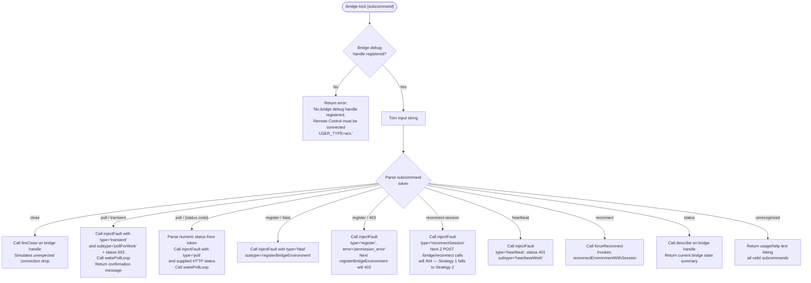

# `/bridge-kick`

> Analysis basis: CC v2.1.163 bundle.js (AST extraction + Claude interpretation)
> Minimum version: v2.1.163

---

## Overview

`/bridge-kick` is a developer/testing command that injects synthetic Remote Control (bridge) failures into a running Claude Code session, enabling recovery-path testing without requiring a real network fault. It operates exclusively when a bridge debug handle is active (i.e., the session was started with `USER_TYPE=ant`) and dispatches one of several fault scenarios based on a subcommand string supplied by the user.

---

## Registration

| Field | Value |
|---|---|
| type | `local` |
| name | `bridge-kick` |
| description | `Inject Remote Control failures for recovery testing` |
| supportsNonInteractive | `false` |
| load_inline | `true` |
| load_ident | `qRf` |
| loc_byte | `12589072` |
| loc_byte_end | `12589251` |
| loc_line | `9060` |
| arbor_handler.name | `qRf` |
| arbor_handler.fqn | `claude-2.1.163::qRf` |
| arbor_handler.kind | `AsyncFunction` |
| arbor_handler.resolution_path | `load_ident` |
| arbor_handler.n_hits | `0` |

Analysis basis: CC v2.1.163 bundle.js:+12589072

---

## Input Branching

The handler parses a user-supplied subcommand string and dispatches to one of eight distinct fault-injection paths (plus a guard path and a status/describe path), totalling well over three branches. A Mermaid flowchart is used.



Analysis basis: CC v2.1.163 bundle.js:+12586831 through +12588985

---

## Behavioral Spec

### Guard: Bridge Debug Handle Check

Before any fault injection is attempted, the handler checks whether a bridge debug handle is currently registered (via `bridgeDebugHandleRegistry.get()`). If no handle is found, the command immediately returns a `text`-type result with the literal error message:

> `"No bridge debug handle registered. Remote Control must be connected (USER_TYPE=ant)."`

This gate ensures the command is inert in standard user sessions.

Analysis basis: CC v2.1.163 bundle.js:+12586831, +12586868

```
async function bridgeKickHandler(userInput):
    handle = bridgeDebugHandleRegistry.get()
    if handle is null or undefined:
        return textResult("No bridge debug handle registered. Remote Control must be connected (USER_TYPE=ant).")

    subcommand = userInput.trim()
    dispatch(handle, subcommand)
```

### Input Parsing

The raw user argument string is trimmed of surrounding whitespace before subcommand comparison. Subcommand matching uses string equality / prefix checks (`.includes()` and token splitting) against the known literal tokens.

Analysis basis: CC v2.1.163 bundle.js:+12586967

### Fault Scenario: `close`

When the subcommand is `"close"`, the handler calls `handle.fireClose()`. This simulates an unexpected WebSocket (or equivalent transport) closure event, exercising the bridge's reconnection logic.

Analysis basis: CC v2.1.163 bundle.js:+12587003, +12587120

```
case "close":
    handle.fireClose()
    return textResult("Bridge close event fired.")
```

### Fault Scenario: `poll` / transient

When the subcommand token is `"poll"` paired with the qualifier `"transient"`, the handler calls `handle.injectFault({ type: "poll", subtype: "pollForWork", httpStatus: 503 })` followed immediately by `handle.wakePollLoop()`. The confirmation message returned is:

> `"Next poll will throw a transient (axios rejection). Poll loop woken."`

Analysis basis: CC v2.1.163 bundle.js:+12587234, +12587249, +12587290, +12587328, +12587342, +12587378

```
case "poll transient":
    handle.injectFault({ type: "poll", subtype: "pollForWork", httpStatus: 503 })
    handle.wakePollLoop()
    return textResult("Next poll will throw a transient (axios rejection). Poll loop woken.")
```

### Fault Scenario: `poll` / numeric HTTP status

When the subcommand is `"poll"` followed by a numeric token, the handler parses the token via `Number()` and validates it with `Number.isFinite()`. If valid, it calls `handle.injectFault({ type: "poll", httpStatus: parsedStatus })` and then wakes the poll loop.

Analysis basis: CC v2.1.163 bundle.js:+12587018, +12587032

```
case "poll <n>":
    status = Number(statusToken)
    if not Number.isFinite(status):
        return textResult("Invalid status code.")
    handle.injectFault({ type: "poll", httpStatus: status })
    handle.wakePollLoop()
    return textResult("Poll fault injected with status " + status + ".")
```

### Fault Scenario: `register` — fatal

When the subcommand encodes a `"register"` + `"fatal"` path, the handler calls `handle.injectFault({ type: "fatal", subtype: "registerBridgeEnvironment" })`, triggering a fatal error on the next environment registration attempt.

Analysis basis: CC v2.1.163 bundle.js:+12587672, +12587878

```
case "register fatal":
    handle.injectFault({ type: "fatal", subtype: "registerBridgeEnvironment" })
    return textResult("Next registerBridgeEnvironment will be fatal.")
```

### Fault Scenario: `register` — 403

When the subcommand targets a 403 permission error on registration, the handler calls `handle.injectFault({ type: "register", httpStatus: 403, errorType: "permission_error" })`. The confirmation message is:

> `"Next registerBridgeEnvironment will 403. Trigger with close/reconnect."`

Analysis basis: CC v2.1.163 bundle.js:+12587822, +12587926, +12587940, +12587988

```
case "register 403":
    handle.injectFault({ type: "register", httpStatus: 403, errorType: "permission_error" })
    return textResult("Next registerBridgeEnvironment will 403. Trigger with close/reconnect.")
```

### Fault Scenario: `reconnect-session`

When the subcommand is `"reconnect-session"`, the handler calls `handle.injectFault({ type: "reconnectSession", httpStatus: 404, errorType: "not_found_error" })`. This causes the next two `POST /bridge/reconnect` calls to return 404, forcing Strategy 1 to fall through to Strategy 2. The confirmation message is:

> `"Next 2 POST /bridge/reconnect calls will 404. doReconnect Strategy 1 falls through to Strategy 2."`

Analysis basis: CC v2.1.163 bundle.js:+12588297, +12588346, +12588446, +12587578, +12587582

```
case "reconnect-session":
    handle.injectFault({ type: "reconnectSession", httpStatus: 404, errorType: "not_found_error" })
    return textResult("Next 2 POST /bridge/reconnect calls will 404. doReconnect Strategy 1 falls through to Strategy 2.")
```

### Fault Scenario: `heartbeat`

When the subcommand is `"heartbeat"`, the handler calls `handle.injectFault({ type: "heartbeat", httpStatus: 401, subtype: "heartbeatWork" })`, simulating an authentication failure on the next heartbeat work poll.

Analysis basis: CC v2.1.163 bundle.js:+12588551, +12588581, +12588614

```
case "heartbeat":
    handle.injectFault({ type: "heartbeat", httpStatus: 401, subtype: "heartbeatWork" })
    return textResult("Heartbeat fault injected (401).")
```

### Fault Scenario: `reconnect`

When the subcommand is `"reconnect"`, the handler calls `handle.forceReconnect()`, which internally invokes `reconnectEnvironmentWithSession()`. The confirmation message is:

> `"Called reconnectEnvironmentWithSession(). Watch debug.log."`

Analysis basis: CC v2.1.163 bundle.js:+12588828, +12588847, +12588885

```
case "reconnect":
    handle.forceReconnect()
    return textResult("Called reconnectEnvironmentWithSession(). Watch debug.log.")
```

### Fault Scenario: `status`

When the subcommand is `"status"`, the handler calls `handle.describe()` and returns its output as a text result, providing the current bridge state for inspection.

Analysis basis: CC v2.1.163 bundle.js:+12588951, +12588985

```
case "status":
    description = handle.describe()
    return textResult(description)
```

### Logging Subsystem (called from handler context)

The call graph shows the handler context reaching a debug-level logging facility (identifier `v`, resolved as the debug logger) with the string `"debug"` as the log level. This is consistent with the command emitting diagnostic output to the internal debug log rather than to the user-visible output channel.

Analysis basis: CC v2.1.163 bundle.js:+206051

### File-based Transcript Appender (reachable via `icK`)

Depth-2 traversal reveals a file-append subsystem (`icK` → `ncK` → `Zy.appendFile`, `Zy.mkdir`) with `.txt` rotation logic and a 4-byte-offset check (literal `4` at bundle.js:+205043). This infrastructure is shared with the general debug-log writing path and is not specific to `/bridge-kick` itself, but is reachable from the handler's execution context when debug logging is active.

Analysis basis: CC v2.1.163 bundle.js:+205317, +205376, +205021, +205043

---

## State & Side Effects

| Item | Detail |
|---|---|
| Telemetry | `tengu_feature_sad` (bundle.js:+1010365) — fired on a feature-sad path reachable via the call graph; may indicate a degraded / unexpected-state branch rather than the happy path |
| Bridge debug handle | Reads from `bridgeDebugHandleRegistry` on every invocation; no mutations to the registry itself |
| Fault state | `handle.injectFault(...)` mutates fault-injection state inside the bridge handle object; consumed by the next matching bridge operation |
| Poll loop | `handle.wakePollLoop()` triggers an immediate poll cycle (side-effect on the bridge I/O loop) |
| Force reconnect | `handle.forceReconnect()` initiates a full reconnection sequence asynchronously |
| Debug log (file) | Debug messages written via the logging subsystem to a rotating `.txt` file in the session debug directory |
| UI / appState | No direct appState mutations observed in depth-2 traversal |
| Sound | None observed |
| Non-interactive | `supportsNonInteractive: false` — command is blocked in non-interactive (headless) mode |

---

## Version History

| Version | Change |
|---|---|
| v2.1.163 | Initial analysis |

---

## Common Mistakes

1. **Running outside an `ant` session**: The command silently fails with an error message if `USER_TYPE` is not `ant`. There is no fallback; the bridge debug handle must be pre-registered before the session starts.
2. **Omitting the subcommand**: Passing no argument or an unrecognized token will return a usage/help listing rather than injecting any fault — no implicit default behavior.
3. **Expecting synchronous recovery**: `forceReconnect` (`reconnect` subcommand) is asynchronous; the user should watch `debug.log` for progress rather than expecting an immediate status update in the CLI output.
4. **Misreading the `poll transient` vs `poll <N>` distinction**: The string `"transient"` is a special keyword that maps to HTTP 503 with an axios-rejection wrapper; passing `503` as a bare number uses the numeric path which may differ in error-type semantics.
5. **Confusing `register fatal` with `register 403`**: Both target the `registerBridgeEnvironment` call, but `fatal` causes an unrecoverable error while `403` produces a `permission_error` that the client may handle gracefully; they exercise different recovery branches.
6. **Not triggering `register 403` after injection**: The injected 403 fault only fires on the *next* `registerBridgeEnvironment` invocation; it must be triggered explicitly by issuing a `close` or `reconnect` subcommand afterward.

---

## Appendix — Identifier Mapping

> For bundle debugging only. Identifiers change across versions.

| Identifier | Role |
|---|---|
| `qRf` | Main handler (`AsyncFunction`) for `/bridge-kick`; entry point resolved via `load_ident` |
| `L1K` | Bridge debug handle registry lookup (called first in handler to obtain debug handle) |
| `H` | HTTP fetch / bootstrap client (used in broader call graph for API calls) |
| `v` | Debug logger (log-level `"debug"`); writes diagnostic output from handler context |
| `ccK` | Log-level dispatcher / formatter |
| `OXA` | Log output routing (delegates to `lgK`/`ngK`) |
| `SH` | JSON serializer utility (`JSON.stringify` wrapper) |
| `_` | Contextual reference (varies by call site; in handler context: bridge handle object) |
| `J4` | Path / string utility (replace, lastIndexOf, slice operations) |
| `g2A` | Array mapping utility over `BcK` |
| `q` | File unlink / trim helper |
| `A` | Lowercase transform / file utility |
| `ppH` | Write-output helper (wraps `h2A`) |
| `h2A` | Low-level handle write (`H.write`) |
| `icK` | Debug-log file append controller (mkdir, appendFile, rotate) |
| `$pH` | Timer/queue manager (setTimeout, clearTimeout, setImmediate orchestration) |
| `d3H` | Log-path join and segment helper |
| `Q6` | Session directory resolver |
| `aL6` | EISDIR error handler / filesystem guard |
| `r2A` | Log-file path builder (`KHH.join` + `h6`) |
| `i2A` | Log-file rotation handler (stat, endsWith `.txt`, rename, unlink) |
| `ncK` | Append-to-log-file implementation (mkdir → appendFile → rotate) |
| `j9` | Hook / plugin registration (`MXA.register`) |
| `e$` | Bootstrap response parser |
| `Pw_` | Query-string / parameter parser (split, trim, indexOf, slice) |
| `ZHH` | Feature-flag / allowlist set checker (`g44.has`) |
| `uj` | String replace utility |
| `t1` | Model/token resolution entry point |
| `D6H` | Model descriptor builder |
| `x0` | Model ID normalizer |
| `IqH` | Model capability inspector |
| `yd` | Model metadata extractor (trim, map, startsWith, includes) |
| `Aq` | Model alias resolver (trim, toLowerCase, replace) |
| `o0` | Model alias table lookup (`q4H`) |
| `_4H` | Model include-list checker (`H4H.includes`) |
| `wI` | Model tier classifier (`gM`, `Z5`) |
| `NQH` | Model tier fallback (`Z5`) |
| `NE` | Provider type resolver (`gM`, `Z5`, `XA`) |
| `kX1` | Model provider entry builder (delegates to `NE`) |
| `gM` | Provider class factory (`XA`) |
| `Pe6` | Provider include-list checker (`l1L.includes`) |
| `vQH` | Provider environment helper (`eH`) |
| `eX` | Extended model resolution (delegates to `Aq`, `r0`) |
| `r0` | Full provider resolution chain (`ZA`, `P6H`, `PYH`, `IQH`, `NE`, `z2`, `gM`, `XA`, `Z5`, `wI`) |
| `s6` | Telemetry event emitter (`tengu_feature_sad`) |
| `c` | Telemetry sad-path reporter |
| `P6` | Telemetry dispatcher (`Nu6`) |
| `Nu6` | Telemetry transport / sink |

---

Note: index built via Arbor fallback; some signals (telemetry, literals) may be missing — see arbor-fallback.js.