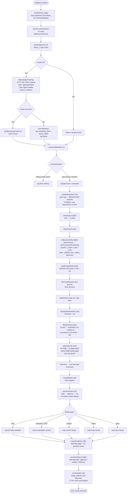

# `/callback`

> Analysis basis: CC v2.1.163 bundle.js (AST extraction + Claude interpretation)
> Minimum version: v2.1.163

---

## Overview

The `/callback` command is a special-purpose internal registration type that handles callback-style invocations within the Claude Code command dispatch system. Rather than presenting an interactive user-facing slash command with a description, it operates as a low-level execution pathway — mapping input through a command-dispatch pipeline, performing file I/O operations (append, rename, unlink), managing a debounced/throttled write queue, and optionally triggering a bootstrap fetch sequence. It is one of six recognized command types (`command`, `prompt`, `agent`, `http`, `mcp_tool`, `callback`).

---

## Registration

| Field | Value |
|---|---|
| type | `callback` |
| name | `callback` |
| description | `null` |
| loc_byte | `13342336` |
| loc_byte_end | `13342369` |
| loc_line | `10694` |
| arbor_handler.name | `Qgf` |
| arbor_handler.fqn | `claude-2.1.163::Qgf` |
| arbor_handler.kind | `Function` |
| arbor_handler.resolution_path | `direct` |
| arbor_handler.n_hits | `1` |

Analysis basis: CC v2.1.163 bundle.js:+13342336

---

## Input Branching

The dispatch chain involves 4+ distinct branches (command-type routing, debug-mode gating, file existence/extension checks, bootstrap fetch success/failure), so a Mermaid flowchart is used.



---

## Behavioral Spec

### Handler Entry — `handlerEntry` (Qgf)

The top-level handler for the `callback` registration. Upon invocation it calls `commandMapper` (`H.map`) to iterate the registered command collection, then delegates to the `bootstrapFetch` function.

Analysis basis: CC v2.1.163 bundle.js:+13341949

```
function handlerEntry(context):
    commandList = commandMapper(registeredCommands)  // H.map
    result = bootstrapFetch(commandList, context)
    iMH(result)  // secondary init call
    return result
```

Analysis basis: CC v2.1.163 bundle.js:+13342020

---

### Bootstrap Fetch — `bootstrapFetch` (H)

Performs a guarded HTTP fetch to retrieve remote configuration. Uses an internal cache (`_A.get`) to avoid redundant network calls. On success logs `[Bootstrap] Fetch ok`; on parse failure emits telemetry event `api_bootstrap_fetch` with sub-event `parse_failed`. Network timeout: 5000 ms (bundle.js:+15724419). Headers include `Content-Type: application/json` (bundle.js:+15724303) and a `User-Agent` string (bundle.js:+15724337).

Analysis basis: CC v2.1.163 bundle.js:+15724216

```
function bootstrapFetch(commandList, context):
    cached = internalCache.get(cacheKey)   // _A.get
    if cached exists:
        return cached

    log("[Bootstrap] Fetching")            // literal at +15724218
    response = httpFetch(url, {
        headers: {
            "Content-Type": "application/json",
            "User-Agent": userAgentString
        },
        timeout: 5000
    })

    parsed = tryParseJSON(response)
    if parse failed:
        emitEvent("api_bootstrap_fetch", { status: "parse_failed" })
        return fallback
    
    log("[Bootstrap] Fetch ok")            // literal at +15724592
    internalCache.set(cacheKey, parsed)    // e$, Pw_, ZHH checks
    return parsed
```

Analysis basis: CC v2.1.163 bundle.js:+15724216

---

### Input Normalization — `commandDispatch` (v)

Routes the resolved command context. Checks a `debug` log-level flag (literal at +206051). Performs an `includes`-based type check against the six known command-type strings, then upper-cases the type name for downstream processing.

Known command types (literals at +12436960–+12437103):
- `prompt`
- `agent`
- `http`
- `mcp_tool`
- `callback` ← this registration's own type
- `command`

```
function commandDispatch(input, commandType):
    if logLevel == "debug":
        logDebug(input)

    normalizedType = commandType.toUpperCase()   // _.toUpperCase

    if knownTypes.includes(normalizedType):
        ext = extractExtension(input)            // J4
        writeOutput(input, ext)                  // ppH
        fileLifecycle(input, ext)                // icK
    else:
        fallback = "unknown"                     // literal at +13342382
        return fallback
```

Analysis basis: CC v2.1.163 bundle.js:+206051, +206093, +206115, +206177

---

### Extension Extraction — `extractExtension` (J4)

Builds a sanitized extension string. Uses `g2A` to map over a structure (`BcK.map`), replaces a sensitive pattern with the `[REDACTED]` sentinel (literal at +198141), applies `H.replace`, inspects character at position via `q.at`, finds the last separator with `A.lastIndexOf`, then slices the result. The constant `2` appears in index arithmetic (bundle.js:+198170).

```
function extractExtension(input):
    parts = buildPartMap(input)            // g2A → BcK.map
    sanitized = input.replace(sensitivePattern, "[REDACTED]")
    char = sanitized.at(position)          // q.at
    sepIdx = sanitized.lastIndexOf(sep)    // A.lastIndexOf
    ext = sanitized.slice(sepIdx + 2)      // A.slice, constant 2
    return ext.trim()                      // H.trim
```

Analysis basis: CC v2.1.163 bundle.js:+198062, +198089, +198141, +198170, +198199, +198225, +198251

---

### Debounced Write Queue — `debounceWriter` ($pH)

Implements a two-tier timing strategy: a short debounce interval (100 ms, bundle.js:+59646) and a maximum flush interval (1000 ms, bundle.js:+59625). Pending writes are held in two arrays (`$` and `L`). On each call: cancels the existing debounce timer (`clearTimeout`), pushes the item (`$.push`), joins pending items (`$.join`, `L.join`, `J.join`), then arms a new debounce timeout (`setTimeout`). When the maximum interval elapses, `setImmediate` is used for the final flush, appending to `L` (`L.push`). Sub-functions `D`, `w`, and `Y` handle flushing, error recovery, and post-flush notification respectively.

```
function debounceWriter(item, pendingQueue, longQueue):
    clearTimeout(activeTimer)
    pendingQueue.push(item)                     // $.push
    
    batch = pendingQueue.join(separator)         // $.join
    longBatch = longQueue.join(separator)        // L.join

    if elapsed >= MAX_INTERVAL (1000ms):
        setImmediate(() => flushAll(batch))      // setImmediate
        longQueue.push(item)                     // L.push
        notifyComplete(Y)
    else:
        activeTimer = setTimeout(() => {
            flush(batch, longBatch)              // O
            handleResult(D, w)
        }, DEBOUNCE_INTERVAL (100ms))            // setTimeout
```

Analysis basis: CC v2.1.163 bundle.js:+59625, +59646, +59737, +59778, +59809, +59811, +59855, +59876, +59901, +59936, +59994, +60034, +60085, +60107, +60129, +60152

---

### File Lifecycle Manager — `fileLifecycle` (icK)

Orchestrates the full file write pipeline:

1. Calls `debounceWriter` (`$pH`) to queue the item.
2. Calls `buildOutputPath` (`d3H`) using `pathJoin` (`KHH.join`), `a8`, and `h6` helpers.
3. Resolves the containing directory via `KHH.dirname`.
4. Validates/creates the target via `validateOrCreate` (`Vy`, `Q6`).
5. Calls `resolveRelativePath` (`r2A`).
6. Calls `fileStatCheck` (`i2A`) to inspect file state.
7. Measures byte length via `Buffer.byteLength` (bundle.js:+205771).
8. Calls size guard (`a2A`).
9. Chains `AU6.then → appendLoop.bind` for the actual write.
10. Registers a teardown hook via `hookRegister` (`j9` → `MXA.register`).

```
function fileLifecycle(item, ext, context):
    debounceWriter(item)                        // $pH
    outputPath = buildOutputPath(context)       // d3H
    dir = pathDirname(outputPath)               // KHH.dirname
    validateOrCreate(dir, Vy, Q6, aL6)
    relPath = resolveRelativePath(outputPath)   // r2A
    fileState = fileStatCheck(relPath)          // i2A
    byteLen = Buffer.byteLength(item)
    if byteLen within limit:
        AU6.then(appendLoop.bind(context, ...)) // ncK.bind
    hookRegister(context)                       // j9 → MXA.register
```

Analysis basis: CC v2.1.163 bundle.js:+205563, +205588, +205596, +205626, +205641, +205716, +205733, +205765, +205771, +205804, +205821, +205830, +205926

---

### File Stat Check — `fileStatCheck` (i2A)

Checks whether a target path exists and is a plain file. If the path ends with `.txt` (literal at +205021), strips the last 4 characters (constant `4` at +205043) before checking. On success calls `Zy.rename`; on error or when the path is a directory, calls `Zy.unlink` via `R8`. Handles `EISDIR` error code (literal at +175646) via `validateOrCreate` (`aL6` → `v8`).

```
function fileStatCheck(path):
    try:
        stat = await Zy.stat(path)
    catch:
        return NO_FILE

    if path.endsWith(".txt"):
        path = path.slice(0, length - 4)

    try:
        await Zy.rename(path, newPath)
    catch EISDIR:
        await Zy.unlink(path)                  // R8 helper
    return result
```

Analysis basis: CC v2.1.163 bundle.js:+204917, +205010, +205021, +205032, +205043, +205073, +205101, +205113, +175646

---

### Append Loop — `appendLoop` (ncK)

Recursively appends data to the output file. Creates the directory tree with `Zy.mkdir`, then `Zy.appendFile`. After each append, measures `Buffer.byteLength` (bundle.js:+205469) and calls the size guard `a2A`. If more data remains, calls `resolveRelativePath` (`r2A`), `fileStatCheck` (`i2A`), and tails back to itself.

```
function appendLoop(context, data, remaining):
    await Zy.mkdir(dir, { recursive: true })
    await Zy.appendFile(path, data)
    byteLen = Buffer.byteLength(data)
    if sizeGuard(byteLen, a2A):
        if remaining:
            relPath = resolveRelativePath(path)    // r2A
            fileState = fileStatCheck(relPath)     // i2A
            return appendLoop(context, next, rest) // tail
    return done
```

Analysis basis: CC v2.1.163 bundle.js:+205317, +205376, +205408, +205425, +205463, +205469, +205502

---

### Input Text Parser & Model Normalizer — `parseInputText` (t1)

Tokenizes raw input via `tokenize` (`D6H` → `x0`, `IqH`, `SA`, `yd`) and then normalizes model alias strings through `modelNormalizer` (`Aq`). The tokenizer handles multi-line trimming and `startsWith("anthropic.")` (literal at +2237210) prefix detection. The normalizer trims, lowercases, and pattern-replaces input, then maps well-known alias strings to canonical model identifiers.

Model alias mapping (all literals confirmed in bundle):

| Alias literal | Canonical resolution |
|---|---|
| `opusplan` (+ `[1m]`) | opus/plan variant |
| `sonnet` | sonnet family |
| `haiku` | haiku family |
| `opus` | opus family |
| `best` | best-available resolver |

```
function parseInputText(raw):
    tokens = tokenize(raw)                // D6H
    normalized = modelNormalizer(tokens)  // Aq
    provider = providerSelector(normalized) // gM
    return { tokens, normalized, provider }

function modelNormalizer(input):
    s = input.trim().toLowerCase()        // H.trim, _.toLowerCase
    s = replacePattern(s)                 // A.replace, _.replace
    if isRestrictedModel(s):              // _4H → H4H.includes
        return restricted
    alias = resolveAlias(s)               // wI → gM/Z5
    return { model: alias, provider: checkFirstParty(alias) } // NE
```

Analysis basis: CC v2.1.163 bundle.js:+2239233, +2239270, +2239283, +2243153, +2243164, +2243182, +2243192, +2243228, +2243249, +2243267, +2243275, +2243290, +2243329, +2243344, +2243368, +2243382, +2243405, +2243419, +2243437, +2243443, +2243451, +2243495

---

### Provider Selector — `providerSelector` (gM)

Selects the API provider backend. Known provider strings (all literals confirmed):
- `anthropicAws` (bundle.js:+2097366)
- `gateway` (bundle.js:+2097386)
- `mantle` (bundle.js:+2240098)
- `firstParty` (bundle.js:+2239457)

```
function providerSelector(modelInfo):
    if modelInfo.provider == "firstParty":
        return firstPartyEndpoint(XA)
    elif modelInfo.provider == "anthropicAws":
        return awsEndpoint
    elif modelInfo.provider == "gateway":
        return gatewayEndpoint
    elif modelInfo.provider == "mantle":
        return mantleEndpoint
    else:
        return defaultEndpoint
```

Analysis basis: CC v2.1.163 bundle.js:+2097331, +2097366, +2097386, +2239457, +2240098

---

### Error Handler — `errorHandler` (s6)

On any unrecoverable error, emits the `tengu_feature_sad` telemetry event (bundle.js:+1010365). Delegates to sub-handlers `c` and `P6`, which call `Nu6` (bundle.js:+3628) for issue-reporting output referencing the GitHub issues URL `https://github.com/anthropics/claude-code/issues` (bundle.js:+3961).

```
function errorHandler(err, context):
    emitTelemetry("tengu_feature_sad", { error: err })  // s6 → c
    P6(err)                                              // P6 → Nu6
    // Nu6 surfaces: "report the issue at https://github.com/anthropics/claude-code/issues"
```

Analysis basis: CC v2.1.163 bundle.js:+1010363, +1010365, +1010399, +3628, +3761, +3961

---

## State & Side Effects

| Item | Detail |
|---|---|
| Telemetry | `tengu_feature_sad` (bundle.js:+1010365) — emitted on unrecoverable error |
| Telemetry (bootstrap) | `api_bootstrap_fetch` with sub-status `parse_failed` (bundle.js:+15724540, +15724562) — emitted on bootstrap JSON parse failure |
| Hook registration | `MXA.register` called via `j9` (bundle.js:+60323) — registers teardown/lifecycle hook |
| File system writes | `Zy.appendFile`, `Zy.mkdir` (recursive), `Zy.rename`, `Zy.unlink` — managed by `appendLoop` (ncK) and `fileStatCheck` (i2A) |
| Cache (bootstrap) | `_A.get` / `_A.set` — in-process cache for bootstrap fetch result |
| Debounce timers | `setTimeout` (100 ms debounce), `setImmediate` (max 1000 ms flush), `clearTimeout` on each invocation |
| appState changes | <!-- TODO: not found in depth-2 traversal; needs --depth 4 --> |
| Sound | <!-- TODO: not found in depth-2 traversal; needs --depth 4 --> |

---

## Version History

| Version | Change |
|---|---|
| v2.1.163 | Initial analysis |

---

## Common Mistakes

1. **Treating `/callback` as a user-facing command.** Its `description` is `null` and it is not intended to be invoked directly by end users; it is an internal dispatch-type registration consumed by the command router.
2. **Assuming it behaves like a `/prompt` command.** The `callback` type has no `prompt_body`; it delegates to a function handler (`Qgf`) rather than sending a fixed text prompt to the agent.
3. **Ignoring the `.txt` suffix stripping.** When the target output path ends with `.txt`, `fileStatCheck` silently strips the last 4 characters before the rename/unlink step — this can cause confusion when tracing file-system side effects.
4. **Expecting synchronous file writes.** All file operations pass through the debounce queue (`$pH`) with a 100 ms debounce and 1000 ms maximum flush, so writes are never immediate.
5. **Misreading the `[REDACTED]` sentinel.** This is a literal string constant written into sanitized output, not a redaction applied at display time; downstream consumers that parse this field verbatim should treat it as an opaque placeholder.
6. **Not accounting for the `EISDIR` error path.** If the output path resolves to a directory, `fileStatCheck` silently calls `Zy.unlink` rather than erroring — callers should validate path targets beforehand.

---

## Appendix — Identifier Mapping

> For bundle debugging only. Identifiers change across versions.

| Identifier | Role |
|---|---|
| `Qgf` | Handler entry point — top-level callback command handler |
| `H` | Bootstrap fetch + command list builder |
| `v` | Command dispatch / input router |
| `ccK` | Command context builder (calls `Vy`, `dcK`, `OXA`) |
| `OXA` | Sub-context initializer (calls `lgK`, `ngK`) |
| `SH` | JSON serializer utility (wraps `JSON.stringify`) |
| `J4` | Extension extractor |
| `g2A` | Part-map builder (iterates `BcK.map`) |
| `q` | File unlink helper (wraps `xuK.unlinkSync`) |
| `A` | Lowercase filename helper (wraps `f.toLowerCase`) |
| `ppH` | Write output dispatcher |
| `h2A` | Low-level stream writer (wraps `H.write`) |
| `icK` | File lifecycle manager |
| `$pH` | Debounced write queue |
| `d3H` | Output path builder |
| `Q6` | Directory validation helper |
| `aL6` | EISDIR / directory error handler (calls `v8`) |
| `r2A` | Relative path resolver (uses `KHH.join`, `h6`) |
| `i2A` | File stat checker (rename/unlink logic) |
| `ncK` | Append loop (recursive file appender) |
| `j9` | Hook registrar (calls `MXA.register`) |
| `e$` | Cache key extractor |
| `Pw_` | Input string parser (split/trim/indexOf/slice) |
| `ZHH` | Set membership checker (calls `g44.has`) |
| `uj` | String replacement utility |
| `t1` | Input text parser + model normalizer dispatcher |
| `D6H` | Tokenizer (calls `x0`, `IqH`, `SA`, `yd`) |
| `x0` | Tokenizer sub-step A |
| `IqH` | Tokenizer sub-step B |
| `yd` | Token post-processor (trim, prefix check, alias map) |
| `Aq` | Model alias normalizer |
| `o0` | Alias lookup helper (calls `q4H`) |
| `_4H` | Restricted model gate (checks `H4H.includes`) |
| `wI` | Alias resolver (calls `gM`, `Z5`) |
| `NQH` | Alias resolver variant (calls `Z5`) |
| `NE` | First-party gate checker (calls `gM`, `Z5`, `XA`) |
| `kX1` | Alias pre-resolver (calls `NE`) |
| `gM` | Provider selector (calls `XA`) |
| `Pe6` | Provider list checker (calls `l1L.includes`) |
| `vQH` | Provider error handler (calls `eH`) |
| `eX` | Extended input processor (calls `Aq`, `r0`) |
| `r0` | Extended router (calls `ZA`, `P6H`, `PYH`, `IQH`, `NE`, `z2`, `gM`, `XA`, `Z5`, `wI`) |
| `s6` | Error handler (emits `tengu_feature_sad`) |
| `c` | Error sub-handler A |
| `P6` | Error sub-handler B (calls `Nu6`) |
| `Nu6` | Issue-reporting output formatter |
| `iMH` | Secondary initialization call from handler entry |

---

Note: index built via Arbor fallback; some signals (telemetry, literals) may be missing — see arbor-fallback.js.