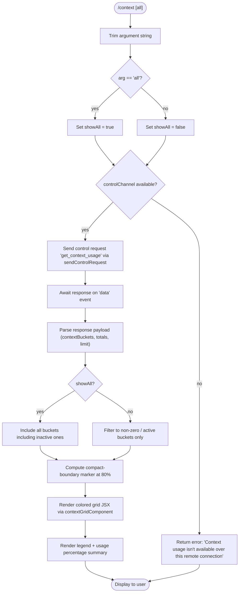

# `/context`

> Analysis basis: CC v2.1.163 bundle.js (AST extraction + Claude interpretation)
> Minimum version: v2.1.163

---

## Overview

The `/context` command visualizes current context-window usage as a colored grid, displaying how different content categories (system prompt, tools, memory files, messages, etc.) consume the available token budget. It dispatches a `get_context_usage` control request over the active session channel and renders the response as a JSX component inside the terminal UI.

---

## Registration

| Field | Value |
|---|---|
| type | `local-jsx` |
| name | `context` |
| description | `Visualize current context usage as a colored grid` |
| argumentHint | `[all]` |
| thinClientDispatch | `control-request` |
| module_id | `MBq` |
| load_inline | `true` |
| loc_byte | `11429976` |
| loc_byte_end | `11430202` |
| loc_line | `7473` |
| arbor_handler.name | `bJf` |
| arbor_handler.fqn | `claude-2.1.163::bJf` |
| arbor_handler.kind | `AsyncFunction` |
| arbor_handler.resolution_path | `module_id` |
| arbor_handler.n_hits | `0` |

Analysis basis: CC v2.1.163 bundle.js:+11429976

---

## Input Branching

The command has 3+ distinct paths: (1) argument trimming and `"all"` mode detection, (2) connectivity check for remote/non-control-channel environments, (3) successful control-request dispatch, and (4) response rendering.



Analysis basis: CC v2.1.163 bundle.js:+11428570 – +11429079

---

## Behavioral Spec

### Handler Entry — `contextCommandHandler` (bundle: `bJf`)

```
async function contextCommandHandler(args, appState):
    trimmedArg = args.trim()                          // +11428576
    showAll = (trimmedArg == "all")                   // +11428601

    if not appState.controlChannel:                   // +11428627
        return errorResult(
            "Context usage isn't available over this remote connection"
        )                                             // +11428654

    response = await appState.sendControlRequest(     // +11428736
        type = "get_context_usage"                    // +11428766
    )

    // Listen on "data" event for response            // +7940730
    payload = await waitForDataEvent(response)

    grid = buildContextGrid(payload, showAll)         // +11428906
    summary = buildSummary(payload)                   // +11428990
    jsx = renderJSX(grid, summary)                    // +11428800

    return localJSXResult(jsx)
```

Analysis basis: CC v2.1.163 bundle.js:+11428570

---

### Bucket Filtering and Grid Construction — `contextGridBuilder` (bundle: `Dh6`)

```
function contextGridBuilder(payload, showAll):
    buckets = payload.filter(...)                     // +11426673
    // Bucket labels sourced from literals:
    categories = [
        { key: "system",            label: "System prompt",        color: "promptBorder" },
        { key: "systemTools",       label: "System tools",         color: "inactive"     },
        { key: "mcpTools",          label: "MCP tools",            color: "cyan_FOR_SUBAGENTS_ONLY" },
        { key: "mcpToolsDeferred",  label: "MCP tools (deferred)", color: "cyan_FOR_SUBAGENTS_ONLY" },
        { key: "systemToolsDef",    label: "System tools (deferred)", color: "inactive"  },
        { key: "customAgents",      label: "Custom agents",        color: "permission"   },
        { key: "memoryFiles",       label: "Memory files",         color: "claude"       },
        { key: "skills",            label: "Skills",               color: "warning"      },
        { key: "messages",          label: "Messages",             color: "purple_FOR_SUBAGENTS_ONLY" },
        { key: "freeSpace",         label: "Free space",           color: "free"         },
        { key: "autocompact",       label: "Autocompact buffer",   color: "autocompact"  },
    ]                                                 // +10227694 – +10228766

    if not showAll:
        buckets = buckets.filter(b => b.tokenCount > 0)  // +11426673

    compactBoundary = totalUsed * 0.80               // 80% marker, +11429112

    // Find compact boundary bucket
    boundaryBucket = buckets.find(...)               // +11426991

    // Format percentages using "compact" locale style  // +213937
    for each bucket in buckets:
        pct = formatPercent(bucket.tokens / limit, "en-US", "compact")  // +213919

    // Attach "< 20" label for buckets below threshold  // +211946
    // Threshold constant: 20 tokens                    // +211937
    // Math.round used for grid cell counts             // +211966

    return gridData
```

Analysis basis: CC v2.1.163 bundle.js:+11426632

---

### Percentage Formatter — `percentFormatter` (bundle: `pq` → `IK`)

```
function formatTokenPercent(fraction):
    // Uses Intl-style compact formatting, locale "en-US"  // +213919, +213937
    formatted = fraction.toLocaleString("en-US", {style: "percent", notation: "compact"})
    if formatted ends with ".0":                       // +211907
        strip trailing ".0"
    return formatted
```

Analysis basis: CC v2.1.163 bundle.js:+211893

---

### Percentage Rounding for Grid Display — `roundedPercent` (bundle: `MHH`)

```
function computeRoundedPercent(tokenCount, totalLimit):
    raw = tokenCount / totalLimit
    rounded = Math.round(raw * 100)                   // +211966
    label = formatTokenPercent(raw)                   // calls pq
    return { rounded, label }
```

Analysis basis: CC v2.1.163 bundle.js:+211963

---

### Compact-Boundary Marker — `compactBoundaryMarker` (bundle: `CJf` → `vO`)

```
function computeCompactBoundary(tokenBuckets):
    // Scans buckets for the one containing the 80% usage point
    BOUNDARY_FRACTION = 0.80                          // +11429112 (literal 80)
    boundaryTokenOffset = totalTokens * BOUNDARY_FRACTION
    markerBucket = findBucketContaining(boundaryTokenOffset, tokenBuckets)
    // Uses "compact_boundary" key in bucket metadata  // +10753725
    return markerBucket
```

Analysis basis: CC v2.1.163 bundle.js:+11429079

---

### Control-Request Dispatch — `sendControlRequest` (bundle: `K.sendControlRequest`)

```
function sendControlRequest(type):
    // Sends a JSON message over the active control channel transport
    message = {
        type: "control_request",                      // +12645444
        request: type,                                // "get_context_usage" +11428766
        uuid: generateUUID()                          // +12646195
    }
    transport.send(message)
    // Response arrives as a "control_response" message  // +12645334
    return responsePromise
```

Analysis basis: CC v2.1.163 bundle.js:+11428736

---

### Response Listener — `responseEventHandler` (bundle: `yeH`)

```
function listenForContextResponse(emitter, onDataCallback):
    emitter.on("data", (chunk) => {                   // +7940730
        text = chunk.toString()                       // +7940762
        parsed = parseResponsePayload(text)           // XB +3842044
        onDataCallback(parsed)
    })
    // Also creates JSX element for inline rendering  // +7940792
```

Analysis basis: CC v2.1.163 bundle.js:+11428796

---

### String Utility — `errorMessageFormatter` (bundle: `EH`)

```
function formatErrorMessage(value):
    return String(value)                              // +175067
```

Analysis basis: CC v2.1.163 bundle.js:+11428990

---

## State & Side Effects

| Item | Detail |
|---|---|
| Telemetry | No `tengu_*` events fired directly in the `/context` handler path within depth-2 traversal. Indirect events may fire in the control-channel bridge (e.g., `tengu_bridge_message_received` at +12646532, `tengu_bridge_repl_ws_connected` at +13743085). |
| Hook registration | `thinClientDispatch: "control-request"` — the command is dispatched as a control request when running in thin-client mode (e.g., IDE extension, remote session). |
| appState changes | None observed. The command is read-only; it only queries token usage and renders a display. |
| Sound | None. |
| JSX rendering | Returns a `local-jsx` result; the terminal UI mounts the component in-place. |
| Control channel requirement | If `appState.controlChannel` is falsy, the command returns immediately with the message `"Context usage isn't available over this remote connection"` (bundle.js:+11428654). |
| `showAll` mode | Argument `"all"` (literal at +11428601) causes inactive/zero-token buckets to be included in the grid. |

---

## Version History

| Version | Change |
|---|---|
| v2.1.163 | Initial analysis |

---

## Common Mistakes

1. **Running over a remote/non-control connection**: The command silently fails with an explanatory message if the control channel is not configured. This is expected when connecting via SSH or certain IDE bridge modes that do not support the `control_response` protocol.
2. **Expecting real-time updates**: `/context` is a one-shot snapshot query. It does not subscribe to token usage changes; re-run the command to get a fresh snapshot.
3. **Missing buckets without `[all]`**: By default, buckets with zero tokens (e.g., MCP tools when no MCP servers are connected) are hidden. Pass `/context all` to see all categories including empty ones.
4. **Conflating the 80% marker with a hard limit**: The compact-boundary marker at 80% (`"compact_boundary"` key) is a visual indicator for auto-compact behavior, not a user-configurable or hard token ceiling.
5. **Assuming the grid is text output**: The command type is `local-jsx`, meaning it renders a React/Ink component, not plain text. In non-interactive or piped modes the output may appear differently or be suppressed.

---

## Appendix — Identifier Mapping

> For bundle debugging only. Identifiers change across versions.

| Identifier | Role |
|---|---|
| `bJf` | Main handler for `/context` command (AsyncFunction) |
| `M1` | App-state / session context accessor |
| `ZHH` | Set membership check utility |
| `q2_` | Environment/config flag reader |
| `eH` | String conversion helper |
| `mo` | Terminal environment detector (iTerm/tmux/screen detection) |
| `DNL` | Tmux mode detection (spawns `tmux display-message -p`) |
| `YNL` | Terminal prefix matcher (`H.startsWith`) |
| `v` | Path/filename utility |
| `ccK` | Debug-mode context helper |
| `OXA` | Logging gate (debug-level gating) |
| `H` | Global app-state / config object (multi-role) |
| `Pw_` | URL/path token splitter |
| `uj` | String replace utility |
| `t1` | Token count formatter |
| `s6` | Config value accessor |
| `SH` | JSON.stringify wrapper |
| `J4` | File extension extractor |
| `g2A` | Token-map iterator |
| `ppH` | Output write helper |
| `h2A` | Terminal write helper |
| `icK` | Conversation log / transcript manager |
| `$pH` | Debounced flush / timer coordinator |
| `d3H` | Log file path builder |
| `aL6` | File read utility |
| `r2A` | Path join helper |
| `i2A` | File rotation helper (rename/unlink) |
| `ncK` | Log append / mkdir handler |
| `j9` | Hook registration handler |
| `A2_` | Boolean feature-flag reader |
| `e_` | Settings loader |
| `DU` | Settings-load orchestrator |
| `u9` | Memory usage tracker |
| `g6_` | Settings-load telemetry emitter |
| `Kd` | Structured settings merger |
| `wNL` | Fullscreen mode detector |
| `D6` | Conversation/message state accessor |
| `qu` | Message de-duplicator |
| `B98` | Message de-duplication set manager |
| `S6` | Message writer/flusher |
| `s4` | Model configuration reader |
| `rv` | Model info wrapper |
| `K` | Control-channel transport object |
| `L` | Async connection lifecycle manager |
| `f` | Connection finalizer |
| `yeH` | Control-response event listener |
| `XB` | JSX element builder for grid |
| `$G_` | React createElement wrapper |
| `Ka` | Context grid container component |
| `dvH` | Grid row renderer |
| `Dh6` | Context grid data builder (bucket filter + layout) |
| `pq` | Percent formatter |
| `IK` | Locale-aware number formatter |
| `acK` | Compact percent string builder |
| `HFH` | Grid color mapper |
| `MHH` | Rounded-percent calculator |
| `EH` | Error-to-string converter |
| `CJf` | Compact-boundary marker locator |
| `vO` | Bucket scanner for boundary offset |
| `Mk8` | Bucket accumulator |
| `fJ` | Bucket token summer |
| `hv8` | Full system-prompt assembly pipeline |
| `zZ` | Conversation message normalizer |
| `D6H` | Message block formatter |
| `yd` | Message content parser |
| `NE` | Model-type classifier |
| `gM` | Provider classification helper |
| `Z5` | Provider-specific context builder |
| `XA` | Provider enum matcher |
| `wI` | Model metadata assembler |
| `AT` | Auto-compact settings reader |
| `g4` | Auto-compact window calculator |
| `hV` | Compact window set manager |
| `x8` | Compact trigger evaluator |
| `yn` | Context window size resolver |
| `H9` | Model name normalizer |
| `Bs6` | Environment settings reader |
| `tX` | Model name string transformer |
| `dV` | Context window numeric parser |
| `o0` | Default window size provider |
| `RU` | Claude-3 window size lookup |
| `w6H` | Model-specific window sizer |
| `EA8` | Extended window sizer |
| `I_H` | Env-var window size parser |
| `Ovq` | Full context resolution entry |
| `Zs_` | Token-suffix parser (K/M suffix handling) |
| `DT` | System prompt assembly orchestrator |
| `b6` | Local-agent context accessor |
| `bd6` | AsyncLocalStorage store reader |
| `X_` | UUID generator wrapper |
| `re6` | Role/tool presence checker |
| `gP1` | Tool-name presence checker |
| `tgf` | Core system prompt builder |
| `egf` | Confirmation-required prompt appender |
| `F5A` | Task-continuity prompt builder |
| `SQf` | Task-continuity wrapper |
| `DQf` | Full tool-and-context prompt builder |
| `TQ` | Tool list fetcher |
| `PP` | Tool formatter |
| `YQf` | Permission-mode prompt builder |
| `UC` | Permission-mode string builder |
| `sL` | Settings value reader |
| `yg` | Scratchpad prompt builder |
| `fg` | Flat-map content assembler |
| `Vj6` | Memory prompt loader |
| `R4` | Memory file reader |
| `GLH` | Memory directory creator |
| `ko` | File type checker |
| `W6` | Utility wrapper |
| `hH` | Config accessor |
| `dr1` | Memory file list loader |
| `Zj6` | Memory path parser |
| `Fw` | Memory prompt formatter |
| `Ko1` | Memory path join helper |
| `qo1` | Memory content loader |
| `Ao1` | Memory content processor |
| `DP_` | Memory prompt assembler |
| `TQf` | Environment info (full) builder |
| `xj` | Model display-name formatter |
| `p5A` | OS/platform info builder |
| `EQf` | Environment info (simple) builder |
| `B5A` | OS version reader |
| `XM` | Working directory reader |
| `U5A` | Shell type detector |
| `NQf` | Scratchpad content builder |
| `d9H` | Scratchpad token counter |
| `g0H` | Scratchpad path builder |
| `IQf` | Brief-mode checker |
| `hQf` | Focus-mode prompt builder |
| `JQf` | Conversation-state prompt builder |
| `AQf` | Output-style prompt builder |
| `hx9` | Hook response injector |
| `jQf` | Autonomy-append prompt builder |
| `MQf` | Context-management prompt builder |
| `$Qf` | Verified-vs-assumed prompt builder |
| `OQf` | Task-status prompt builder |
| `zQf` | MCP tool prompt builder |
| `MG` | MCP tool formatter |
| `wQf` | Agent-listing prompt builder |
| `wo1` | Memory-enabled prompt wrapper |
| `Do1` | Memory availability checker |
| `PDH` | Platform detection helper |
| `Qm` | Main-thread context assembler |
| `b2` | Tool block formatter |
| `k_` | Module initializer |
| `M` | MCP server state manager |
| `AbH` | MCP tool list builder |
| `tU8` | MCP connection result applier |
| `VYA` | MCP server connection manager |
| `Vqf` | Built-in tool context builder |
| `Zqf` | Tool source parser |
| `Rv8` | Full system prompt resolver |
| `ZQf` | Remote system prompt builder |
| `jo1` | Memory + system prompt combiner |
| `c$K` | System prompt prefix extractor |
| `d_6` | Tool context data builder |
| `oCH` | Tool token counter |
| `kH` | Tool error logger |
| `Dvq` | Deferred tool context builder |
| `Nqf` | Built-in tool prompt builder |
| `V26` | Tool filter helper |
| `vqf` | MCP tool prompt builder |
| `KWH` | MCP tool context parallel fetcher |
| `Cv8` | Per-server MCP tool context builder |
| `z` | Daemon session manager |
| `RH` | Remote handler helper |
| `Yh` | Session state updater |
| `Tp` | Process race/exit orchestrator |
| `W` | SDK MCP connection manager |
| `HA` | Error string builder |
| `X` | IPC frame parser |
| `J` | Write stream helper |
| `w` | Daemon session worker |
| `J5` | IPC write helper |
| `G55` | Daemon supervisor message handler |
| `yqf` | Conversation message context builder |
| `a5` | Token round helper |
| `O` | Background session state accessor |
| `D` | Forced-shutdown handler |
| `hqf` | Memory file context builder |
| `Iqf` | Tool + memory context combiner |
| `kh_` | Permission set resolver |
| `l_H` | Hook list filter |
| `Yvq` | Conversation cache resolver |
| `kK` | Recursive cache key lookup |
| `bqf` | Full context bucket assembler |
| `Sqf` | System-prompt bucket builder |
| `Rqf` | Tool bucket builder |
| `Cqf` | Memory bucket builder |
| `HT` | Full message normalization pipeline |
| `aMf` | Message content flattener |
| `A$f` | Plan-mode message filter |
| `_$f` | Content-type discriminator |
| `q$f` | Tool-use presence checker |
| `Ak8` | Thinking block checker |
| `J$f` | UUID assigner for tool uses |
| `u8` | Tool-use ID generator |
| `GT` | Content-type guard |
| `qk8` | Tool-use block normalizer |
| `xN` | Tool-search gate |
| `CHA` | Tool-reference cleaner |
| `sMf` | Tool-reference presence checker |
| `tMf` | Thinking block filter |
| `j$f` | MCP tool name extractor |
| `L$f` | Deferred tool filter |
| `BRq` | Content block reducer |
| `Bs_` | Full message system-reminder builder |
| `X$f` | Tool-use label formatter |
| `K$f` | Tool-call formatter |
| `cN6` | Tool availability set builder |
| `N$f` | Trailing thinking block filter |
| `dN6` | Orphaned thinking block filter |
| `v$f` | Whitespace-only assistant filter |
| `f$f` | Empty assistant content fixer |
| `URq` | Message content re-orderer |
| `FRq` | Tool-use block appender |
| `H$f` | Content block every-filter |
| `kqf` | Tool + context prompt final builder |
| `yh_` | Permission + hook resolver |
| `a0` | Argument normalizer |
| `Aq` | Model alias resolver |
| `$k6` | Context bucket size calculator |
| `B1H` | Context window min calculator |
| `zfH` | Output-token limit resolver |
| `JDH` | Max output token calculator |
| `HH` | Voice/recording state accessor |
| `E` | Keyboard/input event handler |
| `b` | Background worker reference |
| `g` | Daemon process manager |
| `L4H` | Daemon log line trimmer |
| `C` | Rate-limit event enqueuer |
| `Q` | Refresh timer manager |
| `j` | Worker kill manager |
| `r` | MCP update applier |
| `l` | MCP session writer |
| `_bH` | MCP config delta applier |
| `nrH` | Usage record flusher |
| `k_H` | Usage dedup checker |
| `vl` | Context limit display helper |
| `BH` | Bridge REPL v2 transport handler |
| `LH` | MCP session write-batch manager |
| `_H` | Pending request aborter |
| `O8` | MCP debug logger |
| `hk6` | MCP elicitation request handler |
| `xxK` | MCP elicitation title reader |
| `Sk6` | MCP elicitation response sender |
| `Ln` | Notification sender |
| `h6` | UUID-based handle creator |
| `j8` | Append-file logger |
| `Z6` | Bridge message batch writer |
| `O6` | Message component renderer |
| `d6` | Recursive member expression walker |
| `pH` | Session state event router |
| `k6` | Bridge session terminator |
| `jH` | Connection end handler |
| `fH` | MCP tool-list change listener |
| `N9K` | Bridge control message parser |
| `Cz8` | Bridge channel ID checker |
| `B6` | JSON parse wrapper |
| `PCf` | Control-request type dispatcher |
| `WCf` | Bridge message type checker |
| `m4A` | Bridge session ID tracker |
| `v9K` | Control-request handler dispatcher |
| `o6` | CLI plugin/server argument parser |
| `J9` | Plugin prefix matcher |
| `iq` | Server prefix matcher |
| `Bq` | Plugin config resolver |
| `k9` | Server config resolver |
| `cA` | Fatal CLI error reporter |
| `YH` | Session list accessor |
| `XH` | Remote session connector |
| `lw6` | Remote session URL builder |
| `_u` | Remote session error handler |
| `U1` | OAuth endpoint validator |
| `gj` | WebSocket handshake initiator |
| `R` | File-watch timeout manager |
| `$mK` | File stat/realpath helper |
| `K$` | File-watch config reader |
| `m55` | PeerZ8 path handler |
| `vH` | Conversation view state |
| `nH` | Terminal input handler |
| `iH` | Terminal escape sequence parser |
| `tuH` | Terminal state machine |
| `K6` | VT sequence router |
| `mO` | Terminal mode handler |
| `MW` | Terminal write handler |
| `t` | Terminal byte processor |
| `KR` | Terminal command executor |
| `MQ` | Terminal state resetter |
| `QH` | Message batch writer |
| `sH` | Message store writer |

Note: index built via Arbor fallback; some signals (telemetry, literals) may be missing — see arbor-fallback.js.