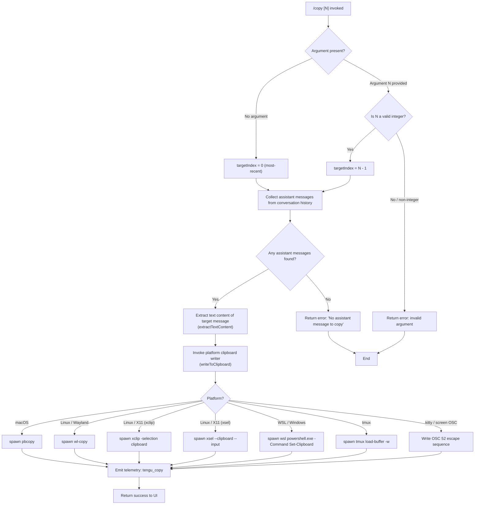

# `/copy`

> Analysis basis: CC v2.1.163 bundle.js (AST extraction + Claude interpretation)
> Minimum version: v2.1.163

---

## Overview

`/copy` copies Claude's last assistant response to the system clipboard. An optional numeric argument `N` selects the Nth-latest assistant message instead of the most recent one. The command resolves the target message text, invokes a platform-appropriate clipboard writer, and fires a single telemetry event on completion.

---

## Registration

| Field | Value |
|---|---|
| type | `local-jsx` |
| name | `copy` |
| description | `Copy Claude's last response to clipboard (or /copy N for the Nth-latest)` |
| loc_byte | `11003276` |
| loc_byte_end | `11003462` |
| loc_line | `7342` |
| module_id | `Fuq` |
| load_inline | `true` |
| arbor_handler.name | `jYf` |
| arbor_handler.fqn | `claude-2.1.163::jYf` |
| arbor_handler.kind | `AsyncFunction` |
| arbor_handler.resolution_path | `module_id` |
| arbor_handler.n_hits | `0` |

Analysis basis: CC v2.1.163 bundle.js:+11003276

---

## Input Branching

The handler has four distinct paths depending on whether a numeric argument is present, whether any assistant messages exist, and which clipboard backend is selected. A Mermaid flowchart is used.



Analysis basis: CC v2.1.163 bundle.js:+11002461 – +11002969

---

## Behavioral Spec

### 1. Entry Point — `mainHandler` (`jYf`)

The Arbor-resolved handler is `jYf` (AsyncFunction, resolved via `module_id` → `Fuq`).

```
async function mainHandler(commandArgs, appContext):
    rawArg = commandArgs.trim()

    if rawArg is non-empty:
        n = Number(rawArg)
        if not Number.isInteger(n) or n < 1:
            return errorResult("invalid argument — expected a positive integer")
        targetIndex = n - 1          // 0-based offset from most-recent
    else:
        targetIndex = 0              // default: most-recent assistant turn

    messages = collectAssistantMessages(appContext)  // puq / lK
    if messages.length == 0:
        return errorResult("No assistant message to copy")

    selectedMessage = messages[targetIndex]
    if selectedMessage is undefined:
        return errorResult("No assistant message at index " + (targetIndex + 1))

    plainText = extractTextContent(selectedMessage)  // muq / $Yf
    writeToClipboard(plainText)                      // P8A / AG
    emit telemetry("tengu_copy")
    return successResult()
```

Analysis basis: CC v2.1.163 bundle.js:+11002461, +11002500, +11002571, +11002585, +11002815

---

### 2. Assistant Message Collection — `collectAssistantMessages` (`puq`)

Filters the conversation message list to retain only entries whose role equals `"assistant"` and whose content contains at least one `"text"` block.

```
function collectAssistantMessages(appContext):
    allMessages = appContext.messages            // full conversation array
    result = []
    for each msg in allMessages:
        if Array.isArray(msg.content):
            textBlocks = filterTextBlocks(msg.content)   // lK / H.filter
            if textBlocks.length > 0:
                result.push(msg)
        else if msg.role == "assistant":
            result.push(msg)
    return result   // ordered oldest-first; index 0 of reversed = most-recent
```

The literal `"assistant"` is confirmed at bundle.js:+10998409; `"text"` at bundle.js:+10725481.

Analysis basis: CC v2.1.163 bundle.js:+10998479, +10998511, +10998527

---

### 3. Text Extraction — `extractTextContent` (`muq` / `$Yf`)

Converts the selected message's content blocks into a single plain-text string. Tables are rendered with column separators; the pipe character `|` is escaped as `\|` in cells.

```
function extractTextContent(message):
    contentBlocks = message.content
    parts = []
    for each block in contentBlocks:
        if block.type == "text":
            parts.push(normaliseText(block.text))   // $Yf / UXH
        else if block.type == "table":
            parts.push(renderTable(block))          // uuq
    return parts.join("\n")
```

#### Table Rendering — `renderTable` (`uuq`)

Renders a structured table block into a pipe-delimited text representation.

```
function renderTable(tableBlock):
    rows = tableBlock.rows
    // compute column widths using Bun.stringWidth for Unicode correctness (A8)
    colWidths = rows
        .map(row => row.cells.map(cell => stringWidth(cell)))
        .reduce(maxPerColumn, [])

    // enforce minimum column width of 3
    colWidths = colWidths.map(w => Math.max(w, 3))

    // build header row, separator row, and data rows
    lines = []
    for each row in rows:
        cells = row.cells.map((cell, i) => padCell(cell, colWidths[i], row.align))
        lines.push(" | " + cells.join(" | ") + " | ")

    // insert separator after header
    insert separator line after lines[0]
    return lines.join("\n")
```

Column alignment values observed in literals: `"center"`, `"right"`, `"left"` (bundle.js:+10997784, +10997826, +10997866). Separator character for pipe literal `"|"` escaped as `"\\|"` (bundle.js:+10997590). Minimum separator/pipe literal `" | "` (bundle.js:+10997749).

Analysis basis: CC v2.1.163 bundle.js:+10997547, +10997563, +10997574, +10997640, +10997654, +10997938

---

### 4. Clipboard Writer — `writeToClipboard` (`P8A` / `AG`)

Detects the runtime environment and dispatches to the appropriate clipboard mechanism. All subprocess spawns use a 2000 ms timeout (bundle.js:+3432630).

```
async function writeToClipboard(text):
    encoded = encodeText(text, "utf8")   // or "base64" for OSC path

    platform = detectPlatform()          // AG / aP_

    if platform == "macos":
        spawnAndWrite("pbcopy", [], text)                          // +3432664
    else if platform == "linux":
        if waylandAvailable():
            spawnAndWrite("wl-copy", [], text)                     // +3431995
        else if xclipAvailable():
            spawnAndWrite("xclip", ["-selection", "clipboard"], text)  // +3432064, +3432857
        else:
            spawnAndWrite("xsel", ["--clipboard", "--input"], text)    // +3432105, +3432944, +3432958
    else if platform == "wsl" or platform == "windows":
        spawnAndWrite("wsl", ["powershell.exe", "-NoProfile",
            "-NonInteractive", "-Command", "Set-Clipboard"], text) // +3433020..+3433079
    else if inTmux():
        spawnAndWrite("tmux", ["load-buffer", "-w", "-"], text)    // +3432236, +3432270
    else if terminal == "kitty" or terminal == "screen":
        writeOSC52EscapeSequence(encoded)                          // +3431466, +3430997

    // iTerm2 path also detected (+3432226)
    // sP_ handles Linux sub-path selection (wl-copy / xclip / xsel)
```

Clipboard tool string literals confirmed: `"pbcopy"` (+3432664), `"wl-copy"` (+3431995), `"xclip"` (+3432064), `"xsel"` (+3432105), `"powershell.exe"` (+3433030), `"tmux"` (+3432298), `"kitty"` (+3431466), `"screen"` (+3430997), `"iTerm2"` (+3432226).

Temporary file support via `Buq` / `lj`: a temporary directory under `/tmp` (bundle.js:+4016076) is created with permissions `0o700` (448 decimal, bundle.js:+4016757) and `0o777` (511, bundle.js:+4016567) when a file-backed clipboard path is needed. The directory base is overrideable via `CLAUDE_CODE_TMPDIR` (implied by literal at bundle.js:+4016151).

Analysis basis: CC v2.1.163 bundle.js:+10998825, +3432430, +3432436, +3432449, +3432516, +3432558, +10998866, +10998905

---

### 5. Error Path — No Assistant Message

When the conversation contains no assistant turns, the literal string `"No assistant message to copy"` is surfaced to the user (bundle.js:+11002502) and the command returns without writing to the clipboard or emitting telemetry.

Analysis basis: CC v2.1.163 bundle.js:+11002500, +11002502

---

## State & Side Effects

| Item | Detail |
|---|---|
| Telemetry | `tengu_copy` (bundle.js:+11002880) — fired on every successful clipboard write |
| Telemetry (indirect, reachable) | `tengu_feature_ok` (+1010222), `tengu_feature_bad` (+1010284), `tengu_feature_sad` (+1010365) — from shared feature-result helper (`c` / `RH` / `hH`) |
| Clipboard write | Writes plain text to OS clipboard via subprocess or OSC 52 escape |
| Subprocess spawned | One of: `pbcopy`, `wl-copy`, `xclip`, `xsel`, `powershell.exe` (via `wsl`), `tmux load-buffer` — timeout 2000 ms |
| Temporary files | May create a file under `/tmp` (or `CLAUDE_CODE_TMPDIR`) with mode `0o700`; cleaned up after write |
| appState changes | None — read-only access to conversation message history |
| Sound | None observed in depth-2 traversal |
| Hook registration | None observed in depth-2 traversal |

---

## Version History

| Version | Change |
|---|---|
| v2.1.163 | Initial analysis |

---

## Common Mistakes

1. **Passing a non-integer or zero as `N`**: `/copy 0` or `/copy foo` — the handler validates with `Number.isInteger` and rejects non-positive values. Use `/copy 1` for the most-recent message (equivalent to `/copy`).
2. **Running `/copy` when the session has no assistant turns**: The command returns the error `"No assistant message to copy"` immediately. Ensure at least one assistant response exists in the current conversation.
3. **Using `/copy N` with N larger than the number of assistant messages**: The selected index will be `undefined`; the command returns an out-of-range error rather than silently copying nothing.
4. **Clipboard tool not installed on Linux**: The command tries `wl-copy` → `xclip` → `xsel` in order. If none is present, the clipboard write silently fails. Install at least one of these utilities.
5. **WSL clipboard path**: On WSL, the command shells out to `wsl powershell.exe`. If `wsl` is not accessible from the current `PATH`, the write will fail with no visible error.

---

## Appendix — Identifier Mapping

> For bundle debugging only. Identifiers change across versions.

| Identifier | Role |
|---|---|
| `jYf` | Main handler — async entry point for `/copy` command |
| `puq` | Assistant message collector — filters conversation history by role |
| `lK` | Text-block filter — retains content blocks of type `"text"` |
| `muq` | Text extractor — joins text and table blocks into a plain string |
| `$Yf` | Single-block text normaliser — strips/formats one content block |
| `UXH` | Text replacement helper used during block normalisation |
| `uuq` | Table renderer — converts structured table block to pipe-delimited text |
| `OYf` | Column mapper used inside table renderer |
| `A8` | Unicode string-width measurer (wraps `Bun.stringWidth`) |
| `P8A` | Clipboard write orchestrator — selects platform path |
| `AG` | Platform-clipboard dispatcher — branches on OS/terminal type |
| `aP_` | Platform detector helper |
| `HK8` | Clipboard method resolver |
| `FY` | Low-level clipboard write primitive |
| `As1` | Clipboard subprocess spawner with timeout |
| `C8` | Spawn helper (platform process launcher) |
| `sP_` | Linux clipboard sub-selector (wl-copy / xclip / xsel) |
| `qNL` | Clipboard result handler |
| `bW` | OSC 52 escape sequence writer (tmux/kitty path) |
| `sJ` | tmux load-buffer helper |
| `_s1` | kitty/screen OSC clipboard helper |
| `Buq` | Temporary file writer for clipboard backing file |
| `lj` | Temporary directory creator and permission setter |
| `Wu` | Temp path resolver |
| `JK9` | Directory stat/chmod helper |
| `r4` | Index-of helper used during argument parsing |
| `G$` | Lexer wrapper (used for message content parsing) |
| `Uuq` | Plain-text format converter |
| `S6` | Config/context accessor |
| `Q6` | Config directory resolver |
| `vX_` | Config path helper |
| `bDH` | Config file reader/writer |
| `nr` | Status daemon helper |
| `L4H` | Status trimmer/formatter |
| `TKK` | Daemon status reader |
| `JR6` | Daemon status path builder |
| `SH` | JSON serialiser wrapper |
| `N9` | AsyncLocalStorage store accessor |
| `c` | Feature result handler (ok path) |
| `RH` | Feature result handler (bad path) |
| `hH` | Feature result handler (sad path) |
| `P6` | Nu6 platform helper |
| `W6` | Nu6 platform helper (variant) |
| `sk6` | MCP server filter helper |
| `zA6` | Integer parser (base 10) |
| `SI8` | Integer parser (base 20 range check) |
| `tkq` | Async queue / concurrency helper |
| `hB` | Async mapper / iterator utility |
| `AbH` | MCP server initialiser / tool-registration orchestrator |
| `bl` | MCP config loader |
| `wG6` | MCP scope handler |
| `ws` | MCP connection manager |
| `Cl` | MCP SDK config collector |
| `xY8` | MCP config error reporter |
| `DG6` | MCP SSE/HTTP connection handler |
| `fk` | MCP connection factory |
| `oO` | MCP connection state machine |
| `Mb_` | MCP connection teardown helper |
| `VXH` | MCP tool-hash builder |
| `CY8` | MCP tool-list differ |
| `bY8` | MCP tool-list hasher |
| `GP` | MCP hash helper |
| `SY8` | MCP tool-list snapshot |
| `M4` | MCP metadata builder |
| `O8` | MCP debug logger |
| `os_` | MCP server lifecycle runner |
| `pKf` | MCP OAuth URL builder |
| `Ad` | MCP auth helper |
| `i1H` | MCP OAuth init helper |
| `r1H` | MCP reconnect delay helper |
| `o1H` | MCP OAuth flow runner |
| `r_6` | MCP pending-request tracker |
| `D` | Process shutdown handler |
| `HI8` | MCP needs-auth cache reader |
| `Sn` | MCP server reconnector |
| `kx` | Platform key helper |
| `Y` | Daemon supervisor writer |
| `T7` | MCP error logger |
| `EH` | Error-to-string converter |
| `UKf` | MCP auth URL extractor |
| `mKf` | SSH/remote detector |
| `as_` | MCP OAuth complete-auth handler |
| `i_6` | Pending OAuth liveness check |
| `o_6` | OAuth nonce getter |
| `Kyq` | MCP tool-list refresher |
| `hI8` | MCP needs-auth cache path builder |
| `rs_` | MCP tool-list fetcher |
| `Ab_` | MCP tool wrapper / sanitiser |
| `X8` | Global config saver |
| `j` | Background session manager |
| `R` | Background worker handle |
| `FN` | MCP skill loader |
| `D6` | Skill file watcher |
| `I` | Chokidar file-watch helper |
| `S` | Transient worker writer |
| `tU8` | MCP connection result applier |
| `_bH` | MCP orphan detector |
| `mk` | MCP slot cleanup runner |
| `$A6` | MCP slot hash builder |
| `VYA` | MCP server map updater |
| `mY8` | MCP capability checker |
| `l8` | Timeout-with-abort helper |
| `muq` | (see above — text extractor) |
| `G$` | (see above — lexer wrapper) |
| `Uuq` | (see above — plain-text converter) |
| `e$` | Bootstrap fetch helper |
| `Pw_` | Prompt-body line parser |
| `ZHH` | Prompt feature-flag checker |
| `uj` | Prompt text replacer |
| `t1` | Prompt token counter |
| `H` | Bootstrap/config fetch dispatcher |
| `v` | HTTP request builder |
| `__` | Underscore utility wrapper |
| `rkq` | MCP tool-list refresh scheduler |
| `et_` | MCP tool-list fetch trigger |
| `EDA` | Daemon socket connector |
| `IDA` | Daemon worker lifecycle manager |
| `Nb8` | macOS memory pressure reporter |
| `zX6` | CLAUDE_CODE_TMPDIR reader |
| `kH` | Daemon spawn error handler |
| `g` | Background process reaper |
| `w` | Background worker dispatcher |
| `b` | Background worker kill helper |
| `XTL` | Config file watcher |
| `No` | File-watch event normaliser |
| `j9` | Signal handler registrar |

---

Note: index built via Arbor fallback; some signals (telemetry, literals) may be missing — see arbor-fallback.js.