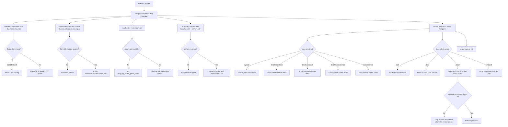

# `/daemon`

> Analysis basis: CC v2.1.163 bundle.js (AST extraction + Claude interpretation)
> Minimum version: v2.1.163

---

## Overview

The `/daemon` command provides a management interface for Claude Code's background services and long-running routines. It surfaces real-time status of the background worker pool, scheduled tasks, and the macOS `launchd` service agent, and exposes controls to start, stop, restart, or inspect those services. The command renders an interactive JSX UI panel that is unmounted on exit.

---

## Registration

| Field | Value |
|---|---|
| type | `local-jsx` |
| name | `daemon` |
| description | `Manage background services and routines` |
| immediate | `true` |
| module_id | `G7A` |
| load_inline | `true` |
| loc_byte | `12958763` |
| loc_byte_end | `12958931` |
| loc_line | `9602` |
| arbor_handler.name | `omf` |
| arbor_handler.fqn | `claude-2.1.163::omf` |
| arbor_handler.kind | `AsyncFunction` |
| arbor_handler.resolution_path | `module_id` |
| arbor_handler.n_hits | `0` |

Analysis basis: CC v2.1.163 bundle.js:+12958763

---

## Input Branching

The command exposes six or more distinct view/action states (tab strings found in literals: `"new"`, `"detail-scheduled"`, `"detail-assistant"`, `"detail-remoteControl"`, `"system"`, `"remoteControl"`, `"uninstall"`, `"restart"`, `"start"`, `"stop"`). A Mermaid flowchart is used.



Analysis basis: CC v2.1.163 bundle.js:+12958051, +12947511, +11472417, +12947394

---

## Behavioral Spec

### Handler Entry — `omf` (AsyncFunction)

The Arbor-resolved handler `omf` is the true entry point (resolution path: `module_id` → `G7A`). It launches three parallel async operations and then hands off to the JSX renderer.

```
async function daemonCommandHandler(context):
    [daemonStatus, homeDirInfo, scheduledTaskTree] = await Promise.all([
        collectAllDaemonStatus(),   // P7A
        resolveDaemonHome(),        // j7A
        buildScheduledTaskTree()    // Y7K
    ])
    mountDaemonUI(daemonStatus, homeDirInfo, scheduledTaskTree)
```

Analysis basis: CC v2.1.163 bundle.js:+12947511

---

### Sub-feature: Collect All Daemon Status — `collectAllDaemonStatus` (P7A)

Runs up to six parallel status readers and process-signal checks.

```
async function collectAllDaemonStatus():
    [roster, serviceStatus, scheduledStatus,
     rosterParsed, launchdInfo, bgWorkers] = await Promise.all([
        readDaemonRoster(),             // pWH
        readDaemonStatusFile(),         // VKK  → "daemon.status.json"
        readScheduledStatusFile(),      // o4K  → "daemon.scheduled.status.json"
        parseRosterEntries(),           // L7K
        queryLaunchctlService(),        // ln
        enumerateBgWorkers()            // Pg   → "roster.json"
    ])
    return aggregated object
```

Analysis basis: CC v2.1.163 bundle.js:+12947062

---

### Sub-feature: Read Daemon Status File — `readDaemonStatusFile` (VKK)

```
async function readDaemonStatusFile():
    path = joinPath(dataDir, "daemon.status.json")   // JR6
    try:
        raw = await readFile(path)
        parsed = JSON.parse(raw)
        if process.kill(parsed.pid, 0) succeeds:
            return { running: true, ...parsed }
        else:
            return { running: false }
    catch ENOENT:
        return { running: false }
```

Key file name: `"daemon.status.json"` (bundle.js:+12743477).

Analysis basis: CC v2.1.163 bundle.js:+12743763

---

### Sub-feature: Read Scheduled Daemon Status — `readScheduledStatusFile` (o4K)

```
async function readScheduledStatusFile():
    path = joinPath(dataDir, "daemon.scheduled.status.json")   // r4K
    try:
        raw = await readFile(path)
        parsed = JSON.parse(raw)
        alive = process.kill(parsed.pid, 0)
        return { running: alive, ...parsed }
    catch:
        return { running: false }
```

Key file name: `"daemon.scheduled.status.json"` (bundle.js:+12833973).

Analysis basis: CC v2.1.163 bundle.js:+12947150

---

### Sub-feature: Parse Roster Entries — `parseRosterEntries` (L7K)

```
async function parseRosterEntries():
    [workerList, logEntries] = await Promise.all([
        readWorkerList(),     // x96 — reads "scheduled" entries
        readLogEntries()      // kH
    ])
    mergedStatus = mergeWithRunningProcesses(workerList, logEntries)  // X0
    return mergedStatus
```

The `x96` reader checks for entries with kind `"scheduled"` (bundle.js:+12835478). On encountering stale sockets it calls `xuK.unlinkSync` to clean them up.

Analysis basis: CC v2.1.163 bundle.js:+12941734

---

### Sub-feature: Query macOS launchd Service — `queryLaunchctlService` (ln)

```
async function queryLaunchctlService():
    if platform != "darwin":
        return null
    uid = process.getuid()         // qFq
    label = buildServiceLabel(uid) // C8 → S_
    result = await spawnWithTimeout(
        "launchctl", ["print", "gui/<uid>/<label>"],
        timeoutMs = 5000           // bundle.js:+11472464
    )
    return parseLaunchctlOutput(result)
```

The command string `"launchctl"` and sub-command `"print"` are explicit literals (bundle.js:+11472417, +11472430). Service operations map to literal strings: `"kickstart"` (start), `"bootout"` (stop), `"restart"`. macOS-only: `"service uninstall not available on darwin"` is surfaced for `"uninstall"` on that platform (bundle.js: string at +11471107 indicates the guard).

Analysis basis: CC v2.1.163 bundle.js:+11472414

---

### Sub-feature: Enumerate Background Workers / Roster — `enumerateBgWorkers` (Pg)

```
async function enumerateBgWorkers():
    path = joinPath(rosterDir, "roster.json")   // IMH → rbH
    try:
        raw = await readFile(path)
        roster = JSON.parse(raw)
        validate roster structure              // UXf
        for each entry in roster:
            check age via Date.now()           // n_A
            attempt log rotation               // wFq → A16.rename
            emit tengu_bg_roster_parse_failed on error
    catch:
        emit tengu_bg_roster_parse_failed
        return []
```

Key file name: `"roster.json"` (bundle.js:+11474943). Telemetry: `tengu_bg_roster_parse_failed` (bundle.js:+11478606).

Analysis basis: CC v2.1.163 bundle.js:+12947172

---

### Sub-feature: Resolve Daemon Home Directory — `resolveDaemonHome` (j7A)

```
async function resolveDaemonHome():
    homeDir = os.homedir()                           // rLK.homedir
    daemonPath = joinPath(homeDir, ...)              // q$H.join
    stat = await fs.stat(daemonPath)                 // CR6.stat
    if stat exists:
        return { path: daemonPath, role: "assistant" }  // "assistant" literal: +12931415
    return { path: null }
```

Analysis basis: CC v2.1.163 bundle.js:+12931355

---

### Sub-feature: Build Scheduled Task Tree — `buildScheduledTaskTree` (Y7K → dA6)

```
async function buildScheduledTaskTree():
    componentTree = buildDisplayComponents()   // hDf — large UI tree builder
    tasks = filterScheduledTasks()             // _.some / _.push
    for task in tasks:
        if task.id.startsWith("anthropic."):   // bundle.js:+11071344
            tag as first-party
        else:
            tag as "Custom model" / gateway
    return rendered task tree with model metadata
```

The tree builder `hDf` assembles many sub-components (`Dy8`, `Hpq`, `Kpq`, `qpq`, `smq`, etc.) for rendering model selection and plan-mode detail panels.

Analysis basis: CC v2.1.163 bundle.js:+12947394

---

### Sub-feature: JSX Panel Renderer — `renderDaemonUI` (W7A)

```
function renderDaemonUI(daemonStatus, homeDirInfo, scheduledTaskTree):
    [tab, setTab] = useState(initialTab)
    timestamp = Date.now()             // used for uptime display
    serviceAgent = useLaunchdAgent()   // eA6 — macOS agent helper
    launchdStatus = useServiceStatus() // Zh6 — polls launchd state

    render panel with tabs:
        "system"              → system info view
        "detail-scheduled"    → scheduled task detail
        "detail-assistant"    → assistant session detail
        "detail-remoteControl"→ remote control detail
        "remoteControl"       → remote control panel

    handle keyboard input:   E (key handler)
    on unmount: M.unmount()  // bundle.js:+12958350
```

Literal tab names confirmed: `"system"`, `"detail-scheduled"`, `"detail-assistant"`, `"detail-remoteControl"`, `"remoteControl"`, `"new"`, `"uninstall"` (bundle.js:+12948342, +12948500, +12948621, +12948873, +12948918, +12948440, +12948153).

Analysis basis: CC v2.1.163 bundle.js:+12947722

---

### Sub-feature: Service Control Actions

```
async function stopDaemonService():
    emit tengu_daemon_control
    send SIGTERM to daemon process
    on success → emit "daemon_stop"   // bundle.js:+16170185
    on failure → emit "daemon_stop_failed"  // bundle.js:+16170222

async function restartDaemonService():
    await stopDaemonService()
    wait up to 10 s (50 × 200 ms polls) for process exit
    if not exited:
        log "daemon did not exit within 10s of SIGTERM; restart aborted before kickstart"
        return
    kickstart service
```

Telemetry: `tengu_daemon_control` (bundle.js:+16170260).

Analysis basis: CC v2.1.163 bundle.js:+11471660

---

### Sub-feature: Background Worker Lifecycle (via daemon supervisor)

```
function daemonSupervisorTick():
    // Runs continuously in daemon process
    for each worker in pool:
        worker.retireIfSettled()
        if lowMemory():
            shed non-pinned workers
            if still low: retire pinned settled workers  // tengu_bg_retire_pinned_low_mem
    spareWorkerManagement()    // tengu_bg_spare_enable, tengu_bg_spare_claim
    prewarmPerSweep()          // tengu_bg_prewarm_per_sweep
```

Free-memory threshold: 480 MB (bundle.js:+13015378); polling interval: 60 000 ms (bundle.js:+13015383). Low-memory constant: 1 024 MB threshold for macOS (bundle.js:+13015246, label `"macos"`).

Analysis basis: CC v2.1.163 bundle.js:+16137269

---

### Sub-feature: Scheduled Task Firing

```
function scheduledTaskFire(task):
    emit tengu_scheduled_task_fire
    mark task active
    if task recurring:
        reschedule for next interval
    else:
        mark task as expired → emit tengu_scheduled_task_expired
    advance grace clocks   // d.shiftGraceClocksForward
```

A task's schedule loop uses `lK5.isLoopDefaultSentinel` to detect the default idle sentinel and the literal `" (recurring)"` (bundle.js:+15637838) for display.

Analysis basis: CC v2.1.163 bundle.js:+15637861

---

## State & Side Effects

| Item | Detail |
|---|---|
| Telemetry | `tengu_bg_roster_parse_failed`, `tengu_daemon_config_reload`, `tengu_daemon_control`, `tengu_daemon_stop` (via literal `"daemon_stop"`), `tengu_daemon_stop_failed`, `tengu_daemon_yield`, `tengu_daemon_idle_exit`, `tengu_bg_dispatch_sigkill_escalate`, `tengu_bg_dispatch_low_mem`, `tengu_bg_low_mem_mb`, `tengu_bg_adopt_sock_unlinked`, `tengu_bg_spare_enable`, `tengu_bg_spare_claim`, `tengu_bg_spare_claim_fail`, `tengu_bg_sendclaim_failed`, `tengu_bg_state_read_transient`, `tengu_bg_prewarm_per_sweep`, `tengu_bg_retire_pinned_low_mem`, `tengu_bg_retire_grace_bridged_min`, `tengu_bg_attach_upgrade`, `tengu_scheduled_task_fire`, `tengu_scheduled_task_expired`, `tengu_mcp_oauth_flow_start`, `tengu_mcp_oauth_flow_success`, `tengu_mcp_oauth_flow_error`, `tengu_mcp_reconnect`, `tengu_mcp_reconnect_not_connected`, `tengu_mcp_reconnect_failed`, `tengu_skill_file_changed`, `tengu_mcp_skills`, `tengu_feature_ok`, `tengu_feature_bad`, `tengu_feature_sad`, `tengu_config_parse_error`, `tengu_config_auth_loss_prevented` |
| Files read | `daemon.status.json`, `daemon.scheduled.status.json`, `roster.json`, `daemon.json`, `mcp-needs-auth-cache.json` |
| Files written / rotated | `roster.json` log rotation via `A16.rename`; stale socket files removed via `xuK.unlinkSync` |
| Process signals sent | `SIGTERM` (stop/restart), `SIGKILL` (escalation after timeout), `process.kill(pid, 0)` for liveness check |
| Platform-specific | `launchctl print / kickstart / bootout` — darwin only; `process.getuid()` used to build `gui/<uid>/...` service label |
| JSX lifecycle | Panel mounted via `M.render`; unmounted via `M.unmount` on command exit |
| appState changes | `tengu_daemon_config_reload` fired when daemon config is reloaded; supervisor tick updates worker pool state |
| Sound | None observed |

---

## Version History

| Version | Change |
|---|---|
| v2.1.163 | Initial analysis |

---

## Common Mistakes

1. **Expecting output on non-darwin platforms for service controls**: The `launchctl`-based start/stop/restart/uninstall actions are gated on `platform === "darwin"`. On Linux the launchd section is skipped and service controls are unavailable.
2. **Assuming `/daemon` blocks the REPL**: The command is registered with `immediate: true` and renders a JSX panel. The panel must be explicitly dismissed; it does not auto-close after printing output.
3. **Interpreting "restart" as instantaneous**: The restart flow waits up to 10 seconds (50 × 200 ms) for the daemon process to exit after SIGTERM. If the process does not exit in time, the restart is aborted and logged without performing the `kickstart`.
4. **Editing `daemon.status.json` or `roster.json` by hand**: The command reads these files at invocation time. Race conditions with the daemon writing the same files may cause parse failures logged as `tengu_bg_roster_parse_failed`.
5. **Expecting MCP OAuth controls here**: OAuth flow telemetry (`tengu_mcp_oauth_flow_*`) is reachable from the daemon panel's MCP reconnect path, but the primary OAuth entry point is the MCP settings panel, not `/daemon` directly.

---

## Appendix — Identifier Mapping

> For bundle debugging only. Identifiers change across versions.

| Identifier | Role |
|---|---|
| `omf` | Main async handler for `/daemon` (Arbor-resolved, AsyncFunction) |
| `qpf` | JSX render wrapper; calls `M.render`, `M.unmount`, assembles panel |
| `W7A` | React component: daemon UI panel (useState, useRef, keyboard handler) |
| `P7A` | `collectAllDaemonStatus`: parallel status gatherer |
| `pWH` | Read raw daemon roster helper |
| `L7K` | `parseRosterEntries`: merge worker list + log entries |
| `x96` | Read worker list; detects `"scheduled"` entries |
| `ZLA` | Low-level JSON file reader (readFile → JSON.parse) |
| `oLA` | Array-shape roster validator |
| `kH` | Read and process log entries |
| `HA` | Error/string coercion helper |
| `eH` | String coercion utility |
| `Dq` | Route traffic classifier (`"essential-traffic"`) |
| `HW4` | Sliding-window queue (shift/push) |
| `X0` | Merge running process list with roster via `process.kill` |
| `Wh6` | Read PID file; parse for process identity |
| `u_A` | Parse `"claude daemon"` process list from `/proc` or `ps` output |
| `w2` | Utility: wrap async with timeout |
| `tLK` | Status aggregator: reads daemon status file, enumerates same-dir sockets |
| `C0H` | Low-level status file reader; handles `ENOENT` |
| `N9` | Async-local storage getter (`FZL.getStore`) |
| `VKK` | `readDaemonStatusFile`: reads `daemon.status.json`, liveness-checks PID |
| `JR6` | Build path to `daemon.status.json` |
| `o4K` | `readScheduledStatusFile`: reads `daemon.scheduled.status.json` |
| `r4K` | Build path to `daemon.scheduled.status.json` |
| `Pg` | `enumerateBgWorkers`: reads `roster.json`, rotates logs |
| `IMH` | Build path to `roster.json` |
| `rbH` | Build base roster directory path |
| `n_A` | Compute age of roster entry via `Date.now` |
| `wFq` | Log rotation: rename roster log file |
| `UXf` | Validate roster structure (Array + Object.keys check) |
| `h1` | Emit `Nu6` notification helper |
| `ln` | `queryLaunchctlService`: spawns `launchctl print` on darwin |
| `C8` | Build launchd service label string |
| `S_` | Spawn child process with capture |
| `b6` | Low-level spawn helper |
| `Qy8` | Get current user UID for launchd label |
| `qFq` | Calls `process.getuid()` |
| `j7A` | `resolveDaemonHome`: stat home directory, determine `"assistant"` role |
| `X_` | Utility: identity / pass-through |
| `td6` | Read file with `R8` error guard |
| `Y7K` | `buildScheduledTaskTree`: top-level scheduled UI tree entry |
| `dA6` | Build scheduled task display tree |
| `hDf` | Large UI component tree builder (assembles model/plan panels) |
| `ZA` | React component: base node |
| `Dy8` | Model selection component sub-builder |
| `Hpq` | Opus 1M context panel builder |
| `emq` | Sonnet panel builder |
| `Kpq` | Opus 4.8 panel builder |
| `qpq` | Opus panel builder |
| `smq` | Opus 4.8 1M window panel builder |
| `imq` | Sonnet 1M window import |
| `rmq` | Sonnet base panel builder |
| `amq` | Opus 4.6 / 4.7 panel builder |
| `tmq` | Haiku panel builder (Q8A import) |
| `Apq` | Haiku display component builder |
| `GDf` | Z5-based display node |
| `ZDf` | Model display node with A4H |
| `TDf` | Model display node |
| `NDf` | Model display node |
| `EDf` | Model display node |
| `VDf` | Model display node with A4H variant |
| `IDf` | IDf display node (NQH + Apq + vDf) |
| `SDf` | Scheduled task display formatter |
| `S6` | Config/settings file watcher + backup |
| `bDH` | Config file reader/writer (readFileSync, statSync, mkdirSync) |
| `XTL` | File watch setup with `watchFile` / `unwatchFile` |
| `D6H` | Settings path resolver |
| `yd` | Settings line parser |
| `QA6` | Filtered settings builder |
| `NE` | Display node: gM + Z5 + XA |
| `XA` | String-to-display coercion (via `eH`) |
| `gM` | Core model/display primitive |
| `Z5` | Base display element (amH + O8L + T$1 + Us6 + XA) |
| `omf` | (repeated) AsyncFunction handler — canonical entry point |
| `M` | Ink render instance (`AbH` + `tU8` subtree) |
| `AbH` | MCP server connection orchestrator |
| `bl` | MCP connection slot manager |
| `ws` | MCP connection runner (per-slot) |
| `Cl` | SDK-type MCP config collector |
| `xY8` | MCP error colour renderer (red/yellow) |
| `DG6` | MCP SSE/HTTP connection builder |
| `fk` | MCP connection cache/finaliser |
| `oO` | MCP state emitter (`qlH` + `S6` + `m9`) |
| `rkq` | MCP tool hash builder |
| `et_` | MCP server entry reader (`N9` + `hI8` + `B6`) |
| `VXH` | MCP config hash (SHA-256 via `du9.createHash`) |
| `CY8` | MCP config key enumerator |
| `bY8` | MCP config hash wrapper |
| `GP` | MCP config hash (Uu9.createHash path) |
| `SY8` | MCP config state helper (`M4`) |
| `M4` | MCP state item (`EP1`) |
| `O8` | MCP debug logger (`hBH.push` + `Er.logMCPDebug`) |
| `os_` | MCP server connection handler (large; OAuth, reconnect, lifecycle) |
| `o1H` | OAuth flow handler (full HTTP callback server, token exchange) |
| `r_6` | Pending-connection tracker (`nv8`) |
| `Sn` | MCP reconnect logic |
| `Kyq` | MCP reconnect trigger |
| `hI8` | MCP needs-auth cache path builder |
| `rs_` | MCP result serialiser |
| `Ab_` | MCP tool includes checker |
| `X8` | Config safety write helper |
| `j` | Worker kill iterator |
| `R` | Background worker process wrapper |
| `FN` | MCP skills event emitter (`D6`) |
| `D6` | Skill file registration (`tw6.add`, `eU`) |
| `I` | Worker I/O item |
| `W6` | Notification helper (`Nu6`) |
| `S` | Worker stdout writer |
| `tkq` | Pagination helper (`hB`) |
| `hB` | Async iterator / stream consumer |
| `zA6` | Integer parser (parseInt) |
| `SI8` | Integer parser variant |
| `tU8` | MCP update applicator |
| `_bH` | MCP config hash applicator (`VXH`) |
| `mk` | MCP cleanup + `FN` re-emit |
| `$A6` | MCP hash computer (`VXH`) |
| `TKK` | Daemon status polling timer |
| `nr` | Path join helper (`L4H`) |
| `VYA` | MCP server map renderer |
| `mY8` | MCP filter (aY7 + qb_ sets) |
| `l8` | Retry-with-timeout helper |
| `O` | Background session object (`b8`) |
| `eA6` | macOS LaunchAgent install helper |
| `B_A` | Build `~/Library/LaunchAgents` path |
| `Zh6` | macOS service status poller |
| `F_A` | launchd service kickstart helper (setTimeout 50 ms poll) |
| `E` | Keyboard input handler (preventDefault + `t0`) |
| `t0` | Top-level key router |
| `r_` | Settings loader (all tiers: policy, flag, user, project, local) |
| `cO` | Settings cache hit handler |
| `F6_` | Settings file locator |
| `Kd` | Settings file parser (all format variants) |
| `oP` | Settings lock helper (`Zr`) |
| `mH_` | Settings timestamp recorder (`Rc6.set`) |
| `rTH` | Settings re-parser after lock |
| `TM6` | Atomic settings file writer (symlink + rename) |
| `sz` | Settings cache clearer (`Mm6.clear`, `BF8.clear`) |
| `vc6` | Settings file append/write handler |
| `hx` | `.claude/settings.json` path builder |
| `DU` | Settings disk load orchestrator |
| `w` | Background dispatcher / supervisor tick |
| `IDA` | Worker lifecycle manager (spawn, retire, kill, roster) |
| `yK` | Worker pins path builder |
| `e9` | Worker state reader (stat + JSON parse) |
| `jY` | Worker active-state helper (`$N`) |
| `ff` | Worker fingerprint builder (`SH`) |
| `q16` | Roster entry log writer (`Pg`) |
| `kMH` | Roster directory path builder |
| `VT` | Roster entry reader |
| `Xg` | Roster entry writer |
| `Vh6` | Roster base dir creator (`l_A`) |
| `EDA` | Worker spawn + claim sender |
| `e5A` | Worker metadata file writer |
| `z55` | Send-claim timeout / ECONNREFUSED handler |
| `O55` | Build claim frame (`Fg.buildClaimFrame`) |
| `zg` | Binary frame encoder (Buffer + UInt32BE + UInt8) |
| `g` | Individual background worker process object |
| `C` | Rate-limit event enqueuer |
| `Q` | Idle-exit timer |
| `lR6` | Low-memory roster reader |
| `WfK` | Low-memory D6 helper |
| `l` | Worker log/retire helper |
| `eBq` | Unlink PID file helper (`Kp.unlink`) |
| `vb8` | Low-memory D6 path |
| `r` | MCP server reconnect wrapper |
| `P` | Text input / vim-mode editor component |
| `A3A` | Vim key-binding handler |
| `Cof` | Vim normal-mode dispatcher |
| `cJK` | Vim operator handler |
| `bof` | Vim count+operator handler |
| `xof` | Vim motion handler |
| `i$A` | Vim insert-mode editor |
| `lJK` | Vim motion-with-find handler |
| `uof` | Vim count+motion handler |
| `mof` | Vim find-motion handler (`Mm8`) |
| `Mm8` | Vim find executor |
| `pof` | Vim special-key handler |
| `$m8` | Vim special-key executor |
| `Uof` | Vim setOffset+setLastFind handler |
| `Bof` | Vim TuH-based motion |
| `TuH` | Vim `kof`-based motion helper |
| `Fof` | Vim ZuH + gJK motion |
| `ZuH` | Vim delete/change motion executor |
| `gJK` | Vim find-then-record-change handler |
| `gof` | Vim `zm8` motion |
| `zm8` | Vim text-slice setter |
| `Qof` | Vim `wm8` motion |
| `wm8` | Vim word-motion executor |
| `h` | Supervisor sweep function |
| `d` | Scheduled-task clock manager |
| `X` | Raw socket data reader |
| `tP6` | Grace-clock forward shifter |
| `uM8` | Grace-clock backward shifter |
| `LhK` | Boolean coercion helper |
| `se` | Has-key utility (`_.has`) |
| `T_H` | Grace-clock filter helper |
| `F` | Daemon panel keyboard focus tracker |
| `V` | Daemon panel view reference |

---

Note: index built via Arbor fallback; some signals (telemetry, literals) may be missing — see arbor-fallback.js.