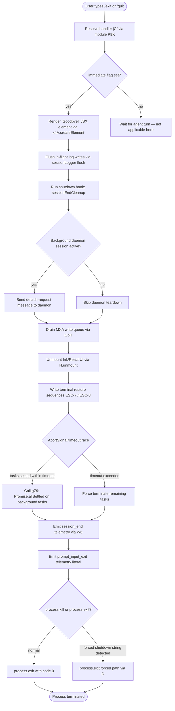

# `/exit`

> Analysis basis: CC v2.1.163 bundle.js (AST extraction + Claude interpretation)
> Minimum version: v2.1.163

---

## Overview

`/exit` (also aliased as `/quit`) terminates the current Claude Code session. When invoked, the command performs an orderly shutdown sequence: it displays a "Goodbye!" farewell message, flushes in-flight I/O, drains pending write queues, persists session metadata, and finally calls `process.exit`. The command is registered as `local-jsx` type with `immediate: true`, meaning it executes without waiting for any ongoing agent turn to complete.

---

## Registration

| Field | Value |
|---|---|
| type | `local-jsx` |
| name | `exit` |
| description | `null` |
| aliases | `["quit"]` |
| immediate | `true` |
| module_id | `P9K` |
| load_inline | `true` |
| loc_byte | `12644821` |
| loc_byte_end | `12645017` |
| loc_line | `9066` |
| arbor_handler.name | `jCf` |
| arbor_handler.fqn | `claude-2.1.163::jCf` |
| arbor_handler.kind | `AsyncFunction` |
| arbor_handler.resolution_path | `module_id` |
| arbor_handler.n_hits | `1` |

Analysis basis: CC v2.1.163 bundle.js:+12644821

---

## Input Branching

The exit flow has more than three distinct branching paths (farewell rendering, UI unmount path, write-queue drain, process termination, and scheduled-task cleanup), so a Mermaid flowchart is used.



---

## Behavioral Spec

### 1. Handler Entry — `exitCommandHandler` (`jCf`)

The handler is an `AsyncFunction` resolved via `module_id` `P9K`.

```
async function exitCommandHandler(context):
    // Step 1: trigger app-state notification (Z9 → GYH)
    notifyAppState(context)

    // Step 2: start bootstrap fetch cancellation (H)
    cancelBootstrapFetch(context)

    // Step 3: write detach-request to daemon if connected (GMH)
    sendDaemonDetachRequest(context)

    // Step 4: cancel any scheduled tasks (Hy8)
    cancelScheduledTasks(context)

    // Step 5: render JSX farewell element (x4A.createElement)
    renderFarewell("Goodbye!")          // literal at bundle.js:+12644034

    // Step 6: render wCf (exit UI wrapper, calls d2)
    renderExitUI(context)

    // Step 7: invoke main shutdown orchestrator M9
    await runShutdownOrchestrator(context)

    // Step 8: emit prompt_input_exit event
    emitTelemetryLiteral("prompt_input_exit")   // literal at bundle.js:+12644258
```

Analysis basis: CC v2.1.163 bundle.js:+12644070 through +12644258

---

### 2. App-State Notification — `notifyAppState` (`Z9` → `GYH`)

```
function notifyAppState(context):
    // Sets internal app state flags for exit mode
    // Calls GYH to broadcast state change to subscribers
    broadcastStateChange(GYH, context)
```

Analysis basis: CC v2.1.163 bundle.js:+12644070, +2252514

Relevant literals observed in this subgraph:
- `"bg"` (bundle.js:+2252437) — background session type discriminator
- `"daemon"` (bundle.js:+2252447)
- `"daemon-worker"` (bundle.js:+2252461)

---

### 3. Bootstrap Fetch Cancellation — `cancelBootstrapFetch` (`H`)

```
function cancelBootstrapFetch(context):
    fetchMap = appStateMap.get(key)     // _A.get at bundle.js:+15724254
    if fetchMap has pending entry:
        cancel(e$)
        applyModelAlias(Pw_)            // parses model alias strings
        checkModelAllowList(ZHH)        // g44.has check
        normaliseArg(uj)
        applyArgsTransform(t1)
        routeFetch(s6)
    // Logs "[Bootstrap] Fetching" (bundle.js:+15724218) and
    // "[Bootstrap] Fetch ok" (bundle.js:+15724592) depending on path
    // Timeout: 5000 ms (bundle.js:+15724419)
    // Emits telemetry: "api_bootstrap_fetch" (bundle.js:+15724540)
    //   with sub-label "parse_failed" (bundle.js:+15724562) on error
```

Analysis basis: CC v2.1.163 bundle.js:+12644082, +15724216

---

### 4. Daemon Detach Request — `sendDaemonDetachRequest` (`GMH`)

```
function sendDaemonDetachRequest(context):
    if daemon session is connected:
        serialise(ke6)
        buildRequest(ruq)               // uses Vk8, b8
        // sends literal "detach-request" (bundle.js:+11010098)
        writeToStdout(ut)               // xt.write + SH (JSON.stringify)
        attachPayload($9H)
```

Analysis basis: CC v2.1.163 bundle.js:+12644086, +11010064, +11010098

---

### 5. Scheduled Task Cancellation — `cancelScheduledTasks` (`Hy8`)

```
function cancelScheduledTasks(context):
    acquireLock(KE → uv)
    pushTaskRef(H.push)

    // XYf: iterate active scheduled tasks
    for each task in scheduledTasks:
        parseScheduleExpression(GN)
            // supports "Every minute" (bundle.js:+4868231)
            //          "Every hour"   (bundle.js:+4868448)
            // uses parseInt, Date UTC helpers, regex match
        parseNaturalLanguageTime(nI → UrL)
        computeNextRunTime(SrH)
            // SrH handles months, hours, minutes, weekdays
            // constant: 527040 minutes-per-year (bundle.js:+4867400)
        computeElapsedTime(f9)
            // Math.floor, Math.round
            // constant: 60000 ms/min (bundle.js:+210836)
            //           86400000 ms/day (bundle.js:+210963)
            //           3600000 ms/hr (bundle.js:+210997)
        // Emits literal "scheduled task" (bundle.js:+11003529)

    parseTaskArg(a9)
        // a9 uses H.indexOf, H.substring, A8 (Bun.stringWidth), E1, cY
```

Analysis basis: CC v2.1.163 bundle.js:+12644117, +11003510, +11003556

---

### 6. Shutdown Orchestrator — `runShutdownOrchestrator` (`M9`)

This is the central async shutdown function.

```
async function runShutdownOrchestrator(context):

    // 6a. JyH: unmount Ink UI
    inkInstance = uiRegistry.get(t4.get)    // bundle.js:+5445248
    AfH.writeSync(terminalOutput)           // bundle.js:+5445221
    inkInstance.unmount()                   // bundle.js:+5445299
    restoreTerminalState(YC)
    writeTerminalSequences(U48)
        // ESC-7 save cursor  (bundle.js:+3782437)
        // ESC-8 restore cursor (bundle.js:+3782448)
        // Checks terminal: ghostty >= 1.2.0 (bundle.js:+3510234/3510264)
        //                  iTerm.app >= 3.6.6 (bundle.js:+3510303/3510335)
        // tmux passthrough  (bundle.js:+3431548)
        // screen passthrough (bundle.js:+3431621)

    // 6b. LS_: write shell integration / final output
    shellOut = buildShellOutput(qE, Kx)
    h6(logHelper)
    w06(resolvePaths)
        // uses JR, NO, X_, JD.join, Q6, q.statSync
    g$(profileOutput)
        // d4 → j9: MXA.register hook
    replaceAll(_.replaceAll)               // escaping: "\\\\" and "\\\"" literals
    CZ9(formatOutput)
    AfH.writeSync(finalLine)               // bundle.js:+5445678
    applyDimStyling(j6.dim)               // bundle.js:+5445694

    // 6c. fS_: hard process termination fallback
    function hardTerminateFallback():
        clearTimeout(exitTimer)            // bundle.js:+5445805
        sessionRef = uiRegistry.get(t4)   // bundle.js:+5445838
        process.exit(code)                // bundle.js:+5445886
        process.kill(pid, signal)         // bundle.js:+5445911
        // throws Error("unreachable")    // literal bundle.js:+5445959

    // 6d. Race: graceful vs timeout
    setTimeout(gracefulDeadline)
    QJH.unref()                           // unref timer so it won't block
    // Timeout: max(3500, 2000) ms        // bundle.js:+5447773, +5447951

    // 6e. OpH: drain write queue
    MXA.drain()                           // bundle.js:+60366

    // 6f. Promise.race([graceful, timeout])
    await Promise.race([gracefulPath, timeoutPath])   // bundle.js:+5447886

    // 6g. Y: supervisor stop / config update
    supervisorState = getState(Y → C0H)   // literal "supervisor" bundle.js:+16147911
    heartbeatStop(LmK → L8H)             // literal "heartbeat" bundle.js:+16147132
    stopComponent(E.stop)
    deleteRef(f.delete)
    updateConfig(T.updateConfig)
    startComponent(V.start)

    // 6h. clearTimeout(exitTimer)        // bundle.js:+5447963

    // 6i. gZ9: await all background tasks
    await Promise.allSettled(Array.from(bgTasks))   // bundle.js:+13256225

    // 6j. mO8: scroll summary + session metrics
    emitTelemetry("tengu_scroll_summary")  // bundle.js:+5447055
    scrollStats = computeScrollStats(SZ9)
        // Date.now, Math.max, Math.round, Object.assign
        // yZ9 sub-helper
    buildSessionRecord(M1)
        // checks agent type: "local-agent" (bundle.js:+3439749)
        // fullscreen flags (bundle.js:+3440286)
        // windows SSH warning (bundle.js:+3440138)
        // tmux-CC warning    (bundle.js:+3439952)
        // emits: "tengu_amber_creek" (bundle.js:+3440469)
        //        "tengu_pewter_brook" (bundle.js:+3440377)
    applySessionFilters(q2_ → eH, mo → DNL, A2_, e_ → DU, wNL)
    persistConfig(D6)
        // D6 → Hj6, _j6, qu, yDH.has, B98, tw6.add, eU.has/get, S6

    // 6k. j76: telemetry flush / startup-perf write
    perfReport(j76 → pc8 → jWA)
        // literal "mark"            (bundle.js:+216036)
        // literal "main_after_run"  (bundle.js:+216139)
        // literal "startup-perf"    (bundle.js:+215888)
        // max file size: 1048576 bytes (bundle.js:+216569)
        // emits: "tengu_startup_perf" (bundle.js:+217090)
    buildProfileReport(OWA)
        // F3H: UqH.openSync, writeFileSync, fsyncSync, closeSync
        // LWA: builds checkpoint table
        // "STARTUP PROFILING REPORT" (bundle.js:+215075)
        // "Startup profiling not enabled" (bundle.js:+214910)
        // line width: 80 chars (bundle.js:+215063)
    emitCacheHint(Z46)
        // emits: "tengu_cache_eviction_hint" (bundle.js:+5448125)

    // 6l. pO8: close open file handles and wait
    await Promise.all([
        closeHandles(iV, Mc),
        Promise.race([pendingIO, timeout(500)])  // 500 ms (bundle.js:+5447344)
    ])
    closeFileDescriptors(l8)                     // clearTimeout, L.unref

    // 6m. AfH.writeSync: final newline flush
    AfH.writeSync(newline)                       // bundle.js:+5448233

    // 6n. Emit session_end event
    emitTelemetryLiteral("session_end")          // literal bundle.js:+5448163
    emitEventW6(W6 → Nu6)

    return
```

Analysis basis: CC v2.1.163 bundle.js:+12644253, +5447669 through +5448233

---

### 7. Session Logger / History Persistence — `sessionHistoryWriter` (`icK`)

```
function sessionHistoryWriter(context):
    // Resolves history log path via d3H
    historyDir = resolveHistoryDir(KHH.dirname, KHH.join)   // bundle.js:+205596
    initWriter($pH)
        // Uses clearTimeout, setTimeout, setImmediate for debounced writes
        // batch interval: 1000 ms (bundle.js:+59625)
        // batch size cap: 100 entries (bundle.js:+59646)
    resolveLogPath(d3H)
        // d3H → KU6, KHH.join, a8, h6
    readConfig(aL6 → v8)
        // error code: "EISDIR" (bundle.js:+175646)
    buildHistoryPath(r2A → KHH.join, h6)
    manageHistoryFile(i2A)
        // checks suffix: ".txt" (bundle.js:+205021)
        // slice offset: 4 chars (bundle.js:+205043)
        // Zy.stat, Zy.rename, R8, Zy.unlink
    byteCount = Buffer.byteLength(content)   // bundle.js:+205771
    appendHistory(a2A)
    AU6.then(ncK.bind(...))
        // ncK: Zy.mkdir, Zy.appendFile, then r2A, i2A, Buffer.byteLength, a2A
    registerHook(j9 → MXA.register)         // bundle.js:+60323
```

Analysis basis: CC v2.1.163 bundle.js:+12644082 (H call), +205563 through +205926

---

## State & Side Effects

| Item | Detail |
|---|---|
| Telemetry — `tengu_scroll_summary` | Emitted during session metrics collection in `mO8` (bundle.js:+5447055) |
| Telemetry — `tengu_startup_perf` | Emitted by startup profiling flush `pc8` (bundle.js:+217090) |
| Telemetry — `tengu_cache_eviction_hint` | Emitted from `Z46` (bundle.js:+5448125) |
| Telemetry — `tengu_amber_creek` | Emitted during session-record build in `M1` (bundle.js:+3440469) |
| Telemetry — `tengu_pewter_brook` | Emitted during session-record build in `M1` (bundle.js:+3440377) |
| Telemetry — `tengu_bg_dispatch_sigkill_escalate` | Background daemon SIGKILL escalation (bundle.js:+16133292) |
| Telemetry — `tengu_bg_dispatch_low_mem` | Low-memory background dispatch event (bundle.js:+16133893) |
| Telemetry — `tengu_bg_spare_enable` | Background spare session enabled (bundle.js:+16134597) |
| Telemetry — `tengu_bg_spare_claim` | Background spare session claimed (bundle.js:+16134725) |
| Telemetry — `tengu_bg_spare_claim_fail` | Background spare session claim failed (bundle.js:+16134991) |
| Telemetry — `tengu_daemon_config_reload` | Daemon config reloaded (bundle.js:+16148704) |
| Telemetry — `tengu_feature_sad` | Fired from `s6` / `c` path (bundle.js:+1010365) |
| Telemetry literal — `prompt_input_exit` | String literal emitted at handler tail (bundle.js:+12644258) |
| Telemetry literal — `session_end` | String literal emitted at shutdown orchestrator tail (bundle.js:+5448163) |
| Telemetry literal — `api_bootstrap_fetch` | Bootstrap fetch result telemetry (bundle.js:+15724540) |
| UI side effect | Ink/React component unmounted (`H.unmount`) |
| Terminal state | Cursor save/restore sequences written (ESC-7 / ESC-8) — terminal-type-aware |
| File I/O | Session history appended via `Zy.appendFile`; history file rotated if needed |
| File I/O | Startup profiling report optionally written via `UqH.writeFileSync` / `fsyncSync` |
| File I/O | Config persisted via `D6` sub-graph |
| Hook registration | `MXA.register` called from `j9` to register history-flush hook |
| Write queue | `MXA.drain()` called to flush all pending writes before exit |
| Process termination | `process.exit` called via `fS_` fallback or normal `D` path |
| Daemon IPC | `"detach-request"` message written to daemon stdout via `ut` / `xt.write` |
| Scheduled tasks | All scheduled tasks cancelled via `Hy8` before process exit |
| appState changes | App state broadcast via `Z9` → `GYH` at command entry |
| Sound | <!-- TODO: not found in depth-2 traversal; needs --depth 4 --> |

---

## Version History

| Version | Change |
|---|---|
| v2.1.163 | Initial analysis |

---

## Common Mistakes

1. **Expecting `/exit` to wait for the current agent turn to finish.** Because `immediate: true` is set in the registration, the command fires without waiting for any in-progress LLM response or tool call to complete. If you need a clean agent stop, cancel the agent first.

2. **Confusing `/quit` and `/exit`.** Both names resolve to the same handler (`jCf`). There is no behavioural difference between them.

3. **Assuming the process exits instantly.** The shutdown orchestrator races a graceful path against a timeout of up to `max(3500, 2000)` ms (bundle.js:+5447773, +5447951) plus a 500 ms I/O-close race (bundle.js:+5447344). Automated scripts that `kill -0` the PID immediately after sending `/exit` may observe the process still running for up to ~4 seconds.

4. **Ignoring the daemon detach step.** If Claude Code is connected to a background daemon session, `/exit` sends a `"detach-request"` message before tearing down the UI. Killing the process with `SIGKILL` bypasses this and can leave orphan daemon workers.

5. **Expecting startup profiling output on every exit.** The startup-perf report (literal: `"Startup profiling not enabled"` at bundle.js:+214910) is only written when the profiling feature was activated at launch. Normal exits produce no profiling file.

---

## Appendix — Identifier Mapping

> For bundle debugging only. Identifiers change across versions.

| Identifier | Role |
|---|---|
| `jCf` | Main exit command handler (AsyncFunction, entry point) |
| `Z9` | App-state notification dispatcher |
| `GYH` | State change broadcast target |
| `H` | Bootstrap fetch cancellation / multi-role utility |
| `v` | HTTP fetch utility with header building |
| `ccK` | Fetch request builder |
| `OXA` | Header construction helper |
| `SH` | JSON.stringify wrapper |
| `J4` | URL / path manipulation helper |
| `g2A` | URL segment mapper |
| `q` | File unlink / misc utility |
| `A` | Path lowercase / file utility |
| `ppH` | Log write dispatcher |
| `h2A` | Raw write helper |
| `icK` | Session history writer / persistence manager |
| `$pH` | Debounced write-queue manager |
| `d3H` | History log path resolver |
| `Q6` | Config-path resolver |
| `aL6` | Config reader |
| `r2A` | History path builder |
| `i2A` | History file rotation manager |
| `ncK` | History append executor (mkdir + appendFile) |
| `j9` | MXA hook registrar |
| `e$` | Bootstrap fetch cancellation token |
| `Pw_` | Model alias string parser |
| `ZHH` | Model allow-list checker |
| `uj` | Argument normaliser (string replace) |
| `t1` | Argument transform router |
| `D6H` | Argument transform dispatcher |
| `x0` | Transform sub-helper |
| `IqH` | Transform sub-helper |
| `yd` | Model string decomposer |
| `Aq` | Model alias resolver |
| `o0` | Model lookup sub-helper |
| `_4H` | Provider inclusion checker |
| `wI` | Model alias intermediate (gM + Z5) |
| `NQH` | Alias normaliser (Z5) |
| `NE` | First-party model resolver |
| `kX1` | Alias chain resolver |
| `gM` | Anthropic-AWS / gateway router |
| `Pe6` | Allow-list inclusion check |
| `vQH` | Provider filter |
| `eX` | Extended alias resolver |
| `r0` | Route resolver combining multiple alias helpers |
| `s6` | Feature-flag / sad-path router |
| `c` | Core feature-flag checker |
| `P6` | Nu6 wrapper (feature flag) |
| `Nu6` | Base feature/event emitter |
| `GMH` | Daemon detach request sender |
| `ke6` | Daemon payload serialiser |
| `ruq` | Daemon request builder |
| `Vk8` | Daemon request field builder |
| `b8` | Daemon request field helper |
| `ut` | Daemon stdout writer |
| `$9H` | Daemon payload attachment |
| `XM` | Miscellaneous exit context helper |
| `Hy8` | Scheduled task canceller |
| `KE` | Lock acquisition helper |
| `uv` | Low-level lock / mutex |
| `XYf` | Scheduled task iterator |
| `GN` | Cron expression parser |
| `K` | Padding / map helper |
| `w` | Background session manager |
| `L` | Background task set manager |
| `j` | Process kill helper |
| `D` | Forced-shutdown / process.exit helper |
| `$` | Regex match / TKK wrapper |
| `J` | Date UTC helper |
| `nI` | Natural-language time parser |
| `UrL` | Time-range parser (split, match, parseInt) |
| `SrH` | Next-run-time calculator (date arithmetic) |
| `O` | Background session state object |
| `f` | File handle closer |
| `f9` | Elapsed-time formatter (Math.floor / Math.round) |
| `a9` | Task argument substring extractor |
| `A8` | Bun.stringWidth wrapper |
| `E1` | String width / grapheme helper |
| `cY` | Grapheme cluster helper |
| `wCf` | Exit UI wrapper component |
| `M9` | Main shutdown orchestrator (async) |
| `JyH` | Ink UI unmounter + terminal write |
| `YC` | Terminal state restorer |
| `U48` | Terminal cursor save/restore sequence writer |
| `SvH` | Terminal type detector (ghostty / iTerm / tmux) |
| `TvH` | Terminal sequence sub-helper |
| `bW` | tmux / screen passthrough escape builder |
| `K$` | Terminal sequence constant holder |
| `LS_` | Shell integration / final-output writer |
| `qE` | Shell output builder |
| `Kx` | Shell output variant |
| `h6` | Log helper / uv wrapper |
| `w06` | Path resolver (JR, NO, X_, JD.join, Q6, statSync) |
| `JR` | Path component helper |
| `X_` | Path component helper |
| `g$` | Profile output helper (d4 → j9) |
| `d4` | Hook registration bridge |
| `CZ9` | Output formatter |
| `fS_` | Hard process-termination fallback |
| `OpH` | MXA write-queue drainer |
| `Y` | Supervisor stop / config-update orchestrator |
| `C0H` | App state reader |
| `N9` | AsyncLocalStorage store getter |
| `v8` | Config value accessor |
| `w7A` | State update helper |
| `EH` | String coercion helper |
| `iLK` | Object key / Math.max metrics helper |
| `E` | Event / keyboard-input stopper |
| `b` | Process / child-process reference |
| `t0` | Settings key accessor |
| `T` | Component with start/stop/updateConfig |
| `LmK` | Heartbeat manager |
| `L8H` | Heartbeat implementation |
| `V` | Secondary component starter |
| `gZ9` | Promise.allSettled background-task awaiter |
| `j76` | Telemetry flush + startup-perf writer |
| `pc8` | Performance checkpoint processor |
| `jWA` | Telemetry event builder / deduplicator |
| `OWA` | Startup profiling report orchestrator |
| `DWA` | Profile path builder (join + a8 + h6) |
| `F3H` | Synchronous file writer (openSync/writeFileSync/fsyncSync/closeSync) |
| `LWA` | Profile checkpoint table builder |
| `$x` | Node.js `require` wrapper |
| `wWA` | Profile output path builder |
| `mO8` | Scroll summary + session metrics collector |
| `RZ9` | Session metrics sub-helper |
| `SZ9` | Scroll statistics calculator |
| `yZ9` | Scroll stats sub-helper |
| `M1` | Session record builder / fullscreen-flag handler |
| `q2_` | Session filter (eH) |
| `mo` | Session filter (DNL) |
| `A2_` | Boolean coercion / platform check |
| `e_` | DU sub-helper |
| `wNL` | D6 wrapper for config persistence |
| `D6` | Config persistence executor |
| `Z46` | Cache eviction hint emitter |
| `W6` | Nu6 session-end event emitter |
| `pO8` | File-handle close + I/O race executor |
| `l8` | Timeout / clearTimeout / L.unref helper |

---

Note: index built via Arbor fallback; some signals (telemetry, literals) may be missing — see arbor-fallback.js.