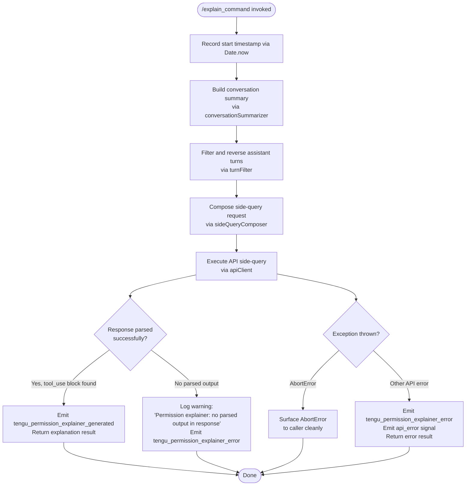

# `/explain_command`

> Analysis basis: CC v2.1.163 bundle.js (AST extraction + Claude interpretation)
> Minimum version: v2.1.163

---

## Overview

`/explain_command` is a tool-type slash command that invokes a permission explainer pipeline: it collects conversation history and tool-use context, submits them to a side-query AI call, and returns a human-readable explanation of why a particular tool or permission was requested. The handler is the async function `P0K`, resolved directly within the registration byte range.

---

## Registration

| Field | Value |
|---|---|
| type | `tool` |
| name | `explain_command` |
| description | `null` (not set in registration object) |
| loc_byte | `14216503` |
| loc_byte_end | `14216539` |
| loc_line | `11286` |
| arbor_handler.name | `P0K` |
| arbor_handler.fqn | `claude-2.1.163::P0K` |
| arbor_handler.kind | `AsyncFunction` |
| arbor_handler.resolution_path | `direct` |
| arbor_handler.n_hits | `1` |

Analysis basis: CC v2.1.163 bundle.js:+14216503

---

## Input Branching

The handler has four or more distinct outcome branches (success path, no-parsed-output error, AbortError, generic API error), so a Mermaid flowchart is used.



Analysis basis: CC v2.1.163 bundle.js:+14216198, +14216986, +14217198, +14217656, +14217727

---

## Behavioral Spec

### 1. Handler Entry — `permissionExplainerHandler` (`P0K`)

```
async function permissionExplainerHandler(toolInput):
    startTime = Date.now()                         // bundle.js:+14216222
    summary   = buildConversationSummary(toolInput)  // calls conversationSummarizer (ZH5)
    turns     = filterAndReverseTurns(toolInput)     // calls turnFilter (VH5)
    request   = composeSideQuery(summary, turns)     // calls sideQueryComposer (_m)
    try:
        response = await executeSideQuery(request)
        parsed   = extractToolUseBlock(response)     // looks for "tool_use" content type
        if parsed is null:
            log("Permission explainer: no parsed output in response")
            emit("tengu_permission_explainer_error")
            return errorResult()
        emit("tengu_permission_explainer_generated")
        return parsed
    catch AbortError:
        rethrow                                     // bundle.js:+14217656
    catch anyOtherError:
        emit("tengu_permission_explainer_error")    // bundle.js:+14217198
        emit("api_error")                           // bundle.js:+14217727
        return errorResult()
```

Analysis basis: CC v2.1.163 bundle.js:+14216198

---

### 2. Conversation Summary Builder — `conversationSummarizer` (`ZH5`)

```
function buildConversationSummary(input):
    serialized = JSON.stringify(input)        // via stringSerializer (SH) bundle.js:+14215713
    truncated  = String(serialized).slice(0, limit)  // limit involves constant 2 bundle.js:+14215723
    return truncated
```

The summary is JSON-serialized and trimmed to fit the side-query context window. The constant `2` found at bundle.js:+14215723 and `1000` at bundle.js:+14215767 appear to govern slicing parameters for history depth and token budget respectively.

Analysis basis: CC v2.1.163 bundle.js:+14215713

---

### 3. Turn Filter — `turnFilter` (`VH5`)

```
function filterAndReverseTurns(conversationHistory):
    assistantTurns = conversationHistory.filter(turn => turn.role == "assistant")
    // "assistant" literal: bundle.js:+14215802
    reversed = assistantTurns.reverse()
    // take up to 3 most-recent turns (constant 3: bundle.js:+14215822)
    recent   = reversed.slice(0, 3)
    truncated = recent.map(turn => truncateContent(turn))  // via contentTruncator (ni)
    // ellipsis "..." applied when content is trimmed: bundle.js:+14215998
    result = ["..."].concat(truncated).join(separator)   // bundle.js:+14216006, +14216039
    return result
```

Analysis basis: CC v2.1.163 bundle.js:+14215779, +14215802, +14215822, +14215847, +14215990

---

### 4. Side Query Composer and Executor — `sideQueryComposer` (`_m`)

The side-query is tagged with `"side_query"` (bundle.js:+13461248) and labeled `"sideQuery"` in the request payload (bundle.js:+13462619). The call graph from `_m` shows it:

- Reads the current API client context via `apiClientReader` (`cU`), bundle.js:+13461216
- Attaches the `x-app` header with value `"cli-bg"` or `"cli"` (bundle.js:+2968451, +2968460)
- Sends a `X-Claude-Code-Session-Id` header (bundle.js:+2968484)
- Resolves OAuth or API-key credentials via `credentialResolver` (`zY`) before making the request
- Performs a hash of the request for deduplication via `requestHasher` (`Q5A`) using SHA-256 (bundle.js:+13415036)
- The response is expected to contain a `"tool_use"` content block (bundle.js:+14216716)
- The label `"permission_explainer"` is used as the tool name in the side query (bundle.js:+14216561)
- The telemetry event `"permission_explainer_generate"` (bundle.js:+14217088) is used internally to label this sub-operation

```
async function composeSideQuery(summary, turns):
    hash     = sha256(summary + turns)           // via requestHasher (Q5A)
    headers  = buildAuthHeaders()                // via headerBuilder (cU)
    payload  = {
        tool_name: "permission_explainer",       // bundle.js:+14216561
        context:   summary,
        turns:     turns,
        label:     "sideQuery"                   // bundle.js:+13462619
    }
    response = await apiClient.post(payload, headers)
    return response
```

Analysis basis: CC v2.1.163 bundle.js:+13461216, +13461248, +13462619, +14216561, +14216716

---

### 5. Config Reader — `configReader` (`bDH`)

`bDH` is shared infrastructure used when the handler bootstraps config access. Key behaviors:

- Throws `"Config accessed before allowed."` if called too early (bundle.js:+3261851)
- Reads config file with encoding `"utf-8"` (bundle.js:+3261934)
- On `ENOENT` errors, falls back gracefully (bundle.js:+3262081)
- On `EEXIST` during directory creation, suppresses the error (bundle.js:+3262696)
- Creates a `"backups"` subdirectory for config file snapshots (bundle.js:+3261419)
- Timestamps backups with `Date.now()` (bundle.js:+3262972)
- Emits `tengu_config_parse_error` on JSON parse failure (bundle.js:+3262482)

Analysis basis: CC v2.1.163 bundle.js:+3261851, +3261934, +3262081

---

### 6. Response Extraction

After the side-query returns, the handler inspects the response for a `"tool_use"` typed content block (bundle.js:+14216716). If no such block is present, the string `"Permission explainer: no parsed output in response"` is logged (bundle.js:+14217333) and a `tengu_permission_explainer_error` event is emitted (bundle.js:+14217198).

---

## State & Side Effects

| Item | Detail |
|---|---|
| Telemetry — success | `tengu_permission_explainer_generated` (bundle.js:+14216986) |
| Telemetry — error | `tengu_permission_explainer_error` (bundle.js:+14217198) |
| Telemetry — config error | `tengu_config_parse_error` (bundle.js:+3262482) |
| Telemetry — API error label | `api_error` literal (bundle.js:+14217727) |
| Telemetry — side-query sub-op | `permission_explainer_generate` (bundle.js:+14217088) |
| Side-query API call | Fires one non-streaming `"side_query"` API request tagged with `permission_explainer` tool |
| Config file access | May read and backup global config via `configReader` (`bDH`) |
| Hook registration | `MXA.register` called during file-watch setup (`j9`, bundle.js:+60323) — not directly triggered by this command but part of the shared config watch infrastructure |
| appState changes | No direct appState mutations observed in depth-2 traversal |
| Sound | None observed |
| Abort handling | `AbortError` is caught and re-thrown cleanly (bundle.js:+14217656) |

---

## Version History

| Version | Change |
|---|---|
| v2.1.163 | Initial analysis |

---

## Common Mistakes

1. **Expecting a streaming response**: `/explain_command` performs a side-query (non-streaming) and returns a single result block. Do not treat it as a streaming command.
2. **Passing a malformed conversation history**: The turn filter (`VH5`) only processes turns with `role == "assistant"`. If no assistant turns exist, the composed context will be empty and the explainer may return no useful output.
3. **Invoking before config is ready**: The config reader (`bDH`) enforces an access gate; calling this command before the config subsystem is initialized will throw `"Config accessed before allowed."`.
4. **Ignoring the AbortError path**: The handler re-throws `AbortError` without wrapping it. Callers must handle cancellation signals explicitly.
5. **Assuming the description field is populated**: The `description` field is `null` in the registration object — do not rely on it for display or routing logic.

---

## Appendix — Identifier Mapping

> For bundle debugging only. Identifiers change across versions.

| Identifier | Role |
|---|---|
| `P0K` | Main async handler for `/explain_command` (`permissionExplainerHandler`) |
| `zOA` | Top-level orchestrator called by `P0K` |
| `S6` | Config/filesystem orchestrator (shared infrastructure) |
| `Q6` | Utility: unknown helper called by config orchestrator |
| `vX_` | Utility: unknown helper in config path |
| `bDH` | Config file reader (reads, backups, parses JSON config) |
| `B6` | JSON parser wrapper |
| `vx` | String prefix checker / slicer |
| `fr1` | Filesystem directory scanner (reads directory, resolves paths) |
| `v` | Multi-purpose utility (language/model classifier, debug helper) |
| `c` | Generic utility (context or config accessor) |
| `RX_` | Path joiner for backup directories |
| `w` | Background daemon session manager |
| `XTL` | File watcher setup (watchFile / unwatchFile) |
| `No` | Unknown utility in file-watch path |
| `j9` | Hook registrar (`MXA.register`) |
| `ZH5` | Conversation summary builder (JSON-serializes input) |
| `SH` | String serializer (`JSON.stringify` wrapper) |
| `VH5` | Turn filter (filters assistant turns, reverses, slices to 3) |
| `H` | HTTP fetch / bootstrap fetcher |
| `e$` | Unknown helper in fetch path |
| `Pw_` | String splitter / trimmer / slicer |
| `ZHH` | Set membership checker |
| `uj` | String replacer |
| `t1` | Text normalizer / model name resolver |
| `D6H` | Text transformation sub-step |
| `Aq` | Model alias resolver (opusplan, sonnet, haiku, opus, best) |
| `eX` | Extended text normalizer |
| `s6` | Sub-query runner |
| `P6` | Promise/result helper |
| `A` | Case-lowering comparator |
| `f` | Stream/connection closer |
| `L` | Promise set tracker (add/finally/delete) |
| `ni` | Content truncator (charCodeAt-based unicode-safe slice) |
| `_m` | Side-query composer and executor |
| `cU` | API client context reader / request builder |
| `xw` | AsyncLocalStorage store reader |
| `Z9` | Unknown utility in client context |
| `GYH` | Unknown sub-helper |
| `jo` | Context store reader (CX1) |
| `We6` | Context store accessor |
| `h6` | Unknown utility |
| `uv` | Unknown utility |
| `tf_` | URL encoder (replaces chars, encodeURIComponent) |
| `eH` | String coercer |
| `S3` | OAuth token manager |
| `pw_` | OAuth token refresh orchestrator |
| `bX1` | Boolean coercer |
| `zY` | Credential resolver (OAuth / API key) |
| `L4` | Token/credential loader |
| `Bj` | OAuth profile handler |
| `Z7` | Auth type resolver |
| `pX` | Unknown auth utility |
| `DO` | Auth chain dispatcher (calls `S6` for config, resolves credentials) |
| `Aw6` | Session context loader |
| `JcH` | Error/status reporter in auth path |
| `H3` | Unknown utility (appears in multiple auth/context paths) |
| `KXL` | Request context builder |
| `$cH` | Timestamp-based cache entry builder |
| `U_` | Unknown utility |
| `pr6` | Proxy auth helper orchestrator |
| `GZH` | Proxy auth error handler |
| `O81` | Proxy auth response parser |
| `Xg4` | Integer parser (parseInt + Number.isNaN) |
| `ly` | Unknown utility |
| `tP` | Unknown utility |
| `YXL` | HTTP request executor (fetch, headers, streaming) |
| `XA` | Auth type constructor |
| `Hf` | Unknown helper in request execution |
| `M` | Request/session map manager |
| `rmH` | Unknown cleanup helper |
| `rP1` | Sub-request runner |
| `Ew_` | Extended sub-request runner |
| `DXL` | Header filter (authorization, anthropic-beta) |
| `zXL` | Header/log builder |
| `$XL` | Numeric clamp/bounds calculator |
| `OXL` | Streaming byte watchdog / timeout manager |
| `RD` | URL/endpoint resolver |
| `AO6` | Endpoint constructor |
| `M8L` | URL prefix checker |
| `ps6` | Case-insensitive URL/endpoint comparator |
| `LY` | Proxy configuration resolver |
| `Ed` | Proxy URL parser |
| `GFH` | Proxy credential formatter |
| `z81` | Unknown proxy utility |
| `t9_` | IP address / host validator |
| `_q_` | Unknown string utility |
| `LXL` | Request options builder |
| `PA8` | Request parameter assembler |
| `pv` | Unknown parameter utility |
| `YpH` | Unknown utility |
| `OEH` | Environment prefix scanner |
| `U1` | URL validator / allowlist checker |
| `VYH` | Gateway token refresher |
| `MQ8` | Unknown utility in token refresh |
| `g9L` | Gateway refresh HTTP caller |
| `Rm6` | Unknown cleanup in token refresh |
| `fQ8` | Timestamp utility |
| `lD6` | Header key lowercaser (Object.entries based) |
| `jDH` | SDK error logger (console.error) |
| `S` | Terminal/supervisor write handler |
| `Y` | Terminal output writer |
| `h` | Background worker health sweep |
| `I` | Chokidar file watcher wrapper |
| `d` | Scheduled task runner |
| `lR6` | Memory pressure checker |
| `WfK` | Memory threshold reporter |
| `zX6` | Skills/context file reader |
| `kH` | Error logger with stack trace |
| `F` | Unknown set/collection |
| `__` | Double-underscore utility |
| `l` | MCP connection handler |
| `vb8` | Memory usage reporter |
| `D6` | Daemon message dispatcher |
| `r` | MCP server reconnector |
| `y` | Away-summary orchestrator |
| `mZ8` | App state getter |
| `Uq5` | Away-summary cache validator |
| `tIK` | Unknown utility in away summary |
| `V` | Unknown component |
| `cO8` | Away-summary API caller |
| `RH` | Success result constructor |
| `rRq` | UUID generator (randomUUID) |
| `Q` | Output throttler / debouncer |
| `hH` | Error result constructor |
| `T` | Unknown component |
| `NW` | Auth dispatcher wrapper |
| `vYH` | WIF credential exchanger |
| `BQH` | WIF HTTP token fetcher (fetch + AbortSignal.timeout) |
| `s9L` | WIF error classifier |
| `E` | Remote control / token getter |
| `b` | Unknown component |
| `t0` | User settings reader |
| `X` | IPC/socket byte reader (Buffer.concat, indexOf) |
| `J` | IPC socket write handler |
| `J5` | IPC connection finalizer |
| `G55` | Supervisor daemon main loop |
| `E55` | Unknown sub-component of supervisor |
| `$` | IPC write stream |
| `K` | Column formatter (padEnd) |
| `Wz` | Background service descriptor |
| `VDA` | Unknown component in supervisor |
| `BuK` | Backpressure / rate-limit tracker |
| `l8` | Async timeout wrapper (setTimeout + clearTimeout) |
| `P` | Terminal/repaint controller |
| `e9` | File state tracker (stat, read, hash) |
| `yK` | File path resolver |
| `kHH` | Link scanner (directory walk) |
| `P55` | Repaint dimension calculator |
| `p` | Render flush helper |
| `$9H` | Unknown supervisor sub-component |
| `W55` | Worker teardown orchestrator |
| `n` | Voice/recording timer |
| `x` | Interval clearer |
| `s` | MCP server set manager |
| `G` | Server group collector |
| `Rx6` | IPC raw write helper |
| `W` | Worker pool initializer |
| `EH` | String coercer (String() wrapper) |
| `TNH` | Request header normalizer |
| `H9` | Model / header normalizer |
| `Bs6` | Object.entries header builder |
| `tX` | Model name transformer (toLowerCase, replace) |
| `dQ8` | Unknown header utility |
| `ny` | Auth type lookup |
| `Ydf` | Message finder (find on user/assistant turns) |
| `Q5A` | SHA-256 request hasher (crypto.createHash) |
| `Ee6` | Context cache-control injector |
| `JK` | String coercer (String()) |
| `qq8` | Auth context builder |
| `nyH` | System prompt builder / memory context injector |
| `ZA` | Credential + permission resolver |
| `nR` | Array/includes type checker |
| `BQ8` | Unknown system prompt sub-component |
| `FQ8` | Unknown system prompt sub-component |
| `cV` | Compliance flag injector (hipaa) |
| `hw_` | Compliance context builder |
| `ENH` | Compliance error handler |
| `Ff_` | Compliance allowlist checker |
| `S3K` | Unknown string utility |
| `hA8` | Tool/model header assembler |
| `$2` | Message mapper |
| `iwH` | Tool execution wrapper (random bytes, serialization) |
| `oU` | Tool invocation orchestrator |
| `X8` | Tool execution core |
| `hL` | Tool result handler |
| `b2A` | Message array manipulator (pop, push) |
| `ap6` | Content block validator |
| `jW` | Deep cloner (structuredClone) |
| `tp6` | Message array transformer |
| `C2A` | Content text replacer |
| `N3H` | Unknown timing/metrics helper |
| `h1` | Unknown utility (Nu6 caller) |
| `Nu6` | Unknown base utility |
| `p26` | Agent context resolver |
| `Xj9` | Agent type classifier |
| `osL` | Agent set membership checker |
| `OoH` | Agent ID constructor |
| `eb` | Agent ID base builder |
| `m26` | Agent hash generator |
| `Z$8` | SHA hash wrapper (Yj9.createHash) |
| `Kl` | Agent path resolver |
| `rsL` | Agent path parser (startsWith, slice) |
| `V$8` | Agent path sub-resolver |
| `Gv_` | Path segment extractor (indexOf, slice) |
| `E_H` | Agent thread type checker (startsWith) |
| `N46` | Unknown terminal utility |
| `U9` | Tool-name classifier (mcp__ prefix, mcp_tool) |
| `W6` | Nu6-based utility |