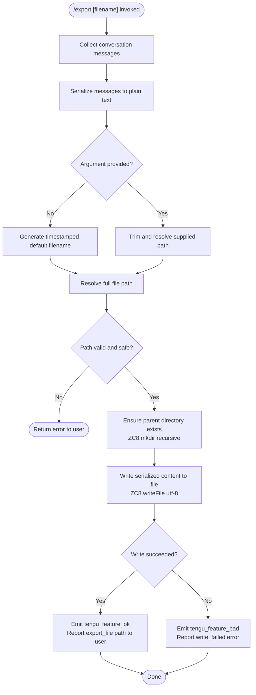

# `/export`

> Analysis basis: CC v2.1.163 bundle.js (AST extraction + Claude interpretation)
> Minimum version: v2.1.163

---

## Overview

The `/export` command serializes the current conversation — including both user and assistant messages — into a structured text representation and writes it to a file on disk. When invoked with an optional filename argument, the resolved path is used as the write target; otherwise, a timestamped default filename is generated automatically. Telemetry events are emitted on success or failure.

---

## Registration

| Field | Value |
|---|---|
| type | `local-jsx` |
| name | `export` |
| description | Export the current conversation to a file or clipboard |
| argumentHint | `[filename]` |
| module_id | `u9K` |
| load_inline | `true` |
| loc_byte | `12661150` |
| loc_byte_end | `12661346` |
| loc_line | `9069` |
| arbor_handler.name | `hCf` |
| arbor_handler.fqn | `claude-2.1.163::hCf` |
| arbor_handler.kind | `AsyncFunction` |
| arbor_handler.resolution_path | `module_id` |
| arbor_handler.n_hits | `0` |

Analysis basis: CC v2.1.163 bundle.js:+12661150

---

## Input Branching

The command has more than three distinct execution branches (no argument given vs. argument provided; file vs. directory target; write success vs. write failure; clipboard path), so a flowchart is used.



Analysis basis: CC v2.1.163 bundle.js:+12660582 (handler entry `hCf`), +12656073 (mkdir), +12656120 (writeFile), +12660634 (export_file telemetry key), +12660711 (write_failed literal)

---

## Behavioral Spec

### 1. Handler Entry (`hCf`)

The async handler `hCf` is the top-level entry point resolved via module `u9K`.

```
async function exportCommandHandler(context):
    rawText = buildConversationText(context)          // yCf → vC8 → ICf
    trimmedArg = context.argument.trim()              // hCf:+12660591
    resolvedPath = resolveExportPath(trimmedArg)      // NC8 / ZCf / Z1
    successNotifier = buildSuccessNotifier(context)   // hH
    errorNotifier   = buildErrorNotifier(context)     // RH
    conversationMessages = extractMessages(context)   // b9K
    defaultFilename = buildDefaultFilename(new Date()) // kCf
    formatHint = normalizeFormatHint(trimmedArg)      // x9K

    if trimmedArg is empty:
        targetPath = defaultFilename
    else:
        targetPath = resolvedPath

    try:
        writeToFile(targetPath, rawText)              // NC8
        emit telemetry("export_file", success)        // tengu_feature_ok
        successNotifier(targetPath)
    catch error:
        emit telemetry("write_failed", error)         // tengu_feature_bad
        errorNotifier(error.message ?? "Unknown error")
```

Analysis basis: CC v2.1.163 bundle.js:+12660582, +12660591, +12660622, +12660631, +12660649, +12660694, +12660829, +12660847, +12660875

---

### 2. Conversation Serialization (`vC8` via `yCf`)

The serializer walks the current conversation's message list and produces a flat text representation.

```
function serializeConversation(messages):
    lines = []
    for each message in messages:
        stripped = stripANSI(message.content)         // b4 → Bun.stripANSI
        lines.push(stripped)
    return lines.join(separator)                      // vC8:+12659601
```

- Only messages whose role is `"user"` or `"assistant"` are included (literals at +12660085, +12658714).
- ANSI escape codes are removed from content before serialization via `b4` → `Bun.stripANSI` (Analysis basis: CC v2.1.163 bundle.js:+12659581, +3840296).
- The function `ICf` handles per-message type branching; `vCf` checks `Array.isArray` for multi-part content blocks (Analysis basis: +12659405, +12658854).

---

### 3. Message Extraction (`b9K`)

Before serialization, the handler extracts the relevant portion of the conversation history.

```
function extractMessages(context):
    allMessages = context.messages
    userMessages = allMessages.find(role == "user")    // b9K:+12660064
    trimmed = userMessages.trim()                      // b9K:+12660180

    if Array.isArray(trimmed):
        found = trimmed.find(isTextBlock)              // b9K:+12660221
        content = found.text
    else:
        content = trimmed.substring(0, 50)             // b9K:+12660308, literal 50 at +12660303

    return buildMessageList(content)                   // iL → Q1
```

- The message text is capped at 50 characters when used as a display label (literal `50` at +12660303; literal `49` at +12660322).
- `iL` → `Q1` performs index-based slicing using `indexOf` and `slice` (Analysis basis: +12660288, +195634, +195663).

---

### 4. Default Filename Generation (`kCf`)

When no argument is provided, a timestamp-based filename is constructed.

```
function buildDefaultFilename(date):
    year    = String(date.getFullYear())               // kCf:+12659790
    month   = zeroPad(date.getMonth() + 1)             // kCf:+12659815
    day     = zeroPad(date.getDate())                  // kCf:+12659856
    hours   = zeroPad(date.getHours())                 // kCf:+12659894
    minutes = zeroPad(date.getMinutes())               // kCf:+12659933
    seconds = zeroPad(date.getSeconds())               // kCf:+12659974
    return "claude-" + year + month + day + "-" + hours + minutes + seconds + ".txt"
```

Analysis basis: CC v2.1.163 bundle.js:+12660847 (call site), +12659790–+12659974 (date method calls)

---

### 5. Path Resolution (`ZCf` / `Z1`)

The supplied or generated filename is resolved to an absolute path.

```
function resolveExportPath(rawInput):
    ext = path.extname(rawInput)                       // ZCf:+12655977
    normalized = resolveSafePath(rawInput)             // Z1

    function resolveSafePath(p):
        if p contains null bytes:
            throw Error("Path contains null bytes")    // literal +1052993
        p = path.normalize(unicode_NFC(p))             // MO → H.normalize, NFC at +177636
        if p starts with "~/":
            p = path.join(os.homedir(), p.slice(2))    // Z1:+1053090,+1053121,+1053137
        if not path.isAbsolute(p):
            p = path.resolve(cwd, p)                   // Z1:+1053304
        return p

    return normalized
```

- Unicode normalization form `NFC` is applied (literal `"NFC"` at +177636).
- Home-directory expansion (`~/`) is supported (literal `"~/"` at +1053121).
- `TypeError` is thrown for null-byte paths (Analysis basis: +1052993, +1052786, +1052987).

---

### 6. File Write (`NC8`)

```
async function writeExportFile(resolvedPath, content):
    dir = path.dirname(resolvedPath)                   // NC8:+12656083
    await fs.mkdir(dir, { recursive: true })           // NC8:+12656073
    await fs.writeFile(resolvedPath, content, "utf-8") // NC8:+12656120, literal "utf-8" at +12656148
```

Analysis basis: CC v2.1.163 bundle.js:+12656073, +12656083, +12656120

---

### 7. Format Hint Normalization (`x9K`)

When a filename argument is provided, the extension portion is lower-cased for internal routing.

```
function normalizeFormatHint(arg):
    return arg.toLowerCase()                           // x9K → H.toLowerCase at +12660367
```

Analysis basis: CC v2.1.163 bundle.js:+12660875 (call site), +12660367

---

### 8. Atomic File-Append Path (`ncK` / `icK`)

The call graph also reveals an append-based write path used for chunked or large exports.

```
async function appendChunkToFile(path, chunk, options):
    await fs.mkdir(path.parent, { recursive: true })   // ncK:+205317
    await fs.appendFile(path, chunk)                   // ncK:+205376
    resolvedLogPath = resolveLogPath(path)              // aL6, r2A
    await rotateIfNeeded(resolvedLogPath)               // i2A → Zy.stat, Zy.rename, Zy.unlink
    byteLen = Buffer.byteLength(chunk)                 // ncK:+205469
```

- Rotation check uses `Zy.stat` to get file size (Analysis basis: +204917).
- A `.txt` suffix is used during rotation candidate detection (literal `".txt"` at +205021).
- The rotation slice offset is `4` (literal at +205043).
- `EISDIR` error code is caught during directory-vs-file disambiguation (literal at +175646, +205101 via `R8`).

Analysis basis: CC v2.1.163 bundle.js:+205317, +205376, +205463, +205469

---

## State & Side Effects

| Item | Detail |
|---|---|
| Telemetry — success | `tengu_feature_ok` emitted on successful file write (bundle.js:+1010222) |
| Telemetry — failure | `tengu_feature_bad` emitted on write error (bundle.js:+1010284) |
| Telemetry — sad path | `tengu_feature_sad` emitted on certain degraded paths (bundle.js:+1010365) |
| Internal telemetry key | `"export_file"` string used as event property (bundle.js:+12660634) |
| Internal telemetry key | `"write_failed"` string used as error property (bundle.js:+12660711) |
| Filesystem — directory creation | Parent directories are created recursively via `fs.mkdir` before write (bundle.js:+12656073) |
| Filesystem — file write | Target file written with UTF-8 encoding via `fs.writeFile` (bundle.js:+12656120) |
| Filesystem — file rotation | Append path may rename or unlink old export file segments (bundle.js:+205073, +205113) |
| Hook registration | `j9` → `MXA.register` registers a hook during the export flow (bundle.js:+205926, +60323) |
| Timer usage | `$pH` uses `clearTimeout`, `setTimeout`, `setImmediate` for async chunk flushing (bundle.js:+59737, +59901, +59994) |
| appState changes | `_A.get` is called in handler `H` suggesting session/state map access (bundle.js:+15724254) |
| Sound | <!-- TODO: not found in depth-2 traversal; needs --depth 4 --> |

---

## Version History

| Version | Change |
|---|---|
| v2.1.163 | Initial analysis |

---

## Common Mistakes

1. **Omitting the file extension**: If the argument lacks an extension, the path resolver (`ZCf`) will proceed but the file may lack an extension; the default generator always appends `.txt` via the timestamp path.
2. **Using a path pointing to a directory**: The write step calls `fs.writeFile` on the resolved path; if the path resolves to an existing directory, the write will fail. The rotation sub-path checks for `EISDIR` (literal at +175646) but the main write path may not surface a friendly error in all cases.
3. **Relative paths without awareness of CWD**: Relative paths are resolved against the current working directory via `path.resolve` (bundle.js:+1053304), not the project root or home directory, which may produce unexpected output locations.
4. **Null bytes in path argument**: Any path argument containing null bytes is rejected immediately with an error (literal `"Path contains null bytes"` at +1052993).
5. **Expecting clipboard output**: Despite the command description mentioning "clipboard", the call graph contains no clipboard API calls at depth ≤ 2; actual clipboard support may be absent or deferred in v2.1.163.

---

## Appendix — Identifier Mapping

> For bundle debugging only. Identifiers change across versions.

| Identifier | Role |
|---|---|
| `hCf` | Main async export command handler (arbor_handler, AsyncFunction) |
| `yCf` | Conversation-text builder wrapper |
| `vC8` | Message serializer (joins stripped lines) |
| `ICf` | Per-message content extractor / type dispatcher |
| `NCf` | Inner content normalizer called by `ICf` |
| `NC8` | File write orchestrator (mkdir + writeFile) |
| `ZCf` | Path extension extractor and safe-path delegator |
| `Z1` | Safe path resolver (null-byte check, NFC, homedir, absolute) |
| `b4` | ANSI strip wrapper → `Bun.stripANSI` |
| `b9K` | Message list extractor with role filtering |
| `kCf` | Timestamp-based default filename generator |
| `x9K` | Format-hint normalizer (toLowerCase) |
| `icK` | Append-based chunked write orchestrator |
| `ncK` | Chunk append + rotation handler |
| `i2A` | File rotation logic (stat / rename / unlink) |
| `aL6` | Log path resolver delegating to `v8` |
| `r2A` | Resolved-path builder (join + `h6`) |
| `d3H` | Sub-path joiner using `KU6`, `KHH.join`, `a8`, `h6` |
| `$pH` | Async chunk-flush scheduler (setTimeout / setImmediate) |
| `j9` | Hook registrar → `MXA.register` |
| `Q6` | Path helper utility |
| `ppH` | Write helper delegating to `h2A` |
| `h2A` | Low-level stream write wrapper |
| `Gl` | Session/plan-mode context resolver |
| `yeH` | Event listener setup (`.on("data", ...)`) |
| `vCf` | Array.isArray check for multi-part message content |
| `iL` | Message content slicer delegating to `Q1` |
| `Q1` | Index-based text slicer (indexOf / slice) |
| `MO` | Unicode NFC normalizer |
| `b6` | File path helper (bd6, X_) |
| `hH` | Success notifier builder |
| `RH` | Error notifier builder |
| `v` | Export format routing function |
| `ccK` | Conversation collector |
| `OXA` | Output aggregator (lgK, ngK) |
| `SH` | JSON serializer wrapper → JSON.stringify |
| `J4` | Extension-based format dispatcher |
| `g2A` | Message map formatter |
| `Pw_` | Input argument tokenizer (split/trim/indexOf/slice) |
| `ZHH` | Feature-flag/has-check wrapper |
| `uj` | Replace-based string sanitizer |
| `t1` | Model/context resolver |
| `D6H` | Downstream model dispatcher |
| `yd` | Model-string parser |
| `Aq` | Model alias resolver |
| `o0` | Model query helper → `q4H` |
| `_4H` | Model family inclusion check |
| `wI` | Model tier wrapper (gM, Z5) |
| `NQH` | Tier-B model wrapper → `Z5` |
| `NE` | Tier-A model wrapper (gM, Z5, XA) |
| `kX1` | Model shortcut → `NE` |
| `gM` | Model config lookup → `XA` |
| `Pe6` | Plan-list inclusion check |
| `vQH` | Plan-variant resolver → `eH` |
| `eX` | Extended model resolver (Aq, r0) |
| `r0` | Full model resolution chain |
| `s6` | Feature telemetry emitter (c, P6) |
| `c` | Telemetry ok event emitter |
| `P6` | Telemetry base dispatcher → `Nu6` |
| `e$` | Session context accessor |
| `x0` | Context initializer |
| `IqH` | Context state helper |
| `Bs6` | Model-string prefix helper |
| `VQH` | Model-name validator |
| `IX1` | Model-index lookup |
| `Q1L` | Model-list helper |
| `d1L` | Model-detail resolver |

---

Note: index built via Arbor fallback; some signals (telemetry, literals) may be missing — see arbor-fallback.js.