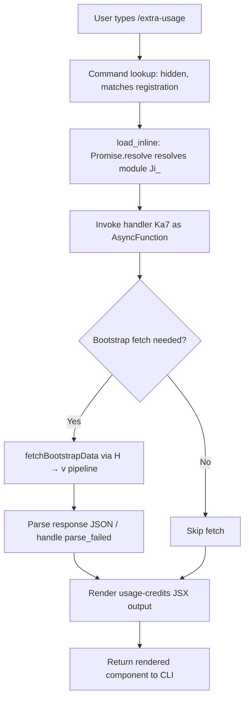

# `/extra-usage`

> Analysis basis: CC v2.1.163 bundle.js (AST extraction + Claude interpretation)
> Minimum version: v2.1.163

---

## Overview

`/extra-usage` is a hidden, deprecated alias command that has been renamed to `/usage-credits`. It is registered as a `local-jsx` command but is no longer surfaced in the command palette or help text. When invoked, it delegates immediately to the same handler (`Ka7`) that backs the canonical `/usage-credits` command, making the two commands functionally equivalent in this version.

---

## Registration

| Field | Value |
|---|---|
| type | `local-jsx` |
| name | `extra-usage` |
| description | `"Renamed to /usage-credits"` |
| isHidden | `true` |
| module_id | `Ji_` |
| load_inline | `true` |
| loc_byte | `9368926` |
| loc_byte_end | `9369111` |
| loc_line | `4384` |
| arbor_handler.name | `Ka7` |
| arbor_handler.fqn | `claude-2.1.163::Ka7` |
| arbor_handler.kind | `AsyncFunction` |
| arbor_handler.resolution_path | `module_id` |
| arbor_handler.n_hits | `0` |

Analysis basis: CC v2.1.163 bundle.js:+9368926

---

## Input Branching

This command has a simple linear dispatch — no user-supplied arguments are differentiated. The command resolves its handler via an inline `Promise.resolve` load and immediately delegates to the shared usage-credits async handler. Two branches exist at the handler level: a bootstrap fetch path and a render path.



Analysis basis: CC v2.1.163 bundle.js:+9368174 (load_inline Promise.resolve), +9367923 (Ka7 entry), +15724218 (bootstrap fetch), +15724562 (parse_failed branch)

---

## Behavioral Spec

### Handler Entry and Module Resolution

The command is registered with `load_inline: true`, meaning the bundle does not reference a separate module file. Instead, the loader emits an inline `Promise.resolve({ call: Ka7 })` shape. When the CLI resolves this command, it awaits that promise and calls `Ka7` directly.

```
async function handleExtraUsage(context):
    // Inline load: Promise.resolve({call: usageCreditsHandler})
    module = await Promise.resolve({ call: usageCreditsHandler })
    return module.call(context)
```

Analysis basis: CC v2.1.163 bundle.js:+9368174, +9368204, +9368224

### Bootstrap Data Fetch (`H → v` pipeline)

The handler triggers a bootstrap data fetch (the `H` function, depth-1 from `Ka7`). This fetch targets a remote endpoint and includes standard headers.

```
async function bootstrapFetch(url):
    log("[Bootstrap] Fetching", url)          // literal at +15724218
    response = await fetch(url, {
        headers: {
            "Content-Type": "application/json",   // literal at +15724303/+15724318
            "User-Agent": <agentString>            // literal at +15724337
        },
        timeout: 5000                              // literal at +15724419
    })
    cacheEntry = stateMap.get(cacheKey)            // _A.get at +15724254
    if parse fails:
        emit telemetry("api_bootstrap_fetch", { status: "parse_failed" })
                                                  // literals at +15724540, +15724562
    else:
        log("[Bootstrap] Fetch ok")               // literal at +15724592
    return parsedData
```

Analysis basis: CC v2.1.163 bundle.js:+15724216, +15724254, +15724389, +15724540

### Input Parsing and Sanitisation (`v` function)

After bootstrap data is available, the `v` function processes any contextual input associated with the invocation.

```
function processInput(inputStr, flags):
    if flags includes "debug":                    // literal at +206051
        enableDebugMode()
    normalized = inputStr.toUpperCase()           // +206177
    trimmed    = inputStr.trim()                  // +206200
    parsed     = parseCommandArgs(trimmed)        // J4 at +206197
    sanitized  = redactSensitiveFields(parsed)    // "[REDACTED]" literal at +198141
    return { normalized, sanitized }
```

Analysis basis: CC v2.1.163 bundle.js:+206051, +206075, +206093, +206177, +206197, +206200

### Argument Parsing Detail (`J4`)

```
function parseCommandArgs(rawInput):
    parts   = mapOverTokens(rawInput)             // g2A / BcK.map at +197777
    cleaned = rawInput.replace(pattern, "")       // H.replace at +198089
    // index 2 is the significant positional arg  // number literal 2 at +198170
    token   = parts.at(index)                     // q.at at +198199
    extIdx  = cleaned.lastIndexOf(delimiter)      // A.lastIndexOf at +198225
    result  = cleaned.slice(0, extIdx)            // A.slice at +198251
    return result
```

Analysis basis: CC v2.1.163 bundle.js:+198062, +198089, +198141, +198170, +198199, +198225, +198251

### Output Write (`ppH → h2A`)

The rendered output is written to the process stdout/stream handle.

```
function writeOutput(content):
    renderToStream(content)                       // h2A → H.write at +193190
```

Analysis basis: CC v2.1.163 bundle.js:+206222, +193254, +193190

### Transcript / Log Persistence (`icK` pipeline)

The command participates in the shared transcript logging subsystem:

```
async function persistTranscript(entry, context):
    header     = buildHeader(entry)               // d3H at +205588
    dirPath    = path.dirname(logPath)            // KHH.dirname at +205596
    fullPath   = path.join(dirPath, fileName)     // r2A at +205733
    byteLen    = Buffer.byteLength(entry)         // +205771
    // Rotate if file ends with ".txt" and exceeds threshold
    if logFile.endsWith(".txt"):                  // literal at +205021
        rotateLog(logFile, 4)                     // number literal 4 at +205043
    await fs.mkdir(dirPath, { recursive: true })  // ncK → Zy.mkdir at +205317
    await fs.appendFile(fullPath, entry)          // Zy.appendFile at +205376
    scheduleFlush()                               // $pH pipeline at +205563
```

Analysis basis: CC v2.1.163 bundle.js:+205563, +205588, +205596, +205733, +205771, +205021, +205043, +205317, +205376

### Hook Registration (`j9`)

```
function registerHook():
    hookRegistry.register(handler)                // MXA.register at +60323
```

Analysis basis: CC v2.1.163 bundle.js:+205926, +60323

### Flush / Debounce Scheduler (`$pH`)

The output flush is debounced using `clearTimeout` / `setTimeout` / `setImmediate`:

```
function scheduleFlush(buffers, config):
    clearTimeout(existingTimer)                   // +59737
    joined = pendingLines.join("")                // $.join at +59811
    if shouldFlushImmediately:
        setImmediate(flushCallback)               // +59994
    else:
        timer = setTimeout(flushCallback, delay)  // +59901
        pendingLines.push(newLine)                // $.push at +59936
```

The debounce window constants are 1000 ms and 100 ms.
(bundle.js:+59625, +59646)

Analysis basis: CC v2.1.163 bundle.js:+59737, +59811, +59901, +59936, +59994

### Model/Provider Resolution (shared via `t1 → Aq` chain)

The handler internally resolves the active model and provider, sharing the same resolution chain as other commands:

```
function resolveModel(rawModelStr):
    trimmed   = rawModelStr.trim().toLowerCase()  // Aq at +2243153/+2243164
    normalized = trimmed.replace(pattern, "")     // +2243192
    if isOpusPlan(normalized):   return "opusplan"  // literal at +2243249
    if has1mSuffix(normalized):  return "opusplan"  // "[1m]" at +2243275
    if isSonnet(normalized):     return "sonnet"    // +2243290
    if isHaiku(normalized):      return "haiku"     // +2243329
    if isOpus(normalized):       return "opus"      // +2243368
    if isBest(normalized):       return "best"      // +2243405
    provider = resolveProvider(normalized)           // NE / gM pipeline
    return { model: normalized, provider }
```

Provider classes observed: `"firstParty"` (+2239457), `"anthropicAws"` (+2097366), `"gateway"` (+2097386), `"mantle"` (+2240098).

Analysis basis: CC v2.1.163 bundle.js:+2243153, +2243249, +2243275, +2243290, +2243329, +2243368, +2243405, +2239457, +2097366, +2097386, +2240098

### Deprecation / Alias Forwarding

The command's description string `"Renamed to /usage-credits"` and `isHidden: true` flag together signal that `/extra-usage` is a soft-deprecated alias. No redirection message is emitted at the CLI level beyond the description; the handler simply executes `Ka7` identically to `/usage-credits`.

Analysis basis: CC v2.1.163 bundle.js:+9368926 (registration block)

---

## State & Side Effects

| Item | Detail |
|---|---|
| Telemetry | `tengu_feature_sad` (loc_byte: +1010365) fired on the sad-path branch of command dispatch; `api_bootstrap_fetch` with `parse_failed` status on bootstrap JSON parse failure (+15724540, +15724562) |
| Hook registration | `MXA.register` called via `j9` (+60323) — registers into the global hook registry |
| appState changes | Bootstrap cache updated via `_A.get` / state map write (+15724254); transcript log appended via `ncK → Zy.appendFile` (+205376) |
| File I/O | Log directory created if absent (`Zy.mkdir`, +205317); log file appended (`Zy.appendFile`, +205376); stale `.txt` log files rotated/unlinked (`Zy.rename` +205073, `Zy.unlink` +205113) |
| stdout write | Content written via `H.write` (+193190) through the `ppH → h2A` chain |
| Debounce timers | `clearTimeout` / `setTimeout` (1000 ms window, +59625) / `setImmediate` for output flushing |
| Sound | <!-- TODO: not found in depth-2 traversal; needs --depth 4 --> |

---

## Version History

| Version | Change |
|---|---|
| v2.1.163 | Initial analysis; command is hidden alias pointing to `/usage-credits` handler `Ka7` |

---

## Common Mistakes

1. **Invoking `/extra-usage` expecting distinct behaviour from `/usage-credits`** — they share the identical handler (`Ka7`); use `/usage-credits` instead, as `/extra-usage` may be removed in a future release.
2. **Expecting `/extra-usage` to appear in `/help` or command autocomplete** — the `isHidden: true` flag suppresses it from all discovery surfaces.
3. **Assuming the command accepts different arguments than `/usage-credits`** — argument parsing is handled by the shared `v → J4` pipeline with no alias-specific overrides.
4. **Treating `tengu_feature_sad` as a usage-specific event** — this telemetry fires on the general sad-path branch of command dispatch, not on a condition unique to `/extra-usage`.
5. **Expecting a redirect message to be printed** — the deprecation is documented only in the registration description string; no user-visible redirect notice is rendered at runtime.

---

## Appendix — Identifier Mapping

> For bundle debugging only. Identifiers change across versions.

| Identifier | Role |
|---|---|
| `Ka7` | Primary handler (`AsyncFunction`) for `/extra-usage` and `/usage-credits`; Arbor-resolved entry point |
| `La7` | Load-wrapper function; emits inline `Promise.resolve({call: Ka7})` |
| `H` | Bootstrap fetch orchestrator; dispatches to `v` pipeline |
| `v` | Input processing / normalisation function |
| `ccK` | Sub-processor within `v`; coordinates token parsing |
| `OXA` | Helper within `ccK`; calls `lgK` and `ngK` |
| `SH` | JSON stringify utility used in input processing |
| `J4` | Argument parser; extracts positional tokens and slices |
| `g2A` | Token mapper; wraps `BcK.map` |
| `q` | File-system utility object (also used as token reference); exposes `unlinkSync` |
| `A` | String/path utility (also array context); exposes `toLowerCase`, `lastIndexOf`, `slice` |
| `ppH` | Output write dispatcher; calls `h2A` |
| `h2A` | Stream write helper; writes to `H.write` |
| `icK` | Transcript persistence orchestrator |
| `$pH` | Debounce/flush scheduler; manages `clearTimeout`/`setTimeout`/`setImmediate` |
| `d3H` | Log header builder; uses `KU6`, `KHH.join`, `a8`, `h6` |
| `Q6` | <!-- TODO: not found in depth-2 traversal; needs --depth 4 --> |
| `aL6` | Directory / path helper; calls `v8`; handles `EISDIR` error code |
| `r2A` | Log file path builder; joins `KHH` path segments |
| `i2A` | Log rotation helper; stats, renames, unlinks `.txt` log files |
| `ncK` | Async log append worker; mkdir + appendFile + rotate cycle |
| `j9` | Hook registration shim; calls `MXA.register` |
| `e$` | <!-- TODO: not found in depth-2 traversal; needs --depth 4 --> |
| `Pw_` | Input splitter/trimmer; splits on delimiter, trims, slices |
| `ZHH` | Guard/set lookup; checks `g44.has` |
| `uj` | String sanitiser; performs `H.replace` |
| `t1` | Model resolution entry; delegates to `D6H` and `Aq` |
| `D6H` | Model/provider dispatcher; calls `x0`, `IqH`, `SA`, `yd` |
| `x0` | <!-- TODO: not found in depth-2 traversal; needs --depth 4 --> |
| `IqH` | <!-- TODO: not found in depth-2 traversal; needs --depth 4 --> |
| `yd` | Model string classifier; checks for `anthropic.` prefix and various model slugs |
| `Aq` | Model normaliser; trims, lowercases, maps slug to canonical model name |
| `o0` | Slug lookup helper; calls `q4H` |
| `_4H` | Model family inclusion check; uses `H4H.includes` |
| `wI` | Provider resolution helper; uses `gM` and `Z5` |
| `NQH` | Provider helper variant; uses `Z5` |
| `NE` | Provider resolver; maps to `firstParty` / `Z5` / `XA` |
| `kX1` | Wrapper calling `NE` for model-to-provider mapping |
| `gM` | Provider identifier resolver; maps to `anthropicAws`/`gateway` via `XA` |
| `Pe6` | Inclusion checker; uses `l1L.includes` |
| `vQH` | Value qualifier; calls `eH` |
| `eX` | Extended model resolver; calls `Aq` and `r0` |
| `r0` | Full provider/model resolution; assembles `ZA`, `P6H`, `PYH`, `IQH`, `NE`, `z2`, `gM`, `XA`, `Z5`, `wI` |
| `s6` | Command dispatch sad-path handler; emits `tengu_feature_sad` |
| `c` | <!-- TODO: not found in depth-2 traversal; needs --depth 4 --> |
| `P6` | Utility calling `Nu6` |
| `Nu6` | Low-level utility (issue-report URL / package name resolution) |

---

Note: index built via Arbor fallback; some signals (telemetry, literals) may be missing — see arbor-fallback.js.