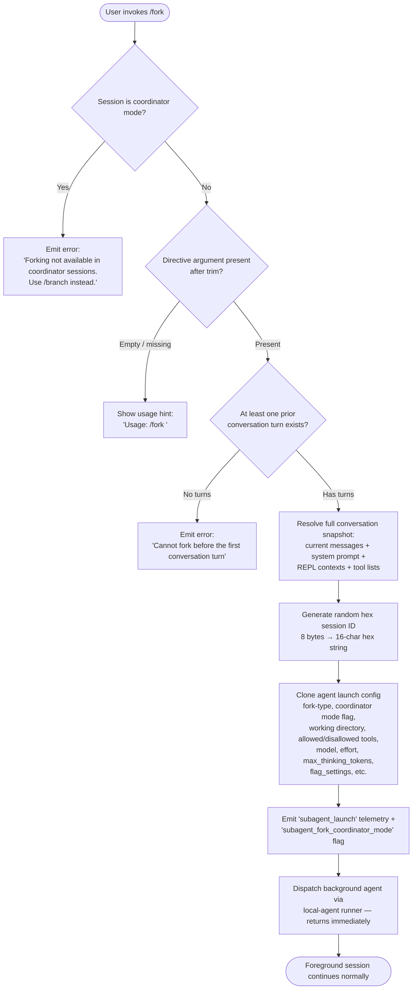

# `/fork`

> Analysis basis: CC v2.1.163 bundle.js (AST extraction + Claude interpretation)
> Minimum version: v2.1.163

---

## Overview

The `/fork` command spawns a background agent that inherits the full current conversation context, then runs an independent task described by the user-supplied directive. It clones the session state (messages, system prompt, REPL contexts, tool settings, etc.) into a new local agent process and dispatches the agent asynchronously, leaving the foreground session free for continued interaction.

---

## Registration

| Field | Value |
|---|---|
| type | `local-jsx` |
| name | `fork` |
| description | `Spawn a background agent that inherits the full conversation` |
| argumentHint | `<directive>` |
| module_id | `l8K` |
| load_inline | `true` |
| loc_byte | `12477633` |
| loc_byte_end | `12477836` |
| loc_line | `8927` |
| arbor_handler.name | `vhf` |
| arbor_handler.fqn | `claude-2.1.163::vhf` |
| arbor_handler.kind | `AsyncFunction` |
| arbor_handler.resolution_path | `module_id` |
| arbor_handler.n_hits | `0` |

Analysis basis: CC v2.1.163 bundle.js:+12477633

---

## Input Branching

Four distinct guard conditions exist before the background agent is launched, making a Mermaid flowchart the appropriate representation.



Analysis basis: CC v2.1.163 bundle.js:+12477192, +12477214, +12477284, +12477325, +12477330, +12477403

---

## Behavioral Spec

### 1. Argument validation (`vhf` entry point)

```
async function forkCommandHandler(userInput, sessionContext):
    directive = userInput.trim()                 // vhf → A.trim  +12477192

    if sessionContext.isCoordinatorMode():        // checked via session flags
        return errorMessage(
            "Forking is not available in coordinator sessions. Use /branch instead."
        )                                         // literal +12477330

    if directive is empty:
        return helpMessage("Usage: /fork <directive>")  // literal +12477216

    systemMessages = sessionContext.getSystemMessages()  // "system" literal +12477256
    if systemMessages is empty or no prior turns:
        return errorMessage(
            "Cannot fork before the first conversation turn"
        )                                         // literal +12477403
```

Analysis basis: CC v2.1.163 bundle.js:+12477192, +12477216, +12477256, +12477330, +12477403

---

### 2. Session snapshot construction (`m6A`)

```
function buildForkSnapshot(sessionContext, directive):
    // Collect full message history from current session
    messages = sessionContext.getMessages()

    // Trim to last 50 messages (constants: 50=+10938494, 49=+10938507)
    sliceStart = max(0, messages.length - 50)
    trimmedMessages = messages.slice(sliceStart)   // +10938497

    // Retrieve REPL contexts for tool continuity
    replContexts = sessionContext.getReplContexts() // +10938349

    // Build message replay list (handles assistant/user/tool_use/tool_result types)
    replayMessages = buildReplayList(trimmedMessages, replContexts)  // iV8 +10938444

    // Validate directive is non-empty after normalisation
    trimmedDirective = normalizeDirective(directive)  // vxq +10938476

    // Generate unique session ID: 8 random bytes encoded as 16-char hex
    forkSessionId = randomHex(8)                   // oh +10938524, literal "hex" +6857679

    // Capture timestamp
    launchTimestamp = Date.now()                   // +10938551
```

Analysis basis: CC v2.1.163 bundle.js:+10938103, +10938222, +10938349, +10938444, +10938476, +10938494, +10938497, +10938524, +10938551

---

### 3. Fork-type resolution and subagent config (`R_`, `qzf`)

```
function resolveForkedAgentConfig(sessionContext):
    appState = sessionContext.getAppState()         // qzf → H.getAppState +10939793

    // Find the last assistant turn to use as handoff point
    lastAssistantTurn = appState.messages.findLast(isAssistantMessage)  // +10916000

    // Inherit tool permissions
    inheritedConfig = {
        working_directory:    appState.workingDirectory,   // literal +10916025
        allowed_tools:        appState.allowedTools,       // literal +10916080
        disallowed_tools:     appState.disallowedTools,    // literal +10916135
        avoid_prompts:        appState.avoidPrompts,       // literal +10916196
        session:              appState.session,            // literal +10916495
        effort:               appState.effort,             // literal +10916520
        model:                appState.model,              // literal +10916533
        max_thinking_tokens:  appState.maxThinkingTokens,  // literal +10916545
        flag_settings:        appState.flagSettings        // literal +10916571
    }
    return inheritedConfig
```

Analysis basis: CC v2.1.163 bundle.js:+10939793, +10915920, +10916000, +10916025, +10916080, +10916135, +10916196, +10916495, +10916520, +10916533, +10916545, +10916571

---

### 4. Background agent launch (`o86`, `ICH`, `VsH`)

```
async function launchForkAgent(forkConfig, replayMessages, directive, forkSessionId):
    // Register the forked agent in the local-agent registry
    // agent type = "local_agent", status = "running", kind = "general-purpose"
    agentRecord = createAgentRecord({
        type:   "local_agent",       // literal +10502733
        status: "running",           // literal +10502778
        kind:   "general-purpose"    // literal +10502852
    })                               // o86 +10938564

    // Set up working directory symlink (EEXIST is tolerated)
    setupWorkingDirectory(forkSessionId)   // ICH → z5A, Wx8 +13254650

    // Build the full system prompt by assembling:
    //   memory blocks, environment info, tool policies, coding style, tone rules
    systemPrompt = assembleSystemPrompt(forkConfig)   // DT +10939955

    // Construct subagent invocation payload
    subagentPayload = {
        messages:        replayMessages,
        systemPrompt:    systemPrompt,
        directive:       directive,
        sessionId:       forkSessionId,
        launchMode:      "fork",      // literal +10938309
        coordinatorMode: false
    }

    // Register and begin execution on background worker pool
    // VsH manages the full async lifecycle: progress, stall detection, completion
    return spawnLocalAgent(subagentPayload, agentRecord)   // VsH +10939068
```

Analysis basis: CC v2.1.163 bundle.js:+10938564, +10939955, +10502733, +10502778, +10502852, +10938309, +10939068

---

### 5. Background agent lifecycle (`VsH`)

The background agent runner (`VsH`) manages the complete execution lifecycle:

- **Stall detection**: A watchdog timer fires after a configurable interval; the event `"watchdog_stall"` is logged (literal +6948217).
- **Rate-limit handling**: Rate-limit events (`rate_limit_event`, literal +15913130) are forwarded to the coordinator; the agent pauses and resumes.
- **Progress reporting**: Progress events (`query_progress`, literal +6949121) are emitted to the foreground session at 10% granularity (`0.1` constant, +6949061).
- **Completion**: Upon successful completion the event `"subagent_complete"` is emitted (literal +6948859).
- **Stall timeout**: If the watchdog fires, `"subagent_stall_timeout"` is emitted (literal +6948879).
- **Termination**: A SIGTERM signal (literal +16135247) or SIGKILL escalation (literal +13489025) may be sent if the agent is forcibly stopped.

Analysis basis: CC v2.1.163 bundle.js:+6948217, +15913130, +6949121, +6949061, +6948859, +6948879, +16135247, +13489025

---

### 6. Prompt injection / coordinator guard (`b2`)

```
function coordinatorGuard(sessionType):
    // A fork issued from a coordinator-mode session is rejected
    // This guard fires before any snapshot is taken (b2 +12477325)
    if sessionType == "coordinator":
        return REJECT with message:
            "Forking is not available in coordinator sessions. Use /branch instead."
    return ALLOW
```

Analysis basis: CC v2.1.163 bundle.js:+12477325, +12477330

---

## State & Side Effects

| Item | Detail |
|---|---|
| Telemetry — subagent_launch | Fired at fork dispatch (`"subagent_launch"` literal +10938118) |
| Telemetry — subagent_fork_coordinator_mode | Captures coordinator-mode flag at dispatch (+10938136) |
| Telemetry — subagent_fork_prompt_missing | Fired when directive is absent or cannot be resolved (+10938260) |
| Telemetry — tengu_forked_agent_default_turns_exceeded | Fired when background agent exhausts its default turn budget (+10914794) |
| Telemetry — tengu_async_agent_stall_timeout | Fired when watchdog stall timer expires (+6948622) |
| Telemetry — tengu_agent_tool_completed | Fired per completed tool call inside the forked agent (+6944707) |
| Telemetry — tengu_agent_tool_terminated | Fired when a forked tool is forcibly terminated (+6950867) |
| Telemetry — subagent_complete / subagent_stall_timeout | Lifetime-end events emitted by background runner (+6948859, +6948879) |
| Background agent registry | `local_agent` entry created and tracked in daemon's agent map; removed on completion |
| Working directory symlink | Created under a `subagents/` path (literal +6734976); `EEXIST` tolerated (+13254739) |
| Session ID | 16-character hex string generated via `crypto.randomBytes(8)` (+6857651) |
| appState changes | Forked agent has its own isolated `appState`; foreground `appState` is read-only during snapshot |
| Hook registration | `K.register` called on agent startup (+10503044); `j9` / `MXA.register` also invoked (+60323) |
| Sound | <!-- TODO: not found in depth-2 traversal; needs --depth 4 --> |

---

## Version History

| Version | Change |
|---|---|
| v2.1.163 | Initial analysis |

---

## Common Mistakes

1. **Invoking `/fork` in a coordinator session** — The command is blocked with an explicit message redirecting users to `/branch`. This is a hard guard, not a soft warning.
2. **Omitting the directive argument** — Running `/fork` with no text (or only whitespace) returns the usage hint rather than silently doing nothing. Always supply a non-empty task description.
3. **Forking before any conversation turn** — The command requires at least one prior assistant/user exchange to have a meaningful snapshot. Issuing `/fork` as the very first command in a session will fail with a clear error.
4. **Expecting synchronous results** — The forked agent runs entirely in the background. The foreground session returns immediately; results arrive asynchronously via progress and completion events.
5. **Assuming the full conversation history is forwarded** — The snapshot is capped at the trailing 50 messages (constants 50/49 at +10938494/+10938507). Very long conversations will have older turns omitted.

---

## Appendix — Identifier Mapping

> For bundle debugging only. Identifiers change across versions.

| Identifier | Role |
|---|---|
| `vhf` | Main handler: `/fork` command entry point (AsyncFunction) |
| `m6A` | Fork snapshot builder — assembles message replay list, session ID, config |
| `qzf` | App-state resolver — reads `getAppState`, extracts last assistant turn |
| `R_` | Last-assistant-turn finder — `findLast` over message array |
| `mk8` | Message kind classifier helper (used by `R_`) |
| `pk8` | Alternate message kind classifier helper (used by `R_`) |
| `DT` | System prompt assembler — calls all sub-prompt builders |
| `VsH` | Background agent lifecycle runner — progress, stall, completion |
| `o86` | Local agent launcher — creates agent record and starts process |
| `ICH` | Working directory setup — mkdir + symlink under subagents/ |
| `Wx8` | Active-agent tracker (add/delete around execution) |
| `z5A` | Subagent working directory creator |
| `d$` | Subagent socket path builder |
| `B66` | Alternative agent bootstrap path |
| `FZ` | Subagents directory path resolver |
| `xC` | Process/signal controller for child agents |
| `dq` | Max-listeners setter for AbortController |
| `Hz9` | Abort signal binding helper |
| `o2` | Subagent timestamp updater |
| `iV8` | REPL message replay list builder |
| `me7` | Message type classifier — assistant messages |
| `pe7` | Message type classifier — user messages |
| `ue7` | Message type classifier — tool_result/error messages |
| `Ue7` | Message type classifier — tool_use messages |
| `vxq` | Directive normalizer / trimmer |
| `oh` | Random hex ID generator (`crypto.randomBytes`) |
| `wS` | Full agent session runner (inner query loop, hooks, MCP, tools) |
| `js` | Model/provider context builder |
| `Qm` | Agent system-prompt + context assembler |
| `H` (in vhf scope) | Bootstrap / fetch helper — API request shim |
| `b2` | Coordinator guard — checks session type before fork |
| `Pw_` | Header parser utility |
| `ZHH` | Feature-flag set membership checker |
| `uj` | String replace utility |
| `t1` | Token/model string normalizer |
| `D6H` | Model context string builder |
| `yd` | Model alias resolver |
| `Aq` | Model identifier canonicalizer |
| `eX` | Extended model context assembler |
| `r0` | Provider type router |
| `s6` | Render component helper (JSX) |
| `J45` | <!-- TODO: not found in depth-2 traversal; needs --depth 4 --> |
| `e$` | <!-- TODO: not found in depth-2 traversal; needs --depth 4 --> |
| `Vj6` | Memory-prompt builder (CLAUDE.md / team memory) |
| `Wx8` | CMK active-set manager |
| `MAH` | Agent state update handler (speculation abort, metadata) |
| `ZsH` | Subagent completion recorder |
| `Ye_` | Completion timestamp helper |
| `Az` | Agent flush/cleanup (Jx8 cache) |
| `ryH` | Filter helper for agent tool list |
| `lK` | Tool-list filter |
| `ayH` | Per-agent config accessor |
| `kK` | Recursive config-cache lookup |
| `IG6` | Subagent query/summary orchestrator |
| `jG` | Individual query turn runner |
| `u8` | UUID + response wrapper |
| `DPq` | Subagent state update dispatcher |
| `kOf` | Main REPL query loop (tool execution, compaction, fallback) |
| `KY8` | Subagent exit / cleanup handler |
| `gm` | Subagent session wrapper |
| `Um9` | OpenTelemetry span wrapper for subagent spawns |
| `hXH` | Tracing context setter (`EfH.enterWith`) |
| `rh` | Tracing active-span accessor |
| `pN` | Span attribute setter |
| `Bm9` | Span end + status writer |
| `SXH` | Span context restorer |
| `n5H` | Subagent task launcher (MCP / local_bash / dream) |
| `gL` | MCP tool runner |
| `kP` | Full hook+tool execution engine |
| `wfH` | Fork-context-ref writer |
| `fJ` | <!-- TODO: not found in depth-2 traversal; needs --depth 4 --> |
| `cz7` | Context-ref finder |
| `D$K` | Tool-type classifier |
| `w$K` | Tool metadata mapper |
| `eN` | Tool registry resolver |
| `J6` | Background session bridge connector |
| `LH` | Background session event writer |
| `tMA` | Session transport adapter |
| `BH` | Bridge connect/data/close handlers |
| `kR6` | Session ID sanitizer |
| `k6` | Session event batch writer |
| `L6` | Scheduled task runner |
| `NH` | Background session promise race handler |
| `o1H` | MCP OAuth / subagent HTTP server handler |
| `r_6` | Pending-request registry helper |
| `dH` | Dynamic MCP tool map builder |
| `C1` | UUID generator wrapper |
| `Qj` | Permission check helper |
| `x8` | Policy loader |
| `DLH` | Policy cache checker |
| `fm9` | Tool-name set builder |
| `K4` | Node `uv` handle helper |
| `Nt7` | Skill/tool name resolver |
| `d86` | Skill definition fetcher |
| `Q1` | Skill name slicer |
| `YCH` | Skill list sorter |
| `WJ` | Skill finder |
| `Tt7` | Tool set assembler for subagent launch |
| `T3H` | <!-- TODO: not found in depth-2 traversal; needs --depth 4 --> |
| `L4` | String error helper |
| `zF` | Enterprise/project MCP config merger |
| `MoH` | MCP tool metadata builder |
| `Cl` | MCP config entry collector |
| `YfH` | Tool availability checker |
| `xN` | Tool search / optimistic-tool helper |
| `Ls` | Model provider lowercase comparator |
| `hCH` | Attachment checker |
| `wa_` | Deferred-tools pool manager |
| `JV8` | Agent state transition handler (getAppState / setAppState) |
| `sI8` | <!-- TODO: not found in depth-2 traversal; needs --depth 4 --> |
| `wV8` | MCP tool list refresher |
| `FI6` | MCP tool filter |
| `Dn` | Bundled-tool deduplicator |
| `l_H` | Tool-source filter |
| `XZq` | MCP tool cache |
| `dV` | Numeric tool-count parser |
| `Ih_` | Tool permission intersection builder |
| `WyH` | Retry backoff calculator |
| `a0` | Model/tool call validator |
| `zr_` | Fork-context ref writer |
| `d4` | Transcript directory builder |
| `b1H` | Fork context reference embedder |
| `iCH` | Transcript event filter |
| `n86` | Agent metadata JSONL writer |
| `HMK` | Metadata path builder |
| `Xs` | Subagent tool/context aggregator |
| `Ub_` | Permitted tool list builder |
| `y3` | Context item renderer |
| `z` | Daemon stop / background session type |
| `MG` | CLI/MCP tool metadata merger |
| `RV` | Path joiner utility |
| `K$6` | Path component builder |
| `PP` | Error code emitter |
| `Or_` | <!-- TODO: not found in depth-2 traversal; needs --depth 4 --> |
| `Zt7` | <!-- TODO: not found in depth-2 traversal; needs --depth 4 --> |
| `lb9` | <!-- TODO: not found in depth-2 traversal; needs --depth 4 --> |
| `$0` | Agent progress message builder |
| `rMf` | Progress entry lookup |
| `oMf` | Progress entry updater |
| `jV8` | Progress key builder |
| `c86` | Skill/bash progress handler |
| `yI6` | Progress text trimmer |
| `zPq` | App-state key accessor |
| `yP` | State key resolver |
| `KbH` | State key cache |
| `QH` | Message slice + writeMessages caller |
| `Zl` | <!-- TODO: not found in depth-2 traversal; needs --depth 4 --> |
| `Hx9` | <!-- TODO: not found in depth-2 traversal; needs --depth 4 --> |
| `$x9` | LF-map delete + RyH caller |
| `RyH` | Session transcript file writer |
| `$r_` | mN8 cache delete |
| `FyH` | lY8/wb_ cache delete |
| `Bm9` | Span-end writer |
| `QyH` | Span status setter |
| `SXH` | Span context restorer |
| `Zx9` | EC_ cache delete |
| `Lm9` | REPL context synchronizer |
| `PfH` | REPL context update worker |
| `XG` | <!-- TODO: not found in depth-2 traversal; needs --depth 4 --> |
| `M26` | <!-- TODO: not found in depth-2 traversal; needs --depth 4 --> |
| `AXH` | <!-- TODO: not found in depth-2 traversal; needs --depth 4 --> |
| `G` (pool) | Worker pool manager (sk6/XK6) |
| `W` (pool) | Worker connection manager (IS/Ck/Promise.all) |
| `r` (worker) | Worker respawn-if-idle-stale handler |
| `l` (worker) | Worker retire-if-settled handler |
| `d` (sched) | Grace-clock / scheduled-loop state machine |
| `h` (sched) | Periodic sweep: memory checks, retire/respawn decisions |
| `lR6` | Free-memory reader |
| `WfK` | Memory-threshold emitter |
| `zX6` | Conversation file reader |
| `vb8` | Memory-attach upgrade emitter |
| `Sd` | AsyncLocalStorage store accessor |
| `s0` | q5_ store getter |
| `xw` | hX1 store getter |
| `hd` | hX1 run wrapper |
| `g` (bg) | Background process connector / hung-process detector |
| `x` | clearInterval wrapper |
| `C` (rate) | Rate-limit event enqueuer |
| `Q` (timer) | Progress-write / setTimeout manager |
| `j` (kill) | Process kill-all helper |
| `I` (bg) | Background session inner renderer |
| `S` (write) | Y.write wrapper |
| `jD8` | Tool-call boundary finder |
| `uXH` | Per-turn tool permission checker |
| `qbH` | Tool call validator (isSearchOrReadCommand) |
| `yG6` | Agent state progress updater |
| `IfH` | kG6 caller |
| `kG6` | <!-- TODO: not found in depth-2 traversal; needs --depth 4 --> |
| `zD8` | <!-- TODO: not found in depth-2 traversal; needs --depth 4 --> |
| `YD8` | IfH + XsH caller |
| `XsH` | Task-progress emitter |
| `OD8` | Auto-mode classifier / subagent-end handler |
| `BZ` | findLast helper |
| `Ca` | <!-- TODO: not found in depth-2 traversal; needs --depth 4 --> |
| `eD7` | <!-- TODO: not found in depth-2 traversal; needs --depth 4 --> |
| `u$` | Error message builder |
| `sI` | BHH membership checker (tool deny-list) |
| `N4` | Event emitter (M.emit) |
| `p7H` | Event name lowercaser |
| `Hw7` | tY8 membership checker |
| `wD8` | Agent state update + flush |
| `DD8` | Agent completion + Jp9/ZG6 dispatcher |
| `Jp9` | Completion sub-handler |
| `ZG6` | Auto-mode classifier main logic |
| `Qp` | <!-- TODO: not found in depth-2 traversal; needs --depth 4 --> |
| `h1` | Nu6 caller |
| `mXH` | Agent state timestamp updater |
| `k3H` | <!-- TODO: not found in depth-2 traversal; needs --depth 4 --> |
| `F06` | uz8 cache delete |
| `s7H` | D6 caller |
| `Tx9` | EC_ cache setter |
| `GfH` | <!-- TODO: not found in depth-2 traversal; needs --depth 4 --> |
| `iY8` | wm9/Dm9/lY8/YD7 caller sequence (tracing context) |
| `wm9` | wb_ get/set (tracing store) |
| `Dm9` | Math.abs + SOH caller |
| `YD7` | Yb_.push (tracing push) |
| `XV8` | <!-- TODO: not found in depth-2 traversal; needs --depth 4 --> |
| `C7H` | Conversation load/dump helper |
| `QC` | <!-- TODO: not found in depth-2 traversal; needs --depth 4 --> |
| `ccK` | Provider capability builder (Vy/dcK/OXA) |
| `OXA` | Provider option resolver (lgK/ngK) |
| `J4` | Message tail slicer |
| `g2A` | BcK mapper |
| `ppH` | h2A caller (write helper) |
| `h2A` | H.write caller |
| `icK` | Transcript writer setup |
| `$pH` | Buffered output flusher (clearTimeout/setTimeout/setImmediate) |
| `d3H` | KU6/KHH/a8/h6 caller sequence |
| `aL6` | v8 caller |
| `r2A` | Path joiner + h6 |
| `i2A` | File stat/rename/unlink helper |
| `ncK` | Transcript mkdir + appendFile |
| `j9` | MXA.register caller |
| `e$` | <!-- TODO: not found in depth-2 traversal; needs --depth 4 --> |
| `Pw_` | Header split/trim/slice parser |
| `ZHH` | g44 feature-flag checker |
| `uj` | Regex replace helper |
| `t1` | D6H + Aq model normalizer |
| `D6H` | Model context builder (x0/IqH/SA/yd) |
| `yd` | Model alias map resolver |
| `x0` | <!-- TODO: not found in depth-2 traversal; needs --depth 4 --> |
| `IqH` | <!-- TODO: not found in depth-2 traversal; needs --depth 4 --> |
| `Aq` | Model ID canonicalizer |
| `o0` | q4H caller |
| `_4H` | H4H include checker |
| `wI` | gM + Z5 caller |
| `NQH` | Z5 caller |
| `NE` | gM + Z5 + XA caller |
| `kX1` | NE caller |
| `gM` | XA caller |
| `Pe6` | l1L include checker |
| `vQH` | eH caller |
| `eX` | Aq + r0 caller |
| `r0` | Provider router (ZA/P6H/PYH/IQH/NE/z2/gM/XA/Z5/wI) |
| `s6` | c + P6 render helper |
| `P6` | Nu6 caller |
| `Nu6` | <!-- TODO: not found in depth-2 traversal; needs --depth 4 --> |
| `b2` | eH + qE + Wq caller (guard) |
| `eH` | String coercer |
| `qE` | <!-- TODO: not found in depth-2 traversal; needs --depth 4 --> |
| `Wq` | <!-- TODO: not found in depth-2 traversal; needs --depth 4 --> |
| `RH` | c + P6 render helper (alternate) |
| `c` | <!-- TODO: not found in depth-2 traversal; needs --depth 4 --> |
| `Iz` | <!-- TODO: not found in depth-2 traversal; needs --depth 4 --> |
| `W6` | Nu6 caller (alternate) |
| `It7` | <!-- TODO: not found in depth-2 traversal; needs --depth 4 --> |
| `Or_` | <!-- TODO: not found in depth-2 traversal; needs --depth 4 --> |
| `Qp` | <!-- TODO: not found in depth-2 traversal; needs --depth 4 --> |

---

Note: index built via Arbor fallback; some signals (telemetry, literals) may be missing — see arbor-fallback.js.