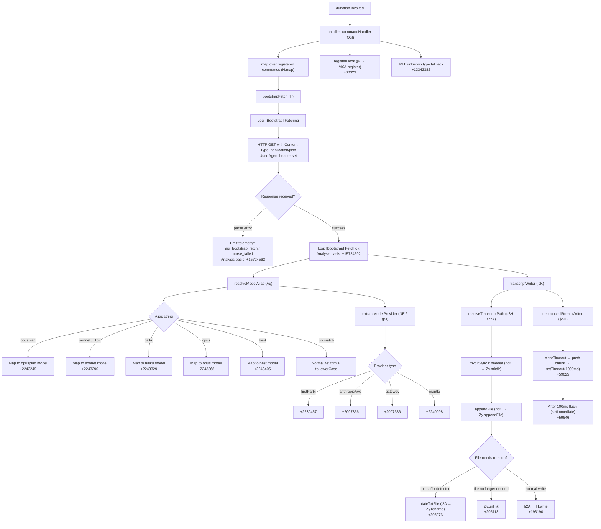

# `/function`

> Analysis basis: CC v2.1.163 bundle.js (AST extraction + Claude interpretation)
> Minimum version: v2.1.163

---

## Overview

The `/function` command is a `function`-type slash command registered in the Claude Code CLI. Based on the call graph, it enumerates and maps over available command definitions — likely exposing or listing internal command function registrations — and delegates to a bootstrap-fetch pipeline that resolves model aliases, manages file-backed transcript logging, and coordinates debounced streaming output. The command's description field is null in the registration, indicating it may be an internal or unlisted command.

---

## Registration

| Field | Value |
|---|---|
| type | `function` |
| name | `function` |
| description | `null` |
| loc_byte | `13342268` |
| loc_byte_end | `13342301` |
| loc_line | `10694` |
| arbor_handler.name | `Qgf` |
| arbor_handler.fqn | `claude-2.1.163::Qgf` |
| arbor_handler.kind | `Function` |
| arbor_handler.resolution_path | `direct` |
| arbor_handler.n_hits | `1` |

Analysis basis: CC v2.1.163 bundle.js:+13342268

---

## Input Branching

The call graph reveals 4+ distinct execution paths from the handler: command-list mapping, bootstrap fetch with outcome branching (parse failure vs. success), model-alias resolution (multiple known aliases), and file-based transcript management (append, rotate, unlink). A Mermaid flowchart is required.



---

## Behavioral Spec

### Command Handler — `commandHandler` (`Qgf`)

The top-level handler for `/function` is `Qgf`, resolved via Arbor `direct` resolution (the symbol falls inside the registration byte range at `+13342268`–`+13342301`).

```
function commandHandler(inputArgs):
    commandList = mapRegisteredCommands()        // H.map at +13341949
    result = bootstrapFetch(commandList)
    registerHook()                               // j9 → MXA.register at +60323
    iMH_fallback(result)                         // iMH at +13342020; "unknown" fallback at +13342382
    return result
```

Analysis basis: CC v2.1.163 bundle.js:+13342268

---

### Command Enumeration — `mapRegisteredCommands` (`H`)

This function maps over the internal list of registered commands. The literal `"command"` (at `+13341980`) is used as a discriminant type value during enumeration.

```
function mapRegisteredCommands():
    entries = commandRegistry.map(entry => {
        if entry.type == "command":   // "command" at +13341980
            return buildCommandDescriptor(entry)
        elif entry.type == "prompt":  // "prompt" at +12436960
            return buildPromptDescriptor(entry)
        elif entry.type == "agent":   // "agent" at +12436989
            return buildAgentDescriptor(entry)
        elif entry.type == "http":    // "http" at +12437017
            return buildHttpDescriptor(entry)
        elif entry.type == "mcp_tool":// "mcp_tool" at +12437041
            return buildMcpToolDescriptor(entry)
        elif entry.type == "callback":// "callback" at +12437103
            return buildCallbackDescriptor(entry)
        else:
            return buildUnknownDescriptor(entry) // "unknown" at +13342382
    })
    return entries
```

Analysis basis: CC v2.1.163 bundle.js:+15724216

---

### Bootstrap Fetch — `bootstrapFetch` (`H`)

Performs an HTTP fetch to retrieve remote configuration or command definitions. A 5000 ms timeout is applied (literal `5000` at `+15724419`). On parse failure the telemetry event `api_bootstrap_fetch / parse_failed` is emitted.

```
function bootstrapFetch(commandList):
    log("[Bootstrap] Fetching")          // literal at +15724218
    response = fetch(endpoint, {
        headers: {
            "Content-Type": "application/json",  // +15724303 / +15724318
            "User-Agent": userAgentString         // +15724337
        },
        timeout: 5000                            // +15724419
    })
    cacheEntry = responseCache.get(cacheKey)     // _A.get at +15724254
    parsed = parseModelEntry(response)           // e$ at +15724350
    modelName = parseModelName(parsed)           // Pw_ at +15724358
    if parseError:
        emitTelemetry("api_bootstrap_fetch", "parse_failed")  // +15724540 / +15724562
        return errorResult
    log("[Bootstrap] Fetch ok")                  // +15724592
    checkKnownBootstrap(modelName)               // ZHH → g44.has at +843864
    normalizeModelName(modelName)                // uj → H.replace at +2244785
    resolveModelCommand(modelName)               // t1 at +15724404
    return result
```

Analysis basis: CC v2.1.163 bundle.js:+15724216

---

### Model Name Parsing — `parseModelName` (`Pw_`)

Parses a model identifier string from a raw response token.

```
function parseModelName(raw):
    parts = raw.split(separator)            // _.split at +2974410
    trimmed = parts.trim()                  // q.trim at +2974449
    idx = trimmed.indexOf(delimiter)        // q.indexOf at +2974473
    result = trimmed.slice(0, idx)          // q.slice at +2974513
    return result
```

Analysis basis: CC v2.1.163 bundle.js:+2974410

---

### Model Alias Resolution — `resolveModelAlias` (`Aq`)

Normalizes a user-supplied or fetched model alias to a canonical model identifier. Recognized short aliases include `opusplan`, `sonnet`, `[1m]`, `haiku`, `opus`, `best`. The string `"anthropic."` (at `+2237210`) is used as a provider prefix check.

```
function resolveModelAlias(input):
    trimmed = input.trim()                    // H.trim at +2243153
    lower = trimmed.toLowerCase()             // _.toLowerCase at +2243164
    normalized = normalizeProviderPrefix(lower) // o0 → q4H at +2980355
    noSpecial = normalized.replace(pattern, "") // A.replace at +2243192
    if isInternalTier(noSpecial):             // _4H → H4H.includes at +2236359
        return tierModel
    if matchesSonnetVariant(noSpecial):       // wI → gM/Z5
        // "[1m]" literal at +2243275
        // "sonnet" literal at +2243290
        return "sonnet"
    if matchesHaikuVariant(noSpecial):        // NQH → Z5
        // "haiku" literal at +2243329
        return "haiku"
    if matchesOpusPlan(noSpecial):            // "opusplan" at +2243249
        return "opusplan"
    if matchesOpus(noSpecial):               // "opus" at +2243368
        return "opus"
    if matchesBest(noSpecial):               // kX1 → NE; "best" at +2243405
        return "best"
    checkProviderType(noSpecial)             // gM at +2243437; Pe6 at +2243443; vQH at +2243451
    result = noSpecial.replace(finalPattern, replacement) // _.replace at +2243495
    return result
```

Analysis basis: CC v2.1.163 bundle.js:+2243153

---

### Model Command Resolver — `resolveModelCommand` (`t1`)

Drives the full model-command resolution pipeline, combining syntactic parsing, alias matching, and provider classification.

```
function resolveModelCommand(modelName):
    commandDescriptor = parseCommandTokens(modelName) // D6H at +2239233
    // D6H calls: x0, IqH, SA, yd
    aliasResult = resolveModelAlias(modelName)        // Aq at +2239270
    expandedResult = expandModelExpression(aliasResult) // eX at +2239283
    // eX calls: Aq, r0
    return expandedResult
```

Analysis basis: CC v2.1.163 bundle.js:+2239233

---

### Expression Expander — `expandModelExpression` (`eX`) and `resolveModelProvider` (`r0`)

Handles structured model expression tokens (e.g., provider-qualified names).

```
function expandModelExpression(expr):
    alias = resolveModelAlias(expr)      // Aq at +2240159
    provider = resolveModelProvider(expr) // r0 at +2240162
    return merge(alias, provider)

function resolveModelProvider(expr):
    base = resolveBaseModel(expr)        // ZA at +2239988
    p6h = resolveP6H(expr)              // P6H at +2239997
    pyh = resolvePYH(expr)              // PYH at +2240004
    iqh = resolveIQH(expr)              // IQH at +2240011
    if isFirstParty(expr):              // NE at +2240024
        return firstPartyResult
    z2_val = resolveZ2(expr)            // z2 at +2240030
    gm_val = resolveGM(expr)            // gM at +2240054; XA at +2240091
    z5_val = resolveZ5(expr)            // Z5 at +2240114
    wi_val = resolveWI(expr)            // wI at +2240133
    // "mantle" provider at +2240098
    return providerObject
```

Analysis basis: CC v2.1.163 bundle.js:+2239988

---

### File Extension Check — `fileExtensionClassifier` (`J4`)

Determines the extension and base name of a file path, used during transcript path resolution.

```
function fileExtensionClassifier(filePath):
    prefixMap = buildPrefixMap(filePath)   // g2A → BcK.map at +197777
    // "[REDACTED]" placeholder literal at +198141
    // Numeric limit: 2 (at +198170)
    normalized = filePath.replace(pattern, "") // H.replace at +198089
    lastChar = path.at(-1)                   // q.at at +198199
    lastDotIdx = normalized.lastIndexOf(".") // A.lastIndexOf at +198225
    extension = normalized.slice(lastDotIdx) // A.slice at +198251
    trimmed = filePath.trim()               // H.trim at +206200
    return { base: normalized, ext: extension }
```

Analysis basis: CC v2.1.163 bundle.js:+198062

---

### Transcript Path Writer — `transcriptWriter` (`icK`)

Orchestrates the full lifecycle of transcript file management: path resolution, directory creation, append, rotation, and size accounting. A `.txt` suffix (at `+205021`) triggers special handling. File rotation uses a slice of 4 characters (literal `4` at `+205043`) to strip the suffix.

```
function transcriptWriter(entry, config):
    streamWriter = debouncedStreamWriter(config)        // $pH at +205563
    transcriptPath = resolveTranscriptPath(entry)       // d3H at +205588
    baseDir = path.dirname(transcriptPath)              // KHH.dirname at +205596
    checkDirWritable(baseDir)                           // Vy at +205626
    sessionKey = resolveSessionKey(entry)               // Q6 at +205641
    logPath = buildLogPath(entry, config)               // aL6 → v8 at +205716
    // EISDIR error code handled at +175638 (in v8)
    filePath = buildFilePath(logPath)                   // r2A at +205733
    fileInfo = statAndClassifyFile(filePath)            // i2A at +205765
    // i2A: Zy.stat, endsWith(".txt"), slice, Zy.rename, Zy.unlink
    byteLen = Buffer.byteLength(entry.content)          // +205771
    pendingWrite = buildWritePayload(entry, byteLen)    // a2A at +205804
    promise = AU6.then(writePayload)                    // +205821
    boundAppend = appendHandler.bind(config)            // ncK.bind at +205830
    // ncK: Zy.mkdir, Zy.appendFile, aL6, r2A, i2A, Buffer.byteLength, a2A
    hookToken = registerHookForWrite(boundAppend)       // j9 at +205926
    return promise
```

Analysis basis: CC v2.1.163 bundle.js:+205563

---

### Debounced Stream Writer — `debouncedStreamWriter` (`$pH`)

Manages buffered, debounced output flushing to avoid flooding the terminal or file stream. Uses a 1000 ms debounce timeout and a 100 ms immediate flush (via `setImmediate`).

```
function debouncedStreamWriter(stream):
    pendingChunks = []         // $.push at +59936
    pendingLines = []          // L.push at +60085

    function flush():
        clearTimeout(timer)    // clearTimeout at +59737
        joined = pendingChunks.join("") // $.join at +59811
        lineJoined = pendingLines.join("") // L.join at +59855
        output = buildOutput(joined, lineJoined)  // O at +59876
        stream.write(output)   // H.write (via h2A)
        D_flush()              // D at +60107
        W_flush()              // w at +60129
        Y_flush()              // Y at +60152

    function scheduleFlush(chunk):
        clearTimeout(timer)
        pendingChunks.push(chunk)
        timer = setTimeout(flush, 1000)     // +59625: 1000ms debounce
        setImmediate(() => {                // +59994
            joined = J.join("")             // J.join at +60034
            // flush after 100ms: +59646
        })

    return scheduleFlush
```

Analysis basis: CC v2.1.163 bundle.js:+59625

---

### Directory Transcript Path — `resolveTranscriptPath` (`d3H`)

Builds the full path for a transcript file given a session key.

```
function resolveTranscriptPath(sessionKey):
    base = KU6_basePath()           // KU6 at +206273
    fullPath = path.join(base, sessionKey, ...) // KHH.join at +206325
    anchor = resolveAnchor(fullPath) // a8 at +206334
    suffix = buildSuffix(anchor)     // h6 at +206350
    return suffix
```

Analysis basis: CC v2.1.163 bundle.js:+206273

---

### Log Path Builder — `buildLogPath` (`aL6`)

Constructs the log file path from the session configuration. Handles the `EISDIR` error condition (literal at `+175646`) when the path target turns out to be a directory rather than a file.

```
function buildLogPath(entry, config):
    result = resolveLogBasePath(entry, config)  // v8 at +175638
    if result.error == "EISDIR":               // +175646
        return handleDirConflict(result)
    return result.path
```

Analysis basis: CC v2.1.163 bundle.js:+175638

---

### File Stat and Rotate — `statAndClassifyFile` (`i2A`)

Stats the transcript file, checks for a `.txt` extension (literal at `+205021`), and either renames (rotates) or unlinks it depending on staleness.

```
function statAndClassifyFile(filePath):
    stats = fs.stat(filePath)               // Zy.stat at +204917
    if filePath.endsWith(".txt"):           // +205010 / +205021
        base = filePath.slice(0, -4)        // H.slice at +205032; literal 4 at +205043
        fs.rename(filePath, base)           // Zy.rename at +205073
        handleRenameResult(base)            // R8 at +205101
    else:
        fs.unlink(filePath)                 // Zy.unlink at +205113
    return stats
```

Analysis basis: CC v2.1.163 bundle.js:+204917

---

### Append Handler — `appendHandler` (`ncK`)

Called (bound) to perform the actual append-to-file operation for each transcript chunk.

```
function appendHandler(filePath, content, config):
    fs.mkdir(path.dirname(filePath), { recursive: true })  // Zy.mkdir at +205317
    fs.appendFile(filePath, content)                        // Zy.appendFile at +205376
    logPath = buildLogPath(content, config)                 // aL6 at +205408
    filePath2 = buildFilePath(logPath)                      // r2A at +205425
    fileInfo = statAndClassifyFile(filePath2)               // i2A at +205463
    byteLen = Buffer.byteLength(content)                    // +205469
    pendingWrite = buildWritePayload(content, byteLen)      // a2A at +205502
    return pendingWrite
```

Analysis basis: CC v2.1.163 bundle.js:+205317

---

### Hook Registration — `registerHook` (`j9`)

Registers a lifecycle hook via the internal hook registry (`MXA.register`).

```
function registerHook(handler):
    token = MXA.register(handler)   // MXA.register at +60323
    return token
```

Analysis basis: CC v2.1.163 bundle.js:+60323

---

### Telemetry Event — `featureSad` (`s6`)

Emits the `tengu_feature_sad` telemetry event under an error or degraded-feature condition. Calls into the core telemetry emitter (`c`) and a secondary reporter (`P6`).

```
function featureSad(context):
    emitTelemetry("tengu_feature_sad", context)  // c at +1010363
    reportIssue(context)                          // P6 → Nu6 at +3628
```

Analysis basis: CC v2.1.163 bundle.js:+1010363

---

### Output Serializer — `outputSerializer` (`SH`)

Serializes a command output object to a JSON string for downstream processing.

```
function outputSerializer(data):
    return JSON.stringify(data)    // JSON.stringify at +185153
```

Analysis basis: CC v2.1.163 bundle.js:+185153

---

### Command Type Check — `commandTypeCheck` (`ccK`)

Validates the command type discriminant; uses numeric literal `1` (at `+204696`) as an internal type code, and delegates to `Vy` and `dcK`/`OXA`.

```
function commandTypeCheck(entry):
    if entry.typeCode == 1:             // literal 1 at +204696
        return checkPrimaryType(entry)  // Vy at +204684
    altResult = checkAltType(entry)     // dcK at +204798
    return resolveTypeOverride(entry)   // OXA at +204811
```

Analysis basis: CC v2.1.163 bundle.js:+204684

---

### Provider Override Check — `resolveTypeOverride` (`OXA`)

Checks provider override using two sub-checks, indexed at `0` (literal at `+61448`).

```
function resolveTypeOverride(entry):
    primary = checkProviderList(entry)   // lgK at +61456; index 0 literal at +61448
    fallback = checkProviderFallback()   // ngK at +61470
    return primary ?? fallback
```

Analysis basis: CC v2.1.163 bundle.js:+61456

---

### Truncated Path Builder — `buildFilePath` (`r2A`)

Constructs a file path from the log path and a suffix token.

```
function buildFilePath(logPath):
    joined = path.join(logPath, ...)  // KHH.join at +205248
    result = buildSuffix(joined)      // h6 at +205262
    return result
```

Analysis basis: CC v2.1.163 bundle.js:+205248

---

### Session Key Resolver — `sessionKeyResolver` (`Q6`)

<!-- TODO: not found in depth-2 traversal; needs --depth 4 -->

---

### File Length String — `fileExtensionNormalizer` (`v`)

Normalizes a file extension string. Uses `"debug"` (at `+206051`) as a log level discriminant, checks if the command list includes a known type (`H.includes` at `+206115`), converts to uppercase (`_.toUpperCase` at `+206177`), and trims.

```
function fileExtensionNormalizer(filePath, commandList):
    logLevel = "debug"                  // +206051
    typeCode = commandTypeCheck(filePath) // ccK at +206093
    isIncluded = commandList.includes(filePath) // H.includes at +206115
    structuredHash = outputSerializer(filePath) // SH at +206133
    upper = filePath.toUpperCase()       // _.toUpperCase at +206177
    classifier = fileExtensionClassifier(upper) // J4 at +206197
    trimmed = filePath.trim()            // H.trim at +206200
    validated = VR_validate(trimmed)     // VR at +206216
    writer = transcriptWriter(trimmed)   // ppH → h2A → H.write; ppH at +206222
    fileInfo = transcriptWriter(trimmed) // icK at +206236
    return fileInfo
```

Analysis basis: CC v2.1.163 bundle.js:+206051

---

## State & Side Effects

| Item | Detail |
|---|---|
| Telemetry | `tengu_feature_sad` (at `+1010365`); `api_bootstrap_fetch` / `parse_failed` (at `+15724540` / `+15724562`) |
| Hook registration | `MXA.register` called via `j9` at `+60323`; registers a write-lifecycle hook |
| File system writes | `Zy.appendFile` at `+205376`; `Zy.mkdir` at `+205317`; `Zy.rename` at `+205073`; `Zy.unlink` at `+205113`; `xuK.unlinkSync` at `+16110347` |
| File system reads | `Zy.stat` at `+204917` |
| Stream writes | `H.write` via `h2A` at `+193190`; debounced via `$pH` |
| Debounce timers | `setTimeout` 1000 ms at `+59625`; flush threshold 100 ms at `+59646`; `clearTimeout` at `+59737`; `setImmediate` at `+59994` |
| HTTP fetch | Bootstrap fetch with `Content-Type: application/json`, `User-Agent` header, 5000 ms timeout; `+15724303`, `+15724337`, `+15724419` |
| Response cache | `_A.get` at `+15724254` |
| appState changes | <!-- TODO: not found in depth-2 traversal; needs --depth 4 --> |
| Sound | <!-- TODO: not found in depth-2 traversal; needs --depth 4 --> |

---

## Version History

| Version | Change |
|---|---|
| v2.1.163 | Initial analysis |

---

## Common Mistakes

1. **Assuming this is a user-facing command**: The `description` field is `null` and the command name is the reserved word `function`, strongly suggesting this is an internal command not intended for direct user invocation. Calling it explicitly may produce no visible output.
2. **Ignoring the bootstrap timeout**: The 5000 ms fetch timeout means slow network conditions will cause the bootstrap fetch to fail silently with a `parse_failed` telemetry event; do not confuse this with a missing command registration.
3. **File rotation side effects**: The `.txt` suffix detection in `statAndClassifyFile` will rename files on disk as a side effect of any transcript write; placing `.txt` files in the transcript directory manually may cause unexpected renames.
4. **Debounce flush timing**: The 1000 ms debounce means the last chunk of output may not be written synchronously; tests or scripts that inspect the transcript file immediately after invocation may see incomplete content.
5. **Model alias case sensitivity**: `resolveModelAlias` normalizes to lowercase before alias matching; passing an uppercase alias directly via API will be normalized, but passing it through a path that skips `resolveModelAlias` may cause a miss.
6. **Provider prefix stripping**: The `"anthropic."` prefix (at `+2237210`) is stripped during alias normalization; model names that contain `anthropic.` as a non-prefix substring may be incorrectly normalized.

---

## Appendix — Identifier Mapping

> For bundle debugging only. Identifiers change across versions.

| Identifier | Role |
|---|---|
| `Qgf` | Top-level `/function` command handler (arbor handler, direct resolution) |
| `H` | Bootstrap fetch orchestrator; also used as the command-list map iterator |
| `v` | File extension normalizer / command type dispatcher |
| `ccK` | Command type check / type-code validator |
| `OXA` | Provider type override resolver |
| `SH` | Output serializer (JSON.stringify wrapper) |
| `J4` | File extension classifier |
| `g2A` | Prefix map builder (used inside `J4`) |
| `q` | File path accessor / unlink wrapper |
| `A` | File name lowercaser / lastIndexOf wrapper |
| `ppH` | Transcript write dispatcher (calls `h2A`) |
| `h2A` | Stream write wrapper (`H.write`) |
| `icK` | Transcript writer / full file-lifecycle manager |
| `$pH` | Debounced stream writer |
| `d3H` | Transcript path resolver |
| `Q6` | Session key resolver |
| `aL6` | Log path builder (calls `v8`) |
| `r2A` | File path builder from log path |
| `i2A` | File stat and rotate handler |
| `ncK` | Append-to-file handler (mkdir + appendFile) |
| `j9` | Hook registration wrapper (`MXA.register`) |
| `e$` | Model entry parser |
| `Pw_` | Model name parser (split/trim/indexOf/slice) |
| `ZHH` | Known bootstrap model set checker (`g44.has`) |
| `uj` | Model name normalizer (`H.replace`) |
| `t1` | Model command resolver (full pipeline) |
| `D6H` | Command token parser (calls `x0`, `IqH`, `SA`, `yd`) |
| `x0` | Sub-parser used inside `D6H` |
| `IqH` | Sub-parser used inside `D6H` |
| `yd` | Token classifier (startsWith, includes, provider prefix) |
| `Aq` | Model alias resolver |
| `o0` | Provider prefix normalizer (calls `q4H`) |
| `_4H` | Internal tier checker (`H4H.includes`) |
| `wI` | Sonnet variant matcher (calls `gM`, `Z5`) |
| `NQH` | Haiku variant matcher (calls `Z5`) |
| `NE` | First-party provider resolver (calls `gM`, `Z5`, `XA`) |
| `kX1` | "Best" alias resolver (calls `NE`) |
| `gM` | Provider type resolver (calls `XA`) |
| `Pe6` | Provider list membership check (`l1L.includes`) |
| `vQH` | Provider qualifier wrapper (`eH`) |
| `eX` | Model expression expander (calls `Aq`, `r0`) |
| `r0` | Model provider resolver (multi-provider dispatcher) |
| `s6` | Feature-sad telemetry emitter |
| `c` | Core telemetry emit function |
| `P6` | Secondary issue reporter (calls `Nu6`) |
| `Nu6` | Issue report URL builder / logger |
| `iMH` | Unknown-type fallback handler |

---

Note: index built via Arbor fallback; some signals (telemetry, literals) may be missing — see arbor-fallback.js.