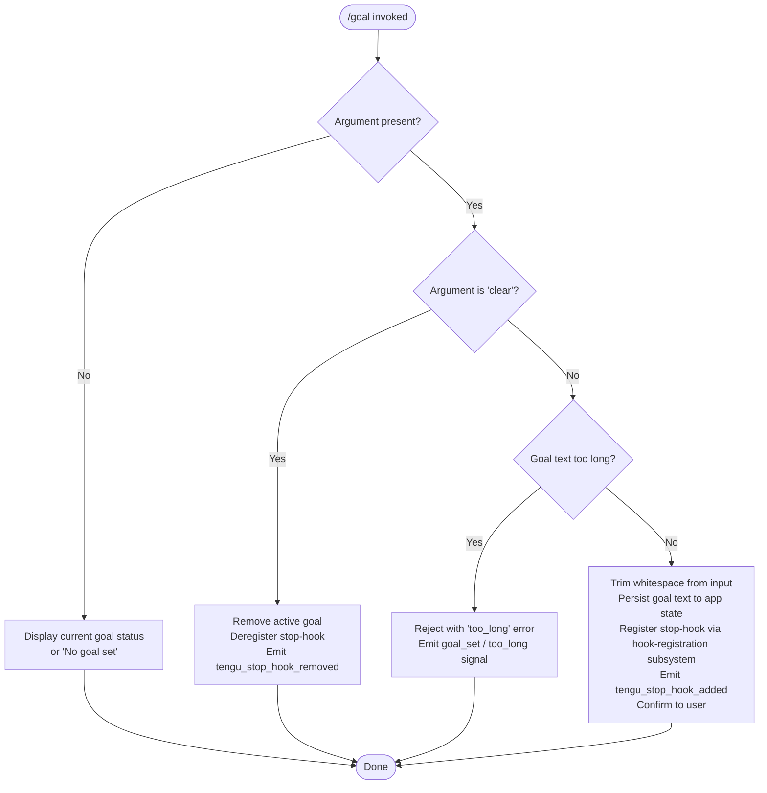

# `/goal`

> Analysis basis: CC v2.1.163 bundle.js (AST extraction + Claude interpretation)
> Minimum version: v2.1.163

---

## Overview

The `/goal` command allows a user to set a persistent completion condition that Claude checks before stopping a task. When a goal is active, a stop-hook is registered that evaluates whether the condition has been met; Claude will not cease work until the goal condition is satisfied or the goal is explicitly cleared. Calling `/goal clear` removes the active goal and deregisters the associated hook.

---

## Registration

| Field | Value |
|---|---|
| type | `local-jsx` |
| name | `goal` |
| description | `Set a goal Claude checks before stopping` |
| argumentHint | `[<condition> \| clear]` |
| immediate | `true` |
| module_id | `u7K` |
| load_inline | `true` |
| loc_byte | `12977478` |
| loc_byte_end | `12977664` |
| loc_line | `9614` |
| arbor_handler.name | `gpf` |
| arbor_handler.fqn | `claude-2.1.163::gpf` |
| arbor_handler.kind | `AsyncFunction` |
| arbor_handler.resolution_path | `module_id` |
| arbor_handler.n_hits | `0` |

Analysis basis: CC v2.1.163 bundle.js:+12977478

---

## Input Branching

Four distinct branches exist based on the argument supplied (or its absence) and validation state; a Mermaid flowchart is required.



Analysis basis: CC v2.1.163 bundle.js:+12976073 (trim), +12976179 (`skip` literal), +12976232 (`No goal set`), +12976318 (`goal_set`), +12976329 (`too_long`)

---

## Behavioral Spec

### Entry Point — Main Handler (`gpf`)

```
async function goalCommandHandler(context):
    rawArg = context.argument

    trimmedArg = trim(rawArg)                          // +12976073

    if trimmedArg == "" or trimmedArg == null:
        currentGoal = getAppState("goal")
        if currentGoal is null or currentGoal == "":
            display("No goal set")                     // +12976232
        else:
            display(currentGoal)
        return

    if isSkip(trimmedArg):                             // +12976179
        return  // silent no-op for internal skip signal

    if trimmedArg.toLowerCase() == "clear":
        removeGoalFromAppState()
        deregisterStopHook()                           // calls kA6 path
        emit telemetry("tengu_stop_hook_removed")      // +10802468
        display("Goal cleared")
        return

    validationResult = validateGoalText(trimmedArg)    // calls jk8 +12976193
    if validationResult == "too_long":
        signal("goal_set", "too_long")                 // +12976329
        displayError("Goal text is too long")
        return

    persistGoal(trimmedArg)                            // calls kA6 +12976207
    registerStopHook(trimmedArg)                       // +12976441
    emit telemetry("tengu_stop_hook_added")            // +10802096
    signal("goal_set")                                 // +12976318
    confirmToUser(trimmedArg)
```

Analysis basis: CC v2.1.163 bundle.js:+12976073–12976554

---

### Goal Validation (`jk8`)

```
function validateGoalText(text):
    normalized = text.toLowerCase()                    // +10801017
    if knownCommandSet.has(normalized):                // +10801009
        return "reserved_keyword"
    return "ok"
```

Analysis basis: CC v2.1.163 bundle.js:+10801009, +10801017

---

### Goal Persistence and Stop-Hook Registration (`kA6`)

```
async function persistGoalAndRegisterHook(goalText, appHandle):
    currentState = appHandle.getAppState()             // +10802213

    // Build a Stop-type hook entry
    hookEntry = buildStopHook(                         // calls vA6 +10801410
        type: "Stop",                                  // +10801418
        kind: "prompt",                                // +10801525
        goalText: goalText
    )

    newState = appHandle.setAppState(                  // +10802342
        merge(currentState, { goal: goalText })        // key "goal" +10802502
    )

    appHandle.applyMessageOp("append", {               // +10802411, +10802434
        type: "attachment",                            // +10802544
        content: goalText
    })

    hookId = generateUUID()                            // kCq -> NCq.randomUUID +10802562
    registerHook(hookId, hookEntry)                    // j9 -> MXA.register +60323

    emit telemetry("tengu_stop_hook_added")            // +10802096

    displayConfirmation(goalText)                      // calls c, W6
```

Analysis basis: CC v2.1.163 bundle.js:+10802213, +10802342, +10802411, +10802502, +10802562

---

### Goal Removal and Hook Deregistration (`kA6` — clear path)

```
async function removeGoalAndDeregisterHook(appHandle):
    currentState = appHandle.getAppState()
    newState = removeKey(currentState, "goal")
    appHandle.setAppState(newState)

    appHandle.applyMessageOp("append", {
        type: "attachment",
        content: null
    })

    deregisterAllGoalHooks()                          // reverse of MXA.register

    emit telemetry("tengu_stop_hook_removed")         // +10802468
    signal("goal_status", cleared=true)               // +10802631
```

Analysis basis: CC v2.1.163 bundle.js:+10802468, +10802631

---

### Stop-Hook Activation (`IA6`)

When Claude is about to stop, the registered stop-hook fires this logic:

```
async function stopHookEvaluator(context):
    hookConfig = loadHookConfig()                     // sHA path +10801710
    policySettings = readPolicySettings()             // _B -> x8 "policySettings" +3285811

    hooksGatePass = checkGate("hooks_gate")           // +10801606
    trustGatePass = checkGate("trust_gate")           // +10801660

    if not hooksGatePass or not trustGatePass:
        return ALLOW_STOP

    goalText = context.getAppState("goal")            // +10801795
    if goalText is null:
        return ALLOW_STOP

    timestamp = Date.now()                            // +10801959
    outputTokenSummary = summarizeOutputTokens()      // ED -> "outputTokens" +43795

    goalMetResult = evaluateGoalCondition(goalText, context)

    if goalMetResult == MET:
        setAppState(context, "goal", null)            // +10801997
        applyMessageOp(context, "append", ...)        // +10802039
        generateUUID()                                // kCq +10802081
        displayGoalMetMessage()                       // c +10802094
        notifyUser()                                  // W6, hH +10802147, +10802160
        emit telemetry("tengu_stop_hook_added")       // reuse signal path
        return ALLOW_STOP
    else:
        return BLOCK_STOP                             // Claude continues working
```

Analysis basis: CC v2.1.163 bundle.js:+10801710, +10801795, +10801959, +10801997, +10802039

---

### Bootstrap / API Fetch Utility (`H` / fetch helper)

Called during initialization of the goal subsystem to retrieve any remote configuration:

```
function bootstrapFetch(url, options):
    log("[Bootstrap] Fetching", url)                  // +15724218
    headers = {
        "Content-Type": "application/json",           // +15724303, +15724318
        "User-Agent": <userAgentString>               // +15724337
    }
    timeout = 5000                                    // +15724419
    response = fetch(url, { headers, timeout })
    if parseFailed:
        signal("api_bootstrap_fetch", "parse_failed") // +15724540, +15724562
        return null
    log("[Bootstrap] Fetch ok")                       // +15724592
    return response
```

Analysis basis: CC v2.1.163 bundle.js:+15724218, +15724419, +15724540

---

### Transcript / File Write Subsystem (`icK`, `ncK`)

Goal text and hook state are persisted to disk using a rotating file writer:

```
function writeGoalStateToDisk(goalText, config):
    dirPath = path.dirname(config.filePath)           // +205596
    resolvedPath = resolvePath(dirPath)               // Vy +205626

    if fileExceedsLimit(path, Buffer.byteLength(goalText)): // +205771
        rotateLogs(path)                              // i2A: stat, rename, unlink
            // handles ".txt" suffix +205021
            // rotation depth: 4     +205043

    mkdir(dirPath, recursive=true)                    // ncK -> Zy.mkdir +205317
    appendFile(path, goalText)                        // ncK -> Zy.appendFile +205376
```

Error condition: if `EISDIR` is encountered, the write is silently skipped (literal `"EISDIR"` at +175646).

Analysis basis: CC v2.1.163 bundle.js:+205317, +205376, +175646, +205021, +205043

---

## State & Side Effects

| Item | Detail |
|---|---|
| Telemetry | `tengu_stop_hook_added` (+10802096), `tengu_stop_hook_removed` (+10802468), `tengu_feature_ok` (+1010222), `tengu_feature_sad` (+1010365) |
| Hook registration | Registers a `Stop`-type hook (via `MXA.register`, +60323) containing the goal condition text; deregistered on `/goal clear` |
| appState changes | Writes key `"goal"` with the condition string on set (+10802502); deletes key `"goal"` on clear |
| appState signal | Emits `"goal_status"` signal (+10802631) on removal |
| Message ops | `applyMessageOp("append", { type: "attachment" })` used to surface goal text in conversation context (+10802411, +10802434, +10802544) |
| Disk I/O | Goal state persisted to transcript/log file via `appendFile`; old files rotated at depth 4 with `.txt` suffix convention (+205376, +205021, +205043) |
| UUID generation | Each hook registration generates a `crypto.randomUUID()` identifier (+10802562) |
| Timer / async | File-write subsystem uses `setTimeout` (1000 ms, +59625), `clearTimeout`, `setImmediate`, with a 100-item queue limit (+59646) |
| Sound | <!-- TODO: not found in depth-2 traversal; needs --depth 4 --> |

---

## Version History

| Version | Change |
|---|---|
| v2.1.163 | Initial analysis |

---

## Common Mistakes

1. **Providing an excessively long condition string** — the handler validates length and returns a `too_long` error before registering the hook. Keep conditions concise.
2. **Expecting `/goal` to block the next single response only** — the goal persists across the entire session (stored in `appState`) until explicitly cleared with `/goal clear`.
3. **Confusing `/goal clear` case sensitivity** — the argument is lowercased before comparison, so `Clear`, `CLEAR`, etc. are all accepted.
4. **Assuming the stop-hook fires even when gates are disabled** — both `hooks_gate` and `trust_gate` must pass; in restricted policy environments the hook will silently allow Claude to stop regardless of goal state (+10801606, +10801660).
5. **Not clearing the goal after task completion** — if Claude judges the goal met, it clears it automatically; however if the session is restarted the persisted `appState` may carry a stale goal entry from a previous session.
6. **Using a reserved command keyword as the goal text** — `jk8` checks the input against an internal set of known command names and will reject matches (+10801009).

---

## Appendix — Identifier Mapping

> For bundle debugging only. Identifiers change across versions.

| Identifier | Role |
|---|---|
| `gpf` | Main async handler for `/goal` command (entry point) |
| `A` | General-purpose local variable / string argument carrier |
| `f` | File/stream handle in write subsystem |
| `q` | Secondary queue or file handle (unlinkSync path) |
| `L` | Async queue manager (add / delete / finally) |
| `H` | Multi-role: bootstrap fetch helper; also app-handle reference in hook evaluator |
| `v` | Debug-logging / transport wrapper (emits `"debug"` level) |
| `ccK` | HTTP transport / fetch configuration builder |
| `OXA` | Request options assembler |
| `SH` | JSON serializer utility (wraps `JSON.stringify`) |
| `J4` | Path / string token extractor (lastIndexOf, slice) |
| `g2A` | Array mapper for build-code fields (`BcK.map`) |
| `ppH` | Stream write dispatcher (calls `h2A -> H.write`) |
| `h2A` | Low-level write helper |
| `icK` | Transcript / log file writer orchestrator |
| `$pH` | Async write-queue scheduler (setTimeout / setImmediate) |
| `d3H` | Path resolver utility inside log writer |
| `Q6` | Config/path lookup inside `icK` |
| `aL6` | Directory-existence checker (raises `EISDIR` guard) |
| `r2A` | Path join + `h6` resolver utility |
| `i2A` | Log rotation handler (stat / rename / unlink) |
| `ncK` | Append-to-file worker (mkdir + appendFile) |
| `j9` | Hook registration dispatcher (calls `MXA.register`) |
| `e$` | App-handle extractor inside bootstrap evaluator |
| `Pw_` | String parser (split / trim / indexOf / slice) |
| `ZHH` | Set membership checker (`g44.has`) |
| `uj` | String replacement utility |
| `t1` | Model-resolution top-level function |
| `D6H` | Model selection dispatcher |
| `x0` | Model candidate builder |
| `IqH` | Model filter predicate |
| `yd` | Model name normalizer / parser |
| `Aq` | Model alias resolver |
| `o0` | Model name query helper (`q4H`) |
| `_4H` | Model tier inclusion checker (`H4H.includes`) |
| `wI` | Model shorthand expander (`gM` + `Z5`) |
| `NQH` | Model variant resolver (`Z5`) |
| `NE` | Model provider router (`gM` / `Z5` / `XA`) |
| `kX1` | Model wrapper calling `NE` |
| `gM` | Provider type resolver (`XA`) |
| `Pe6` | First-party model list checker (`l1L.includes`) |
| `vQH` | Model error reporter (`eH`) |
| `eX` | Extended model resolution chain |
| `r0` | Full model-object assembler |
| `s6` | Telemetry event emitter (wraps `tengu_*` events via `c` / `P6`) |
| `c` | Core telemetry record builder |
| `P6` | Telemetry dispatch (`Nu6`) |
| `Nu6` | Telemetry sink |
| `jk8` | Goal text validator (checks against reserved command set) |
| `kA6` | Goal persistence + stop-hook registration / deregistration |
| `h6` | Low-level logger (`uv`) |
| `uv` | Base logging sink |
| `vA6` | Stop-hook object builder (`j2H`) |
| `j2H` | Hook map setter (`K.set`) |
| `K` | Hook map / pad-end formatter |
| `KOq` | Hook map mapper |
| `kCq` | UUID generator wrapper (`NCq.randomUUID`) |
| `W6` | User-facing notification helper (`Nu6`) |
| `IA6` | Stop-hook evaluator (fires when Claude is about to stop) |
| `sHA` | Hook config loader (`_B`, `UD`, `U_`, `Lf`) |
| `_B` | Policy settings reader (`x8`) |
| `x8` | Settings store accessor (`Pl6`, `Kd`) |
| `UD` | Settings deserializer (`x8`, `SA`) |
| `U_` | Gate checker utility |
| `Lf` | Trust/hook gate resolver (`YTL`) |
| `YTL` | Gate evaluation chain (`eH`, `qpH`, `Z9`, `S6`, `qlH`, `aQ`, `b6`) |
| `ED` | Output-token summarizer (`cmH`, `Object.values`) |
| `hH` | Goal-met notification helper (`c`, `P6`) |
| `Jk8` | Final cleanup / return-value assembler called at end of `gpf` |

---

Note: index built via Arbor fallback; some signals (telemetry, literals) may be missing — see arbor-fallback.js.