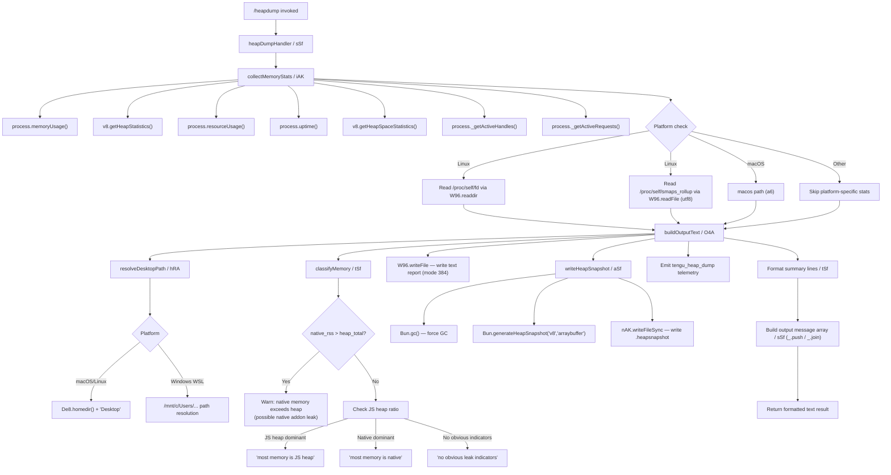

# `/heapdump`

> Analysis basis: CC v2.1.163 bundle.js (AST extraction + Claude interpretation)
> Minimum version: v2.1.163

---

## Overview

`/heapdump` is a hidden diagnostic command that captures a JavaScript heap snapshot and a rich set of memory statistics, then writes both to `~/Desktop`. It is intended for internal debugging of Claude Code's own memory footprint and targets the Bun runtime's heap introspection APIs. The command is non-interactive and emits a formatted text summary alongside the `.heapsnapshot` file.

---

## Registration

| Field | Value |
|---|---|
| type | `local` |
| name | `heapdump` |
| description | `Dump the JS heap to ~/Desktop` |
| supportsNonInteractive | `true` |
| isHidden | `true` |
| module_id | `oAK` |
| load_inline | `true` |
| loc_byte | `12578246` |
| loc_byte_end | `12578674` |
| loc_line | `9049` |
| arbor_handler.name | `sSf` |
| arbor_handler.fqn | `claude-2.1.163::sSf` |
| arbor_handler.kind | `AsyncFunction` |
| arbor_handler.resolution_path | `module_id` |
| arbor_handler.n_hits | `0` |

Analysis basis: CC v2.1.163 bundle.js:+12578246

---

## Input Branching

The command has more than three distinct internal paths (memory collection, platform-specific smaps reading, heap snapshot generation, and multi-branch memory classification), so a Mermaid flowchart is used.



---

## Behavioral Spec

### Top-level handler (`sSf`)

The Arbor-resolved handler `sSf` is an `AsyncFunction` reached via module `oAK`.

```
async function heapDumpHandler(context):
    lines = []
    result = await executeHeapDump(context)   // calls O4A
    lines.push(result.summary)
    lines.push("Open the .heapsnapshot in Chrome DevTools → Memory → Load to inspect retainers.")
    return lines.join(newline)
```

Analysis basis: CC v2.1.163 bundle.js:+12577115 (`sSf` → `O4A`), +12577261 (`_.push`), +12577383 (`_.join`)

---

### Memory statistics collection (`iAK`)

```
async function collectMemoryStats():
    stats = {}
    stats.memoryUsage      = process.memoryUsage()
    stats.heapStatistics   = v8Module.getHeapStatistics()
    stats.resourceUsage    = process.resourceUsage()
    stats.uptime           = process.uptime()
    stats.heapSpaces       = v8Module.getHeapSpaceStatistics()
    stats.activeHandles    = process._getActiveHandles().length
    stats.activeRequests   = process._getActiveRequests().length

    // Linux-only: open file descriptor count
    if platform is linux:
        fdEntries = await fsModule.readdir("/proc/self/fd")
        stats.openFds = fdEntries.length

    // Linux-only: detailed memory map
    if platform is linux:
        smapsText = await fsModule.readFile("/proc/self/smaps_rollup", "utf8")
        stats.smaps = parseSmaps(smapsText)

    // bun:jsc module loaded for JSC-specific stats
    stats.jscStats = loadBunJscModule()

    // Compute RSS-to-heap ratio; flag if native > heap
    if stats.memoryUsage.rss > stats.heapStatistics.total_heap_size:
        stats.nativeLeak = true
        stats.leakNote = "Native memory > heap - leak may be in native addons (node-pty, sharp, etc.)"

    // Uptime capped display: 3600 seconds, block size 1048576 bytes
    stats.uptimeDisplay = formatUptime(stats.uptime, maxSeconds=3600, blockSize=1048576)

    return stats
```

Analysis basis: CC v2.1.163 bundle.js:+12573278 (`process.memoryUsage`), +12573302 (`getHeapStatistics`), +12573521 (`/proc/self/fd`), +12573584 (`/proc/self/smaps_rollup`), +12573669 (`bun:jsc`), +12573810 (literal `3600`), +12573815 (literal `1048576`), +12574048 (native leak warning string)

---

### Desktop path resolution (`hRA`)

```
function resolveDesktopPath():
    home = os.homedir()                         // De8.homedir()
    desktopPath = path.join(home, "Desktop")    // G5.join + literal "Desktop"

    if platform is WSL (path contains "/mnt/c/Users"):
        // skip system accounts: Public, Default, Default User, All Users
        candidates = listWindowsUsers("/mnt/c/Users")
        filtered = candidates.filter(u => u not in ["Public","Default","Default User","All Users"])
        desktopPath = path.join("/mnt/c/Users", filtered[0], "Desktop")

    return desktopPath
```

Analysis basis: CC v2.1.163 bundle.js:+1060952 (`De8.homedir`), +1060988 (`G5.join`), +1060998 (literal `"Desktop"`), +1061220 (literal `"/mnt/c/Users"`), +1061264–+1061328 (skip-list literals)

---

### Heap snapshot generation (`aSf`)

```
async function writeHeapSnapshot(outputDir):
    // Force garbage collection before snapshotting for accurate results
    Bun.gc(true)

    // Generate V8-compatible heap snapshot as ArrayBuffer
    snapshot = Bun.generateHeapSnapshot("v8", "arraybuffer")

    // Write synchronously so the file is complete before returning
    fs.writeFileSync(path.join(outputDir, outputName), snapshot)
```

Analysis basis: CC v2.1.163 bundle.js:+12576795 (`nAK.writeFileSync`), +12576815 (`Bun.generateHeapSnapshot`), +12576840 (literal `"v8"`), +12576845 (literal `"arraybuffer"`), +12576872 (`Bun.gc`)

---

### Text report generation (`O4A`)

```
async function executeHeapDump(context):
    stats      = await collectMemoryStats()         // iAK
    desktopDir = resolveDesktopPath()               // hRA
    timestamp  = currentTimestamp()                 // Q6

    // Build tabular memory summary (K / formatTable)
    table = buildMemoryTable(stats)                 // K: L.map + f.padEnd + "  " padding

    // Serialize stats object to JSON text
    jsonText = JSON.stringify(stats)                // SH

    // Write human-readable text report (mode 0o600 = 384 decimal)
    textPath = path.join(desktopDir, "heapdump-" + timestamp + ".txt")
    await fs.writeFile(textPath, table, { mode: 384 })  // W96.writeFile

    // Emit telemetry before snapshot (so partial failures are still recorded)
    emitTelemetry("tengu_heap_dump")                // c

    // Write the binary heap snapshot
    await writeHeapSnapshot(desktopDir)             // aSf

    // Classify memory usage for user-visible hint
    classification = classifyMemory(stats)          // tSf

    // Produce error-object string if any anomaly detected
    if anomaly:
        errorStr = buildErrorString()               // HA / K$

    // Schedule follow-up background sweep if needed (kH)
    scheduleBackgroundCheck()

    return { summary: table + classification, path: textPath }
```

Analysis basis: CC v2.1.163 bundle.js:+12575777 (`O4A`→`h6`), +12575790 (`O4A`→`iAK`), +12575836 (`O4A`→`v`), +12575878 (`O4A`→`K`), +12576073 (`O4A`→`hRA`), +12576085 (`O4A`→`Q6`), +12576182 (`$4A.join`), +12576225 (`W96.writeFile`), +12576241 (`SH`), +12576260 (literal `384`), +12576316 (`O4A`→`aSf`), +12576365 (`O4A`→`c`), +12576536 (`O4A`→`HA`), +12576545 (`O4A`→`K$`), +12576623 (`O4A`→`kH`)

---

### Memory classification / summary formatter (`tSf`)

```
function classifyMemory(stats):
    nativeRss   = stats.memoryUsage.rss
    heapTotal   = stats.heapStatistics.total_heap_size
    heapUsed    = stats.memoryUsage.heapUsed
    threshold   = 1073741824   // 1 GiB

    ratio = heapUsed / nativeRss

    // Determine dominant category
    if nativeRss > heapTotal * Math.max(ratio, 1):
        category = "native"
        hint     = "— most memory is native (NOT in the .heapsnapshot)"
    elif heapUsed is primary:
        category = "js-heap"
        hint     = "— most memory is JS heap (inspect the .heapsnapshot)"
    else:
        category = "clean"
        hint     = "  (no obvious leak indicators)"

    // Column width for formatted table: 8-char padding
    lines = formatLines(stats, colWidth=8, groupRef=G96)

    return hint + "\n" + lines.join("\n")
```

Analysis basis: CC v2.1.163 bundle.js:+12577490 (`Math.max`), +12577558 (literal `"— most memory is JS heap…"`), +12577618 (literal `"— most memory is native…"`), +12577755 (literal `"  (no obvious leak indicators)"`), +12577802 (`G96`), +12577890 (literal `8`), +12578164 (literal `1073741824`)

---

### Output message assembly (`sSf` continuation)

```
// After O4A resolves:
lines = []
lines.push(result.summary)
lines.push("Open the .heapsnapshot in Chrome DevTools → Memory → Load to inspect retainers.")
// Return joined text as the command's visible output
return { type: "text", content: lines.join("\n") }
```

The inline instruction to open the snapshot in Chrome DevTools is a fixed literal included verbatim in the result.

Analysis basis: CC v2.1.163 bundle.js:+12577147 (literal `"text"`), +12577234 (`sSf`→`tSf`), +12577261 (`_.push`), +12577271 (literal `"Open the .heapsnapshot…"`), +12577383 (`_.join`)

---

## State & Side Effects

| Item | Detail |
|---|---|
| Telemetry | `tengu_heap_dump` (emitted once per invocation, bundle.js:+12576367); indirect telemetry from called subsystems: `tengu_daemon_control`, `tengu_daemon_config_reload`, `tengu_bg_retire_pinned_low_mem`, `tengu_bg_prewarm_per_sweep`, `tengu_bg_dispatch_sigkill_escalate`, `tengu_bg_dispatch_low_mem`, `tengu_bg_spare_enable`, `tengu_bg_spare_claim`, `tengu_bg_spare_claim_fail`, `tengu_bg_proto_mismatch`, `tengu_bg_dispatch_stale_drop`, `tengu_bg_attach_legacy_autorespawn`, `tengu_bg_attach`, `tengu_bg_attach_stall_gave_up`, `tengu_bg_attach_stall_respawn`, `tengu_bg_attach_kick` |
| Files written | `~/Desktop/heapdump-<timestamp>.txt` (text, mode `0o600` = `384`); `~/Desktop/heapdump-<timestamp>.heapsnapshot` (binary V8 format) |
| GC side effect | `Bun.gc(true)` is called before snapshot generation, triggering a synchronous garbage collection pass |
| Platform reads | `/proc/self/fd` (Linux only); `/proc/self/smaps_rollup` (Linux only, `utf8`) |
| Background check | `kH` is invoked after dump completion — may schedule a background memory sweep |
| Hook registration | `j9` → `MXA.register` (bundle.js:+60323); likely a process-exit or signal hook from the logging subsystem |
| appState changes | None observed in depth-2 traversal |
| Sound | None observed |

---

## Version History

| Version | Change |
|---|---|
| v2.1.163 | Initial analysis |

---

## Common Mistakes

1. **Running on non-Bun runtimes**: The command calls `Bun.generateHeapSnapshot` and `Bun.gc`, which are Bun-specific APIs. Running Claude Code under Node.js will cause an immediate runtime error at snapshot generation time.
2. **Missing Desktop directory**: On Linux systems without a `~/Desktop` directory (common in headless/server environments), `W96.writeFile` will throw `ENOENT`. The command does not create the directory automatically.
3. **Expecting Node.js `.heapsnapshot` semantics**: The snapshot is generated with `"v8"` format via the Bun API, but some V8-specific retainer chains may differ from a native Node.js `v8.writeHeapSnapshot()` output.
4. **Interpreting the native-leak warning too broadly**: The message `"Native memory > heap - leak may be in native addons (node-pty, sharp, etc.)"` fires whenever RSS exceeds `total_heap_size`, which is normal in many operating conditions. It is a hint, not a confirmed diagnosis.
5. **Forgetting the command is hidden**: `/heapdump` does not appear in `/help` output (`isHidden: true`). It must be typed exactly; tab-completion may not surface it.
6. **Assuming file permissions are user-configurable**: The text report is written with mode `384` (`0o600`, owner read/write only) unconditionally.

---

## Appendix — Identifier Mapping

> For bundle debugging only. Identifiers change across versions.

| Identifier | Role |
|---|---|
| `sSf` | Top-level async command handler (`heapDumpHandler`); Arbor-resolved entry point |
| `O4A` | Orchestrates the full heap dump: collects stats, resolves path, writes files, emits telemetry |
| `iAK` | Collects comprehensive memory statistics from Node/Bun/V8 APIs and Linux proc filesystem |
| `h6` | Utility called at the start of `O4A` and `iAK`; likely a logging or context initializer |
| `uv` | Called from `h6`; deep utility (logging or error setup) |
| `hRA` | Resolves the target Desktop directory path, with WSL-specific Windows user detection |
| `aSf` | Writes the binary `.heapsnapshot` file using `Bun.generateHeapSnapshot` and `Bun.gc` |
| `tSf` | Formats and classifies memory statistics into human-readable output lines |
| `G96` | Group/column reference used in `tSf` for table formatting |
| `K$` | Builds an error or anomaly string from memory stats |
| `Q6` | Timestamp/filename generator for output files |
| `W96` | Async filesystem module wrapper (`readdir`, `readFile`, `writeFile`) |
| `SH` | JSON serialization wrapper (calls `JSON.stringify`) |
| `kH` | Background task scheduler; may trigger a memory sweep post-dump |
| `K` | Formats the memory statistics table (maps rows, pads columns with `"  "`) |
| `c` | Telemetry emitter; fires `tengu_heap_dump` |
| `HA` | Error string builder |
| `v` | Logging/output formatter called from `O4A` |
| `ccK` | Sub-formatter or renderer within `v` |
| `OXA` | Called from `ccK`; locale or path normalization utility |
| `icK` | Log rotation / append-file manager |
| `ncK` | File append and rotation worker (mkdir, appendFile, rename) |
| `aL6` | v8 memory helper called from `icK` and `ncK` |
| `r2A` | Path join utility for log file naming |
| `i2A` | File stat and rotation renamer (handles `.txt` suffix, size limit 4 bytes sentinel) |
| `d3H` | Log flush helper (joins `KHH`, calls `a8` and `h6`) |
| `j9` | Registers a process-exit or signal hook via `MXA.register` |
| `ppH` | Output write helper (`h2A` → `H.write`) |
| `h2A` | Low-level stream write wrapper |
| `P` | Foreground session / agent runner (reached indirectly; unrelated to heapdump core) |
| `W` | MCP/SDK session manager (reached indirectly) |
| `G55` | Terminal/PTY multiplexer message handler (reached indirectly) |
| `X` | PTY/IPC stream wrapper (reached indirectly) |
| `A3A` | Vim-mode operator registry (reached indirectly via `P`) |
| `J4` | Path sanitization / basename extractor |
| `g2A` | Path map helper (`BcK.map`) |
| `EH` | Error-to-string normalizer (calls `String()`) |

---

Note: index built via Arbor fallback; some signals (telemetry, literals) may be missing — see arbor-fallback.js.