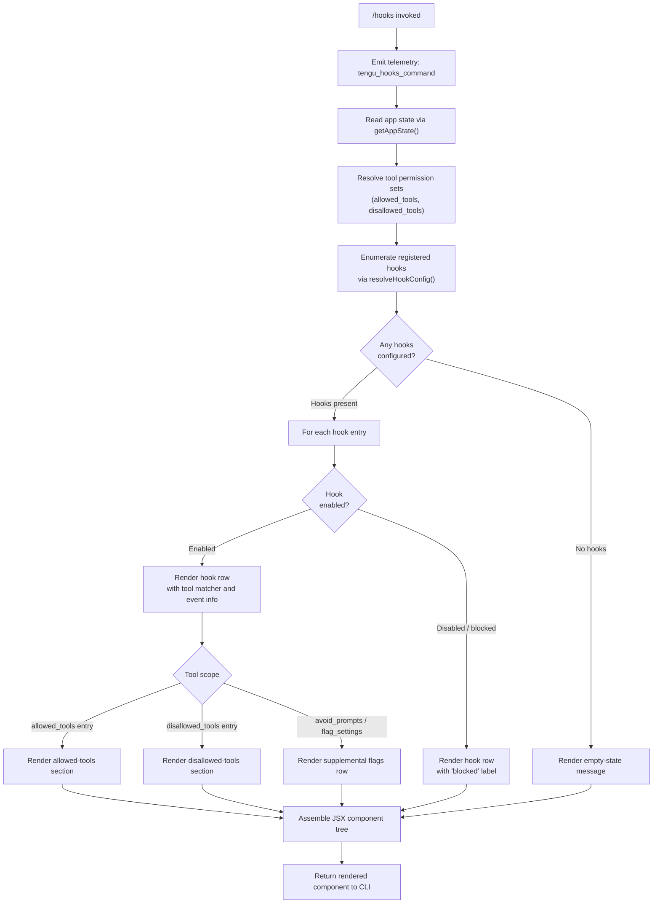

# `/hooks`

> Analysis basis: CC v2.1.163 bundle.js (AST extraction + Claude interpretation)
> Minimum version: v2.1.163

---

## Overview

The `/hooks` command displays the current hook configurations registered for tool lifecycle events within the active Claude Code session. It is a read-oriented, immediate-mode JSX command that queries application state and renders a structured view of hook definitions — covering allowed tools, disallowed tools, and event matchers — without modifying any configuration.

---

## Registration

| Field | Value |
|---|---|
| type | `local-jsx` |
| name | `hooks` |
| description | `View hook configurations for tool events` |
| immediate | `true` |
| module_id | `R8K` |
| load_inline | `true` |
| loc_byte | `12467226` |
| loc_byte_end | `12467376` |
| loc_line | `8927` |
| arbor_handler.name | `Xhf` |
| arbor_handler.fqn | `claude-2.1.163::Xhf` |
| arbor_handler.kind | `AsyncFunction` |
| arbor_handler.resolution_path | `module_id` |
| arbor_handler.n_hits | `0` |

Analysis basis: CC v2.1.163 bundle.js:+12467226

---

## Input Branching

The command has 4+ distinct display branches depending on whether hooks exist, what tool categories are present, and whether individual hooks are enabled/disabled. A Mermaid flowchart is used.



---

## Behavioral Spec

### Handler Entry Point — `hookCommandHandler` (Xhf)

Analysis basis: CC v2.1.163 bundle.js:+12467024

```
async function hookCommandHandler(context):
    emit telemetry("tengu_hooks_command")               // +12467026
    sessionInfo  = getSessionInfo(context)               // call to c, +12467024
    appState     = getAppState(context)                  // call to R_, +12467058
    hookDisplay  = buildHookDisplayComponent(appState)   // call to Av, +12467066
    element      = createElement(hookDisplay)            // gKA.createElement, +12467096
    return element
```

### App State Resolution — `resolveAppState` (R_)

Analysis basis: CC v2.1.163 bundle.js:+10915920

```
function resolveAppState(context):
    state = H.getAppState(context)                       // +10915920
    workingDir  = state["working_directory"]             // literal, +10916025
    allowedTools    = state["allowed_tools"]             // literal, +10916080
    disallowedTools = state["disallowed_tools"]          // literal, +10916135
    avoidPrompts    = state["avoid_prompts"]             // literal, +10916196
    sessionMeta     = state["session"]                   // literal, +10916495
    effortSetting   = state["effort"]                    // literal, +10916520
    modelSetting    = state["model"]                     // literal, +10916533
    maxThinkingTokens = state["max_thinking_tokens"]     // literal, +10916545
    flagSettings    = state["flag_settings"]             // literal, +10916571

    // Find last matching session entry
    lastEntry = allowedTools.findLast(predicate)         // +10916000
    if lastEntry matches:
        run mkPermissionCheck(lastEntry)                 // mk8, +10916098
        run pkPermissionCheck(lastEntry)                 // pk8, +10916156
    return assembled state object
```

### Hook Display Component Builder — `buildHookDisplayComponent` (Av)

Analysis basis: CC v2.1.163 bundle.js:+9858071

```
function buildHookDisplayComponent(appState):
    // Gather rendering primitives
    contextProvider  = buildContextProvider(appState)    // MG, +9858071
    hookRows         = []

    // Resolve hook list
    hookList = resolveHookEntries(appState)               // u1H, +9858194
    //   → iterates hook config via EI6 / YMH / fHA
    //   → YMH uses tI8.flatMap to flatten event-to-handler mappings (+10651376)

    // Check per-hook enablement
    for each hook in hookList:
        isEnabled = checkHookEnabled(hook)               // lq.isEnabled, +9858450
        if not isEnabled:
            mark hook as "blocked"                       // literal "blocked", +9857447

    // Filter by DrH set membership
    activeHooks = hookList.filter(h => not DrH.has(h))   // +9858541

    // Map each hook to a display record
    displayRecords = activeHooks.map(hookToDisplayRecord) // K.map, +9858569

    // Render sections
    mainDisplay = buildMainView(appState, displayRecords) // Zt, +9858381
    hookRows.push(mainDisplay)

    daemonControl = buildDaemonControlSection()           // z.push, +9858281
    hookRows.push(daemonControl)

    return assembleJSXTree(hookRows)
```

### Hook Configuration Resolution — `resolveHookEntries` (u1H → EI6)

Analysis basis: CC v2.1.163 bundle.js:+9857386

```
function resolveHookEntries(appState):
    filteredHooks = appState.hooks.filter(isRelevantHook) // H.filter, +9857386

    // YMH: flatten tool-event mappings
    expandedEntries = flatMapToolEventPairs(filteredHooks) // YMH, +9857401
    //   → tI8.flatMap iterates event types (+10651376)
    //   → y3 resolves tool names (+10651470)

    // fHA: apply deny/cliArg/toolsNarrowing classification
    classifiedEntries = classifyHookEntries(expandedEntries) // fHA, +10652119
    //   K$6: checks "deny" literal classification (+10651713)
    //   L$6: checks "cliArg" source (+10651763)
    //   RV:  checks "toolsNarrowing" scope (+10651818)

    // cSq: additional narrowing pass
    narrowedEntries = applyNarrowingFilter(classifiedEntries) // cSq, +10652143

    return narrowedEntries
```

### Main Hook View Renderer — `renderMainHookView` (Zt)

Analysis basis: CC v2.1.163 bundle.js:+9856742

```
function renderMainHookView(appState, displayRecords):
    headerSection = buildPermissionHeader(appState)      // V4, +9856742
    permissionPanel = buildPermissionPanel(appState)     // PP, +9856758
    //   → eH renders label element (+5351126)
    //   → ng8 formats permission badge (+5351149)

    agentSection  = buildAgentSection(appState)          // ow, +9856867
    //   → JK formats string value (+5398378)

    hookDetailView = buildHookDetailView(displayRecords) // eH, +9856960

    // yo_: build event-type sub-section
    eventTypeSection = buildEventTypeSection()           // yo_, +9857050
    //   → DEq constructs event type nodes (+9857808)
    //   → k_ handles module setup (+9857814)

    // ho_: build per-hook handler section
    handlerSection = buildHandlerSection(displayRecords) // ho_, +9857274
    //   → mC assembles hook handler entries (+9857972)
    //   → M86 formats handler badge (+9857996)

    // Platform-aware: render tool-search advisory when Vertex AI
    if platform is "vertex":
        show advisory note // literal at +6581073

    // n9: agent teams flag section
    if "--agent-teams" flag present:                     // literal, +5481138
        agentTeamsSection = buildAgentTeamsSection()     // n9, +9857091
        //  → n97 formats team entry (+5481228)

    // xN: tool-search / TST mode section
    toolSearchSection = buildToolSearchSection()         // xN, +9857342
    //   kR_: determines mode: "standard", "tst", "tst-auto"  // literals +6580060, +6580139, +6580189
    //   XA:  checks provider identity (bedrock/vertex/foundry etc.) // +6580729

    // MTq: miscellaneous additional section
    miscSection = renderMiscSection(appState)            // MTq, +9857315

    return assembleSection([
        headerSection, permissionPanel, agentSection,
        hookDetailView, eventTypeSection, handlerSection,
        agentTeamsSection, toolSearchSection, miscSection
    ])
```

### Context Provider Construction — `buildContextProvider` (MG)

Analysis basis: CC v2.1.163 bundle.js:+4793427

```
function buildContextProvider(appState):
    // Determine interface mode
    mode = appState.interfaceMode                        // cQ, +4793427
    //   "cli"    → +4793579
    //   "remote" → +4793590

    label = formatLabel(mode)                            // JK, +4793444
    //   JK coerces to String (+27205)

    hookLabel = formatHookLabel(appState)                // eH, +4793489
    //   eH coerces to String (+27055)

    emit telemetry("tengu_slate_harbor")                 // +4793609

    // Reactive subscription setup
    subscribeToStateChanges(appState)                    // D6, +4793606
    //   D6 checks yDH.has / eU.has for existing subscriptions
    //   D6 uses S6 to schedule Date.now-based timed re-renders (+3258689)

    return contextProviderObject
```

### Daemon Control Section — `buildDaemonControlSection` (z → hH / RH / Yh / Tp)

Analysis basis: CC v2.1.163 bundle.js:+16170182

```
function buildDaemonControlSection():
    stopHandler   = createDaemonStopHandler()            // hH, +16170182
    //   → emits "daemon_stop" on success (+16170185)
    //   → emits "daemon_stop_failed" on error (+16170222)

    failHandler   = createDaemonFailHandler()            // RH, +16170205

    controlWidget = createDaemonControlWidget()          // Yh, +16170257
    //   → Au builds subscription wrapper (+3231858)
    //   → QNH formats control prompt (+3231950) via zh (+3230502)
    //   → $X_ emits to session event bus (H.emit, +3231601)
    //   → marks party as "firstParty" (+3231954)
    //   → emits telemetry "tengu_daemon_control" (+16170260)

    shutdownSequence = buildShutdownSequence()           // Tp, +16170311
    //   → Promise.race / Promise.all for ordered teardown
    //   → Ac: KLH.shutdown (+3231335)
    //   → fc: clearTimeout cleanup (+3268598)
    //   → l8: setTimeout-based abort with 500ms limit // literal +16165303
    //         "aborted" string (+2293656)
    //   → process.exit on final termination (+16165342)

    return assembledDaemonControl
```

### Permission Check Helpers — `mkPermissionCheck` (mk8) / `pkPermissionCheck` (pk8)

Analysis basis: CC v2.1.163 bundle.js:+10909120

```
function mkPermissionCheck(entry):
    result = L1(entry)                                   // L1, +10909120
    return result

function pkPermissionCheck(entry):
    result = L1(entry)                                   // L1, +10909268
    return result
```

Both helpers delegate to the same internal permission-resolution function `L1`, which performs the canonical permission lookup against the session's tool access lists.

---

## State & Side Effects

| Item | Detail |
|---|---|
| Telemetry: `tengu_hooks_command` | Emitted at handler entry point (bundle.js:+12467026) |
| Telemetry: `tengu_slate_harbor` | Emitted during context provider construction in `MG` (bundle.js:+4793609) |
| Telemetry: `tengu_daemon_control` | Emitted when daemon control widget is interacted with via `Yh` (bundle.js:+16170260) |
| Telemetry: `tengu_daemon_config_reload` | Emitted on daemon configuration reload (bundle.js:+16148704) |
| Telemetry: `tengu_feature_ok` | Emitted on successful feature check (bundle.js:+1010222) |
| Telemetry: `tengu_feature_sad` | Emitted on feature check requiring attention (bundle.js:+1010365) |
| Telemetry: `tengu_feature_bad` | Emitted on failed feature check (bundle.js:+1010284) |
| Telemetry: `tengu_workflows_enabled` | Emitted when workflows flag is active (bundle.js:+4179973) |
| Telemetry: `tengu_cobalt_ridge` | Emitted from platform-aware hook rendering section (bundle.js:+4910211) |
| Telemetry: `tengu_amber_flint` | Emitted in agent-teams hook path (bundle.js:+5481250) |
| appState changes | None — `/hooks` is a read-only command; no writes to appState observed |
| Hook registration | None — command reads hook config; does not register new hooks |
| Reactive subscriptions | `D6` subscribes to state changes for re-render; uses `Date.now`-based scheduling via `S6` (bundle.js:+3258689) |
| Daemon interaction | Daemon control section (`Yh` / `Tp`) can initiate shutdown via `KLH.shutdown` and `process.exit` if user activates the control widget (bundle.js:+16165342) |
| Sound | <!-- TODO: not found in depth-2 traversal; needs --depth 4 --> |

---

## Version History

| Version | Change |
|---|---|
| v2.1.163 | Initial analysis |

---

## Common Mistakes

1. **Expecting configuration editing**: `/hooks` is a read-only viewer. It does not create, modify, or delete hook definitions. Users who want to configure hooks must edit the Claude Code settings files directly.
2. **Invoking in sessions without hook configurations**: The command renders an empty-state view rather than an error when no hooks are registered. This is expected behavior, not a bug.
3. **Confusing `immediate: true` with synchronous rendering**: The handler (`Xhf`) is an `AsyncFunction`; `immediate` controls whether the CLI displays the result without waiting for further user confirmation, not whether the implementation is synchronous.
4. **Expecting tool-search advisory on all platforms**: The Vertex AI tool-search advisory message (literal at bundle.js:+6581073) is conditional on the detected provider being `"vertex"`. It does not appear for `bedrock`, `foundry`, `anthropicAws`, `mantle`, or the default Anthropic API endpoint.
5. **Assuming daemon control is always passive**: The daemon control widget rendered by `/hooks` includes an interactive shutdown sequence. Activating it triggers `process.exit` (bundle.js:+16165342). This is not a display-only element.

---

## Appendix — Identifier Mapping

> For bundle debugging only. Identifiers change across versions.

| Identifier | Role |
|---|---|
| `Xhf` | Main async handler for `/hooks` command (arbor_handler) |
| `c` | Session/context initialization helper |
| `R_` | App state resolver (`resolveAppState`) |
| `H` | App state host object / event emitter |
| `v` | Log/debug utility (uses `"debug"` literal) |
| `ccK` | Log formatting helper |
| `SH` | JSON serialization wrapper (`JSON.stringify`) |
| `J4` | String path/segment manipulation helper |
| `ppH` | Prompt body helper (`h2A` dependency) |
| `icK` | File I/O / buffer utility (uses `Buffer.byteLength`) |
| `e$` | Auxiliary state accessor |
| `Pw_` | String splitting/trimming parser |
| `q` | File system operations object (unlinkSync, etc.) |
| `ZHH` | Set membership checker (`g44.has`) |
| `uj` | String replacement utility |
| `t1` | Token/model name normalizer |
| `D6H` | Model resolution sub-helper |
| `Aq` | Model alias normalizer (opusplan/sonnet/haiku/opus/best) |
| `eX` | Extended model alias resolver |
| `s6` | Supplemental context builder |
| `P6` | Inner context sub-builder (`Nu6` dependency) |
| `A` | Async resource / stream-like object |
| `f` | Connection/session resource (close/open operations) |
| `L` | Resource lifecycle manager (add/delete/finally) |
| `mk8` | Allowed-tools permission check helper (delegates to `L1`) |
| `L1` | Core permission resolution function |
| `pk8` | Disallowed-tools permission check helper (delegates to `L1`) |
| `Av` | Hook display component builder (main JSX assembly) |
| `MG` | Context provider constructor |
| `cQ` | Interface mode detector |
| `JK` | String coercion label formatter |
| `eH` | String coercion element formatter |
| `D6` | Reactive state subscription manager |
| `Hj6` | Subscription helper A |
| `_j6` | Subscription helper B |
| `qu` | Subscription wrapper (`Au` dependency) |
| `B98` | Deduplication tracker (zX_ set operations) |
| `S6` | Timed re-render scheduler (`Date.now`-based) |
| `Y` | Supervisor/daemon output writer |
| `C0H` | Hook entry formatter (handles ENOENT) |
| `N9` | Async local storage accessor (`FZL.getStore`) |
| `v8` | Hook value extractor |
| `w7A` | Hook display adapter (`D7A` dependency) |
| `EH` | String coercion display helper |
| `K` | Column layout helper (padEnd/map) |
| `iLK` | Column width calculator (`Math.max`) |
| `E` | Keyboard/input event handler |
| `b` | Event object (preventDefault) |
| `t0` | User-settings state accessor |
| `T` | Spinner/progress indicator controller |
| `LmK` | Heartbeat manager (`L8H` dependency) |
| `L8H` | Heartbeat inner helper |
| `V` | Secondary progress indicator |
| `yo_` | Event-type section builder |
| `k_` | Module bootstrap / ES-module setup helper |
| `Zu6` | Bound callback helper |
| `OP` | Workflow / feature-flag panel builder |
| `Q78` | Feature-flag query helper |
| `nT` | Feature-flag renderer |
| `iL9` | Workflow enablement resolver |
| `W9` | Workflow condition checker |
| `WT_` | Workflow renderer |
| `yBL` | Workflow detail builder |
| `kBL` | Workflow badge renderer |
| `u1H` | Hook entry list resolver (filter + classify) |
| `EI6` | Hook entry classifier dispatcher |
| `YMH` | Tool-event pair flattener (`tI8.flatMap`) |
| `fHA` | Hook classification applier (deny/cliArg/toolsNarrowing) |
| `cSq` | Narrowing filter pass |
| `ho_` | Per-hook handler section builder |
| `mC` | Hook handler entry assembler |
| `V4` | Permission header builder |
| `z` | Daemon control section array |
| `hH` | Daemon stop success handler |
| `RH` | Daemon stop failure handler |
| `Yh` | Daemon control widget builder |
| `Au` | Subscription wrapper factory |
| `QNH` | Control prompt formatter |
| `$X_` | Session event emitter |
| `Tp` | Daemon shutdown sequence orchestrator |
| `Ac` | KLH shutdown invoker |
| `fc` | Timeout cleanup helper |
| `l8` | Abort-with-timeout helper (500ms) |
| `Zt` | Main hook view renderer (sections assembly) |
| `PP` | Permission panel builder |
| `ng8` | Permission badge formatter |
| `ow` | Agent section string formatter |
| `Y_6` | Hook detail sub-section builder |
| `n9` | Agent-teams flag section builder |
| `n97` | Agent-teams entry formatter |
| `z8f` | Event sub-section variant A (`nGq` + `k_`) |
| `Y8f` | Event sub-section variant B (`tGq` + `k_`) |
| `xN` | Tool-search / TST mode section builder |
| `kR_` | TST mode resolver (standard/tst/tst-auto) |
| `XA` | Provider identity checker (bedrock/vertex/etc.) |
| `Hf` | Tool-search advisory display helper |
| `C4` | Supplemental capability checker |
| `O` | Secondary enablement checker |
| `b8` | Background session detector |
| `$` | Output stream / terminal writer |
| `TKK` | Terminal output compositor |
| `nr` | Output line builder (`L4H` dependency) |
| `JR6` | Daemon status file path builder (`daemon.status.json`) |

---

Note: index built via Arbor fallback; some signals (telemetry, literals) may be missing — see arbor-fallback.js.