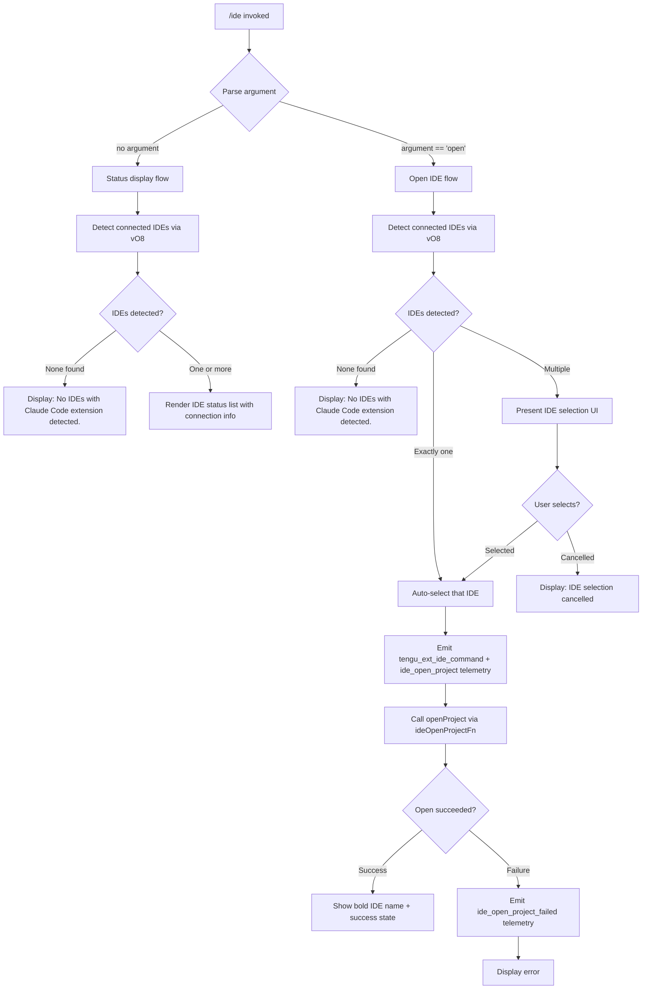

# `/ide`

> Analysis basis: CC v2.1.163 bundle.js (AST extraction + Claude interpretation)
> Minimum version: v2.1.163

---

## Overview

The `/ide` command manages IDE integrations for Claude Code, enabling the user to detect connected IDE instances (VS Code, Cursor, Windsurf, JetBrains IDEs, etc.), display their current connection status, and optionally open the current project in a selected IDE. When invoked with the `open` argument, it attempts to launch or focus the IDE and establish an extension connection.

---

## Registration

| Field | Value |
|---|---|
| type | `local-jsx` |
| name | `ide` |
| description | `Manage IDE integrations and show status` |
| argumentHint | `[open]` |
| module_id | `rgq` |
| load_inline | `true` |
| loc_byte | `11554553` |
| loc_byte_end | `11554709` |
| loc_line | `7529` |
| arbor_handler.name | `Y2f` |
| arbor_handler.fqn | `claude-2.1.163::Y2f` |
| arbor_handler.kind | `AsyncFunction` |
| arbor_handler.resolution_path | `module_id` |
| arbor_handler.n_hits | `0` |

Analysis basis: CC v2.1.163 bundle.js:+11554553

---

## Input Branching

The command has four distinct execution branches based on the argument provided and the state of detected IDEs.



---

## Behavioral Spec

### Top-Level Handler (`Y2f`)

The Arbor-resolved handler `Y2f` is an `AsyncFunction` reached via `module_id` resolution from module `rgq`.

Analysis basis: CC v2.1.163 bundle.js:+11550669

```
async function ideCommandHandler(args, context):
    // Record command invocation
    emit telemetry: tengu_ext_ide_command

    // Parse the first argument
    subcommand = args.trim().toLowerCase()

    // Retrieve currently connected IDE list
    ideList = await detectConnectedIDEs()   // vO8

    if subcommand == "open":
        return await handleOpenIDE(ideList, context)
    else:
        return renderIDEStatus(ideList, context)
```

Analysis basis: CC v2.1.163 bundle.js:+11550791

---

### IDE Detection (`vO8`)

Scans for running IDE processes and validates which ones have the Claude Code extension active.

Analysis basis: CC v2.1.163 bundle.js:+5415649

```
async function detectConnectedIDEs():
    // Step 1: Enumerate candidate IDE paths from known locations
    candidatePaths = await enumerateCandidateIDEPaths()  // NO8 + c17

    // Step 2: For each candidate, check process is alive and extension socket exists
    results = await Promise.all(
        candidatePaths.map(path => resolveIDEEntry(path))   // Q17
    )

    // Step 3: Filter to only live connections
    liveIDEs = results.filter(entry => entry != null)

    if liveIDEs.length == 0:
        emit telemetry: ide_detect (no results)
        return []

    emit telemetry: ide_detect

    // Step 4: Normalize display names
    for ide in liveIDEs:
        ide.displayName = normalizeIDEName(ide)   // sW / iT9 / IO8

    return liveIDEs
```

Analysis basis: CC v2.1.163 bundle.js:+5415698

---

### IDE Path Enumeration (`NO8` + `c17`)

Discovers candidate IDE socket/config directories under the user's home directory and known system paths. On Linux, falls back to scanning running processes with a `ps aux` grep for known IDE binary names (pattern includes: `code`, `cursor`, `windsurf`, `devin-desktop`, `idea`, `pycharm`, `webstorm`, `phpstorm`, `rubymine`, `clion`, `goland`, `rider`, `datagrip`, `dataspell`, `aqua`, `gateway`, `fleet`, `android-studio`).

Analysis basis: CC v2.1.163 bundle.js:+5412203 (c17), +5412222 (NO8)

```
async function enumerateCandidateIDEPaths():
    baseDirs = [homedir(), knownIDESocketDirs]

    // WSL: also check /mnt/c/Users paths, excluding Public, Default, Default User, All Users
    if platform == "wsl":
        wslPaths = listWindowsUserDirs("/mnt/c/Users").filter(not in excludedNames)
        baseDirs.push(...wslPaths)

    candidates = []
    for dir in baseDirs:
        subDirs = await readdir(dir)
        for sub in subDirs:
            if sub contains ".claude" or "ide" marker:
                candidates.push(join(dir, sub))

    // Linux fallback: ps aux grep
    if platform == "linux":
        processList = await runShellCommand(PS_AUX_GREP_PATTERN)
        candidates.push(...parseProcPaths(processList))

    return candidates
```

Analysis basis: CC v2.1.163 bundle.js:+5413442, +5420374

---

### IDE Name Normalization (`iT9`, `IO8`, `sW`)

Maps raw process names / socket paths to canonical display names. Known recognized values (from literals):

| Raw token | Canonical name |
|---|---|
| `windsurf` | Windsurf |
| `devin` / `Devin Desktop` | Devin |
| `cursor` | Cursor |
| `insiders` | VS Code Insiders |
| `vscode` / `vs code` / `visual studio code` | VS Code |
| `vscodium` / `codium` / `code - oss` | VSCodium |
| JetBrains family: `idea`, `pycharm`, etc. | respective JetBrains IDE |
| `appcode` | AppCode |

Analysis basis: CC v2.1.163 bundle.js:+5418444, +5418887, +5421268

```
function normalizeIDEName(rawName):
    lower = rawName.toLowerCase()
    if lower.includes("windsurf"): return "Windsurf"
    if lower.includes("devin"): return "Devin"
    if lower.includes("cursor"): return "Cursor"
    if lower.includes("insiders"): return "VS Code Insiders"
    if lower.includes("vscode") or lower.includes("vs code") or lower.includes("visual studio code"):
        return "VS Code"
    if lower.includes("vscodium") or lower.includes("codium") or lower.includes("code - oss"):
        return "VSCodium"
    if lower.includes("jetbrains") or lower.includes("idea") or ...:
        return resolveJetBrainsName(lower)
    return basename(rawName)  // fallback
```

Analysis basis: CC v2.1.163 bundle.js:+5418474

---

### Status Display Flow (no argument)

Renders a JSX component listing all detected IDEs, their connection protocol (SSE `sse-ide` or WebSocket `ws-ide`), and current status.

Analysis basis: CC v2.1.163 bundle.js:+11550884

```
function renderIDEStatus(ideList):
    if ideList.length == 0:
        return StaticText("No IDEs with Claude Code extension detected.")

    rows = ideList.map(ide => {
        protocol = ide.connectionType  // "sse-ide" or "ws-ide"
        status   = ide.connectionStatus
        return IDEStatusRow(ide.displayName, protocol, status)
    })
    return IDEStatusPanel(rows)
```

Analysis basis: CC v2.1.163 bundle.js:+11550886

---

### Open IDE Flow (`handleOpenIDE`)

When `open` is passed, selects an IDE (or prompts the user when multiple are available) and calls the IDE open-project function.

Analysis basis: CC v2.1.163 bundle.js:+11550777, +11551057, +11551079

```
async function handleOpenIDE(ideList, context):
    if ideList.length == 0:
        return StaticText("No IDEs with Claude Code extension detected.")

    if ideList.length == 1:
        selectedIDE = ideList[0]
    else:
        selectedIDE = await promptUserToSelectIDE(ideList)
        if selectedIDE == null:
            emit telemetry: ide_disconnect (cancelled)
            return StaticText("IDE selection cancelled")

    // Attempt to open the project
    projectPath = context.workingDirectory
    ideBasename = path.basename(selectedIDE.executablePath)  // Yh8.basename

    emit telemetry: ide_open_project  { type: "worktree" or "project" }

    try:
        await openProjectInIDE(selectedIDE, projectPath)     // lh_  → t17
        renderResult = bold(selectedIDE.displayName) + " opened"
    catch error:
        emit telemetry: ide_open_project_failed
        renderResult = formatError(error)

    // Hint to restart IDE extension if needed
    if extensionNotResponding:
        hint = "restart your IDE"

    return renderResult
```

Analysis basis: CC v2.1.163 bundle.js:+11551219, +11551283, +11551329

---

### Open Project Implementation (`t17` via `lh_`)

Builds the shell command to open the project directory in the target IDE. Uses `tP` / `bTH` to spawn a subprocess.

Analysis basis: CC v2.1.163 bundle.js:+5419452, +5419486

```
async function openProjectInIDE(ide, projectPath):
    args = buildIDEOpenArgs(ide, projectPath)

    // Platform-specific command path (e.g. .cmd suffix on Windows)
    execPath = resolveIDEExecutable(ide)   // checks .cmd extension
    if platform == "windows":
        execPath = execPath + ".cmd"

    // Filter applicable flags
    filteredArgs = args.filter(a => isValidFlag(a))

    // Spawn the IDE process
    result = await spawnProcess(execPath, filteredArgs)   // tP → bTH
    return result
```

Analysis basis: CC v2.1.163 bundle.js:+5419778, +5419850, +5419057

---

### IDE Connection Component (`igq`)

The JSX rendering component that manages real-time IDE connection state. Uses React hooks (`useState`, `useRef`, `useEffect`, `useCallback`) to track connection lifecycle.

Analysis basis: CC v2.1.163 bundle.js:+11552555

```
function IDEConnectionComponent(props):
    [connectionState, setConnectionState] = useState(null)
    appState = useAppState()      // M6 / qA → jG_
    ideRef   = useRef(null)

    useEffect(() => {
        // Establish connection via WebSocket ("ws:") or SSE
        if ide.url.startsWith("ws:"):
            protocol = "ws-ide"
        else:
            protocol = "sse-ide"

        connect(protocol, ide)    // mk → $A6
        
        on connect success: emit telemetry ide_connect
        on connect failure: emit telemetry ide_connect_failed
        on connect timeout: emit telemetry ide_connect_timeout

    }, [ide])

    // Filter MCP tools prefixed "mcp__ide__"
    ideTools = appState.tools.filter(t => t.startsWith("mcp__ide__"))

    // If connecting, show "Connecting to <url>"
    // If failed, show "Error connecting to IDE."
    // If connected, show IDE tool list

    useCallback(onDisconnect => {
        emit telemetry: ide_disconnect
    }, [])

    return render connection status UI
```

Analysis basis: CC v2.1.163 bundle.js:+11552769, +11552842, +11552928, +11553054, +11553362, +11553802

---

## State & Side Effects

| Item | Detail |
|---|---|
| Telemetry: `tengu_ext_ide_command` | Fired at the start of every `/ide` invocation (bundle.js:+11550671) |
| Telemetry: `ide_detect` | Fired after IDE detection completes (bundle.js:+5417004) |
| Telemetry: `ide_detect_failed` | Fired when IDE detection encounters an error (bundle.js:+5417068) |
| Telemetry: `ide_open_project` | Fired when the open-project action is attempted; includes `worktree`/`project` type (bundle.js:+11551222) |
| Telemetry: `ide_open_project_failed` | Fired when opening the project fails (bundle.js:+11551329) |
| Telemetry: `ide_connect` | Fired on successful IDE extension connection (bundle.js:+11552772) |
| Telemetry: `ide_connect_failed` | Fired on connection failure (bundle.js:+11552859) |
| Telemetry: `ide_connect_timeout` | Fired when the connection attempt times out (bundle.js:+11552966) |
| Telemetry: `ide_disconnect` | Fired on disconnection or cancellation (bundle.js:+11553465) |
| MCP tool prefix filter | Tools beginning with `"mcp__ide__"` are filtered and displayed (bundle.js:+11553362) |
| Protocol negotiation | Selects `"sse-ide"` or `"ws-ide"` based on connection URL prefix `"ws:"` (bundle.js:+11553582, +11548656, +11548676) |
| Process spawn side effect | On `open`, spawns the IDE executable as a child process via `bTH`; on Windows adds `.cmd` suffix (bundle.js:+5419057) |
| User hint | When extension is unresponsive: hints `"restart your IDE"` (bundle.js:+11551887) |
| appState changes | IDE connection state is reflected via `useSyncExternalStore` in the React component (bundle.js:+11552575) |
| Sound | None observed in depth-2 traversal |

---

## Version History

| Version | Change |
|---|---|
| v2.1.163 | Initial analysis |

---

## Common Mistakes

1. **Invoking `/ide open` when no IDE is running**: The command cannot open an IDE from scratch if no Claude Code extension is detected. Ensure the IDE is already running with the Claude Code extension installed and active before using `open`.
2. **Multiple IDEs detected without expecting a prompt**: If more than one IDE with the extension is running, `/ide open` will show a selection prompt. Close extra IDE instances to skip the selection step.
3. **WebSocket vs. SSE confusion**: The command automatically selects the protocol based on the URL; do not manually prefix the IDE URL — the extension handles protocol negotiation.
4. **WSL users with `/mnt/c/Users` paths**: The command enumerates Windows user directories but skips system accounts (`Public`, `Default`, `Default User`, `All Users`). If your Windows user profile has a non-standard name it may still be found, but ensure the Claude Code extension is installed in the Windows-side IDE.
5. **Platform-specific executable path**: On Windows, the IDE launcher is invoked with a `.cmd` extension. If the extension is installed but the `.cmd` file is missing from `PATH`, the open action will fail with `ide_open_project_failed`.

---

## Appendix — Identifier Mapping

> For bundle debugging only. Identifiers change across versions.

| Identifier | Role |
|---|---|
| `WAA` | Top-level command entry / wrapper that parses args and calls handler |
| `Y2f` | Main async handler for `/ide` command (Arbor-resolved) |
| `vO8` | IDE detection function — enumerates IDEs and their connection states |
| `NO8` | Bulk IDE candidate path resolver using filesystem traversal |
| `c17` | Per-directory IDE socket/config scanner; handles WSL user exclusions |
| `iT9` | IDE name check: tests for Windsurf, Devin, Cursor, VS Code variants |
| `IO8` | IDE name normalization: JetBrains / VSCodium / fallback resolution |
| `sW` | IDE basename normalizer; calls `Q1` for string slicing |
| `Q17` | Per-IDE entry resolution wrapper |
| `ef_` | Process entry parser; uses `parseInt` and `isNaN` for PID extraction |
| `S_` | Subprocess execution helper used for process interrogation |
| `lh_` | Open-project dispatch: routes to `t17` |
| `t17` | Builds and spawns the IDE open command; applies platform arg filtering |
| `tP` | Process-spawn wrapper delegating to `bTH` |
| `bTH` | Core subprocess spawner with stdio configuration |
| `igq` | React JSX component for IDE connection UI |
| `M6` | App-state hook (`useAppState`) |
| `qA` | App-state context accessor |
| `jG_` | React context consumer for app-state provider |
| `Ef` | External store subscription hook for reactive IDE status |
| `mk` | MCP/IDE connection initiator |
| `$A6` | Connection factory — routes to SSE or WebSocket protocol |
| `VXH` | Protocol hash/config builder for connection |
| `FN` | MCP tool registration helper used by IDE connection |
| `aq9` | URL pattern matcher (regex match on connection string) |
| `dT9` | Process kill helper (used in cleanup) |
| `rT9` | String replacement utility for path normalization |
| `b6` | Async utility / promise helper used in detection |
| `bd6` | Store-access helper (`Cd6.getStore`) |
| `X_` | Low-level utility called by detection path |
| `uv` | Underlying primitive called by `X_` and `h6` |
| `h6` | Utility wrapper calling `uv` |
| `hH` | Logger / notification helper |
| `RH` | Error reporter / logger |
| `eH` | String coercion helper |
| `kH` | JSX rendering helper with error boundary |
| `v8` | Error classification helper |
| `R8` | Error handler (ENOENT suppressor) |
| `s1` | Filesystem error filter |
| `Q6` | Async filesystem stat/read utility |
| `a6` | Logger utility |
| `Q1` | String index/slice utility |
| `G` | Platform/OS detection object |
| `sk6` | Platform string getter |
| `XK6` | Secondary platform string getter |
| `VO8` | IDE open result display component |
| `L2f` | Supplemental list rendering component |
| `As` | Formatting / display helper for IDE info |
| `Kk` | UI primitive (likely a text/box component) |
| `XM` | Context or config accessor used at handler start |
| `C8` | Subprocess result handler |
| `b8` | Background service handle |
| `O` | App state accessor used by `igq` |

---

Note: index built via Arbor fallback; some signals (telemetry, literals) may be missing — see arbor-fallback.js.