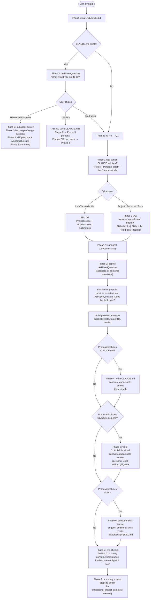

# `/init`

> Analysis basis: CC v2.1.163 bundle.js (AST extraction + Claude interpretation)
> Minimum version: v2.1.163

---

## Overview

The `/init` command bootstraps a repository's Claude Code configuration by generating one or more `CLAUDE.md` files (project-level, personal, or both), optional skills stored under `.claude/skills/`, and optional lifecycle hooks in `.claude/settings.json` or `.claude/settings.local.json`. It follows an eight-phase interactive workflow: it first inspects the existing state of the repo, asks the user what to set up, surveys the codebase with a subagent, fills in any gaps via a structured interview, writes the requested artifacts in sequence, performs additional environment checks (GitHub CLI, linting), and finally presents a summary with next-step recommendations.

---

## Registration

| Field | Value |
|---|---|
| type | `prompt` |
| name | `init` |
| description | `Initialize new CLAUDE.md file(s) and optional skills/hooks with codebase documentation \| Initialize a new CLAUDE.md file with codebase documentation` |
| loc_byte | `11577892` |
| loc_byte_end | `11578285` |
| loc_line | `7771` |
| handler_method | `getPromptForCommand` |
| handler_method_start | `11578208` |
| handler_method_end | `11578284` |
| prompt_body.length | `22519` characters |
| prompt_body.trace | `conditional; identifier→J2f (var template, 20920 chars); identifier→j2f (var template, 1592 chars)` |
| arbor_handler.name | `getPromptForCommand` |
| arbor_handler.fqn | `claude-2.1.163::getPromptForCommand` |
| arbor_handler.kind | `Method` |
| arbor_handler.resolution_path | `direct` |
| arbor_handler.n_hits | `2` |

Analysis basis: CC v2.1.163 bundle.js:+11577892

---

## Input Branching

The command has more than three distinct behavioral branches depending on: (a) whether `CLAUDE.md` already exists, (b) the user's Phase 0 choice, (c) which file scope the user selects (project / personal / both / let-Claude-decide), (d) whether skills and/or hooks are requested, and (e) git-worktree topology. A flowchart is required.



Analysis basis: CC v2.1.163 bundle.js:+11577892 (prompt body), +4024516 (telemetry event)

---

## Behavioral Spec

### Phase 0 — Existing-file detection

```
function checkForExistingClaudeMd():
    output = shell("cat ./CLAUDE.md")   // project root only; no tree traversal yet
    if output is readable file content:
        return EXISTS
    else:
        return NOT_FOUND
```

The check is intentionally narrow: only the project-root `CLAUDE.md` counts. The prompt explicitly prohibits exploring the directory tree at this point.

Analysis basis: CC v2.1.163 bundle.js:+11577892

---

### Phase 1 — User intent elicitation

```
function elicitIntent(existenceStatus):
    printPrimer()       // terminology explanation for CLAUDE.md, Skills, Hooks

    if existenceStatus == EXISTS:
        choice = AskUserQuestion("I found an existing CLAUDE.md. What would you like to do?",
                                 options=["Review and improve it",
                                          "Leave it, set up other things",
                                          "Start fresh (replace it)"])
        return routeExistingFile(choice)

    // No file, or user chose "Start fresh"
    q1 = AskUserQuestion("Which CLAUDE.md files should /init set up?",
                         options=["Project CLAUDE.md",
                                  "Personal CLAUDE.local.md",
                                  "Both project + personal",
                                  "Let Claude decide"])

    if q1 == "Let Claude decide":
        return Scope(files=["project"], skillsHooksHint=UNCONSTRAINED)

    q2 = AskUserQuestion("Also set up skills and hooks?",
                         options=["Skills + hooks", "Skills only",
                                  "Hooks only", "Neither, just CLAUDE.md"])
    return Scope(files=q1, skillsHooksHint=q2)
```

**Key constraint**: Q1 and Q2 must be issued in separate `AskUserQuestion` calls; they must never be combined. If the user selects "Let Claude decide", Q2 is skipped entirely.

Analysis basis: CC v2.1.163 bundle.js:+11577892

---

### Phase 2 — Codebase survey (subagent)

```
function surveyCodebase():
    launch subagent to read:
        manifests = ["package.json", "Cargo.toml", "pyproject.toml",
                     "go.mod", "pom.xml", ...]
        docFiles  = ["README", "Makefile", "CI config"]
        aiToolConfigs = ["AGENTS.md", ".cursor/rules", ".cursorrules",
                         ".github/copilot-instructions.md",
                         ".devin/rules/", ".windsurf/rules/",
                         ".windsurfrules", ".clinerules", ".mcp.json"]
        claudeFiles = ["./CLAUDE.md", ".claude/rules/", ".claude/skills/"]

    detect:
        buildTestLintCommands     // especially non-standard ones
        languages, frameworks, packageManager
        projectStructure          // monorepo | multi-module | single
        codeStyleRulesDiffFromDefault
        nonObviousGotchas, requiredEnvVars
        formatterConfig           // prettier, biome, ruff, black, gofmt, rustfmt, etc.
        worktrees = shell("git worktree list")

    noteUnansweredQuestions()     // become Phase 3 interview items
```

Analysis basis: CC v2.1.163 bundle.js:+11577892

---

### Phase 3 — Gap-fill interview and proposal synthesis

```
function gapFillInterview(scope, surveyResults):
    questions = deriveQuestions(scope, surveyResults)
    // Only ask what code cannot answer
    // Do not mark any option as "recommended"

    if scope.files includes "project" or scope == UNCONSTRAINED:
        askAbout(buildCommands, gotchas, branchConventions,
                 requiredEnvSetup, testingQuirks)

    if scope.files includes "personal":
        askAbout(userRole, codebaseFamiliarity, sandboxURLs,
                 worktreeTopology,  // only if multiple worktrees found
                 communicationPreferences)

    answers = collectAnswers(questions)
    proposal = synthesizeProposal(surveyResults, answers, scope)

    // Classify each artifact
    for item in proposal:
        if isDeterministicFastShellCommand(item):
            classify as HOOK
        elif isOnDemandMultiStepWorkflow(item):
            classify as SKILL
        else:
            classify as CLAUDE_MD_NOTE

    printProposal(proposal)   // assistant text, one bullet per item
    // Format: "Here's what I'd set up: • [Artifact type] — [one-line description]"

    confirmation = AskUserQuestion("Does this look right?",
                                   options=["Looks good — proceed",
                                            "Drop the hook", "Drop the skill", ...])

    preferenceQueue = buildQueue(confirmedProposal)
    return preferenceQueue
```

The proposal **must not** use the `preview` field of `AskUserQuestion`; the proposal text is already visible in scrollback.

Analysis basis: CC v2.1.163 bundle.js:+11577892

---

### Phase 4 — Write `CLAUDE.md`

```
function writeClaudeMd(surveyResults, preferenceQueue, existingFileMode):

    if existingFileMode == REVIEW_AND_IMPROVE:
        existing = readFile("./CLAUDE.md")
        diffs = computeDiffs(existing, surveyResults, phase3LiteAnswer)
        printDiffs(diffs)  // one-line reason per diff
        approval = AskUserQuestion("Apply these edits?",
                                   options=["Apply all", "Let me pick which",
                                            "Skip — leave it as is"])
        if approval != SKIP:
            applyApprovedDiffs("./CLAUDE.md")
        return

    content = buildMinimalContent(surveyResults)
    // Every line must pass: "Would removing this cause Claude to make mistakes?"

    content.include(nonStandardBuildTestLintCommands)
    content.include(codeStyleRulesDifferingFromDefaults)
    content.include(testingInstructionsAndQuirks)
    content.include(repoEtiquette)
    content.include(requiredEnvVarsOrSetupSteps)
    content.include(nonObviousGotchas)
    content.include(importantPartsFromAIToolConfigs)

    content.exclude(fileByFileStructureLists)
    content.exclude(standardLanguageConventions)
    content.exclude(genericAdvice)
    content.exclude(frequentlyChangingDetails)  // use @path/to/import instead
    content.exclude(longTutorials)              // move to skill or separate file

    noteEntries = preferenceQueue.drain(type=NOTE, target="CLAUDE.md")
    content.append(noteEntries)

    prefix = "# CLAUDE.md\n\nThis file provides guidance to Claude Code " +
             "(claude.ai/code) when working with code in this repository.\n"
    writeFile("./CLAUDE.md", prefix + content)

    if hasMultipleConcerns:
        suggestDotClaudeRulesOrganisation()     // .claude/rules/ with scoped paths frontmatter
    if isMonorepoOrMultiModule:
        offerSubdirectoryClaudeMdFiles()
```

Analysis basis: CC v2.1.163 bundle.js:+11577892

---

### Phase 5 — Write `CLAUDE.local.md`

```
function writeClaudeLocalMd(surveyResults, preferenceQueue, worktreeInfo):

    if worktreeInfo.hasMultipleWorktrees:
        topology = worktreeInfo.topology  // nested | sibling/external
    else:
        topology = NESTED  // default; no special handling needed

    if topology == SIBLING_OR_EXTERNAL:
        homeFile = "~/.claude/<project-name>-instructions.md"
        writeFile(homeFile, personalContent)
        localMdContent = "@" + homeFile   // one-line import stub
        // NOTE: never put this import in project CLAUDE.md
    else:
        noteEntries = preferenceQueue.drain(type=NOTE, target="CLAUDE.local.md")
        localMdContent = buildPersonalContent(noteEntries, surveyResults)

    if fileExists("./CLAUDE.local.md"):
        existing = readFile("./CLAUDE.local.md")
        proposeAdditions(existing, localMdContent)  // never silently overwrite
    else:
        writeFile("./CLAUDE.local.md", localMdContent)

    appendToGitignore("CLAUDE.local.md")
```

Analysis basis: CC v2.1.163 bundle.js:+11577892

---

### Phase 6 — Suggest and create skills

```
function createSkills(preferenceQueue, surveyResults):

    if dirExists(".claude/skills/"):
        existingSkills = readDir(".claude/skills/")
        // Do not overwrite existing skills

    // Consume queued skill preferences first
    for skillPref in preferenceQueue.drain(type=SKILL):
        if isUnderspecified(skillPref):
            clarifyFollowUp = AskUserQuestion(...)
        content = buildSkillMd(skillPref, surveyResults)
        path = ".claude/skills/" + skillPref.name + "/SKILL.md"
        writeFile(path, content)

    // Suggest additional skills beyond queue
    additionalSkills = identifyFittingSkills(surveyResults)
    for skill in additionalSkills:
        if not conflicts(skill, existingSkills):
            suggestSkill(skill.name, skill.purpose, skill.rationale)

    // SKILL.md front matter format:
    // ---
    // name: <skill-name>
    // description: <what it does and when to use it>
    // ---
    // <Instructions>
    //
    // Side-effect workflows add: disable-model-invocation: true
    // and use $ARGUMENTS for parameterised input
```

Analysis basis: CC v2.1.163 bundle.js:+11577892

---

### Phase 7 — Additional environment optimisations

```
function suggestOptimisations(preferenceQueue, surveyResults, scope):

    // GitHub CLI check
    ghPath = shell("which gh")  // "where gh" on Windows
    usesGitHub = shell("git remote -v").includes("github.com")
    if ghPath is missing AND usesGitHub:
        AskUserQuestion("Install GitHub CLI?", ...)

    // Linting check
    if surveyResults.noLintConfigFound:
        AskUserQuestion("Set up linting for this codebase?", ...)

    // Consume hook queue
    hookEntries = preferenceQueue.drain(type=HOOK)
    if hookEntries is empty AND surveyResults.formatterFound:
        offerFormatOnEditFallback()

    hookTargetFile = resolveTargetFile(scope)
    // project → .claude/settings.json
    // personal → .claude/settings.local.json
    // both/ambiguous → ask once for all hooks

    loadedHookReference = false
    for hookPref in hookEntries:
        event, matcher = mapPreferenceToEvent(hookPref)
        // "after every edit"       → PostToolUse / Write|Edit
        // "when Claude finishes"   → Stop
        // "before running bash"    → PreToolUse / Bash
        // "before committing"      → git pre-commit hook (NOT settings.json)
        //                            probe to disambiguate if ambiguous

        if not loadedHookReference:
            invokeSkilltool("update-config",
                            args="[hooks-only] " + hookPref.summary)
            loadedHookReference = true   // reuse for subsequent hooks

        followHookConstructionFlow(hookPref, event, matcher, hookTargetFile)
        // dedup → construct → pipe-test → wrap → write JSON
        // → jq -e validate → live-proof → cleanup → handoff

    // Act on each "yes" before proceeding to Phase 8
```

Analysis basis: CC v2.1.163 bundle.js:+11577892

---

### Phase 8 — Summary and next-step recommendations

```
function summariseAndRecommend(writtenArtifacts, surveyResults):
    printSummary(writtenArtifacts)
    // Remind: files are a starting point; run /init again anytime to re-scan

    todoList = []

    if surveyResults.hasFrontendCode:
        todoList.add("/plugin install frontend-design@claude-plugins-official")
        todoList.add("/plugin install playwright@claude-plugins-official")

    if phase7Gaps.githubCliMissing AND userSaidNo:
        todoList.add("Install GitHub CLI — enables PR/issue/review workflows")

    if phase7Gaps.noLinting AND userSaidNo:
        todoList.add("Set up linting — gives Claude fast self-edit feedback")

    if surveyResults.testsAbsent:
        todoList.add("Add a test framework — lets Claude verify its own changes")

    // Always include these two
    todoList.add("/plugin install skill-creator@claude-plugins-official")
    todoList.add("Browse official plugins with /plugin")

    sortByImpact(todoList)
    printFormattedList(todoList)

    fireOnboardingProjectCompleteTelemetry()
```

Analysis basis: CC v2.1.163 bundle.js:+4024516 (`onboarding_project_complete`)

---

### Prompt body — conditional template selection

The `getPromptForCommand` method builds the final prompt string by branching between two template variables:

- **Long template** (referenced via identifier `J2f`, ~20 920 chars): the full eight-phase interactive setup workflow described above.
- **Short template** (referenced via identifier `j2f`, ~1 592 chars): a focused `CLAUDE.md`-only creation prompt instructing the agent to survey the codebase and write a minimal guidance file, with explicit inclusion/exclusion rules and the required file prefix.

The selection is conditional — the exact runtime condition is not visible at depth-2 traversal. The combined body length is 22 519 characters.

Analysis basis: CC v2.1.163 bundle.js:+11578208 (handler method), +11577892 (registration block)

---

### Config-layer utilities (supporting call graph)

Several functions reachable from the handler implement the config persistence layer used when writing settings files and hook JSON:

```
function writeConfigWithLock(configPath, newContent, cacheState):
    // Acquire lock; warn if contention lasts > 100 ms (lock_contention telemetry)
    // Re-read config from disk before writing
    if reReadConfig.auth is missing AND cacheState.auth is present:
        // Refuse to write — would wipe auth from ~/.claude.json
        // Emit tengu_config_auth_loss_prevented telemetry
        // Log: "saveConfigWithLock: re-read config is missing auth..."
        return ERROR
    // Proceed with atomic write via temp file + rename pattern (TM6 / writeFileSync path)
    // Backup rotation: keep last 5 backups in "backups/" dir, ".backup." infix in names
    // Emit tengu_config_stale_write if stale-write condition detected

function readConfigFile(path):
    // encoding: "utf-8"
    // On ENOENT: return default/empty config
    // On parse failure: emit tengu_config_parse_error telemetry
    // Guard: "Config accessed before allowed." error if accessed too early
```

Backup count limit: `5` (bundle.js:+3260837).
Lock timeout threshold: `100` ms (bundle.js:+3259812).
Config file lock contention timeout: `60000` ms (bundle.js:+3260588).

Analysis basis: CC v2.1.163 bundle.js:+3261851, +3261934, +3262081, +3260234, +3260837, +3259812, +3260588

---

### Onboarding-state helper (snH)

```
function onboardingStateHelper(context):
    checkClaudeMdOnboarding(context)   // LE_ / CLAUDE.md literal at +4024004
    resolveWorkspaceState(context)     // "workspace" literal at +4024042
    // Emit "Run /init to create a CLAUDE.md file..." hint when claudemd state
    // is not yet complete (literal at +4024179)
    on completion: fire "onboarding_project_complete" (telemetry at +4024516)
```

Analysis basis: CC v2.1.163 bundle.js:+4024004, +4024042, +4024163, +4024179, +4024516

---

## State & Side Effects

| Item | Detail |
|---|---|
| Telemetry: `tengu_config_parse_error` | Fired when config JSON cannot be parsed (bundle.js:+3262482) |
| Telemetry: `tengu_config_lock_contention` | Fired when the config-write lock is contested longer than the 100 ms threshold (bundle.js:+3259907) |
| Telemetry: `tengu_config_stale_write` | Fired when a stale-write condition is detected during config persistence (bundle.js:+3260043) |
| Telemetry: `tengu_config_auth_loss_prevented` | Fired when an auth-loss condition is detected and the write is aborted (bundle.js:+3260386) |
| Telemetry: `tengu_feature_sad` / `tengu_feature_ok` | Feature-flag telemetry emitted from the config-access path (bundle.js:+1010365, +1010222) |
| Telemetry: `tengu_slate_harbor_experiment` | A/B experiment event emitted in the `w2f` / `D6` path during prompt construction (bundle.js:+11554783) |
| Telemetry: `onboarding_project_complete` | Fired at the end of a successful `/init` run by `snH` / `hH` (bundle.js:+4024516) |
| File writes | `./CLAUDE.md`, `./CLAUDE.local.md`, `.claude/skills/<name>/SKILL.md`, `.claude/settings.json` or `.claude/settings.local.json`, `.gitignore` (append), optional `~/.claude/<project-name>-instructions.md` |
| File backups | Config files are backed up before overwrite; up to 5 backups retained in a `backups/` subdirectory (bundle.js:+3261419, +3260837) |
| Config lock | Write operations on config files acquire a filesystem lock; max wait 60 000 ms (bundle.js:+3260588) |
| Auth-loss guard | Config writes are aborted when auth data present in cache would be overwritten by a re-read that lacks auth — prevents wiping `~/.claude.json` credentials (bundle.js:+3260234) |
| Hook registration | Hooks are written to `.claude/settings.json` (project) or `.claude/settings.local.json` (personal) via the `update-config` skill flow |
| appState changes | Onboarding completion state is recorded; `snH` updates workspace/claudemd onboarding flags |
| Sound | None detected in depth-2 traversal |

---

## Version History

| Version | Change |
|---|---|
| v2.1.163 | Initial analysis |

---

## Common Mistakes

1. **Issuing Q1 and Q2 in the same `AskUserQuestion` call** — the prompt explicitly requires separate calls; combining them violates the "Let Claude decide" skip-Q2 logic.
2. **Exploring the directory tree before Phase 0 completes** — only `cat ./CLAUDE.md` is permitted before branching; full codebase exploration belongs to Phase 2.
3. **Marking any Q3 option as "recommended"** — the gap-fill interview must be neutral; the questions concern how the team actually works, not best practices.
4. **Using the `preview` field when confirming the proposal** — the proposal is printed as plain assistant text before the `AskUserQuestion` call; the `preview` field is explicitly prohibited here.
5. **Putting a personal `@~/.claude/<project-name>-instructions.md` import into the shared `CLAUDE.md`** — this would check a personal file reference into source control; it belongs only in `CLAUDE.local.md`.
6. **Routing a "before committing" hook preference to `PostToolUse`** — `settings.json` matchers cannot filter `Bash` by command content; the correct approach is a git pre-commit hook (husky, `.git/hooks/pre-commit`, etc.) or, if the user means "before I review Claude's output", a `Stop` event.
7. **Invoking the `update-config` skill more than once per `/init` run** — it must be loaded exactly once; subsequent hooks in the same run reuse the already-loaded schema context.
8. **Overwriting existing `.claude/skills/` entries** — existing skills must be read first and only complementary new skills may be proposed.
9. **Including frequently-changing information verbatim in `CLAUDE.md`** — use `@path/to/import` syntax to reference the authoritative source instead.

---

## Appendix — Identifier Mapping

> For bundle debugging only. Identifiers change across versions.

| Identifier | Role |
|---|---|
| `__handler_init` | Synthetic BFS entry point for the `/init` command handler (AST bookkeeping) |
| `snH` | Onboarding-state helper — checks CLAUDE.md presence, updates workspace/claudemd flags, fires completion telemetry |
| `oO` | File-watcher orchestrator — coordinates watch setup and teardown for config files |
| `S6` | Config-watch initialiser — sets up file watchers with timestamp tracking |
| `Q6` | Logger / debug utility used across config and file operations |
| `vX_` | Config-change notifier — propagates updates after watched-file changes |
| `bDH` | Config-file reader — reads, parses, and caches config with ENOENT/EEXIST guards |
| `XTL` | File-watcher lifecycle manager — wraps `watchFile`/`unwatchFile` with debounce |
| `NK9` | Onboarding check orchestrator — drives CLAUDE.md onboarding state transitions |
| `LE_` | CLAUDE.md path resolver — resolves `CLAUDE.md` at project root |
| `b6` | Feature-flag evaluator — wraps `bd6` and `X_` for flag resolution |
| `td6` | Config-section reader — reads specific subsections of the config store |
| `YY` | Config-write coordinator — manages the full write pipeline including backup rotation and lock acquisition |
| `SX_` | Atomic config writer — implements temp-file + rename write with backup management and `jq`-style validation |
| `wP1` | Config merge helper — merges new config values with `Object.assign` |
| `v` | Log-level guard — checks debug/log-level before emitting messages |
| `v8` | Error logger — emits structured error log entries |
| `fj6` | Auth-presence checker — verifies auth fields in config before write |
| `A` | Case-normaliser — lowercases identifiers for comparison |
| `SH` | JSON serialiser — wraps `JSON.stringify` for config output |
| `RX_` | Backup-directory resolver — joins base path with `"backups"` segment |
| `TM6` | Atomic file writer — temp-file creation, `fchmod`, `fsync`, rename, with `ELOOP`/`ENOTDIR` guards and random-byte temp naming |
| `f` | Async-operation finaliser — ensures `close`/`finally` cleanup after async file ops |
| `H` | Bootstrap fetcher — HTTP fetch with `Content-Type`/`User-Agent` headers, 5 000 ms timeout |
| `Pw_` | Header parser — splits, trims, and slices raw HTTP header strings |
| `ZHH` | Set-membership guard — checks whether a key exists in a known-set (`g44`) |
| `uj` | String sanitiser — applies `replace` patterns to raw strings |
| `t1` | Token parser — tokenises input via `D6H`, `Aq`, `eX` |
| `s6` | Feature-flag state emitter — emits `tengu_feature_ok` / `tengu_feature_sad` |
| `_lH` | Config-read pre-check — guards config access before the store is initialised |
| `t98` | Timestamp sampler — wraps `Date.now` for lock-timing measurements |
| `hX_` | Project-config writer — handles project-scoped config writes with lock and auth-loss check |
| `hH` | Onboarding-complete emitter — fires `onboarding_project_complete` event |
| `P6` | Onboarding-state resolver — calls `Nu6` to determine current onboarding phase |
| `Nu6` | Onboarding phase calculator — core onboarding-state computation |
| `w2f` | Experiment-assignment resolver — reads slate-harbor A/B assignment; emits `tengu_slate_harbor_experiment` |
| `eH` | String-coercion helper — wraps `String()` for safe coercion |
| `D6` | Prompt-template selector — chooses between long (`J2f`) and short (`j2f`) prompt templates based on experiment/state |
| `Hj6` | Template-variable injector — fills named placeholders in the prompt template |
| `_j6` | Template-trim helper — removes extraneous whitespace from assembled prompt |
| `qu` | Context-builder — assembles session context passed to `Au` / `LC` |
| `Au` | Session-context resolver — resolves full session context including auth and project state |
| `B98` | Experiment-gate evaluator — checks `zX_` set membership and `yDH` map for experiment assignment |
| `OX_` | Experiment-event emitter — emits `GrowthbookExperimentEvent` via `Vo.emit` |
| `jX_` | Experiment-assignment writer — persists new assignment through `qm1`, `e_`, `ni1`, `ZHH` |
| `_` | Path/string utility (context-dependent) |
| `L` | Async-set tracker — manages a set of in-flight async operations via `add`/`delete`/`finally` |
| `c` | Generic config/context accessor |
| `V` | Path-string variable with `.startsWith` filter |
| `P` | Editor/input component — manages `INSERT`/`NORMAL` mode, `NFC` normalisation, cursor offset |
| `T` | Slice-able string buffer |
| `e$` | Cache-key extractor |
| `J45` | Fetch-response handler |
| `s6` | Feature-flag state emitter (see above) |

---

Note: index built via Arbor fallback; some signals (telemetry, literals) may be missing — see arbor-fallback.js.