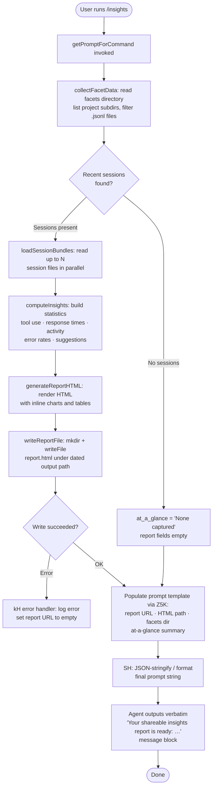

# `/insights`

> Analysis basis: CC v2.1.163 bundle.js (AST extraction + Claude interpretation)
> Minimum version: v2.1.163

---

## Overview

The `/insights` command generates a shareable HTML usage-analytics report that aggregates data from all of the user's Claude Code sessions. It collects per-session facet records from disk, computes statistics across multiple dimensions (tool usage, response times, activity patterns, error rates, etc.), writes an HTML report to a dated output file, and then instructs the agent to output a fixed confirmation message verbatim so the user sees the report location immediately.

---

## Registration

| Field | Value |
|---|---|
| type | `prompt` |
| name | `insights` |
| description | Generate a report analyzing your Claude Code sessions |
| loc_byte | `13149380` |
| loc_byte_end | `13150684` |
| loc_line | `10595` |
| handler_method | `getPromptForCommand` |
| handler_method_start | `13149554` |
| handler_method_end | `13150683` |
| prompt_body.length | `513` |
| prompt_body.trace | `call→Z5K(...) (1 literals)` |
| arbor_handler.name | `getPromptForCommand` |
| arbor_handler.kind | `Method` |
| arbor_handler.resolution_path | `direct` |
| arbor_handler.fqn | `claude-2.1.163::getPromptForCommand` |
| arbor_handler.n_hits | `1` |

Analysis basis: CC v2.1.163 bundle.js:+13149380

---

## Input Branching

The handler contains more than three distinct branches (session-data availability, report URL presence, facets directory presence, at-a-glance summary availability, and the final verbatim-output gate), so a Mermaid flowchart is used.



Analysis basis: CC v2.1.163 bundle.js:+13149560 (handler entry), +13149653 (T5K call), +13149941 (Math.round usage), +13150586 (Z5K template call), +13150604 (SH stringify), +13150650 (cb8 path helper)

---

## Behavioral Spec

### 1. Handler Entry — `getPromptForCommand`

The handler method (resolved via `arbor_handler` as `getPromptForCommand`, `direct` resolution inside the registration byte range `13149554`–`13150683`) is the sole entry point when the user types `/insights`.

```
async function getPromptForCommand(commandInput):
    rawInsightsData = await collectAndComputeInsights()   // T5K
    reportUrl      = rawInsightsData.reportUrl
    htmlFilePath   = rawInsightsData.htmlPath
    facetsDir      = rawInsightsData.facetsDir
    atAGlance      = rawInsightsData.atAGlance ?? "_No insights generated_"
    promptText     = buildPromptFromTemplate(             // Z5K
                         rawInsightsData,
                         atAGlance
                     )
    return formatPromptString(promptText)                 // SH
```

The constant `"_No insights generated_"` is the fallback when no session data is available.
Analysis basis: CC v2.1.163 bundle.js:+13150451 (`"_No insights generated_"` literal), +13150586 (Z5K), +13150604 (SH)

---

### 2. Facet Collection — `collectFacetsFromDisk` (lBf)

This function discovers all per-session data by walking the configured storage tree.

```
async function collectFacetsFromDisk(storageRoot):
    // Build base path:  storageRoot / "usage-data"
    usageDataPath = pathJoin(storageRoot, "usage-data")   // Nl + "usage-data"

    // List project-level subdirectories (filter: isDirectory)
    allEntries    = await fs.readdir(usageDataPath)       // nS.readdir
    projectDirs   = allEntries.filter(e => e.isDirectory()) // K.isDirectory

    facetFiles    = []
    for each projectDir in projectDirs:
        // Scan each project directory for .jsonl facet files
        jsonlFiles = await listJsonlFiles(projectDir)     // Hq6
        facetFiles.push(...jsonlFiles)

    // Sort with setImmediate yield to avoid blocking the event loop
    await yieldToEventLoop()                              // setImmediate
    facetFiles.sort(...)

    return facetFiles
```

Key constants:
- Storage sub-directory name: `"usage-data"` (bundle.js:+13075269)
- File extension filter: `".jsonl"` (bundle.js:+13222036)
- Minimum directory scan threshold before yielding: `0` entries (bundle.js:+13135973)

Analysis basis: CC v2.1.163 bundle.js:+13136317 (Nl path join), +13135944 (nS.readdir), +13135998 (filter), +13136012 (isDirectory), +13136224 (setImmediate yield), +13136248 (sort)

---

### 3. JSONL File Lister — `listJsonlFiles` (Hq6)

```
async function listJsonlFiles(dirPath):
    entries  = await fs.readdir(dirPath)                  // zL.readdir
    files    = entries.filter(e => e.isFile())            // K.isFile
    jsonlFiles = files.filter(f => fileExtensionFilter(f)) // DF + JD7.test
    results  = []
    for each file in jsonlFiles:
        basename = path.basename(file)                    // JD.basename
        fullPath = path.join(dirPath, basename)           // JD.join
        stat     = await fs.stat(fullPath)                // zL.stat
        _.set(accumulator, stat fields)                   // _.set
        results.push(fullPath)
    await Promise.all(results.map(r => statEnrich(r)))
    return results
```

Analysis basis: CC v2.1.163 bundle.js:+13221930 (zL.readdir), +13222007 (K.isFile), +13222036 (".jsonl"), +13222064 (JD.basename), +13222138 (JD.join), +13222171 (Promise.all), +13222239 (zL.stat)

---

### 4. Session Bundle Loader — `loadSessionBundle` (bBf)

For each discovered facet file the command reads and parses its JSON content.

```
async function loadSessionBundle(facetFilePath):
    // Paths: usage-data / session-meta
    metaPath    = pathJoin(facetsRoot, "session-meta")    // GfA → qC6 → "session-meta"
    rawText     = await fs.readFile(facetFilePath,
                      encoding: "utf-8")                  // nS.readFile, "utf-8"
    parsed      = parseJsonSafe(rawText)                  // W5K + B6 (JSON.parse)
    return parsed
```

Key constants:
- Sub-directory for session metadata: `"session-meta"` (bundle.js:+13075365)
- File encoding: `"utf-8"` (bundle.js:+13081400)

Analysis basis: CC v2.1.163 bundle.js:+13081333 (Ug.join), +13081376 (nS.readFile), +13081417 (W5K), +13081421 (B6/JSON.parse)

---

### 5. Core Insights Computation — `computeInsightsData` (T5K)

This is the primary orchestrator called by the handler. It coordinates data loading, statistical aggregation, HTML generation, and file writing.

```
async function computeInsightsData(config):
    // 1. Collect all facet files (up to a hard slice limit)
    facetFiles   = await collectFacetsFromDisk(config)    // lBf
    slicedFiles  = facetFiles.slice(0, LIMIT)             // A.slice

    // 2. Load bundles in parallel
    bundles      = await Promise.all(
                       slicedFiles.map(f => loadSessionBundle(f)) // F.map + bBf
                   )
    sessionList  = []
    errorList    = []

    // 3. Classify loaded bundles
    for each bundle in bundles:
        if bundle.valid:
            sessionList.push(bundle)
        else:
            errorList.push(bundle)

    // 4. Derive per-session insight facets
    facetRows    = await deriveFacetRows(sessionList)     // lb8

    // 5. Parse individual session records into structured data
    parsedSessions = sessionList.map(s =>
                         parseSessionRecord(s)            // TfA → P5K
                     )

    // 6. Compute high-level statistics
    stats = {
        toolUsage      : computeToolStats(parsedSessions),    // E5K
        responseTimes  : computeResponseTimes(parsedSessions),// FBf / z$H
        activityByHour : computeActivityByHour(parsedSessions),// gBf
        errorSummary   : computeErrorSummary(parsedSessions), // dBf
        atAGlance      : buildAtAGlance(parsedSessions)       // "at_a_glance"
    }

    // 7. Generate HTML report
    htmlContent  = generateReportHTML(stats)              // dBf / pBf
    Math.round(...)  // used for rounding token / time figures

    // 8. Check if the output format is requested
    if outputFormatIncludes("record_facets"):             // Q.includes, "record_facets"
        // write facet JSON files as well
        writeFacetFiles(facetRows)                        // xBf + CBf

    // 9. Build dated output path and write report.html
    timestamp    = buildTimestamp(new Date())             // S.getFullYear / getMonth /
                                                          // getDate / getHours / getMinutes / getSeconds
    outputDir    = pathJoin(outputRoot, timestamp)        // Ug.join
    await fs.mkdir(outputDir, { recursive: true })        // nS.mkdir
    reportPath   = pathJoin(outputDir, "report.html")     // "report.html"
    await fs.writeFile(reportPath, htmlContent)           // nS.writeFile

    return {
        reportUrl  : buildReportUrl(reportPath),
        htmlPath   : reportPath,
        facetsDir  : facetsRoot,
        atAGlance  : stats.atAGlance
    }
```

Key constants / limits:
- `"record_facets"` mode string (bundle.js:+13136774)
- `"report.html"` output filename (bundle.js:+13138574)
- `"RESPOND WITH ONLY A VALID JSON OBJECT"` — intermediate LLM prompt used during facet parsing (bundle.js:+13136721)
- `"at_a_glance"` key for the summary object (bundle.js:+13089514)
- `"insights"` — internal sub-directory name used when constructing the output path (bundle.js:+13083109)
- Maximum output token budget approximation: `4096` characters (bundle.js:+13083218)
- Session data cache window: `1800000` ms (30 minutes) (bundle.js:+13083742)
- HTML report context budget: `8192` characters (bundle.js:+13091656)
- Individual session record slice limits: `500` and `300` lines (bundle.js:+13079812, +13080104)
- Parallel session processing batch limits: `30000` / `25000` ms timeouts (bundle.js:+13080589, +13080610)

Analysis basis: CC v2.1.163 bundle.js:+13149653 (T5K call), +13136390 (A.slice), +13136413 (Promise.all), +13136470 (bBf), +13136851 (M.slice), +13136920 (lb8), +13136710 (Q.includes), +13137024 (TfA), +13138237 (E5K), +13138285 (pBf), +13138296 (dBf), +13138315 (nS.mkdir), +13138524 (Ug.join), +13138574 ("report.html"), +13138602 (nS.writeFile)

---

### 6. Per-Session Facet Derivation — `deriveFacetRows` (lb8)

Builds a normalized row-per-session representation used both for statistics and for writing structured facet output files.

```
function deriveFacetRows(sessionBundles, stateMap):
    result = []
    for each bundle in sessionBundles.values():
        if stateMap.has(bundle.id): continue           // G.has dedup

        facetRow = buildSessionFacetRow(bundle)        // v1H — full state builder
        result.push(facetRow)

        metaRow  = buildMetaSummary(bundle)            // $MK
        sessionFacet = buildSessionFacet(bundle,       // y5H
                           facetRow, metaRow)
        appendFacets(result, sessionFacet)             // V.push

        // Summarize tool invocations
        toolFacet   = summarizeToolCalls(bundle)       // e66
        // Format narrative text
        narrativeFacet = formatNarrativeText(bundle)   // nfA
        // Evaluate quality facets
        qualityFacet   = evaluateQuality(bundle)       // rfA

        result.push(toolFacet, narrativeFacet, qualityFacet)

    // Retrieve aggregated data from sub-maps
    toolStats   = result.q.get(...)                    // lb8: q.get, K.get, L.get …
    return result
```

Analysis basis: CC v2.1.163 bundle.js:+13222751 (A.values), +13222765 (G.has), +13222779 (E.push), +13222795 ($MK), +13222829 (y5H), +13222890 (V.push), +13222924 (e66), +13223023 (nfA), +13223043 (rfA), +13223116–13223482 (get calls on sub-maps)

---

### 7. HTML Report Generation — `generateReportBody` (dBf)

Builds the complete HTML string from statistics objects. Uses inline CSS colour constants and response-time bucket definitions.

```
function generateReportBody(stats):
    html = []

    // Tool-usage section
    toolSection  = renderToolTable(stats.toolUsage)    // z$H

    // Response-time histogram — buckets defined as:
    //   "2-10s", "10-30s", "30s-1m", "1-2m", "2-5m", "5-15m", ">15m"
    timeSection  = renderResponseTimeChart(            // FBf
                       stats.responseTimes,
                       colors: ["#2563eb","#0891b2","#10b981","#8b5cf6"]
                   )

    // Activity-by-time-of-day section — buckets:
    //   "Morning (6-12)", "Afternoon (12-18)",
    //   "Evening (18-24)", "Night (0-6)"
    activitySection = renderActivityChart(stats.activity) // gBf

    // Error / suggestion section
    errorSection = renderErrorSummary(stats.errors)    // object keys

    // Empty-state guards:
    //   "<p class=\"empty\">No data</p>"
    //   "<p class=\"empty\">No response time data</p>"
    //   "<p class=\"empty\">No time data</p>"
    //   "<p class=\"empty\">No tool errors</p>"

    // Markdown → HTML helpers
    html = applyMarkdownConversions(html)               // q5 / m7 HTML-escape + bold
    //   HTML entities: &amp; &lt; &gt; &quot; &apos;
    //   Bold: <strong>$1</strong>
    //   Bullet: "• "
    //   Line break: "<br>"

    return html.join("")
```

Key colour constants (bundle.js):
- `#2563eb` (+13130152), `#0891b2` (+13130290), `#10b981` (+13130462), `#8b5cf6` (+13130605)
- `#dc2626` (+13133868), `#16a34a` (+13134117), `#eab308` (+13134610)

Empty-state strings: `"<p class=\"empty\">No data</p>"` (bundle.js:+13091978), `"<p class=\"empty\">No response time data</p>"` (+13092435), `"<p class=\"empty\">No time data</p>"` (+13093285), `"<p class=\"empty\">No tool errors</p>"` (+13133879)

Analysis basis: CC v2.1.163 bundle.js:+13138296 (dBf), +13130130 (z$H), +13130822 (FBf), +13133655 (gBf), +13094063 (QBf/SH), +13094121 (I.split), +13094193 (<strong>), +13094236 (bullet)

---

### 8. Prompt Template Builder — `buildInsightsPrompt` (Z5K)

Called by the handler to produce the final prompt string that is returned to the agent runtime.

```
function buildInsightsPrompt(insightsPayload, atAGlanceSummary):
    // Injects:
    //   - Full insights data blob
    //   - reportUrl (shareable link)
    //   - htmlFilePath (local path to report.html)
    //   - facetsDir (directory containing raw .jsonl facet files)
    //   - atAGlanceSummary (context-only, not yet shown to user)
    //
    // Instructs the agent to output the <message> block verbatim:
    //   "Your shareable insights report is ready: ..."
    //   "Want to dig into any section or try one of the suggestions?"
    //
    // Separator literal used when joining report URL components: " · "

    prompt = templateString(
        reportUrl      = insightsPayload.reportUrl,
        htmlFile       = insightsPayload.htmlPath,
        facetsDir      = insightsPayload.facetsDir,
        atAGlance      = atAGlanceSummary
    )
    return prompt   // length ≤ 513 chars (extraction record)
```

The constant `" · "` is used as a display separator within the shareable URL line (bundle.js:+13150012).
Fallback when no insights exist: `"_No insights generated_"` (bundle.js:+13150451).

Analysis basis: CC v2.1.163 bundle.js:+13150586 (Z5K), +13150012 (" · "), +13150451 ("_No insights generated_"), +13149941 (Math.round in handler)

---

### 9. Session Record Parser — `parseSessionRecord` (TfA / P5K)

Converts raw JSONL session entries into structured objects used by statistics functions.

```
function parseSessionRecord(rawEntry):
    parsed = P5K(rawEntry)    // primary parser
    //   - Checks Array.isArray for multi-turn entries
    //   - Reads tool_use type events
    //   - Detects known tool names: "WebSearch", "WebFetch", "Edit", "Write"
    //   - Detects MCP tool prefix: "mcp__"
    //   - Classifies exit reasons: "exit code", "Command Failed",
    //     "rejected", "User Rejected", "Edit Failed", "File Changed",
    //     "File Too Large", "File Not Found", "[Request interrupted by user"
    //   - Reads timestamps: I.getTime(), I.getHours()
    //   - Bins response durations (seconds): 3600 s max window
    //   - String trims and lowercases labels

    enriched = TfA(parsed)
    //   - Math.round for numeric fields
    //   - Array.isArray guard
    //   - $.trim on string fields
    //   - N$ (numeric normalizer)

    return enriched
```

Key constants:
- Maximum session age considered: `3600` seconds (bundle.js:+13076766)
- Content type checked: `"content"` (bundle.js:+13076845)
- Tool-use type label: `"tool_use"` (bundle.js:+13075848)

Analysis basis: CC v2.1.163 bundle.js:+13137024 (TfA), +13078039 (P5K), +13075803 (Array.isArray), +13075848 ("tool_use"), +13075928 (S.startsWith), +13076028 (AC6), +13076302 (r4), +13076765 (3600 limit), +13078093 (Math.round)

---

### 10. Facet File Writer — `writeFacetFiles` (xBf / CBf)

When `"record_facets"` mode is active the command writes two categories of per-session JSON files.

```
async function writeFacetFiles(facetsRoot, sessionId, data):
    // xBf: write session-level usage-data facet
    await fs.mkdir(facetsRoot, { recursive: true })     // nS.mkdir
    facetPath = pathJoin(facetsRoot, ...)               // Ug.join (384-char path limit)
    await fs.writeFile(facetPath,
        JSON.stringify(data),                           // SH
        encoding: "utf-8"
    )                                                   // nS.writeFile
    if writeError: logError(err)                        // kH

    // CBf: write compact session-meta facet
    metaPath = pathJoin(metaRoot, ...)                  // cb8 + Ug.join
    await fs.mkdir(metaRoot)
    await fs.writeFile(metaPath,
        JSON.stringify(metaData), encoding: "utf-8"
    )
```

Path length constant: `384` characters (bundle.js:+13082049)

Analysis basis: CC v2.1.163 bundle.js:+13137158 (xBf), +13081917 (nS.mkdir), +13081926 (GfA), +13081954 (Ug.join), +13081998 (nS.writeFile), +13082013 (SH), +13082049 (384), +13082064 (kH), +13137995 (CBf), +13081160–13081263 (CBf internals)

---

## State & Side Effects

| Item | Detail |
|---|---|
| Telemetry | No `tengu_insights_*` event found in depth-2 traversal; the reachable telemetry events listed below are from shared infrastructure reached transitively. |
| Telemetry (transitive — infrastructure) | `tengu_mcp_skills` (bundle.js:+6952647), `tengu_skill_file_changed` (+14157870), `tengu_daemon_config_reload` (+16148704), `tengu_daemon_idle_exit` (+16153957), `tengu_daemon_control` (+16170260), `tengu_bg_dispatch_sigkill_escalate` (+16133292), `tengu_bg_dispatch_low_mem` (+16133893), `tengu_bg_spare_enable` (+16134597), `tengu_bg_spare_claim` (+16134725), `tengu_bg_spare_claim_fail` (+16134991), `tengu_bg_adopt_sock_unlinked` (+13488833), `tengu_bg_retire_pinned_low_mem` (+16137897), `tengu_bg_prewarm_per_sweep` (+16138018), `tengu_transcript_phantom_parent` (+13207519), `tengu_relink_walk_broken` (+13187255), `tengu_voice_circuit_breaker_tripped` (+14296611), `tengu_voice_recording_started` (+14298163), `tengu_voice_stream_early_retry` (+14299603), `tengu_transcript_parent_cycle` (+13211324), `tengu_chain_parent_cycle` (+13189028), `tengu_chain_timestamp_fallback` (+13189177), `tengu_chain_parallel_tr_recovered` (+13191043), `tengu_daemon_yield` (+16152927) |
| Filesystem reads | `fs.readdir` on the `usage-data` tree; `fs.readFile` for each `.jsonl` session file (encoding `"utf-8"`); `fs.stat` on each discovered file |
| Filesystem writes | Creates output directory with `fs.mkdir` (recursive); writes `report.html` via `fs.writeFile`; optionally writes per-session `.jsonl` facet files and session-meta files when `"record_facets"` mode is active |
| appState changes | None directly; no `appState` mutations observed in the depth-2 call graph for this command path |
| Hook registration | None observed in this command's call graph |
| Sound | None observed |
| Cache window | Session data considered fresh for `1800000` ms (30 min) (bundle.js:+13083742) |
| Agent output | Agent is instructed to output the `<message>` block **verbatim** — no additional commentary — containing the shareable report URL and a prompt asking if the user wants to explore further |

---

## Version History

| Version | Change |
|---|---|
| v2.1.163 | Initial analysis |

---

## Common Mistakes

1. **Running `/insights` in a project with no prior sessions** — the command will complete without error but will use the `"_No insights generated_"` fallback and the HTML report will contain empty-state placeholders ("No data", "No response time data", etc.). No file is written in this case.
2. **Expecting live output before the report is written** — the agent is instructed to suppress all output until the full `<message>` block is emitted verbatim; any intermediate streaming text visible in the UI comes from the infrastructure, not from this command's prompt.
3. **Assuming the report is always at a fixed path** — the output directory is timestamped (`getFullYear`/`getMonth`/`getDate`/`getHours`/`getMinutes`/`getSeconds`), so each invocation creates a new subdirectory. The exact path is included in the agent's response.
4. **Editing facet `.jsonl` files manually** — the `listJsonlFiles` function filters strictly by the `.jsonl` extension and uses `fs.stat` to enrich entries; malformed or renamed files will be silently skipped.
5. **Expecting `"record_facets"` mode to be active by default** — facet writing (via `xBf` / `CBf`) only occurs when the current output-format set includes the `"record_facets"` literal; in most interactive sessions this path is not taken.
6. **Misinterpreting the "at-a-glance summary" field** — the prompt body explicitly marks this section as "for your context only — the user has not seen any output yet"; Claude uses it internally but must not include it in its verbatim reply.

---

## Appendix — Identifier Mapping

> For bundle debugging only. Identifiers change across versions.

| Identifier | Role |
|---|---|
| `__handler_insights` | Synthetic BFS entry-point for the `/insights` command handler (not a real bundle symbol) |
| `T5K` | Core insights computation orchestrator (collectFacets → loadBundles → computeStats → writeReport) |
| `lBf` | Facets-directory walker; lists project subdirs and collects `.jsonl` paths |
| `Nl` | Path builder for the `usage-data` base directory |
| `Hq6` | Per-directory `.jsonl` file lister with `fs.stat` enrichment |
| `DF` | File extension predicate (tests for `.jsonl`) |
| `bBf` | Session-bundle loader: reads and JSON-parses a single session file |
| `GfA` | Path builder for the `session-meta` sub-directory |
| `qC6` | Inner path helper for constructing `usage-data` sub-paths |
| `W5K` | JSON parse error guard / safe-parse wrapper |
| `B6` | `JSON.parse` thin wrapper |
| `lb8` | Per-session facet-row derivation orchestrator |
| `v1H` | Full session state-map builder (populates many sub-maps keyed by metadata type) |
| `$MK` | Meta-summary row builder |
| `y5H` | Session facet aggregator; chains `vFf`, `IFf`, `VFf`, `$MK` |
| `vFf` | NaN-safe numeric facet validator |
| `IFf` | Incremental facet indexer (sort + dedup) |
| `VFf` | Ordered facet queue manager |
| `e66` | Tool-call summarizer per session |
| `nfA` | Narrative text formatter (replaceAll, slice) |
| `mS6` | Session narrative inner formatter |
| `rfA` | Quality facet evaluator (`kFf` + `yFf`) |
| `kFf` | Scalar quality checker (trim, isArray, some) |
| `yFf` | Array quality checker (isArray, some) |
| `Ax8` | Aggregated facet accessor (get/set on accumulator maps) |
| `qx8` | Facet-map snapshot helper (Array.from + values) |
| `TfA` | Session record enricher (Math.round, Array.isArray, $.trim, N$) |
| `P5K` | Primary session-record parser (tool classification, timestamp extraction, error classification) |
| `AC6` | Tool-name normaliser |
| `NBf` | File-extension extractor for tool tracking |
| `BJH` | Diff helper (YZ9.diff) |
| `r4` | String index helper (H.indexOf) |
| `N$` | Numeric normaliser used in record enrichment |
| `EfA` | Post-parse enrichment step |
| `xBf` | Usage-data facet file writer (mkdir + writeFile + SH) |
| `CBf` | Session-meta facet file writer (mkdir + writeFile + SH) |
| `SH` | `JSON.stringify` wrapper |
| `RBf` | Facet file reader/unlinker for stale entries |
| `cb8` | Path builder for `session-meta` storage root |
| `V5K` | Stale-record validator |
| `uBf` | Report-generation entry point (SBf + __6 + eK + X5K + lK pipeline) |
| `SBf` | Session-batch processor (slice, Promise.all, map) |
| `kBf` | Per-record line slicer and formatter |
| `__6` | Insight-record builder (pv8 + u8 + CxH + UE) |
| `pv8` | Hash/UUID-based dedup and persistence writer |
| `u8` | UUID-keyed record wrapper |
| `CxH` | Assistant-message extractor |
| `UE` | Post-extraction finaliser |
| `X5K` | NE-based path resolver for insights output |
| `NE` | First-party path provider (gM + Z5 + XA) |
| `lK` | Filter helper for processed insights records |
| `HA` | Error-to-string converter |
| `E5K` | Tool-usage statistics computer (entries, push, sort, percentile, Math.floor/round) |
| `G5K` | Numeric statistics helper (sort, median, percentile) |
| `e96` | Object.entries wrapper for statistics enumeration |
| `Q1` | String slice/index helper |
| `pBf` | HTML report assembler (Array.from, values, SH, Math.round, Promise.all) |
| `J5K` | Per-session HTML section builder (__6 + eK + EBf + lK pipeline) |
| `EBf` | NE-based path helper for per-session HTML output |
| `dBf` | Full report body generator (tool table + time histogram + activity chart + error section) |
| `z$H` | Tool-usage table HTML renderer |
| `FBf` | Response-time histogram HTML renderer |
| `gBf` | Activity-by-hour chart HTML renderer |
| `QBf` | HTML serialiser (SH-backed) |
| `q5` | HTML-escape and Markdown-to-HTML converter |
| `m7` | `replaceAll`-based HTML entity escaper |
| `db8` | Secondary string replacement pass |
| `Z5K` | Prompt template function — injects report URL, HTML path, facets dir, at-a-glance into the final prompt string |
| `vBf` | `Number.isNaN` guard used before numeric aggregation |
| `nBf` | Object.keys enumerator for stats objects |
| `zFf` | Session-state initialiser called by `v1H` |
| `jb` | Metadata type dispatcher within `v1H` |
| `fJ` | Facet-linking helper |
| `eK` | Insight record key extractor |
| `eH` | String coercion helper |
| `kH` | Centralised error logger (HA + eH + Dq + HW4 + hBH.push + Er.logError) |
| `AbH` | MCP connection initialiser (reached transitively; not on the direct insights path) |