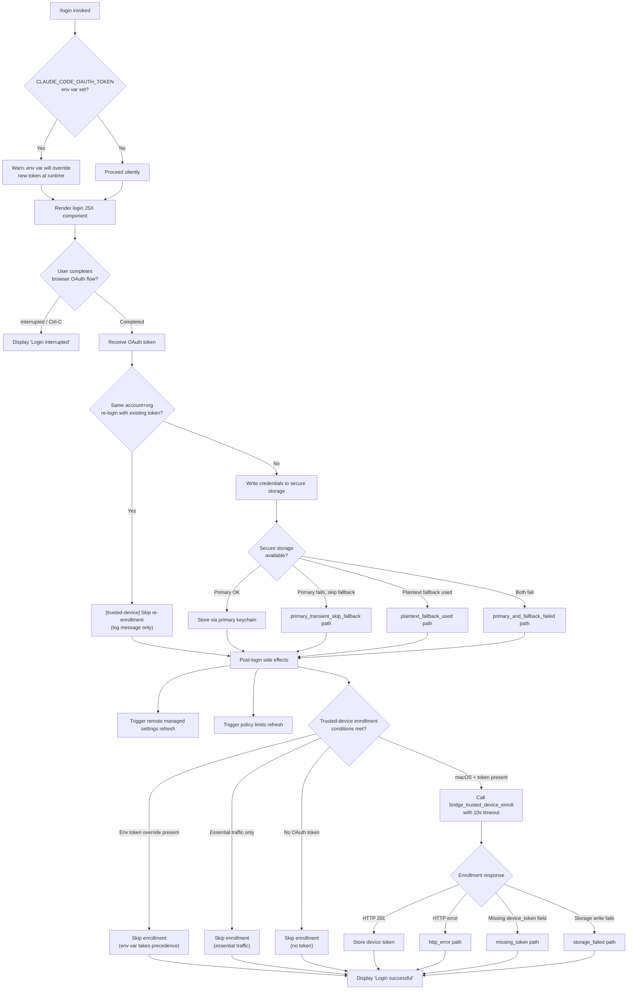

# `/login`

> Analysis basis: CC v2.1.163 bundle.js (AST extraction + Claude interpretation)
> Minimum version: v2.1.163

---

## Overview

The `/login` command initiates an OAuth-based account sign-in flow, allowing the user to switch Anthropic accounts or authenticate for the first time. It renders an interactive JSX component that guides the user through browser-based authorization, stores resulting credentials securely, and then triggers downstream side effects including trusted-device enrollment and remote settings/policy refresh.

---

## Registration

| Field | Value |
|---|---|
| type | `local-jsx` |
| name | `login` |
| description | `Switch Anthropic accounts \| Sign in with your Anthropic account` |
| module_id | `uwq` |
| load_inline | `true` |
| loc_byte | `11589794` |
| loc_byte_end | `11590014` |
| loc_line | `8013` |
| arbor_handler.name | `OQq` |
| arbor_handler.fqn | `claude-2.1.163::OQq` |
| arbor_handler.kind | `Function` |
| arbor_handler.resolution_path | `direct` |
| arbor_handler.n_hits | `2` |

Analysis basis: CC v2.1.163 bundle.js:+11589794

---

## Input Branching

The login flow has several distinct branches depending on auth state, credential type, environment variables, and user interaction outcomes. A Mermaid flowchart is used because there are 5+ distinct paths.



---

## Behavioral Spec

### Top-Level Handler: `Jo7` (loginCommandRenderer)

The entry point for `/login` is the function `Jo7`, which constructs and returns a JSX tree. Internally it delegates to `R2H` (loginUIComponent) for the interactive portion, and to `EZ8` (loginOrchestrator) for the business logic.

Analysis basis: CC v2.1.163 bundle.js:+9317529

---

### Sub-feature: Pre-flight Environment Warning

```
function checkOAuthEnvOverride(appState):
    if environment contains CLAUDE_CODE_OAUTH_TOKEN:
        display warning message indicating the env var will override
        the newly stored login token at runtime
        advise user to unset the variable
    // Warning text begins "Warning: CLAUDE_CODE_OAUTH_TOKEN is set..."
    // (bundle.js:+9317332)
```

Analysis basis: CC v2.1.163 bundle.js:+9317332

---

### Sub-feature: OAuth Flow Orchestration (`EZ8` / loginOrchestrator)

```
function loginOrchestrator(context):
    1. Record timestamp via timestampHelper()         // +9316780
    2. Initiate HTTP bootstrap fetch for API config   // "[Bootstrap] Fetching" +15724218
       - Set headers: Content-Type, User-Agent        // +15724303, +15724337
       - 5000 ms fetch timeout                        // +15724419
       - On parse failure emit event "api_bootstrap_fetch" / "parse_failed"  // +15724540
    3. Retrieve current appState via H.getAppState()  // +9317113
    4. Launch OAuth browser flow (gsH / oauthFlowRunner)
    5. Await user completion or cancellation
    6. On completion:
        a. Check if same account+org re-login with existing token  // +9316958
           - If true: log skip message, skip re-enrollment
        b. Otherwise: write API key / OAuth token via changeAPIKeyHandler  // +9316705
        c. Apply message op update                   // +9316724
    7. Update appState via H.setAppState()           // +9317209
    8. Trigger downstream refresh (remote settings, policy limits)
    9. Return "Login successful" on success          // +9317707
       Return "Login interrupted" on cancellation    // +9317726
```

Analysis basis: CC v2.1.163 bundle.js:+9317065

---

### Sub-feature: API Key Normalization (`v` / apiKeyNormalizer)

Called during credential processing to clean and validate the incoming token string.

```
function apiKeyNormalizer(rawKey, knownPrefixes):
    key = rawKey.trim()                     // +206200
    key = key.toUpperCase() (prefix only)   // +206177
    if key includes known prefix:           // +206115
        pass through ccK / keyFormatChecker
    apply J4 / keySegmentExtractor:
        segments = key via g2A / segmentMapper (maps BcK array)  // +197777
        replace known patterns              // +198089
        extract segment at index 2          // +198199
        find last separator                 // +198225
        slice to canonical form             // +198251
    if debug mode enabled:                  // "debug" +206051
        emit debug log via SH / jsonStringifyWrapper
    write result via ppH / credentialWriter -> h2A / streamWriter  // +206222, +193190
```

Analysis basis: CC v2.1.163 bundle.js:+206075

---

### Sub-feature: Credential Storage (`icK` / credentialStorageManager)

Handles atomic writes of credentials to disk with rotation/backup logic.

```
function credentialStorageManager(token, options):
    configDir = path.dirname(configPath)   // +205596
    check file size via Buffer.byteLength  // +205771, +205771

    // Rotate existing credential file if needed
    rotatePreviousCredentialFile(configPath):   // i2A +205765
        stat existing file                      // +204917
        if file ends with ".txt":               // +205010
        slice suffix (length 4)                 // +205032 (".txt" +205021, 4 +205043)
        rename to backup                        // +205073
        on error: log via R8                    // +205101
        unlink old file                         // +205113

    // Build config path
    configPath = path.join(configDirPath, configFileName)  // r2A +205733
    logPath = buildLogPath(configPath)                     // d3H +205588

    // Write credential atomically
    appendCredentialFile(configDir, token):    // ncK.bind +205830
        mkdir -p configDir                     // +205317
        appendFile to path                     // +205376
        rotate again if needed                 // +205463
        check byte length                      // +205469

    // Register cleanup hook
    registerExitHook(cleanupHandler)           // j9 +205926 -> MXA.register +60323
```

Analysis basis: CC v2.1.163 bundle.js:+205563

---

### Sub-feature: OAuth Browser Flow (`gsH` / oauthFlowRunner)

```
function oauthFlowRunner(context):
    validate existing session via aB9             // +7033854
    build OAuth URL components via Cx_ / urlBuilder -> VmA  // +7033860
    construct token exchange request via Ts / tokenExchanger:
        validate TKH / tokenHeaderHelper          // +7028171
        parse gHH / grantHandler                  // +7028187
        resolve provider type (XA):               // +7028198
            "bedrock", "foundry", "vertex",
            "anthropicAws", "gateway", "firstParty"
        determine AEH / authEndpointHelper        // +7028229
        handle H3 / headerBuilder                 // +7028233
        apply Hf / hashFunction                   // +7028285
    open poll loop via nD8 / notificationDispatcher:
        NmA / notificationMapper                  // +7034039
        notify via hu.notifyChange                // +7034045
        log via kH / kernelLogger                 // +7034088

    start background settings refresh loop (oB9 / onAuthChangeObserver):
        setInterval polling via ID8 / intervalDriver // +6987073
        on change: invoke Tj7 / triggerRefreshOnChange -> xx_ / fullSettingsSync
        register exit hook via j9                 // +7034482

    run policy limits fetch (QG6 / policyLimitsCoordinator):
        via qx_ / policyFetchLoop + EC / executePolicyCheck
        manage timeout via clearTimeout           // +6987635
        emit "Policy limits: Loading promise timed out, resolving anyway" // +6987789

    run remote managed settings fetch (SD8 / settingsDownloadManager):
        full sync via oU9 / settingsFetchAndApply
        poll continuously via aU9 / settingsPollingManager -> ID8
```

Analysis basis: CC v2.1.163 bundle.js:+7033854

---

### Sub-feature: Remote Managed Settings Sync (`xx_` / fullSettingsSync)

```
function fullSettingsSync(authContext):
    hashPayload = computeHash(payload, via $B9 -> MB9.createHash "sha256") // +7001712
    fetch remote settings endpoint:
        build URL via O$6 / urlBuilder            // +7033107
        open file via OhH.open                    // +7031679
        write response with chunk size 384        // +7031694, utf-8 +7031744
        datasync + close                          // +7031760, +7031787

    handle HTTP responses:
        200: parse and validate settings          // +7030311
        204: no content                           // +7030320
        304: "Using cached settings (304)"        // +7030329 / +7030371
        401: force refresh retry                  // +7031251; telemetry tengu_remote_settings_401_force_refresh_retry
        404: delete cached file + log             // +7033119, +7033135
        timeout: log "Remote settings: Request timeout" // +7031495

    security check dialog (gB9 / settingsSecurityGate):
        show dialog (telemetry: tengu_managed_settings_security_dialog_shown)   // +7027287
        on accept: telemetry tengu_managed_settings_security_dialog_accepted     // +6926939
        on reject: telemetry tengu_managed_settings_security_dialog_rejected     // +6926989
            log "Remote settings: User rejected new settings, using cached settings" // +7032840
    
    on apply success:
        log "Remote settings: Applied new settings successfully"  // +7032970
    on stale cache after failure:
        log "Remote settings: Using stale cache after fetch failure" // +7032433
    on unexpected error:
        telemetry: remote_managed_settings_unexpected                // +7033436
```

Analysis basis: CC v2.1.163 bundle.js:+7032069

---

### Sub-feature: Trusted-Device Enrollment (`CsH` / trustedDeviceEnroller)

```
function trustedDeviceEnroller(oauthToken, appContext):
    // Guard conditions (each causes an early return with a log message)
    if CLAUDE_TRUSTED_DEVICE_TOKEN env var set:
        log "[trusted-device] CLAUDE_TRUSTED_DEVICE_TOKEN env var is set, skipping enrollment"
        return                                           // +6994534

    if essentialTrafficOnly (via Dq / trafficChecker):
        log "[trusted-device] Essential traffic only, skipping enrollment"
        return                                           // +6994848

    if no OAuth token present:
        log "[trusted-device] No OAuth token, skipping enrollment"
        return                                           // +6994961

    // Enrollment attempt (macOS / "darwin" only)    // +6995157
    response = POST enrollmentEndpoint with token:
        timeout: 10000 ms                              // +6995250
        retry interval: 500 ms                         // +6995276
        telemetry event: bridge_trusted_device_enroll  // +6995352

    if HTTP 201:                                       // +6995438
        extract device_token from response
        if device_token missing:
            telemetry: missing_token                   // +6995736
            return
        write token to secure storage via M4 / secureStorageManager -> EP1:
            try primary keychain                       // +2280519 secure_storage_credentials_write
            if primary transient fail: primary_transient_skip_fallback  // +2280617
            if fallback used: plaintext_fallback_used                   // +2280766
            if both fail: primary_and_fallback_failed                   // +2280869
    else:
        telemetry: http_error                          // +6995557
        log reason (unknown if not parseable)          // +6995897

    on storage write failure:
        telemetry: storage_failed                      // +6995944

    // Re-login fast path
    if same account+org re-login with existing token:
        log "[trusted-device] Same account+org re-login with existing token, skipping re-enrollment"
        // +9316958
```

Analysis basis: CC v2.1.163 bundle.js:+6994271

---

### Sub-feature: Policy Limits Fetch (`QG6` / policyLimitsCoordinator)

```
function policyLimitsCoordinator(context):
    clear any pending policy timeout (qx_)           // +6987635
    evaluate policy check (EC / executePolicyCheck):
        resolve auth type: "wif", "oauth", "api_key" // +6988432, +6988471, +6988488
        dispatch to DO / domainOrchestrator
        dispatch to Bj / batchJobRunner

    on load: telemetry tengu_policy_limits_fetch      // +6990462
    handle result:
        200: parse and apply restrictions
            log "Policy limits: Applied new restrictions successfully"  // +6991033
        204: log "Policy limits: No restrictions (cached empty)"        // +6991088
        304: log "Policy limits: Cache still valid (304 Not Modified)"  // +6990875
        fetch failure: use stale cache                                  // +6990704
            telemetry sub-type: stale_cache_used                        // +6990772
        request error: request_failed path                              // +6990819
        unexpected: log stale + unexpected_error                        // +6991259

    background polling (aU9 / settingsPollingManager):
        setInterval via ID8                           // +6992131
        on change: log "Policy limits: Changed during background poll"  // +6992015
        telemetry: policy_limits_poll                                   // +6991957
```

Analysis basis: CC v2.1.163 bundle.js:+6991696

---

### Sub-feature: Login UI Component (`R2H` / loginUIComponent)

```
function loginUIComponent(props):
    [isDone, setIsDone] = useState(false)            // xwq.useState +9317802
    memoKey = Symbol.for("react.memo_cache_sentinel")  // +9317831
    memoSlots = useMemo(21 slots)                    // +9317778 (21)

    onDone handler: H.onDone -> set isDone = true    // +9317950

    keyHandler via P_ / keyHandlerRegistrar:
        useRef, useEffect, registerHandler           // +4091003, +4069, +4091072
        handle "confirm:no" keypress                 // +9318109
        handle Esc -> "cancel"                       // +9318330, +9318361
        handle "continue"                            // +9318350

    inputHandler via dM / inputDispatcher -> ML9 -> oE_:
        Ctrl-C -> "app:interrupt"                    // +4134184, +4133958
        Ctrl-D -> "app:exit"                         // +4134229, +4133976
        double-press threshold: 3 iterations         // +9317937

    render phases (slot indices 3,5,6,7,8,9,11..19):
        slot 3: initial connecting state             // +9317937
        slot 5: waiting for browser confirmation     // +9318019
        slot 6–8: progress indicators                // +9318145-+9318173
        slot 9–19: result / error states
        final: render "Login" title                  // +9318814
               render "permission" context           // +9318839

    display "Press [key] again to exit" hint         // +9318224, +9318243
    createElement via Ot.createElement               // +9318200
```

Analysis basis: CC v2.1.163 bundle.js:+9317772

---

## State & Side Effects

| Item | Detail |
|---|---|
| Telemetry: `tengu_feature_ok` | Feature flag check succeeded (bundle.js:+1010222) |
| Telemetry: `tengu_feature_bad` | Feature flag check failed (bundle.js:+1010284) |
| Telemetry: `tengu_feature_sad` | Feature flag check errored (bundle.js:+1010365) |
| Telemetry: `tengu_remote_settings_401_force_refresh_retry` | 401 from remote settings triggers forced retry (bundle.js:+7031320) |
| Telemetry: `tengu_managed_settings_security_dialog_shown` | Security dialog displayed to user (bundle.js:+7027287) |
| Telemetry: `tengu_managed_settings_security_dialog_accepted` | User accepted managed settings (bundle.js:+7026939) |
| Telemetry: `tengu_managed_settings_security_dialog_rejected` | User rejected managed settings (bundle.js:+6926989) |
| Telemetry: `tengu_policy_limits_fetch` | Policy limits fetch initiated (bundle.js:+6990462) |
| Telemetry: `tengu_disable_bypass_permissions_mode` | bypassPermissions mode disabled during session (bundle.js:+10679097) |
| Telemetry: `tengu_auto_mode_config` | Auto-mode configuration evaluated (bundle.js:+10676987) |
| Telemetry: `tengu_daemon_config_reload` | Daemon config reloaded after login (bundle.js:+16148704) |
| Hook registration | Exit hooks registered via `MXA.register` (j9, bundle.js:+60323); process `beforeExit` and `exit` listeners attached (bundle.js:+3240322, +3239569) |
| `appState` changes | `H.getAppState()` read before login; `H.setAppState()` written after success (bundle.js:+9317113, +9317209) |
| Credential storage | OAuth token written to secure storage (primary keychain with plaintext fallback); old `.txt` credential files rotated/renamed (bundle.js:+205021) |
| Background polling | `setInterval` started for remote settings poll and policy limits poll after successful login (bundle.js:+6987073, +6992131) |
| Process listeners | `process.off` / `process.removeListener` called on cleanup (bundle.js:+3239511, +3240299) |
| Cache clear | Multiple caches cleared on session cleanup: `yDH`, `p98`, `tw6`, `zX_`, `eU` (bundle.js:+3239630–+3239678) |
| Sound | Not found in depth-2 traversal <!-- TODO: not found in depth-2 traversal; needs --depth 4 --> |

---

## Version History

| Version | Change |
|---|---|
| v2.1.163 | Initial analysis |

---

## Common Mistakes

1. **Leaving `CLAUDE_CODE_OAUTH_TOKEN` set in the environment** — the command warns that this environment variable will override the newly stored token at runtime. Users must unset it after login for new credentials to take effect (bundle.js:+9317332).

2. **Expecting instant credential activation on non-macOS** — trusted-device enrollment (`CsH`) only runs on `darwin` (bundle.js:+6995157). On other platforms the enrollment step is silently skipped.

3. **Interrupting with Ctrl-C during the browser flow** — the command shows "Login interrupted" and does **not** write any credentials. The session remains using whatever credentials were active before.

4. **Running `/login` in an environment with `CLAUDE_TRUSTED_DEVICE_TOKEN` already set** — the trusted-device enrollment step is skipped entirely in favor of the pre-existing env token (bundle.js:+6994534).

5. **Assuming a re-login always re-enrolls the device** — if the same account+org combination is detected with an existing valid token, re-enrollment is skipped silently (bundle.js:+9316958).

---

## Appendix — Identifier Mapping

> For bundle debugging only. Identifiers change across versions.

| Identifier | Role |
|---|---|
| `OQq` | Arbor-resolved handler for `/login` registration (direct resolution) |
| `Jo7` | loginCommandRenderer — top-level JSX entry point for /login |
| `R2H` | loginUIComponent — interactive React component rendering login UI |
| `EZ8` | loginOrchestrator — business logic coordinator for the login flow |
| `H` | appStateAccessor — provides get/setAppState and other app context methods |
| `v` | apiKeyNormalizer — cleans and validates the incoming key/token string |
| `ccK` | keyFormatChecker — validates key format against known prefixes |
| `OXA` | prefixValidationHelper — checks key prefix at positions 0/1 |
| `lgK` | prefixLookup0 — checks first prefix character |
| `ngK` | prefixLookup1 — checks second prefix character |
| `SH` | jsonStringifyWrapper — serializes objects for logging/hashing |
| `J4` | keySegmentExtractor — splits and normalizes API key segments |
| `g2A` | segmentMapper — maps key segments via BcK array |
| `q` | fileUnlinker — removes credential file via unlinkSync |
| `A` | lowercaseFileHelper — calls toLowerCase on filename |
| `ppH` | credentialWriter — writes credential through stream |
| `h2A` | streamWriter — performs the actual H.write call |
| `icK` | credentialStorageManager — atomic write + rotation of credential files |
| `$pH` | outputBufferFlusher — manages timeout/flush cycle for output (clearTimeout, setTimeout, setImmediate) |
| `d3H` | logPathBuilder — constructs log file path via path.join |
| `Q6` | configPathResolver — resolves configuration file path |
| `aL6` | errorCodeClassifier — classifies filesystem errors (e.g., EISDIR) |
| `r2A` | configFilePathBuilder — builds path to main config file |
| `i2A` | credentialFileRotator — stat/rename/unlink old credential files |
| `ncK` | credentialFileAppender — mkdir + appendFile for credential storage |
| `j9` | exitHookRegistrar — registers cleanup callbacks via MXA.register |
| `e$` | environmentReader — reads environment variables |
| `Pw_` | urlParser — splits/trims/slices URL strings |
| `ZHH` | featureFlagSetChecker — checks g44 Set for feature flags |
| `uj` | stringReplacer — regex replace utility |
| `t1` | tokenParser — full token string parser dispatching to D6H and Aq |
| `D6H` | domainModelParser — dispatches to x0, IqH, SA, yd |
| `x0` | modelValidatorA — first-pass model string validator |
| `IqH` | modelValidatorB — second-pass model validator |
| `yd` | modelStringNormalizer — trims/maps/validates model name strings |
| `Aq` | modelAliasResolver — resolves aliases (opusplan, sonnet, haiku, opus, best) |
| `o0` | q4H-dispatcher — resolves model alias variants |
| `_4H` | allowedModelChecker — checks H4H.includes list |
| `wI` | modelProviderSelector — selects gM/Z5 based on model |
| `NQH` | nonFirstPartyModelSelector — selects Z5 for non-first-party models |
| `NE` | providerEndpointResolver — resolves gM/Z5/XA by provider string |
| `kX1` | providerChainResolver — chains NE for endpoint resolution |
| `gM` | anthropicAwsEndpointResolver — resolves anthropicAws/gateway via XA |
| `Pe6` | firstPartyListChecker — checks l1L.includes for first-party providers |
| `vQH` | gatewayEndpointHelper — calls eH for gateway endpoint |
| `eX` | tokenParserExtended — Aq + r0 pipeline |
| `r0` | fullProviderResolver — resolves ZA/P6H/PYH/IQH/NE/z2/gM/XA/Z5/wI |
| `s6` | featureCheckRunner — calls c and P6 for feature evaluation |
| `c` | featureCoreCheck — core feature flag evaluation |
| `P6` | featurePublisher — emits feature result via Nu6 |
| `Nu6` | featureResultNotifier — notifies result consumers |
| `omH` | timestampHelper — wraps Date.now() |
| `gsH` | oauthFlowRunner — top-level OAuth browser flow coordinator |
| `aB9` | sessionValidator — validates existing session before new login |
| `Cx_` | oauthUrlBuilder — constructs OAuth authorization URL |
| `VmA` | urlComponentAssembler — assembles URL parts |
| `Ts` | tokenExchanger — exchanges auth code for token, resolves provider |
| `TKH` | tokenHeaderHelper — builds authorization headers |
| `gHH` | grantHandler — processes OAuth grant response |
| `XA` | providerTypeResolver — returns provider string (bedrock/foundry/vertex/anthropicAws/gateway/firstParty) |
| `eH` | stringCoercer — calls String() on value |
| `AEH` | authEndpointHelper — selects auth endpoint URL |
| `H3` | headerBuilder — constructs HTTP headers object |
| `Hf` | hashFunction — hashing utility for token verification |
| `WZ` | nodeSpawnerA — spawns child process via n1 |
| `Ow6` | nodeSpawnerB — spawns child process via n1 |
| `DO` | domainOrchestrator — orchestrates API key resolution and validation |
| `L4` | labelFormatter — formats label strings via eH |
| `lV` | flagSettingsLoader — loads flagSettings from config |
| `Hw6` | apiKeyHelperLoader — loads apiKeyHelper setting |
| `pX` | noneAuthChecker — checks for "none" auth mode |
| `HpH` | vscodeDetector — checks for claude-vscode environment |
| `zO6` | fileDescriptorKeyReader — reads API key from CLAUDE_CODE_API_KEY_FILE_DESCRIPTOR |
| `Bj` | batchJobRunner — orchestrates multi-step API key validation |
| `Z7` | providerXAResolver — resolves via XA |
| `S6` | sessionPersister — persists session data with Date.now timestamp |
| `iR` | tokenSlicer — slices token string to first 20 chars |
| `nD8` | notificationDispatcher — dispatches login notifications via hu.notifyChange |
| `NmA` | notificationMapper — maps notification payloads |
| `kH` | kernelLogger — core structured logger with error tracking |
| `HA` | errorStringifier — converts Error or value to String |
| `Dq` | trafficChecker — checks essential-traffic-only mode |
| `HW4` | logQueueManager — manages kd6 log queue (shift/push) |
| `xx_` | fullSettingsSync — complete remote managed settings sync cycle |
| `eOH` | cacheInvalidator — clears Mm6 and BF8 caches via sz |
| `UT4` | urlTokenAssembler — assembles URL with oP/O$6/B6/vx components |
| `sz` | cacheClearer — clears Mm6.clear and BF8.clear |
| `$B9` | settingsHasher — computes SHA-256 hash of settings payload |
| `jx_` | recursiveObjectSerializer — recursively maps/serializes objects |
| `Wj7` | settingsFetcher — fetches remote settings with retry/backoff |
| `Xj7` | settingsFetchCore — core fetch helper for remote settings |
| `iB9` | settingsResponseProcessor — processes HTTP responses (200/204/304/401/404) |
| `jAH` | exponentialBackoffCalculator — Math.min/pow/random/max for retry delay |
| `l8` | retryLoopManager — manages retry loop with setTimeout/clearTimeout |
| `RH` | featureCheckB — feature check variant B (c + P6) |
| `JFH` | settingsChangeNotifier — notifies on settings change |
| `hH` | featureCheckA — feature check variant A (c + P6) |
| `lB9` | settingsApplier — applies fetched settings via jW/yx/H2 |
| `jW` | structuredCloner — deep clones objects via structuredClone |
| `yx` | settingsStateUpdater — updates settings state via GT4/TT4/VT4 |
| `gB9` | settingsSecurityGate — manages security check dialog for new managed settings |
| `mD8` | settingsKeyExtractor — extracts Object.keys from settings |
| `msH` | settingsHeaderNormalizer — normalizes header keys (Object.entries, toUpperCase) |
| `XB9` | settingsStructureValidator — validates settings structure |
| `qE` | settingsComparer — compares old vs new settings |
| `FB9` | approvalStateTracker — tracks approval state (H, c, hH) |
| `zj7` | pendingDialogManager — manages FsH push/filter queue for pending dialogs |
| `XB` | permissionWriteChecker — checks write permissions (i0_/$G_/Ka) |
| `Ul` | securityDialogLauncher — launches security dialog via $j7 |
| `QB9` | settingsPolicyChecker — checks policy via iK/M9/v/JyH/LS_/fS_ |
| `iK` | policyEvaluator — evaluates M9 policy check |
| `Gj7` | settingsAtomicFileWriter — atomic write via open/writeFile/datasync/close (chunk 384) |
| `O$6` | remoteSettingsUrlBuilder — builds URL via TKH/ZmA.join/a8 |
| `v8` | enoentErrorHandler — handles ENOENT errors on file ops |
| `oB9` | onAuthChangeObserver — watches auth changes and triggers settings/policy refresh |
| `ID8` | intervalDriver — setInterval/clearInterval wrapper |
| `Tj7` | triggerRefreshOnChange — dispatches Ts/eOH/SH/xx_/nD8 on change |
| `QG6` | policyLimitsCoordinator — top-level policy limits fetch + polling manager |
| `qx_` | policyFetchLoop — clears pending timeouts, dispatches fx_/q7H |
| `fx_` | policyFetchCore — core policy HTTP fetch |
| `q7H` | policyTokenChecker — checks auth token type (zX1/A.some/YcH) |
| `zX1` | authTokenValidator — validates auth token structure |
| `YcH` | authTokenTypeClassifier — classifies token type |
| `yD8` | policyLoadTimeoutManager — setTimeout safety net for policy load promise |
| `EC` | executePolicyCheck — executes full policy check (XA/Hf/DO/Bj/n1) |
| `YiH` | policyFilePathBuilder — builds path via cL9.join/a8 |
| `SD8` | settingsDownloadManager — manages settings download + polling lifecycle |
| `oU9` | settingsFetchAndApply — fetches, hashes, validates, and applies remote settings |
| `XX6` | cachedSettingsReader — reads cached settings via dL9.readFileSync |
| `JX6` | settingsCacheFileHelper — cache file path/metadata helper |
| `Qw7` | settingsHashComputer — computes hash of settings via rU9.createHash |
| `dw7` | settingsAuthTypeResolver — resolves wif/oauth/api_key auth type |
| `cw7` | settingsRetryManager — retry loop via lw7/jAH/l8 |
| `nw7` | settingsFileWriter — writes settings file via gG6.writeFile + SH |
| `aU9` | settingsPollingManager — setInterval polling for settings changes |
| `iw7` | settingsPollWorker — performs single poll cycle (EC/JX6/SH/oU9) |
| `ZDH` | sessionDataHelper — session data utilities |
| `q8H` | sessionCleanupManager — full session cleanup (ncH.emit/mE/kH/HA/rcH) |
| `qu` | sessionStateReader — reads session state via Au/LC |
| `Au` | sessionAuthReader — reads auth state |
| `LC` | sessionConfigLoader — loads session config via dGL/H3/wM6 |
| `rcH` | sessionResourceCleaner — clears all caches and removes process listeners |
| `XX_` | intervalCleaner — clearInterval + process.removeListener |
| `hL` | sessionInitializer — calls zY/S6 to initialize session |
| `zY` | domainSessionSetup — full domain session setup (L4/Bj/Z7/SA/pX/DO/Aw6/JcH) |
| `Aw6` | sessionContextBuilder — builds session context via JcH |
| `JcH` | contextAssembler — assembles context object (eH/EOH) |
| `zx_` | trustedDeviceCoordinator — top-level trusted-device enrollment caller |
| `k_` | moduleInitializer — module bootstrap (FGH/jF8/Tu6/Zu6/fpK/qwA) |
| `Zu6` | moduleBindHelper — binds module export shape |
| `SfH` | sessionStateChecker — checks session state via D6 |
| `D6` | sessionStateMachine — state machine (Hj6/_j6/qu/yDH/B98/tw6/eU/S6) |
| `Hj6` | sessionStateGetter — gets current session state |
| `_j6` | sessionStateResetter — resets session state |
| `B98` | sessionStatePersister — persists state to zX_/yDH (has/get/add/OX_/jX_) |
| `M4` | secureStorageManager — manages secure storage read/write via EP1 |
| `EP1` | secureStorageAccessor — read/readAsync/update/delete for primary + fallback |
| `aZH` | asyncStorageReader — async read path via C9L/readAsync/update |
| `CsH` | trustedDeviceEnroller — full trusted-device enrollment (POST + store) |
| `wh` | sessionFeatureGate — gates enrollment on session feature flags |
| `ii1` | featureLimitChecker — checks eU/L.getFeatureValue/B98 |
| `rw7` | enrollmentRequestBuilder — builds enrollment HTTP request (eh/k_) |
| `Mx_` | enrollmentPayloadBuilder — builds enrollment payload (i7/k_) |
| `U1` | oauthEndpointResolver — resolves OAuth endpoint URL (_vA/n74/kQ6) |
| `_vA` | environmentTypeChecker — checks prod/local/staging environment |
| `n74` | oauthBaseUrlSelector — selects base URL per environment |
| `EH` | errorMessageExtractor — extracts error message via String() |
| `Swq` | sessionWarningEmitter — emits CLAUDE_CODE_OAUTH_TOKEN override warning |
| `Tv6` | appStateUpdater — updates app state after login (GZ8/aG6) |
| `GZ8` | appStatePermissionUpdater — updates permission state via JX_ |
| `JX_` | permissionStateApplier — applies permission state (Hj6/Boolean/_j6/qu/S6) |
| `aG6` | sessionStoreUpdater — updates session store via J$ |
| `J$` | permissionStoreManager — manages permission store (v/pM/SH/A.set/K.filter/L.has/A.delete) |
| `pM` | permissionModeResolver — resolves permission mode via MT4 |
| `R_` | lastMessageFinder — finds last relevant message via A.findLast + mk8/pk8 |
| `mk8` | messageKindMatcherA — matches message kind via L1 |
| `L1` | messageKindBase — base message kind resolver |
| `pk8` | messageKindMatcherB — second message kind matcher via L1 |
| `Ki_` | sessionInterruptHandler — handles session interrupt state |
| `Zv6` | fullAppStateUpdater — complete app state update coordinator (Vv6/_/K/q) |
| `Vv6` | appStateDispatcher — dispatches all sub-state updates (K8H/PHA/XHA/t1/zcH/TA6/v/Y/rD6/XA/Rt/WR/m7H/J$/DMH) |
| `K8H` | featureFlagStateUpdater — updates feature flag state via F98 |
| `F98` | featureFlagApplier — applies feature flags via ii1 |
| `PHA` | permissionHeaderApplier — applies permission header state |
| `XHA` | permissionXHeaderApplier — applies cross-header permission state via SA |
| `zcH` | modelCompatibilityChecker — checks model compatibility (H9/XA/rD6) |
| `H9` | modelStringAnalyzer — analyzes model string (Bs6/tX/H.includes/dQ8/uj) |
| `rD6` | eHWrapper — wraps eH for display formatting |
| `TA6` | autoModeStateApplier — applies auto-mode state via Ld |
| `Ld` | autoModeResolver — resolves auto-mode availability |
| `Y` | supervisorStateManager — manages supervisor/heartbeat state (C0H/q.write/iLK/f.get/E.stop/f.delete/T.stop/T.updateConfig/T.start/LmK/f.set/V.start/c) |
| `C0H` | supervisorConfigBuilder — builds supervisor config object |
| `iLK` | supervisorColumnFormatter — formats supervisor column layout |
| `f` | supervisorFileHandler — manages supervisor file (A.close/q.close/L) |
| `E` | supervisorEventHandler — handles supervisor events (b.preventDefault/t0/Y/H) |
| `T` | supervisorProcessManager — manages supervisor process (stop/updateConfig/start) |
| `LmK` | heartbeatScheduler — schedules heartbeat via L8H |
| `V` | supervisorWatcher — starts file watcher |
| `Rt` | remoteSettingsStateApplier — applies remote settings to state |
| `WR` | workspaceStateApplier — applies workspace state updates |
| `m7H` | permissionModeChangedEmitter — emits permission_mode_changed event via N4 |
| `N4` | eventEmitter — emits events (vkH/e46/K.split/Object.entries/Sg8/M.emit/Rg8/v) |
| `DMH` | managedSettingsStateMapper — maps managed settings (Object.entries/J$/K.map) |
| `Jo7` | loginCommandRenderer — already listed above (primary entry point) |
| `fj` | loginStateConnector — connects login component to app state (M6/hwq/nRH.useMemo/Aq/r0) |
| `M6` | appStateContextReader — reads app state via XwH.useSyncExternalStore |
| `jG_` | appStateContextGuard — guards useContext call, throws ReferenceError if outside provider |
| `hwq` | loginReducer — useReducer + useEffect for login state machine (qc) |
| `qc` | storeSubscriber — subscribes to ncH store, dispatches via gi1 |
| `gi1` | asyncStoreDispatcher — async dispatch via Promise.resolve + kH |
| `gD` | oauthContextReader — reads OAuth context via OIH.useContext |
| `P_` | globalKeyHandlerRegistrar — registers global keypress handler (nj/CwH.useRef/useEffect/L.registerHandler) |
| `nj` | keyHandlerContextReader — reads key handler context via RwH.useContext |
| `dM` | inputDispatcherWrapper — wraps ML9 input dispatcher |
| `ML9` | inputDispatcher — full input dispatcher (oE_/mwH.useMemo/H) |
| `oE_` | inputEventProcessor — processes Ctrl-C / Ctrl-D / app:interrupt / app:exit events (Rc/mwH.useState/useMemo/PC/K/mwH.useCallback/f/M) |
| `PC` | debounceController — debounced input with useRef/useCallback/useEffect/Date.now/K.setTimeout |
| `M` | messageStateManager — manages AbH/tU8/L.get/v/L.values/$/ VYA |