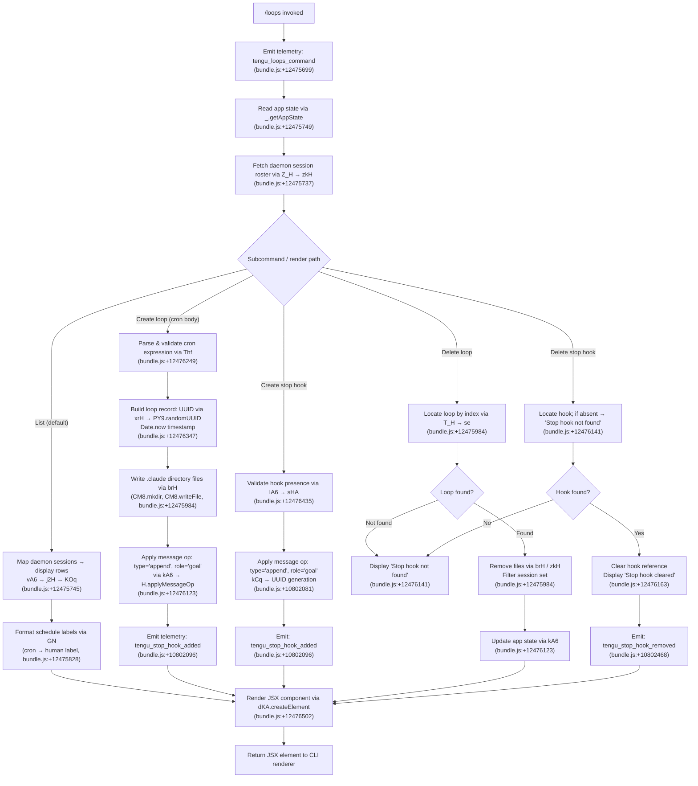

# `/loops`

> Analysis basis: CC v2.1.163 bundle.js (AST extraction + Claude interpretation)
> Minimum version: v2.1.163

---

## Overview

The `/loops` command provides a unified management interface for Claude Code's background loop (daemon) sessions. It allows users to list active loops, create new loops with cron-based scheduling and stop hooks, and delete existing loops — all from within the interactive CLI. The command renders a JSX-based UI component and coordinates with the daemon infrastructure to apply changes to application state.

---

## Registration

| Field | Value |
|---|---|
| type | `local-jsx` |
| name | `loops` |
| description | `List, create, and delete loops` |
| loc_byte | `12476742` |
| loc_byte_end | `12476899` |
| loc_line | `8927` |
| immediate | `true` |
| module_id | `B8K` |
| load_inline | `true` |
| arbor_handler.name | `Zhf` |
| arbor_handler.fqn | `claude-2.1.163::Zhf` |
| arbor_handler.kind | `AsyncFunction` |
| arbor_handler.resolution_path | `module_id` |
| arbor_handler.n_hits | `0` |

Analysis basis: CC v2.1.163 bundle.js:+12476742

---

## Input Branching

The handler `Zhf` dispatches across five distinct sub-operations (list, create loop body, create stop hook, delete loop, delete stop hook), plus auxiliary helpers for cron parsing and schedule formatting. A Mermaid flowchart is required.



---

## Behavioral Spec

### 1. Entry Point and Telemetry (`Zhf`)

The top-level handler `Zhf` is an `AsyncFunction` resolved via `module_id` path into module `B8K`.

```
async function loopsCommandHandler(context):
    emit telemetry("tengu_loops_command")          // bundle.js:+12475699
    featureCheck = checkFeatureGate(context)       // c, bundle.js:+12475697
    sessionRoster = fetchSessionRoster(context)    // Z_H, bundle.js:+12475737
    displayRows = buildDisplayRows(context)        // vA6, bundle.js:+12475745
    appState = context.getAppState()               // bundle.js:+12475749
    formattedSchedules = appState.loops.map(       // bundle.js:+12475777
        loop => formatScheduleLabel(loop)          // GN
    )
    uiElement = renderLoopsComponent(              // dKA.createElement, bundle.js:+12476502
        sessionRoster, displayRows, formattedSchedules, handlers
    )
    return uiElement
```

Analysis basis: CC v2.1.163 bundle.js:+12475697

---

### 2. Session Roster Fetch (`Z_H` → `zkH`)

`Z_H` is a thin wrapper that calls the core roster-reader `zkH`, then passes results to `KE` for normalization.

```
async function fetchSessionRoster(context):
    roster = await readDaemonSessionFiles(context)   // zkH, bundle.js:+4872327
    normalized = normalizeSessions(roster)           // KE, bundle.js:+4872363
    return normalized

async function readDaemonSessionFiles(context):
    basePath = buildBasePath()                       // I7H → bM8.join, bundle.js:+4870270
    rawJson = await fs.readFile(basePath, "utf-8")   // bundle.js:+4870339
    parsed = parseJsonSafe(rawJson)                  // Q6, bundle.js:+4870320
    if not Array.isArray(parsed):                    // bundle.js:+4870483
        return []
    sessions = parsed.map(entry => parseSessionEntry(entry))  // v, bundle.js:+4870662
    serialized = serialize(sessions)                 // SH → JSON.stringify, bundle.js:+4870709
    normalized = normalizeInput(serialized)          // nI, bundle.js:+4870731
    return sessions
```

Analysis basis: CC v2.1.163 bundle.js:+4872327

---

### 3. Display Row Builder (`vA6` → `j2H`)

Builds the tabular display data shown to the user in the list view.

```
function buildDisplayRows(context):
    columnMap = new Map()                          // j2H → K.set, bundle.js:+8983940
    mappedColumns = mapColumnHeaders(columnMap)    // KOq → H.map, bundle.js:+8983709
    rows = []
    for each session in sessions:
        rows.push(formatRow(session))              // A.push, bundle.js:+10801534
    return rows
```

Column padding uses a width of 40 characters.
Analysis basis: CC v2.1.163 bundle.js:+8983940

---

### 4. Schedule Label Formatter (`GN`)

Converts cron expressions into human-readable labels for display.

```
function formatScheduleLabel(cronString):
    trimmed = cronString.trim()                    // bundle.js:+4868111
    if trimmed matches minute-only pattern:        // K.match, bundle.js:+4868252
        minuteVal = parseInt(match)                // bundle.js:+4868287
        if minuteVal == 0:
            return "Every hour"                    // bundle.js:+4868448
        return "Every " + minuteVal + " min"       // "Every minute", bundle.js:+4868231
    if trimmed matches day-of-week range pattern:  // L.match, bundle.js:+4868522
        dayIndex = parseInt(match)                 // bundle.js:+4868287
        // Day-of-week arithmetic: getUTCDay, setUTCDate, setUTCHours
        // range "1-5" => weekday label            // bundle.js:+4869155
        date = new Date()
        date.setUTCDay(dayIndex)                   // bundle.js:+4868988
        date.setUTCDate(...)                       // bundle.js:+4869007
        date.setUTCHours(...)                      // bundle.js:+4869038
        return date.toString()                     // bundle.js:+4868656
    if trimmed matches generic cron pattern:
        return $.match(pattern)                    // bundle.js:+4868920
    return trimmed
```

Analysis basis: CC v2.1.163 bundle.js:+4868111

---

### 5. Cron Expression Validator/Parser (`Thf`)

Validates user-supplied cron strings before loop creation.

```
function validateAndParseCron(input):
    match = input.match(cronPattern)               // H.match, bundle.js:+12475285
    if not match:
        return null
    fields = match.map(parseInt)                   // bundle.js:+12475322
    // Field bounds:
    //   minutes: max(0, 59)    bundle.js:+12475464
    //   hours: max(0, 23)      bundle.js:+12475535
    //   dom: max(1, 31)        bundle.js:+12475588
    //   seconds: max(0, 60)    bundle.js:+12475430
    minute = Math.max(0, Math.ceil(fields[0]))     // bundle.js:+12475407, +12475418
    result = Math.round(minute)                    // bundle.js:+12475491
    normalized = normalizeInput(result)            // nI, bundle.js:+12475655
    return normalized
```

Numeric bounds found in literals: minutes 0–59, hours 0–23, days 1–31, seconds 0–60.
Analysis basis: CC v2.1.163 bundle.js:+12475285

---

### 6. Loop Creation Writer (`xrH`)

Generates a new loop record and persists it to disk.

```
async function createLoop(loopConfig, context):
    id = crypto.randomUUID()                       // PY9.randomUUID, bundle.js:+4871667
    createdAt = Date.now()                         // bundle.js:+4871729
    metadata = buildLoopMetadata(id, createdAt)    // LEH, bundle.js:+4871775
    sessionFiles = await readDaemonSessionFiles()  // zkH, bundle.js:+4871819
    // Persist loop entry
    await writeLoopFiles(metadata)                 // brH, bundle.js:+4871926
    scheduleList.push(metadata)                    // M.push, bundle.js:+4871832
    await tickClock()                              // h6 → uv, bundle.js:+4871864
    await emitLoopRecord()                         // nr, bundle.js:+4871913
    return metadata
```

Loop files are written under the `.claude` directory (bundle.js:+4871508) using `CM8.mkdir` and `CM8.writeFile`.
Analysis basis: CC v2.1.163 bundle.js:+4871667

---

### 7. Loop File Writer (`brH`)

Low-level writer called by both create and update paths.

```
async function writeLoopFiles(metadata):
    basePath = buildBasePath()                     // K4, bundle.js:+4871476
    await fs.mkdir(basePath, {recursive: true})    // CM8.mkdir, bundle.js:+4871487
    filePath = path.join(basePath, ".claude", id)  // bM8.join, bundle.js:+4871497
    entries = metadata.map(entry => serialize(entry))  // H.map, bundle.js:+4871548
    await fs.writeFile(filePath, serialized)       // CM8.writeFile, bundle.js:+4871584
    pathRecord = buildPathRecord()                 // I7H, bundle.js:+4871598
    checksum = computeChecksum(pathRecord)         // SH → JSON.stringify, bundle.js:+4871605
```

Analysis basis: CC v2.1.163 bundle.js:+4871476

---

### 8. Stop Hook Operations (`kA6` / `IA6`)

**Set stop hook (`kA6`):**

```
async function setStopHook(hookConfig, context):
    tick = clockTick()                             // h6, bundle.js:+10802202
    displayRow = buildDisplayRow()                 // vA6, bundle.js:+10802209
    currentState = context.getAppState()           // H.getAppState, bundle.js:+10802213
    newState = applyStopHookToState(currentState, hookConfig)
    context.setAppState(newState)                  // H.setAppState, bundle.js:+10802342
    context.applyMessageOp({                       // H.applyMessageOp, bundle.js:+10802411
        type: "append",                            // bundle.js:+10802434
        role: "goal",                              // bundle.js:+10802502
    })
    msgId = generateUUID()                         // kCq → NCq.randomUUID, bundle.js:+10802562
    context.createMessage({                        // c, bundle.js:+10802466
        type: "attachment",                        // bundle.js:+10802544
    })
    emit telemetry("tengu_stop_hook_added")        // bundle.js:+10802096
    emit telemetry("tengu_stop_hook_removed")      // on clear path
    display("Stop hook set")                       // bundle.js:+12476459
```

**Delete stop hook (`IA6`):**

```
async function deleteStopHook(hookRef, context):
    config = resolveConfig()                       // sHA → _B / UD, bundle.js:+10801710
    gate = checkHooksGate()                        // "hooks_gate", bundle.js:+10801606
    trustGate = checkTrustGate()                   // "trust_gate", bundle.js:+10801660
    goalStatus = getGoalStatus()                   // "goal_status", bundle.js:+10802631
    tick = clockTick()                             // h6, bundle.js:+10801773
    displayRow = buildDisplayRow()                 // vA6, bundle.js:+10801791
    currentState = context.getAppState()           // bundle.js:+10801795
    timestamp = Date.now()                         // bundle.js:+10801959
    outputTokens = countOutputTokens()             // ED → "outputTokens", bundle.js:+43795
    context.setAppState(newState)                  // _.setAppState, bundle.js:+10801997
    context.applyMessageOp({                       // _.applyMessageOp, bundle.js:+10802039
        type: "append",
        role: "goal"
    })
    msgId = generateUUID()                         // kCq, bundle.js:+10802081
    createMessage(context)                         // c, bundle.js:+10802094
    emit telemetry("tengu_stop_hook_added")        // bundle.js:+10802096
    display("Stop hook set")                       // bundle.js:+12476459
```

If no hook is found, the string `"Stop hook not found"` is displayed (bundle.js:+12476141).
If a hook is successfully cleared, the string `"Stop hook cleared"` is displayed (bundle.js:+12476163).

Analysis basis: CC v2.1.163 bundle.js:+12476123, +12476435

---

### 9. Loop Deletion / Stop Hook Filtering (`T_H`)

```
async function deleteLoop(loopRef, context):
    hasLoop = checkLoopExists(loopRef)             // se → _.has, bundle.js:+53236
    sessions = await readDaemonSessionFiles()      // zkH, bundle.js:+4872046
    remaining = sessions.filter(                   // q.filter, bundle.js:+4872055
        s => not deletedSet.has(s.id)              // A.has, bundle.js:+4872070
    )
    await writeLoopFiles(remaining)                // brH, bundle.js:+4872119
    return remaining
```

Analysis basis: CC v2.1.163 bundle.js:+4871997

---

### 10. Input Normalizer (`nI` / `UrL`)

Used in both cron validation and display normalization paths.

```
function normalizeInput(raw):
    trimmed = raw.trim()                           // H.trim, bundle.js:+4866940
    parts = parseInputParts(trimmed)               // UrL, bundle.js:+4867026
    result.push(parts)                             // A.push, bundle.js:+4867061
    return result

function parseInputParts(str):
    segments = str.split(delimiter)               // H.split, bundle.js:+4866360
    for each segment:
        match = segment.match(pattern)            // L.match, bundle.js:+4866380
        if match:
            value = parseInt(match)               // bundle.js:+4866425
            // Numeric bounds: 3, 5, 6, 7, 10    // bundle.js:+4866601..+4866888
            resultSet.add(value)                  // K.add, bundle.js:+4866486
    return Array.from(resultSet)                  // bundle.js:+4866888
```

Analysis basis: CC v2.1.163 bundle.js:+4866940

---

## State & Side Effects

| Item | Detail |
|---|---|
| Telemetry: `tengu_loops_command` | Fired once on every `/loops` invocation (bundle.js:+12475699) |
| Telemetry: `tengu_stop_hook_added` | Fired when a new loop or stop hook is created (bundle.js:+10802096) |
| Telemetry: `tengu_stop_hook_removed` | Fired when a stop hook is cleared/deleted (bundle.js:+10802468) |
| Telemetry: `tengu_bg_dispatch_sigkill_escalate` | Fired during daemon escalation (bundle.js:+16133292) |
| Telemetry: `tengu_feature_ok` / `tengu_feature_bad` / `tengu_feature_sad` | Feature gate outcomes (bundle.js:+1010222, +1010284, +1010365) |
| Telemetry: `tengu_bg_low_mem_mb` / `tengu_bg_dispatch_low_mem` | Low-memory guard events (bundle.js:+13015224, +16133893) |
| Telemetry: `tengu_bg_adopt_sock_unlinked` | Daemon socket adopt event (bundle.js:+13488833) |
| Telemetry: `tengu_daemon_idle_exit` | Daemon idle-exit event (bundle.js:+16153957) |
| Telemetry: `tengu_bg_spare_enable` / `tengu_bg_spare_claim` / `tengu_bg_spare_claim_fail` | Spare daemon slot events (bundle.js:+16134597, +16134725, +16134991) |
| Telemetry: `tengu_bg_sendclaim_failed` | Daemon claim-send failure (bundle.js:+16113022) |
| Telemetry: `tengu_bg_state_read_transient` | Transient state read (bundle.js:+4160358) |
| Telemetry: `tengu_daemon_config_reload` | Daemon config reload (bundle.js:+16148704) |
| Telemetry: `tengu_daemon_control` | Daemon control lifecycle (bundle.js:+16170260) |
| Telemetry: `tengu_mcp_skills` | MCP skills sync (bundle.js:+6952647) |
| Telemetry: `tengu_skill_file_changed` | Skill file watcher event (bundle.js:+14157870) |
| appState changes | `setAppState`, `applyMessageOp` with `type:"append"`, `role:"goal"` (bundle.js:+10801997, +10802039) |
| File I/O | Creates/reads/deletes files under `.claude/` directory; uses `CM8.mkdir`, `CM8.writeFile`, `fs.readFile`, `PD.rm`, `PD.unlink` |
| Hook registration | Stop hooks registered/cleared via `kA6` / `IA6`; strings `"stophook"` (bundle.js:+12475881), `"hooks_gate"` (bundle.js:+10801606) |
| UUID generation | `PY9.randomUUID` for loop IDs (bundle.js:+4871667), `NCq.randomUUID` for message IDs (bundle.js:+10802562) |
| JSX render | `dKA.createElement` produces the UI component returned to the CLI renderer (bundle.js:+12476502) |
| Cron type | Loop type string `"cron"` used to tag records (bundle.js:+12475795) |
| Daemon interaction | `Z_H` → `zkH` reads daemon session JSON; `w` (daemon session runner) handles `SIGKILL` escalation, memory checks, socket adoption |
| Sound | <!-- TODO: not found in depth-2 traversal; needs --depth 4 --> |

---

## Version History

| Version | Change |
|---|---|
| v2.1.163 | Initial analysis |

---

## Common Mistakes

1. **Providing an invalid cron expression** — The `Thf` validator enforces strict field bounds (minutes 0–59, hours 0–23, DOM 1–31). Expressions outside these ranges will not produce a loop. Use simple patterns like `* * * * *` or minute-interval forms.
2. **Expecting immediate daemon execution** — Loop creation writes files and updates app state, but the daemon's actual scheduling is driven by the background daemon infrastructure (`w`, `IDA`, `EDA`). There is no synchronous execution upon `/loops` return.
3. **Assuming stop hooks persist across session resets** — Stop hooks are tied to the `goal` message op chain in app state. Clearing state or starting a fresh session will remove them; `"Stop hook not found"` will be displayed on the next delete attempt.
4. **Confusing loop deletion with daemon session termination** — `/loops` deletes the loop record from `.claude/` files and filters it from the roster, but does not send `SIGKILL` or `SIGTERM` to any running daemon process. Use the daemon management layer for process termination.
5. **Missing `.claude` directory** — If the project root does not contain a `.claude` directory, `brH` will attempt to create it via `CM8.mkdir`. Ensure write permissions exist on the project root.

---

## Appendix — Identifier Mapping

> For bundle debugging only. Identifiers change across versions.

| Identifier | Role |
|---|---|
| `Zhf` | Top-level `/loops` command handler (AsyncFunction, entry point) |
| `c` | Feature gate check helper |
| `Z_H` | Session roster fetch wrapper |
| `zkH` | Core daemon session file reader |
| `Q6` | JSON-safe parser |
| `I7H` | Base path record builder |
| `K4` | Path constructor helper |
| `s1` | Session entry parser helper |
| `v8` | Error code classifier |
| `kH` | Session normalization / error-handling pipeline |
| `HA` | Error wrapper (uses `Error`, `String`) |
| `eH` | String coercion helper |
| `Dq` | Essential-traffic classifier |
| `HW4` | Queue shift/push helper (sliding window) |
| `v` | HTTP fetch / bootstrap fetch helper |
| `ccK` | Bootstrap content-type handler |
| `H` | Bootstrap fetch dispatcher |
| `SH` | JSON.stringify wrapper |
| `J4` | URL/path string manipulator |
| `ppH` | h2A wrapper (path helper) |
| `icK` | Buffer byte-length / file upload helper |
| `nI` | Input normalizer (trim + parse) |
| `UrL` | Cron/range segment parser |
| `A` | General array accumulator (context-dependent) |
| `L` | File/socket lifecycle manager |
| `q` | Deletion/cleanup set |
| `f` | Promise/stream finalizer |
| `KE` | Session roster normalizer |
| `uv` | Clock tick utility |
| `vA6` | Display row builder |
| `j2H` | Column map setter |
| `K` | Column map / general map (context-dependent) |
| `KOq` | Column header mapper |
| `h6` | Clock tick wrapper |
| `GN` | Schedule label formatter (cron → human string) |
| `w` | Daemon session runner / background process manager |
| `l8` | Abort/timeout helper |
| `O` | Background session tag object |
| `RH` | Daemon background session create emitter |
| `P6` | Nu6 wrapper |
| `hH` | Feature-ok emitter |
| `Nb8` | macOS memory check helper |
| `D6` | Memory/resource deduplication tracker |
| `zX6` | Pins JSON reader |
| `KT_` | pins.json path builder |
| `B6` | JSON.parse wrapper |
| `R8` | v8 error code re-classifier |
| `JBL` | Loop directory reader (readdir + readFile per entry) |
| `g` | Daemon process retire/kill manager |
| `x` | clearInterval wrapper |
| `L4H` | Output trim helper |
| `C` | Rate-limit enqueue helper |
| `Q` | Idle-exit / supervisor writer |
| `j` | Process kill set manager |
| `EDA` | Daemon claim sender (socket connect + write) |
| `e5A` | Daemon workspace initializer (mkdir + writeFile) |
| `z55` | Send-claim timeout/retry handler |
| `O55` | Claim frame builder |
| `tf` | v8 thin wrapper |
| `EH` | String coercion error helper |
| `zg` | Binary frame encoder (Buffer ops) |
| `IDA` | Daemon loop session lifecycle manager |
| `yK` | Loop path builder (k2.join + cE) |
| `e9` | Loop state file reader/updater |
| `jY` | Active-state resolver ($N) |
| `ff` | SH/oj path formatter |
| `q16` | Daemon status poller (Date.now + BXf) |
| `kMH` | HO.join + abH path helper |
| `VT` | H.split + HO.join path helper |
| `Xg` | Q_A + _16 path helper |
| `Vh6` | l_A + HO.join directory helper |
| `Y` | Daemon config reload / writer manager |
| `D` | Forced-shutdown / process.exit handler |
| `IJ` | Forced-shutdown label |
| `z` | Daemon stop sequencer |
| `F` | Disposable resource handle |
| `$` | TKK dispatcher |
| `TKK` | Daemon status JSON writer |
| `nr` | L4H output trim caller |
| `N9` | FZL.getStore async-local-storage reader |
| `JR6` | daemon.status.json path builder |
| `J` | Date/UTC day manipulator |
| `T_H` | Loop deletion filter (se + zkH + brH) |
| `se` | Loop existence check (_.has) |
| `brH` | Loop file writer (mkdir + writeFile) |
| `kA6` | Set stop hook handler |
| `kCq` | UUID generator for message IDs |
| `W6` | Nu6 wrapper (alternate path) |
| `Nu6` | Core UUID/message ID primitive |
| `Thf` | Cron expression validator and parser |
| `xrH` | New loop record creator |
| `LEH` | Loop metadata builder |
| `M` | MCP session / loop registry |
| `AbH` | MCP connection slot processor |
| `bl` | MCP slot config builder |
| `fk` | MCP oO/Mb_ slot helper |
| `__` | Underscore passthrough |
| `sk6` | MCP slot filter helper |
| `rkq` | MCP retry/timestamp tracker |
| `bY8` | CY8/GP MCP helper |
| `SY8` | M4 MCP helper |
| `O8` | MCP debug log pusher |
| `os_` | OAuth flow initiator |
| `as_` | OAuth callback handler |
| `Kyq` | MCP async connection helper |
| `rs_` | MCP GP/M4/O8 result handler |
| `Ab_` | MCP A.includes inclusion check |
| `FN` | D6 MCP skills emitter |
| `I` | Chokidar file watcher entry |
| `T7` | MCP error log pusher |
| `tkq` | hB MCP helper |
| `zA6` | parseInt MCP slot helper |
| `SI8` | parseInt MCP slot helper (alternate) |
| `tU8` | MCP connection result applier |
| `_bH` | VXH MCP helper |
| `mk` | MCP cleanup + FN handler |
| `VYA` | MCP remote server retry manager |
| `mY8` | aY7/qb_ MCP set membership checker |
| `$A6` | VXH MCP slot helper |
| `IA6` | Delete stop hook / clear handler |
| `sHA` | _B/UD/U_/Lf config resolver |
| `_B` | x8 policy-settings accessor |
| `x8` | Pl6/Kd low-level config reader |
| `UD` | x8/SA config normalizer |
| `U_` | Trust gate accessor |
| `Lf` | YTL path resolver |
| `YTL` | eH/qpH/Z9/S6/qlH/aQ/b6 config path builder |
| `s6` | c/P6 feature-sad emitter |
| `ED` | outputTokens / Object.values token counter |

---

Note: index built via Arbor fallback; some signals (telemetry, literals) may be missing — see arbor-fallback.js.