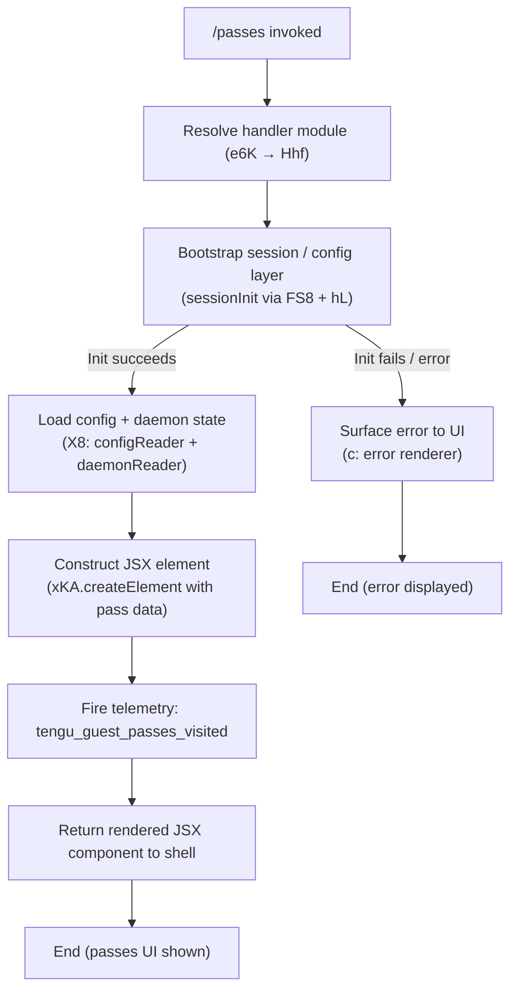

# `/passes`

> Analysis basis: CC v2.1.163 bundle.js (AST extraction + Claude interpretation)
> Minimum version: v2.1.163

---

## Overview

The `/passes` command lets the current Claude Code user share a free week of Claude Code access with friends via "guest passes." It renders a JSX-based UI component that presents pass information, records a telemetry visit event (`tengu_guest_passes_visited`), and delegates session/config infrastructure to the daemon and configuration subsystems.

---

## Registration

| Field | Value |
|---|---|
| type | `local-jsx` |
| name | `passes` |
| description | `Share a free week of Claude Code with friends` |
| loc_byte | `12425261` |
| loc_byte_end | `12425583` |
| loc_line | `8829` |
| isHidden | `null` (not hidden) |
| module_id | `e6K` |
| load_inline | `true` |
| arbor_handler.name | `Hhf` |
| arbor_handler.fqn | `claude-2.1.163::Hhf` |
| arbor_handler.kind | `AsyncFunction` |
| arbor_handler.resolution_path | `module_id` |
| arbor_handler.n_hits | `2` |

Analysis basis: CC v2.1.163 bundle.js:+12425261

---

## Input Branching

The command's entry handler (`Hhf`) follows a moderately branched flow: it initialises the session/config layer, renders the JSX component, and gates on whether the daemon background infrastructure is available. Three meaningful branches exist (session bootstrap success/failure, JSX render, telemetry fire), so a flowchart is appropriate.



---

## Behavioral Spec

### Handler Entry — `Hhf` (passesCommandHandler)

The Arbor-resolved handler is an `AsyncFunction` reached via `module_id → e6K`. It is the sole top-level entry point for the `/passes` command.

```
async function passesCommandHandler(context):
    sessionRef   = await sessionInit(context)          // FS8 + hL path
    configState  = await configAndDaemonReader(context) // X8 path
    element      = createElement(PassesComponent, {
                       session: sessionRef,
                       config:  configState
                   })
    fireEvent("tengu_guest_passes_visited")
    return element
```

Analysis basis: CC v2.1.163 bundle.js:+12424944 (Hhf→S6), +12424978 (Hhf→FS8), +12424984 (Hhf→X8), +12425082 (Hhf→c), +12425133 (Hhf→xKA.createElement)

---

### Session Bootstrap — `sessionInit` / `FS8` + `hL`

`FS8` (sessionFacade) prepares the runtime session object before any UI is rendered. It calls `hL` (sessionLoader) which in turn drives `zY` (authResolver). `zY` coordinates:

- `L4` (eHWrapper) — React/Ink layer initialisation
- `Bj` (profileBuilder) — constructs auth profile from stored credentials or OAuth token (`user_oauth`, `profile-implicit`)
- `DO` (authOrchestrator) — full auth flow, including checking for `ANTHROPIC_API_KEY`, `apiKeyHelper`, and related env vars; throws if none of the required credentials are present
- `S6` (configFileWatcher) — begins watching the config file for live changes

The literal `"ANTHROPIC_API_KEY, ANTHROPIC_AUTH_TOKEN, CLAUDE_CODE_OAUTH_TOKEN, or WIF env vars (ANTHROPIC_FEDERATION_RULE_ID + ANTHROPIC_ORGANIZATION_ID) required"` (bundle.js:+2999533) is the error message surfaced when no valid auth is found.

```
function sessionInit(context):
    session = sessionFacade(context)        // FS8
    loader  = sessionLoader(session)        // hL → zY
    profile = buildProfile(loader)          // Bj
    auth    = orchestrateAuth(profile)      // DO
    if not auth.valid:
        throw AuthError(MISSING_CREDENTIAL_MESSAGE)
    watchConfig(session)                    // S6 / XTL
    return session
```

Analysis basis: CC v2.1.163 bundle.js:+12035835 (FS8→hL), +3017849 (hL→zY), +2997250 (zY→DO), +2999533 (literal)

---

### Config & Daemon Reader — `X8` (configAndDaemonReader)

`X8` orchestrates two parallel concerns:

1. **Config loading** — calls `bDH` (configLoader) which reads the config file synchronously (`q.readFileSync` with `"utf-8"` encoding), parses JSON via `B6` (jsonParser), and validates fields. Recognised status literals for internal bookkeeping: `"unknown"`, `"local"`, `"migrated"`, `"native"`, `"installed"`, `"disabled"`, `"enabled"`, `"no_permissions"`, `"global"`, `"not_configured"` (bundle.js:+3257345–+3257572).
2. **Daemon state reader** — calls `SX_` (daemonStateReader) which manages locking (`"Lock acquisition took longer than expected…"` at bundle.js:+3259818), creates directories as needed (`L.mkdirSync`), and writes config atomically via `TM6` (atomicFileWriter). Backup rotation keeps at most **5** backups (bundle.js:+3260837); backup filenames contain the marker `".backup."` (bundle.js:+3260704).

Guard conditions found in config loading:

- `"Config accessed before allowed."` — thrown when config is read before the subsystem is ready (bundle.js:+3261851)
- `"ENOENT"` — handled gracefully; treated as first-run / no-config state (bundle.js:+3262081)
- `"EEXIST"` — directory already exists; suppressed (bundle.js:+3262696)
- `"error"` code branch (bundle.js:+3262402) — triggers `tengu_config_parse_error` telemetry

```
async function configAndDaemonReader(context):
    raw     = readFileSync(configPath, "utf-8")    // bDH + q.readFileSync
    parsed  = jsonParse(raw)                       // B6
    if parseFailed:
        emit("tengu_config_parse_error")
        parsed = {}
    daemonState = daemonStateReader(context)       // SX_
    if lockContended:
        emit("tengu_config_lock_contention")
    if staleWrite detected:
        emit("tengu_config_stale_write")
    if authLossPrevented:
        emit("tengu_config_auth_loss_prevented")
    return merge(parsed, daemonState)
```

Analysis basis: CC v2.1.163 bundle.js:+3256721 (X8→SX_), +3256902 (X8→bDH), +3261907 (bDH→readFileSync), +3261954 (bDH→B6), +3259907 (tengu_config_lock_contention), +3260043 (tengu_config_stale_write), +3260386 (tengu_config_auth_loss_prevented)

---

### Daemon Background Infrastructure (reached transitively via `X8` → `w`)

`w` (daemonWorkerManager) is a substantial subsystem reached through the config/state reader. Relevant behaviors observable from the call graph and literals:

- **Spawn lifecycle states**: `"spare"`, `"exec"`, `"claimed"`, `"spawned"`, `"idle"`, `"working"`, `"active"`, `"bg"`, `"daemon"`, `"resuming"`, `"crashed"`, `"blocked"`, `"done"`, `"killed"`, `"stopped"`, `"failed"` (bundle.js:+16134084–+16141186)
- **Low-memory handling**: `Nb8` checks free memory; threshold is **1024** units on macOS (bundle.js:+13015246); escalates to SIGKILL (`tengu_bg_dispatch_sigkill_escalate`) when low-memory persists
- **Spare pool management**: `tengu_bg_spare_enable`, `tengu_bg_spare_claim`, `tengu_bg_spare_claim_fail`
- **Idle timeout**: **300000 ms** (5 minutes) before idle session cleanup (bundle.js:+16140972)
- **Forced shutdown**: triggered via `D` (shutdownOrchestrator) with message `"forced shutdown"` (bundle.js:+16166582), calling `process.exit` and `z.abort`

The `/passes` command itself does not directly control daemon lifecycle; these paths are traversed as part of the session state query.

Analysis basis: CC v2.1.163 bundle.js:+16134594 (w→D6), +16133292 (tengu_bg_dispatch_sigkill_escalate), +16134725 (tengu_bg_spare_claim)

---

### JSX Render — `xKA.createElement`

After config and session state are resolved, `Hhf` calls `xKA.createElement` (bundle.js:+12425133) to construct the passes UI component. The `local-jsx` registration type means the return value is a React/Ink element tree rendered directly into the CLI terminal frame. No prompt text is sent to the model; this command is purely UI-driven.

```
function renderPassesUI(session, config):
    return createElement(PassesComponent, {
        session: session,
        config:  config
    })
```

Analysis basis: CC v2.1.163 bundle.js:+12425133

---

## State & Side Effects

| Item | Detail |
|---|---|
| Telemetry — `tengu_guest_passes_visited` | Fired once on every invocation of `/passes` (bundle.js:+12425084) |
| Telemetry — `tengu_config_parse_error` | Fired if the config file cannot be parsed as JSON (bundle.js:+3262482) |
| Telemetry — `tengu_config_lock_contention` | Fired when config lock acquisition is slow (bundle.js:+3259907) |
| Telemetry — `tengu_config_stale_write` | Fired on stale write detection (bundle.js:+3260043) |
| Telemetry — `tengu_config_auth_loss_prevented` | Fired when a write would have erased stored auth (bundle.js:+3260386) |
| Telemetry — `tengu_bg_dispatch_sigkill_escalate` | Fired by daemon on SIGKILL escalation under low memory (bundle.js:+16133292) |
| Telemetry — `tengu_bg_spare_enable` | Fired when daemon spare pool is enabled (bundle.js:+16134597) |
| Telemetry — `tengu_bg_spare_claim` | Fired on successful spare session claim (bundle.js:+16134725) |
| Telemetry — `tengu_bg_spare_claim_fail` | Fired on spare session claim failure (bundle.js:+16134991) |
| Telemetry — `tengu_bg_sendclaim_failed` | Fired when background send-claim fails (bundle.js:+16113022) |
| Telemetry — `tengu_bg_low_mem_mb` | Emitted with MB value when low memory detected (bundle.js:+13015224) |
| Telemetry — `tengu_bg_dispatch_low_mem` | Fired on low-memory dispatch path (bundle.js:+16133893) |
| Telemetry — `tengu_bg_adopt_sock_unlinked` | Fired when daemon adopts an unlinked socket (bundle.js:+13488833) |
| Telemetry — `tengu_bg_retire_pinned_low_mem` | Fired when pinned workers are retired due to low memory (bundle.js:+16137897) |
| Telemetry — `tengu_bg_prewarm_per_sweep` | Fired during daemon prewarm sweep (bundle.js:+16138018) |
| Telemetry — `tengu_daemon_control` | Fired on daemon control events (bundle.js:+16170260) |
| Telemetry — `tengu_daemon_config_reload` | Fired when daemon reloads config (bundle.js:+16148704) |
| Telemetry — `tengu_feature_ok` / `tengu_feature_bad` | Feature flag check result (bundle.js:+1010222 / +1010284) |
| Config file | Read synchronously; config lock is acquired; write is atomic with backup rotation (max 5 backups) |
| Config auth guard | Refuses to write if cached auth would be wiped (see GH #3117 guards) |
| JSX render | Renders a terminal UI element; no model prompt is issued |
| Hook registration | `j9` calls `MXA.register` (bundle.js:+60323) — registers a file-watch hook during session setup |
| Sound | None detected in depth-2 traversal |

---

## Version History

| Version | Change |
|---|---|
| v2.1.163 | Initial analysis |

---

## Common Mistakes

1. **Invoking `/passes` without valid credentials** — The session bootstrap (`DO` / `authOrchestrator`) will throw with the message requiring one of `ANTHROPIC_API_KEY`, `ANTHROPIC_AUTH_TOKEN`, `CLAUDE_CODE_OAUTH_TOKEN`, or WIF env vars. Ensure at least one credential is configured before invoking.
2. **Expecting a model response** — `/passes` is a `local-jsx` command; it renders a UI component directly and never sends a prompt to the Claude model. No AI-generated text will appear.
3. **Confusing `/passes` with a billing command** — The command surfaces guest pass sharing UI only; it does not manage subscriptions, token balances, or payment methods.
4. **Concurrent Claude instances corrupting config** — The config lock contention warning (`"Lock acquisition took longer than expected…"`) signals another Claude instance is writing config. Running multiple Claude Code instances simultaneously increases the risk of stale-write events.
5. **Expecting a response when daemon is unavailable** — If the daemon background worker is not running or its socket is unlinked, the session state query may surface empty or degraded pass data without an explicit error.

---

## Appendix — Identifier Mapping

> For bundle debugging only. Identifiers change across versions.

| Identifier | Role |
|---|---|
| `Hhf` | Main handler (`passesCommandHandler`) — AsyncFunction, Arbor-resolved via module_id |
| `S6` | Config file watcher / session watcher coordinator |
| `Q6` | Shared utility (called from multiple subsystems; likely a logging/error helper) |
| `vX_` | Unknown utility called from session watcher |
| `bDH` | Config file loader (reads, parses, validates config JSON) |
| `q` | Filesystem operations namespace (readFileSync, statSync, mkdirSync, etc.) |
| `B6` | JSON parser wrapper |
| `vx` | String prefix checker (uses `.startsWith` / `.slice`) |
| `H` | HTTP/fetch bootstrap helper (`[Bootstrap] Fetching`) |
| `_` | Filesystem helper (readdirStringSync, statSync) |
| `v8` | Unknown low-level utility |
| `fr1` | Backup directory enumerator |
| `RX_` | Backup path resolver (uses `pD.join` / `a8`) |
| `M` | Cached-map accessor (uses `.get`, `.values`) |
| `$` | Config state accessor |
| `v` | Config value formatter / logger (includes `"debug"` literal) |
| `ccK` | Config cache coordinator (`Vy`, `dcK`, `OXA`) |
| `SH` | JSON stringifier wrapper |
| `J4` | String/path manipulation helper (replace, lastIndexOf, slice) |
| `ppH` | Unknown helper calling `h2A` |
| `icK` | File content reader with byte-length check (`Buffer.byteLength`) |
| `c` | Error / UI renderer |
| `w` | Daemon worker manager (spawn, retire, low-memory handling) |
| `A` | Worker map (`.get`, `.set`, `.values`) |
| `b` | Worker process handle (`.kill`) |
| `l8` | Abort / timeout helper (`setTimeout`, `clearTimeout`) |
| `RH` | Background session creator |
| `hH` | Background session helper |
| `Nb8` | Memory monitor (macOS freemem check, threshold 1024) |
| `zX6` | Session roster file reader |
| `kH` | Worker health checker |
| `g` | Process retire/respawn controller |
| `D6` | Session dispatch coordinator |
| `EDA` | Socket connection manager (`JB8.connect`, `f.write`) |
| `IDA` | Session lifecycle manager (states: done/killed/stopped/failed/crashed/blocked) |
| `L` | Session lifecycle sub-handler (add/finally/delete) |
| `D` | Shutdown orchestrator (`process.exit`, `z.abort`) |
| `P6` | Unknown small helper (calls `Nu6`) |
| `F` | Disposable resource holder (`.dispose`) |
| `XTL` | Config file watcher (uses `a98.watchFile` / `a98.unwatchFile`) |
| `No` | Unknown watcher callback |
| `j9` | Hook registrar (calls `MXA.register`) |
| `FS8` | Session facade / pre-render coordinator |
| `hL` | Session loader (calls `zY` and `S6`) |
| `zY` | Auth resolver top-level coordinator |
| `L4` | React/Ink environment wrapper |
| `Bj` | Auth profile builder (OAuth, profile-implicit) |
| `Z7` | Auth type classifier (`firstParty`) |
| `pX` | Unknown auth helper |
| `DO` | Auth orchestrator (validates credentials, throws if missing) |
| `Aw6` | JcH wrapper utility |
| `JcH` | Auth environment helper |
| `X8` | Config and daemon state reader (top-level for this command) |
| `SX_` | Daemon state reader / atomic config writer |
| `wP1` | Config write helper (`Object.assign`) |
| `v5_` | Config write sub-helper (`DP1`) |
| `fj6` | Unknown config helper |
| `V` | Unknown value with `.startsWith` / `.start` |
| `P` | Terminal pager / scroll view manager |
| `J` | Sub-pager component (calls `w`) |
| `j` | Worker kill helper (`R.kill`) |
| `z` | Daemon stop controller (`hH`, `RH`, `Yh`, `Tp`) |
| `Y` | Supervisor config manager (`T.stop`, `T.start`, `T.updateConfig`) |
| `h` | Background sweep scheduler (memory, respawn, retire logic) |
| `A3A` | Vim-mode operator registry (operator, find, replace, indent, etc.) |
| `C` | Rate-limit event enqueuer (`I.enqueue`, `Pj.randomUUID`) |
| `T` | Supervisor instance |
| `TM6` | Atomic file writer (random-bytes temp file, fchmod, fsync, rename) |
| `O` | Symlink stat helper (`.isSymbolicLink`) |
| `R8` | Unknown helper calling `v8` |
| `f` | Socket/stream handle (`.close`, `.write`, `.on`, `.once`, `.end`) |
| `_lH` | Unknown config reader helper |
| `Lr1` | Object entries iterator |
| `t98` | Timestamp helper (`Date.now`) |
| `hX_` | Config hash/digest helper (calls `TM6`) |