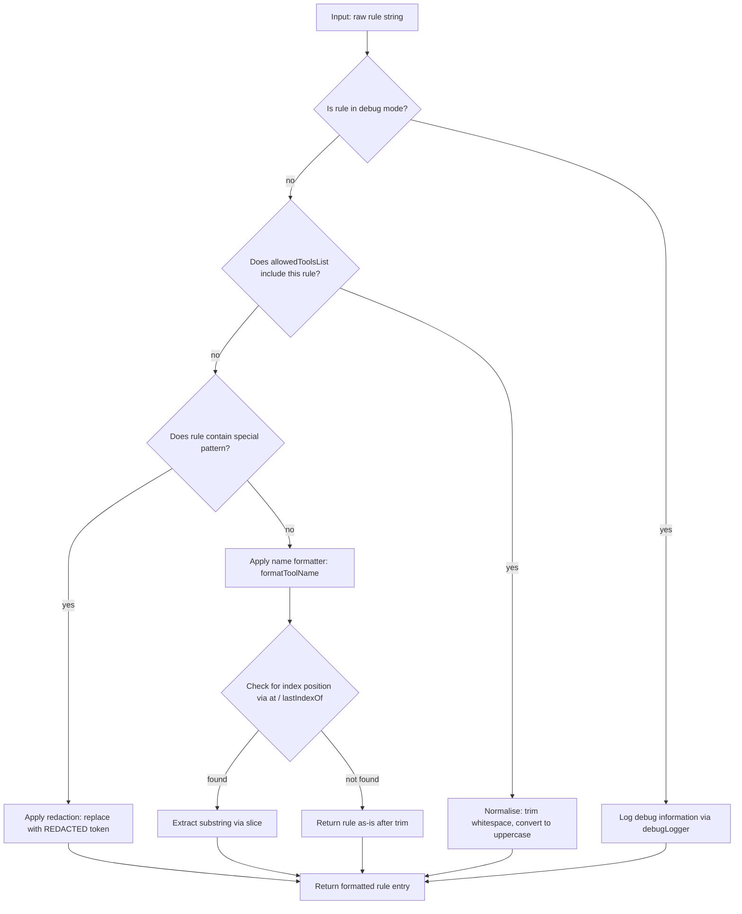

# `/permissions`

> Analysis basis: CC v2.1.163 bundle.js (AST extraction + Claude interpretation)
> Minimum version: v2.1.163

---

## Overview

The `/permissions` command (also aliased as `/allowed-tools`) provides an interactive JSX-rendered interface for viewing and managing the allow and deny rules that govern which tools Claude Code may invoke. It operates by constructing a React element tree, appending a system-level `permission_retry` message to the conversation, and generating a unique session identifier for the resulting permissions UI component.

---

## Registration

| Field | Value |
|---|---|
| type | `local-jsx` |
| name | `permissions` |
| description | Manage allow and deny tool permission rules |
| aliases | `["allowed-tools"]` |
| module_id | `b6K` |
| load_inline | `true` |
| loc_byte | `12411420` |
| loc_byte_end | `12411592` |
| loc_line | `8829` |
| arbor_handler.name | `gyf` |
| arbor_handler.fqn | `claude-2.1.163::gyf` |
| arbor_handler.kind | `AsyncFunction` |
| arbor_handler.resolution_path | `module_id` |
| arbor_handler.n_hits | `0` |

Analysis basis: CC v2.1.163 bundle.js:+12411420

---

## Input Branching

The command handler has two primary high-level paths after entry: building the JSX UI element and composing the system message for permission retry. These are sequential rather than deeply branching, so pseudocode is appropriate.

```
1. Entry: user invokes /permissions (or /allowed-tools alias)
2. Handler gyf is resolved from module b6K via load_inline
3. Build permission UI JSX element via createElement
4. Append "permission_retry" system message to conversation via applyMessageOp("append")
5. Call buildPermissionSummaryLine to produce a comma-joined summary of current rules
   └── Joins allowed/denied tool names with ", " separator
   └── Generates a random UUID for the UI session
6. Return the rendered JSX permissions management component
```

For the sub-flow inside the permission rule formatter (`permissionRuleFormatter`, i.e. `v`), there are 3+ distinct branches depending on rule type and content, so a Mermaid diagram is used below in the Behavioral Spec.

---

## Behavioral Spec

### Top-Level Handler: `permissionsCommandHandler` (`gyf`)

```
async function permissionsCommandHandler(context):
    // Create the JSX permissions management UI component
    element = createElement(PermissionsUIComponent, context)

    // Append a system-level permission_retry marker to conversation history
    applyMessageOp("append", {
        role: "system",
        type: "permission_retry"
    })

    // Build and return the summary line for display
    summaryLine = buildPermissionSummaryLine(context)
    return element
```

Analysis basis: CC v2.1.163 bundle.js:+12411238, +12411291, +12411333

---

### Message Composition: `buildPermissionSummaryLine` (`lRq`)

```
function buildPermissionSummaryLine(rules):
    // Join rule names into a human-readable list
    summary = rules.join(", ")

    // Assign a unique UUID to this permissions session
    sessionId = crypto.randomUUID()

    // Log at "info" level
    log("info", summary)

    return { summary, sessionId }
```

Analysis basis: CC v2.1.163 bundle.js:+10751809, +10751816, +10751841, +10751898

The `"system"` role literal and `"permission_retry"` type string are injected into the conversation at this stage.
Analysis basis: CC v2.1.163 bundle.js:+10751754, +10751771

---

### Permission Rule Formatter: `permissionRuleFormatter` (`v`)

This function normalises and categorises individual permission rule strings. It has more than three distinct branches:



Analysis basis: CC v2.1.163 bundle.js:+206051, +206075, +206093, +206115, +206133, +206177, +206197, +206200

- The `"debug"` literal controls debug-mode logging via `debugLogger` (`ccK` chain).
  Analysis basis: CC v2.1.163 bundle.js:+206051
- The `"[REDACTED]"` string is substituted for sensitive rule content in certain conditions.
  Analysis basis: CC v2.1.163 bundle.js:+198141
- `formatToolName` (`J4`) uses index `0` as a start sentinel and `2` as a segment count when splitting tool name components.
  Analysis basis: CC v2.1.163 bundle.js:+198062, +198067, +198170

---

### Rule Serialiser: `ruleSerializer` (`SH`)

```
function ruleSerializer(rule):
    return JSON.stringify(rule)
```

Analysis basis: CC v2.1.163 bundle.js:+185153

Used to serialise permission rule objects for storage or transmission.

---

### Config File Writer: `configFileWriter` (`icK`)

```
async function configFileWriter(config, targetPath):
    // Resolve the directory component of targetPath
    dir = path.dirname(targetPath)

    // Ensure the directory exists
    ensureDirectory(dir)

    // Compute byte length of serialised config
    byteLen = Buffer.byteLength(serialisedConfig)

    // Enforce limits: max 1000 entries, max 100 per category
    if entryCount > 1000: raise LimitExceeded
    if categoryCount > 100: raise LimitExceeded

    // Write with timeout / retry via promise chain
    result = await writeOperation.then(onSuccess).bind(writeCallback)

    // Resolve path references
    resolvePathRef(result)

    return result
```

Limits observed:
- Maximum total permission entries: **1000** (bundle.js:+205882)
- Maximum per-category entries: **100** (bundle.js:+205901)

Analysis basis: CC v2.1.163 bundle.js:+205563, +205588, +205596, +205626, +205716, +205733, +205771, +205804, +205821, +205882, +205901

---

### Bootstrap Fetcher: `bootstrapFetcher` (`H`)

```
async function bootstrapFetcher(url):
    log("[Bootstrap] Fetching", url)

    response = await fetch(url, {
        headers: {
            "Content-Type": "application/json",
            "User-Agent": "@anthropic-ai/claude-code/<version>"
        },
        timeout: 5000
    })

    cachedResult = resultCache.get(cacheKey)
    if cachedResult exists: return cachedResult

    // Parse rule set
    parsed = parseRuleSet(response)
    if parse fails:
        emitTelemetry("parse_failed")
        return fallback

    log("[Bootstrap] Fetch ok")
    return parsed
```

- HTTP timeout: **5000 ms** (bundle.js:+15724419)
- Content-Type header: `"application/json"` (bundle.js:+15724318)
- User-Agent header: `"@anthropic-ai/claude-code"` (bundle.js:+15724337)

Analysis basis: CC v2.1.163 bundle.js:+15724216, +15724254, +15724303, +15724318, +15724337, +15724389, +15724419

---

### Model Name Normaliser: `modelNameNormaliser` (`Aq`)

```
function modelNameNormaliser(rawName):
    name = rawName.trim().toLowerCase()

    // Map shorthand aliases to canonical model identifiers
    switch name:
        case "opusplan": return canonicalOpusPlan   // bundle.js:+2243249
        case "[1m]":     return canonicalOneM        // bundle.js:+2243275
        case "sonnet":   return canonicalSonnet      // bundle.js:+2243290
        case "haiku":    return canonicalHaiku       // bundle.js:+2243329
        case "opus":     return canonicalOpus        // bundle.js:+2243368
        case "best":     return canonicalBest        // bundle.js:+2243405
        default:
            // Apply replacement patterns and validate
            name = name.replace(invalidCharsPattern, "")
            return validateAndReturn(name)
```

Analysis basis: CC v2.1.163 bundle.js:+2243153, +2243164, +2243249, +2243275, +2243290, +2243329, +2243368, +2243405

---

### Bootstrap API Event Emitter: `apiBootstrapEventEmitter` (`s6`)

```
function apiBootstrapEventEmitter(eventType, payload):
    // Emit tengu_feature_sad on non-happy-path
    if eventType == "api_bootstrap_fetch" and status == "parse_failed":
        emitTelemetry("tengu_feature_sad")
    emitCore(eventType, payload)
```

Analysis basis: CC v2.1.163 bundle.js:+15724537, +15724540, +15724562, +1010363, +1010365

---

## State & Side Effects

| Item | Detail |
|---|---|
| Telemetry | `tengu_feature_sad` (emitted on bootstrap fetch parse failure; bundle.js:+1010365) |
| Message mutation | Appends a `{ role: "system", type: "permission_retry" }` entry to the conversation history via `applyMessageOp("append")` (bundle.js:+12411291, +12411314) |
| UUID generation | Calls `crypto.randomUUID()` to assign a unique session ID to each permissions UI invocation (bundle.js:+10751898) |
| Config file I/O | `configFileWriter` (`icK`) may write or update the permissions config file on disk; uses `path.dirname`, directory creation, and `Buffer.byteLength` checks (bundle.js:+205563–205926) |
| HTTP fetch | `bootstrapFetcher` (`H`) makes an outbound HTTPS GET with a 5000 ms timeout to retrieve remote rule data (bundle.js:+15724216–15724592) |
| Cache read | Reads from an in-memory result cache (`_A.get`) before issuing a network request (bundle.js:+15724254) |
| Logging | Emits `"info"`-level log entries for summary lines (bundle.js:+10751841); emits `"debug"`-level entries during rule formatting (bundle.js:+206051) |
| Sound | <!-- TODO: not found in depth-2 traversal; needs --depth 4 --> |
| Hook registration | <!-- TODO: not found in depth-2 traversal; needs --depth 4 --> |

---

## Version History

| Version | Change |
|---|---|
| v2.1.163 | Initial analysis |

---

## Common Mistakes

1. **Using `/permissions` expecting immediate effect** — the command renders an interactive JSX UI; rule changes are not applied until the user confirms them within the component.
2. **Forgetting the alias** — `/allowed-tools` is a fully supported alias for `/permissions` and behaves identically. Do not document them as separate commands.
3. **Assuming no side effects** — invoking `/permissions` always appends a `permission_retry` system message to the conversation history, which may affect subsequent context-length calculations.
4. **Exceeding config limits** — the config writer enforces a hard cap of 1000 total entries and 100 per category; attempts to add rules beyond these limits will fail silently or with an error at the writer layer (bundle.js:+205882, +205901).
5. **Ignoring the bootstrap timeout** — rule data fetched from a remote source has a 5000 ms timeout; if the network is slow, the UI may render with stale or fallback rule data.

---

## Appendix — Identifier Mapping

> For bundle debugging only. Identifiers change across versions.

| Identifier | Role |
|---|---|
| `gyf` | Top-level permissions command handler (`AsyncFunction`; Arbor-resolved entry point) |
| `lRq` | Permission summary line builder (joins rule names, generates UUID) |
| `H` | Bootstrap fetcher / rule-set loader (HTTP GET with cache) |
| `v` | Permission rule formatter and normaliser (multi-branch) |
| `ccK` | Debug-mode rule processor (wraps `Vy`, `dcK`, `OXA`) |
| `SH` | Rule serialiser (`JSON.stringify` wrapper) |
| `J4` | Tool name formatter (index-based substring extraction) |
| `ppH` | Auxiliary permission helper (calls `h2A`) |
| `icK` | Config file writer (disk I/O, byte-length checks, limits) |
| `e$` | Cache lookup helper used by bootstrap fetcher |
| `Pw_` | Rule string tokeniser (split / trim / indexOf / slice) |
| `q` | Low-level file utility (includes `unlinkSync`) |
| `ZHH` | Rule-set membership checker (`g44.has`) |
| `uj` | Rule string sanitiser (`replace`-based) |
| `t1` | Rule parsing orchestrator (calls `D6H`, `Aq`, `eX`) |
| `D6H` | Rule decomposer sub-function (calls `x0`, `IqH`, `SA`, `yd`) |
| `Aq` | Model name normaliser (trim / lowercase / alias mapping) |
| `eX` | Extended rule parser (calls `Aq`, `r0`) |
| `s6` | API bootstrap telemetry event emitter (emits `tengu_feature_sad`) |
| `c` | Core telemetry emit function (called by `s6`) |
| `P6` | Telemetry payload builder (calls `Nu6`) |

---

Note: index built via Arbor fallback; some signals (telemetry, literals) may be missing — see arbor-fallback.js.